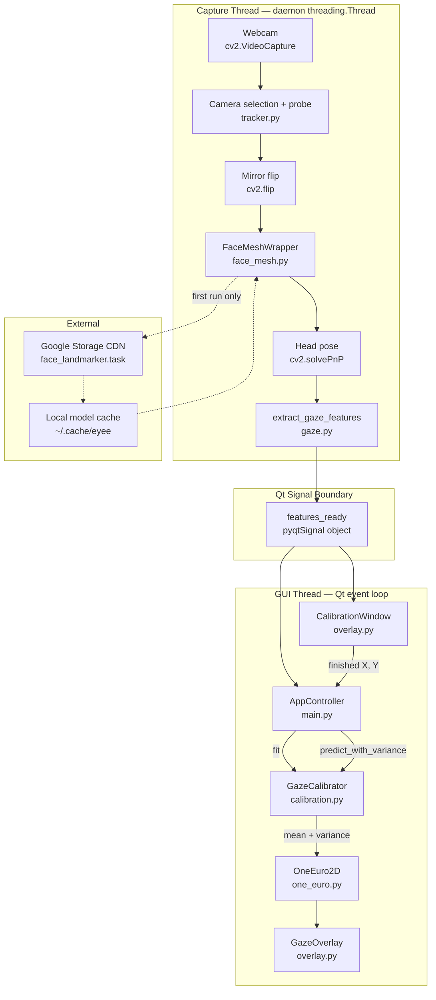
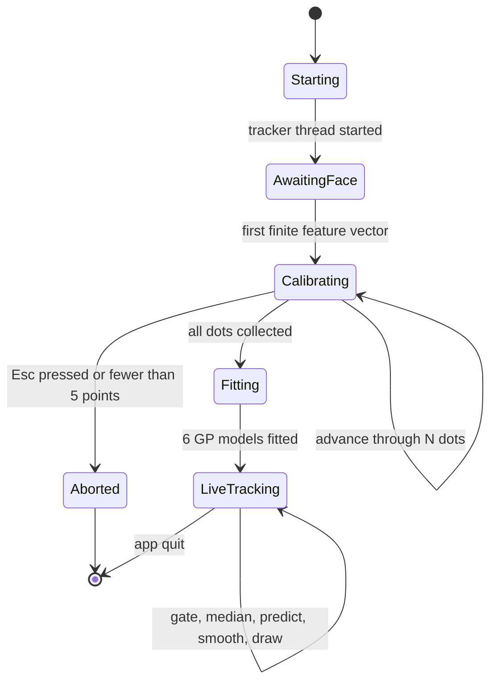
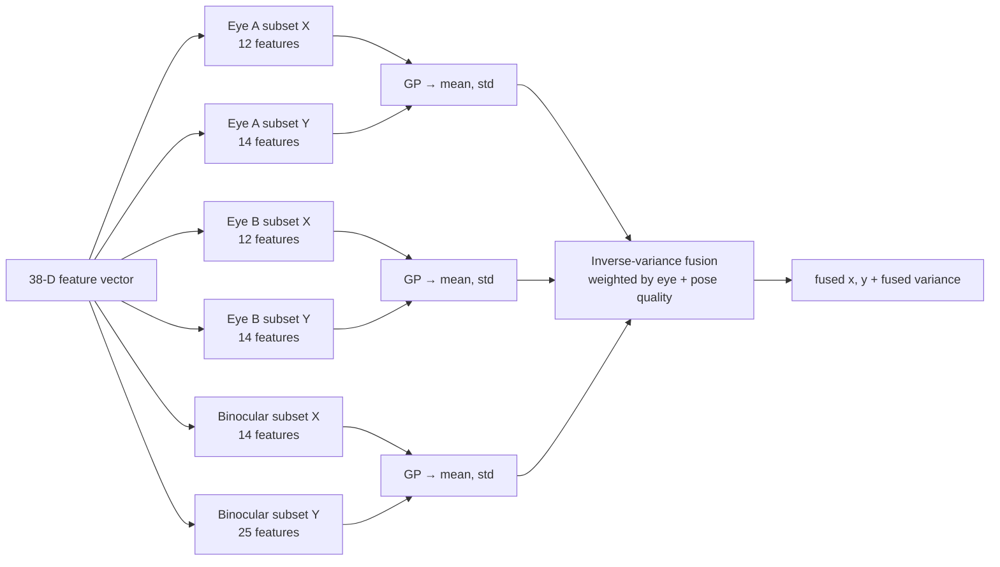

# Architecture Diagrams — EyeTracker System Overview

**Date**: 2026-08-06
**Source**: [docs/architecture/current/00-system-overview.md](../architecture/current/00-system-overview.md)
**Analyzed By**: ARCHITECT

> Human-readable preview. Contains only the Mermaid diagrams extracted from the system overview, for review by BA / product stakeholders without reading the full analysis.

---

## 1. System Architecture — Components & Threading

How a webcam frame becomes a dot on screen. The dashed lines are the one-time model download that happens on first run only.

---

## 2. Runtime Modes

The application has exactly two sequential modes. Note there is **no path back to calibration** once live tracking begins — recalibrating requires restarting the app.

---

## 3. Prediction Model Structure

Calibration does not train one model — it trains **six** Gaussian Process regressors (three regressors × two screen axes), each reading a different subset of the 38 features. Their outputs are fused by confidence, so a partially occluded or squinting eye automatically loses influence.

---

**Diagram count**: 3 (1 component/threading flowchart, 1 state diagram, 1 model-structure flowchart)
