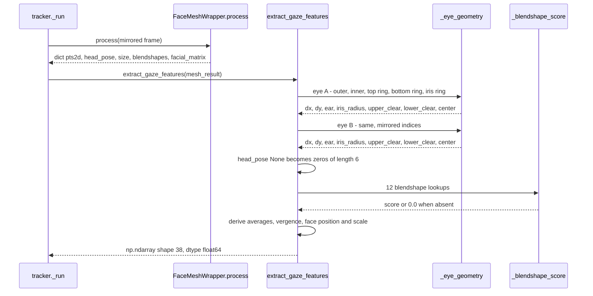
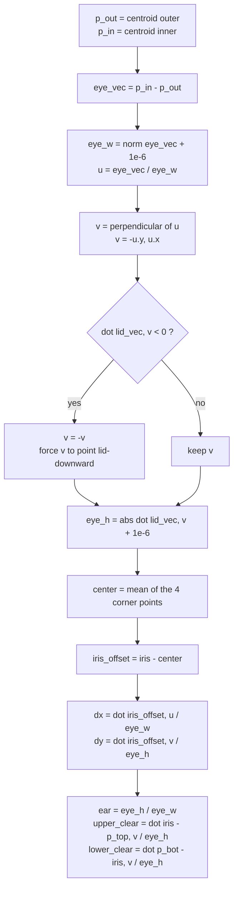

# Architecture Diagrams — Gaze Feature Extraction

**Date**: 2026-08-06
**Source**: [docs/architecture/current/01-gaze-deep-dive.md](../architecture/current/01-gaze-deep-dive.md)
**Analyzed By**: ARCHITECT

> Human-readable preview. Contains only the Mermaid diagrams extracted from the deep-dive, for review by BA / product stakeholders without reading the full analysis.

---

## 1. Frame → 38-D Feature Vector

The full extraction path for one camera frame. Note the two silent fallbacks: a missing head pose becomes six zeros, and missing blendshapes make 12 of the 38 features read as `0.0` — in both cases indistinguishable from a genuinely perfect reading.

---

## 2. Eye-Local Coordinate Frame

The module's central algorithm, and the reason gaze measurements survive head tilt. The vertical axis `v` is rebuilt from the eye's own landmarks every frame rather than taken from the image axes.

**Verified**: rotating the same eye geometry by 0°, 10°, 25° and 40° produced bit-identical `dx`, `dy` and `ear` values to 9 decimal places.

