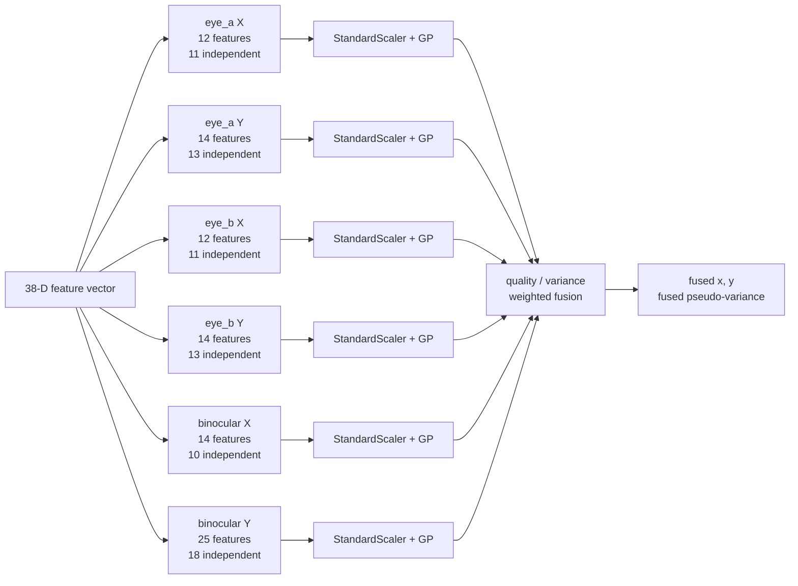

# Architecture Diagrams — Calibration & Prediction

**Date**: 2026-08-06
**Source**: [docs/architecture/current/02-calibration-deep-dive.md](../architecture/current/02-calibration-deep-dive.md)
**Analyzed By**: ARCHITECT

> Human-readable preview. Contains only the Mermaid diagrams extracted from the deep-dive, for review by BA / product stakeholders without reading the full analysis.

---

## 1. Calibration Fit — One-Shot and Blocking

Six Gaussian Processes are fitted when calibration completes. All of it runs on the Qt GUI thread, so the interface is frozen with no progress indication for the whole duration — 30 marginal-likelihood optimisations in total.

```mermaid
sequenceDiagram
  participant CW as CalibrationWindow
  participant AC as AppController._on_calib_done
  participant GC as GazeCalibrator.fit
  participant SR as _ScreenRegressor.fit
  participant SK as sklearn

  CW->>AC: finished(X shape n by 38, Y shape n by 2)
  Note over AC: runs on the Qt GUI thread — UI is frozen from here
  AC->>AC: reject if X is None or len(X) < 5
  AC->>GC: fit(X, Y)
  GC->>GC: keep rows where all X and all Y are finite
  loop 3 regressors: eye_a, eye_b, binocular
    GC->>SR: fit(X_filtered, Y_filtered)
    SR->>SR: Xx = X[:, feat_idx_x] ; Xy = X[:, feat_idx_y]
    SR->>SK: scaler_x.fit(Xx) ; scaler_y.fit(Xy)
    SR->>SK: gp_x.fit(scaled Xx, Y[:,0]) — 5 optimiser runs
    SR->>SK: gp_y.fit(scaled Xy, Y[:,1]) — 5 optimiser runs
  end
  GC-->>AC: _fitted = True
  Note over AC: 6 GPs x 5 optimiser runs complete before the event loop resumes
```

---

## 2. Live Prediction with Variance Fusion

Every frame evaluates all six Gaussian Processes and blends the three model predictions, weighting each by its own confidence divided by its own variance.

**Verified**: the `pose_quality` term is a common factor across all three weights, so it cancels exactly from the fused point. It changes only the reported variance — and therefore only how hard the dot is smoothed.

```mermaid
sequenceDiagram
  participant AC as AppController._on_feat
  participant GC as GazeCalibrator.predict_with_variance
  participant QW as _quality_weight
  participant EA as eye_a
  participant EB as eye_b
  participant BN as binocular

  AC->>GC: predict_with_variance(median of last k frames)
  GC->>GC: raise RuntimeError if not fitted
  GC->>QW: feat, A_EAR, A_BLINK, A_SQUINT
  QW-->>GC: quality_a
  GC->>QW: feat, B_EAR, B_BLINK, B_SQUINT
  QW-->>GC: quality_b
  GC->>GC: pose_quality from YAW and PITCH, clipped to 0.25..1.0
  GC->>GC: weights = qa*pq, qb*pq, sqrt(qa*qb)*pq
  loop each of the 3 models
    GC->>EA: predict(feat) — scale subset, then 2 GP predicts with return_std
    EA-->>GC: mean 2-vector, std 2-vector
    GC->>GC: var = max(std^2, 1e-6) ; w = quality / var
    GC->>GC: fused_num += mean*w ; fused_den += w
  end
  GC-->>AC: fused = num/den, fused_var = 1/den
```

---

## 3. Model Structure — Six Independent Regressors

Not one model but three, each with a different feature subset per screen axis. The annotations show how many of each subset's columns are exactly determined by the others — the binocular models, which carry the most weight at neutral head pose, are also the most redundant.


