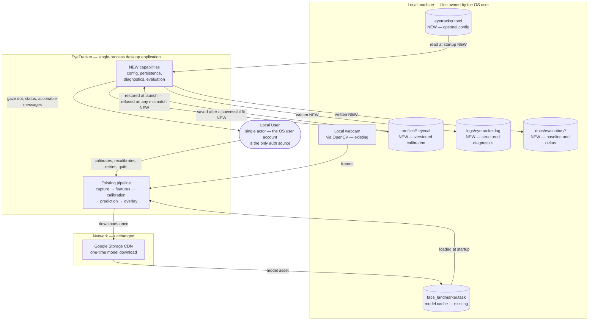
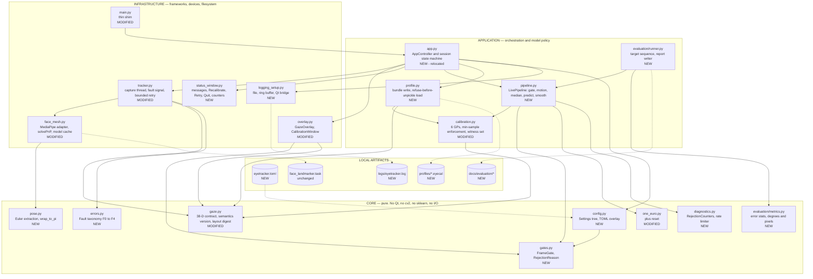
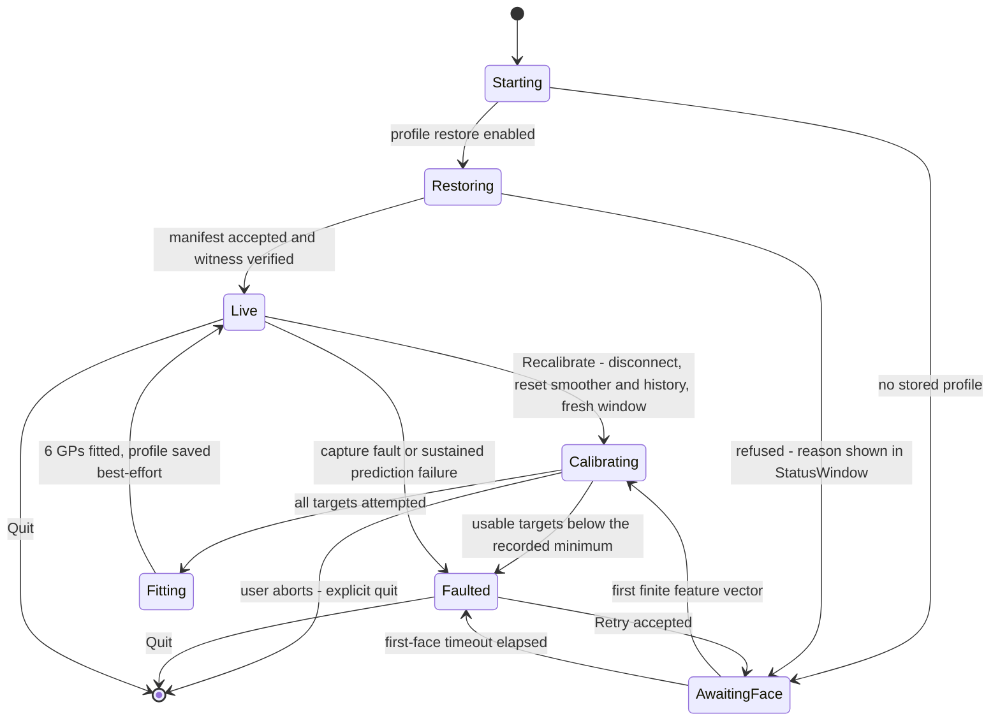
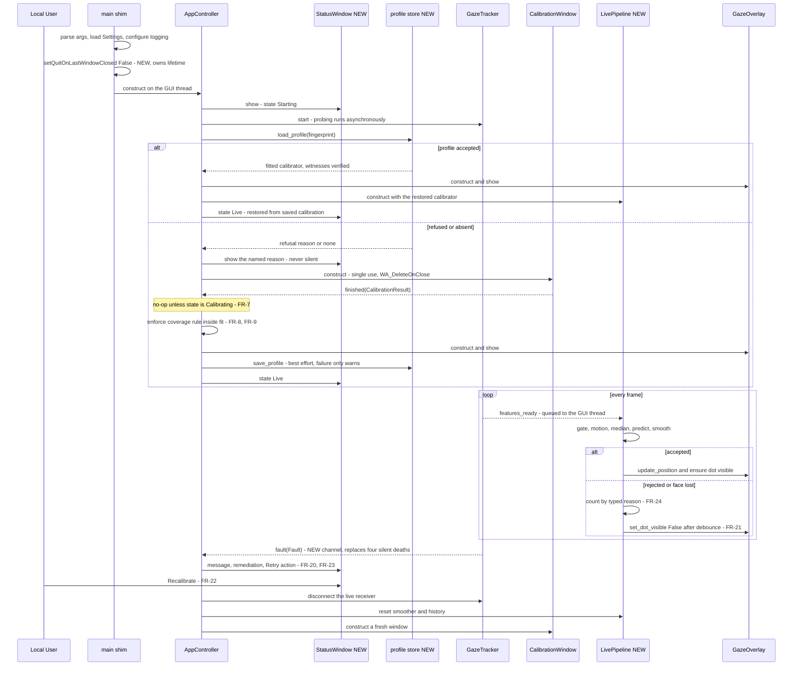
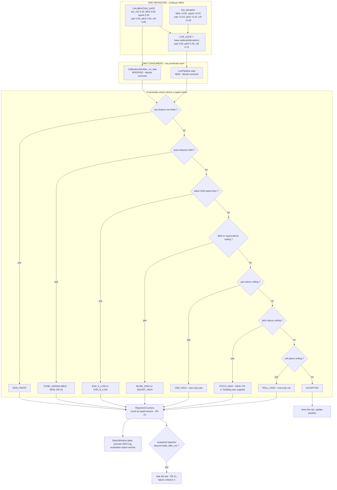
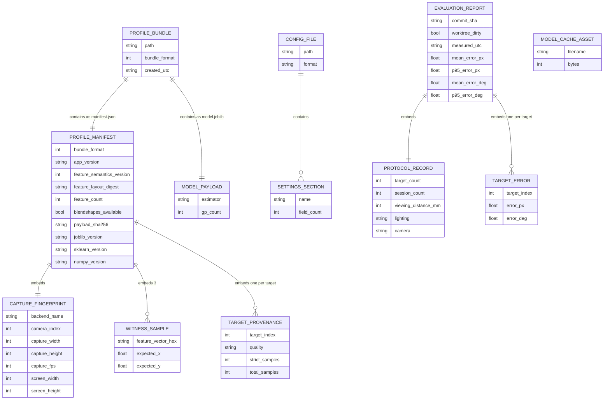
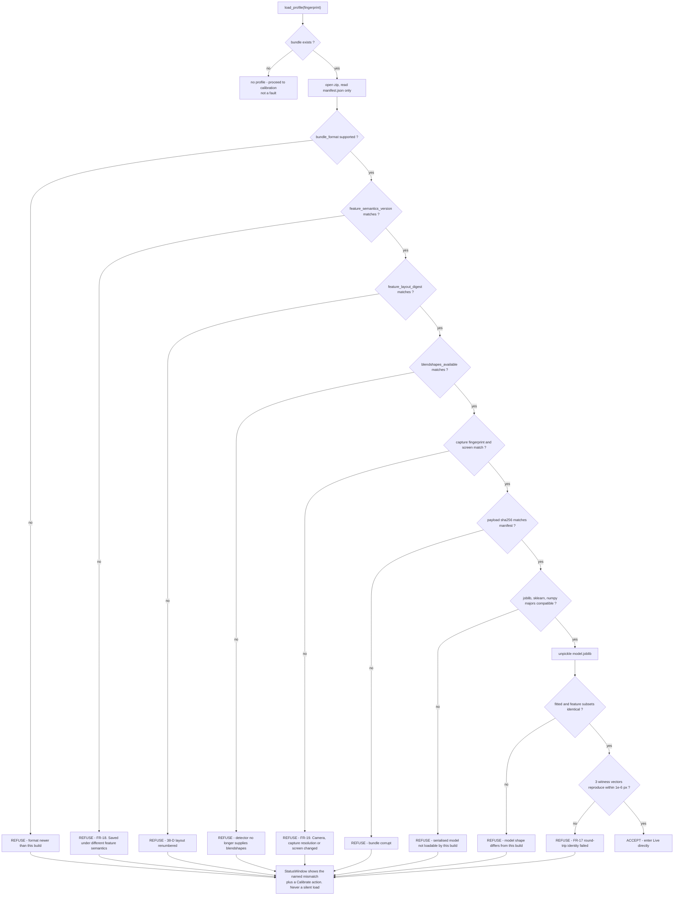
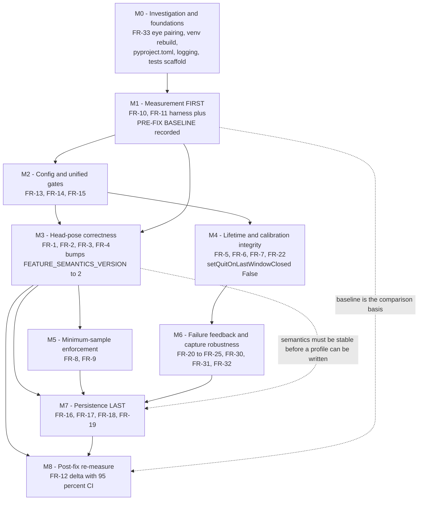

# Target Architecture Diagrams — EyeTracker

**Source**: `docs/architecture/design/02-target-architecture-brownfield.md`
**Generated**: 2026-08-07

> Mermaid diagrams extracted verbatim from the target architecture document for easy preview.
> Annotations follow the source: NEW / MODIFIED / unchanged.

---

## Target System Context

---

## Component Architecture (Target)

---

## Session State Machine

---

## Target Lifecycle Sequence

---

## Gate Resolution and Rejection Accounting

---

## Data Model — Local Artifacts

---

## Profile Load — Refuse Before Unpickle

---

## Migration Phase Dependencies

---
