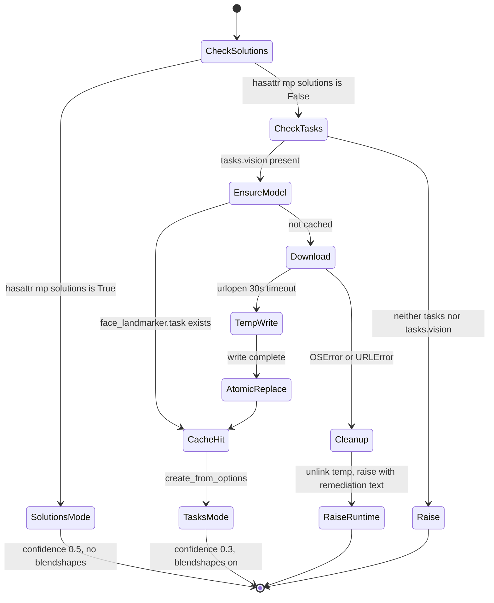
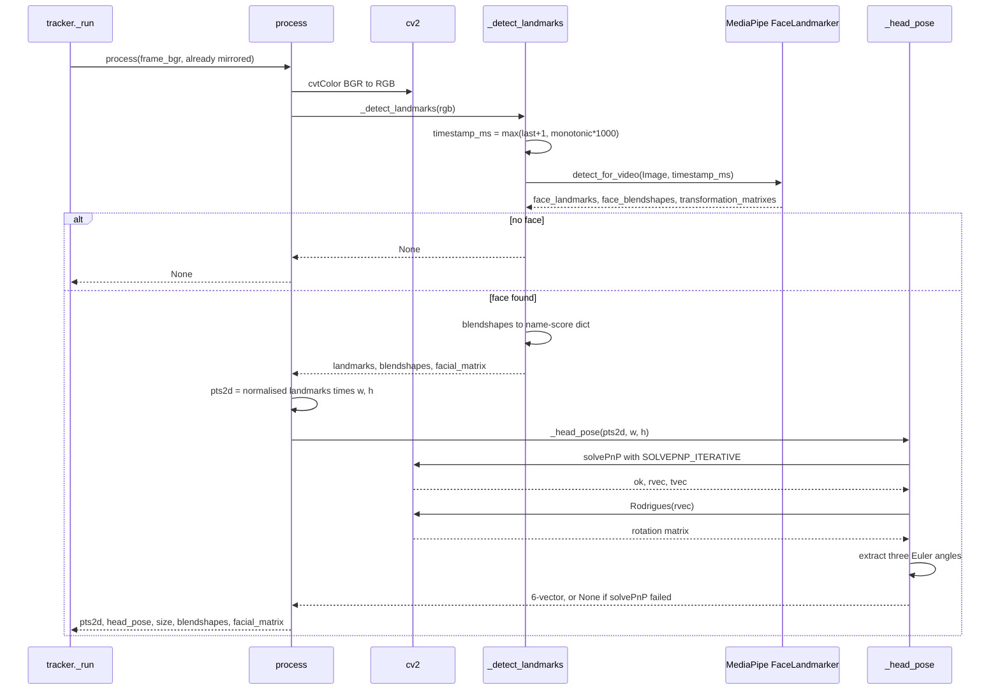
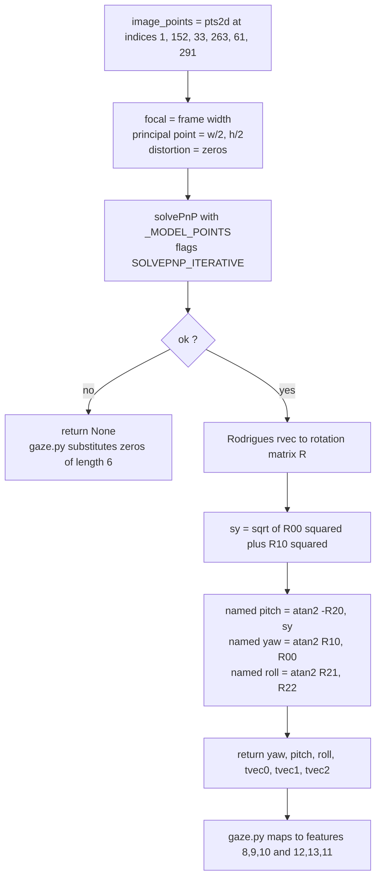

# Architecture Diagrams — Landmark Adapter & Head Pose

**Date**: 2026-08-06
**Source**: [docs/architecture/current/03-face-mesh-deep-dive.md](../architecture/current/03-face-mesh-deep-dive.md)
**Analyzed By**: ARCHITECT

> Human-readable preview. Contains only the Mermaid diagrams extracted from the deep-dive, for review by BA / product stakeholders without reading the full analysis.

---

## 1. Construction and Backend Selection

Two MediaPipe APIs are supported, but under every version this project has ever pinned, the `SolutionsMode` branch **cannot execute** — the right-hand path is always taken. The unreachable branch carries different confidence thresholds and would zero out 12 of the 38 features if it ever activated.

---

## 2. Per-Frame Detection

One frame in, one `mesh_result` dict out. Note that `facial_matrix` — MediaPipe's own head-pose estimate, computed from all 478 landmarks — is extracted, published, and then read by nobody. The system pays for it, discards it, and re-derives a less-informed pose from 6 landmarks instead.

---

## 3. Head-Pose Extraction

**This is where the deep-dive's most consequential finding lives.** The three `atan2` expressions each correctly recover a rotation, but each result is bound to the wrong name:

| Named | Actually measures |
|---|---|
| `yaw` | **roll** — head tilt |
| `pitch` | **yaw** — head turn |
| `roll` | **pitch** — nod, offset by ±π |

Verified by projecting a synthetic head and rotating each camera axis by a known 15°. The consequence is that the frame-rejection gates act on the wrong axes, and nodding is never gated at all.

