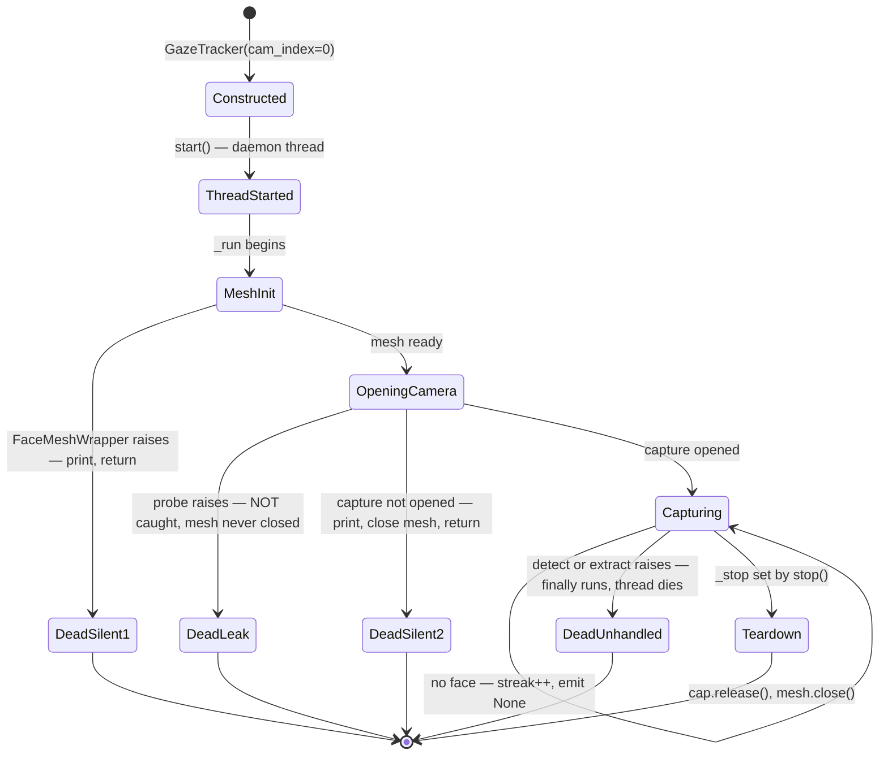
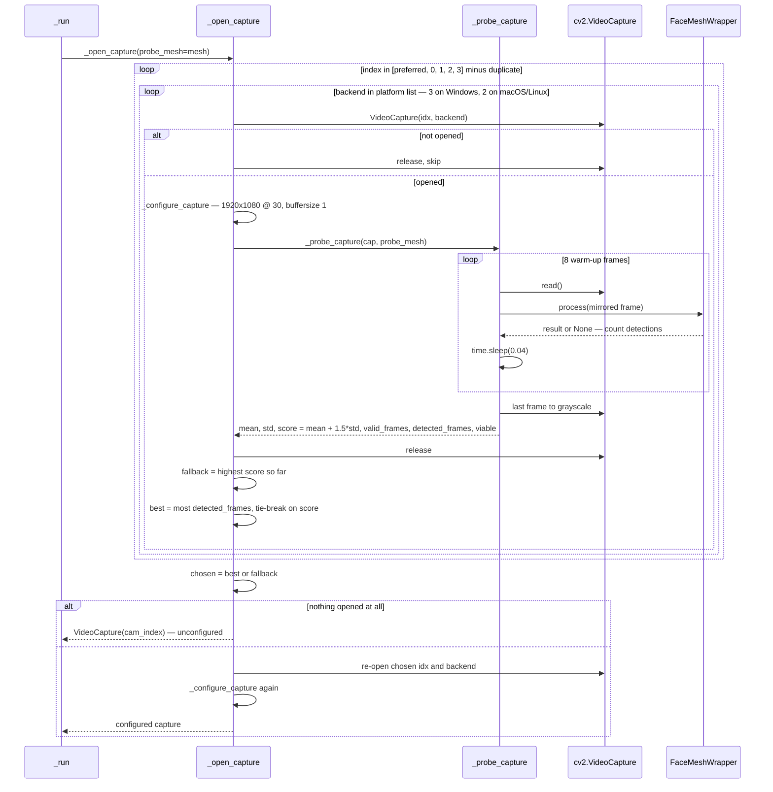
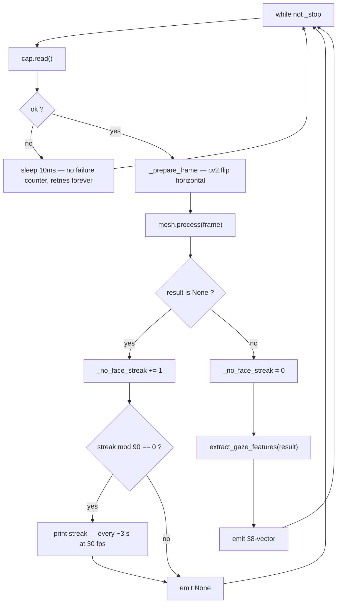

# Architecture Diagrams — Capture Thread & Camera Selection

**Date**: 2026-08-06
**Source**: [docs/architecture/current/04-tracker-deep-dive.md](../architecture/current/04-tracker-deep-dive.md)
**Analyzed By**: ARCHITECT

> Human-readable preview. Contains only the Mermaid diagrams extracted from the deep-dive, for review by BA / product stakeholders without reading the full analysis.

---

## 1. Capture Thread Lifecycle and Failure Paths

**Four distinct death paths, none of which reach the user.** When any of them fires, the Qt event loop keeps running and the calibration window displays "Center your face in the camera to start calibration" indefinitely. This is the user-visible symptom of every startup failure in the system.

---

## 2. Camera Discovery and Ranking

Cameras are chosen by **whether a face was actually detected**, not by "first device that opens" — a genuinely good design that correctly prefers a dim front-facing webcam over a bright capture card.

The cost is startup latency: up to 12 index × backend combinations are probed serially, each with 8 warm-up frames and 320 ms of deliberate sleeping. The user sees no indication that any of this is happening.

---

## 3. The Capture Loop

One iteration per camera frame. Note that a read failure retries forever with no counter and emits nothing, so a camera unplugged mid-session is indistinguishable from a steady gaze — and neither `mesh.process` nor `extract_gaze_features` is wrapped in an exception handler, so a single transient error terminates the producer permanently.

