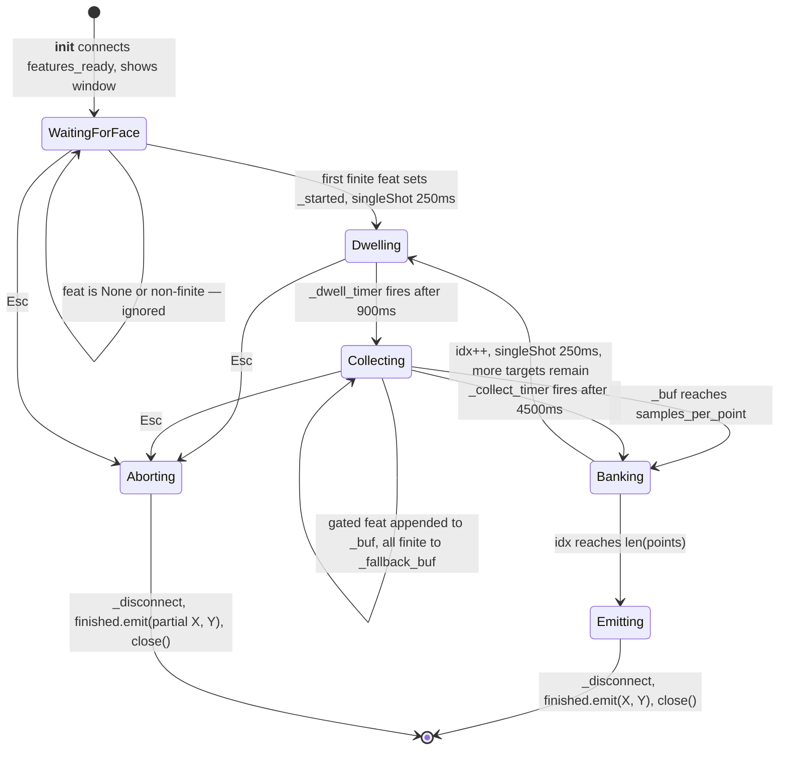
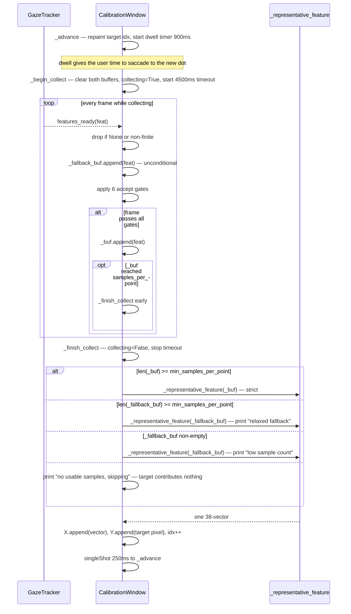
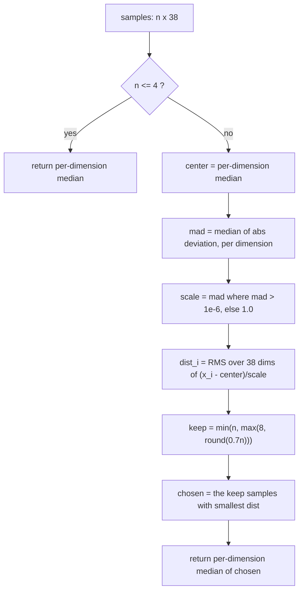

# Architecture Diagrams — UI Windows & Calibration State Machine

**Date**: 2026-08-06
**Source**: [docs/architecture/current/05-overlay-deep-dive.md](../architecture/current/05-overlay-deep-dive.md)
**Analyzed By**: ARCHITECT

> Human-readable preview. Contains only the Mermaid diagrams extracted from the deep-dive, for review by BA / product stakeholders without reading the full analysis.

---

## 1. The Calibration State Machine

The transition marked **Banking → Dwelling** is where a reproduced defect lives. It is scheduled by a static timer that the teardown path cannot cancel, so pressing Esc during that 250 ms window leaves the closed window still running — and it eventually reports completion a **second** time.

In the shipped configuration that second report arrives roughly 107 seconds after the user thought they had cancelled, triggering a second multi-second freeze and a duplicated overlay.

---

## 2. Per-Target Cycle and Sample Selection

Two buffers are filled in parallel: a strict one that applies six quality gates, and a permissive one that accepts every finite frame. If the gates prove too tight for a given camera or user, calibration **degrades in quality instead of hanging** — a deliberate and well-commented anti-deadlock measure.

The gap is the last fallback branch, which accepts any non-empty buffer. A target can therefore be represented by a single raw frame, and nothing in the emitted data records which targets were degraded.

---

## 3. Representative Sample Selection

Outlier-resistant selection: normalise each of the 38 dimensions by its median absolute deviation, rank samples by distance from the centre, discard the worst 30%, then take the median of what remains. Resilient to blinks and saccades mid-collection.

One caveat: the `max(8, ...)` floor means that for buffers of 8 or fewer samples, **no trimming happens at all** — precisely the degraded targets that most need it.

