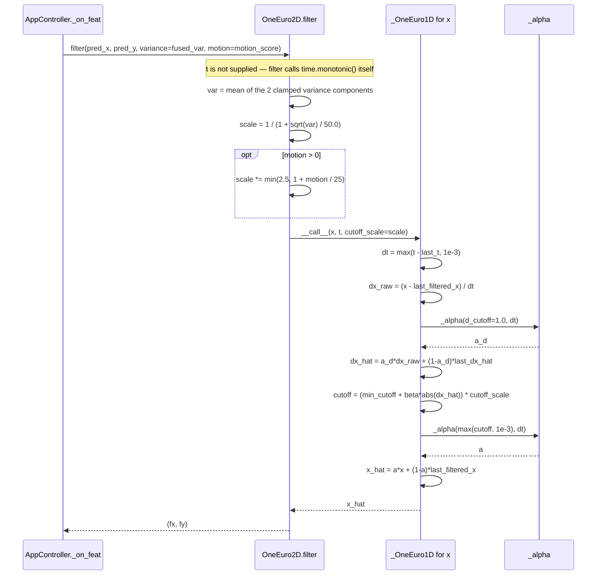
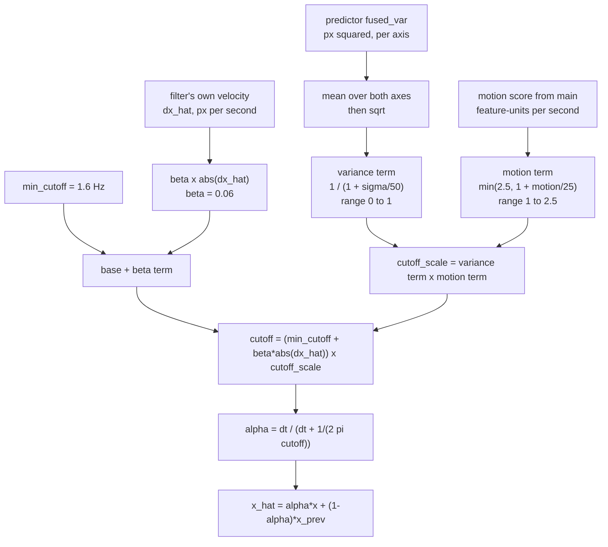

# Architecture Diagrams — One Euro Smoothing

**Date**: 2026-08-06
**Source**: [docs/architecture/current/06-one-euro-deep-dive.md](../architecture/current/06-one-euro-deep-dive.md)
**Analyzed By**: ARCHITECT

> Human-readable preview. Contains only the Mermaid diagrams extracted from the deep-dive, for review by BA / product stakeholders without reading the full analysis.

---

## 1. One Filtered Sample

The last stage in the pipeline — this is what determines how the dot's motion actually *feels*. Heavy smoothing when the gaze is still, near-zero latency when it moves.

**Measured**: a 500 px jump reaches 90% of its target in a single frame (0.03 s) under normal conditions, and still within 6 frames (0.20 s) when the predictor is highly uncertain. Note that the caller never passes `t`, so the filter reads the clock itself — a second clock read for a frame the caller has already timestamped.

---

## 2. Three Signals, One Cutoff

Three independent inputs modulate how hard the dot is smoothed. Two of them — the filter's own velocity estimate and the externally supplied motion score — measure essentially the same thing in different units, so **motion adaptivity is applied twice**. Nothing in the code acknowledges the overlap.

The per-axis variance from the predictor is averaged into a single scalar before use, so a confident vertical axis is smoothed as hard as an uncertain horizontal one.

