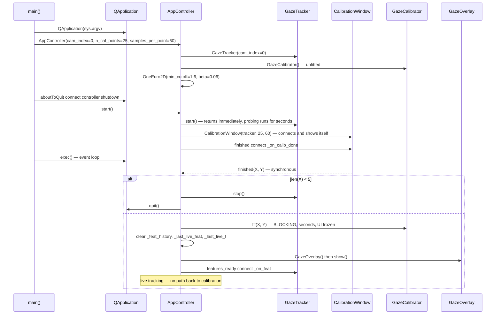
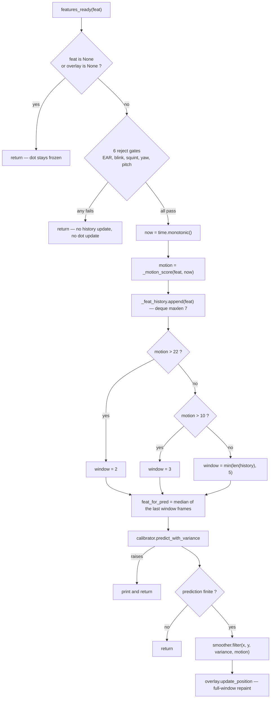
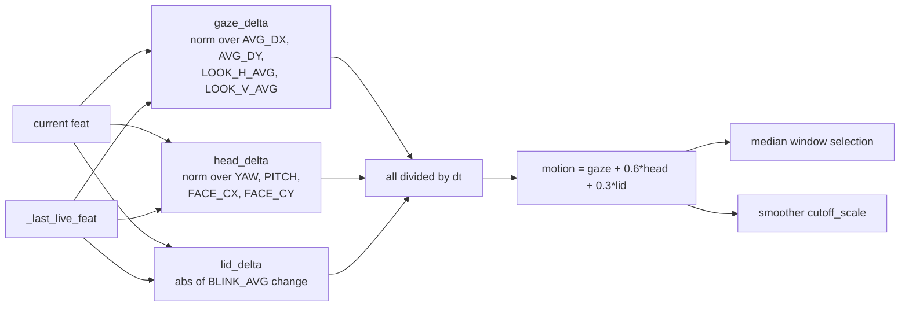

# Architecture Diagrams — Orchestration & Live Pipeline

**Date**: 2026-08-06
**Source**: [docs/architecture/current/07-main-deep-dive.md](../architecture/current/07-main-deep-dive.md)
**Analyzed By**: ARCHITECT

> Human-readable preview. Contains only the Mermaid diagrams extracted from the deep-dive, for review by BA / product stakeholders without reading the full analysis.

---

## 1. Application Lifecycle

The two-stage lifecycle: calibrate, then track. There is **no path back** — any calibration problem requires restarting the application and re-running a 79-to-141-second ritual.

The transition hides a verified constraint. The application survives losing the calibration window only because the overlay is created **synchronously** inside the `finished` handler, before `close()` runs. Moving the blocking fit to a worker thread — the obvious fix for the frozen UI — makes the app **exit silently** the moment calibration completes.

---

## 2. The Live Per-Frame Pipeline

Six reject gates, a motion-adaptive temporal median, six Gaussian Process evaluations, and a smoothing pass — all on the GUI thread, every frame.

Every one of the five `return` paths drops the frame **silently**. Nothing counts rejections or records why, which makes any "the dot is sluggish" report undiagnosable. A rejected frame also leaves the dot frozen at its last position rather than hiding it, so a lost face looks identical to a steady gaze.

---

## 3. Motion Score Composition

Three rates of change combined by two hand-tuned weights. The three channels have different units — ratios, radians, and blendshape scores — and the weights `0.6` and `0.3` are the only reconciliation between them.

The resulting scalar is then compared against absolute thresholds (22.0, 10.0) and divided by 25.0 in the smoother, so five constants across two modules are jointly tuned to a composite whose scale is an accident of how features are normalised elsewhere.

