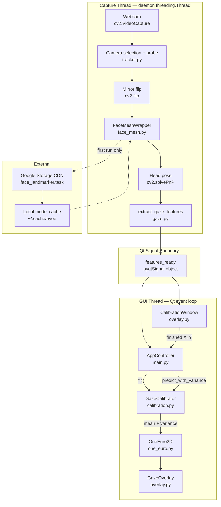
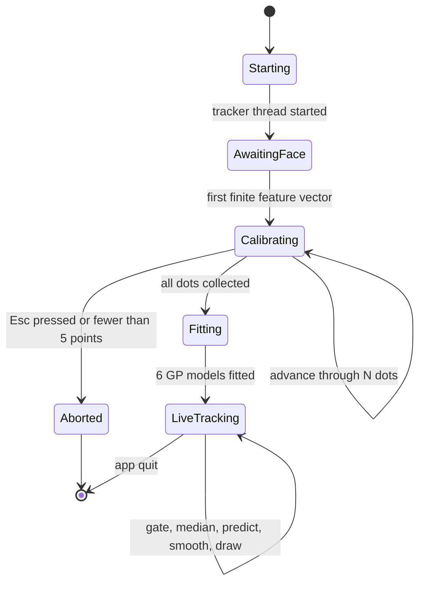
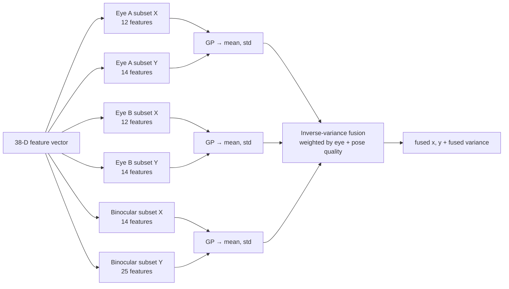

# System Overview - EyeTracker

**Date**: 2026-08-06
**Analyzed By**: ARCHITECT
**Status**: Confirmed — user-confirmed 2026-08-06
**Revised**: 2026-08-06 — environment/dependency facts updated after remediation; application-source findings unchanged

---

## Executive Summary

EyeTracker is a single-process Python desktop application that estimates where a user is looking on their screen using only a consumer webcam. It extracts a 38-dimensional geometric and expression feature vector from MediaPipe face landmarks, learns a per-session mapping from those features to screen pixels via Gaussian Process regression during a full-screen calibration ritual, then renders a live click-through red dot at the predicted gaze point.

The system is entirely local — no backend, no database, no persistence. Its only network call is a one-time download of the MediaPipe face-landmarker model to a user cache directory.

> **Analysis basis**: All statements below were derived by reading the 1,295 lines of application source and the committed dependency metadata. There is no README in this repository, so nothing here is inherited from prose documentation.

---

## System Architecture

### Architecture Diagram



### Runtime Mode Diagram

The application has exactly two sequential runtime modes. There is no path back to calibration once live tracking starts.



### Architecture Style

**Layered pipeline inside a single-process desktop monolith**, with one producer thread feeding a Qt event-driven consumer layer.

| Attribute | Finding | Evidence |
|-----------|---------|----------|
| Process model | Single process, single OS-level worker thread + Qt GUI thread | [tracker.py:37-40](eye_tracker/tracker.py#L37-L40) |
| Concurrency primitive | `threading.Thread(daemon=True)` producing into a `pyqtSignal` | [tracker.py:39](eye_tracker/tracker.py#L39), [tracker.py:25](eye_tracker/tracker.py#L25) |
| Thread hand-off | Qt auto-connection. Both receivers are created on the GUI thread, so emissions from the capture thread are queued to the GUI thread | [main.py:66](main.py#L66), [overlay.py:117](eye_tracker/overlay.py#L117) |
| Coupling direction | Strictly one-way: capture → features → prediction → render. No module imports upward | verified across all 8 files |
| Dependency shape | `main` → `{tracker, calibration, one_euro, overlay}`; `tracker` → `{face_mesh, gaze}`; `gaze`/`calibration`/`overlay` → index constants only | import blocks of each module |
| Shared mutable state | None across threads. The feature vector is a fresh `np.ndarray` per frame, emitted by value | [gaze.py:173-212](eye_tracker/gaze.py#L173-L212) |
| Persistence | None. Calibration is discarded on exit | no serialization call exists in any module |

**Implicit contract worth noting:** correctness of the threading model depends on `AppController` and `CalibrationWindow` being constructed on the GUI thread so that Qt selects a queued connection. This is true today but is nowhere asserted or documented in code.

---

## Technology Stack

> **⚠️ Environment remediated after this analysis (2026-08-06).** The stack below has two columns: **as analysed** (the committed macOS virtualenv, which is what discovery found) and **as rebuilt** (the working Windows environment created during remediation). Both are recorded because downstream workflows need the current reality, while the original state explains the findings. See Technical Debt for what changed and why.

| Category | Technology | As analysed (macOS venv) | As rebuilt (local) | Notes |
|----------|------------|--------------------------|--------------------|-------|
| Language | Python | 3.12.7 (Anaconda) | **3.14.6** | Original from `.venv/pyvenv.cfg`; 3.12 is not installed on this machine |
| Vision — landmarks | mediapipe | 0.10.33 | **0.10.35** | Tasks API only in both; see Dead Branch below |
| Vision — capture/geometry | opencv-python | 4.11.0.86 | **4.14.0.94** | Capture, colour conversion, `solvePnP`, `Rodrigues` |
| Vision — extra | opencv-contrib-python | 4.11.0.86 *(undeclared)* | **4.14.0.94** *(now declared)* | **Transitive dependency of mediapipe** — not a stray install. No contrib symbol is used in source, but it ships the same `cv2` package, so its major must match `opencv-python` |
| Numerics | numpy | 1.26.4 | **2.5.1** | No numpy 1.x wheel exists for CPython 3.14; code uses no API removed in numpy 2.0 |
| Scientific | scipy | 1.17.1 | **1.18.0** | **Never imported by application code**; now undeclared and arrives transitively via scikit-learn |
| ML — regression | scikit-learn | 1.8.0 | **1.9.0** | `GaussianProcessRegressor`, `StandardScaler` |
| GUI | PyQt6 | 6.11.0 | **6.11.0** | Windows, painting, timers, signals |
| Build tooling | — | — | — | **None.** No `pyproject.toml`, `setup.py`, or `setup.cfg` — still outstanding |
| Testing | — | — | — | **None.** No test framework declared or installed — still outstanding |

**Dependency declaration change.** `requirements.txt` previously used open-ended floors, which on any modern interpreter resolve to `opencv-python` 5.x and `mediapipe` 1.x — majors the codebase has never been validated against. It now carries upper bounds, declares `opencv-contrib-python` explicitly to keep the `cv2` major aligned, and drops the unused `scipy` entry.

**Verification performed on the rebuilt environment** (synthetic data; no hardware): all 6 core libraries and all 8 application modules import; `extract_gaze_features` returns a finite 38-D vector with all 12 blendshape features populated; `_eye_geometry`, `_OneEuro1D`, `OneEuro2D`, `_representative_feature`, `_quality_weight` behave correctly; a full `GazeCalibrator.fit` → `predict_with_variance` round-trip over 25 synthetic points fits all 6 GPs and recovers the centre target exactly; `cv2.solvePnP`/`Rodrigues` and all referenced `CAP_*` constants are present. 21/21 checks passed.

**Not verified** (requires a webcam and a human): capture, camera auto-selection, landmark detection on a real face, calibration UX, and end-to-end gaze accuracy.

**Observed during verification, unconfirmed on real data:** the GP fit emits sklearn `ConvergenceWarning`s indicating `length_scale` saturates the upper bound `1e2` and `noise_level` the lower bound `1e-6` ([calibration.py:154-164](eye_tracker/calibration.py#L154-L164)). The synthetic fixture is near-noiseless so boundary saturation is expected there; whether it also occurs on real calibration data is a question for deep-dive, not a confirmed defect.

### Dead Branch: the MediaPipe Solutions path is unreachable

[face_mesh.py:80-89](eye_tracker/face_mesh.py#L80-L89) branches on `hasattr(mp, "solutions")` and prefers the legacy `mp.solutions.face_mesh.FaceMesh` API. With the installed version that branch **cannot execute**:

```python
# .venv/.../mediapipe/__init__.py — the entire public surface
import mediapipe.tasks.python as tasks
from mediapipe.tasks.python.vision.core.image import Image
from mediapipe.tasks.python.vision.core.image import ImageFormat
__version__ = '0.10.33'
```

No `solutions` attribute exists, so `hasattr` returns `False` and the Tasks path at [face_mesh.py:97-109](eye_tracker/face_mesh.py#L97-L109) is always taken.

**Empirically confirmed on both versions** — executed against the rebuilt environment (mediapipe 0.10.35): `hasattr(mp, "solutions")` → `False`, `hasattr(mp.tasks, "vision")` → `True`, and all 12 blendshape-derived features measured non-zero. So the conclusion holds across 0.10.33 and 0.10.35, not just by reading `__init__.py`.

Two consequences that matter downstream:

1. **Blendshapes are always populated.** The Tasks path sets `output_face_blendshapes=True`, so features 26–37 carry real values. Had the Solutions path been live, `_detect_landmarks` would return `"blendshapes": None` ([face_mesh.py:134-138](eye_tracker/face_mesh.py#L134-L138)), `_blendshape_score` would return `0.0` for every lookup ([gaze.py:73-76](eye_tracker/gaze.py#L73-L76)), and 12 of the 38 features would be constant zeros — silently degrading calibration and disabling the blink/squint gates entirely.
2. **The confidence thresholds differ per branch** (0.5 in Solutions, 0.3 in Tasks), so the effective detection sensitivity is the Tasks value.

The branch is therefore a compatibility shim for older MediaPipe whose behaviour has never been exercised under the current pin.

---

## Module Overview

| Module | Path | Responsibility | Dependencies | LOC |
|--------|------|----------------|--------------|-----|
| Entry / Orchestration | [main.py](main.py) | `AppController`: wires tracker→calibrator→smoother→overlay, live-frame gating, motion scoring, temporal median | tracker, calibration, one_euro, overlay, gaze constants | 141 |
| Capture | [eye_tracker/tracker.py](eye_tracker/tracker.py) | `GazeTracker`: camera discovery/probing, capture loop, per-frame feature emission | face_mesh, gaze, cv2, PyQt6 | 171 |
| Landmark adapter | [eye_tracker/face_mesh.py](eye_tracker/face_mesh.py) | `FaceMeshWrapper`: MediaPipe dual-API shim, model download/cache, `solvePnP` head pose, landmark index constants | mediapipe, cv2, numpy | 184 |
| Feature extraction | [eye_tracker/gaze.py](eye_tracker/gaze.py) | `extract_gaze_features`: 38-D vector, eye-local geometry, blendshape reads, all `FEATURE_*` indices | face_mesh constants, numpy | 212 |
| Calibration / prediction | [eye_tracker/calibration.py](eye_tracker/calibration.py) | `GazeCalibrator`: 3 regressors × 2 axes = 6 GPs, quality weighting, inverse-variance fusion | gaze constants, sklearn, numpy | 257 |
| Smoothing | [eye_tracker/one_euro.py](eye_tracker/one_euro.py) | `OneEuro2D`: 1€ filter with variance- and motion-adaptive cutoff | numpy | 63 |
| UI | [eye_tracker/overlay.py](eye_tracker/overlay.py) | `GazeOverlay` click-through dot; `CalibrationWindow` dot sequencer + robust sample selection | gaze constants, PyQt6, numpy | 267 |
| Package marker | [eye_tracker/__init__.py](eye_tracker/__init__.py) | Empty — declares no public API | — | 0 |

### Core Data Contract — the 38-D feature vector

Every consumer indexes this vector by the `FEATURE_*` constants in [gaze.py:26-64](eye_tracker/gaze.py#L26-L64). It is the single most important interface in the system: `gaze.py` writes it, and `main.py`, `calibration.py`, and `overlay.py` all read it by index.

| Idx | Constant | Group | Source |
|-----|----------|-------|--------|
| 0–3 | `A_DX`,`A_DY`,`B_DX`,`B_DY` | Per-eye iris offset, eye-local normalised | landmark geometry |
| 4–5 | `AVG_DX`,`AVG_DY` | Binocular mean offset | derived |
| 6–7 | `A_EAR`,`B_EAR` | Eye aspect ratio (openness) | landmark geometry |
| 8–13 | `YAW`,`PITCH`,`ROLL`,`TZ`,`TX`,`TY` | Head pose — 6-DoF | `cv2.solvePnP` |
| 14–15 | `VERGENCE_X`,`VERGENCE_Y` | Inter-eye offset difference | derived |
| 16–17 | `A_IRIS_RADIUS`,`B_IRIS_RADIUS` | Apparent iris size — depth proxy | iris ring landmarks |
| 18–21 | `A/B_UPPER_CLEAR`,`A/B_LOWER_CLEAR` | Iris-to-lid clearances | landmark geometry |
| 22–25 | `FACE_CX`,`FACE_CY`,`FACE_SCALE`,`INTEROCULAR` | Face position and scale in frame | landmark geometry |
| 26–29 | `A/B_LOOK_H`,`A/B_LOOK_V` | Directional gaze | MediaPipe blendshapes |
| 30–33 | `A/B_BLINK`,`A/B_SQUINT` | Lid state | MediaPipe blendshapes |
| 34–37 | `LOOK_H_AVG`,`LOOK_V_AVG`,`BLINK_AVG`,`SQUINT_AVG` | Binocular means | derived |

**Notable design choice:** vertical gaze is computed in an *eye-local* frame — the vertical axis is derived per-frame as the perpendicular of the outer→inner eye vector, sign-corrected against the lid vector ([gaze.py:90-95](eye_tracker/gaze.py#L90-L95)). This makes `dy` invariant to head roll rather than relying on the raw image axis.

### Prediction Model Structure

`GazeCalibrator` does not fit one model. It fits **three regressors** — eye-A-only, eye-B-only, and binocular — each with a **separate feature subset per screen axis**, giving six independent `GaussianProcessRegressor` instances, each with its own `StandardScaler`.



Fusion weight per model is `quality / variance`, where quality combines an EAR-derived openness term, a blink/squint penalty, and a shared head-pose penalty ([calibration.py:197-256](eye_tracker/calibration.py#L197-L256)). The resulting **fused variance is propagated forward** into the smoother, which widens its cutoff when the prediction is uncertain ([one_euro.py:53-58](eye_tracker/one_euro.py#L53-L58)). This uncertainty path is the most architecturally sophisticated aspect of the system.

---

## Entry Points

| Type | Path/Command | Description |
|------|--------------|-------------|
| Desktop app | `python main.py` | Sole entry point — [main.py:132-141](main.py#L132-L141) |
| Library import | `import eye_tracker.*` | Package is importable but `__init__.py` is empty, so consumers must import submodules directly |
| CLI arguments | *none* | `QApplication(sys.argv)` passes argv to Qt only; no `argparse`. Camera index and calibration density are hardcoded at the call site |

**Startup parameter override:** `AppController.__init__` defaults to `n_cal_points=9, samples_per_point=30`, but `main()` constructs it with `n_cal_points=25, samples_per_point=60` ([main.py:134](main.py#L134)). The class defaults are therefore never used in the running application — a 25-dot, 60-sample calibration is the real behaviour.

---

## External Dependencies

### Python Packages (Key)

| Package | Purpose | Imported in |
|---------|---------|-------------|
| `mediapipe` | Face landmarks (478 pts) + blendshapes + facial transform matrix | face_mesh.py |
| `opencv-python` | Camera capture, colour conversion, mirror flip, `solvePnP`, `Rodrigues` | tracker.py, face_mesh.py |
| `numpy` | Feature vectors, all geometry and statistics | every module except `__init__` |
| `scikit-learn` | `GaussianProcessRegressor`, kernels, `StandardScaler` | calibration.py |
| `PyQt6` | Windows, painting, timers, cross-thread signals | main.py, tracker.py, overlay.py |
| `scipy` | **Not imported anywhere in application code** | — |

### External Services

| Service | Purpose | Integration | Failure mode |
|---------|---------|-------------|--------------|
| Google Storage CDN (`storage.googleapis.com/mediapipe-models/...`) | One-time download of `face_landmarker.task` | `urllib.request.urlopen`, 30 s timeout, atomic temp-then-`replace` | Raises `RuntimeError` with a remediation message ([face_mesh.py:67-70](eye_tracker/face_mesh.py#L67-L70)); caught in `_run` and printed, after which the capture thread exits and the GUI shows nothing |
| Local webcam | Frame source | OpenCV, platform-ranked backends: `AVFOUNDATION`/`DSHOW`+`MSMF`/`V4L2` | Falls back across 4 indices × 3 backends; ultimately prints "failed to open webcam" |

**Model cache location** is platform-branched to a project name that no longer matches this repository: `~/Library/Caches/Eyee` on macOS, `~/.cache/eyee` elsewhere ([face_mesh.py:43-46](eye_tracker/face_mesh.py#L43-L46)).

---

## Design References (Legacy Documentation)

**Location**: `SPEC/references/`

| File | Type | Description | Relevance |
|------|------|-------------|-----------|
| *(none)* | — | Directory contains only empty `builds/` and `devops/` subfolders | — |

**Note**: No legacy PRD, architecture diagram, UI design, or specification was available. Nothing in this document is constrained by prior reference material — every finding is derived directly from source. No `.docx`/`.pdf` required `aire read`.

---

## Test Infrastructure

| Type | Location | Framework | Coverage |
|------|----------|-----------|----------|
| Unit | *absent* | *none* | 0% |
| Integration | *absent* | *none* | 0% |
| E2E | *absent* | *none* | 0% |

**There is no test infrastructure of any kind.** Verified absent: `tests/`, `test_*.py`, `*_test.py`, `conftest.py`, `pytest.ini`, `tox.ini`, and any test dependency in `requirements.txt`.

Per the brownfield rulebook's red-flag rule ("Large module with no tests → document as risk"), **all seven functional modules qualify**. The highest-risk untested units are the pure, easily-testable ones where a silent numerical regression would be invisible: `_eye_geometry` and `extract_gaze_features` ([gaze.py](eye_tracker/gaze.py)), `_OneEuro1D.__call__` ([one_euro.py](eye_tracker/one_euro.py)), `_representative_feature` ([overlay.py:21-33](eye_tracker/overlay.py#L21-L33)), and `_quality_weight` ([calibration.py:197-203](eye_tracker/calibration.py#L197-L203)).

---

## Configuration

| File | Purpose |
|------|---------|
| [requirements.txt](requirements.txt) | Dependency constraints — the only declarative artifact. Bounded on both sides as of the 2026-08-06 remediation |
| [.gitignore](.gitignore) | AIRE-managed block (`SPEC/`, `.claude/`) plus a manually-maintained project block below the end marker: venvs, bytecode, build/test/lint caches, OS and editor noise |
| [.gitattributes](.gitattributes) | AIRE-managed; `docs/status.md merge=union` |
| ~~`.getignore`~~ | **Removed** 2026-08-06 — was misnamed and therefore inert; see Technical Debt |
| `.mcp.json` | Claude Code MCP server config — tooling, not application config |

**There is no application configuration layer.** No `.env`, no config module, no CLI flags, no settings file. Every tunable is a literal in source:

| Parameter | Value | Location |
|-----------|-------|----------|
| Camera index / resolution / FPS | `0` / 1920×1080 / 30 | [tracker.py:27](eye_tracker/tracker.py#L27) |
| Camera viability thresholds | mean ≥ 25.0, std ≥ 10.0, score = mean + 1.5·std | [tracker.py:75-76](eye_tracker/tracker.py#L75-L76) |
| Calibration dots / samples | 25 / 60 | [main.py:134](main.py#L134) |
| Dwell / collect timeout | 900 ms / 4500 ms | [overlay.py:86-87](eye_tracker/overlay.py#L86-L87) |
| Live reject gates | EAR < 0.16, blink > 0.58, squint > 0.58, yaw > 0.70, pitch > 0.55 | [main.py:94-101](main.py#L94-L101) |
| Calibration accept gates | EAR < 0.16, blink > 0.55, squint > 0.55, yaw > 0.60, pitch > 0.45 | [overlay.py:181-188](eye_tracker/overlay.py#L181-L188) |
| Motion→window thresholds | 22.0 → 2 frames, 10.0 → 3, else 5 | [main.py:106-111](main.py#L106-L111) |
| Motion score weights | `gaze + 0.6·head + 0.3·lid` | [main.py:85](main.py#L85) |
| Smoother params | `min_cutoff=1.6`, `beta=0.06`, `variance_scale=50.0` | [main.py:35](main.py#L35), [one_euro.py:45](eye_tracker/one_euro.py#L45) |
| GP kernel bounds / restarts | `RBF(1e-2,1e2)`, `White(1e-6,1e1)`, `n_restarts=4` | [calibration.py:154-164](eye_tracker/calibration.py#L154-L164) |
| Dot radius / colour | 14 px, RGBA(255,40,40,210) | [overlay.py:76-78](eye_tracker/overlay.py#L76-L78) |

The **live and calibration gates use different thresholds** (0.58/0.70/0.55 vs 0.55/0.60/0.45), duplicated as two independent literal blocks. Tuning one without the other silently creates a train/serve mismatch — samples accepted for fitting under one envelope are predicted under a wider one.

---

## Key Observations

### Strengths

- **Clean, acyclic module boundaries.** Each of the seven modules owns exactly one concern, and the dependency graph is strictly one-directional. No circular imports, no module reaching upward into its caller.
- **Named feature indices instead of magic offsets.** [gaze.py:26-64](eye_tracker/gaze.py#L26-L64) defines all 38 indices as constants, and every consumer imports them by name. This is the single practice most responsible for the codebase remaining legible at 1,295 LOC.
- **Principled uncertainty propagation.** GP predictive standard deviation → inverse-variance model fusion → adaptive filter cutoff is a coherent chain, not a heuristic bolt-on. Low-confidence predictions are automatically smoothed harder.
- **Genuinely robust statistics in calibration sampling.** `_representative_feature` performs MAD-normalised distance ranking and keeps the closest 70% before taking a median ([overlay.py:21-33](eye_tracker/overlay.py#L21-L33)) — resilient to saccades and blinks mid-collection.
- **Roll-invariant eye geometry.** Deriving the vertical axis per-frame from the eye vector rather than the image axis ([gaze.py:90-95](eye_tracker/gaze.py#L90-L95)) is a deliberate, correct choice most implementations skip.
- **Camera selection driven by actual face detection**, not just "first device that opens" — candidates are scored by detected-face count and then by brightness/contrast ([tracker.py:86-132](eye_tracker/tracker.py#L86-L132)).
- **Deliberate cross-platform handling** with explanatory comments: capture backends per OS, macOS `Tool`-window focus-loss workaround, macOS full-screen Space avoidance, platform cache paths.
- **Anti-deadlock fallback in calibration.** A strict buffer and a relaxed buffer are collected in parallel so over-tight thresholds degrade sample quality instead of hanging the ritual ([overlay.py:200-217](eye_tracker/overlay.py#L200-L217)).

### Areas of Concern

- **Zero automated tests across 1,295 LOC.** Every numerical invariant is unverified.
- **Blocking GP fit on the GUI thread.** `calibrator.fit` is called inside the `_on_calib_done` slot ([main.py:60](main.py#L60)), which runs on the Qt event loop. Six `GaussianProcessRegressor` fits with `n_restarts_optimizer=4` over 25 samples run synchronously — the UI is frozen and unresponsive, with no progress indication, for the entire fit.
- **Silent failure with no user feedback.** If landmark init fails ([tracker.py:141-143](eye_tracker/tracker.py#L141-L143)) or the camera cannot open ([tracker.py:146-148](eye_tracker/tracker.py#L146-L148)), the capture thread prints to stdout and returns. The Qt event loop keeps running with no window ever shown — from the user's perspective the app launched and did nothing.
- **`print()` as the only diagnostic channel.** Nine `print` sites across four modules; no `logging`, no levels, no destination control. A GUI app launched from a desktop shortcut discards all of it.
- **Broad exception swallow in the hot path.** `except Exception` around prediction ([main.py:115](main.py#L115)) prints and drops the frame. A persistent model fault degrades to a silently frozen dot rather than a surfaced error.
- **Duplicated, divergent gate thresholds** between calibration and live inference (see Configuration) — a train/serve skew hazard with no single source of truth.
- **No calibration persistence.** Every launch requires a full 25-dot ritual; nothing is serialized despite `GazeCalibrator` being trivially picklable.
- **Single-monitor assumption.** Both windows size themselves to `QApplication.primaryScreen().geometry()` ([overlay.py:56](eye_tracker/overlay.py#L56), [overlay.py:98](eye_tracker/overlay.py#L98)). Gaze targets on secondary displays are unrepresentable, and predictions are clipped to the primary screen's bounds.
- **`_grid` ignores its `n` argument beyond bucketing.** The `n <= 25` branch always emits exactly 25 points and the `else` branch always emits 25 ([overlay.py:130-141](eye_tracker/overlay.py#L130-L141)); `n_points` selects a layout tier, not a count. The parameter name overstates what it controls.
- **Calibration abort still fits when ≥5 points exist.** Pressing Esc emits whatever was collected ([overlay.py:235-239](eye_tracker/overlay.py#L235-L239)); with 5–8 sparse points the guard at [main.py:55](main.py#L55) passes and the app proceeds to live tracking on a badly under-determined model.
- **No teardown path for the live stage.** `features_ready` is connected to `_on_feat` and never disconnected; `GazeOverlay` is never closed except by app exit.
- **`solvePnP` uses a fixed focal-length guess** (`focal = frame width`) with zero distortion ([face_mesh.py:163-167](eye_tracker/face_mesh.py#L163-L167)). Head-pose translation values (`TX`,`TY`,`TZ` — features 11–13) are consequently in arbitrary units and camera-dependent, yet are fed directly to the regressors.

### Technical Debt

> Items marked ✅ **RESOLVED** were remediated on 2026-08-06, after this analysis was confirmed. They are retained rather than deleted so the original findings stay traceable — and so `aire-brownfield-plan` does not schedule work that is already done.

- ✅ **RESOLVED — the virtualenv was committed to git.** 14,251 of 14,269 tracked files (99.9%) lived under `.venv/`. It was built on macOS — 221 tracked `.dylib` files, and `pyvenv.cfg` recorded `command = /opt/anaconda3/bin/python -m venv /Users/raminm/Downloads/Eyee/.venv`. It could not function on Windows, and it made `python` inside the repo resolve to a broken shim. In fact it was three environments fused: a Windows Python 3.10 `Scripts/` skeleton, a macOS 3.12 `bin/`, and a macOS `pyvenv.cfg`. *Fix: untracked (kept on disk, then replaced with a clean CPython 3.14.6 venv); `.venv/` added to `.gitignore` below the AIRE auto-managed block. Tracked files 14,269 → 9.*
- ✅ **RESOLVED — compiled bytecode was committed.** Eight `__pycache__/*.cpython-312.pyc` files were tracked, including a stale `main.cpython-312.pyc` at the repo root. *Fix: untracked; `__pycache__/` and `*.py[cod]` added to `.gitignore`.*
- ✅ **RESOLVED — `.getignore` was a misnamed, inert ignore file.** Its contents (`eye_tracker/`, `__pycache__/`, `*.pyc`, `*.pyo`, `*.pyd`, `log/`) showed the intended exclusions, but git never reads that filename — `eye_tracker/` was tracked (14 files), proving it had no effect. Renaming it as-is would have **untracked the entire application package**, since `eye_tracker/` was its first entry. *Fix: deleted (recoverable from history); superseded by proper `.gitignore` rules that deliberately exclude the venv and bytecode but not the source.*
- ✅ **RESOLVED — dependency declarations drifted from reality.** `scipy` was declared but never imported; `opencv-contrib-python` was installed but undeclared; every constraint was an open-ended floor. *Fix: upper bounds added to prevent uncontrolled major jumps to opencv 5.x / mediapipe 1.x; `opencv-contrib-python` declared explicitly so its `cv2` major stays aligned with `opencv-python` (left unpinned it resolves to 5.x against opencv-python 4.x, and both ship the same `cv2` package); unused `scipy` entry dropped.*
- 🟡 **Dead compatibility branch** — the `mp.solutions` path in [face_mesh.py:80-89](eye_tracker/face_mesh.py#L80-L89) is unreachable under mediapipe 0.10.33 and 0.10.35, and has never run against any pinned version. It carries different confidence thresholds (0.5 vs 0.3) and would zero out 12 features if it ever activated. **Still outstanding** — a decision is needed: drop the branch, or keep it and lower the mediapipe floor so it is actually reachable and testable.
- 🟡 **No packaging metadata.** `eye_tracker` is laid out as an installable package but has no `pyproject.toml`/`setup.py`, so it can only be imported from the repo root via implicit path resolution. **Confirmed concretely during remediation**: running a script from outside the repo root fails with `ModuleNotFoundError: No module named 'eye_tracker'` unless `PYTHONPATH` is set. This will block any test runner placed in a `tests/` directory.
- 🟡 **Empty `eye_tracker/__init__.py`** — the package declares no public surface, forcing all consumers to reach into submodules and leaving no seam at which to stabilise an API.
- 🟡 **Stale project identity.** The model cache path uses `Eyee`/`eyee` ([face_mesh.py:43-46](eye_tracker/face_mesh.py#L43-L46)) while the repository is `EyeTracker`; the committed venv originates from `~/Downloads/Eyee`. A rename was never completed.
- 🟡 **Unbounded `_no_face_streak`** increments forever and is only used modulo 90 for log throttling ([tracker.py:158-163](eye_tracker/tracker.py#L158-L163)) — harmless today, but it is the only unbounded counter in the capture loop.

### Open Questions for Requirements

These cannot be answered from code and need product input before target-state design:

1. Is multi-monitor support in scope, or is primary-display-only acceptable?
2. Should calibration persist across sessions, and if so keyed to what — user, camera, lighting?
3. What accuracy target exists? Nothing in the code measures or reports gaze error, so there is no baseline to compare against.
4. Is the gaze dot the end goal, or a debug view for a downstream consumer (dwell-click, scroll, analytics)?
5. Are accessibility users the intended audience? That would materially change the calibration-abort and failure-feedback requirements.

---

## Analysis Coverage

| Artifact | Status |
|----------|--------|
| Application source files read | 8 of 8 (100%) |
| Dependency versions verified against installed metadata | 9 of 9 |
| Reference documents reviewed | 0 available |
| Application source changes | **none** — `main.py` and `eye_tracker/` are byte-identical to the analysed state |
| Changes made during the 2026-08-06 remediation | `requirements.txt` (dependency bounds), `.gitignore` (project ignore block), `.getignore` (deleted), `.venv/` + `__pycache__/` (untracked, venv rebuilt) |

**Suggested deep-dive targets**, in descending order of downstream risk: `calibration.py` (model structure and fusion maths), `gaze.py` (the 38-D contract every other module depends on), `tracker.py` (threading and camera-selection state machine), `overlay.py` (calibration state machine and UI lifecycle).
