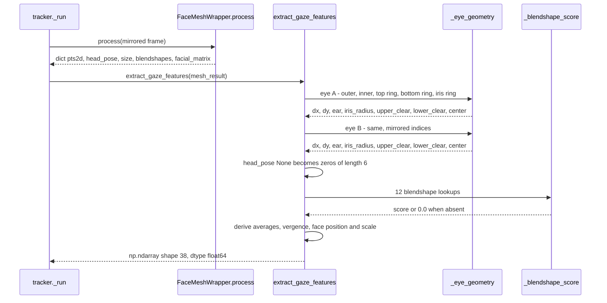
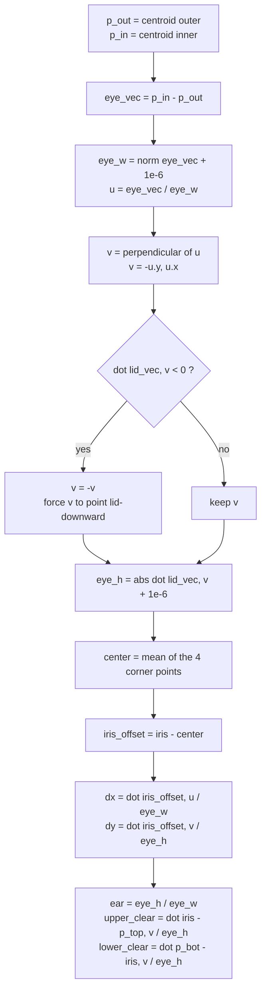

# Deep-Dive - Gaze Feature Extraction

**Date**: 2026-08-06
**Analyzed By**: ARCHITECT
**Status**: Draft

---

## Module Overview

**Purpose**: Convert one frame of MediaPipe face-landmark output into the fixed 38-dimensional feature vector that every downstream module consumes. This module owns the system's single most important interface — it is the only writer of the feature contract, and `main.py`, `calibration.py` and `overlay.py` are all readers.

**Path**: [eye_tracker/gaze.py](eye_tracker/gaze.py)
**Key Files**: 1 file, 212 lines
**Imports**: `math`, `numpy`, and 10 landmark-index constants from [face_mesh.py](eye_tracker/face_mesh.py#L15-L25)
**Imported by**: [calibration.py](eye_tracker/calibration.py#L7-L46) (38 constants), [main.py](main.py#L11-L24) (12 constants), [overlay.py](eye_tracker/overlay.py#L9-L16) (6 constants), [tracker.py](eye_tracker/tracker.py#L11) (the function)

> **Verification basis.** Findings marked ✅ **VERIFIED** were executed against the installed libraries with synthetic inputs; the script and its output are summarised in [Verification Record](#verification-record). Findings marked ⚠️ **UNVERIFIED** require a webcam and a human face and are stated as risks with a defined test, per the brownfield rulebook's "NO ASSUMPTIONS" rule.

---

## Component Breakdown

| Component | Lines | Visibility | Responsibility |
|-----------|-------|------------|----------------|
| `FEATURE_*` constants | [26-64](eye_tracker/gaze.py#L26-L64) | public | The 38 named vector indices + `FEATURE_COUNT` |
| `_EYE_*_RING` lists | [19-24](eye_tracker/gaze.py#L19-L24) | private | Landmark index groups for iris, upper lid, lower lid |
| `_centroid` | [67-70](eye_tracker/gaze.py#L67-L70) | private | Mean of a landmark group, or passthrough for a scalar index |
| `_blendshape_score` | [73-76](eye_tracker/gaze.py#L73-L76) | private | Safe dict lookup, defaulting to `0.0` |
| `_eye_geometry` | [79-115](eye_tracker/gaze.py#L79-L115) | private | All per-eye geometry in an eye-local frame — the mathematical core |
| `extract_gaze_features` | [118-212](eye_tracker/gaze.py#L118-L212) | **public API** | Assembles the 38-vector |

There are no classes. The module is purely functional and holds no state — every call is independent, which makes it the most testable unit in the codebase.

---

## Key Workflows

### Workflow: Frame → 38-D feature vector



### Workflow: Eye-local coordinate frame construction

This is the module's central algorithm and the reason gaze features survive head tilt.



**Why this matters**: `u` and `v` are derived per frame from the eye's own landmarks, so all offsets are expressed relative to the eye rather than to the image axes. In-plane head rotation rotates `u` and `v` with the eye, leaving `dx`, `dy`, `ear` and the clearances unchanged.

✅ **VERIFIED — roll invariance holds exactly.** The same synthetic eye geometry rotated in-plane by 0°, 10°, 25° and 40° produced bit-identical values:

| In-plane rotation | `A_DX` | `A_DY` | `A_EAR` |
|---|---|---|---|
| 0° | -0.097339443 | -0.106638013 | 0.393341995 |
| 10° | -0.097339443 | -0.106638013 | 0.393341995 |
| 25° | -0.097339443 | -0.106638013 | 0.393341995 |
| 40° | -0.097339443 | -0.106638013 | 0.393341995 |

The design intent recorded in the comment at [gaze.py:90](eye_tracker/gaze.py#L90) is met.

---

## Data Models

### The 38-D feature contract

`extract_gaze_features` returns `np.ndarray`, `shape=(38,)`, `dtype=float64`. Positional layout is fixed by the constants at [gaze.py:26-64](eye_tracker/gaze.py#L26-L64).

| Idx | Constant | Formula / source | Units | Nominal range |
|-----|----------|------------------|-------|---------------|
| 0 | `A_DX` | `dot(iris - center, u) / eye_w` | eye-widths | ~±0.25 |
| 1 | `A_DY` | `dot(iris - center, v) / eye_h` | eye-heights | ~±0.5 |
| 2 | `B_DX` | as 0, eye B | eye-widths | ~±0.25 |
| 3 | `B_DY` | as 1, eye B | eye-heights | ~±0.5 |
| 4 | `AVG_DX` | `0.5*(f0+f2)` | derived | ~±0.25 |
| 5 | `AVG_DY` | `0.5*(f1+f3)` | derived | ~±0.5 |
| 6 | `A_EAR` | `eye_h / eye_w` | ratio | 0.05–0.45 |
| 7 | `B_EAR` | as 6, eye B | ratio | 0.05–0.45 |
| 8 | `YAW` | `head[0]` from `solvePnP` | radians | see ⚠️ below |
| 9 | `PITCH` | `head[1]` | radians | see ⚠️ below |
| 10 | `ROLL` | `head[2]` | radians | see ⚠️ below |
| 11 | `TZ` | `head[5]` = `tvec[2]` | arbitrary | ~600 |
| 12 | `TX` | `head[3]` = `tvec[0]` | arbitrary | ~±50 |
| 13 | `TY` | `head[4]` = `tvec[1]` | arbitrary | ~±50 |
| 14 | `VERGENCE_X` | `f0 - f2` | derived | small |
| 15 | `VERGENCE_Y` | `f1 - f3` | derived | small |
| 16 | `A_IRIS_RADIUS` | `mean(‖ring - iris‖) / eye_w` | eye-widths | ~0.10–0.13 |
| 17 | `B_IRIS_RADIUS` | as 16, eye B | eye-widths | ~0.10–0.13 |
| 18 | `A_UPPER_CLEAR` | `dot(iris - p_top, v) / eye_h` | eye-heights | 0–1 |
| 19 | `A_LOWER_CLEAR` | `dot(p_bot - iris, v) / eye_h` | eye-heights | 0–1 |
| 20 | `B_UPPER_CLEAR` | as 18, eye B | eye-heights | 0–1 |
| 21 | `B_LOWER_CLEAR` | as 19, eye B | eye-heights | 0–1 |
| 22 | `FACE_CX` | `eye_mid.x / w - 0.5` | frame-widths | ~±0.3 |
| 23 | `FACE_CY` | `eye_mid.y / h - 0.5` | frame-heights | ~±0.3 |
| 24 | `FACE_SCALE` | `interocular / w` | frame-widths | ~0.15–0.35 |
| 25 | `INTEROCULAR` | `interocular / sqrt(w*h)` | mixed | ~0.2–0.47 |
| 26 | `A_LOOK_H` | `eyeLookOutLeft - eyeLookInLeft` | blendshape Δ | ±1 |
| 27 | `A_LOOK_V` | `eyeLookUpLeft - eyeLookDownLeft` | blendshape Δ | ±1 |
| 28 | `B_LOOK_H` | `eyeLookInRight - eyeLookOutRight` | blendshape Δ | ±1 |
| 29 | `B_LOOK_V` | `eyeLookUpRight - eyeLookDownRight` | blendshape Δ | ±1 |
| 30 | `A_BLINK` | `eyeBlinkLeft` | blendshape | 0–1 |
| 31 | `B_BLINK` | `eyeBlinkRight` | blendshape | 0–1 |
| 32 | `A_SQUINT` | `eyeSquintLeft` | blendshape | 0–1 |
| 33 | `B_SQUINT` | `eyeSquintRight` | blendshape | 0–1 |
| 34 | `LOOK_H_AVG` | `0.5*(f26+f28)` | derived | ±1 |
| 35 | `LOOK_V_AVG` | `0.5*(f27+f29)` | derived | ±1 |
| 36 | `BLINK_AVG` | `0.5*(f30+f31)` | derived | 0–1 |
| 37 | `SQUINT_AVG` | `0.5*(f32+f33)` | derived | 0–1 |

⚠️ Features 8/9/10 do **not** measure the head rotations their names claim. See [03-face-mesh-deep-dive.md](docs/architecture/current/03-face-mesh-deep-dive.md) — the axis labels are cyclically permuted and feature 10 carries a ±π discontinuity at the neutral head position. That finding is verified and it propagates into every consumer of this contract.

### Input contract — the `mesh_result` dict

| Key | Type | Required | Handling when absent |
|-----|------|----------|----------------------|
| `pts2d` | `ndarray (478, 2)` float64 | **yes** | `KeyError` — no guard |
| `size` | `(w, h)` ints | **yes** | `KeyError` — no guard |
| `blendshapes` | `dict[str, float]` or `None` | no | `or {}` at [122](eye_tracker/gaze.py#L122); all 12 features become `0.0` |
| `head_pose` | `ndarray (6,)` or `None` | no | `np.zeros(6)` at [143](eye_tracker/gaze.py#L143) — silently injects a perfectly neutral pose |
| `facial_matrix` | any | no | **never read by this module** |

Two of these fallbacks fail silently in ways a caller cannot detect:

- **Absent blendshapes** zero out features 26–37 — 12 of 38 dimensions become constants. The vector is still finite and still passes every `isfinite` check in the system, so calibration proceeds on a silently 26-dimensional problem and the blink/squint gates in [main.py:92-101](main.py#L92-L101) and [overlay.py:179-188](eye_tracker/overlay.py#L179-L188) can never trigger.
- **Absent head pose** substitutes exact zeros. `solvePnP` failure at [face_mesh.py:172-173](eye_tracker/face_mesh.py#L172-L173) is therefore indistinguishable from a perfectly centred head, and the pose gates read as "ideal".

Under the currently installed MediaPipe the blendshape path is always live (see [03](docs/architecture/current/03-face-mesh-deep-dive.md)), so the first case is latent rather than active — but it is one dependency change away from being active.

---

## Redundancy Analysis — 11 of 38 dimensions are exactly determined

✅ **VERIFIED.** 400 synthetic feature vectors with randomised eye geometry, blendshapes and head pose were generated and the centred feature matrix decomposed. **Numerical rank = 27 of 38**, giving exactly 11 exact linear dependencies. The last six singular values were identically zero.

Eight of the eleven are the intentional aggregates the contract already advertises as "derived":

| # | Identity | Intent |
|---|----------|--------|
| 1 | `f4 = 0.5*(f0+f2)` | documented aggregate |
| 2 | `f5 = 0.5*(f1+f3)` | documented aggregate |
| 3 | `f14 = f0 - f2` | documented aggregate |
| 4 | `f15 = f1 - f3` | documented aggregate |
| 5 | `f34 = 0.5*(f26+f28)` | documented aggregate |
| 6 | `f35 = 0.5*(f27+f29)` | documented aggregate |
| 7 | `f36 = 0.5*(f30+f31)` | documented aggregate |
| 8 | `f37 = 0.5*(f32+f33)` | documented aggregate |

The remaining **three are unintended** and are presented as independent measurements:

| # | Identity | Measured | Cause |
|---|----------|----------|-------|
| 9 | `f18 + f19 = 1` | min 0.999999965192, max 0.999999976548; `corr(f18,f19) = -1.000000000000` | Both clearances are normalised by `eye_h`, which is itself the lid separation along `v` — so they partition a unit interval by construction ([gaze.py:95-103](eye_tracker/gaze.py#L95-L103)) |
| 10 | `f20 + f21 = 1` | min 0.999999965122, max 0.999999976539; `corr = -1.000000000000` | same, eye B |
| 11 | `f25 = f24 * sqrt(w/h)` | ratio constant at 1.333333333102 across all 400 samples; `sqrt(1920/1080) = 1.333333333333`; `corr = +1.000000000000` | Both are `interocular` divided by a per-session constant ([gaze.py:149](eye_tracker/gaze.py#L149), [gaze.py:199](eye_tracker/gaze.py#L199)) |

Residuals of ~3.5e-8 on identities 9 and 10 are the `+1e-6` epsilon in `eye_h`, not measurement noise.

**Why this matters.** These are not cosmetic. `FEATURE_A_UPPER_CLEAR` and `FEATURE_A_LOWER_CLEAR` are both fed to the same Gaussian Process, as are `FACE_SCALE` and `INTEROCULAR` — so the regressors receive exactly duplicated (or exactly negated) input columns. After `StandardScaler` those columns become identical up to sign, which double-weights the underlying quantity inside the isotropic RBF distance. The per-subset accounting is in [02-calibration-deep-dive.md](docs/architecture/current/02-calibration-deep-dive.md#feature-subset-redundancy).

`FEATURE_INTEROCULAR`'s name is also misleading: it is not an interocular distance but interocular distance normalised by the geometric mean of the frame dimensions — a quantity with no clean physical interpretation.

---

## Sign Conventions — two channels disagree on "up"

`v` is forced to point from the upper lid toward the lower lid ([gaze.py:92-94](eye_tracker/gaze.py#L92-L94)). Image `y` grows downward, so `v` points down the screen and:

- `A_DY` / `B_DY` (features 1, 3) become **more positive as the user looks down**.
- `A_LOOK_V` / `B_LOOK_V` (features 27, 29) are `eyeLookUp − eyeLookDown`, so they become **more positive as the user looks up**.

Both are fed to the same Y-axis regressors. A Gaussian Process learns either polarity, so this is not a defect — but it is a trap for anyone adding a closed-form mapping, a sanity assertion, or a debug visualisation, and nothing in the code records it.

By contrast, the horizontal blendshape channel is deliberately sign-aligned: [gaze.py:152-163](eye_tracker/gaze.py#L152-L163) uses `Out − In` for eye A and `In − Out` for eye B, so a gaze to one side drives **both** features in the same direction. That asymmetry in the source is intentional and correct; it deserves a comment it does not have.

---

## ⚠️ UNVERIFIED RISK — landmark eye and blendshape eye may be different eyes

**The concern.** Feature group "A" is assembled from two independent sources that identify eyes by different mechanisms:

- **Geometry** comes from landmark indices `33 / 133 / 159 / 145 / 468` ([face_mesh.py:15-19](eye_tracker/face_mesh.py#L15-L19)) — MediaPipe's canonical index set for one specific eye.
- **Blendshapes** come from category names containing `Left` ([gaze.py:153-171](eye_tracker/gaze.py#L153-L171)) — MediaPipe's semantic label for one specific eye.

The frame is horizontally mirrored before detection ([tracker.py:134-136](eye_tracker/tracker.py#L134-L136)). Mirroring changes which physical eye occupies the position MediaPipe assigns to each canonical index and to each `Left`/`Right` label. Whether the index set and the name set land on the *same* physical eye after mirroring is not determinable from source alone, and the comment at [face_mesh.py:14](eye_tracker/face_mesh.py#L14) — "Eye A (image-right / user's left eye)" — describes an **unmirrored** frame, so it does not settle the question and is at best stale.

**Why it matters if the pairing is crossed.** `_quality_weight` in [calibration.py:197-203](eye_tracker/calibration.py#L197-L203) combines `FEATURE_A_EAR` (geometry) with `FEATURE_A_BLINK` and `FEATURE_A_SQUINT` (blendshapes) to decide how much to trust the eye-A regressor. If those describe different eyes, then closing one eye lowers the confidence of the regressor built on the *other*, still-perfectly-visible eye. The per-eye X and Y subsets would likewise mix one eye's iris offset with the other eye's gaze direction. Because normal binocular gaze is conjugate, the two eyes' signals are highly correlated and the fitted model would still work most of the time — which is exactly why this could persist unnoticed.

**Definitive test** (requires a webcam and a person; ~5 minutes):

1. Add a temporary print of `feat[6], feat[30], feat[7], feat[31]` — `A_EAR, A_BLINK, B_EAR, B_BLINK` — in `tracker._run` after [tracker.py:167](eye_tracker/tracker.py#L167).
2. Close one eye and hold it. Note which `*_EAR` collapses and which `*_BLINK` rises.
3. **Same letter** (`A_EAR` falls while `A_BLINK` rises) → pairing is correct, close this risk.
4. **Different letters** (`A_EAR` falls while `B_BLINK` rises) → pairing is crossed; either swap the blendshape names or swap the landmark constant sets, and re-verify.

Until step 2 is run, treat any per-eye quality weighting as unvalidated. Recorded as an open question for requirements.

---

## Pattern Catalog

### Pattern 1 — Named vector indices instead of magic offsets  ✅ [Current — the codebase's strongest convention]

Every position in the shared vector has a module-level constant, and all four consumers import them by name rather than indexing numerically.

**Example — the definition** ([gaze.py:26-64](eye_tracker/gaze.py#L26-L64)):

```python
FEATURE_A_DX = 0
FEATURE_A_DY = 1
...
FEATURE_SQUINT_AVG = 37
FEATURE_COUNT = 38
```

**Example — a consumer** ([main.py:92-93](main.py#L92-L93)):

```python
# DO: index the shared contract by name
blink = feat[FEATURE_BLINK_AVG]
squint = feat[FEATURE_SQUINT_AVG]

# DON'T: hard-code the offset — renumbering the contract silently changes meaning
blink = feat[36]
squint = feat[37]
```

This single practice is the main reason a 38-dimensional positional contract shared across four modules is still readable.

### Pattern 2 — Landmark groups as named ring constants  ⚠️ [Current — applied inconsistently]

Multi-point landmark groups are hoisted into module constants, but their contents re-inline the very indices that [face_mesh.py](eye_tracker/face_mesh.py#L15-L25) already names, and the named constants are then imported and never used.

**Example — the inconsistency** ([gaze.py:19-24](eye_tracker/gaze.py#L19-L24)):

```python
# CURRENT: EYE_A_IRIS and EYE_A_TOP are named constants, but 159/145/386/374
# are re-entered as literals, and the imported names go unused.
_EYE_A_IRIS_RING = [EYE_A_IRIS, 469, 470, 471, 472]   # mixes a constant with literals
_EYE_A_TOP_RING = [159, 160, 161]                     # 159 IS EYE_A_TOP
_EYE_A_BOTTOM_RING = [144, 145, 153]                  # 145 IS EYE_A_BOTTOM
_EYE_B_TOP_RING = [386, 387, 388]                     # 386 IS EYE_B_TOP
_EYE_B_BOTTOM_RING = [373, 374, 380]                  # 374 IS EYE_B_BOTTOM

# DO: reuse the named constants so the two files cannot drift apart
_EYE_A_TOP_RING = [EYE_A_TOP, 160, 161]
_EYE_A_BOTTOM_RING = [144, EYE_A_BOTTOM, 153]
```

Verified by search: `EYE_A_TOP`, `EYE_A_BOTTOM`, `EYE_B_TOP`, `EYE_B_BOTTOM` are imported at [gaze.py:7-16](eye_tracker/gaze.py#L7-L16) and referenced nowhere in the body. `FEATURE_COUNT` ([gaze.py:64](eye_tracker/gaze.py#L64)) is likewise defined and never used — the vector length is nowhere asserted against it.

### Pattern 3 — Epsilon-guarded division  ✅ [Current — consistent]

Every divisor that could vanish gets a small additive constant at the point of construction rather than a conditional at the point of use.

**Example** ([gaze.py:87](eye_tracker/gaze.py#L87), [95](eye_tracker/gaze.py#L95), [149-151](eye_tracker/gaze.py#L149-L151)):

```python
# DO: guard where the divisor is produced — one site, uniform magnitude
eye_w = float(np.linalg.norm(eye_vec)) + 1e-6
eye_h = abs(float(np.dot(lid_vec, v))) + 1e-6
face_scale = interocular / (float(w) + 1e-6)

# DON'T: guard at every use site, or leave it to chance
dx = np.dot(iris_offset, u) / eye_w if eye_w > 0 else 0.0
```

Applied at all six division sites in the module. Note the side effect: it is what makes the clearance identity sum to `1 − 3.5e-8` rather than exactly `1`.

### Pattern 4 — Missing-input defaults over exceptions  ⚠️ [Current — silent, needs a decision]

Optional inputs are replaced with neutral values rather than raising or signalling.

**Example** ([gaze.py:73-76](eye_tracker/gaze.py#L73-L76), [141-145](eye_tracker/gaze.py#L141-L145)):

```python
# CURRENT: absent data becomes an indistinguishable "perfect" reading
def _blendshape_score(blendshapes, name):
    if not blendshapes:
        return 0.0          # "no blink detected" and "no blendshapes at all" are identical
    return float(blendshapes.get(name, 0.0))

head = mesh_result.get("head_pose")
if head is None:
    head = np.zeros(6, dtype=np.float64)   # solvePnP failure looks like a perfectly centred head
```

Required inputs are handled the opposite way — `pts2d` and `size` are indexed directly ([gaze.py:120-121](eye_tracker/gaze.py#L120-L121)) and raise `KeyError`. The split between "raise" and "silently substitute" is not documented and does not follow an obvious rule.

### Pattern 5 — Pure functions, no module state  ✅ [Current — consistent]

No class, no global mutable state, no I/O, no logging. `extract_gaze_features` is a total function of its argument, returning a fresh array each call — which is also what makes the cross-thread signal emission in [tracker.py:168](eye_tracker/tracker.py#L168) safe without a lock.

### Pattern 6 — Naming conventions  ✅ [Current — consistent]

| Kind | Convention | Example |
|---|---|---|
| Public contract constants | `FEATURE_<UPPER_SNAKE>` | `FEATURE_A_UPPER_CLEAR` |
| Private module constants | `_<UPPER_SNAKE>` | `_EYE_A_IRIS_RING` |
| Private functions | `_<lower_snake>` | `_eye_geometry` |
| Public functions | `<lower_snake>` | `extract_gaze_features` |
| Eye identity | neutral `A` / `B`, never left/right | `EYE_A_OUTER` |

The neutral `A`/`B` naming is a deliberate and good choice: it sidesteps the left/right ambiguity that mirroring introduces. It is undermined only by the blendshape lookups, which must use MediaPipe's `Left`/`Right` names — precisely the seam described in the [UNVERIFIED RISK](#-unverified-risk--landmark-eye-and-blendshape-eye-may-be-different-eyes) above.

---

## Testing Patterns

**Current state: no tests exist.** No `tests/`, no `test_*.py`, no test dependency. Coverage of this module is 0%.

This is the highest-value module in the repository to test first, because it is pure, fast, dependency-light, and four other modules depend on its exact output layout.

**Recommended pattern** — property-based invariants over the algebraic identities this analysis established, since they hold for *all* inputs and would catch a silent renumbering or refactor:

```python
# Suggested: tests/unit/test_gaze.py  (does not exist yet)
import numpy as np
from eye_tracker.gaze import extract_gaze_features, FEATURE_COUNT

def test_vector_length_matches_declared_contract(mesh_result):
    # Guards FEATURE_COUNT, which is currently unenforced
    assert extract_gaze_features(mesh_result).shape == (FEATURE_COUNT,)

def test_clearances_partition_the_lid_gap(mesh_result):
    f = extract_gaze_features(mesh_result)
    assert f[18] + f[19] == pytest.approx(1.0, abs=1e-6)
    assert f[20] + f[21] == pytest.approx(1.0, abs=1e-6)

def test_eye_local_frame_is_roll_invariant(eye_geometry_factory):
    # The documented design guarantee at gaze.py:90
    base = extract_gaze_features(eye_geometry_factory(roll_deg=0))
    for roll in (10, 25, 40):
        rotated = extract_gaze_features(eye_geometry_factory(roll_deg=roll))
        np.testing.assert_allclose(rotated[[0, 1, 6]], base[[0, 1, 6]], atol=1e-9)

def test_absent_blendshapes_zero_exactly_twelve_features(mesh_result_no_blendshapes):
    f = extract_gaze_features(mesh_result_no_blendshapes)
    assert np.all(f[26:38] == 0.0)
```

**Fixture requirement**: a synthetic `pts2d` builder is needed — the one written for this analysis (see [Verification Record](#verification-record)) is a working starting point and needs no camera.

**Blocked by**: the absence of packaging metadata means a `tests/` directory cannot import `eye_tracker` without `PYTHONPATH` manipulation. See the technical-debt entry in [00-system-overview.md](docs/architecture/current/00-system-overview.md).

---

## Entry Points

This module exposes no HTTP, CLI or event interface. Its public surface is:

| Entry | Signature | Called by | Contract |
|-------|-----------|-----------|----------|
| `extract_gaze_features` | `(mesh_result: dict) -> ndarray(38,)` | [tracker.py:167](eye_tracker/tracker.py#L167) | Raises `KeyError` on missing `pts2d`/`size`; never returns `None`; may return non-finite values if landmarks are degenerate |
| `FEATURE_*` (38 + count) | `int` constants | [calibration.py](eye_tracker/calibration.py#L7-L46), [main.py](main.py#L11-L24), [overlay.py](eye_tracker/overlay.py#L9-L16) | Positional contract — changing a value silently changes meaning in three other modules |

**Finiteness is not guaranteed.** Non-finite output is possible (e.g. `pts2d` containing `NaN`), and callers are the ones that check: [overlay.py:163](eye_tracker/overlay.py#L163) drops non-finite vectors during calibration, [calibration.py:218](eye_tracker/calibration.py#L218) filters non-finite rows at fit time, [main.py:118](main.py#L118) checks only the prediction, not the input. This is an implicit contract with no single owner.

---

## Verification Record

Script: `scratchpad/verify_deepdive.py` (session scratchpad, outside the repository). Executed with Python 3.14.6, numpy 2.5.1, on synthetic inputs only — **no repository file was modified**.

| Test | Method | Result |
|---|---|---|
| Roll invariance of `dx`/`dy`/`ear` | Same synthetic eye rotated 0/10/25/40° in-plane | Bit-identical to 9 dp ✅ |
| Lid-clearance identity | 400 randomised samples, sum of features 18+19 and 20+21 | 0.999999965–0.999999977; corr = −1.000000000000 ✅ |
| Face-scale / interocular identity | ratio of features 25 and 24 across 400 samples | constant 1.333333333102 vs `sqrt(W/H)` = 1.333333333333; corr = +1.0 ✅ |
| Independent dimensionality | SVD of the centred 400×38 matrix | rank 27 → 11 exact dependencies ✅ |

**Not verified** (needs a camera and a face): real-world feature ranges, blendshape availability on live data, and the left/right pairing question above.

---

## Recommendations

Ordered by downstream risk. These are inputs to `aire-brownfield-requirements` and `aire-brownfield-architecture`, not decisions.

1. **Resolve the eye-pairing question before any further modelling work.** It is a five-minute test that either closes a risk or invalidates the per-eye quality weighting. Everything else in the prediction path is built on top of it.
2. **Decide what the redundant dimensions are for.** Either drop `f19`, `f21` and `f25` from the vector, or keep them for readability and exclude them from the GP feature subsets. Feeding a value and its exact complement to the same isotropic kernel is the one thing that should not continue.
3. **Enforce `FEATURE_COUNT`.** A single `assert len(vector) == FEATURE_COUNT`, or a test, converts a silently-positional contract into a checked one.
4. **Make the two silent fallbacks observable.** Absent blendshapes and failed head pose should be distinguishable from good readings — a returned flag, a sentinel, or `NaN` rather than `0.0`.
5. **Document the vertical sign split** at the definition sites, and use the named lid/iris constants inside the ring lists so the two files cannot drift.
6. **Test this module first.** Pure, fast, no hardware, and it protects the contract three other modules read by index.

---

## Cross-References

| Topic | Document |
|---|---|
| Where features 8/9/10 come from, and why their names are wrong | [03-face-mesh-deep-dive.md](docs/architecture/current/03-face-mesh-deep-dive.md) |
| Which features each of the 6 regressors consumes, and per-subset redundancy | [02-calibration-deep-dive.md](docs/architecture/current/02-calibration-deep-dive.md) |
| How feature values gate frame acceptance during calibration | [05-overlay-deep-dive.md](docs/architecture/current/05-overlay-deep-dive.md) |
| How feature values gate frame acceptance during live tracking | [07-main-deep-dive.md](docs/architecture/current/07-main-deep-dive.md) |
