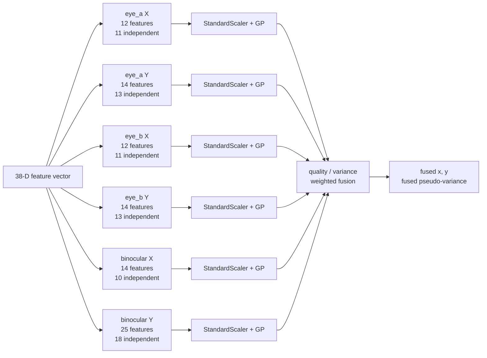

# Deep-Dive - Calibration & Prediction

**Date**: 2026-08-06
**Analyzed By**: ARCHITECT
**Status**: Draft

---

## Module Overview

**Purpose**: Learn a per-session mapping from the 38-D feature vector to screen pixels, and evaluate that mapping per frame with an uncertainty estimate. This is the only module containing machine learning, and the only one whose behaviour depends on fitted state.

**Path**: [eye_tracker/calibration.py](eye_tracker/calibration.py)
**Key Files**: 1 file, 257 lines — the largest module by line count after [overlay.py](eye_tracker/overlay.py)
**Imports**: `numpy`, `sklearn` (`GaussianProcessRegressor`, `ConstantKernel`, `RBF`, `WhiteKernel`, `StandardScaler`), 38 feature constants from [gaze.py](eye_tracker/gaze.py)
**Imported by**: [main.py:10](main.py#L10) only — `GazeCalibrator` is the sole export in practice

> **Verification basis.** ✅ **VERIFIED** findings were executed against scikit-learn 1.9.0 with synthetic calibration data; method and limits are in [Verification Record](#verification-record). Synthetic data cannot settle questions about real gaze accuracy, and those are marked ⚠️ instead.

---

## Component Breakdown

| Component | Lines | Visibility | Responsibility |
|-----------|-------|------------|----------------|
| `_EYE_A_FEAT_IDX_X` / `_Y` | [48-77](eye_tracker/calibration.py#L48-L77) | private | Which features the eye-A model sees, per screen axis |
| `_EYE_B_FEAT_IDX_X` / `_Y` | [78-107](eye_tracker/calibration.py#L78-L107) | private | Same, eye B |
| `_BINOCULAR_FEAT_IDX_X` / `_Y` | [108-150](eye_tracker/calibration.py#L108-L150) | private | Same, both-eyes model |
| `_make_gp` | [153-164](eye_tracker/calibration.py#L153-L164) | private | GP factory — kernel, bounds, restarts. One place, six uses |
| `_ScreenRegressor` | [167-194](eye_tracker/calibration.py#L167-L194) | private | One feature-subset pair + 2 scalers + 2 GPs; fit/predict for both axes |
| `_quality_weight` | [197-203](eye_tracker/calibration.py#L197-L203) | private | Per-eye confidence from openness, blink, squint |
| `GazeCalibrator` | [206-257](eye_tracker/calibration.py#L206-L257) | **public API** | Owns 3 regressors; fits them; fuses their predictions |

**Six independent Gaussian Processes.** `GazeCalibrator` holds 3 `_ScreenRegressor`s; each holds 2 GPs (one per screen axis) and 2 `StandardScaler`s. Every one of the six has its own feature subset, its own scaler, and its own independently-optimised kernel.

---

## Key Workflows

### Workflow: Calibration fit (one-shot, blocking)

```mermaid
sequenceDiagram
  participant CW as CalibrationWindow
  participant AC as AppController._on_calib_done
  participant GC as GazeCalibrator.fit
  participant SR as _ScreenRegressor.fit
  participant SK as sklearn

  CW->>AC: finished(X shape n by 38, Y shape n by 2)
  Note over AC: runs on the Qt GUI thread — UI is frozen from here
  AC->>AC: reject if X is None or len(X) < 5
  AC->>GC: fit(X, Y)
  GC->>GC: keep rows where all X and all Y are finite
  loop 3 regressors: eye_a, eye_b, binocular
    GC->>SR: fit(X_filtered, Y_filtered)
    SR->>SR: Xx = X[:, feat_idx_x] ; Xy = X[:, feat_idx_y]
    SR->>SK: scaler_x.fit(Xx) ; scaler_y.fit(Xy)
    SR->>SK: gp_x.fit(scaled Xx, Y[:,0]) — 5 optimiser runs
    SR->>SK: gp_y.fit(scaled Xy, Y[:,1]) — 5 optimiser runs
  end
  GC-->>AC: _fitted = True
  Note over AC: 6 GPs x 5 optimiser runs complete before the event loop resumes
```

`n_restarts_optimizer=4` means **5** total optimiser runs per GP (the initial fit plus 4 restarts), so a fit performs 30 marginal-likelihood optimisations. All of it runs inside the `_on_calib_done` slot on the GUI thread ([main.py:60](main.py#L60)).

### Workflow: Live prediction with variance fusion

```mermaid
sequenceDiagram
  participant AC as AppController._on_feat
  participant GC as GazeCalibrator.predict_with_variance
  participant QW as _quality_weight
  participant EA as eye_a
  participant EB as eye_b
  participant BN as binocular

  AC->>GC: predict_with_variance(median of last k frames)
  GC->>GC: raise RuntimeError if not fitted
  GC->>QW: feat, A_EAR, A_BLINK, A_SQUINT
  QW-->>GC: quality_a
  GC->>QW: feat, B_EAR, B_BLINK, B_SQUINT
  QW-->>GC: quality_b
  GC->>GC: pose_quality from YAW and PITCH, clipped to 0.25..1.0
  GC->>GC: weights = qa*pq, qb*pq, sqrt(qa*qb)*pq
  loop each of the 3 models
    GC->>EA: predict(feat) — scale subset, then 2 GP predicts with return_std
    EA-->>GC: mean 2-vector, std 2-vector
    GC->>GC: var = max(std^2, 1e-6) ; w = quality / var
    GC->>GC: fused_num += mean*w ; fused_den += w
  end
  GC-->>AC: fused = num/den, fused_var = 1/den
```

Six GP evaluations with `return_std=True` occur per frame, on the GUI thread, at camera frame rate.

### Model structure



---

## Data Models

### Fit inputs

| Input | Shape | Source | Validation |
|-------|-------|--------|------------|
| `X` | `(n, 38)` float64 | `CalibrationWindow.X` — one median-filtered vector per dot | Non-finite **rows** dropped at [218-220](eye_tracker/calibration.py#L218-L220) |
| `Y` | `(n, 2)` float64 | `CalibrationWindow.Y` — screen pixel targets | Same row filter |

With the shipped configuration `n = 25` at most ([main.py:134](main.py#L134)), and fewer if any dot yielded no usable samples ([overlay.py:216-217](eye_tracker/overlay.py#L216-L217)).

### Fitted state

| Attribute | Type | Count | Persisted? |
|-----------|------|-------|------------|
| `eye_a`, `eye_b`, `binocular` | `_ScreenRegressor` | 3 | **No** |
| `.scaler_x`, `.scaler_y` | `StandardScaler` | 6 | **No** |
| `.gp_x`, `.gp_y` | `GaussianProcessRegressor` | 6 | **No** |
| `_fitted` | `bool` | 1 | **No** |

Nothing is serialised. `GazeCalibrator` holds only picklable sklearn objects and numpy arrays, so persistence is a small change — but no code attempts it, and every launch requires a fresh 25-dot ritual.

### Feature subset redundancy

Cross-referencing the 11 exact linear dependencies verified in [01-gaze-deep-dive.md](docs/architecture/current/01-gaze-deep-dive.md#redundancy-analysis--11-of-38-dimensions-are-exactly-determined) against each subset:

| Subset | Cols | Exactly redundant columns present | Independent | Redundancy |
|--------|------|-----------------------------------|-------------|-----------|
| `eye_a` X | 12 | `f25 = c·f24` | 11 | 8% |
| `eye_a` Y | 14 | `f19 = 1 − f18` | 13 | 7% |
| `eye_b` X | 12 | `f25 = c·f24` | 11 | 8% |
| `eye_b` Y | 14 | `f21 = 1 − f20` | 13 | 7% |
| `binocular` X | 14 | `f4 = ½(f0+f2)`, `f14 = f0−f2`, `f34 = ½(f26+f28)`, `f25 = c·f24` | 10 | **29%** |
| `binocular` Y | 25 | `f5`, `f15`, `f35`, `f36`, `f37`, `f19`, `f21` | 18 | **28%** |

Two consequences:

- **The binocular model, the one weighted highest at neutral pose, is the most redundant.** Its Y subset feeds 25 columns derived from 18 independent quantities into a GP trained on at most 25 points — input dimension equals sample count.
- **Duplicated columns double-weight their quantity inside an isotropic RBF.** The kernel measures a single squared distance summed over all standardised dimensions, so including both `f18` and `1 − f18` contributes lid clearance twice. There is no per-dimension length scale to compensate, because `RBF(length_scale=1.0)` at [156](eye_tracker/calibration.py#L156) is scalar, not an ARD vector.

⚠️ Whether this measurably degrades accuracy on real data is not established. It is a design smell with a clear mechanism, not a measured defect.

---

## ✅ VERIFIED — `pose_quality` cannot move the predicted point

`pose_quality` is computed from head pose and multiplied into all three fusion weights ([calibration.py:237-244](eye_tracker/calibration.py#L237-L244)):

```python
pose_quality = float(np.clip(1.0 - 0.5 * (yaw + pitch), 0.25, 1.0))
weights = [
    quality_a * pose_quality,
    quality_b * pose_quality,
    np.sqrt(quality_a * quality_b) * pose_quality,
]
```

Because it is a **common factor across every weight**, and the fusion at [252-255](eye_tracker/calibration.py#L252-L255) normalises by the weight sum, it cancels exactly:

```
fused = Σ(mean_i · p·q_i/var_i) / Σ(p·q_i/var_i)  =  Σ(mean_i · q_i/var_i) / Σ(q_i/var_i)
```

It does **not** cancel in `fused_var = 1/Σw`, which scales as `1/p`.

Measured with the three regressors replaced by fixed-output stubs, so pose was the only varying quantity:

| `yaw` | `pitch` | `pose_quality` | `fused_x` | `fused_y` | `fused_var_x` | smoother scale |
|---|---|---|---|---|---|---|
| 0.00 | 0.00 | 1.0000 | 825.488721805 | 426.840052016 | 270.68 | 0.7794 |
| 0.30 | 0.00 | 0.8333 | 825.488721805 | 426.840052016 | 324.81 | 0.7633 |
| 0.00 | 0.30 | 0.7692 | 825.488721805 | 426.840052016 | 351.88 | 0.7560 |
| 0.60 | 0.45 | 0.3205 | 825.488721805 | 426.840052016 | 844.51 | 0.6666 |
| 0.69 | 0.54 | 0.2500 | 825.488721805 | 426.840052016 | 1082.71 | 0.6385 |

The fused point is identical to 9 decimal places across the full `pose_quality` range; `fused_var` scales exactly as `1/p` (270.68 → 1082.71 is precisely 4×, matching 1.0 → 0.25).

**So head-pose confidence has exactly one effect: it makes the dot smoother, never more accurate.** Whether that is the intent is a design question. If the intent was to down-weight the whole prediction under bad pose, the current structure cannot express it — a common factor across all fusion weights is a no-op by construction. Note also that the end-to-end effect on smoothing is modest: across the entire pose range the smoother's cutoff scale moves only 0.779 → 0.638.

Note that `quality_a` and `quality_b` do **not** cancel — they differ per model, so per-eye quality genuinely reallocates weight between the eye-A, eye-B and binocular predictions.

---

## `fused_var` is a pseudo-variance, not a variance

Standard inverse-variance fusion of independent estimates gives combined variance `1/Σ(1/var_i)`. Here the weights carry quality factors, so [calibration.py:256](eye_tracker/calibration.py#L256) computes:

```python
fused_var = 1.0 / np.maximum(fused_den, 1e-9)     # = 1 / Σ(q_i/var_i)
```

which equals the true combined variance only when every `q_i = 1`. With `q < 1` it is inflated by roughly `1/q̄`. Downstream, [one_euro.py:56-58](eye_tracker/one_euro.py#L53-L58) takes `sqrt()` of it and treats it as a pixel standard deviation.

This is arguably intentional — low quality *should* mean less confidence — but the value is not a variance in any statistical sense and should not be reported to a user as an accuracy estimate or used for error bars. It is a smoothing control signal.

---

## ✅ VERIFIED — GP kernels hit their length-scale ceiling

The kernel at [calibration.py:154-158](eye_tracker/calibration.py#L154-L158):

```python
kernel = (ConstantKernel(1.0, (1e-2, 1e3))
          * RBF(length_scale=1.0, length_scale_bounds=(1e-2, 1e2))
          + WhiteKernel(noise_level=5e-3, noise_level_bounds=(1e-6, 1e1)))
```

Fitted on 25 synthetic calibration points generated as a smooth function of the screen target with modest noise:

| Model | Axis | Cols | Fitted kernel | Bound status |
|---|---|---|---|---|
| `eye_a` | x | 12 | `16.0² · RBF(length_scale=100)` + `White(8.6e-4)` | **length_scale AT UPPER BOUND** |
| `eye_a` | y | 14 | `13.9² · RBF(length_scale=100)` + `White(1.0e-4)` | **length_scale AT UPPER BOUND** |
| `eye_b` | x | 12 | `13.3² · RBF(length_scale=84.6)` + `White(7.5e-4)` | inside bounds |
| `eye_b` | y | 14 | `14.6² · RBF(length_scale=100)` + `White(1.2e-4)` | **length_scale AT UPPER BOUND** |
| `binocular` | x | 14 | `10.2² · RBF(length_scale=85.2)` + `White(7.3e-4)` | inside bounds |
| `binocular` | y | 25 | `7.98² · RBF(length_scale=100)` + `White(1.9e-4)` | **length_scale AT UPPER BOUND** |

4 of 6 GPs saturated the `1e2` ceiling; the other two landed at ~85. The fit emitted 4 bound/convergence warnings.

**What a length scale of 100 means here.** Inputs are standardised, so typical inter-point distances in a `d`-dimensional subset are of order `sqrt(2d)` ≈ 5–7. A length scale of 85–100 is therefore 12–20× the data's own scale, which puts the RBF deep in its near-linear regime: for `d ≪ ℓ`, `exp(−d²/2ℓ²) ≈ 1 − d²/2ℓ²`. The kernel matrix becomes a nearly-constant matrix plus a small quadratic correction, and the fitted amplitude (8–16, i.e. σ² of 64–256) is what rescales that tiny correction back to pixel magnitudes.

**The practical implication is architectural**: these GPs are not behaving as flexible nonparametric regressors. The optimiser is pushing toward `ℓ → ∞` — i.e. toward a linear model — and only the `1e2` bound stops it. The effective hypothesis class is close to regularised linear regression on standardised features. That is not necessarily wrong for a 25-point calibration, but it means the model's cost (30 optimisations, a frozen UI, 6 GPs) buys little of the flexibility a GP is chosen for.

Reconstruction error on the 25 training targets was mean 10.3 px, median 9.8 px, max 23.6 px. That is *training* error with near-zero fitted noise — a genuinely interpolating GP would be near 0. Non-zero training residual is a direct consequence of the near-linear regime.

**Divergence from the earlier observation.** [00-system-overview.md](docs/architecture/current/00-system-overview.md) recorded `noise_level` saturating its `1e-6` *lower* bound. That did not reproduce here — fitted noise levels were 1e-4 to 8.6e-4, comfortably inside bounds. Both observations used synthetic fixtures with different noise structure, so the difference is a property of the fixtures, not a contradiction. **The length-scale ceiling reproduced; the noise-level floor did not.** Settling either requires real calibration data.

### ⚠️ Hypothesis: feature 10 may be the cause on real data

The synthetic fixture set feature 10 (`FEATURE_ROLL`) to small noise. On real data it does not behave that way: [03-face-mesh-deep-dive.md](docs/architecture/current/03-face-mesh-deep-dive.md) verifies that this feature rests at **±π and flips sign across the neutral head position**. Feature 10 is present in **all six** subsets.

If calibration dots are collected across that branch cut, the column becomes bimodal at roughly `+3.14` and `−3.14`. `StandardScaler` then maps it to a large-variance standardised column, and the isotropic RBF sees pairs of otherwise-similar calibration points separated by a distance that single dimension dominates. A plausible optimiser response is to inflate `ℓ` until that dimension stops mattering — which is exactly the saturation observed.

This is a **hypothesis with a mechanism, not a finding.** Test: log feature 10 across a real 25-dot calibration and check for values of both signs near ±π. If confirmed, the fix belongs in [face_mesh.py](eye_tracker/face_mesh.py), not here.

---

## ✅ VERIFIED — the variance channel is live for in-distribution input

Predictive standard deviations at and near the training set, and under deliberate extrapolation:

| Query | `std` eye_a | `std` eye_b | `std` binocular | `fused_var_x` | smoother scale |
|---|---|---|---|---|---|
| training point 0 (screen corner) | 22.86 | 21.34 | 20.82 | 201.4 | 0.829 |
| training point 12 (screen centre) | 20.32 | 20.46 | 18.77 | 137.9 | 0.854 |
| midpoint between points 0 and 1 | 20.13 | 18.18 | 17.69 | 142.0 | 0.852 |
| far extrapolation (2× point 0) | 9559 | 7973 | 6076 | 3.07e7 | **0.011** |

So the uncertainty chain **does** function as designed: in-distribution queries produce ~18–23 px standard deviations and near-neutral smoothing, while out-of-distribution input produces enormous variance and drives the smoother's cutoff scale to 0.011 — heavy smoothing, effectively freezing the dot rather than letting it fly to a garbage location. This is a genuine strength and it is not inert.

The differences between the three models' `std` values are modest (18–23 px), so at neutral pose the fusion is close to a quality-weighted average rather than being dominated by one model.

---

## Additional Findings

### `fit` has no post-filter minimum-sample guard

[calibration.py:215-224](eye_tracker/calibration.py#L215-L224) drops non-finite rows and then fits unconditionally. The only count check anywhere is `len(X) < 5` in [main.py:55](main.py#L55), which is evaluated **before** filtering. A calibration producing 6 rows of which 3 are non-finite reaches `fit` with 3 samples, and 6 GPs are fitted on 3 points with no warning. At 1 remaining row, `StandardScaler` produces zero variance for every column, and at 0 rows sklearn raises inside the slot with no handler.

### Near-constant columns are amplified to unit variance

`StandardScaler` divides by the per-column standard deviation observed during calibration. Any feature that happens to be nearly constant across the 25 dots is rescaled by a very large factor, converting sensor noise into a full-range GP input. Measured on the synthetic fixture for the `eye_a` X subset:

| Feature | Raw std across 25 dots | Amplification to unit variance |
|---|---|---|
| 16 `A_IRIS_RADIUS` | 3.86e-4 | ~2,590× |
| 24 `FACE_SCALE` | 8.97e-5 | ~11,100× |
| 25 `INTEROCULAR` | 1.20e-4 | ~8,360× |

The specific magnitudes are fixture-dependent — a real user shifts toward and away from the camera, giving these features more genuine variance. **The mechanism is real and unguarded**; the magnitude is not established for real data. It applies most strongly to a user who sits very still, which is precisely what calibration asks for. sklearn's zero-variance protection only engages at *exactly* zero variance, so the dangerous regime — tiny but non-zero — is unprotected.

### Dead public method

`GazeCalibrator.predict` ([226-228](eye_tracker/calibration.py#L226-L228)) is never called; `main.py` uses `predict_with_variance` exclusively. Verified by search across all `.py` files.

### Blocking fit on the GUI thread

Already recorded in the system overview; quantified here as 6 GPs × 5 optimiser runs = 30 marginal-likelihood optimisations, synchronous inside a Qt slot, with no progress indication.

⚠️ **Moving this fit to a worker thread is not a local change.** See [05-overlay-deep-dive.md](docs/architecture/current/05-overlay-deep-dive.md#-verified--the-app-exits-if-the-finished-handler-shows-no-window) — the application's survival across the calibration→live transition currently depends on `GazeOverlay.show()` executing *synchronously* inside the `finished` handler before the calibration window closes. Making the fit asynchronous causes the app to exit silently unless that is addressed first. This is verified, not speculative.

---

## Pattern Catalog

### Pattern 1 — Factory function for model construction  ✅ [Current — good]

One function defines the kernel and hyperparameters; all six GPs come from it, so no drift is possible.

**Example** ([calibration.py:153-164](eye_tracker/calibration.py#L153-L164)):

```python
# DO: one definition, six identical instances
def _make_gp():
    kernel = (ConstantKernel(1.0, (1e-2, 1e3))
              * RBF(length_scale=1.0, length_scale_bounds=(1e-2, 1e2))
              + WhiteKernel(noise_level=5e-3, noise_level_bounds=(1e-6, 1e1)))
    return GaussianProcessRegressor(kernel=kernel, alpha=1e-6,
                                    normalize_y=True, n_restarts_optimizer=4)

# DON'T: construct the kernel inline at each of six sites — six places to drift
self.gp_x = GaussianProcessRegressor(kernel=ConstantKernel(1.0) * RBF(1.0) + ...)
```

Contrast with the gate thresholds, which are duplicated as two independent literal blocks and **have** diverged — see [07-main-deep-dive.md](docs/architecture/current/07-main-deep-dive.md). Same codebase, two opposite outcomes; this is the pattern worth generalising.

### Pattern 2 — Feature subsets as module constants  ✅ [Current — good, with a gap]

Each model's inputs are a named list of `FEATURE_*` constants, declared adjacently so the six subsets can be compared by eye.

**Example** ([calibration.py:48-61](eye_tracker/calibration.py#L48-L61)):

```python
# DO: subsets are data, expressed in the shared contract's vocabulary
_EYE_A_FEAT_IDX_X = [
    FEATURE_A_DX, FEATURE_A_LOOK_H, FEATURE_LOOK_H_AVG, FEATURE_VERGENCE_X,
    FEATURE_YAW, FEATURE_ROLL, FEATURE_TZ, FEATURE_TX,
    FEATURE_A_IRIS_RADIUS, FEATURE_FACE_CX, FEATURE_FACE_SCALE, FEATURE_INTEROCULAR,
]

# DON'T: bare indices — unreviewable, and silently wrong if the contract renumbers
_EYE_A_FEAT_IDX_X = [0, 26, 34, 14, 8, 10, 11, 12, 16, 22, 24, 25]
```

**The gap**: no comment records *why* each feature is in each subset, and no subset excludes an exactly-redundant partner. The lists are readable but their rationale is not recoverable from source.

### Pattern 3 — Defensive numerical floors before division  ✅ [Current — consistent]

**Example** ([calibration.py:250-256](eye_tracker/calibration.py#L250-L256)):

```python
# DO: floor every denominator at the point of division
var = np.maximum(std * std, 1e-6)
fused = fused_num / np.maximum(fused_den, 1e-9)
fused_var = 1.0 / np.maximum(fused_den, 1e-9)

# DON'T: assume a GP's std is strictly positive
var = std * std
fused = fused_num / fused_den
```

Consistent with the epsilon pattern in [gaze.py](eye_tracker/gaze.py) — the same convention applied by two different authorial passes, which suggests it is genuinely established.

### Pattern 4 — Explicit fitted-state guard  ✅ [Current — good]

**Example** ([calibration.py:230-232](eye_tracker/calibration.py#L230-L232)):

```python
# DO: fail loudly on use-before-fit
if not self._fitted:
    raise RuntimeError("Calibrator has not been trained")
```

The one place in the codebase that raises rather than silently returning a neutral value. Undermined at the call site: [main.py:113-117](main.py#L113-L117) wraps the call in `except Exception`, prints, and drops the frame — so a genuine use-before-fit becomes an unbounded stream of prints rather than a surfaced error.

### Pattern 5 — Row-wise finite filtering at the boundary  ⚠️ [Current — incomplete]

**Example** ([calibration.py:218-220](eye_tracker/calibration.py#L218-L220)):

```python
# CURRENT: filters bad rows, but does not check what survives
keep = np.all(np.isfinite(X), axis=1) & np.all(np.isfinite(Y), axis=1)
X = X[keep]
Y = Y[keep]

# DO: validate the post-filter count, where the real precondition lives
if len(X) < MIN_CALIBRATION_POINTS:
    raise ValueError(f"{len(X)} usable points after filtering; need {MIN_CALIBRATION_POINTS}")
```

### Pattern 6 — Naming conventions  ✅ [Current — consistent]

| Kind | Convention | Example |
|---|---|---|
| Private module constants | `_<UPPER_SNAKE>` | `_BINOCULAR_FEAT_IDX_Y` |
| Private classes | `_<PascalCase>` | `_ScreenRegressor` |
| Public classes | `<PascalCase>` | `GazeCalibrator` |
| Private helpers | `_<lower_snake>` | `_make_gp`, `_quality_weight` |
| Fitted-state flags | `_<lower_snake>` | `_fitted` |

Consistent with [gaze.py](eye_tracker/gaze.py). The module keeps a genuinely minimal public surface: one class, two methods actually used.

---

## Testing Patterns

**Current state: no tests exist.** Coverage 0%.

`_quality_weight` is a pure function of three floats and is the single easiest unit in the module to test. `_ScreenRegressor` and `GazeCalibrator` need a fixture but no hardware — the synthetic calibration generator written for this analysis fits and predicts end-to-end in a few seconds.

```python
# Suggested: tests/unit/test_calibration.py  (does not exist yet)
import numpy as np
from eye_tracker.calibration import GazeCalibrator, _quality_weight

def test_quality_weight_saturates_for_a_wide_open_eye():
    # ear_quality clips at 1.0 for any ear >= 0.30
    f = np.zeros(38); f[6], f[30], f[32] = 0.35, 0.0, 0.0
    assert _quality_weight(f, 6, 30, 32) == 1.0

def test_quality_weight_floors_at_the_clip_bounds():
    f = np.zeros(38); f[6], f[30], f[32] = 0.0, 1.0, 1.0
    assert _quality_weight(f, 6, 30, 32) == 0.15 * 0.15

def test_pose_quality_only_scales_the_variance(stubbed_calibrator, feat):
    # Locks in the verified cancellation so a future refactor cannot change
    # behaviour silently in either direction. Needs stubbed regressors, because
    # yaw/pitch are themselves model inputs — see the Verification Record.
    neutral = feat.copy();  neutral[8], neutral[9] = 0.0, 0.0
    skewed  = feat.copy();  skewed[8],  skewed[9]  = 0.69, 0.54
    p_neutral, v_neutral = stubbed_calibrator.predict_with_variance(neutral)
    p_skewed,  v_skewed  = stubbed_calibrator.predict_with_variance(skewed)
    np.testing.assert_allclose(p_skewed, p_neutral, rtol=0, atol=1e-9)
    np.testing.assert_allclose(v_skewed, v_neutral * 4.0, rtol=1e-9)

def test_fit_rejects_too_few_usable_rows_after_filtering():
    # Currently FAILS — no such guard exists. Written as the specification.
    X = np.full((6, 38), np.nan); X[:3] = 0.0
    with pytest.raises(ValueError):
        GazeCalibrator().fit(X, np.zeros((6, 2)))
```

The last test is deliberately a **failing** specification for the missing guard, not a description of current behaviour.

---

## Entry Points

| Entry | Signature | Called by | Contract |
|-------|-----------|-----------|----------|
| `GazeCalibrator()` | `() -> GazeCalibrator` | [main.py:34](main.py#L34) | Constructs 6 unfitted GPs; cheap |
| `.fit(X, Y)` | `(ndarray(n,38), ndarray(n,2)) -> None` | [main.py:60](main.py#L60) | Blocking, seconds; drops non-finite rows; no minimum-count guard; sets `_fitted` |
| `.predict_with_variance(feat)` | `(ndarray(38,)) -> (ndarray(2,), ndarray(2,))` | [main.py:114](main.py#L114) | Raises `RuntimeError` if unfitted; returns fused pixel coords and a quality-scaled pseudo-variance |
| `.predict(feat)` | `(ndarray(38,)) -> ndarray(2,)` | **nobody** | Dead API |

No signals, no threads, no I/O. The module is synchronous and single-threaded by construction — all concurrency concerns live in [tracker.py](eye_tracker/tracker.py) and [main.py](main.py).

---

## Verification Record

Script: `scratchpad/verify_deepdive.py`, section D and section C. Python 3.14.6, scikit-learn 1.9.0, numpy 2.5.1. Synthetic data only; **no repository file was modified**.

| Test | Method | Result |
|---|---|---|
| `pose_quality` cancellation | 3 regressors replaced by fixed-output stubs; only yaw/pitch varied across 5 settings | fused point identical to 9 dp; `fused_var` scales exactly `1/p` ✅ |
| Kernel bound saturation | 25-point synthetic calibration, inspect all 6 `kernel_` after fit | 4 of 6 at `length_scale` upper bound `1e2`; 2 at ~85; 4 convergence warnings ✅ |
| Variance informativeness | `return_std` at training points, an interpolation midpoint, and a 2× extrapolation | 18–23 px in-distribution; ~6000–9600 px extrapolating; smoother scale 0.85 → 0.011 ✅ |
| Scaler amplification | per-column std of the `eye_a` X subset across 25 dots | 3 columns below 4e-4 raw std, amplified 2.6e3–1.1e4× ✅ (mechanism) |
| Training reconstruction | predict at all 25 training inputs | mean 10.3 px, median 9.8 px, max 23.6 px ✅ |

**Not verified**: real gaze accuracy, whether `noise_level` saturates on real data, whether feature 10's wrap-around is the cause of length-scale saturation, and whether the redundant columns measurably degrade accuracy. All require a webcam, a person, and a ground-truth protocol that does not currently exist.

---

## Recommendations

1. **Decide what `pose_quality` is supposed to do.** It currently affects only smoothing. If it should reduce trust in the prediction itself, the fusion structure has to change — a common factor across all weights can never do that. This is a requirements question, not a bug fix.
2. **Add a post-filter minimum-sample guard in `fit`.** The real precondition is "enough usable rows survived filtering", and it is currently checked in the wrong module against the wrong number.
3. **Investigate the length-scale ceiling on real calibration data**, starting with feature 10. If the GPs genuinely want to be linear, that is worth knowing before adding model complexity — and a linear model would fit instantly, which removes the GUI-freeze problem entirely rather than working around it.
4. **Exclude exactly-redundant columns from the subsets**, or switch `RBF` to ARD so per-dimension length scales can absorb duplication. Cheap either way.
5. **Stop calling `fused_var` a variance** in any user-facing or API-facing context. It is a smoothing control signal.
6. **Persist the fitted calibrator.** All state is picklable; the only blocker is deciding the cache key (user, camera, lighting) — an open question already recorded for requirements.
7. **Delete `GazeCalibrator.predict`** or give it a caller.
8. **Sequence the GUI-freeze fix after the window-lifetime fix.** Threading the fit first will introduce a silent app exit. See [05](docs/architecture/current/05-overlay-deep-dive.md).

---

## Cross-References

| Topic | Document |
|---|---|
| The 38-D contract and its 11 exact dependencies | [01-gaze-deep-dive.md](docs/architecture/current/01-gaze-deep-dive.md) |
| Why features 8/9/10 are mislabelled, and feature 10's ±π wrap | [03-face-mesh-deep-dive.md](docs/architecture/current/03-face-mesh-deep-dive.md) |
| Where `X` and `Y` come from, and the window-lifetime constraint | [05-overlay-deep-dive.md](docs/architecture/current/05-overlay-deep-dive.md) |
| How `fused_var` is consumed | [06-one-euro-deep-dive.md](docs/architecture/current/06-one-euro-deep-dive.md) |
| The blocking `fit` call site and live prediction loop | [07-main-deep-dive.md](docs/architecture/current/07-main-deep-dive.md) |
