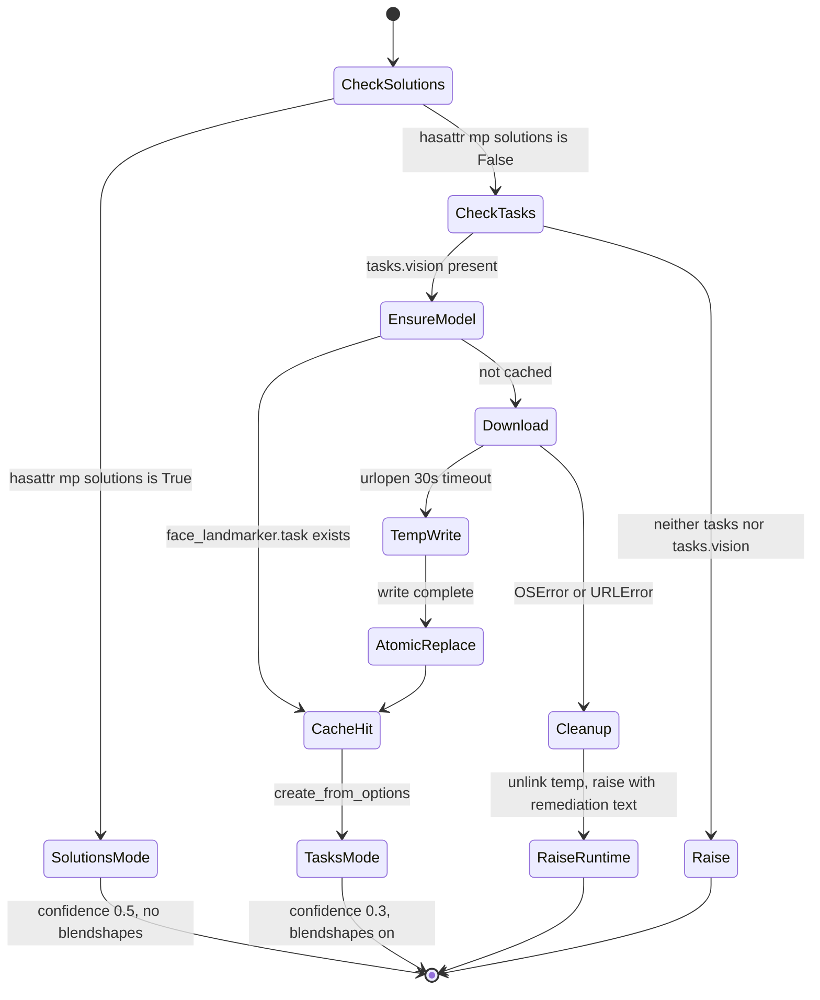
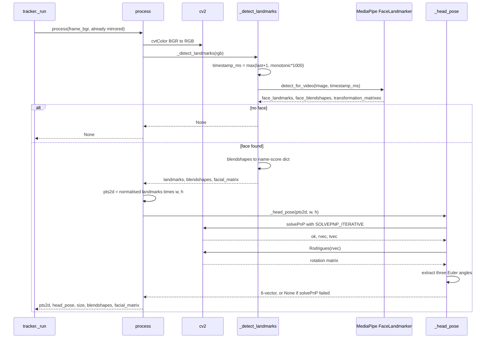
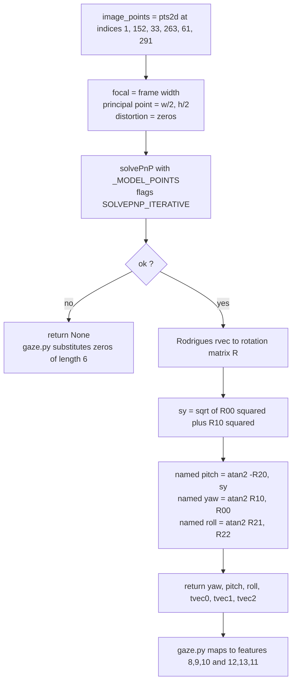

# Deep-Dive - Landmark Adapter & Head Pose

**Date**: 2026-08-06
**Analyzed By**: ARCHITECT
**Status**: Draft

---

## Module Overview

**Purpose**: Adapt MediaPipe's face-landmark output into the internal `mesh_result` dict, own the model-asset download and cache, define the landmark index vocabulary the rest of the system uses, and estimate 6-DoF head pose via `cv2.solvePnP`.

**Path**: [eye_tracker/face_mesh.py](eye_tracker/face_mesh.py)
**Key Files**: 1 file, 184 lines
**Imports**: `os`, `sys`, `time`, `urllib.error`, `urllib.request`, `pathlib`, `cv2`, `mediapipe`, `numpy`
**Imported by**: [tracker.py:10](eye_tracker/tracker.py#L10) (`FaceMeshWrapper`), [gaze.py:6-17](eye_tracker/gaze.py#L6-L17) (10 landmark constants)

This is the system's only boundary with an external service and the only module that writes to disk.

> **This module contains the most consequential finding in the deep-dive.** The head-pose angle labels are cyclically permuted, and one of them carries a ±π discontinuity at the neutral head position. Both are ✅ **VERIFIED** by execution below, and both propagate into every gate and every regressor in the system.

---

## Component Breakdown

| Component | Lines | Visibility | Responsibility |
|-----------|-------|------------|----------------|
| Landmark index constants | [13-25](eye_tracker/face_mesh.py#L13-L25) | **public** | 10 named eye landmarks — the vocabulary [gaze.py](eye_tracker/gaze.py) is built on |
| `_MODEL_POINTS` | [28-35](eye_tracker/face_mesh.py#L28-L35) | private | Canonical 3-D face geometry in mm for `solvePnP` |
| `_POSE_LM_IDX` | [36](eye_tracker/face_mesh.py#L36) | private | The 6 landmark indices matching `_MODEL_POINTS` |
| `_TASKS_MODEL_URL` | [37-40](eye_tracker/face_mesh.py#L37-L40) | private | Hardcoded CDN URL for `face_landmarker.task` |
| `_cache_dir` | [43-46](eye_tracker/face_mesh.py#L43-L46) | private | Platform-branched cache path |
| `_ensure_tasks_model` | [49-71](eye_tracker/face_mesh.py#L49-L71) | private | Download-once with atomic replace |
| `FaceMeshWrapper.__init__` | [75-109](eye_tracker/face_mesh.py#L75-L109) | **public** | Dual-API selection: `solutions` vs `tasks` |
| `.process` | [111-126](eye_tracker/face_mesh.py#L111-L126) | **public API** | BGR frame → `mesh_result` dict |
| `._detect_landmarks` | [128-159](eye_tracker/face_mesh.py#L128-L159) | private | Per-backend detection + blendshape/matrix extraction |
| `._head_pose` | [161-180](eye_tracker/face_mesh.py#L161-L180) | private | `solvePnP` → Rodrigues → Euler angles + translation |
| `.close` | [182-184](eye_tracker/face_mesh.py#L182-L184) | **public** | Releases the MediaPipe graph |

---

## Key Workflows

### Workflow: Construction and backend selection



Under the installed MediaPipe (0.10.33 as analysed, 0.10.35 as rebuilt) the `SolutionsMode` branch is unreachable — confirmed empirically in [00-system-overview.md](docs/architecture/current/00-system-overview.md). `TasksMode` is always taken.

### Workflow: Per-frame detection



### Workflow: Head-pose extraction



---

## ✅ VERIFIED — the three head-pose angles are mislabelled

### The measurement

A synthetic frontal-upright head was constructed from `_MODEL_POINTS`, projected through the same pinhole model the code assumes (`focal = w`, principal point at the image centre, zero distortion), and fed to the real `_head_pose`. Then each of the three camera axes was rotated by a known +15° and the outputs re-measured.

OpenCV's camera frame is **+X right, +Y down, +Z into the scene**, so the physical meaning of each axis rotation is unambiguous: about X is a nod (pitch), about Y is a turn (yaw), about Z is an in-plane tilt (roll).

| Applied rotation | feature 8 `YAW` | feature 9 `PITCH` | feature 10 `ROLL` |
|---|---|---|---|
| rest (frontal upright) | 0.0000 | 0.0000 | **−3.1416** |
| **nod** +15° (camera X) | 0.0000 | 0.0000 | **−2.8798** |
| **turn** +15° (camera Y) | 0.0000 | **0.2618** | −3.1416 |
| **tilt** +15° (camera Z) | **0.2618** | 0.0000 | 3.1416 |

`0.2618 rad = 15.000°` exactly, and `−2.8798 − (−3.1416) = 0.2618` — so `solvePnP` recovered each applied rotation precisely. The round-trip is sound; only the naming is wrong.

### The conclusion

The labels are cyclically permuted:

| Feature | Named | Actually measures |
|---|---|---|
| 8 | `FEATURE_YAW` | **roll** — in-plane head tilt |
| 9 | `FEATURE_PITCH` | **yaw** — head turn left/right |
| 10 | `FEATURE_ROLL` | **pitch** — nod up/down, offset by ±π |

### Why it happens

[face_mesh.py:175-178](eye_tracker/face_mesh.py#L175-L178) applies the standard `ZYX` rotation-matrix-to-Euler decomposition:

```python
sy = np.sqrt(rmat[0, 0] ** 2 + rmat[1, 0] ** 2)
pitch = float(np.arctan2(-rmat[2, 0], sy))    # this is the Y-axis rotation
yaw   = float(np.arctan2(rmat[1, 0], rmat[0, 0]))  # this is the Z-axis rotation
roll  = float(np.arctan2(rmat[2, 1], rmat[2, 2]))  # this is the X-axis rotation
```

The three `atan2` expressions are individually correct — they recover the X, Y and Z rotations of a `ZYX` decomposition. The error is purely in which name each result is bound to. For a camera frame the correct binding is: Y-rotation → yaw, X-rotation → pitch, Z-rotation → roll.

### Why the rest value is ±π, not 0

`_MODEL_POINTS` is defined with **+Y up** (chin at `−63.6`, eyes at `+32.7`) and **+Z toward the viewer** (nose tip at `0`, chin behind at `−12.5`). The camera frame has +Y down and +Z away. So the rotation mapping model to camera for an upright frontal face is approximately a 180° rotation about X — not the identity. The X-rotation component is therefore ≈ π at rest, and it is bound to the name `roll`.

### ✅ VERIFIED — feature 10 is discontinuous at the neutral head position

Because the X-rotation rests at ±π, it sits exactly on `atan2`'s branch cut. Sweeping a small nod through neutral:

| Nod | feature 10 `ROLL` |
|---|---|
| −2.0° | **+3.1067** |
| −0.5° | **+3.1329** |
| 0.0° | **−3.1416** |
| +0.5° | −3.1329 |
| +2.0° | −3.1067 |

A 4° change of nod direction swings feature 10 by **6.213 radians**. The discontinuity is centred on the most common operating point — a user looking straight at their screen.

### Downstream consequences

This propagates into every consumer of features 8, 9 and 10.

**1. The frame-rejection gates act on the wrong axes.** [main.py:99-100](main.py#L99-L100) and [overlay.py:186-187](eye_tracker/overlay.py#L186-L187) gate on `YAW` and `PITCH`:

| Gate as written | Intended to reject | Actually rejects |
|---|---|---|
| `abs(feat[FEATURE_YAW]) > 0.70` | head turned away | head **tilted** sideways |
| `abs(feat[FEATURE_PITCH]) > 0.55` | head nodded away | head **turned** away |
| *(no gate reads feature 10)* | — | **nodding is never gated at all** |

So a user looking well above or below their monitor is not rejected, while a user tilting their head is. Note the gate that *is* effective is the one on feature 9 (real yaw) — head turn is caught, just by the code that thinks it is checking pitch.

**2. `pose_quality` penalises the wrong axes.** [calibration.py:237-239](eye_tracker/calibration.py#L237-L239) normalises `YAW` by 0.9 and `PITCH` by 0.65 — tolerances chosen for turn and nod respectively, now applied to tilt and turn. Since `pose_quality` provably only affects smoothing ([02](docs/architecture/current/02-calibration-deep-dive.md#-verified--pose_quality-cannot-move-the-predicted-point)), the practical impact is limited to smoothing strength.

**3. Feature 10 injects a 6.28-radian discontinuity into all six regressors.** `FEATURE_ROLL` appears in every one of the six feature subsets ([calibration.py:48-150](eye_tracker/calibration.py#L48-L150)). If calibration dots are collected while the user's nod crosses neutral — routine over a 79-second ritual — that column becomes bimodal near ±π. `StandardScaler` then gives it large variance, and the isotropic RBF sees pairs of otherwise-similar points separated by a distance this one dimension dominates. This is the leading hypothesis for the length-scale saturation measured in [02](docs/architecture/current/02-calibration-deep-dive.md#-verified--gp-kernels-hit-their-length-scale-ceiling), though the causal link is not yet confirmed on real data.

**4. Live prediction can jump.** `_motion_score` at [main.py:78-81](main.py#L78-L81) reads `FEATURE_YAW` and `FEATURE_PITCH` — not feature 10 — so the motion term is unaffected by the wrap. But `feat_for_pred` is a **median** over the last 2–5 frames ([main.py:112](main.py#L112)); a median over frames straddling the branch cut can land on either branch or midway, so the GP input for feature 10 can move by radians between consecutive frames while the head is essentially still.

### Remediation options (for `aire-brownfield-architecture` to decide)

| Option | Effect | Risk |
|---|---|---|
| Rename only — bind each `atan2` to its correct name | Names become truthful; gate constants must be re-paired to preserve today's tuning | Low, but every threshold's meaning changes and must be re-reviewed |
| Unwrap the X-rotation — subtract the rest offset so nod is centred on 0 | Removes the ±π discontinuity | Requires defining the rest reference |
| Both, plus re-tune the gates against real data | Correct and continuous | Needs a person and a protocol |
| Do nothing | Model still fits — GPs learn any monotone encoding | Discontinuity remains; thresholds stay misleading; every future reader is misled |

**A rename alone changes no numbers but is not behaviour-neutral in practice**: the gate thresholds `0.70` and `0.55` were presumably tuned by observing behaviour, so they are attached to whichever physical axis was actually being measured. Renaming without re-pairing them would silently retune the gates.

---

## Data Models

### Output contract — `mesh_result`

| Key | Type | Always present? | Notes |
|-----|------|-----------------|-------|
| `pts2d` | `ndarray (478, 2)` float64 | yes | Pixel coords: normalised landmark × frame size ([118](eye_tracker/face_mesh.py#L118)) |
| `head_pose` | `ndarray (6,)` float64 or `None` | **no** | `None` when `solvePnP` fails; consumer substitutes zeros |
| `size` | `(w, h)` ints | yes | Frame dimensions |
| `blendshapes` | `dict[str, float]` or `None` | **no** | `None` in `solutions` mode or if MediaPipe returns none |
| `facial_matrix` | 4×4 matrix or `None` | **no** | **Never read by any consumer** |

`process` returns `None` outright when no face is detected — a different signal from a present-but-incomplete result.

### `head_pose` element order — reordered by the consumer

| `head_pose` index | Content | Mapped to feature | By |
|---|---|---|---|
| 0 | Z-rotation (labelled `yaw`) | 8 `FEATURE_YAW` | [gaze.py:182](eye_tracker/gaze.py#L182) |
| 1 | Y-rotation (labelled `pitch`) | 9 `FEATURE_PITCH` | [gaze.py:183](eye_tracker/gaze.py#L183) |
| 2 | X-rotation (labelled `roll`) | 10 `FEATURE_ROLL` | [gaze.py:184](eye_tracker/gaze.py#L184) |
| 3 | `tvec[0]` | 12 `FEATURE_TX` | [gaze.py:186](eye_tracker/gaze.py#L186) |
| 4 | `tvec[1]` | 13 `FEATURE_TY` | [gaze.py:187](eye_tracker/gaze.py#L187) |
| 5 | `tvec[2]` | 11 `FEATURE_TZ` | [gaze.py:185](eye_tracker/gaze.py#L185) |

The translation components are **deliberately reordered** — `head[5]`→`TZ`, `head[3]`→`TX`, `head[4]`→`TY` — so the feature vector reads `TZ, TX, TY` while `head_pose` holds `TX, TY, TZ`. Verified correct against both files, but it is an unexplained cross-module permutation with no comment at either end.

### `_MODEL_POINTS` — the canonical face

| Landmark | Index | Model coordinate (mm) | Anatomy |
|---|---|---|---|
| nose tip | 1 | `(0, 0, 0)` | origin |
| chin | 152 | `(0, −63.6, −12.5)` | +Y is up |
| eye A outer | 33 | `(−43.3, 32.7, −26.0)` | |
| eye B outer | 263 | `(43.3, 32.7, −26.0)` | |
| mouth A corner | 61 | `(−28.9, −28.9, −24.1)` | |
| mouth B corner | 291 | `(28.9, −28.9, −24.1)` | |

A fixed generic face. No per-user scaling, so `tvec` magnitudes are only as accurate as the match between this template and the actual user's face.

### Camera model

```python
focal = float(w)                      # face_mesh.py:163 — a guess, not a calibration
cam = [[focal, 0, w/2], [0, focal, h/2], [0, 0, 1]]
dist = np.zeros((4, 1))               # zero distortion assumed
```

`focal = frame_width` corresponds to a horizontal field of view of ~53°. Real webcams vary from roughly 50° to 90°, so this is an uncalibrated approximation. The rotation angles are relatively robust to focal error; **the translation components are not** — `TX`, `TY`, `TZ` (features 12, 13, 11) are in arbitrary, camera-dependent units and are fed directly to all six regressors. Within a single session the error is a fixed bias the GP can absorb; across cameras or resolutions it is not comparable, which matters if calibration is ever persisted and reused.

---

## Additional Findings

### `facial_matrix` is computed and discarded

[face_mesh.py:106](eye_tracker/face_mesh.py#L106) requests `output_facial_transformation_matrixes=True`, [152-154](eye_tracker/face_mesh.py#L152-L154) extracts it, [125](eye_tracker/face_mesh.py#L125) publishes it — and no consumer reads it. Verified by search: `facial_matrix` appears only within this file.

This is doubly notable because that matrix is MediaPipe's own head-pose estimate, produced from the full 478-landmark set. The system pays for it, throws it away, and then re-derives a less-informed pose from 6 landmarks using an uncalibrated pinhole model. Whether MediaPipe's matrix would be better is untested — but it is a free, already-computed alternative and the obvious first experiment for anyone improving head pose.

### The atomic download pattern is correct

[face_mesh.py:56-71](eye_tracker/face_mesh.py#L56-L71) writes to a PID-suffixed temp file and then `Path.replace()`s it into position. `replace` is atomic on POSIX and on Windows, so a crashed or concurrent download cannot leave a truncated `.task` file that a later run would treat as valid. This is the most careful piece of I/O in the codebase and deserves preserving as the project's file-write standard.

Two gaps: there is no integrity check (a CDN serving a valid-length wrong file would be cached permanently), and no size cap on `src.read()`, which loads the whole asset into memory.

### `close()` is not idempotent and not exception-safe

```python
def close(self):
    if self.mesh is not None:
        self.mesh.close()      # self.mesh is never set to None
```

Calling twice calls into a closed MediaPipe graph. [tracker.py:147](eye_tracker/tracker.py#L147) and [tracker.py:171](eye_tracker/tracker.py#L171) are on mutually exclusive paths so it is not triggered today, but the guard reads as if it protects against double-close and does not.

### Stale project identity in the cache path

[face_mesh.py:43-46](eye_tracker/face_mesh.py#L43-L46) uses `Eyee`/`eyee` while the repository is `EyeTracker`. Already recorded in the system overview; noted here as the owning site.

### Timestamp monotonicity is handled correctly

[face_mesh.py:140-141](eye_tracker/face_mesh.py#L140-L141) forces strictly increasing timestamps with `max(self._last_timestamp_ms + 1, int(time.monotonic() * 1000))`. MediaPipe's `VIDEO` running mode rejects non-monotonic timestamps, and a frame arriving inside the same millisecond as its predecessor would otherwise fail. A real edge case, handled without ceremony.

One coupling worth noting: the same `FaceMeshWrapper` instance is used for camera probing and for tracking ([tracker.py:144](eye_tracker/tracker.py#L144)), so its `VIDEO`-mode temporal state carries frames from *different cameras*. Harmless for probing, but it means the tracker's landmark stream begins with internal state contaminated by discarded candidate cameras.

---

## Pattern Catalog

### Pattern 1 — Atomic write via temp-then-replace  ✅ [Current — the codebase's best I/O practice]

**Example** ([face_mesh.py:56-71](eye_tracker/face_mesh.py#L56-L71)):

```python
# DO: write to a unique temp path, then atomically move into place
tmp_path = model_dir / f"{model_path.name}.{os.getpid()}.tmp"
try:
    with urllib.request.urlopen(_TASKS_MODEL_URL, timeout=30) as src:
        with tmp_path.open("wb") as dst:
            dst.write(src.read())
    tmp_path.replace(model_path)
except (OSError, urllib.error.URLError) as exc:
    try:
        tmp_path.unlink()
    except FileNotFoundError:
        pass
    raise RuntimeError(
        "Failed to download the MediaPipe face landmarker model. "
        f"Check network access or place it at {model_path}."
    ) from exc

# DON'T: stream straight to the destination — a crash leaves a corrupt cache entry
with model_path.open("wb") as dst:
    dst.write(urllib.request.urlopen(_TASKS_MODEL_URL).read())
```

All four elements are right: unique temp name, atomic `replace`, cleanup on failure with `FileNotFoundError` tolerated, and `raise ... from exc` preserving the cause.

### Pattern 2 — Actionable error messages with remediation  ✅ [Current — rare but excellent]

The message above tells the user both causes and the exact path to drop the file at. Compare the rest of the codebase, where failures print a bare description and return ([tracker.py:142](eye_tracker/tracker.py#L142), [tracker.py:146](eye_tracker/tracker.py#L146)). This is the standard the others should be raised to.

### Pattern 3 — Capability detection over version checks  ⚠️ [Current — sound idea, dead in practice]

**Example** ([face_mesh.py:80-95](eye_tracker/face_mesh.py#L80-L95)):

```python
# DO (the principle): ask the object what it can do
if hasattr(mp, "solutions"):
    ...
if not hasattr(mp, "tasks") or not hasattr(mp.tasks, "vision"):
    raise RuntimeError(...)

# DON'T: brittle version comparisons
if mp.__version__ < "0.10":
    ...
```

The principle is right and the failure message when neither API exists is good. The problem is that the preferred branch has never executed under any pinned version, so half of this module's construction logic is untested and untestable as configured — including its own, different confidence thresholds (0.5 vs 0.3) and its `"blendshapes": None` return that would zero 12 features. **Unreachable code that changes behaviour if reached is worse than no fallback.** A decision is required: lower the `mediapipe` floor so the branch is reachable and test it, or delete it.

### Pattern 4 — Backend-specific extraction behind one return shape  ✅ [Current — good]

`_detect_landmarks` returns the same three-key dict from both branches ([134-138](eye_tracker/face_mesh.py#L134-L138) and [155-159](eye_tracker/face_mesh.py#L155-L159)), so `process` is backend-agnostic. Correct adapter shape — the dual-API concern is confined to two methods and does not leak into `mesh_result`'s consumers.

### Pattern 5 — Platform branching in a single helper  ✅ [Current — consistent across the codebase]

**Example** ([face_mesh.py:43-46](eye_tracker/face_mesh.py#L43-L46)):

```python
# DO: one function owns the platform decision
def _cache_dir():
    if sys.platform == "darwin":
        return Path.home() / "Library" / "Caches" / "Eyee"
    return Path.home() / ".cache" / "eyee"
```

The same shape appears in [tracker.py:14-20](eye_tracker/tracker.py#L14-L20) (`_preferred_backends`) and [overlay.py:18](eye_tracker/overlay.py#L18) (`_IS_MAC`). A genuine, consistently applied project convention.

### Pattern 6 — Naming conventions  ✅ [Current — consistent]

| Kind | Convention | Example |
|---|---|---|
| Public landmark constants | `EYE_<A\|B>_<PART>` | `EYE_A_OUTER` |
| Private module constants | `_<UPPER_SNAKE>` | `_MODEL_POINTS`, `_POSE_LM_IDX` |
| Private module functions | `_<lower_snake>` | `_cache_dir`, `_ensure_tasks_model` |
| Private methods | `_<lower_snake>` | `_detect_landmarks`, `_head_pose` |
| Instance mode flag | `_mode` holding a string | `"solutions"` / `"tasks"` |

`_mode` as a bare string rather than an enum is the one weak spot: it is compared literally at [129](eye_tracker/face_mesh.py#L129) and a typo would silently select the `tasks` path.

---

## Testing Patterns

**Current state: no tests exist.** Coverage 0%.

`_head_pose` is the highest-value target in this module and needs **no MediaPipe, no camera, and no network** — it does not touch `self`, so it can be exercised directly with synthetic projected points. That is exactly how the mislabelling above was established, which demonstrates the test is both easy and worth having.

```python
# Suggested: tests/unit/test_face_mesh.py  (does not exist yet)
import numpy as np
from eye_tracker.face_mesh import FaceMeshWrapper, _MODEL_POINTS, _POSE_LM_IDX

def project(R, t, w=1920, h=1080):
    cam = (R @ _MODEL_POINTS.T).T + t
    pts = np.zeros((478, 2))
    pts[_POSE_LM_IDX] = np.column_stack([
        w * cam[:, 0] / cam[:, 2] + w / 2.0,
        w * cam[:, 1] / cam[:, 2] + h / 2.0])
    return pts

def test_each_output_tracks_the_axis_its_name_claims():
    # Currently FAILS — written as the specification, not as current behaviour.
    rest = rot_x(180)
    for axis, name_idx in (("x", 9), ("y", 8), ("z", 10)):   # pitch, yaw, roll
        base = FaceMeshWrapper._head_pose(None, project(rest, T), 1920, 1080)
        moved = FaceMeshWrapper._head_pose(
            None, project(rot(axis, 15) @ rest, T), 1920, 1080)
        assert abs(moved[name_idx] - base[name_idx]) == pytest.approx(np.deg2rad(15), abs=1e-3)

def test_neutral_pose_is_continuous():
    # Currently FAILS — feature 10 jumps 6.2 rad across neutral.
    a = FaceMeshWrapper._head_pose(None, project(rot_x(-0.5) @ rot_x(180), T), 1920, 1080)
    b = FaceMeshWrapper._head_pose(None, project(rot_x(+0.5) @ rot_x(180), T), 1920, 1080)
    assert np.abs(a[:3] - b[:3]).max() < 0.1

def test_download_failure_raises_with_the_target_path(monkeypatch, tmp_path):
    monkeypatch.setattr("urllib.request.urlopen", raising_urlopen)
    with pytest.raises(RuntimeError, match="place it at"):
        _ensure_tasks_model()
```

Both pose tests are **failing specifications** of correct behaviour, not descriptions of what the code does today. `FaceMeshWrapper.__init__` is the hard part to test — it downloads on construction, so it needs either a pre-seeded cache directory or dependency injection of the model path.

---

## Entry Points

| Entry | Signature | Called by | Contract |
|-------|-----------|-----------|----------|
| `FaceMeshWrapper()` | `() -> FaceMeshWrapper` | [tracker.py:140](eye_tracker/tracker.py#L140) | **Network + disk on first construction.** Raises `RuntimeError` on download failure or missing API |
| `.process(frame_bgr)` | `(ndarray HxWx3) -> dict \| None` | [tracker.py:67](eye_tracker/tracker.py#L67), [156](eye_tracker/tracker.py#L156) | `None` when no face; may raise from MediaPipe — **no caller handles that** |
| `.close()` | `() -> None` | [tracker.py:147](eye_tracker/tracker.py#L147), [171](eye_tracker/tracker.py#L171) | Not idempotent |
| 10 landmark constants | `int` | [gaze.py:6-17](eye_tracker/gaze.py#L6-L17) | 4 of the 10 are imported but unused — see [01](docs/architecture/current/01-gaze-deep-dive.md) |

**External dependency**: `storage.googleapis.com/mediapipe-models/...`, one-time, 30 s timeout, no retry, no proxy configuration, no checksum.

---

## Verification Record

Script: `scratchpad/verify_deepdive.py`, section A. Python 3.14.6, OpenCV 4.14.0.94, numpy 2.5.1. Synthetic projected points only — no camera, no MediaPipe call, **no repository file modified**.

| Test | Method | Result |
|---|---|---|
| Axis identification | `_MODEL_POINTS` projected at rest and under +15° about each camera axis, fed to the real `_head_pose` | Labels cyclically permuted: `yaw`→roll, `pitch`→yaw, `roll`→pitch ✅ |
| `solvePnP` round-trip fidelity | compare recovered angle against applied 15° | 0.2618 rad = 15.000° exactly ✅ |
| Rest-pose offset | `_head_pose` at frontal upright | `(0, 0, −3.1416)` — third output rests at −π ✅ |
| Branch-cut discontinuity | nod swept −2° → +2° through neutral | feature 10 swings +3.1067 → −3.1067, a 6.213 rad jump ✅ |

**Method note.** The rest orientation `Rx(180°)` is not an arbitrary choice — it is forced by `_MODEL_POINTS` being +Y-up/+Z-toward-viewer while OpenCV's camera frame is +Y-down/+Z-into-scene. `solvePnP` on a real frontal face must return approximately this rotation. Real faces deviate from the canonical template, which makes the ±π branch crossing *more* likely to occur in practice, not less.

**Not verified**: whether MediaPipe's discarded `facial_matrix` would give a better pose; real-world `tvec` accuracy; and whether the feature-10 discontinuity is the actual cause of the GP length-scale saturation.

---

## Recommendations

1. **Fix the head-pose labelling, and treat it as a coordinated change.** The rename is trivial; re-pairing the gate thresholds in [main.py](main.py#L94-L101) and [overlay.py](eye_tracker/overlay.py#L181-L188) to the axes they were tuned for is the actual work. Doing the rename alone would silently retune the gates.
2. **Remove feature 10's ±π discontinuity**, by unwrapping relative to the rest pose. A feature that jumps 6.28 radians at the most common operating point should not be an input to six regressors.
3. **Add a gate on real pitch.** Nodding is currently ungated in both calibration and live inference, so a user looking above or below their monitor is accepted as a good sample.
4. **Try MediaPipe's `facial_matrix` before improving `solvePnP`.** It is already computed, already discarded, and derived from all 478 landmarks rather than 6.
5. **Decide the fate of the `mp.solutions` branch** — reachable and tested, or deleted. It currently carries different thresholds and would zero 12 features if it ever activated.
6. **Add a checksum to the model download.** The atomic-write pattern protects against truncation but not against a wrong-but-complete file being cached permanently.
7. **Test `_head_pose` first.** No hardware, no network, no MediaPipe — and it would have caught both findings above.

---

## Cross-References

| Topic | Document |
|---|---|
| How features 8/9/10 enter the shared contract, and the silent zeros fallback | [01-gaze-deep-dive.md](docs/architecture/current/01-gaze-deep-dive.md) |
| Which regressors consume feature 10, and the length-scale saturation it may cause | [02-calibration-deep-dive.md](docs/architecture/current/02-calibration-deep-dive.md) |
| How this wrapper is constructed, shared with probing, and torn down | [04-tracker-deep-dive.md](docs/architecture/current/04-tracker-deep-dive.md) |
| The calibration gates that read the mislabelled axes | [05-overlay-deep-dive.md](docs/architecture/current/05-overlay-deep-dive.md) |
| The live gates that read the mislabelled axes | [07-main-deep-dive.md](docs/architecture/current/07-main-deep-dive.md) |
