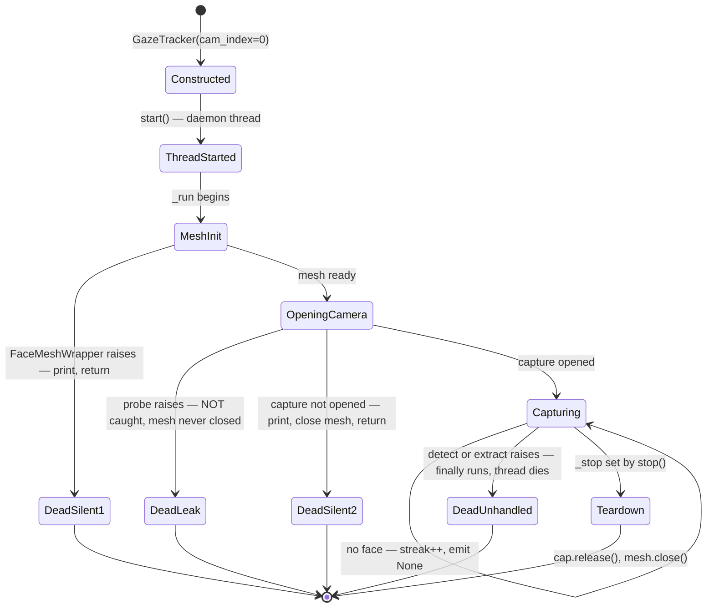
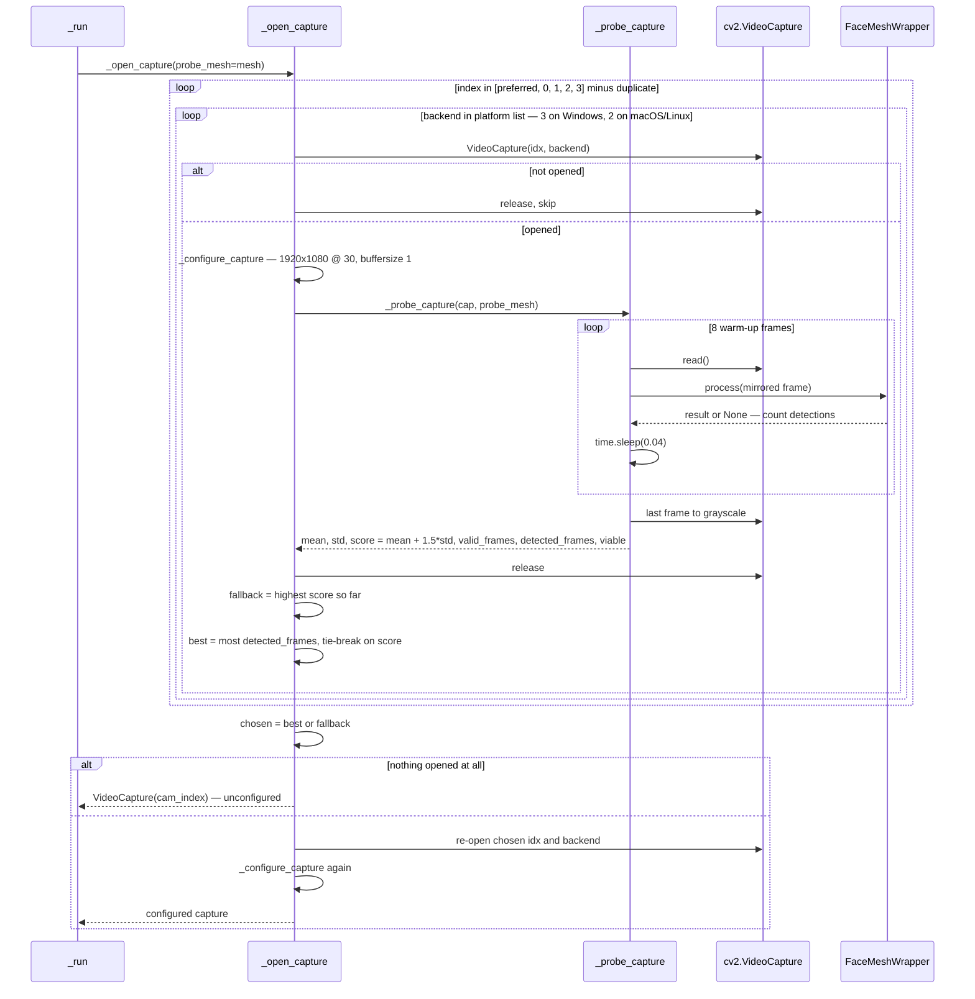
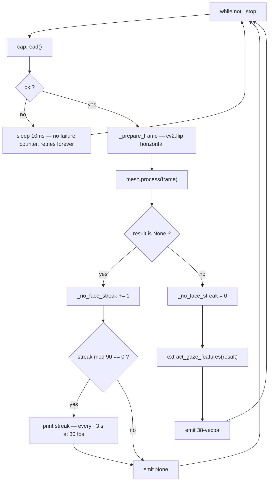

# Deep-Dive - Capture Thread & Camera Selection

**Date**: 2026-08-06
**Analyzed By**: ARCHITECT
**Status**: Draft

---

## Module Overview

**Purpose**: Own the only worker thread in the system. Discover and rank available cameras, run the capture loop, and publish one feature vector per frame across the thread boundary via a Qt signal.

**Path**: [eye_tracker/tracker.py](eye_tracker/tracker.py)
**Key Files**: 1 file, 171 lines
**Imports**: `sys`, `threading`, `time`, `cv2`, `numpy` (**unused**), `PyQt6.QtCore` (`QObject`, `pyqtSignal`), plus `FaceMeshWrapper` and `extract_gaze_features`
**Imported by**: [main.py:27](main.py#L27) only

This module is the producer half of the system's single concurrency boundary. Everything downstream of `features_ready` runs on the Qt GUI thread.

---

## Component Breakdown

| Component | Lines | Visibility | Responsibility |
|-----------|-------|------------|----------------|
| `_preferred_backends` | [14-20](eye_tracker/tracker.py#L14-L20) | private | Platform-ranked OpenCV capture backends |
| `GazeTracker.features_ready` | [25](eye_tracker/tracker.py#L25) | **public signal** | `pyqtSignal(object)` — a 38-vector, or `None` when no face |
| `.__init__` | [27-35](eye_tracker/tracker.py#L27-L35) | **public** | Stores camera params; creates no resources |
| `.start` / `.stop` | [37-45](eye_tracker/tracker.py#L37-L45) | **public** | Daemon thread lifecycle; `stop` joins with a 1.5 s timeout |
| `._configure_capture` | [47-51](eye_tracker/tracker.py#L47-L51) | private | Sets width, height, FPS, buffer size |
| `._candidate_indices` | [53-56](eye_tracker/tracker.py#L53-L56) | private | Preferred index first, then 0–3 |
| `._probe_capture` | [58-84](eye_tracker/tracker.py#L58-L84) | private | Reads 8 warm-up frames; scores brightness/contrast and counts face detections |
| `._open_capture` | [86-132](eye_tracker/tracker.py#L86-L132) | private | Ranks every index × backend pair, then re-opens the winner |
| `._prepare_frame` | [134-136](eye_tracker/tracker.py#L134-L136) | private | Horizontal mirror |
| `._run` | [138-171](eye_tracker/tracker.py#L138-L171) | private | Thread body: init → open → loop → teardown |

---

## Key Workflows

### Workflow: Thread lifecycle and failure paths



**Four distinct death paths, none of which reach the user.** The GUI has no channel to learn that the producer has stopped — the Qt event loop keeps running and the calibration window keeps displaying "Center your face in the camera to start calibration" indefinitely.

### Workflow: Camera discovery and ranking



**Selection is driven by actual face detection, not by "first device that opens."** A candidate with any detected face beats every candidate with none, regardless of brightness. Only within the detected group, and within the no-detection fallback group, does the brightness/contrast score decide. This is a genuinely good design — it correctly prefers a dim front-facing webcam over a bright rear-facing or capture-card device.

### Workflow: The capture loop



---

## Data Models

### The `features_ready` signal contract

| Aspect | Value | Evidence |
|--------|-------|----------|
| Declaration | `pyqtSignal(object)` | [tracker.py:25](eye_tracker/tracker.py#L25) |
| Payload | `ndarray(38,)` float64, **or** `None` | [164](eye_tracker/tracker.py#L164), [168](eye_tracker/tracker.py#L168) |
| Emitting thread | the daemon capture thread | [39](eye_tracker/tracker.py#L39) |
| Receiving thread | Qt GUI thread (both receivers constructed there) | [main.py:66](main.py#L66), [overlay.py:117](eye_tracker/overlay.py#L117) |
| Delivery | **queued** — Qt auto-connection across threads | implicit |
| Ordering | FIFO per receiver | Qt guarantee |
| Back-pressure | **none** | see below |
| Capture timestamp | **not carried** | see below |
| Frequency | camera frame rate, requested 30 fps | [27](eye_tracker/tracker.py#L27) |

**`None` means "no face this frame", not "shutting down".** Both receivers return early on `None` ([overlay.py:160-161](eye_tracker/overlay.py#L160-L161), [main.py:89](main.py#L89)), so losing the face during live tracking leaves the dot frozen at its last position rather than hiding it. `GazeOverlay.set_dot_visible` exists for exactly this purpose and is never called — see [05](docs/architecture/current/05-overlay-deep-dive.md).

**The queued connection is a correctness dependency that is nowhere asserted.** Qt selects queued delivery only because both receivers are QObjects created on the GUI thread. If a future refactor constructed either receiver on the worker thread, Qt would switch to a direct connection and every consumer — including `QPainter` calls — would execute on the capture thread. The system would still start and would fail in ways that look like rendering bugs. A single `assert QThread.currentThread() is QApplication.instance().thread()` in the receivers' constructors would pin this down.

### Configuration — all hardcoded

| Parameter | Value | Site | Effective? |
|-----------|-------|------|-----------|
| `cam_index` | `0` | [main.py:134](main.py#L134) | yes — becomes the first probe candidate |
| `width`, `height` | `1920 × 1080` | [tracker.py:27](eye_tracker/tracker.py#L27) | yes on the normal path, **no** on two fallback paths |
| `fps` | `30` | [tracker.py:27](eye_tracker/tracker.py#L27) | yes on the normal path only |
| `CAP_PROP_BUFFERSIZE` | `1` | [51](eye_tracker/tracker.py#L51) | backend-dependent; silently ignored by some |
| `warmup_frames` | `8` | [58](eye_tracker/tracker.py#L58) | yes — never overridden |
| probe sleep | `0.04 s` | [69](eye_tracker/tracker.py#L69) | yes |
| viability thresholds | `mean ≥ 25.0`, `std ≥ 10.0` | [76](eye_tracker/tracker.py#L76) | **NO — dead, see below** |
| score weighting | `mean + 1.5 × std` | [75](eye_tracker/tracker.py#L75) | yes |
| candidate indices | `0..3` | [55-56](eye_tracker/tracker.py#L55-L56) | yes |
| no-face log interval | every `90` frames | [159](eye_tracker/tracker.py#L159) | yes — ~3 s at 30 fps |
| read-failure sleep | `0.01 s` | [153](eye_tracker/tracker.py#L153) | yes |
| join timeout | `1.5 s` | [45](eye_tracker/tracker.py#L45) | yes |

---

## Findings

### `viable` is computed and never read — the thresholds have no effect

[tracker.py:76](eye_tracker/tracker.py#L76) computes `viable = mean >= 25.0 or std >= 10.0` and [81](eye_tracker/tracker.py#L81) publishes it in the probe result. `_open_capture` reads `score`, `detected_frames` and `valid_frames` from that dict — never `viable`. Verified by search across all `.py` files: the only occurrences are the two lines that create it.

**This corrects the Configuration table in [00-system-overview.md](docs/architecture/current/00-system-overview.md)**, which lists "Camera viability thresholds — mean ≥ 25.0, std ≥ 10.0" as a live tunable. It is dead. A camera producing a completely black frame is *not* excluded: with no face detected anywhere, selection falls through to `fallback`, which is chosen purely on highest `score`. A black camera scores ~0 and loses to any brighter device — so the intended effect is partly achieved by accident, but if *every* candidate is black the darkest-but-first is still opened and the loop runs forever on black frames, emitting `None` and printing a no-face streak every 3 seconds.

### Startup latency is significant and unbounded

Probing is serial over index × backend. On Windows that is 4 indices × 3 backends = **12 combinations**, and each combination that opens performs 8 iterations of `read()` + MediaPipe inference + `time.sleep(0.04)`.

The sleeps alone are exact arithmetic: **320 ms per opened candidate**, so up to **3.84 s** of pure sleeping if all 12 open. On top of that, per opened candidate:

- 8 × `cap.read()` — up to ~33 ms each at 30 fps
- 8 × `FaceMeshWrapper.process()` — a full landmark inference each, tens of ms on CPU
- one `VideoCapture` open and one `release` — commonly 0.3–2 s per open on Windows DSHOW/MSMF

⚠️ The total is **not measurable from source** and was not measured here (no camera available). What is certain: the floor is 320 ms × (number of openable candidates), the winner is then re-opened a 13th time ([117](eye_tracker/tracker.py#L117)), and `CAP_ANY` on Windows typically resolves to DSHOW or MSMF — so at least one device is probed twice with identical results.

Meanwhile [main.py:44-50](main.py#L44-L50) starts the tracker and immediately constructs the calibration window, so the user sees "Center your face in the camera to start calibration" for the entire probe duration with no indication that anything is happening. **The perceived startup time is dominated by a loop whose cost nobody measured.**

Cheap mitigations exist and need no redesign: stop probing once a candidate detects a face; skip `CAP_ANY` when a specific backend already succeeded; probe the preferred index across all backends before trying other indices.

### `_configure_capture` is skipped on both fallback paths

| Path | Line | `_configure_capture` called? |
|------|------|------------------------------|
| Normal — chosen candidate re-opened | [117-121](eye_tracker/tracker.py#L117-L121) | ✅ yes |
| Nothing opened during probing | [115](eye_tracker/tracker.py#L115) | ❌ **no** |
| Chosen re-open failed, retry without backend | [120](eye_tracker/tracker.py#L120) | ❌ **no** |

On either fallback the camera runs at its driver default — commonly 640×480 — instead of 1920×1080.

Most features are resolution-normalised and survive this, but **`focal = float(w)`** in [face_mesh.py:163](eye_tracker/face_mesh.py#L163) is not: a 640-wide frame produces a different assumed focal length, so `solvePnP`'s translation output changes scale. Features 11–13 (`TZ`, `TX`, `TY`) therefore mean something different on the fallback path than on the normal path. Within one session the GP absorbs the difference as a constant bias; across sessions — which matters if calibration is ever persisted — the two are not comparable.

### `_open_capture` is outside the try/finally — mesh leaks on probe failure

```python
try:
    mesh = FaceMeshWrapper()
except Exception as exc:
    print(f"[tracker] failed to initialize face landmarks: {exc}")
    return
cap = self._open_capture(probe_mesh=mesh)   # line 144 — unprotected
if not cap.isOpened():
    print("[tracker] failed to open webcam")
    mesh.close()
    return
try:                                        # line 149 — protection starts here
    while not self._stop:
        ...
finally:
    cap.release()
    mesh.close()
```

`_open_capture` calls `probe_mesh.process(...)` at [67](eye_tracker/tracker.py#L67). If MediaPipe raises there, the exception escapes `_run` entirely: no message is printed, `mesh.close()` never runs, and the MediaPipe graph plus any `VideoCapture` still held by the probe loop are leaked. The two explicit failure paths on either side of this call are both handled; the one in the middle is not.

### No exception handling inside the capture loop

`mesh.process()` and `extract_gaze_features()` are both called unguarded at [156](eye_tracker/tracker.py#L156) and [167](eye_tracker/tracker.py#L167). Either can raise — MediaPipe on a malformed frame, `extract_gaze_features` with `KeyError` if the result dict is ever incomplete. The `try` at [149](eye_tracker/tracker.py#L149) has only a `finally`, no `except`, so a single transient failure terminates the producer permanently. The traceback goes to `stderr` via `threading`'s default hook, which a GUI app launched from a desktop shortcut discards. From the user's perspective the dot simply stops moving, forever.

The contrast with [main.py:113-117](main.py#L113-L117) is instructive: the consumer wraps its per-frame work in `except Exception` and continues, while the producer — where a transient failure is at least as likely — has no guard at all. Neither choice is documented; the codebase has both extremes and no stated rule.

### `cap.read()` failure retries forever with no counter

[151-154](eye_tracker/tracker.py#L151-L154) sleeps 10 ms and continues, with no failure counter and no escalation. A camera unplugged mid-session yields a loop spinning at ~100 Hz indefinitely, emitting nothing. There is no timeout, no reconnect attempt, and no notification — and because no `None` is emitted on this path, consumers cannot distinguish "camera gone" from "still working".

### `_no_face_streak` is unbounded

[157-163](eye_tracker/tracker.py#L157-L163) increments forever and is used only as `% 90` for log throttling. It resets to 0 on any successful detection. Harmless in practice — Python integers do not overflow — but it is the only unbounded counter in the hot loop, and the print it drives goes to a stream nobody reads.

### No capture timestamp is carried across the boundary

The signal payload is the feature vector alone. `main._motion_score` therefore timestamps with `time.monotonic()` at **slot execution** time ([main.py:103](main.py#L103)), not at capture time. Any queuing delay between emission and delivery is silently attributed to the gaze signal: a delayed batch produces small `dt`, which inflates `gaze_delta / dt`, which raises the motion score, which shrinks the median window and widens the smoother cutoff. The system's motion estimate is thus partly a measure of GUI-thread scheduling jitter.

There is also no back-pressure — the producer emits at camera rate regardless of consumer throughput, and Qt's queue is unbounded. With 25 calibration points the six GP predictions are sub-millisecond so the queue stays short, but nothing in the design prevents growth if prediction cost rises.

One queuing hazard that does **not** occur: during the multi-second blocking GP fit, `features_ready` has no connected receivers at all — `CalibrationWindow` disconnects at [overlay.py:227-231](eye_tracker/overlay.py#L227-L231) before emitting `finished`, and `main` connects `_on_feat` only after `fit` returns ([main.py:66](main.py#L66)). Emissions during the fit are discarded rather than queued, so there is no post-calibration burst of stale frames. This is correct behaviour that appears to be incidental rather than designed — nothing documents the ordering dependency.

### `stop()` cannot guarantee the thread has exited

[42-45](eye_tracker/tracker.py#L42-L45) sets `_stop` and joins with a 1.5 s timeout, with no check of the result. A blocking `cap.read()` can exceed that, in which case `stop()` returns while the thread is still inside `read`, still holding the camera, and will subsequently run its `finally` block. Because the thread is a daemon, process exit does not wait for it. In practice this is benign — the OS reclaims the device — but `stop()` returning is not evidence the camera has been released, and [main.py:128-129](main.py#L128-L129) treats it as if it were.

### Unused `numpy` import

[tracker.py:7](eye_tracker/tracker.py#L7) imports `numpy as np`. Verified by search: the only occurrence of `np.` in the file is inside the comment at [24](eye_tracker/tracker.py#L24). The module never uses numpy.

---

## Pattern Catalog

### Pattern 1 — Platform-ranked capability lists  ✅ [Current — good]

**Example** ([tracker.py:14-20](eye_tracker/tracker.py#L14-L20)):

```python
# DO: one function owns the platform decision, ordered best-first with a
#     generic fallback last
def _preferred_backends():
    """Platform-appropriate OpenCV capture backends, tried in order."""
    if sys.platform == "darwin":
        return [cv2.CAP_AVFOUNDATION, cv2.CAP_ANY]
    if sys.platform.startswith("win"):
        return [cv2.CAP_DSHOW, cv2.CAP_MSMF, cv2.CAP_ANY]
    return [cv2.CAP_V4L2, cv2.CAP_ANY]

# DON'T: rely on the default backend and hope
cap = cv2.VideoCapture(idx)
```

Matches `_cache_dir` in [face_mesh.py:43-46](eye_tracker/face_mesh.py#L43-L46) and `_IS_MAC` in [overlay.py:18](eye_tracker/overlay.py#L18) — a consistently applied project convention. The docstring stating the ordering contract is the detail that makes it maintainable.

### Pattern 2 — Evidence-based resource selection  ✅ [Current — the module's best idea]

Candidates are ranked by whether they achieve the *actual goal* (a detected face), with signal-quality heuristics used only to break ties.

**Example** ([tracker.py:101-111](eye_tracker/tracker.py#L101-L111)):

```python
# DO: rank by the outcome that matters, fall back to a proxy metric
if fallback is None or candidate["score"] > fallback["score"]:
    fallback = candidate
if candidate["detected_frames"] > 0 and (
    best is None
    or candidate["detected_frames"] > best["detected_frames"]
    or (candidate["detected_frames"] == best["detected_frames"]
        and candidate["score"] > best["score"])
):
    best = candidate
chosen = best or fallback

# DON'T: take the first device that opens
for idx in range(4):
    cap = cv2.VideoCapture(idx)
    if cap.isOpened():
        return cap
```

The `best or fallback` idiom cleanly expresses "prefer proven, accept plausible".

### Pattern 3 — Probe-then-commit resource acquisition  ⚠️ [Current — sound, with a gap]

Every candidate is opened, measured, and released before the winner is re-opened ([91-121](eye_tracker/tracker.py#L91-L121)). This avoids holding multiple camera handles at once, which some drivers refuse.

The gap is that release-then-reopen is not atomic: another process can claim the device in between, and the retry at [120](eye_tracker/tracker.py#L120) then silently drops both the backend choice and the resolution configuration.

### Pattern 4 — Cross-thread publication by value  ✅ [Current — correct]

**Example** ([tracker.py:166-168](eye_tracker/tracker.py#L166-L168)):

```python
# DO: emit a freshly allocated, immutable-by-convention payload — no lock needed
feat = extract_gaze_features(result)      # new ndarray every frame
self.features_ready.emit(feat)

# DON'T: reuse a buffer the consumer might still be reading
self._scratch[:] = extract_gaze_features(result)
self.features_ready.emit(self._scratch)
```

Because `extract_gaze_features` is pure and allocates per call ([gaze.py:173-212](eye_tracker/gaze.py#L173-L212)), no synchronisation is required anywhere in the system. This is why the codebase has zero locks — an architectural property worth stating explicitly in the target-state patterns, because it is easy to destroy accidentally by "optimising" the allocation away.

### Pattern 5 — Daemon thread with a cooperative stop flag  ⚠️ [Current — incomplete]

**Example** ([tracker.py:37-45](eye_tracker/tracker.py#L37-L45)):

```python
# CURRENT: cooperative flag, bounded join, result discarded
def stop(self):
    self._stop = True
    if self._thread is not None:
        self._thread.join(timeout=1.5)

# DO: surface the case where the thread did not actually stop
def stop(self):
    self._stop = True
    if self._thread is not None:
        self._thread.join(timeout=1.5)
        if self._thread.is_alive():
            logger.warning("capture thread did not exit within 1.5s")
```

`_stop` is a plain `bool` mutated from the GUI thread and read from the worker. This is safe under CPython's memory model for a single-writer flag, but it is an implicit assumption; `threading.Event` would state the intent.

### Pattern 6 — `print()` as the only diagnostic channel  ❌ [Current — should not be carried forward]

Five `print` sites in this module ([123-131](eye_tracker/tracker.py#L123-L131), [142](eye_tracker/tracker.py#L142), [146](eye_tracker/tracker.py#L146), [160-163](eye_tracker/tracker.py#L160-L163)), nine across the codebase.

```python
# CURRENT: no level, no destination control, discarded in a windowed app
print(f"[tracker] failed to initialize face landmarks: {exc}")

# DO: a level, a logger name, and structured context
logger.error("face landmark init failed", exc_info=exc)
```

The `[tracker]` / `[calibration]` / `[predict]` bracket prefixes are a consistent convention and effectively hand-rolled logger names — which makes migrating to `logging` mostly mechanical. Worth noting for the patterns workflow: the *convention* is sound, only the mechanism is wrong.

### Pattern 7 — Naming conventions  ✅ [Current — consistent]

| Kind | Convention | Example |
|---|---|---|
| Public class | `<PascalCase>`, `QObject` subclass | `GazeTracker` |
| Public signal | `<lower_snake>`, past participle | `features_ready` |
| Public methods | `<lower_snake>` | `start`, `stop` |
| Private methods | `_<lower_snake>` | `_open_capture`, `_probe_capture` |
| Private state | `_<lower_snake>` | `_stop`, `_thread`, `_no_face_streak` |
| Log prefix | `[<module>]` | `[tracker]` |

Consistent with the rest of the codebase. The one inconsistency is that `_probe_capture` returns an untyped dict whose six keys form an undeclared contract with `_open_capture` — the only inter-method contract in the module with no named structure, and the reason the dead `viable` key went unnoticed.

---

## Testing Patterns

**Current state: no tests exist.** Coverage 0%.

This is the hardest module in the codebase to test and the one where testability should shape the target design. Its logic is entangled with three things that resist unit testing: a real camera, MediaPipe, and a Qt event loop.

What is nonetheless testable **today**, with no hardware:

```python
# Suggested: tests/unit/test_tracker.py  (does not exist yet)
from eye_tracker.tracker import GazeTracker, _preferred_backends

def test_preferred_index_is_probed_first():
    t = GazeTracker(cam_index=2)
    assert t._candidate_indices()[0] == 2
    assert sorted(t._candidate_indices()) == [0, 1, 2, 3]   # no duplicates

def test_negative_or_none_index_probes_all():
    assert GazeTracker(cam_index=None)._candidate_indices() == [0, 1, 2, 3]
    assert GazeTracker(cam_index=-1)._candidate_indices() == [0, 1, 2, 3]

def test_backend_list_ends_with_a_generic_fallback():
    assert _preferred_backends()[-1] == cv2.CAP_ANY

def test_probe_scores_a_fake_capture(fake_cap_returning_gray_frames):
    # _probe_capture only needs .read(); a stub object suffices
    probe = GazeTracker()._probe_capture(fake_cap_returning_gray_frames(value=200))
    assert probe["valid_frames"] == 8
    assert probe["score"] == pytest.approx(200.0, abs=1.0)   # mean + 1.5*std, std≈0

def test_probe_returns_none_when_no_frame_ever_arrives(fake_cap_always_failing):
    assert GazeTracker()._probe_capture(fake_cap_always_failing()) is None
```

`_probe_capture` is the pleasant surprise: it depends only on an object with a `.read()` method, so a five-line stub covers it — including the dead `viable` field and the scoring formula. The 8 × 40 ms sleeps make each such test take 320 ms, which argues for making `warmup_frames` and the sleep interval injectable rather than literal.

**Not unit-testable as written**: `_open_capture` (constructs `cv2.VideoCapture` directly — needs injection or monkeypatching of the module attribute), and `_run` (constructs `FaceMeshWrapper` directly, loops forever, and emits Qt signals). Both would become testable if their collaborators were passed in rather than constructed inside. That is a target-state design note, not a defect.

---

## Entry Points

| Entry | Signature | Called by | Contract |
|-------|-----------|-----------|----------|
| `GazeTracker(cam_index, width, height, fps)` | → `GazeTracker` | [main.py:33](main.py#L33) | Allocates nothing; must be constructed on the GUI thread for queued signal delivery |
| `.start()` | `() -> None` | [main.py:45](main.py#L45) | Returns immediately; camera probing then runs asynchronously for seconds |
| `.stop()` | `() -> None` | [main.py:129](main.py#L129) | Best-effort; returning does not prove the thread exited or the camera was released |
| `.features_ready` | `pyqtSignal(object)` | [overlay.py:117](eye_tracker/overlay.py#L117), [main.py:66](main.py#L66) | `ndarray(38,)` or `None`; queued; no timestamp; no back-pressure |

`start()` is not idempotent — calling it twice creates a second thread sharing one `_stop` flag and one `_no_face_streak`. Nothing calls it twice today.

---

## Verification Record

**No execution was performed for this module.** Every finding above is derived from source reading and cross-file search, except where explicitly marked as arithmetic (the 320 ms sleep floor) — which is computed from the literals at [tracker.py:58](eye_tracker/tracker.py#L58) and [69](eye_tracker/tracker.py#L69), not measured.

| Claim | Basis |
|---|---|
| `viable` never read | Search across all `.py` files: 2 occurrences, both in `_probe_capture` ✅ |
| `numpy` unused | Search: only occurrence of `np.` is in the comment at line 24 ✅ |
| `_configure_capture` skipped on 2 paths | Source reading of [115](eye_tracker/tracker.py#L115), [120](eye_tracker/tracker.py#L120) ✅ |
| `_open_capture` outside try/finally | Source reading of [138-171](eye_tracker/tracker.py#L138-L171) ✅ |
| No receivers connected during the GP fit | Traced across [overlay.py:227-231](eye_tracker/overlay.py#L227-L231) and [main.py:60-66](main.py#L60-L66) ✅ |
| Probe sleep floor of 320 ms per candidate | `warmup_frames=8 × 0.04 s` ✅ arithmetic |

⚠️ **Not verified — requires a webcam**: actual probe wall-clock time, whether `CAP_PROP_BUFFERSIZE` is honoured, real frame rate, whether any fallback path is ever taken in practice, and how the loop behaves when a camera is unplugged mid-session. These are the module's most important open questions and none can be closed from source.

---

## Recommendations

1. **Give the GUI a failure channel.** Four death paths currently end in a `print` and a silent, permanently idle application. An `error` signal alongside `features_ready` would let the calibration window say what went wrong. This is the single highest-value change in the module.
2. **Wrap the capture loop body in `except Exception`** with a bounded consecutive-failure counter, so one transient MediaPipe error does not permanently kill the producer.
3. **Move `_open_capture` inside the try/finally**, or wrap it, so a probe failure cannot leak the MediaPipe graph.
4. **Either use `viable` or delete it.** Right now it is a threshold that reads as a safety check and is not one — and it is documented as live configuration in the system overview.
5. **Cut probe cost**: stop at the first candidate that detects a face, skip `CAP_ANY` when a specific backend already worked, and make `warmup_frames` / sleep injectable so tests do not pay 320 ms each.
6. **Call `_configure_capture` on every return path**, so `focal = frame_width` means the same thing regardless of which path opened the camera.
7. **Carry a capture timestamp in the signal payload** so motion estimation measures the user rather than GUI scheduling jitter.
8. **Assert the GUI-thread affinity of the receivers**, converting an invisible correctness dependency into a loud one.
9. **Emit a distinguishable signal when the camera dies**, so a frozen dot can be told apart from a steady gaze.

---

## Cross-References

| Topic | Document |
|---|---|
| What `extract_gaze_features` returns and what it can raise | [01-gaze-deep-dive.md](docs/architecture/current/01-gaze-deep-dive.md) |
| `FaceMeshWrapper` construction, download, and the shared probe instance | [03-face-mesh-deep-dive.md](docs/architecture/current/03-face-mesh-deep-dive.md) |
| The calibration-side receiver and its connect/disconnect lifecycle | [05-overlay-deep-dive.md](docs/architecture/current/05-overlay-deep-dive.md) |
| The live-side receiver, motion scoring, and the `dt` sensitivity | [07-main-deep-dive.md](docs/architecture/current/07-main-deep-dive.md) |
