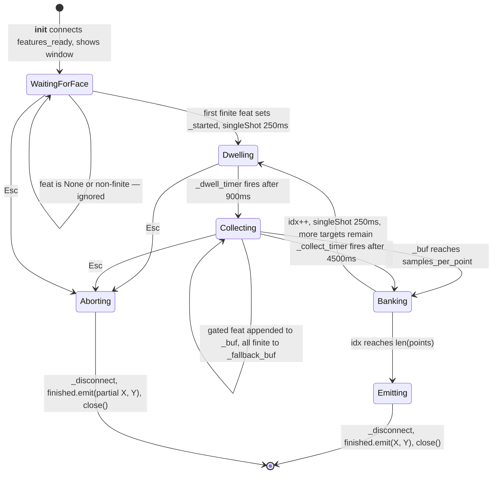
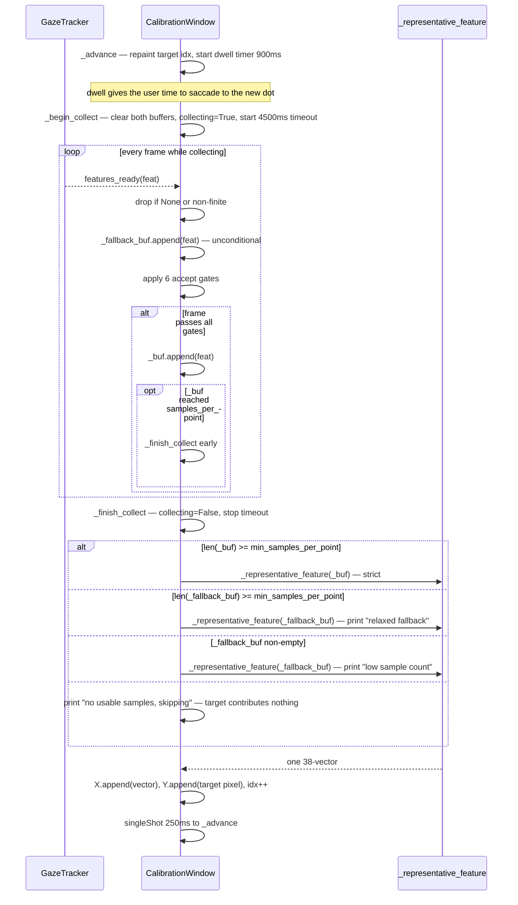
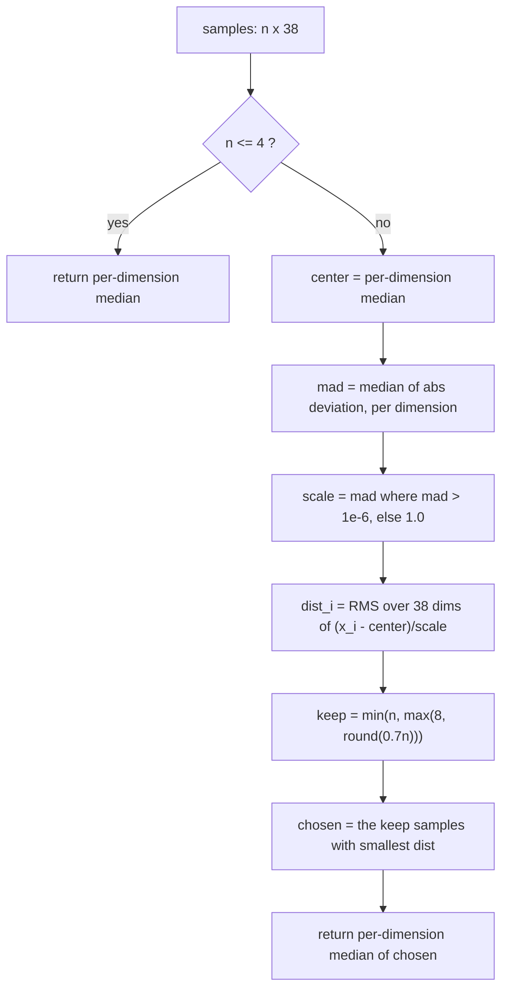

# Deep-Dive - UI Windows & Calibration State Machine

**Date**: 2026-08-06
**Analyzed By**: ARCHITECT
**Status**: Draft

---

## Module Overview

**Purpose**: Provide the system's entire user interface — a click-through gaze dot, and a full-screen calibration ritual that sequences targets, gates incoming frames, and selects one representative feature vector per target.

**Path**: [eye_tracker/overlay.py](eye_tracker/overlay.py)
**Key Files**: 1 file, 267 lines — the largest module in the codebase
**Imports**: `sys`, `numpy`, `PyQt6.QtCore` (`Qt`, `QTimer`, `QPointF`, `pyqtSignal`), `PyQt6.QtGui` (`QBrush`, `QColor`, `QPainter`, `QPen`), `PyQt6.QtWidgets` (`QApplication`, `QWidget`), 6 feature constants from [gaze.py](eye_tracker/gaze.py)
**Imported by**: [main.py:26](main.py#L26)

`CalibrationWindow` is the most stateful component in the system: 8 mutable attributes, 2 timers, a signal connection it manages itself, and 3 static `singleShot` timers it does not.

> **Two findings in this module were reproduced by execution**, not merely traced — including a duplicate-emission defect and an application-exit constraint that changes how the GUI-freeze problem in [02](docs/architecture/current/02-calibration-deep-dive.md) can be fixed. See [Verification Record](#verification-record).

---

## Component Breakdown

| Component | Lines | Visibility | Responsibility |
|-----------|-------|------------|----------------|
| `_IS_MAC` | [18](eye_tracker/overlay.py#L18) | private | Platform flag driving three separate workarounds |
| `_representative_feature` | [21-33](eye_tracker/overlay.py#L21-L33) | private | MAD-normalised outlier trimming, then median |
| `GazeOverlay` | [36-78](eye_tracker/overlay.py#L36-L78) | **public** | Transparent, always-on-top, click-through dot |
| `CalibrationWindow` | [81-267](eye_tracker/overlay.py#L81-L267) | **public** | Target sequencer, frame gate, sample collector |
| `CalibrationWindow.finished` | [84](eye_tracker/overlay.py#L84) | **public signal** | `pyqtSignal(object, object)` → `(X, Y)` |
| `._grid` | [130-141](eye_tracker/overlay.py#L130-L141) | private static | Target layout, 4 tiers |
| `._advance` / `._begin_collect` / `._finish_collect` | [143-225](eye_tracker/overlay.py#L143-L225) | private | The three-phase per-target cycle |
| `._on_feat` | [159-192](eye_tracker/overlay.py#L159-L192) | private slot | Frame gate and dual-buffer accumulation |
| `._disconnect` | [227-233](eye_tracker/overlay.py#L227-L233) | private | Releases the signal and **two of five** timers |
| `.keyPressEvent` | [235-239](eye_tracker/overlay.py#L235-L239) | private | Esc → abort |

---

## Key Workflows

### Workflow: The calibration state machine



The transition marked **Banking → Dwelling** is where the defect lives: it is implemented as a static `QTimer.singleShot(250, self._advance)` that `_disconnect` cannot cancel.

### Workflow: Per-target cycle and sample selection



**The dual-buffer design is a deliberate anti-deadlock measure.** `_fallback_buf` accumulates every finite frame *before* the gates are applied ([overlay.py:172](eye_tracker/overlay.py#L172)), so if the thresholds are too strict for a given camera or user, calibration degrades to lower-quality samples instead of hanging. That is a genuinely thoughtful failure mode and worth preserving.

Its weak point is the third branch: `elif self._fallback_buf:` accepts **any** non-empty buffer, so a target can be represented by a single frame while the code prints a message nobody sees. There is no floor, and no record in `X` of which targets were degraded — so `fit` receives 25 rows of apparently equal quality when some may be one raw frame and others a 42-sample trimmed median.

### Workflow: Sample selection algorithm



---

## Data Models

### `finished` signal payload

| Field | Type | Content |
|-------|------|---------|
| `X` | `ndarray (m, 38)` float64 | One representative feature vector per **successful** target |
| `Y` | `ndarray (m, 2)` int | Target pixel coordinates, `(cx, cy)` |

`m ≤ len(points)` — skipped targets are absent from **both** arrays, so index correspondence is preserved. On abort with zero successes, `np.array([])` has shape `(0,)`, and `len(X) == 0` still satisfies the guard at [main.py:55](main.py#L55).

### Target layout — `_grid`

| `n_points` | Branch | xs | ys | Targets |
|---|---|---|---|---|
| ≤ 9 | [132-133](eye_tracker/overlay.py#L132-L133) | 0.1, 0.5, 0.9 | 0.1, 0.5, 0.9 | 9 |
| ≤ 16 | [134-135](eye_tracker/overlay.py#L134-L135) | 0.07, 0.36, 0.64, 0.93 | same | 16 |
| ≤ 25 | [136-138](eye_tracker/overlay.py#L136-L138) | 0.06, 0.28, 0.5, 0.72, 0.94 | **0.05, 0.22, 0.42, 0.66, 0.9** | **25 — shipped** |
| > 25 | [139-140](eye_tracker/overlay.py#L139-L140) | `linspace(0.07, 0.93, 5)` | same | 25 |

Emission order is `for y in ys for x in xs` — row-major, left-to-right then top-to-bottom.

Two observations about the shipped tier:

- **The vertical spacing is deliberately non-uniform and top-biased**: gaps of 0.17, 0.20, 0.24, 0.24, with a 0.05 top margin against a 0.10 bottom margin. The mean target `y` is 0.45, not 0.5. Horizontal spacing is uniform and symmetric by contrast. This looks like intentional compensation — vertical gaze range is anatomically smaller than horizontal, so sampling the upper screen more densely is defensible — but **no comment explains it**, so a future reader cannot tell design from typo.
- **Requesting *more* than 25 points yields a different, symmetric 25-point layout.** The `else` branch produces a uniform `linspace` grid, discarding the asymmetry. So `n_points=30` gives 25 targets laid out differently from `n_points=25`. The parameter selects a layout tier, not a count.

### Mutable state of `CalibrationWindow`

| Attribute | Type | Reset by | Notes |
|-----------|------|----------|-------|
| `idx` | int | never | Current target; also the completion sentinel |
| `_started` | bool | never | Latches on first finite frame |
| `collecting` | bool | `_begin_collect` / `_finish_collect` | Guards re-entrant `_finish_collect` |
| `_buf` | list | `_begin_collect` | Gate-passing frames |
| `_fallback_buf` | list | `_begin_collect` | All finite frames |
| `X`, `Y` | lists | never | Accumulated results |
| `_dwell_timer`, `_collect_timer` | `QTimer` (children of `self`) | `_disconnect` stops both | Cancellable |
| 3 × `QTimer.singleShot` | static, unowned | **nothing can stop them** | [168](eye_tracker/overlay.py#L168), [225](eye_tracker/overlay.py#L225) |

**Two timer classes with different cancellability is the root cause of the defect below.** `_disconnect` stops the two it owns and cannot reach the three it does not.

### Live overlay geometry and appearance

| Property | Value | Site |
|---|---|---|
| Window flags | `Frameless \| StaysOnTop \| TransparentForInput`, plus `Tool` (non-mac) or `BypassWindowManager` (mac) | [41-51](eye_tracker/overlay.py#L41-L51) |
| Attributes | `WA_TranslucentBackground`, `WA_TransparentForMouseEvents`, `WA_ShowWithoutActivating` | [53-55](eye_tracker/overlay.py#L53-L55) |
| Geometry | `QApplication.primaryScreen().geometry()` — captured once | [56-57](eye_tracker/overlay.py#L56-L57) |
| Initial position | screen centre | [58-59](eye_tracker/overlay.py#L58-L59) |
| Dot | radius 14 px, fill `RGBA(255,40,40,210)`, 2 px white outline at alpha 230 | [76-78](eye_tracker/overlay.py#L76-L78) |
| Clipping | `np.clip` to `[0, width-1] × [0, height-1]` | [63-64](eye_tracker/overlay.py#L63-L64) |

---

## ✅ VERIFIED — aborting calibration can emit `finished` twice

### The mechanism

`_finish_collect` ends with a **static** single-shot timer ([overlay.py:225](eye_tracker/overlay.py#L225)):

```python
self.idx += 1
self.update()
QTimer.singleShot(250, self._advance)     # not owned by self — uncancellable
```

`_disconnect` ([227-233](eye_tracker/overlay.py#L227-L233)) releases the signal and stops the two member timers. It has no handle on this one:

```python
def _disconnect(self):
    try:
        self.tracker.features_ready.disconnect(self._feat_handler)
    except (TypeError, RuntimeError):
        pass
    self._dwell_timer.stop()
    self._collect_timer.stop()
    # the pending singleShot(250, self._advance) survives
```

`keyPressEvent` calls `_disconnect()`, emits `finished`, then `close()`. `close()` **hides** the widget — `WA_DeleteOnClose` is not set and `AppController.calib_win` still holds a reference — so the object stays alive and the pending timer still fires on it.

### The reproduction

Run headless with offscreen Qt against the real `CalibrationWindow`, with a stub tracker feeding gate-passing frames, and Esc delivered 30 ms after target 6 completed:

```
   1925ms  _finish_collect -> point 6 banked, X=6
   1940ms  --- Esc delivered, X=6 rows ---
   1940ms  finished #1 received, X=6 rows
   2340ms  post-Esc: calib visible=False overlays=1
   2341ms  _advance idx=6 visible=False      <-- resumes on the hidden window
[calibration] point 7: no usable samples, skipping
   2792ms  _advance idx=7 visible=False
[calibration] point 8: no usable samples, skipping
   3248ms  _advance idx=8 visible=False
[calibration] point 9: no usable samples, skipping
   3703ms  _advance idx=9 visible=False
   3703ms  finished #2 received, X=6 rows    <-- DUPLICATE

  finished emissions : 2 -> [6, 6]
  overlays created   : 2
  _on_feat connects  : 2
```

The control case — all 9 targets completed normally — emitted exactly once. **The defect is specific to abort.**

### Consequences in the shipped configuration

`_on_calib_done` ([main.py:53-66](main.py#L53-L66)) is idempotent in neither direction. On the second emission it re-runs completely:

| Effect | Detail |
|---|---|
| Second `calibrator.fit(X, Y)` | 30 more marginal-likelihood optimisations, blocking the GUI again with no explanation, on **identical** data |
| Second `GazeOverlay()` | The first is dereferenced at [main.py:64](main.py#L64) and destroyed; the dot window is recreated |
| Second `features_ready.connect(self._on_feat)` | Qt permits duplicate connections — **every subsequent frame is processed twice** |
| Smoother state | `OneEuro2D` is *not* recreated, so filter state carries across the re-fit |

The double `_on_feat` connection is the lasting damage. Each frame is appended to `_feat_history` twice, so the `maxlen=7` deque holds ~3.5 distinct frames instead of 7, halving the effective temporal median window at [main.py:112](main.py#L112). The prediction cost also doubles.

**Timing in the real configuration** (25 targets, `dwell_ms=900`, `collect_timeout_ms=4500`): each phantom target costs the full 250 + 900 + 4500 = **5650 ms**, because no samples arrive to end collection early. Aborting after target 6 leaves 19 phantom targets ≈ **107 seconds**, so the user experiences a spontaneous multi-second freeze and a flickering dot roughly a minute and a half after they thought they had cancelled.

**Exposure window**: the pending timer exists during the 250 ms gap after each target, out of a per-target cycle of ~3150 ms — about **8% of calibration wall-clock**, or 6.25 s across a full 25-target run.

**Reachability**: the second emission only matters if the first one led to live tracking, which requires `len(X) >= 5` at [main.py:55](main.py#L55). Aborting before target 5 quits the app immediately, so the path is unreachable there. Aborting at target 5 or later is where it bites.

**Fixes** (any one suffices): give the inter-target delay a member `QTimer` that `_disconnect` can stop; guard `_advance` with `if not self.isVisible(): return`; latch a `self._finished_emitted` flag; or set `WA_DeleteOnClose`. The narrowest correct fix is a member timer, because it addresses the cause rather than the symptom.

---

## ✅ VERIFIED — the app exits if the `finished` handler shows no window

While reproducing the above, the first harness attempt showed `finished` firing only once. The cause turned out to be more interesting than the defect: **closing the last visible top-level window terminates the Qt application** (`quitOnLastWindowClosed` defaults to `True`), so the event loop exited before the pending timer could fire.

Measured directly, with a handler that shows nothing:

```
   1921ms  --- Esc delivered, X=6 rows ---
   1921ms  finished #1 received, X=6 rows
   1922ms  post-Esc: calib visible=False overlays=0
  app survived close : NO — event loop exited
```

The real application survives only because of a precise, undocumented ordering:

1. `finished.emit(...)` invokes `_on_calib_done` **synchronously** (same thread, direct connection).
2. `_on_calib_done` runs `fit`, then `GazeOverlay()` and `.show()` — so a second visible top-level window exists.
3. Only then does `close()` run on the calibration window, and Qt sees a window still visible.

**This makes the obvious fix for the GUI freeze unsafe.** Moving `calibrator.fit` to a worker thread — the natural remedy for the multi-second freeze documented in [02](docs/architecture/current/02-calibration-deep-dive.md) — means `_on_calib_done` returns *before* the overlay exists. `close()` then finds no visible window and **the application exits silently** at the moment calibration completes.

Any work on the freeze must therefore first do one of: call `QApplication.setQuitOnLastWindowClosed(False)`, or construct and show `GazeOverlay` before the calibration window closes. This is a verified sequencing constraint, and it belongs in the target architecture rather than being rediscovered during implementation.

---

## Additional Findings

### The MAD trimming partly masks the feature-10 discontinuity — within a target only

[03](docs/architecture/current/03-face-mesh-deep-dive.md) verifies that `FEATURE_ROLL` rests at ±π and flips sign across the neutral head position. `_representative_feature` interacts with that in a way worth recording.

If a target's samples split across the branch cut, the per-dimension median lands on the majority branch, and `mad` for that dimension is ≈ 0 (over half the samples sit near the median). `scale` then falls back to `1.0` at [overlay.py:28](eye_tracker/overlay.py#L28), so the minority samples' raw deviation of ~6.28 rad enters `dist` unnormalised, contributing `sqrt(6.28²/38) ≈ 1.02` — comparable to a typical normalised deviation. The trimming therefore **does** tend to discard the minority branch when it is under 30% of samples, and the returned median lands cleanly on one branch.

What it cannot do is make different targets agree. Across 25 targets collected over ~79 seconds, some medians land on `+π` and others on `−π`, producing exactly the bimodal calibration column hypothesised in [02](docs/architecture/current/02-calibration-deep-dive.md#-hypothesis-feature-10-may-be-the-cause-on-real-data). So this module accidentally cleans up the intra-target noise while preserving the inter-target inconsistency that actually harms the fit.

### The "keep closest 70%" rule does not hold for small buffers

`keep = min(n, max(8, round(0.7n)))` at [overlay.py:30-31](eye_tracker/overlay.py#L30-L31):

| Samples `n` | `keep` | Effective retention |
|---|---|---|
| 60 (shipped target) | 42 | 70% |
| 20 (`min_samples_per_point`) | 14 | 70% |
| 12 | 8 | 67% |
| 10 | 8 | 80% |
| 8 | 8 | **100% — no trimming** |
| 5 | 5 | **100% — no trimming** |
| ≤ 4 | — | plain median, early return |

So for 5–8 samples the outlier rejection silently does nothing, and those are exactly the degraded targets that most need it. The `max(8, ...)` floor was presumably intended to keep the median statistically meaningful, but its effect is to disable trimming precisely where sample quality is worst.

### Calibration gates diverge from the live gates

| Condition | Calibration ([181-188](eye_tracker/overlay.py#L181-L188)) | Live ([main.py:94-101](main.py#L94-L101)) |
|---|---|---|
| `A_EAR` / `B_EAR` floor | 0.16 | 0.16 — same |
| `BLINK_AVG` ceiling | 0.55 | **0.58** |
| `SQUINT_AVG` ceiling | 0.55 | **0.58** |
| `abs(YAW)` ceiling | 0.60 | **0.70** |
| `abs(PITCH)` ceiling | 0.45 | **0.55** |

Two independent literal blocks, already diverged. The live envelope is wider, so frames are predicted under conditions never present during fitting — a train/serve mismatch with no single source of truth. And per [03](docs/architecture/current/03-face-mesh-deep-dive.md), the `YAW` and `PITCH` gates act on tilt and turn respectively, while nodding is ungated in both.

Contrast [calibration.py:153-164](eye_tracker/calibration.py#L153-L164), where a factory function guarantees six identical kernels. The same codebase demonstrates both the pattern and its absence.

### Full-window repaint per frame

`GazeOverlay.update_position` calls `self.update()` with no argument ([overlay.py:65](eye_tracker/overlay.py#L65)), invalidating the entire screen-sized translucent window every frame. At 1920×1080 and 30 fps the compositor recomposites a full-screen alpha surface 30 times a second to move a 28-pixel dot. `update(QRect)` covering the old and new dot bounds would reduce that by orders of magnitude. The same applies to `CalibrationWindow.update()`, though there it is called only a few times per target.

### Geometry is captured once and never revalidated

Both windows read `QApplication.primaryScreen().geometry()` in their constructors ([56](eye_tracker/overlay.py#L56), [98](eye_tracker/overlay.py#L98)) and never connect to `screenChanged`, `geometryChanged` or `primaryScreenChanged`. A resolution change, DPI change, or monitor reconfiguration mid-session leaves both windows sized to the old geometry, and `update_position` clipping to stale bounds. Combined with the single-monitor assumption already recorded in the system overview, gaze targets outside the primary display are unrepresentable and predictions are silently clamped to its edges.

### `keyPressEvent` swallows every other key

[235-239](eye_tracker/overlay.py#L235-L239) handles `Key_Escape` and never calls `super().keyPressEvent(event)`, so all other key presses are discarded rather than propagated. Harmless today — the window has no other interaction — but it means no future shortcut (skip target, restart, pause) can be added without noticing this.

### `set_dot_visible` is dead

Defined at [67-69](eye_tracker/overlay.py#L67-L69), never called anywhere. Verified by search. `_visible_dot` is therefore permanently `True` and the guard at [72-73](eye_tracker/overlay.py#L72-L73) never triggers.

This is the exact API needed for the unhandled case in [04](docs/architecture/current/04-tracker-deep-dive.md): when the tracker emits `None` for a lost face, the dot stays frozen at its last position instead of hiding. The mechanism was built and never wired up.

### No timeout waiting for the first face

If `_started` never latches — no camera, no face, or a dead capture thread — the window displays "Center your face in the camera to start calibration" indefinitely. There is no timeout and no diagnostic. Because the tracker's four failure paths only `print` ([04](docs/architecture/current/04-tracker-deep-dive.md)), this is the user-visible symptom of every startup failure in the system: a full-screen dark window that never progresses. Esc is the only exit, and it quits the app via the `< 5 points` branch.

### Calibration duration

| Phase | Best case (60 gated frames at 30 fps) | Worst case (timeout every target) |
|---|---|---|
| Per target | 900 dwell + 2000 collect + 250 gap = **3150 ms** | 900 + 4500 + 250 = **5650 ms** |
| 25 targets | **~79 s** | **~141 s** |

Plus camera probing before the first frame ([04](docs/architecture/current/04-tracker-deep-dive.md)) and 250 ms after the first detected face. So the shipped ritual is a 1.3-to-2.4-minute commitment with no progress bar beyond `(n/25)`, no pause, and — per the defect above — an abort path that is not clean.

---

## Pattern Catalog

### Pattern 1 — Robust statistics for sample selection  ✅ [Current — the module's best work]

**Example** ([overlay.py:21-33](eye_tracker/overlay.py#L21-L33)):

```python
# DO: normalise per dimension by MAD, rank by distance, trim, then median
center = np.median(arr, axis=0)
mad = np.median(np.abs(arr - center), axis=0)
scale = np.where(mad > 1e-6, mad, 1.0)          # degenerate dimensions opt out
dist = np.sqrt(np.mean(((arr - center) / scale) ** 2, axis=1))
keep = max(8, int(round(len(arr) * 0.7)))
chosen = arr[np.argsort(dist)[:keep]]
return np.median(chosen, axis=0)

# DON'T: mean over the raw buffer — one blink or saccade shifts the target
return np.mean(samples, axis=0)
```

Median-of-trimmed-by-MAD-distance is the right tool: resilient to saccades and blinks mid-collection, and scale-free across 38 features with wildly different units. The `mad > 1e-6` guard correctly avoids dividing by a degenerate dimension. Two caveats already noted: the `max(8, ...)` floor disables trimming for small buffers, and the `scale = 1.0` fallback lets an unnormalised dimension into `dist`.

### Pattern 2 — Dual-buffer graceful degradation  ✅ [Current — good intent, needs a floor]

**Example** ([overlay.py:170-190](eye_tracker/overlay.py#L170-L190), [200-217](eye_tracker/overlay.py#L200-L217)):

```python
# DO: collect a strict and a permissive buffer in parallel, so over-tight
#     thresholds degrade quality instead of deadlocking the ritual
self._fallback_buf.append(feat)          # unconditional
if (ear_a < 0.16 or ... or abs(pitch) > 0.45):
    return                               # strict buffer only
self._buf.append(feat)

# DON'T: gate into a single buffer and block forever if nothing qualifies
if passes_gates(feat):
    self._buf.append(feat)
```

The comment at [173-175](eye_tracker/overlay.py#L173-L175) states the intent explicitly, which is what makes this maintainable. The gap is the unbounded third branch — degradation should have a floor, and the degradation should be recorded in the emitted data so `fit` can weight accordingly.

### Pattern 3 — Timer-driven state machine  ❌ [Current — mixes two timer kinds, and it breaks]

**Example** — the inconsistency ([overlay.py:108-114](eye_tracker/overlay.py#L108-L114) vs [225](eye_tracker/overlay.py#L225)):

```python
# CURRENT, cancellable — member QTimer, child of self, stoppable
self._dwell_timer = QTimer(self)
self._dwell_timer.setSingleShot(True)
self._dwell_timer.timeout.connect(self._begin_collect)

# CURRENT, NOT cancellable — static singleShot, no handle, survives close()
QTimer.singleShot(250, self._advance)

# DO: every scheduled transition in a cancellable state machine is a member timer
self._gap_timer = QTimer(self)
self._gap_timer.setSingleShot(True)
self._gap_timer.timeout.connect(self._advance)
...
self._gap_timer.start(250)          # and _disconnect() can stop it
```

Three of the five scheduled transitions use the uncancellable form ([168](eye_tracker/overlay.py#L168), [225](eye_tracker/overlay.py#L225) reached from two paths). **The reproduced defect is a direct consequence.** The rule worth adopting: in a cancellable state machine, no transition may be scheduled by a timer the teardown path cannot reach.

### Pattern 4 — Defensive signal disconnection  ✅ [Current — correct as far as it goes]

**Example** ([overlay.py:227-233](eye_tracker/overlay.py#L227-L233)):

```python
# DO: tolerate an already-disconnected signal rather than guarding with a flag
try:
    self.tracker.features_ready.disconnect(self._feat_handler)
except (TypeError, RuntimeError):
    pass

# DON'T: track connection state by hand and get it wrong
if self._connected:
    self.tracker.features_ready.disconnect(self._feat_handler)
```

Storing the handler in `self._feat_handler` at [116](eye_tracker/overlay.py#L116) before connecting is also correct — it guarantees the same object is passed to `disconnect`. Both details show real PyQt experience. The method is simply incomplete: it releases the signal and two of five timers.

`main.py` has the opposite problem — `_on_feat` is connected at [main.py:66](main.py#L66) and **never** disconnected.

### Pattern 5 — Platform workarounds with stated reasons  ✅ [Current — exemplary]

**Example** ([overlay.py:46-51](eye_tracker/overlay.py#L46-L51), [119-127](eye_tracker/overlay.py#L119-L127)):

```python
# DO: state the observed symptom, not just the platform
# Tool-style windows hide when the owning app loses focus on macOS,
# which would make the overlay disappear as soon as you click elsewhere.
if not _IS_MAC:
    flags |= Qt.WindowType.Tool
else:
    flags |= Qt.WindowType.BypassWindowManagerHint

# On macOS, showFullScreen() triggers a native full-screen animation
# and moves the window to its own Space — we just want a borderless
# window that covers the display.
if _IS_MAC:
    self.show(); self.raise_(); self.activateWindow()
else:
    self.showFullScreen()
```

Both comments record the *symptom* that motivated the branch, which is what makes a platform hack safe to revisit. This is the best commenting in the codebase and the standard the project should hold.

### Pattern 6 — Naming conventions  ✅ [Current — consistent]

| Kind | Convention | Example |
|---|---|---|
| Public widgets | `<PascalCase>`, `QWidget` subclass | `GazeOverlay`, `CalibrationWindow` |
| Public signal | `<lower_snake>`, past participle | `finished` |
| Qt overrides | Qt's own `camelCase` | `paintEvent`, `keyPressEvent` |
| Private methods | `_<lower_snake>` | `_advance`, `_begin_collect` |
| Private state | `_<lower_snake>` | `_buf`, `_started`, `_dwell_timer` |
| Public state | bare | `idx`, `collecting`, `X`, `Y` |
| Log prefix | `[calibration]` | 4 sites |

Correctly preserves Qt's `camelCase` for overrides while using `snake_case` elsewhere. The one wart: `X` and `Y` are public single-capital attributes that shadow the mathematical convention used in [calibration.py](eye_tracker/calibration.py) — readable in context, but they are mutable public lists with no accessor.

---

## Testing Patterns

**Current state: no tests exist.** Coverage 0%.

`_representative_feature` is a pure function of an array — the single easiest unit in the module, and one where the small-buffer behaviour above deserves locking down:

```python
# Suggested: tests/unit/test_overlay.py  (does not exist yet)
import numpy as np
from eye_tracker.overlay import _representative_feature, CalibrationWindow

def test_outlier_is_trimmed_from_a_full_buffer():
    good = np.tile(np.arange(38, dtype=float), (59, 1))
    outlier = np.full((1, 38), 1e6)
    result = _representative_feature(np.vstack([good, outlier]))
    np.testing.assert_allclose(result, np.arange(38, dtype=float))

def test_small_buffers_are_not_trimmed_at_all():
    # Documents the max(8, ...) floor: with n<=8 the outlier survives into the median
    good = np.zeros((7, 38))
    result = _representative_feature(np.vstack([good, np.full((1, 38), 100.0)]))
    assert result.max() > 0.0     # trimming did NOT remove it

def test_grid_tiers_produce_the_documented_counts():
    for n, expected in [(9, 9), (16, 16), (25, 25), (30, 25)]:
        assert len(CalibrationWindow._grid(1920, 1080, n)) == expected

def test_grid_emits_row_major_top_to_bottom():
    pts = CalibrationWindow._grid(1000, 1000, 25)
    assert pts[0][1] == pts[4][1]        # first five share a row
    assert pts[0][1] < pts[5][1]         # rows descend
```

`_grid` is a `@staticmethod` and needs no instance — testable directly.

The state machine itself needs a `QApplication`, but **not a camera and not MediaPipe**: the verification for this document drove the real `CalibrationWindow` headless via `QT_QPA_PLATFORM=offscreen` with a 4-line stub tracker. That is a viable integration-test harness and the reproduction script is a working starting point:

```python
# Integration shape that worked, from the verification harness
class StubTracker(QObject):
    features_ready = pyqtSignal(object)

def test_normal_completion_emits_finished_exactly_once(qapp):
    win = CalibrationWindow(StubTracker(), n_points=9, samples_per_point=3,
                            dwell_ms=40, collect_timeout_ms=150)
    ...
    assert len(emissions) == 1

def test_abort_in_the_inter_target_gap_emits_finished_exactly_once(qapp):
    # Currently FAILS — emits twice. Written as the specification.
    ...
```

The second is a **failing specification** for the verified defect.

---

## Entry Points

| Entry | Signature | Called by | Contract |
|-------|-----------|-----------|----------|
| `GazeOverlay()` | → `GazeOverlay` | [main.py:64](main.py#L64) | Must be on the GUI thread; sizes to primary screen at construction |
| `.update_position(x, y)` | `(float, float) -> None` | [main.py:126](main.py#L126) | Clips silently to window bounds; triggers a **full-window** repaint |
| `.set_dot_visible(v)` | `(bool) -> None` | **nobody** | Dead API |
| `CalibrationWindow(tracker, n_points, samples_per_point, dwell_ms, collect_timeout_ms)` | → `CalibrationWindow` | [main.py:46](main.py#L46) | **Connects to `tracker.features_ready` and shows itself inside `__init__`** — construction has side effects |
| `.finished` | `pyqtSignal(object, object)` | [main.py:51](main.py#L51) | Delivered **synchronously**; handler must show a window before `close()` or the app exits; **can fire twice on abort** |

`CalibrationWindow.__init__` connecting a signal and showing a window is worth flagging: the object cannot be constructed for inspection or testing without it immediately becoming live.

---

## Verification Record

Scripts: `scratchpad/verify_calib_abort.py`, `verify_calib_abort2.py`, `verify_calib_abort3.py` (session scratchpad). Python 3.14.6, PyQt6 6.11.0, `QT_QPA_PLATFORM=offscreen`. The real `CalibrationWindow` was driven by a stub tracker with synthetic gate-passing frames. **No repository file was modified.**

| Test | Method | Result |
|---|---|---|
| Normal completion | 9 targets allowed to complete | `finished` emitted **once** ✅ |
| Abort in the inter-target gap | Esc 30 ms after target 6 banked, handler shows a window | `finished` emitted **twice**; 2 overlays; 2 `_on_feat` connections; targets 7–9 ran on the hidden window ✅ **DEFECT** |
| Abort with a handler that shows nothing | same, handler shows no window | Event loop **exited** on `close()`; pending timer never fired ✅ **CONSTRAINT** |
| Widget survives `close()` | queried `isVisible()` and `objectName()` after Esc | C++ object alive, `visible=False` ✅ |

**Method note.** The first harness reported a false negative — one emission — because it had no second window to keep the app alive, which is itself what surfaced the `quitOnLastWindowClosed` constraint. The corrected harness mirrors the real ordering: synchronous handler, blocking fit emulated at 400 ms, overlay shown before `close()`.

**Not verified — requires a webcam and a person**: real per-target timing, how often the fallback buffer is used in practice, whether the top-biased vertical grid improves accuracy, and real-world gate rejection rates. Timing figures in this document are arithmetic from the literals, not measurements.

---

## Recommendations

1. **Make every scheduled transition cancellable.** Replace the three static `singleShot` calls with a member `QTimer` that `_disconnect` stops. This fixes the verified duplicate-emission defect at its cause.
2. **Make `_on_calib_done` idempotent as a second line of defence** — a latch on the controller side, so no future timer path can re-fit and re-connect.
3. **Set `setQuitOnLastWindowClosed(False)` before touching the fit threading.** The verified app-exit constraint means the GUI-freeze fix and the window-lifetime fix must land together, in that order.
4. **Give the fallback path a floor and a provenance record.** A target represented by one raw frame should either be rejected or be marked so `fit` can down-weight it.
5. **Unify the gate thresholds with the live path** behind one shared definition, and re-derive them once the head-pose axes are corrected ([03](docs/architecture/current/03-face-mesh-deep-dive.md)).
6. **Fix the small-buffer trimming floor**, so outlier rejection is strongest where sample quality is worst rather than disabled there.
7. **Wire up `set_dot_visible`** so a lost face hides the dot instead of freezing it.
8. **Repaint only the dirty rectangle** in `GazeOverlay`.
9. **Add a first-face timeout with a visible message.** Right now every upstream failure presents identically as a dark screen that never progresses.
10. **Comment the vertical grid asymmetry**, or make it symmetric. As written, nobody can tell whether `0.05, 0.22, 0.42, 0.66, 0.9` is a design or a typo.

---

## Cross-References

| Topic | Document |
|---|---|
| The 6 feature constants read by the gates, and their sign conventions | [01-gaze-deep-dive.md](docs/architecture/current/01-gaze-deep-dive.md) |
| What `fit` does with `X`/`Y`, and the GUI-freeze cost | [02-calibration-deep-dive.md](docs/architecture/current/02-calibration-deep-dive.md) |
| Why the `YAW`/`PITCH` gates act on the wrong axes; feature 10's ±π wrap | [03-face-mesh-deep-dive.md](docs/architecture/current/03-face-mesh-deep-dive.md) |
| The `features_ready` contract, `None` semantics, and silent producer death | [04-tracker-deep-dive.md](docs/architecture/current/04-tracker-deep-dive.md) |
| `_on_calib_done`, the live gates, and the duplicate-connection consequence | [07-main-deep-dive.md](docs/architecture/current/07-main-deep-dive.md) |
