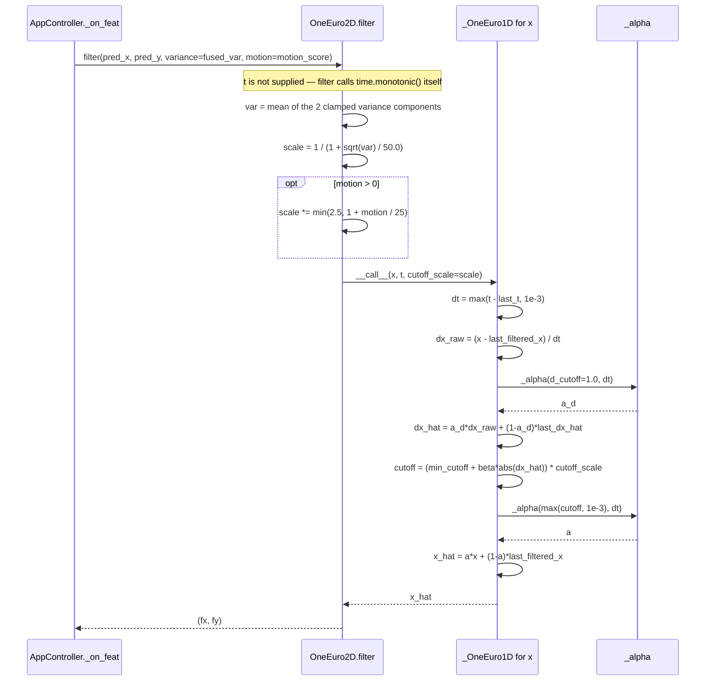
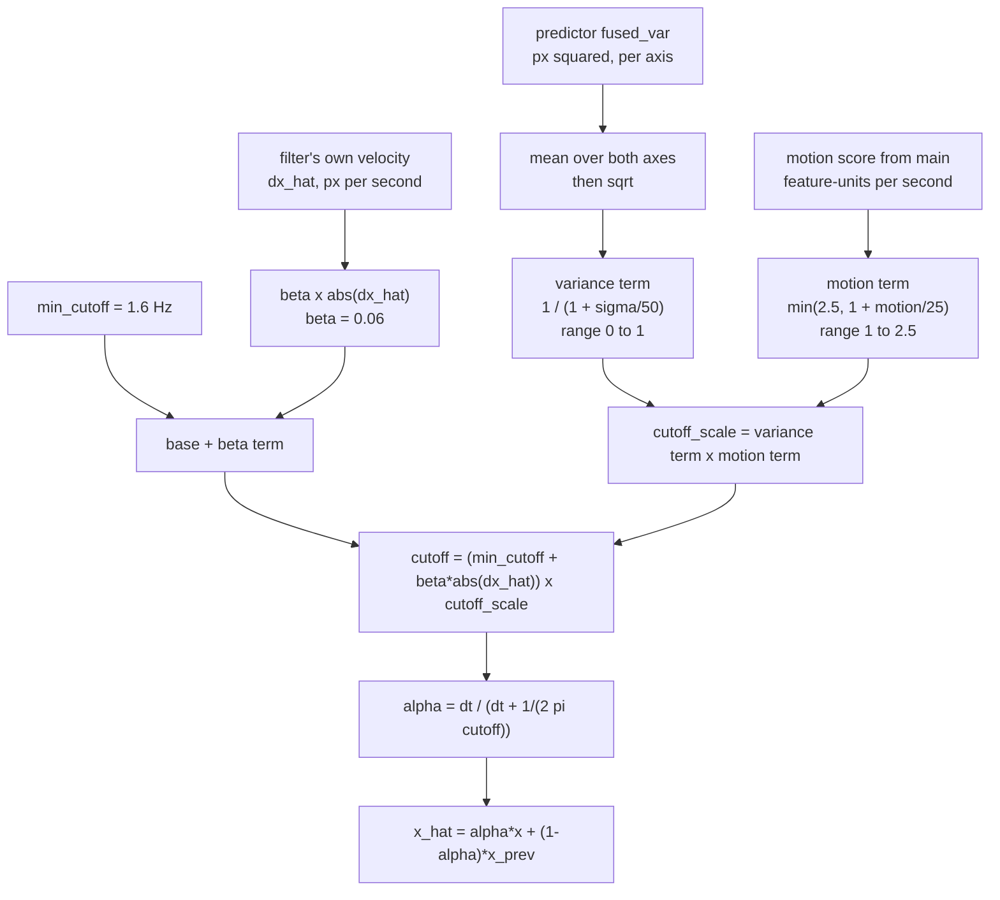

# Deep-Dive - One Euro Smoothing

**Date**: 2026-08-06
**Analyzed By**: ARCHITECT
**Status**: Draft

---

## Module Overview

**Purpose**: Suppress jitter in the predicted gaze point without adding perceptible lag, adapting its aggressiveness to three inputs: the signal's own velocity, the predictor's reported uncertainty, and an externally supplied motion score.

**Path**: [eye_tracker/one_euro.py](eye_tracker/one_euro.py)
**Key Files**: 1 file, 63 lines — the smallest functional module
**Imports**: `math`, `time`, `numpy`
**Imported by**: [main.py:25](main.py#L25)

This is the last stage in the pipeline. Its output goes straight to `GazeOverlay.update_position`, so it is the module that determines what the dot's motion actually *feels* like.

> All numeric tables in this document are ✅ **measured** by executing the real filter with the shipped parameters, not derived from the formulas. Method in [Verification Record](#verification-record).

---

## Component Breakdown

| Component | Lines | Visibility | Responsibility |
|-----------|-------|------------|----------------|
| Module docstring | [1-5](eye_tracker/one_euro.py#L1-L5) | — | States purpose and cites Casiez, Roussel & Vogel, CHI 2012 |
| `_alpha` | [12-14](eye_tracker/one_euro.py#L12-L14) | private | Cutoff frequency + `dt` → exponential smoothing coefficient |
| `_OneEuro1D` | [17-38](eye_tracker/one_euro.py#L17-L38) | private | Single-axis adaptive filter with a low-passed derivative estimate |
| `OneEuro2D` | [41-63](eye_tracker/one_euro.py#L41-L63) | **public API** | Two independent 1-D filters + variance and motion scaling |

`OneEuro2D`'s entire public surface is one method, `filter`. Confirmed by introspection: the only non-dunder attributes are `_fx`, `_fy`, `_var_scale` and `filter`.

---

## Key Workflows

### Workflow: One filtered sample



### Workflow: How three signals combine into one cutoff



**Motion adaptivity is applied twice, through two independent estimators.** The filter already raises its own cutoff via `beta * abs(dx_hat)` — that is the entire point of the 1€ filter. `main` then computes a separate motion score from raw feature deltas and raises the cutoff again via `cutoff_scale`. The two quantities are in different units (screen px/s versus mixed feature-units/s) and are computed from different data, but both are monotone in "the user is moving". Neither the code nor a comment acknowledges the overlap.

---

## Data Models

### Parameters — shipped values

| Parameter | Class default | Shipped value | Site | Effective? |
|-----------|--------------|---------------|------|-----------|
| `min_cutoff` | `1.0` | **`1.6`** | [main.py:35](main.py#L35) | yes |
| `beta` | `0.007` | **`0.06`** | [main.py:35](main.py#L35) | yes — 8.6× the default |
| `d_cutoff` | `1.0` | `1.0` | default | yes |
| `variance_scale` | `50.0` | `50.0` | default | yes — never overridden |

`main` overrides only the first two, so the class defaults for `d_cutoff` and `variance_scale` are the live values. The `beta=0.007` default is dead.

### Filter state — per axis, never reset

| Attribute | Meaning | Initial | Reset path |
|-----------|---------|---------|-----------|
| `_x` | last filtered output | `None` | **none** |
| `_dx` | last low-passed velocity | `0.0` | **none** |
| `_t` | last timestamp | `None` | **none** |

There is no `reset()`. `_x is None` is used as the "first sample" sentinel ([one_euro.py:27-29](eye_tracker/one_euro.py#L27-L29)), where the raw value is returned unfiltered and state is seeded.

---

## ✅ Measured Behaviour

### `_alpha` at 30 fps (`dt = 0.0333 s`)

| Cutoff | `alpha` | Weight on the newest sample |
|---|---|---|
| 0.10 Hz | 0.0205 | 2.1% |
| 0.50 Hz | 0.0948 | 9.5% |
| 1.00 Hz | 0.1732 | 17.3% |
| **1.60 Hz** (shipped `min_cutoff`) | **0.2510** | **25.1%** |
| 3.00 Hz | 0.3859 | 38.6% |
| 5.00 Hz | 0.5115 | 51.2% |
| 10.00 Hz | 0.6768 | 67.7% |

So a genuinely stationary gaze is smoothed with a 25% weight on each new sample — a time constant of roughly 3 frames.

### The `beta` term dominates for any real movement

`beta * abs(dx_hat)` exceeds `min_cutoff` once `abs(dx_hat) > 1.6 / 0.06 ≈ **26.7 px/s**`, which at 30 fps is under **1 pixel per frame** of filtered velocity.

**In practice `min_cutoff` governs only a nearly-motionless gaze.** Any deliberate eye movement puts the filter deep into the velocity-adaptive regime. Measured on a 500 px step at 30 fps, the instantaneous `dx_hat` reaches ~2600 px/s, giving a cutoff of `1.6 + 0.06 × 2600 ≈ 157 Hz` — effectively passthrough:

| Frame after a 500 px step | `scale=1.0` | `scale=0.85` (typical) | `scale=0.011` (extrapolating) |
|---|---|---|---|
| 1 | 485.28 | 482.78 | 133.09 |
| 2 | 499.50 | 499.32 | 265.41 |
| 3 | 499.98 | 499.97 | 356.56 |
| 6 | 500.00 | 500.00 | 463.51 |
| 12 | 500.00 | 500.00 | 493.23 |

Frames to reach 90% of the step: **1 frame (0.03 s)** at both `scale=1.0` and `scale=0.85`; **6 frames (0.20 s)** at `scale=0.011`.

This is the 1€ filter behaving exactly as intended — heavy smoothing when still, near-zero latency when moving — and the tuning is aggressive enough that even the heaviest smoothing regime settles in 0.2 s rather than freezing. That is a genuine strength.

### The variance channel is nearly constant in normal operation

| `fused_var` | σ | `cutoff_scale` | Effective `min_cutoff` |
|---|---|---|---|
| 0 px² | 0.0 px | 1.00000 | 1.6000 Hz |
| 100 px² | 10.0 px | 0.83333 | 1.3333 Hz |
| **138 px²** (measured, screen centre) | 11.7 px | **0.80975** | 1.2956 Hz |
| **201 px²** (measured, screen corner) | 14.2 px | **0.77909** | 1.2465 Hz |
| 2500 px² | 50.0 px | 0.50000 | 0.8000 Hz |
| 100000 px² | 316 px | 0.13653 | 0.2184 Hz |
| **3.07e7 px²** (measured, extrapolating) | 5541 px | **0.00894** | 0.0143 Hz |

Cross-referencing the fitted-model variances measured in [02](docs/architecture/current/02-calibration-deep-dive.md#-verified--the-variance-channel-is-live-for-in-distribution-input): in-distribution queries produce `fused_var` between 138 and 201 px², i.e. `cutoff_scale` between 0.78 and 0.81.

**So during normal use the variance term is effectively a constant ~20% cutoff reduction, not a dynamic signal.** It only becomes informative when the model leaves its training distribution, where it drops three orders of magnitude and clamps the dot. The channel is therefore closer to a safety interlock than to a continuous confidence measure — worth knowing before anyone invests in refining it.

`variance_scale = 50.0` sets the half-point at σ = 50 px, which on a 1920-wide screen is 2.6% of width. Given measured σ of 12–14 px, the operating point sits well below the half-power point by design.

### Motion term

| Motion score | Term |
|---|---|
| 0.0 | 1.0000 |
| 5.0 | 1.2000 |
| 10.0 | 1.4000 |
| **22.0** (the `window=2` threshold in `main`) | **1.8800** |
| 30.0 | 2.2000 |
| **37.5** | **2.5000 — cap reached** |
| 200.0 | 2.5000 |

The cap binds at motion ≥ 37.5. `main`'s own thresholds are 22.0 and 10.0 ([main.py:106-111](main.py#L106-L111)), so the cap sits above both — the two components are tuned on the same scale and do not contradict each other.

### Combined scale — the two terms can cancel

| | motion 0 | motion 10 | motion 22 | motion 60 |
|---|---|---|---|---|
| `var` = 138 px² | 0.80975 | 1.13365 | 1.52233 | 2.02438 |
| `var` = 2500 px² | 0.50000 | 0.70000 | 0.94000 | 1.25000 |
| `var` = 3.07e7 px² | 0.00894 | 0.01252 | 0.01681 | 0.02236 |

Since the terms multiply, moderate motion cancels the variance reduction entirely — at `var=138`, motion of 10 already pushes `scale` above 1.0. The composition is coherent (uncertainty smooths, movement sharpens) and the extrapolation regime correctly stays clamped even under maximum motion. But the interaction is undocumented, and the value `1.0` — the point at which the two exactly offset — has no special meaning in either formula.

---

## Additional Findings

### The timestamp is re-read instead of passed in

[main.py:103](main.py#L103) computes `now = time.monotonic()` for the motion score, then calls `filter(...)` **without** `t` ([main.py:120-125](main.py#L120-L125)), so [one_euro.py:51-52](eye_tracker/one_euro.py#L51-L52) reads the clock again:

```python
def filter(self, x, y, variance=None, t=None, motion=0.0):
    if t is None:
        t = time.monotonic()
```

The `t` parameter exists precisely so a caller can supply a single consistent timestamp, and the one caller does not use it. Two clock reads for the same frame, separated by the median computation and six GP predictions.

The magnitude is small — sub-millisecond — so this is a correctness smell rather than a measurable error. It matters more in combination with the missing capture timestamp described in [04](docs/architecture/current/04-tracker-deep-dive.md): neither `dt` in this filter nor `dt` in the motion score reflects when the frame was actually captured, only when the GUI thread got round to processing it.

✅ **One concern ruled out by measurement.** `time.monotonic()` on this platform reports `resolution = 1e-7 s`, implementation `QueryPerformanceCounter()`, with a smallest observed non-zero delta of 9.988e-08 s. At 30 fps (33 ms frames) there is no quantisation risk, so the `dt = max(t - self._t, 1e-3)` floor at [one_euro.py:30](eye_tracker/one_euro.py#L30) is purely defensive and never binds in normal operation. Had the clock been the historical 15.6 ms Windows tick, `dt` would have carried ~47% quantisation error — worth having checked rather than assumed.

### No reset path — state survives a re-fit

Confirmed by introspection: `OneEuro2D` exposes only `filter`. There is no way to clear `_x`, `_dx` or `_t`.

`AppController._on_calib_done` resets `_feat_history`, `_last_live_feat` and `_last_live_t` ([main.py:61-63](main.py#L61-L63)) but **not** `self.smoother`. On the duplicate-emission path verified in [05](docs/architecture/current/05-overlay-deep-dive.md#-verified--aborting-calibration-can-emit-finished-twice), the smoother is the only component carrying state across the second fit.

The practical effect is mild: after a multi-second gap, `dt` is large, so `alpha → 1` and the filter snaps to the new value rather than drifting from a stale one. But it is state that outlives the pipeline that owns it, and it is the reason the smoother behaves differently on a second calibration than on the first.

### Per-axis variance is averaged into a single scalar

[one_euro.py:56](eye_tracker/one_euro.py#L56) reduces the 2-element variance to one number:

```python
var = float(np.mean(np.maximum(np.asarray(variance, dtype=np.float64), 0.0)))
```

`GazeCalibrator.predict_with_variance` returns a genuinely per-axis `fused_var` ([calibration.py:256](eye_tracker/calibration.py#L256)) — the X and Y models are independent, with independent kernels and independent uncertainties. Averaging discards that.

Measured with a deliberately asymmetric input: `variance = [10000, 1]` → mean 5000.5 → a single `scale` of 0.41420 applied to **both** axes. The Y axis, with σ = 1 px, is smoothed as hard as the X axis with σ = 100 px. Since `_fx` and `_fy` are already fully independent filters, passing per-axis scales would be a two-line change.

### `max(0.0, ...)` clamp before averaging

The `np.maximum(..., 0.0)` guard is correct in principle — GP predictive variances can go slightly negative through numerical error. But clamping to zero *before* the mean means a negative component silently pulls the average up rather than being rejected. With the `np.maximum(std*std, 1e-6)` floor already applied upstream at [calibration.py:250](eye_tracker/calibration.py#L250), the input cannot be negative today, so this is redundant defence rather than a live issue.

### Faithful to the reference implementation

Worth recording because it is easy to get wrong: `dx_raw` is computed from the **previously filtered** value, not the previous raw input —

```python
dx_raw = (x - self._x) / dt        # self._x holds x_hat from the last call
```

That matches Casiez et al.'s reference implementation. A naive version using the previous raw sample would make the derivative estimate noisier and destabilise the adaptation. The docstring's citation is accurate and the implementation earns it.

---

## Pattern Catalog

### Pattern 1 — Cite the algorithm, state the behaviour  ✅ [Current — should be the project standard]

**Example** ([one_euro.py:1-5](eye_tracker/one_euro.py#L1-L5)):

```python
"""One Euro filter — scale-adaptive smoothing for noisy streams.

Heavy smoothing when the signal is still, low latency when it moves fast.
Reference: Casiez, Roussel & Vogel, CHI 2012.
"""
```

Three lines that give the *behavioural contract* and a verifiable source. This is the only module in the codebase whose non-obvious mathematics can be checked against an external reference. [gaze.py](eye_tracker/gaze.py) and [calibration.py](eye_tracker/calibration.py) contain comparably non-obvious maths with one-line docstrings and no citations — this is the standard they should meet.

### Pattern 2 — Composition over inheritance for multi-axis filtering  ✅ [Current — good]

**Example** ([one_euro.py:46-47](eye_tracker/one_euro.py#L46-L47), [61-62](eye_tracker/one_euro.py#L61-L62)):

```python
# DO: two independent 1-D filters, composed
self._fx = _OneEuro1D(min_cutoff, beta, d_cutoff)
self._fy = _OneEuro1D(min_cutoff, beta, d_cutoff)
...
fx = self._fx(x, t, cutoff_scale=scale)
fy = self._fy(y, t, cutoff_scale=scale)

# DON'T: vectorise into one filter and lose per-axis state clarity
self._state = np.zeros(2)
```

The 1-D filter stays independently testable and the 2-D wrapper holds only the policy. This is what makes per-axis variance a two-line fix rather than a redesign.

### Pattern 3 — Injected scaling instead of mutable configuration  ✅ [Current — good]

**Example** ([one_euro.py:26](eye_tracker/one_euro.py#L26), [34](eye_tracker/one_euro.py#L34)):

```python
# DO: per-call modulation passed as an argument — the filter stays stateless
#     with respect to policy
def __call__(self, x, t, cutoff_scale=1.0):
    ...
    cutoff = (self.min_cutoff + self.beta * abs(dx_hat)) * cutoff_scale

# DON'T: mutate the filter's configuration per frame
filter.min_cutoff = 1.6 * scale
filter(x, t)
```

Keeps the filter's identity stable while letting policy vary per sample. `_OneEuro1D` never learns why its cutoff is being scaled, which is the correct separation.

### Pattern 4 — Callable object as the filter interface  ✅ [Current — idiomatic]

`_OneEuro1D.__call__` rather than `.filter()` reads naturally at the use site (`self._fx(x, t, ...)`) and signals that the object is a function with memory. Note the deliberate asymmetry: the public `OneEuro2D` uses a named `filter()` method, which is the right choice for the outward-facing API.

### Pattern 5 — Guard clauses at every numerically dangerous point  ✅ [Current — consistent with the codebase]

**Example** ([one_euro.py:30](eye_tracker/one_euro.py#L30), [35](eye_tracker/one_euro.py#L35), [56-58](eye_tracker/one_euro.py#L56-L58)):

```python
# DO: floor every quantity that could divide or vanish
dt = max(t - self._t, 1e-3)
a = _alpha(max(cutoff, 1e-3), dt)
var = float(np.mean(np.maximum(np.asarray(variance, ...), 0.0)))
if var > 0.0:
    scale = 1.0 / (1.0 + math.sqrt(var) / self._var_scale)
```

Same convention as [gaze.py](eye_tracker/gaze.py#L87) and [calibration.py](eye_tracker/calibration.py#L250) — three modules, three authors' passes, one consistent habit. This is a genuine project pattern worth codifying.

### Pattern 6 — Missing lifecycle method  ❌ [Current — gap]

```python
# CURRENT: no way to clear state; the pipeline that owns the filter cannot reset it
class OneEuro2D:
    def filter(self, x, y, variance=None, t=None, motion=0.0): ...

# DO: give a stateful object an explicit reset, and call it when the
#     pipeline restarts
def reset(self):
    self._fx = _OneEuro1D(...)
    self._fy = _OneEuro1D(...)
```

### Pattern 7 — Naming conventions  ✅ [Current — consistent]

| Kind | Convention | Example |
|---|---|---|
| Private module function | `_<lower_snake>` | `_alpha` |
| Private class | `_<PascalCase>` | `_OneEuro1D` |
| Public class | `<PascalCase>` | `OneEuro2D` |
| Private state | `_<lower_snake>` | `_x`, `_dx`, `_t`, `_var_scale` |
| Local mathematical names | short, matching the paper | `a`, `a_d`, `tau`, `dx_hat` |

Short mathematical locals (`a`, `a_d`, `tau`) are appropriate here precisely because the docstring names the paper they come from — the reference supplies the vocabulary. That trade-off only works when the citation is present.

---

## Testing Patterns

**Current state: no tests exist.** Coverage 0%.

This is the **single most testable module in the codebase**: pure arithmetic, no I/O, no Qt, no MediaPipe, no camera, and a timestamp that is injectable via the `t` parameter. Every table in this document was produced by driving the real filter with deterministic timestamps — that is a test suite in all but name.

```python
# Suggested: tests/unit/test_one_euro.py  (does not exist yet)
import pytest
from eye_tracker.one_euro import _alpha, _OneEuro1D, OneEuro2D

def test_alpha_is_monotone_in_cutoff():
    dt = 1 / 30
    alphas = [_alpha(c, dt) for c in (0.1, 0.5, 1.0, 1.6, 3.0, 5.0, 10.0)]
    assert alphas == sorted(alphas)
    assert all(0.0 < a < 1.0 for a in alphas)

def test_first_sample_passes_through_unfiltered():
    f = _OneEuro1D(1.6, 0.06)
    assert f(123.456, t=0.0) == 123.456

def test_shipped_params_settle_a_step_within_one_frame():
    # Locks in the measured low-latency behaviour: beta dominates on fast motion
    f = _OneEuro1D(1.6, 0.06, 1.0)
    f(0.0, 0.0)
    assert f(500.0, 1 / 30) > 450.0

def test_high_variance_slows_the_step_response():
    # Locks in the safety interlock: extrapolation must NOT jump
    slow = _OneEuro1D(1.6, 0.06, 1.0)
    slow(0.0, 0.0)
    assert slow(500.0, 1 / 30, cutoff_scale=0.011) < 200.0

def test_injected_timestamps_make_the_filter_deterministic():
    a = OneEuro2D(1.6, 0.06)
    b = OneEuro2D(1.6, 0.06)
    for i in range(10):
        assert a.filter(i * 10.0, i * 5.0, t=i / 30) == \
               b.filter(i * 10.0, i * 5.0, t=i / 30)

def test_per_axis_variance_is_not_averaged():
    # Currently FAILS — the mean collapses both axes. Written as the specification.
    ...
```

The last test is a **failing specification** for the averaging finding above.

---

## Entry Points

| Entry | Signature | Called by | Contract |
|-------|-----------|-----------|----------|
| `OneEuro2D(min_cutoff, beta, d_cutoff, variance_scale)` | → `OneEuro2D` | [main.py:35](main.py#L35) | Only `min_cutoff` and `beta` are supplied; the other two run at their defaults |
| `.filter(x, y, variance, t, motion)` | `(float, float, ndarray(2,)\|None, float\|None, float) -> (float, float)` | [main.py:120](main.py#L120) | Reads the clock itself when `t` is omitted, which the sole caller always does; no reset; per-axis variance is averaged |

No signals, no threads, no I/O. Called only from the GUI thread.

---

## Verification Record

Script: `scratchpad/verify_smoother.py` (session scratchpad). Python 3.14.6, numpy 2.5.1. The real `_OneEuro1D` and `OneEuro2D` were driven with injected deterministic timestamps. **No repository file was modified.**

| Test | Method | Result |
|---|---|---|
| Clock resolution | `time.get_clock_info('monotonic')` + 20,000 successive reads | 1e-7 s, `QueryPerformanceCounter()`, smallest observed delta 9.988e-08 s ✅ |
| `_alpha` curve | 7 cutoffs at `dt = 1/30` | 1.6 Hz → alpha 0.2510 ✅ |
| Variance → scale | 7 variance values through the real formula | 138 px² → 0.80975; 3.07e7 px² → 0.00894 ✅ |
| Motion → term | 8 motion values | cap binds at 37.5 ✅ |
| Step response | 500 px step, 12 frames, three `cutoff_scale` values | 90% in 1 frame at scale 1.0 and 0.85; 6 frames at 0.011 ✅ |
| `beta` crossover | `min_cutoff / beta` | 26.7 px/s ≈ 0.9 px/frame ✅ arithmetic |
| Per-axis averaging | `variance=[10000, 1]` | single scale 0.41420 applied to both axes ✅ |
| Absence of a reset path | introspection of the public surface | only `filter` ✅ |

Variance values used in the tables were taken from the fitted-model measurements in [02](docs/architecture/current/02-calibration-deep-dive.md), so the two documents' numbers are consistent by construction.

**Not verified — requires a person**: whether the tuning *feels* right. Everything above characterises the filter's response; none of it establishes that `min_cutoff=1.6, beta=0.06` is the correct perceptual choice. That needs a human, and there is currently no measurement of gaze error against which to trade smoothness for accuracy.

---

## Recommendations

1. **Pass per-axis variance through instead of averaging it.** `_fx` and `_fy` are already independent; the information is being computed and discarded. Two-line change.
2. **Pass `t` from the caller.** The parameter exists for exactly this, `main` already has the timestamp, and using it removes a redundant clock read. Better still, propagate a capture timestamp from the tracker ([04](docs/architecture/current/04-tracker-deep-dive.md)) so `dt` measures the camera rather than GUI scheduling.
3. **Add `reset()` and call it when the pipeline restarts.** Currently the filter is the only component whose state survives a re-calibration.
4. **Document the double motion adaptation**, and decide whether both paths are wanted. `beta * abs(dx_hat)` and the external motion term overlap; keeping both is defensible, keeping both by accident is not.
5. **Record that the variance channel is near-constant in normal operation.** It functions as an out-of-distribution interlock, not a continuous confidence signal — which should temper any effort to refine it before there is a gaze-accuracy metric.
6. **Test this module first, alongside [gaze.py](eye_tracker/gaze.py).** Zero dependencies, injectable time, and a published reference to check against. There is no cheaper coverage in the repository.

---

## Cross-References

| Topic | Document |
|---|---|
| Where `fused_var` comes from, and why it is a pseudo-variance | [02-calibration-deep-dive.md](docs/architecture/current/02-calibration-deep-dive.md) |
| The missing capture timestamp that makes `dt` measure scheduling jitter | [04-tracker-deep-dive.md](docs/architecture/current/04-tracker-deep-dive.md) |
| The duplicate re-fit path across which filter state survives | [05-overlay-deep-dive.md](docs/architecture/current/05-overlay-deep-dive.md) |
| The motion score's definition and the median-window thresholds | [07-main-deep-dive.md](docs/architecture/current/07-main-deep-dive.md) |
