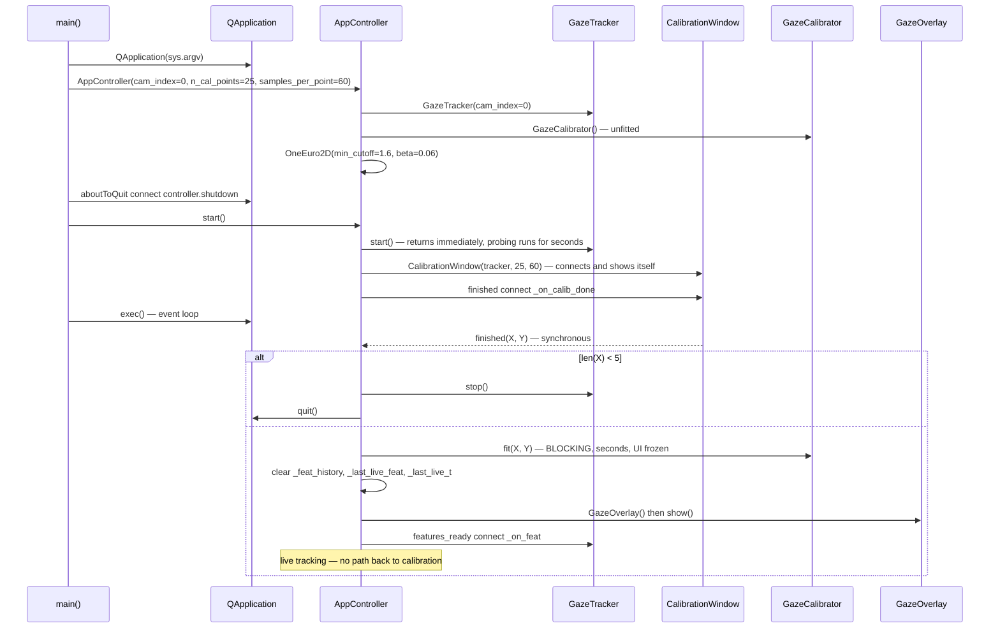
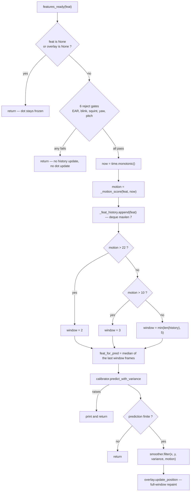
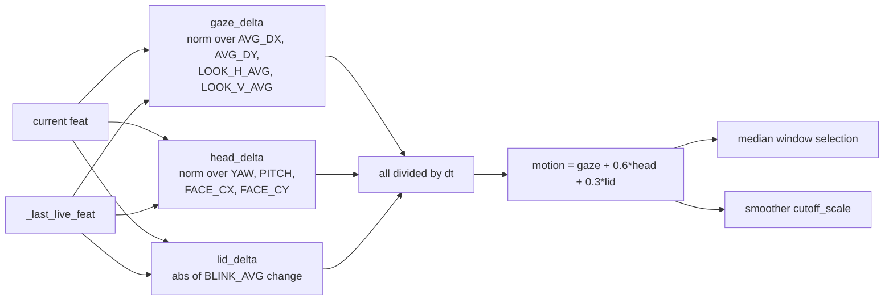

# Deep-Dive - Orchestration & Live Pipeline

**Date**: 2026-08-06
**Analyzed By**: ARCHITECT
**Status**: Draft

---

## Module Overview

**Purpose**: Wire the five subsystems together, own the two-stage application lifecycle (calibrate → track), and run the per-frame live inference path: gate, score motion, temporally median-filter, predict, smooth, draw.

**Path**: [main.py](main.py)
**Key Files**: 1 file, 141 lines
**Imports**: `sys`, `time`, `collections.deque`, `numpy`, `PyQt6.QtCore` (`QObject`, `pyqtSlot`), `PyQt6.QtWidgets.QApplication`, plus all five functional modules
**Imported by**: nothing — this is the top of the dependency graph

This is the only module that knows the whole system exists. Every architectural decision that spans two subsystems is made here, and none of them are documented in the file.

---

## Component Breakdown

| Component | Lines | Visibility | Responsibility |
|-----------|-------|------------|----------------|
| `AppController.__init__` | [31-42](main.py#L31-L42) | public | Constructs tracker, calibrator, smoother; declares live state |
| `.start` | [44-51](main.py#L44-L51) | public | Starts the capture thread and opens the calibration window |
| `._on_calib_done` | [53-66](main.py#L53-L66) | slot | Stage transition: validate → fit → create overlay → connect live path |
| `._motion_score` | [68-85](main.py#L68-L85) | private | Weighted rate-of-change across gaze, head and lid channels |
| `._on_feat` | [87-126](main.py#L87-L126) | slot | The live per-frame pipeline |
| `.shutdown` | [128-129](main.py#L128-L129) | public | Stops the capture thread |
| `main` | [132-137](main.py#L132-L137) | module | `QApplication`, controller, `aboutToQuit` wiring, `exec` |

---

## Key Workflows

### Workflow: Application lifecycle



### Workflow: The live per-frame pipeline



### Workflow: Motion score composition



---

## Data Models

### Live-path state

| Attribute | Type | Purpose | Reset by `_on_calib_done`? |
|-----------|------|---------|---------------------------|
| `_feat_history` | `deque(maxlen=7)` | Temporal median buffer | ✅ yes |
| `_last_live_feat` | `ndarray(38,)` or `None` | Previous accepted frame, for motion | ✅ yes |
| `_last_live_t` | `float` or `None` | Previous accepted timestamp | ✅ yes |
| `overlay` | `GazeOverlay` or `None` | Also the "live mode active" flag | replaced |
| `calib_win` | `CalibrationWindow` or `None` | Kept alive after `close()` | no |
| `smoother` | `OneEuro2D` | Filter state | ❌ **no** — see [06](docs/architecture/current/06-one-euro-deep-dive.md) |

`self.overlay` doubles as the mode flag: `_on_feat` returns early while it is `None` ([main.py:89](main.py#L89)). Compact, but it means "is the overlay constructed" and "should we be predicting" are the same bit, and neither can be changed without the other.

### Live reject gates versus calibration accept gates

| Condition | Calibration ([overlay.py:181-188](eye_tracker/overlay.py#L181-L188)) | Live ([main.py:94-101](main.py#L94-L101)) | Divergence |
|---|---|---|---|
| `A_EAR` floor | 0.16 | 0.16 | — |
| `B_EAR` floor | 0.16 | 0.16 | — |
| `BLINK_AVG` ceiling | 0.55 | **0.58** | +5% |
| `SQUINT_AVG` ceiling | 0.55 | **0.58** | +5% |
| `abs(YAW)` ceiling | 0.60 | **0.70** | +17% |
| `abs(PITCH)` ceiling | 0.45 | **0.55** | +22% |

**The live envelope is uniformly wider than the training envelope.** Frames are therefore predicted under conditions that were excluded from fitting — a train/serve mismatch. The GP's response to inputs outside its training distribution is exactly the extrapolation regime measured in [02](docs/architecture/current/02-calibration-deep-dive.md): predictive σ rises into the thousands of pixels, and the smoother clamps the dot. So the practical symptom of the mismatch is not a wild dot but a *sluggish* one, which is much harder to attribute.

Whether the wider live envelope is deliberate (accept marginal frames rather than freeze) or accidental (two literal blocks that drifted) cannot be determined from source. There is no comment at either site.

⚠️ Per [03](docs/architecture/current/03-face-mesh-deep-dive.md), the `YAW` and `PITCH` gates act on head **roll** and **yaw** respectively, and head **pitch** is ungated in both paths. The thresholds above are real, but their labels are not.

### Motion-score thresholds and median window

| Motion | Window | Smoother motion term | Combined effect |
|---|---|---|---|
| > 22.0 | 2 frames | 1.88 | minimal median, cutoff nearly doubled |
| > 10.0 | 3 frames | 1.40 | light median, cutoff +40% |
| ≤ 10.0 | `min(len, 5)` | 1.0 – 1.40 | 5-frame median, base cutoff |

The two mechanisms are consistent — fast motion both shortens the median and widens the cutoff — and the thresholds sit below the smoother's 37.5 cap, so they interact coherently. `_feat_history` has `maxlen=7` but the largest window used is 5, so **two slots are never read**.

### Startup parameters

| Parameter | Class default | `main()` value | Effective |
|---|---|---|---|
| `cam_index` | `0` | `0` | 0 |
| `n_cal_points` | `9` | **`25`** | 25 |
| `samples_per_point` | `30` | **`60`** | 60 |

The class defaults are dead — `main()` is the only construction site ([main.py:134](main.py#L134)). Anyone reading `AppController.__init__` alone would conclude the app runs a 9-dot, 30-sample calibration; it runs a 25-dot, 60-sample one taking 79–141 seconds.

---

## Findings

### The stage transition is a one-way door with no teardown

`_on_calib_done` connects `_on_feat` at [main.py:66](main.py#L66) and nothing ever disconnects it. There is no path from live tracking back to calibration, no way to recalibrate without restarting, and no teardown of the live stage other than process exit.

`CalibrationWindow` is closed but never destroyed — `AppController.calib_win` still references it, `WA_DeleteOnClose` is not set, and its two member `QTimer`s remain children of a live QObject. This is what makes the duplicate-emission defect in [05](docs/architecture/current/05-overlay-deep-dive.md) reachable: the closed window is still a fully functional state machine.

### `_on_calib_done` is not idempotent, and can be called twice

Verified in [05](docs/architecture/current/05-overlay-deep-dive.md#-verified--aborting-calibration-can-emit-finished-twice): aborting calibration in the 250 ms gap after a target emits `finished` a second time. Every line of this slot then re-runs:

```python
self.calibrator.fit(X, Y)                        # second blocking fit, same data
self._feat_history.clear()                       # live state reset again
self.overlay = GazeOverlay()                     # first overlay dereferenced and destroyed
self.overlay.show()
self.tracker.features_ready.connect(self._on_feat)   # DUPLICATE connection
```

The duplicate connection is the lasting damage. Qt permits it, so every subsequent frame invokes `_on_feat` twice:

- `_feat_history.append(feat)` runs twice per frame, so the `maxlen=7` deque holds ~3.5 distinct frames. The 5-frame median at [main.py:112](main.py#L112) then averages each frame twice, **halving the effective temporal window**.
- Six GP predictions run twice per frame.
- `_motion_score`'s second call sees `_last_live_feat` already updated to the same vector, so the delta is zero and motion reads 0.0 — the *second* call systematically under-reports motion, and it is the second call whose `update_position` wins.

A single `if self.overlay is not None: return` guard at the top of the slot would make this harmless regardless of how the second emission arises.

### The app's survival depends on an undocumented synchronous ordering

✅ **VERIFIED** in [05](docs/architecture/current/05-overlay-deep-dive.md#-verified--the-app-exits-if-the-finished-handler-shows-no-window): `QApplication.quitOnLastWindowClosed` defaults to `True`, and the calibration window is the only visible window until this slot creates the overlay. The application survives the transition only because:

1. `finished.emit(...)` invokes this slot **synchronously**, before `close()` runs.
2. This slot shows `GazeOverlay` before returning.
3. `close()` therefore finds a second visible window.

**Consequence for the most obvious improvement in the codebase.** Moving the blocking `fit` to a worker thread — the natural fix for the multi-second UI freeze — makes this slot return before the overlay exists, and the application **exits silently** the moment calibration finishes. `setQuitOnLastWindowClosed(False)`, or constructing the overlay up front, must land first. This constraint exists nowhere in the code and is invisible to anyone reading `main.py`.

### The abort threshold counts pre-filter rows

[main.py:55](main.py#L55) checks `len(X) < 5` on the array as emitted. `GazeCalibrator.fit` then drops non-finite rows ([calibration.py:218-220](eye_tracker/calibration.py#L218-L220)) with no further count check. So 6 rows of which 3 are non-finite pass the guard and fit 6 GPs on 3 points.

The `5` is also unexplained. Six GPs with 12–25 input dimensions each are fitted from it — the binocular Y model has 25 inputs and would be fitted from 5 samples. The threshold prevents a crash, not an under-determined model.

The abort path itself is clean: `tracker.stop()` then `QApplication.instance().quit()` ([57-58](main.py#L57-L58)).

### Rejected frames update no state

When a gate rejects a frame, `_on_feat` returns at [102](main.py#L102) before touching `_feat_history`, `_last_live_feat` or `_last_live_t`. Two consequences:

- **The dot freezes rather than hides** during a blink or a head turn. `GazeOverlay.set_dot_visible` exists for this and is never called ([05](docs/architecture/current/05-overlay-deep-dive.md)). A frozen dot is indistinguishable from a steady gaze.
- **`dt` spans the whole rejected interval.** After a 300 ms blink, the first accepted frame computes `motion = delta / 0.3` instead of `delta / 0.033` — a 10× under-estimate. So the frame immediately following a blink is treated as low-motion and gets the widest median window and the base cutoff, which is the opposite of what a post-blink re-fixation needs.

### `_motion_score` mixes units without normalisation

[main.py:74-85](main.py#L74-L85) combines three deltas:

```python
return float(gaze_delta + 0.6 * head_delta + 0.3 * lid_delta)
```

`gaze_delta` is a 4-norm over two eye-offset ratios and two blendshape differences. `head_delta` is a 4-norm over two angles **in radians** and two frame-relative positions. `lid_delta` is a blendshape difference. The weights `0.6` and `0.3` are the only reconciliation between quantities with different units and different natural magnitudes, and they are undocumented.

This matters because the resulting scalar is compared against the absolute thresholds `22.0` and `10.0` and divided by `25.0` in the smoother. Those five constants are jointly tuned to a composite whose scale is an accident of the feature normalisations. Changing any feature's normalisation in [gaze.py](eye_tracker/gaze.py) silently retunes the motion response of the entire live path.

⚠️ `head_delta` reads `FEATURE_YAW` and `FEATURE_PITCH`, which per [03](docs/architecture/current/03-face-mesh-deep-dive.md) are actually roll and yaw. It does **not** read feature 10, so it is unaffected by that feature's ±π wrap — but it is also blind to nodding.

### The temporal median is elementwise across all 38 features

[main.py:112](main.py#L112) takes `np.median(..., axis=0)` over the last 2–5 frames. Each of the 38 dimensions is medianed independently, so the result is generally **not any observed frame** — it is a synthetic vector that may violate the exact algebraic identities the contract guarantees.

For the 8 intentional aggregates (`AVG_DX = ½(A_DX + B_DX)`, etc.) the median of a sum is not the sum of medians, so `feat_for_pred[4] != 0.5 * (feat_for_pred[0] + feat_for_pred[2])` in general. The same applies to the lid-clearance pair, which no longer sums to exactly 1. The GP never checks, so nothing breaks — but the vector handed to `predict_with_variance` is not a member of the space the model was trained on, and it is worth knowing that the invariants verified in [01](docs/architecture/current/01-gaze-deep-dive.md) hold for emitted frames and **not** for the prediction input.

### Broad exception swallow in the hot path

```python
try:
    pred, var = self.calibrator.predict_with_variance(feat_for_pred)
except Exception as exc:  # predictor rarely but can fail on degenerate input
    print(f"[predict] {exc}")
    return
```

The comment acknowledges the intent, which is more than most such handlers. But there is no rate limiting: a persistent fault — an unfitted calibrator, a shape mismatch — prints at frame rate to a stream a windowed application discards, while the dot silently freezes. There is no counter, no escalation, and no user-visible signal.

Contrast [tracker.py:149-171](eye_tracker/tracker.py#L149-L171), where the equally failure-prone producer loop has **no** exception guard at all and dies permanently on the first error. The codebase contains both extremes with no stated rule.

### No back-pressure and no capture timestamps

`_on_feat` performs six GP predictions per frame on the GUI thread. Qt's queue is unbounded, and `now = time.monotonic()` is read at slot-execution time, so any queuing delay is attributed to the gaze signal rather than to scheduling. See [04](docs/architecture/current/04-tracker-deep-dive.md) — the motion estimate is partly a measure of GUI-thread jitter.

`main` also already holds `now` and does not pass it to the smoother, which reads the clock a second time ([06](docs/architecture/current/06-one-euro-deep-dive.md)).

### `shutdown` is best-effort and its result is unchecked

[128-129](main.py#L128-L129) calls `tracker.stop()`, which joins with a 1.5 s timeout and discards the result. Connected via `aboutToQuit` ([135](main.py#L135)), so it runs on normal exit but not on a crash. Nothing calls `overlay.close()`, `calib_win.deleteLater()`, or `FaceMeshWrapper.close()` from this path — the last is handled by the capture thread's `finally`, but only if that thread is still alive to run it.

### No command-line interface

`QApplication(sys.argv)` passes argv to Qt only; there is no `argparse`. Camera index, calibration density, sample count, and every threshold are literals at their use sites. Changing the camera requires editing [main.py:134](main.py#L134).

---

## Pattern Catalog

### Pattern 1 — Constructor wiring, deferred activation  ✅ [Current — good]

**Example** ([main.py:31-51](main.py#L31-L51)):

```python
# DO: __init__ constructs and declares; start() activates
def __init__(self, cam_index=0, n_cal_points=9, samples_per_point=30):
    self.tracker = GazeTracker(cam_index=cam_index)
    self.calibrator = GazeCalibrator()
    self.smoother = OneEuro2D(min_cutoff=1.6, beta=0.06)
    self.overlay = None
    self.calib_win = None

def start(self):
    self.tracker.start()
    self.calib_win = CalibrationWindow(...)
    self.calib_win.finished.connect(self._on_calib_done)

# DON'T: start threads and show windows from a constructor
```

Deferred activation makes the controller constructible for inspection. The pattern is undermined by its collaborator: `CalibrationWindow.__init__` connects a signal and shows a window ([overlay.py:117-128](eye_tracker/overlay.py#L117-L128)), so `start()` cannot construct it without immediately going live. The controller follows the pattern; the widget does not.

### Pattern 2 — Explicit `@pyqtSlot` decoration  ✅ [Current — consistent]

**Example** ([main.py:53](main.py#L53), [87](main.py#L87)):

```python
# DO: declare the signature so Qt can build a proper C++ connection
@pyqtSlot(object, object)
def _on_calib_done(self, X, Y): ...

@pyqtSlot(object)
def _on_feat(self, feat): ...
```

Both cross-thread and cross-object receivers are decorated. `CalibrationWindow._on_feat` ([overlay.py:159](eye_tracker/overlay.py#L159)) is **not** decorated despite receiving the same signal across the same thread boundary — the convention is right but applied in only one of the two modules.

### Pattern 3 — Guard-clause pipeline  ✅ [Current — consistent and readable]

**Example** ([main.py:88-119](main.py#L88-L119)):

```python
# DO: reject early, one condition per clause, no nesting
if feat is None or self.overlay is None:
    return
if (feat[FEATURE_A_EAR] < 0.16 or ... or abs(feat[FEATURE_PITCH]) > 0.55):
    return
...
if not np.all(np.isfinite(pred)):
    return
```

Five sequential guards keep a 40-line slot at one indentation level. The cost is that each `return` silently drops the frame with no counter — nothing anywhere records how many frames are being rejected or why, which makes "the dot is sluggish" undiagnosable.

### Pattern 4 — Duplicated threshold blocks  ❌ [Current — the anti-pattern to fix]

**Example** — the divergence ([main.py:94-101](main.py#L94-L101) vs [overlay.py:181-188](eye_tracker/overlay.py#L181-L188)):

```python
# CURRENT in main.py — live
if (feat[FEATURE_A_EAR] < 0.16 or feat[FEATURE_B_EAR] < 0.16
        or blink > 0.58 or squint > 0.58
        or abs(feat[FEATURE_YAW]) > 0.70 or abs(feat[FEATURE_PITCH]) > 0.55):
    return

# CURRENT in overlay.py — calibration. Same six conditions, four different numbers.
if (ear_a < 0.16 or ear_b < 0.16
        or blink > 0.55 or squint > 0.55
        or abs(yaw) > 0.60 or abs(pitch) > 0.45):
    return

# DO: one predicate, one definition, an explicit envelope per stage
CALIBRATION_GATE = FrameGate(ear_min=0.16, blink_max=0.55, squint_max=0.55,
                             yaw_max=0.60, pitch_max=0.45)
LIVE_GATE = CALIBRATION_GATE.widened(blink=0.03, squint=0.03, yaw=0.10, pitch=0.10)
if not LIVE_GATE.accepts(feat):
    return
```

The codebase already demonstrates the fix: `_make_gp` ([calibration.py:153](eye_tracker/calibration.py#L153)) guarantees six identical kernels from one definition. The same discipline applied here would have prevented the drift — and would make the deliberate-versus-accidental question answerable.

### Pattern 5 — Bounded history via `deque(maxlen=...)`  ✅ [Current — good, over-sized]

**Example** ([main.py:40](main.py#L40), [105-112](main.py#L105-L112)):

```python
# DO: let the container enforce the bound
self._feat_history = deque(maxlen=7)
...
self._feat_history.append(feat)
feat_for_pred = np.median(np.asarray(list(self._feat_history)[-window:]), axis=0)

# DON'T: manual trimming
self._history.append(feat)
if len(self._history) > 7:
    self._history.pop(0)
```

The `maxlen=7` versus a maximum window of 5 leaves two slots permanently unread — harmless, but it suggests the two constants were tuned independently and no longer agree.

### Pattern 6 — Broad exception swallow in a hot loop  ❌ [Current — needs a rule]

```python
# CURRENT: unbounded printing, frame silently dropped, no escalation
except Exception as exc:  # predictor rarely but can fail on degenerate input
    print(f"[predict] {exc}")
    return

# DO: narrow the type, rate-limit, escalate on persistence
except (ValueError, RuntimeError) as exc:
    self._predict_failures += 1
    if self._predict_failures in (1, 10, 100) or self._predict_failures % 1000 == 0:
        logger.warning("prediction failed (%d consecutive)", self._predict_failures, exc_info=exc)
    if self._predict_failures > PREDICT_FAILURE_LIMIT:
        self._enter_degraded_mode()
    return
```

The project needs one stated rule for the boundary between "drop the frame and continue" and "surface the failure". Right now [main.py](main.py) does the former unconditionally and [tracker.py](eye_tracker/tracker.py) does neither.

### Pattern 7 — Naming conventions  ✅ [Current — consistent]

| Kind | Convention | Example |
|---|---|---|
| Controller class | `<PascalCase>`, `QObject` subclass | `AppController` |
| Slots | `_on_<event>` | `_on_calib_done`, `_on_feat` |
| Public lifecycle | `<lower_snake>` | `start`, `shutdown` |
| Private helpers | `_<lower_snake>` | `_motion_score` |
| Private state | `_<lower_snake>` | `_feat_history`, `_last_live_feat` |
| Fit data | mathematical `X`, `Y` | slot parameters |
| Log prefix | `[calibration]`, `[predict]` | 2 sites |

The `_on_<event>` slot convention is consistently applied and matches [overlay.py](eye_tracker/overlay.py). Module structure is idiomatic: `main()` function plus `if __name__ == "__main__":` guard.

---

## Testing Patterns

**Current state: no tests exist.** Coverage 0%.

`_motion_score` is the only unit here that is testable in isolation — it is a pure function of `(feat, now)` plus two instance attributes, and needs no Qt, camera or model:

```python
# Suggested: tests/unit/test_main.py  (does not exist yet)
import numpy as np
from main import AppController

def test_first_frame_scores_zero_motion_and_seeds_state():
    ac = AppController.__new__(AppController)          # no Qt construction
    ac._last_live_feat = None
    ac._last_live_t = None
    feat = np.zeros(38)
    assert ac._motion_score(feat, 100.0) == 0.0
    assert ac._last_live_t == 100.0

def test_motion_scales_inversely_with_dt():
    # Documents the post-blink under-estimate: identical movement over a longer
    # gap reports proportionally less motion
    def score(dt):
        ac = AppController.__new__(AppController)
        ac._last_live_feat, ac._last_live_t = np.zeros(38), 0.0
        f = np.zeros(38); f[4] = 0.1                   # AVG_DX
        return ac._motion_score(f, dt)
    assert score(1 / 30) == pytest.approx(30 * score(1.0), rel=1e-9)

def test_dt_is_floored_at_1ms():
    ac = AppController.__new__(AppController)
    ac._last_live_feat, ac._last_live_t = np.zeros(38), 0.0
    assert np.isfinite(ac._motion_score(np.ones(38), 0.0))   # dt=0 must not divide by zero

def test_gate_thresholds_match_the_calibration_gate():
    # Currently FAILS by design — locks the divergence so any change is deliberate
    ...
```

`AppController.__new__` sidesteps `QObject.__init__` and the construction of five collaborators — a legitimate technique for a controller whose helper does not touch them, and a signal that the class is doing too much to be constructed in a test.

`_on_feat` and `_on_calib_done` need integration coverage, which is feasible: the [05](docs/architecture/current/05-overlay-deep-dive.md) verification drove the real `CalibrationWindow` headless under `QT_QPA_PLATFORM=offscreen` with a stub tracker. The same harness plus a fitted calibrator would cover the full transition, including the duplicate-connection and app-exit behaviours.

**Blocked by**: `main.py` at the repository root with no packaging metadata. `from main import AppController` only resolves when the working directory is the repository root — the technical-debt item recorded in [00-system-overview.md](docs/architecture/current/00-system-overview.md), confirmed to break imports from outside the root.

---

## Entry Points

| Entry | Path | Description |
|-------|------|-------------|
| Desktop app | `python main.py` | The sole entry point ([132-141](main.py#L132-L141)) |
| CLI arguments | *none* | `argv` reaches Qt only; no `argparse` |
| Environment config | *none* | No `.env`, no settings file, no config module |
| Programmatic | `from main import AppController` | Possible but undeclared; requires the repo root on `sys.path` |

**Public surface of `AppController`**: `start()`, `shutdown()`, and the attributes `tracker`, `calibrator`, `smoother`, `overlay`, `calib_win`. All attributes are public and mutable with no accessors.

---

## Verification Record

**No new execution was performed for this module.** Findings are derived from source reading and cross-file search, plus two results established while verifying [05](docs/architecture/current/05-overlay-deep-dive.md) that determine this module's behaviour:

| Claim | Basis |
|---|---|
| `_on_calib_done` can be invoked twice | ✅ Reproduced headless — 2 emissions, 2 overlays, 2 `_on_feat` connections |
| App exits if this slot shows no window | ✅ Reproduced headless — event loop exited on `close()` |
| Gate threshold divergence | Source comparison of [main.py:94-101](main.py#L94-L101) and [overlay.py:181-188](eye_tracker/overlay.py#L181-L188) ✅ |
| `maxlen=7` versus max window 5 | Source reading of [main.py:40](main.py#L40), [111](main.py#L111) ✅ |
| Class defaults 9/30 unused | Single construction site at [main.py:134](main.py#L134) ✅ |
| `_on_feat` never disconnected | Search: one `connect`, no `disconnect` ✅ |
| Motion-score unit mixing | Feature units traced through [01](docs/architecture/current/01-gaze-deep-dive.md) ✅ |
| Smoother motion term thresholds align | Cross-checked against measured values in [06](docs/architecture/current/06-one-euro-deep-dive.md) ✅ |

⚠️ **Not verified — requires a webcam and a person**: real frame-rejection rates, actual motion-score magnitudes during use, whether the median window switching is perceptible, real fit duration, and whether the wider live envelope helps or hurts. These are the questions that decide whether the live path's five tuned constants are right, and none can be answered from source.

---

## Recommendations

1. **Guard `_on_calib_done` against re-entry.** One line (`if self.overlay is not None: return`) neutralises the verified duplicate-fit, duplicate-overlay and duplicate-connection damage regardless of how the second emission arises. Pair it with the timer fix in [05](docs/architecture/current/05-overlay-deep-dive.md).
2. **Set `setQuitOnLastWindowClosed(False)` before threading the fit.** The verified app-exit constraint makes these two changes a single unit of work, in that order.
3. **Unify the two gate blocks behind one definition**, with each stage's envelope expressed as an explicit deviation from a shared base. Re-derive the numbers after the head-pose axes are corrected ([03](docs/architecture/current/03-face-mesh-deep-dive.md)).
4. **Count and expose rejected frames.** Five silent `return`s make every "the dot is sluggish" report undiagnosable. A per-reason counter is cheap and would be the first thing anyone tuning this needs.
5. **Hide the dot when frames are rejected or the face is lost.** `set_dot_visible` already exists; a frozen dot currently reads as a confident one.
6. **Rate-limit the prediction failure handler** and escalate on persistence, instead of printing at frame rate to a discarded stream.
7. **Pass `now` to the smoother**, and propagate a capture timestamp from the tracker so `dt` measures the camera rather than the GUI queue.
8. **Move the abort threshold to where the precondition lives** — a post-filter minimum-sample check inside `fit` ([02](docs/architecture/current/02-calibration-deep-dive.md)) — and document why the number is what it is.
9. **Document the motion score's composition**, or normalise its three channels so the weights `0.6`/`0.3` and the thresholds `22`/`10`/`25` are not silently coupled to feature normalisations in another module.
10. **Add a recalibration path.** The one-way transition means any calibration problem requires restarting the app and re-running a 79-second ritual.
11. **Introduce a configuration layer.** Roughly 40 tunables are literals across five modules; the live path alone has 13. This is the precondition for tuning anything empirically.

---

## Cross-References

| Topic | Document |
|---|---|
| The 12 feature constants read here, and the identities the median breaks | [01-gaze-deep-dive.md](docs/architecture/current/01-gaze-deep-dive.md) |
| What the blocking `fit` costs, and what `predict_with_variance` returns | [02-calibration-deep-dive.md](docs/architecture/current/02-calibration-deep-dive.md) |
| Why the `YAW`/`PITCH` gates act on the wrong axes | [03-face-mesh-deep-dive.md](docs/architecture/current/03-face-mesh-deep-dive.md) |
| The `features_ready` contract, silent producer death, missing timestamps | [04-tracker-deep-dive.md](docs/architecture/current/04-tracker-deep-dive.md) |
| The duplicate-emission defect and the window-lifetime constraint | [05-overlay-deep-dive.md](docs/architecture/current/05-overlay-deep-dive.md) |
| Measured smoother response to the `variance` and `motion` this module supplies | [06-one-euro-deep-dive.md](docs/architecture/current/06-one-euro-deep-dive.md) |
