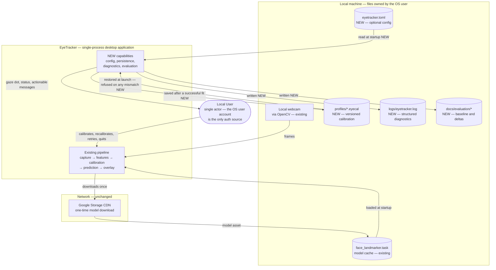
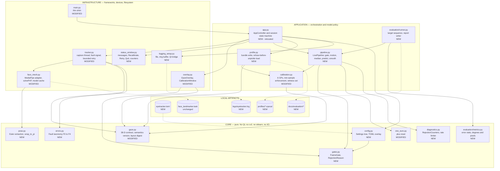
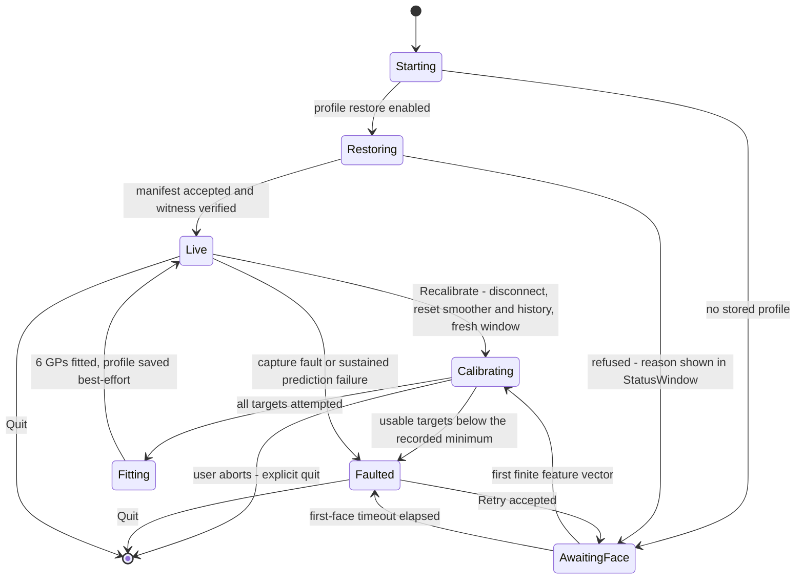
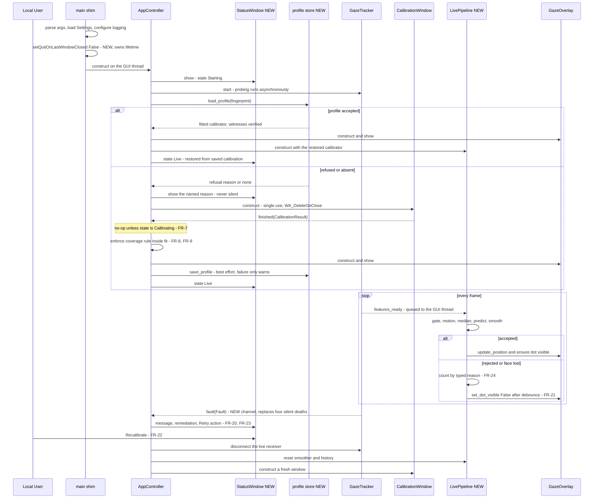
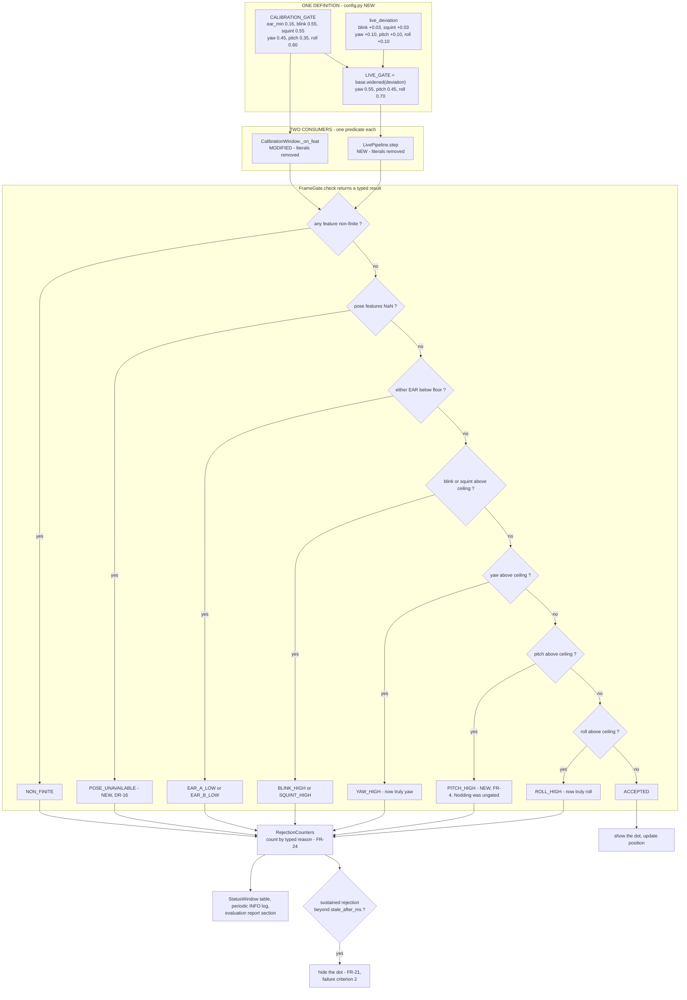
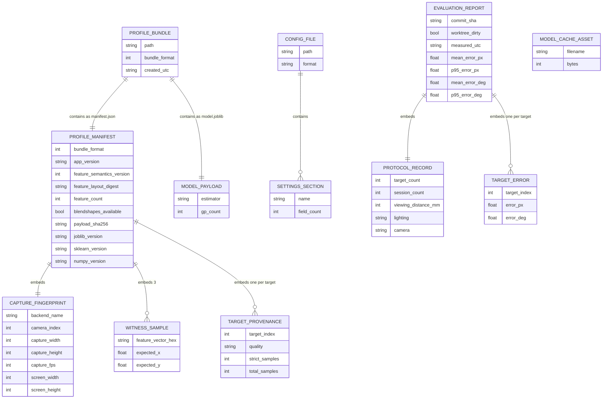
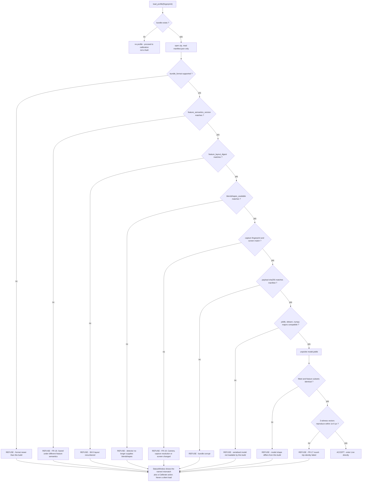
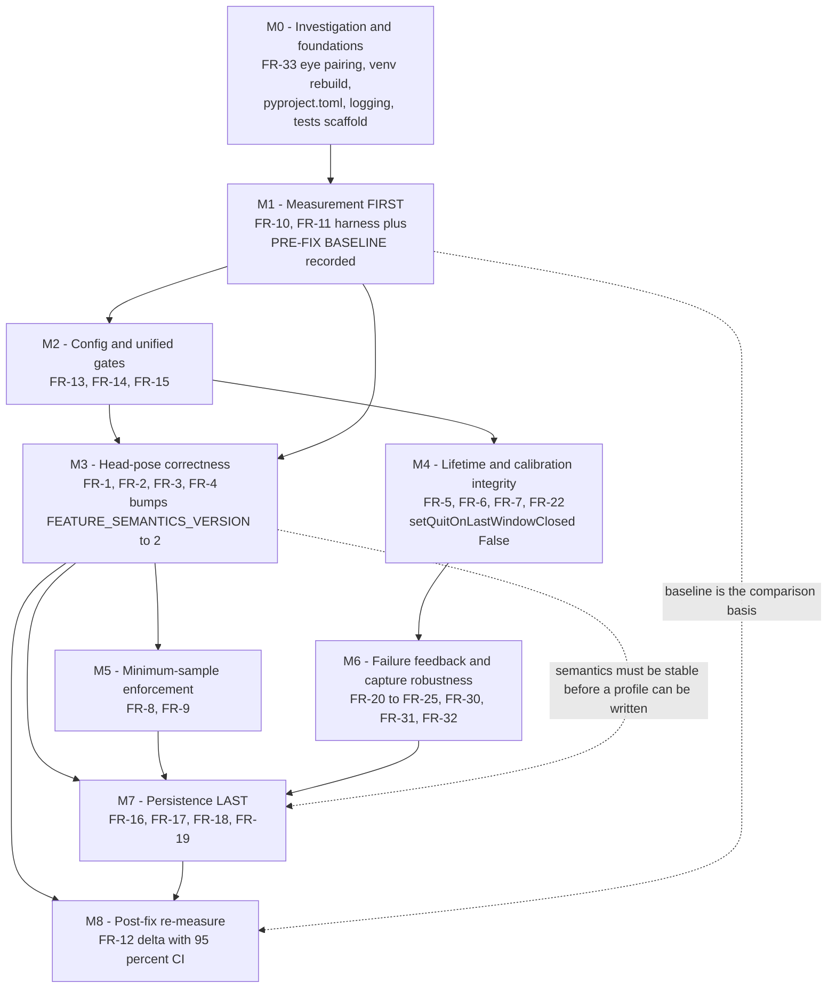

# Target Architecture — EyeTracker

**Date**: 2026-08-07
**Author**: ARCHITECT
**Status**: **Approved** — user-approved 2026-08-07
**Version**: 1.0
**Based On**: [00-system-overview.md](docs/architecture/current/00-system-overview.md) + 7 deep-dive documents + [requirements.md](docs/requirements.md)

> **Reference check (STEP 0)**: `SPEC/references/`, `SPEC/references/builds/` and `SPEC/references/devops/` contain **0 files**. No PRD, architecture document, UI design, legacy specification or build sequence constrains this design. Nothing required `aire read`. Every decision below derives from the verified brownfield analysis, the approved requirements, or an explicit user decision recorded in [Technical Decisions](#technical-decisions).

---

## Overview

### Current System

A single-process Python desktop monolith, 1,295 LOC across 8 files. One daemon capture thread produces a 38-dimensional feature vector per frame and publishes it across a Qt signal boundary to GUI-thread consumers; a 25-target calibration ritual fits six Gaussian Processes; a click-through overlay draws the predicted gaze point. There is no database, no configuration layer, no persistence, no packaging metadata and no test infrastructure.

### What We Are Changing

Three things, in dependency order, per [requirements.md](docs/requirements.md):

1. **Correct the gaze signal at its source.** The head-pose angle labels are cyclically permuted and one feature jumps 6.21 rad at the neutral head position — both verified by execution. These corrupt every regressor input and every frame-acceptance gate.
2. **Make accuracy measurable.** Nothing in the system measures gaze error. An evaluation harness, a documented protocol and a recorded baseline convert "improve accuracy" into a testable claim.
3. **Close the 7 defects and add the foundations that make further work safe** — tests, configuration, calibration persistence, and failure feedback appropriate to an accessibility audience.

No user-facing capability is added: no dwell-click, no scroll, no pointer control.

### Architecture Approach

**The existing architecture style is preserved and extended, not replaced.** It remains a layered pipeline inside a single-process desktop monolith with exactly one producer thread and a Qt event-driven consumer layer. The properties that make it correct today are treated as invariants to protect, not accidents to refactor:

- one-way, acyclic module dependencies
- cross-thread publication **by value**, therefore zero locks
- both frame-signal receivers constructed on the GUI thread, therefore queued connections

Three structural changes are made inside that style:

| Change | Why it is not a style change |
|---|---|
| Logical layers (**core → application → infrastructure**) are declared over the existing flat `eye_tracker/` package | Files are **not** moved into `domain/`, `application/`, `infrastructure/` directories. The [clean-architecture rulebook](SPEC/rulebooks/aire-clean-architecture.md) dependency rule is enforced by an import-direction test instead of a directory restructure. A physical restructure would break the import paths of the 38-D contract's four consumers for no behavioural gain — rejected under the Additive-First principle. |
| `AppController` moves from `main.py` into `eye_tracker/app.py`; `main.py` becomes a thin shim | FR-27 requires ≥85% line coverage across **`main.py`** as well as `eye_tracker/`. With the controller at the repository root and no packaging metadata, that coverage is unreachable ([07-main](docs/architecture/current/07-main-deep-dive.md) confirmed `from main import AppController` only resolves from the repo root). `python main.py` continues to work. |
| The per-frame inference path is extracted from a Qt slot into a pure `LivePipeline` class | Same pipeline, same order, same guards — but callable without Qt, a camera or a model. This is the single largest testability lever for FR-27 and the natural home for FR-24's rejection accounting. |

**Everything else is additive.** New concerns get new modules; existing modules gain behaviour at their existing seams.

---

## Delta Summary

| Component | Status | Change Description |
|-----------|--------|--------------------|
| [gaze.py](eye_tracker/gaze.py) | 🟡 Modified | Add `FEATURE_SEMANTICS_VERSION`, `FEATURE_LAYOUT_DIGEST`; enforce `FEATURE_COUNT`; emit `NaN` (not zeros) when head pose is unavailable. **Index numbering unchanged.** |
| [face_mesh.py](eye_tracker/face_mesh.py) | 🟡 Modified | `_head_pose` delegates Euler extraction to new `pose.py`; correct axis binding; pitch unwrapped; `close()` made idempotent; confidences and cache path from config |
| [calibration.py](eye_tracker/calibration.py) | 🟡 Modified | Post-filter minimum-sample enforcement; kernel/quality constants from config; pose-quality divisors re-paired to physical axes; expose subset identity + witness generation for persistence |
| [overlay.py](eye_tracker/overlay.py) | 🟡 Modified | All 5 scheduled transitions become cancellable member timers; single-emission latch; per-target provenance; `set_dot_visible` wired; single-use window lifecycle; gates delegated to `FrameGate` |
| [tracker.py](eye_tracker/tracker.py) | 🟡 Modified | New `fault` signal; probe moved inside `try/finally`; `_configure_capture` on every return path; bounded read-failure retry; `viable` removed and its intent enforced; typed `ProbeResult`; unused `numpy` import dropped |
| [one_euro.py](eye_tracker/one_euro.py) | 🟡 Modified — additive only | Add `reset()`. ⚠️ Requirements classified this module as IMPACT-only; FR-22's "smoother state reset" makes one added method unavoidable. Flagged, not absorbed. |
| [main.py](main.py) | 🟡 Modified — reduced | Becomes a ~10-line shim: parse args, configure logging, delegate to `eye_tracker.app.main` |
| [`eye_tracker/__init__.py`](eye_tracker/__init__.py) | 🟡 Modified | Declares `__version__` only. No re-exports — the 38-D contract keeps its single owner |
| `eye_tracker/pose.py` | 🆕 New | Pure Euler extraction + `wrap_to_pi`. Owns FR-1/FR-2, testable with numpy alone |
| `eye_tracker/config.py` | 🆕 New | Frozen `Settings` dataclass tree, optional TOML overlay, single gate definition |
| `eye_tracker/gates.py` | 🆕 New | `FrameGate` predicate returning a typed `RejectionReason`; one base envelope + named live deviation |
| `eye_tracker/pipeline.py` | 🆕 New | `LivePipeline`: gate → motion → temporal median → predict → smooth. Pure; no Qt |
| `eye_tracker/diagnostics.py` | 🆕 New | `RejectionCounters`, rate-limited logging helper, session counters |
| `eye_tracker/errors.py` | 🆕 New | Fault taxonomy F0–F4 and `Fault` payload dataclass |
| `eye_tracker/profile.py` | 🆕 New | Calibration-profile bundle: atomic write, refuse-before-unpickle load, witness verification |
| `eye_tracker/status_window.py` | 🆕 New | Small always-on-top window: state, actionable messages, Recalibrate / Retry / Quit, live rejection counters |
| `eye_tracker/logging_setup.py` | 🆕 New | Structured logging, rotating file, in-memory ring buffer, GUI-thread-safe Qt bridge |
| `eye_tracker/app.py` | 🆕 New | Relocated `AppController` + explicit session state machine |
| `eye_tracker/evaluation/` | 🆕 New | `protocol.py`, `runner.py`, `metrics.py`, `report.py` — FR-10 – FR-12 |
| `eye_tracker/tools/eye_pairing.py` | 🆕 New | FR-33 diagnostic entry point, retained as a permanent check |
| `pyproject.toml` | 🆕 New | Packaging metadata — hard precondition for `tests/` |
| `tests/` | 🆕 New | `unit/`, `integration/`, `regression/`, `invariants/`, `arch/` |
| `<config_dir>/eyetracker.toml` | 🆕 New artifact | Optional user configuration |
| `<config_dir>/profiles/<fingerprint>.eyecal` | 🆕 New artifact | Versioned calibration bundle |
| `<state_dir>/logs/eyetracker.log` | 🆕 New artifact | Rotating log |
| `docs/evaluation/*.md` + `*.json` | 🆕 New artifact | Accuracy reports keyed to a commit SHA |
| MediaPipe model cache | 🟢 Unchanged | Path stays `Eyee`/`eyee`; renaming forces a re-download and no requirement asks for it. Inconsistency recorded for `aire-brownfield-patterns` |
| `mp.solutions` dead branch | 🟢 Unchanged | Explicitly OUT of scope. See [Residual Risks](#residual-risks-carried-forward) — the version gate does **not** cover it, so a manifest field is added instead |
| Database / ORM | 🟢 Unchanged — none exists | No database is introduced. All persistence is local file-based |

---

## Technology Stack

| Category | Technology | Version | Status | Notes |
|----------|------------|---------|--------|-------|
| Language | Python | 3.14.6 | 🟢 Unchanged | `tomllib` is stdlib from 3.11, so the config layer needs no install |
| Vision — landmarks | mediapipe | 0.10.35 (`>=0.10.30,<0.11`) | 🟢 Unchanged | Tasks API only; `solutions` branch remains unreachable and out of scope |
| Vision — capture/geometry | opencv-python | 4.14.0.94 | 🟢 Unchanged | |
| Vision — extra | opencv-contrib-python | 4.14.0.94 | 🟢 Unchanged | Must stay major-aligned with `opencv-python` |
| Numerics | numpy | 2.5.1 | 🟢 Unchanged | |
| ML — regression | scikit-learn | 1.9.0 | 🟢 Unchanged | Six GPs and their kernels are untouched this cycle |
| GUI | PyQt6 | 6.11.0 | 🟢 Unchanged | |
| Model serialisation | joblib | `>=1.4,<2` | 🆕 **Declared** | Already installed transitively as a scikit-learn dependency. Declared explicitly because the profile format now depends on it |
| Config parsing | `tomllib` | stdlib | 🆕 Used | Read-only; no writer needed |
| Bundle format | `zipfile`, `json`, `hashlib` | stdlib | 🆕 Used | Manifest readable without unpickling — see [Security Design](#security-design) |
| Diagnostics | `logging`, `argparse` | stdlib | 🆕 Used | Replaces 9 `print()` sites |
| Build backend | setuptools | `>=68` | 🆕 Dev | |
| Test runner | pytest | `>=8,<9` | 🆕 Dev | |
| Coverage | pytest-cov | `>=5,<7` | 🆕 Dev | Enforces the ≥85% gate in CI |
| Qt testing | pytest-qt | `>=4.4,<5` | 🆕 Dev | `qtbot.waitSignal` removes sleep-based flakiness |

**No new runtime dependency is added.** `joblib` is a declaration of something already present; everything else new is stdlib or dev-only.

---

## Target System Context



> **Deviation from the workflow template**: the template illustrates this diagram as `C4Context`. That was authored first and rendered, but Mermaid's C4 auto-layout collided four edge labels and ignored `$c4ShapeInRow`, leaving the diagram unreadable at eight elements. It was replaced with a `flowchart`, which renders cleanly and matches the 19 diagrams already validated for this project. The information content — actors, systems, external dependencies, changed data flows — is unchanged.

**No new actors and no new network integrations.** The only new external elements are local files owned by the OS user. Data flows added: settings in at startup, a fitted model out and back in, diagnostics out, measurements out.

---

## Component Architecture (Target)



**Dependency rule, enforced not assumed.** `tests/arch/test_import_direction.py` asserts by AST inspection that no `core` module imports `PyQt6`, `cv2`, `sklearn`, `mediapipe`, or any `application`/`infrastructure` module; and that no `application` module imports `PyQt6`. This is the checkable substitute for the directory restructure the rulebook illustrates.

### Concurrency invariants — preserved and made explicit

| Invariant | Today | Target |
|---|---|---|
| Feature vectors published by value; no shared mutable state across threads | True, undocumented | Unchanged, documented, plus a test asserting `extract_gaze_features` returns a fresh array per call |
| Both frame-signal receivers constructed on the GUI thread → queued connections | True, unasserted | **Asserted** at construction in `AppController`, `CalibrationWindow` and the log bridge: `assert QThread.currentThread() is QApplication.instance().thread()` |
| Exactly one worker thread | True | Unchanged. The GP fit is **not** threaded this cycle — see [DR-14](#dr-14--own-application-lifetime-explicitly-do-not-thread-the-fit-this-cycle) |
| Log records may originate on the capture thread | N/A | The Qt bridge is a `QObject` created on the GUI thread that only **emits**; it never touches a widget |

### Session state machine (FR-7, FR-22)



Two rules make the verified duplicate-emission defect unreachable rather than merely fixed:

1. `CalibrationWindow` schedules **every** transition through a member `QTimer` owned by the window, and `_disconnect` stops all of them. A `_finished_emitted` latch guarantees at most one emission per instance.
2. `AppController._on_calib_done` is a no-op unless the machine is in `Calibrating`. Cause and symptom are both closed.

`CalibrationWindow` becomes **single-use**: constructed per calibration, `WA_DeleteOnClose` set, and never reused. The zombie-state-machine class of bug is removed by lifetime, not by guards.

### Target lifecycle sequence



The ordering that the analysis found the application depended on *by accident* — the overlay being shown synchronously before the calibration window closes — is now explicit and irrelevant: lifetime is owned by `setQuitOnLastWindowClosed(False)` plus `StatusWindow`, which is visible for the whole session.

---

## Head-Pose Correction (FR-1 – FR-4) — the highest-risk change

### The fix

Euler extraction moves into `eye_tracker/pose.py` as a pure function so the axis test needs neither MediaPipe nor a camera:

```python
def wrap_to_pi(a: float) -> float:
    """Map an angle to (-pi, pi]."""
    return (a + math.pi) % (2.0 * math.pi) - math.pi


def euler_from_rotation_matrix(rmat):
    """Return (yaw, pitch, roll) in radians for OpenCV's camera frame.

    Camera frame is +X right, +Y down, +Z into the scene, so rotation about
    X is a nod (pitch), about Y is a turn (yaw), about Z is an in-plane tilt
    (roll). A ZYX decomposition recovers the three axis rotations; the
    binding below is the part the current code gets wrong.

    _MODEL_POINTS is defined +Y up / +Z toward the viewer while the camera
    frame is +Y down / +Z into the scene, so an upright frontal face solves
    to approximately Rx(pi), not the identity. The X component therefore
    rests on atan2's branch cut; subtracting pi and re-wrapping centres nod
    on 0 and moves the cut to a fully inverted head, outside any operating
    envelope.
    """
    sy = math.sqrt(rmat[0, 0] ** 2 + rmat[1, 0] ** 2)
    x_rot = math.atan2(rmat[2, 1], rmat[2, 2])   # nod
    y_rot = math.atan2(-rmat[2, 0], sy)          # turn
    z_rot = math.atan2(rmat[1, 0], rmat[0, 0])   # tilt
    return y_rot, wrap_to_pi(x_rot - math.pi), z_rot
```

Feature indices are untouched: `head_pose[0] → f8 FEATURE_YAW`, `[1] → f9 FEATURE_PITCH`, `[2] → f10 FEATURE_ROLL`. After this change all three names are truthful and none is discontinuous near neutral.

**Verified against the analysis measurements.** Using the numbers recorded in [03-face-mesh](docs/architecture/current/03-face-mesh-deep-dive.md): at rest `x_rot = −3.1416`, and `wrap_to_pi(−3.1416 − π) = 0.0000`. At nod +15°, `x_rot = −2.8798` and `wrap_to_pi(−2.8798 − π) = +0.2618 = 15.000°`. Across the neutral sweep, `x_rot = +3.1329 → −0.0087` and `x_rot = −3.1329 → +0.0087` — a 1° change now moves the feature by 0.017 rad instead of 6.213 rad. Success criteria 1 and 2 are satisfied by construction and provable without hardware.

### The gate re-pairing (FR-3) — the specific trap

The thresholds in [main.py:94-101](main.py#L94-L101) and [overlay.py:181-188](eye_tracker/overlay.py#L181-L188) were tuned against whichever physical axis was actually being measured. Preserving the numbers against the corrected **names** would silently retune the physical envelope in both directions. The target binds each threshold to the **physical axis it was tuned for**:

| Physical axis | Target feature | Calibration ceiling | Live ceiling | Provenance |
|---|---|---|---|---|
| **yaw** — head turn | f8 `FEATURE_YAW` | **0.45** rad (25.8°) | **0.55** rad (31.5°) | Inherited from today's `FEATURE_PITCH` gate, which physically gated yaw |
| **pitch** — nod | f9 `FEATURE_PITCH` | **0.35** rad (20.1°) ⚠️ provisional | **0.45** rad (25.8°) ⚠️ provisional | **New.** Nodding has never been gated, so no tuned value exists to inherit |
| **roll** — tilt | f10 `FEATURE_ROLL` | **0.60** rad (34.4°) | **0.70** rad (40.1°) | Inherited from today's `FEATURE_YAW` gate, which physically gated roll |
| `A_EAR` / `B_EAR` floor | f6 / f7 | 0.16 | 0.16 | Unchanged — never affected by the mislabelling |
| `BLINK_AVG` ceiling | f36 | 0.55 | 0.58 | Unchanged |
| `SQUINT_AVG` ceiling | f37 | 0.55 | 0.58 | Unchanged |

The live envelope is expressed as a **named deviation** from the calibration base, preserving today's `+0.10` widening convention on pose axes and `+0.03` on lid channels (FR-15):

```python
CALIBRATION_GATE = FrameGate(ear_min=0.16, blink_max=0.55, squint_max=0.55,
                             yaw_max=0.45, pitch_max=0.35, roll_max=0.60)
LIVE_GATE = CALIBRATION_GATE.widened(blink=0.03, squint=0.03,
                                     yaw=0.10, pitch=0.10, roll=0.10)
```

⚠️ **The two pitch values are the only invented numbers in this document.** They are provisional and marked as such: 0.35 / 0.45 rad sits below the yaw ceilings because vertical gaze range is anatomically smaller than horizontal and the calibration grid is already top-biased. They must be tuned against evidence from the FR-24 rejection counters and the FR-10 harness, and **open item 3** (seating distance) is what would let them be derived from the screen's subtended angle rather than chosen. No accuracy claim rests on them.

### Gate resolution and rejection accounting



The five silent `return`s that made "the dot is sluggish" undiagnosable become seven named, counted, surfaced reasons. Note that the pitch branch is reachable for the first time: today no gate reads feature 10 at all, so nodding is never rejected on either path.

`_quality_weight`'s pose divisors are re-paired the same way — the `0.9` divisor physically applied to roll and `0.65` to yaw, so the target is `pose_roll_norm=0.9`, `pose_yaw_norm=0.65`, `pose_pitch_norm=0.5` ⚠️ provisional. Note the verified property: `pose_quality` is a common factor across all fusion weights and **cancels exactly**, so it can only change smoothing, never the predicted point. Re-pairing it makes it truthful; it does not make it effective. Whether it *should* affect the prediction is a requirements question no FR answers — recorded in [Requirements Reconciliation](#requirements-reconciliation).

### Feature semantics versioning (FR-18)

`gaze.py`, as the contract's only writer, owns two constants:

```python
FEATURE_SEMANTICS_VERSION = 2   # 1 = pre-head-pose-correction. Bump when any
                                # feature's MEANING changes, not just its index.
FEATURE_LAYOUT_DIGEST = _layout_digest()   # sha256 over "index:NAME" lines
```

The digest is computed from the ordered `FEATURE_*` names, so an accidental renumbering changes it even if the semantics version does not — a second line of defence for failure criterion 6. Both are written into every profile manifest and checked on load.

---

## Data Model Changes

**No database exists and none is introduced.** The data architecture change is a set of local file artifacts. There is no schema to migrate; there is a *format* to version and a refusal path to enforce.



### Artifact locations

| Artifact | Path | Lifetime |
|---|---|---|
| Config | `$EYETRACKER_CONFIG`, else `./eyetracker.toml`, else `<config_dir>/EyeTracker/eyetracker.toml` | User-managed; optional |
| Profile | `<config_dir>/EyeTracker/profiles/<fingerprint_sha256_12>.eyecal` | Overwritten on each successful fit |
| Logs | `<state_dir>/EyeTracker/logs/eyetracker.log` (5 × 1 MB rotation) | Rotating |
| Evaluation | `docs/evaluation/<utc>-<sha7>.md` and `.json` | Committed — FR-11 requires the record to persist |
| Model cache | `~/Library/Caches/Eyee` (macOS) / `~/.cache/eyee` | 🟢 Unchanged |

`<config_dir>` and `<state_dir>` are platform-branched in one helper, following the established convention in [face_mesh.py:43-46](eye_tracker/face_mesh.py#L43-L46): `%APPDATA%` / `%LOCALAPPDATA%` on Windows, `~/Library/Application Support` / `~/Library/Logs` on macOS, `$XDG_CONFIG_HOME` / `$XDG_STATE_HOME` with `~/.config` and `~/.local/state` fallbacks elsewhere.

### Profile load — refuse before unpickle

The manifest is plain JSON inside a ZIP so **every** refusal decision is made before any pickle is touched. That ordering is a security control, not a convenience — see [Security Design](#security-design).



**The witness set makes FR-17 a runtime invariant, not just a test.** Three feature vectors sampled from the calibration set, with their fused predictions, are stored in the manifest at save time and re-evaluated on every load. Success criterion 9 ("identical within 1e-6 px") is therefore enforced on the user's machine, every launch, not only in CI.

### Format migration plan

| Step | Action | Risk | Rollback |
|---|---|---|---|
| 1 | Introduce `bundle_format = 1`. No prior format exists, so there is nothing to migrate **from** | None | Delete the profile directory |
| 2 | Ship the refusal path before the save path in the same story, so no bundle can ever be written without a reader that validates it | Low | Feature flag `profile.enabled = false` in config |
| 3 | Save only after a fit that passed the FR-8 minimum, and only best-effort — a write failure logs and warns, never breaks the session | Low | Same flag |
| 4 | Any future semantics change bumps `FEATURE_SEMANTICS_VERSION`; existing bundles are refused, not upgraded | None by design — refusal is the requirement | n/a |
| 5 | Pre-existing bundles are **never** migrated. There is deliberately no upgrade path: an upgrade would have to reinterpret feature values whose meaning changed, which is exactly what FR-18 forbids | None | n/a |

**Downtime**: not applicable — single-user desktop application, no service to keep available.

---

## Contract Changes

> The workflow's HTTP endpoint tables are **N/A**: this system exposes no HTTP, RPC or network API, and none is introduced. The equivalent contracts are Qt signals, module public surfaces, on-disk formats and the CLI. All four are enumerated below with breaking/additive status.

### Qt signal contracts

| Signal | Owner | Change | Breaking? |
|---|---|---|---|
| `features_ready(object)` | `GazeTracker` | Unchanged. Payload remains `ndarray(38,)` or `None` meaning "no face this frame" | 🟢 No |
| `fault(object)` | `GazeTracker` | 🆕 New. Payload `Fault(category, code, message, remediation, recoverable)`. Carries the four producer death paths that currently only `print()` | 🟢 No — additive |
| `finished(object)` | `CalibrationWindow` | 🔴 **Changed** from `pyqtSignal(object, object)` carrying `(X, Y)` to `pyqtSignal(object)` carrying a `CalibrationResult(X, Y, targets_requested, provenance, screen_size)` | 🔴 **Yes — the one deliberate breaking change.** See [DR-9](#dr-9--calibrationresult-payload-instead-of-parallel-signals) |
| `log_record(object)` | log bridge | 🆕 New. ERROR+ records reaching the GUI thread | 🟢 No — additive |
| `recalibrate_requested()`, `retry_requested()`, `quit_requested()` | `StatusWindow` | 🆕 New | 🟢 No — additive |

### Module public surfaces

| Entry | Change | Breaking? |
|---|---|---|
| `extract_gaze_features(mesh_result)` | Same signature. Returns `NaN` in features 8–13 when `head_pose` is `None`, instead of zeros. Existing non-finite filters then drop the frame and count it | 🟡 Behavioural — deliberate; see [Requirements Reconciliation](#requirements-reconciliation) |
| `FEATURE_*` constants | Values unchanged. `FEATURE_COUNT` becomes asserted | 🟢 No |
| `GazeCalibrator.fit(X, Y)` | Raises `InsufficientCalibrationData` when usable rows fall below the recorded minimum, after non-finite filtering | 🟡 Additive exception on a previously unguarded path — that is FR-9 |
| `GazeCalibrator.predict_with_variance(feat)` | Unchanged | 🟢 No |
| `GazeCalibrator.predict(feat)` | **Removed** — dead, verified by search | 🟢 No — no caller exists |
| `GazeCalibrator.feature_subsets()` | 🆕 New. Returns the six subset index arrays so a loaded profile can be validated against the running build | 🟢 No |
| `OneEuro2D.reset()` | 🆕 New | 🟢 No |
| `GazeOverlay.set_dot_visible(bool)` | Unchanged signature — **now actually called** | 🟢 No |
| `GazeTracker._probe_capture` | Returns a typed `ProbeResult` instead of an untyped 6-key dict. `viable` removed | 🟢 No — private |
| `AppController` | Importable as `eye_tracker.app.AppController`. `from main import AppController` continues to work via the shim | 🟢 No |

### On-disk formats

| Format | Status | Versioning |
|---|---|---|
| `eyetracker.toml` | 🆕 New | Unknown keys are an error, not ignored — a typo must not silently keep a default |
| `*.eyecal` bundle | 🆕 New | `bundle_format` integer + `feature_semantics_version` + layout digest |
| Evaluation report `.json` | 🆕 New | `report_format` integer |

### CLI

`main.py` gains a minimal `argparse` surface — no CLI exists today, so this is purely additive:

| Flag | Purpose |
|---|---|
| `--config PATH` | Explicit config file |
| `--camera N` | Override camera index without editing a file |
| `--log-level LEVEL` | Diagnostics verbosity |
| `--no-restore` | Skip profile restore; force a fresh calibration |
| `--evaluate` | Run the FR-10 evaluation harness instead of live tracking |
| `--viewing-distance-mm N` | Required with `--evaluate`; recorded in the report |
| `--compare-baseline PATH` | Report the FR-12 delta with a 95% CI against a prior report |

---

## Configuration Layer (FR-13 – FR-15)

Frozen dataclasses hold typed defaults; an optional TOML file overlays them; `tomllib` is stdlib so nothing is installed. Precedence: **defaults → config file → environment → CLI flags**.

### Where the ~40 literals go

| Original site | Literals | Target setting group |
|---|---|---|
| [tracker.py:27](eye_tracker/tracker.py#L27), [main.py:134](main.py#L134) | camera index, 1920, 1080, 30 | `[camera] index, width, height, fps` |
| [tracker.py:51](eye_tracker/tracker.py#L51), [58](eye_tracker/tracker.py#L58), [69](eye_tracker/tracker.py#L69) | buffersize 1, warmup 8, sleep 0.04 | `[camera] buffer_size, warmup_frames, probe_sleep_ms` |
| [tracker.py:55-56](eye_tracker/tracker.py#L55-L56), [75](eye_tracker/tracker.py#L75) | indices 0–3, score weight 1.5 | `[camera] candidate_indices, score_std_weight` |
| [tracker.py:76](eye_tracker/tracker.py#L76) | mean 25.0, std 10.0 — **dead today** | `[camera] min_mean, min_std` — **now enforced** (FR-32) |
| [tracker.py:45](eye_tracker/tracker.py#L45), [153](eye_tracker/tracker.py#L153), [159](eye_tracker/tracker.py#L159) | join 1.5 s, retry 0.01 s, log every 90 | `[camera] join_timeout_ms, read_retry_sleep_ms` · `[logging] no_face_log_every_frames` |
| — | *(new)* consecutive read-failure bound | `[camera] read_failure_limit` (FR-23) |
| [face_mesh.py:37-40](eye_tracker/face_mesh.py#L37-L40), [43-46](eye_tracker/face_mesh.py#L43-L46), [58](eye_tracker/face_mesh.py#L58) | model URL, cache path, 30 s timeout | `[detector] model_url, cache_dir, download_timeout_s` |
| [face_mesh.py:102-104](eye_tracker/face_mesh.py#L102-L104) | 0.3 × 3 | `[detector] min_face_detection_confidence, min_face_presence_confidence, min_tracking_confidence` |
| [main.py:134](main.py#L134), [overlay.py:86-93](eye_tracker/overlay.py#L86-L93) | 25, 60, `max(10, n//3)`, 900 ms, 4500 ms | `[calibration] n_targets, samples_per_target, min_samples_per_target, dwell_ms, collect_timeout_ms` |
| [overlay.py:168](eye_tracker/overlay.py#L168), [225](eye_tracker/overlay.py#L225) | 250 ms × 3 sites | `[calibration] inter_target_gap_ms` — **one setting, one member timer** |
| [overlay.py:130-141](eye_tracker/overlay.py#L130-L141) | 4 grid tiers, incl. the unexplained top-biased `ys` | `[calibration] grid_tiers` — layout becomes data, and the asymmetry gets the comment [05](docs/architecture/current/05-overlay-deep-dive.md) said it lacks |
| [overlay.py:30-31](eye_tracker/overlay.py#L30-L31) | keep 0.7, floor 8 | `[calibration] trim_keep_fraction, trim_min_keep` |
| [main.py:55](main.py#L55) | `len(X) < 5` | `[calibration] min_usable_targets, min_rows, min_cols, min_fraction_of_requested` — **moved into `fit`** (FR-9) |
| — | *(new)* first-face timeout | `[calibration] first_face_timeout_ms` (FR-20) |
| [main.py:94-101](main.py#L94-L101), [overlay.py:181-188](eye_tracker/overlay.py#L181-L188) | **two divergent blocks, 12 literals** | `[gate]` base + `[gate.live_deviation]` — **one definition** (FR-14, FR-15) |
| [calibration.py:201-202](eye_tracker/calibration.py#L201-L202) | 0.12, 0.18, 0.15, 1.3, 0.7 | `[quality] ear_offset, ear_span, floor, blink_weight, squint_weight` |
| [calibration.py:237-239](eye_tracker/calibration.py#L237-L239) | 0.9, 0.65, 0.25 | `[quality] pose_roll_norm, pose_yaw_norm, pose_pitch_norm, pose_floor` — **re-paired** |
| [calibration.py:154-164](eye_tracker/calibration.py#L154-L164) | kernel constants, bounds, `alpha`, restarts | `[model] *` — values unchanged this cycle |
| [main.py:40](main.py#L40), [106-111](main.py#L106-L111) | maxlen 7, 22.0, 10.0, windows 2/3/5 | `[live] history_maxlen` (7 → **5**, since 5 is the largest window ever read), `motion_high`, `motion_mid`, `window_*` |
| [main.py:85](main.py#L85) | 0.6, 0.3 | `[live] motion_head_weight, motion_lid_weight` |
| — | *(new)* stale-signal and dot-hide debounce | `[live] stale_after_ms, hide_after_lost_frames` (FR-21) |
| [main.py:35](main.py#L35), [one_euro.py:44-45](eye_tracker/one_euro.py#L44-L45), [60](eye_tracker/one_euro.py#L60) | 1.6, 0.06, 1.0, 50.0, cap 2.5, divisor 25.0 | `[smoother] min_cutoff, beta, d_cutoff, variance_scale, motion_cap, motion_scale` |
| [overlay.py:76-78](eye_tracker/overlay.py#L76-L78), [243-267](eye_tracker/overlay.py#L243-L267) | dot radius 14, RGBA values, ring radii 26/10 | `[overlay] *` |

**The boundary between a tunable and a numerical guard is stated, not implied.** `+1e-6` on a divisor, `np.maximum(std*std, 1e-6)`, `max(cutoff, 1e-3)`, `max(dt, 1e-3)` and `mad > 1e-6` are **numerical guards** and stay as literals at the point of construction — that is the codebase's established and consistently applied pattern ([01](docs/architecture/current/01-gaze-deep-dive.md) Pattern 3, [02](docs/architecture/current/02-calibration-deep-dive.md) Pattern 3, [06](docs/architecture/current/06-one-euro-deep-dive.md) Pattern 5). Success criterion 8 ("no behavioural constant remains a literal at its use site") is read as applying to constants that change behaviour, not to epsilons that prevent division by zero. Making epsilons configurable would invite a user to break the numerics.

---

## Minimum Usable Calibration (FR-8, FR-9)

FR-8 asks that the minimum be **justified against the largest feature subset and recorded**. Doing that surfaced a finding worth stating plainly:

🔴 **A "more samples than input dimensions" rule cannot be satisfied at any achievable target count.** The binocular Y subset has 25 columns (18 independent, verified), and the grid produces at most 25 targets. Even a flawless full calibration gives `n = 25 ≤ d = 25`. Raising the target count would lengthen a ritual that already takes 79–141 s — the opposite of what an accessibility audience needs — and reducing the subset is explicitly deferred by the requirements' OUT-scope table.

The minimum is therefore set on a **coverage** basis, which is also the better guard given that targets are collected row-major:

```
usable_targets >= 15
  AND distinct rows represented >= 3
  AND distinct columns represented >= 3
  AND usable_targets >= 0.60 * targets_requested
```

**Recorded justification:**

1. **15** exceeds the 12- and 14-column per-eye subsets, so four of the six regressors are over-determined.
2. **Row/column spread** is what a bare count cannot express. Targets are emitted `for y in ys for x in xs`, so an abort after 6 targets yields row 1 plus part of row 2 — five columns but ~20% of the vertical extent. A count-only rule accepts that; the spread rule rejects it. This is the actual failure mode behind defect #6.
3. **60% of requested** catches the case where enough targets are scattered but too many were skipped for want of usable samples.
4. The binocular Y model **remains under-determined at any achievable count**. That is a recorded known limitation with its own deferred remediation, not something this threshold can fix.

Enforcement lives in one place — inside `GazeCalibrator.fit`, **after** the non-finite row filter, exactly where the precondition actually holds (FR-9). The pre-filter `len(X) < 5` check at [main.py:55](main.py#L55) is deleted rather than kept as a hint, so there is one definition. Falling short raises `InsufficientCalibrationData`, which the state machine turns into an F4 refusal: a visible message naming what was missing, plus a Calibrate action. It never proceeds to live tracking.

Per-target provenance (`strict` / `relaxed` / `low` / `skipped`) travels in `CalibrationResult`, which is what makes the spread and fraction rules computable — and it is written into the profile manifest so a restored calibration records how good its inputs were.

---

## Error Handling

The deep-dives found the codebase holding both extremes with no stated rule: [main.py:115](main.py#L115) swallows everything and prints at frame rate, while the equally failure-prone capture loop has no guard at all and dies permanently on the first error. **One rule, five categories:**

| Category | Definition | Handling | Examples |
|---|---|---|---|
| **F0 — Frame-local** | One frame's data is unusable | Drop, count by reason, **no message**. Escalates to F2 if the sustained rejection rate crosses a configured threshold | gate rejection, non-finite vector, non-finite prediction |
| **F1 — Transient subsystem** | A collaborator failed once and may recover | Bounded retry with backoff, counted, rate-limited log. Message only when the bound is exceeded | `cap.read()` failure, one MediaPipe exception, one prediction exception |
| **F2 — Session fault** | The session cannot continue as-is, but recovery is possible | Visible message + remediation + **action button**; enter `Faulted`; app stays alive | camera lost mid-session, detector dead, prediction failing persistently |
| **F3 — Precondition** | Cannot start at all | Visible message with remediation text, following the [face_mesh.py:67-70](eye_tracker/face_mesh.py#L67-L70) standard; offer Retry / Quit | model download failed, no camera produced a usable image, MediaPipe exposes neither API, blendshapes unavailable |
| **F4 — Contract refusal** | A deliberate, correct refusal | Explicit message naming the mismatch. **Never degrade silently** | profile semantics/fingerprint mismatch, usable targets below minimum |

Rules that follow from this and close the specific gaps the analysis found:

- **No bare `except Exception` that only prints.** Narrow the type, count it, rate-limit the log, escalate on persistence.
- **The capture loop body gets an `except Exception`** with a consecutive-failure bound, so one transient MediaPipe error cannot permanently kill the producer.
- **`_open_capture` moves inside `try/finally`**, closing the verified MediaPipe-graph leak on the probe path (FR-30).
- **Every F2/F3/F4 message names a remediation and offers an action.** Success criterion 11 requires it within 3 s; the message path is a queued Qt signal, so latency is one event-loop turn.
- **The dot is hidden whenever the signal is not live** (FR-21, failure criterion 2): after `hide_after_lost_frames` consecutive `None` payloads (default 3 ≈ 100 ms) or `stale_after_ms` without an accepted frame (default 200 ms) — both far inside the 500 ms budget. Restored on the first accepted frame.

---

## Observability

| Concern | Design |
|---|---|
| Logger names | Adopt the existing `[module]` bracket convention as logger names: `eye_tracker.tracker`, `eye_tracker.calibration`, `eye_tracker.overlay`, `eye_tracker.face_mesh`, `eye_tracker.app`, `eye_tracker.app.predict`, `eye_tracker.profile`. The convention was already sound; only the mechanism was wrong ([04](docs/architecture/current/04-tracker-deep-dive.md) Pattern 6) |
| Handlers | `RotatingFileHandler` (5 × 1 MB) · `StreamHandler` at WARNING when a console exists · `RingBufferHandler` (in-memory, 500 records) that `StatusWindow` displays · `QtSignalHandler` emitting ERROR+ to the GUI thread |
| Thread safety | Log records can originate on the capture thread. The Qt bridge is a `QObject` **constructed on the GUI thread** that only emits a signal; it never touches a widget. Asserted at construction |
| Rate limiting | `rate_limited(logger, code)` emits the 1st, 10th and 100th occurrence, then every 1000th, per `(logger, code)` key. Replaces the unbounded frame-rate printing at [main.py:116](main.py#L116) |
| Metrics (counters, not a metrics backend) | frames captured / emitted / accepted / rejected-by-reason · no-face streak · consecutive read failures · fit duration · prediction latency p50/p95 · profile load outcome · calibration target provenance histogram |
| Surfacing | `StatusWindow` shows state, the latest actionable message, and the rejection counter table. `--log-level DEBUG` adds per-frame detail |
| Alerts | No alerting infrastructure — this is a desktop application. The equivalent is the F2/F3 threshold crossing that puts a message on screen |
| Privacy | **No frame, landmark array or blendshape map is ever logged or persisted.** Feature vectors appear only at DEBUG and only in the in-memory ring buffer unless the user explicitly enables file debug logging. Stated as a rule because the data is biometric |

---

## Security Design

Single actor, no network additions, no authentication. The meaningful security content is in trust boundaries and one new code-execution surface.

### Roles & permissions reconciliation

Reconciled against the canonical registry in [requirements.md](docs/requirements.md#roles--permissions-matrix):

| Role (canonical) | Origin | Verdict |
|---|---|---|
| **Local User** | **Existing** | Unchanged. No new role is introduced and **no matrix update is required** |

| Permission key | Enforced by | Status after this design |
|---|---|---|
| `calibration:run` | Existing UI path | Unchanged |
| `calibration:save-own` | New profile store | **Newly realisable** (FR-16); already registered in the matrix |
| `calibration:load-own` | New profile store | **Newly realisable** (FR-16); already registered |
| `calibration:delete-own` | `profile.delete()` + a "Clear saved calibration" action | Realisable — ⚠️ **no FR mandates deletion.** Designed because the permission is in the canonical registry; droppable in planning. Flagged, not invented into scope |
| `config:edit-local` | Filesystem ownership of `eyetracker.toml` | **Newly meaningful** — there was nothing to edit before |
| `tracking:start` / `tracking:stop` | Existing lifecycle | Unchanged |

The single authentication source remains the operating-system user account; the application authenticates nothing. Restating the requirements' own note because the new persistence makes it easy to forget: **calibration profiles are per-machine files owned by the OS user and are explicitly not an access-control mechanism.**

### Trust boundaries

| Boundary | Direction | Control |
|---|---|---|
| Webcam frames | In | Untrusted input to OpenCV/MediaPipe. Unchanged; now wrapped so a malformed frame cannot kill the producer (F1) |
| CDN model download | In | Unchanged: HTTPS, 30 s timeout, atomic temp-then-replace. ⚠️ Still no checksum — see [Residual Risks](#residual-risks-carried-forward) |
| **Calibration profile** | In | 🆕 **The only code-execution surface added.** Controls below |
| Config TOML | In | Parsed data only — `tomllib` executes nothing. Unknown keys rejected; every value range-validated on load |
| Log files | Out | Egress of potentially sensitive data. Controlled by the privacy rule above |

### Profile deserialisation — the honest threat model

`joblib`/`pickle` deserialisation executes arbitrary code by design. Controls, strongest first:

1. **Filesystem ownership is the real control.** The bundle lives under the invoking user's own config directory; `0600` on POSIX, default ACL inheritance on Windows. An attacker who can write that file can already run code as that user.
2. **Refuse before unpickle.** Every mismatch check reads only `manifest.json` from the ZIP. A refused bundle is never deserialised — which is why the manifest is JSON in a ZIP rather than a field inside the pickle.
3. **`payload_sha256` in the manifest**, verified before unpickling. ⚠️ Stated plainly: this detects **corruption and truncation**, not tampering — an attacker who can rewrite the payload can rewrite the digest beside it. It is not a signature and must not be described as one.
4. **Trusted-local-only, by design.** There is deliberately **no** import-from-path or open-a-file UI. Profiles are produced by this application on this machine and read back by it. Downloading or sharing a `.eyecal` is out of contract, and the documentation says so.
5. **Post-unpickle validation.** Type check, `_fitted` check, feature-subset identity check, and the three-witness numerical check — a substituted model that survives every earlier gate still has to reproduce three exact predictions.

Alternative considered and rejected: **`skops`**, which provides a non-executing persistence format for scikit-learn estimators. It would remove the code-execution surface entirely. Rejected for this cycle because (a) it is a new runtime dependency on an application that currently has six, and (b) it reconstructs estimators rather than restoring them verbatim, which puts FR-17's exact 1e-6 px round-trip identity at risk for a `GaussianProcessRegressor` carrying fitted kernel hyperparameters. Recorded as the preferred long-term direction once FR-17 has a passing test to protect it.

### Data protection

The fitted model is derived from the user's own biometric measurements and is treated as personal data: local only, never transmitted, removable in one action, and never included in logs or evaluation reports. Evaluation reports contain aggregate error statistics and the protocol record — no feature vectors, no landmarks.

---

## Evaluation Harness (FR-10 – FR-12)

| Element | Design |
|---|---|
| Entry | `python main.py --evaluate --viewing-distance-mm N [--compare-baseline PATH]` |
| Sequence | Calibrate (or restore a profile), then present a target sequence **disjoint from the calibration grid** so error is measured off training points, and record the smoothed prediction against each known target |
| Metrics (`metrics.py`, pure) | Mean and 95th-percentile error in **pixels and degrees of visual angle**, per axis and combined |
| Degrees conversion | `deg = 2 · atan(error_mm / (2 · viewing_distance_mm))`, with `mm_per_px` from `QScreen.physicalDotsPerInch()`. Viewing distance is an **operator-supplied measurement**, never inferred — it is open item 3 and the flag is mandatory with `--evaluate` |
| Protocol record (FR-11) | Target count and layout, session count, viewing distance, lighting description, camera fingerprint, screen geometry, calibration provenance histogram, config digest, **commit SHA and a worktree-dirty flag** |
| Report | `docs/evaluation/<utc>-<sha7>.md` (human) + `.json` (machine). Committed, because FR-11 requires the record to persist |
| Delta + CI (FR-12) | `--compare-baseline` performs a paired comparison over per-target errors and reports the change with a **bootstrap 95% confidence interval** (numpy only, no scipy) |
| Sequencing | 🔴 The harness must land and the baseline must be recorded **before** the Theme A fixes. See the migration plan |

---

## Migration Approach

Two orderings are non-negotiable, and both come from evidence rather than preference.



| Phase | Moves from → to | Risk | Rollback |
|---|---|---|---|
| **M0** | No tests, no packaging, unknown eye pairing → importable package, running suite, FR-33 answered | Low. `.venv/` currently has no interpreter and blocks every test — this phase is blocked on **open item 6** | Revert; nothing behavioural changed |
| **M1** | No accuracy measurement → harness + recorded pre-fix baseline | Medium — **needs a person and hardware.** Human-gated, not just a build step | Report is additive; delete the file |
| **M2** | Two divergent gate blocks, 40 literals → one definition, typed settings | Medium. A mistake here silently retunes everything downstream. Mitigated by the inventory table being an explicit checklist and by golden tests asserting the resolved values equal today's numbers before M3 changes them | Config file absent ⇒ defaults ⇒ today's behaviour |
| **M3** | Mislabelled, discontinuous head pose → truthful, continuous | 🔴 **Highest.** Changes every regressor input and both gates. Mitigated by synthetic-harness tests (no hardware needed), by the re-pairing table's recorded provenance, and by M1's baseline existing to measure against | Single semantics version bump; revert restores v1 and refuses any v2 profile |
| **M4** | Uncancellable timers, one-way transition, accidental app survival → cancellable machine, recalibration, owned lifetime | Medium. `setQuitOnLastWindowClosed(False)` means the app must now quit explicitly; `StatusWindow` provides the affordance and must land in the same phase | Revert together — these are one unit of work |
| **M5** | Pre-filter count check in the wrong module → coverage rule enforced inside `fit` | Low | Revert |
| **M6** | 9 `print()` sites, 4 silent death paths → taxonomy, fault signal, counters, messages | Medium — the largest surface, but each item is independent | Per-item revert |
| **M7** | No persistence → versioned bundle with refusal path | Medium. Reader lands before writer in the same story; `profile.enabled = false` disables the feature entirely | Config flag; delete the profiles directory |
| **M8** | Baseline only → baseline + post-fix delta with CI | Medium — needs a person again | Additive |

**Why M1 precedes M3.** FR-12 requires a baseline measured *before* the Theme A fixes. If the head-pose correction lands first, the pre-fix baseline is unrecoverable without checking out an old commit and re-running a human protocol — and success criterion 7 ("accuracy must not regress") becomes unverifiable.

**Why M7 is last.** FR-18 exists because Theme A changes what the head-pose features *mean*. A bundle written before the semantics settle would be refused by its own version gate the moment M3 lands — best case wasted work, worst case a user's calibration silently invalidated between two releases.

---

## Technical Decisions

Each decision records the alternatives considered, per the workflow's rules.

### DR-1 — Fix head pose inside `solvePnP`; treat `facial_matrix` as a deferred, measured experiment
**Decision** (user-confirmed). Rebind the three `atan2` results to their correct names and unwrap the X-rotation.
**Alternatives.** (a) Replace `solvePnP` with MediaPipe's already-computed `facial_transformation_matrix`, derived from all 478 landmarks and currently discarded — potentially a better pose, but not provable by the synthetic-projection harness that success criterion 1 names explicitly, and it moves feature semantics further in one step. (b) Fix `solvePnP` and delete the unused matrix output entirely — removes dead computation but forecloses the cheapest available improvement.
**Rationale.** The approved success criterion is written around the synthetic harness; option (a) cannot satisfy it without hardware and a person. `facial_matrix` remains requested and published so the comparison stays free to run once a baseline exists.
**Alternative unwrap approach also considered.** Negating the Y and Z columns of `_MODEL_POINTS` so the model frame matches the camera frame would make the rest rotation ≈ identity and remove the branch cut without any shift. Rejected as the primary because it mutates a canonical, widely-published constant table and flips the sign of yaw and roll (harmless — every consumer uses `abs()` or is a GP — but a wider blast radius than one documented line). Recorded as the cleaner option if `_MODEL_POINTS` is ever revisited.

### DR-2 — Config via frozen dataclasses + optional TOML through stdlib `tomllib`
**Decision** (user-confirmed).
**Alternatives.** `pydantic-settings` — validation and env parsing for free, at the cost of a compiled runtime dependency. JSON — cannot carry comments, and 40 tuned thresholds are exactly the case where the missing rationale was the deep-dives' recurring complaint. YAML — needs PyYAML.
**Rationale.** Zero new runtime dependency; defaults are typed and reviewable in code; the file is optional so absence reproduces today's behaviour exactly.

### DR-3 — One auto profile slot per capture fingerprint
**Decision** (user-confirmed). Keyed by camera fingerprint + capture resolution + screen geometry + feature-semantics version; saved automatically after a successful fit; restored automatically at launch.
**Alternatives.** Named user-chosen profiles — more flexible across lighting and seating, but adds a UI selection flow and would pull `aire-ui-ux-design` onto the critical path. A single latest slot with advisory warnings — simplest key, but makes the FR-19 guard advisory instead of structural.
**Rationale.** Zero interaction suits the accessibility audience and the single-actor model; the key makes FR-18 and FR-19 structural rather than best-effort.
⚠️ **Fingerprint honesty.** OpenCV exposes no portable device identity. The fingerprint is `(backend_name, index, capture_width, capture_height, capture_fps, screen_width, screen_height)` — a reliable **change detector**, not a true identity. Two identical webcams swapped between the same ports would not be distinguished. Stated because FR-19's "camera identity" could otherwise be read as stronger than it is.

### DR-4 — Refuse on any mismatch
**Decision** (user-confirmed). Refuse on semantics version, layout digest, blendshape availability, camera fingerprint, capture resolution, screen geometry, payload digest, library majors, subset identity, or witness mismatch.
**Alternatives.** Refuse on semantics only and warn on hardware — fewer forced recalibrations, but knowingly serves predictions built on incomparable `TX`/`TY`/`TZ`. Refuse on semantics and resolution, warn on camera.
**Rationale.** `focal = frame_width` makes the translation features camera- and resolution-dependent, and failure criterion 3 names a silently-loaded profile as the highest-severity outcome available in this scope.

### DR-5 — `AppController` moves into the package; `main.py` becomes a shim
**Alternatives.** Leave it at the root and accept that FR-27's coverage requirement over `main.py` is unmeetable. Add a `conftest.py` `sys.path` hack — the exact fragility FR-26 exists to remove.
**Rationale.** FR-27 names `main.py` explicitly. A 10-line shim is trivially covered; the logic becomes importable and testable. `python main.py` is unchanged for users.

### DR-6 — Extract the per-frame path into a pure `LivePipeline`
**Alternatives.** Keep it in the Qt slot and test only through `qtbot` — slower, flakier, and leaves the five silent `return`s unaddressable. Split it across free functions — no place for the rejection counters or the stale-signal state.
**Rationale.** The single largest testability lever for the ≥85% gate, and the natural owner of FR-24.

### DR-7 — Profile bundle = ZIP containing `manifest.json` + `model.joblib`
**Alternatives.** A directory of two files — directory replacement is not atomic on Windows. One joblib file containing `{manifest, model}` — atomic, but the manifest could only be read *by unpickling*, which destroys the entire refuse-before-unpickle control. Two independent files with a hand-rolled dance — not atomic.
**Rationale.** Atomic single-file temp-then-replace, reusing the codebase's best I/O pattern ([face_mesh.py:56-71](eye_tracker/face_mesh.py#L56-L71)); manifest inspectable with `unzip -p`; and the security ordering is enforced by the format itself rather than by discipline.

### DR-8 — `joblib` for the model payload
**Alternatives.** stdlib `pickle` — no declaration needed, but joblib is scikit-learn's own documented mechanism and handles large numpy arrays better. `skops` — non-executing format; rejected for this cycle (see [Security Design](#security-design)) and recorded as the long-term direction.
**Rationale.** Already installed transitively; exact state restoration, which FR-17 requires.

### DR-9 — `CalibrationResult` payload instead of parallel signals
**Decision.** Change `CalibrationWindow.finished` from `pyqtSignal(object, object)` to `pyqtSignal(object)` carrying a `CalibrationResult` dataclass.
**Alternatives.** A second `finished_meta` signal — creates a delivery-ordering hazard between two signals that must be consumed together. Leave provenance as an attribute the handler reads off the closed window — additive and zero-risk, but it reads state from a widget that is about to be destroyed and re-introduces the zombie-window coupling DR-11 removes.
**Rationale.** This is the design's **only** deliberate breaking contract change. It is an internal Qt signal with exactly one consumer in one repository, both ends change in one commit, and nothing outside the repository can observe it. Flagged explicitly because the workflow rules prefer additive changes.

### DR-10 — Logical layers enforced by an import test, not a directory restructure
**Alternatives.** Move files into `domain/`, `application/`, `infrastructure/` as the rulebook illustrates — breaks the import paths of the 38-D contract's four consumers and every file path cited across eight analysis documents, for no behavioural gain. Do nothing — leaves the dependency rule unenforceable.
**Rationale.** The rulebook's goal is the dependency direction, and an AST test enforces that goal more reliably than a directory layout does.

### DR-11 — `CalibrationWindow` is single-use
**Decision.** Constructed per calibration, `WA_DeleteOnClose` set, never reused; the controller drops its reference on completion.
**Alternatives.** Reuse the instance with an explicit `reset()` — 8 mutable attributes, 2 timers and a signal connection to reset correctly, and the verified defect exists precisely because a closed window remained a fully functional state machine.
**Rationale.** Removes the bug class by lifetime rather than guarding it.

### DR-12 — A third window (`StatusWindow`), derived from the requirements
**Decision.** A small always-on-top focusable window hosting state, the actionable message area, Recalibrate / Retry / Quit, and the rejection counters.
**Why it is derived, not added.** FR-20 requires an actionable on-screen message; FR-21 requires dot-visibility control; FR-22 requires a recalibration trigger; FR-23 requires an offered retry path; FR-24 requires counters to be *exposed*. Neither existing window can host any of that: `GazeOverlay` is `WindowTransparentForInput` so it can never receive a click or a key, and `CalibrationWindow` is full-screen and only exists during calibration.
**Alternatives.** A system tray icon with a menu — availability is not guaranteed across Linux desktops and it cannot show a persistent banner; recorded as a complementary addition. Reuse the full-screen calibration window as a message screen — would blank the user's screen to show a message, unacceptable for an assistive tool. A global OS hotkey — needs platform-specific hooking and gives no visible state.
⚠️ **This introduces one new UI surface, which makes `aire-ui-ux-design` advisable before `aire-brownfield-plan`.** Flagged rather than designed here.

### DR-13 — `OneEuro2D.reset()`
**Rationale.** FR-22 explicitly requires "the smoother and history state reset". The smoother is the only component whose state currently survives a re-fit, verified in [06](docs/architecture/current/06-one-euro-deep-dive.md). One additive method. ⚠️ Requirements listed this module as IMPACT-only; flagged as a one-method delta rather than absorbed silently.

### DR-14 — Own application lifetime explicitly; do **not** thread the fit this cycle
**Decision.** Call `QApplication.setQuitOnLastWindowClosed(False)` and manage exit explicitly. **Do not** move the GP fit off the GUI thread.
**Rationale.** The multi-second UI freeze is real and documented, but **no FR requires fixing it**, and the requirements' OUT-scope table excludes real-time performance work. What the verified constraint demands is that the lifetime fix land *first* — so this design lands it now, for FR-22's benefit, and leaves threading the fit as a safe future change rather than a trap. Recorded explicitly so nobody reads its absence as an oversight.
**Alternatives.** Thread the fit now with the guard — scope expansion nothing asked for. Leave `quitOnLastWindowClosed` at its default — leaves FR-22's Live → Calibrating transition depending on the same accidental window-visibility ordering that the analysis reproduced as a silent app exit.

### DR-15 — `viable` removed, its intent enforced
**Decision.** Drop the dead `viable` flag from the probe result and enforce the intent as a configured precondition: if no candidate reaches `min_mean` or `min_std`, raise an F3 fault with a Retry action instead of silently opening the darkest device.
**Rationale.** FR-32 permits either enforcing or removing. Removing alone would leave the verified hole where every candidate is black and the loop spins forever emitting nothing. This satisfies FR-32 and FR-23 together. ⚠️ The Configuration table in [00-system-overview.md](docs/architecture/current/00-system-overview.md) still lists these as live tunables and must be corrected — FR-32's second clause.

### DR-16 — Silent fallbacks become observable
**Decision.** `head_pose is None` produces `NaN` in features 8–13 rather than exact zeros, so the frame is dropped by existing finite filters and counted under `POSE_UNAVAILABLE`. Absent blendshapes become an F3 precondition fault at startup instead of 12 silently constant features.
**Rationale.** Failure criterion 1 forbids any path that fails without telling the user, "regardless of severity". A `solvePnP` failure currently reads as a perfectly centred head and a missing blendshape map reads as no blink — both are silent failures that poison calibration.
⚠️ Neither is tied to a numbered FR. Flagged in [Requirements Reconciliation](#requirements-reconciliation).

### DR-17 — Test tooling: pytest + pytest-cov + pytest-qt
**Alternatives.** stdlib `unittest` — no coverage gate integration, clumsier parametrisation. Plain pytest with the hand-rolled offscreen Qt harness already proven in the deep-dive verification — zero new dependency and a working starting point; kept as the documented fallback if `pytest-qt` proves troublesome.
**Rationale.** `qtbot.waitSignal` removes the sleep-based timing that made the verification harness produce one false negative.

---

## Test Architecture (FR-26 – FR-29)

```
tests/
├── conftest.py            # offscreen Qt, synthetic pts2d builder, stub tracker, fitted-calibrator fixture
├── unit/                  # pose, gaze, gates, config, metrics, one_euro, diagnostics, profile manifest
├── integration/           # CalibrationWindow state machine, session transitions, tracker with a fake capture
├── regression/            # one module per defect: test_defect_003 … test_defect_009
├── invariants/            # the verified-correct behaviours FR-29 protects
└── arch/                  # import-direction test enforcing the dependency rule
```

**Regression tests are written as failing specifications first** (FR-28). The deep-dives already contain executable specifications for #3, #4 and #5, and the synthetic harnesses that produced them need no hardware.

**FR-29 locks the verified strengths** so remediation cannot regress them: eye-local roll invariance (bit-identical across 40°), the out-of-distribution variance interlock (σ 18–23 px in-distribution vs ~6000 px extrapolating), the smoother's measured step response (90% in 1 frame at scale 1.0, 6 frames at 0.011), atomic model download, and camera selection preferring face detection over brightness.

**Coverage strategy.** `pose.py`, `gates.py`, `config.py`, `metrics.py`, `diagnostics.py`, `errors.py`, `one_euro.py`, `gaze.py` and `pipeline.py` are pure and reachable without hardware — they are the bulk of the line count and where the ≥85% gate is actually met. `tracker.py` and `face_mesh.py` become testable by injecting their collaborators (`VideoCapture` factory, model path) rather than constructing them inline, which is a target-design change the analysis already identified as the blocker.

⚠️ **Blocked on open item 6.** `.venv/` has no `Scripts/python.exe` and no `pyvenv.cfg`; no test runner can execute until it is rebuilt.

---

## Requirement Traceability

| FR | Design element |
|---|---|
| FR-1 | `pose.euler_from_rotation_matrix` — correct axis binding |
| FR-2 | `pose.wrap_to_pi(x_rot − π)` — nod centred on 0, cut moved outside the envelope |
| FR-3 | Gate re-pairing table with recorded provenance per physical axis |
| FR-4 | `gate.pitch_max` enforced in **both** `FrameGate` envelopes |
| FR-5 | `_finished_emitted` latch on `CalibrationWindow` |
| FR-6 | All 5 scheduled transitions become member `QTimer`s; `_disconnect` stops all |
| FR-7 | `_on_calib_done` guarded by session state; `CalibrationWindow` single-use |
| FR-8 | Coverage rule: ≥15 usable, ≥3 rows, ≥3 cols, ≥60% of requested — justification recorded |
| FR-9 | Enforced inside `GazeCalibrator.fit` after the non-finite filter; pre-filter check deleted |
| FR-10 | `evaluation/runner.py` + `metrics.py` — mean and p95 in degrees **and** pixels |
| FR-11 | `evaluation/protocol.py` + report writer with commit SHA and dirty flag |
| FR-12 | `--compare-baseline`, bootstrap 95% CI, and M1-before-M3 ordering |
| FR-13 | `config.Settings` + TOML overlay + the literal inventory table |
| FR-14 | One `FrameGate` base definition |
| FR-15 | `LIVE_GATE = CALIBRATION_GATE.widened(...)` — named explicit deviation |
| FR-16 | `profile.save_profile` — atomic ZIP bundle |
| FR-17 | 3-witness verification on every load, 1e-6 px |
| FR-18 | `FEATURE_SEMANTICS_VERSION` + `FEATURE_LAYOUT_DIGEST` in the manifest; refuse |
| FR-19 | `CAPTURE_FINGERPRINT` in the manifest; refuse (+ screen geometry, proposed FR-19a) |
| FR-20 | F0–F4 taxonomy, `GazeTracker.fault` signal, `StatusWindow` message area |
| FR-21 | `set_dot_visible` wired to lost-face and stale-signal debounce |
| FR-22 | Live → Calibrating transition; `OneEuro2D.reset()`; disconnect; fresh window |
| FR-23 | `camera.read_failure_limit` → F2 fault with a Retry action |
| FR-24 | `diagnostics.RejectionCounters` by typed reason; surfaced and reported |
| FR-25 | `logging_setup.py`; bracket prefixes become logger names |
| FR-26 | `pyproject.toml` with setuptools |
| FR-27 | Pure-core extraction (`pose`, `gates`, `pipeline`, `metrics`) + coverage gate |
| FR-28 | `tests/regression/test_defect_00N.py`, written failing-first |
| FR-29 | `tests/invariants/` |
| FR-30 | `_open_capture` moved inside `try/finally` |
| FR-31 | `_configure_capture` on every return path of `_open_capture` |
| FR-32 | `viable` removed; `min_mean`/`min_std` enforced as an F3 precondition |
| FR-33 | `eye_tracker/tools/eye_pairing.py` — permanent diagnostic, scheduled first |

---

## Requirements Reconciliation

Items where this design touches the boundary of the approved requirements. **Flagged for your decision, not absorbed.**

| # | Item | Recommendation |
|---|---|---|
| 1 | **FR-19a — screen geometry belongs in the profile key.** FR-19 names capture resolution and camera identity. Calibration targets `Y` are absolute pixels on the primary screen, so a profile restored at a different screen resolution predicts stale coordinates and is silently clipped | Amend FR-19 to include screen geometry. Designed in already, because omitting it would produce confidently wrong predictions — the exact hazard FR-18 exists to prevent |
| 2 | **DR-16 — silent fallbacks made observable.** `head_pose is None → NaN` and absent-blendshapes → F3 precondition are traced to **failure criterion 1**, not to a numbered FR | Accept under failure criterion 1, or add FR-2a / FR-20a for traceability |
| 3 | **`one_euro.py` moves from IMPACT to Modified.** FR-22 requires a smoother reset and no reset path exists | Accept the one added method; update the requirements' module table |
| 4 | **`CalibrationWindow.finished` payload change** — the design's only deliberate breaking contract change (DR-9) | Accept; single internal consumer, both ends change together |
| 5 | **`calibration:delete-own` is in the canonical permission registry but no FR mandates deletion** | Either add an FR or drop the action in planning. Designed minimally so the registry is not left describing something that does not exist |
| 6 | **`StatusWindow` is a new UI surface** (DR-12), derived from FR-20 – FR-24 | Run `aire-ui-ux-design` before `aire-brownfield-plan` |
| 7 | **Two provisional pitch thresholds** (0.35 / 0.45 rad) are the only invented numbers here. **Open item 3** (seating distance) would let them be derived from the screen's subtended angle instead | Close open item 3, or accept them as provisional and tune from FR-24 counter evidence |
| 8 | **What should `pose_quality` do?** Verified to affect only smoothing, never the predicted point. Re-pairing makes it truthful, not effective. No FR states the intent | Requirements decision. Out of scope to change the fusion structure this cycle |

---

## Residual Risks Carried Forward

| Risk | Status | Note |
|---|---|---|
| `mp.solutions` dead branch | 🟢 OUT of scope, unchanged | The semantics version is a **code** constant, so a dependency change that silently zeroes 12 features would not bump it. Mitigated for persistence by the `blendshapes_available` manifest field and the DR-16 startup check — the branch itself remains an open decision for `aire-brownfield-patterns` |
| Binocular Y subset under-determined at any achievable target count | 🟢 OUT of scope | Requirements defer redundant-dimension removal until head pose is trustworthy and measurable. Mechanism and evidence recorded; the FR-8 minimum is set on a coverage basis instead |
| GP kernels in the near-linear regime (4 of 6 saturate the length-scale ceiling) | 🟢 OUT of scope | Must not be acted on before a baseline exists. M3 may change it — feature 10's ±π wrap is the leading hypothesis — so M8 should re-inspect the fitted kernels and record what happened |
| No model-download checksum | 🟢 Unchanged | Atomic write protects against truncation, not against a complete-but-wrong file being cached permanently. No FR covers it |
| No capture timestamp in the signal payload | 🟢 Unchanged | Motion score therefore partly measures GUI scheduling jitter, which affects median window and smoothing. Adding it later changes the signal contract and requires all consumers updated in the same change |
| Per-axis variance averaged into one scalar in the smoother | 🟢 Unchanged | Information computed and discarded; a two-line fix, but no FR asks for it |
| Full-window repaint per frame; serial camera probing | 🟢 Explicitly OUT of scope | Requirements exclude real-time performance work this cycle |
| Model cache path says `Eyee`, repository says `EyeTracker` | 🟢 Unchanged | Renaming forces a model re-download for no requirement. New artifacts use `EyeTracker`; the inconsistency goes to `aire-brownfield-patterns` |
| `.venv/` unusable | 🔴 **Blocking** | Open item 6. Blocks M0 and therefore every test |

---

## Documentation Changes Required

| Document | Change | Trigger |
|---|---|---|
| [00-system-overview.md](docs/architecture/current/00-system-overview.md) | Correct the Configuration table: camera viability thresholds are **dead**, not live | FR-32 second clause |
| [01-gaze-deep-dive.md](docs/architecture/current/01-gaze-deep-dive.md) | Update features 8/9/10 semantics; record the eye-pairing answer | FR-1, FR-2, FR-33 |
| [03-face-mesh-deep-dive.md](docs/architecture/current/03-face-mesh-deep-dive.md) | Replace the mislabelling finding with the corrected binding | FR-1, FR-2 |
| [05](docs/architecture/current/05-overlay-deep-dive.md), [07](docs/architecture/current/07-main-deep-dive.md) | Update the gate tables to the single re-paired definition | FR-3, FR-14 |
| [requirements.md](docs/requirements.md) | Items 1–5 in [Requirements Reconciliation](#requirements-reconciliation), if accepted | This workflow |

---

## Coverage of This Design

| Check | Status |
|---|---|
| Requirements covered | 33 of 33 FRs traced to a named design element |
| Success criteria addressed | 16 of 16 |
| Failure criteria designed against | 10 of 10 |
| New technology choices with ≥2 alternatives recorded | 17 decision records |
| Diagrams annotated new / modified / unchanged | 8 diagrams |
| Diagrams **rendered**, not only structurally validated | **8 of 8** rendered to SVG with `@mermaid-js/mermaid-cli` 11.16.0; 0 error markers. Diagrams 1, 2, 4 and 6 also rendered to PNG and inspected. The first `C4Context` attempt rendered but was illegible and was replaced — see the note under [Target System Context](#target-system-context) |
| Preview file fidelity | 8 of 8 blocks SHA-256-identical between source and `docs/architecture-diagrams/02-target-architecture-diagrams-brownfield.md` |
| Breaking changes | 1, explicitly flagged (DR-9) |
| Invented numbers | 2, explicitly flagged as provisional (pitch ceilings) |
| Application source changed by this workflow | **none** — design only |
