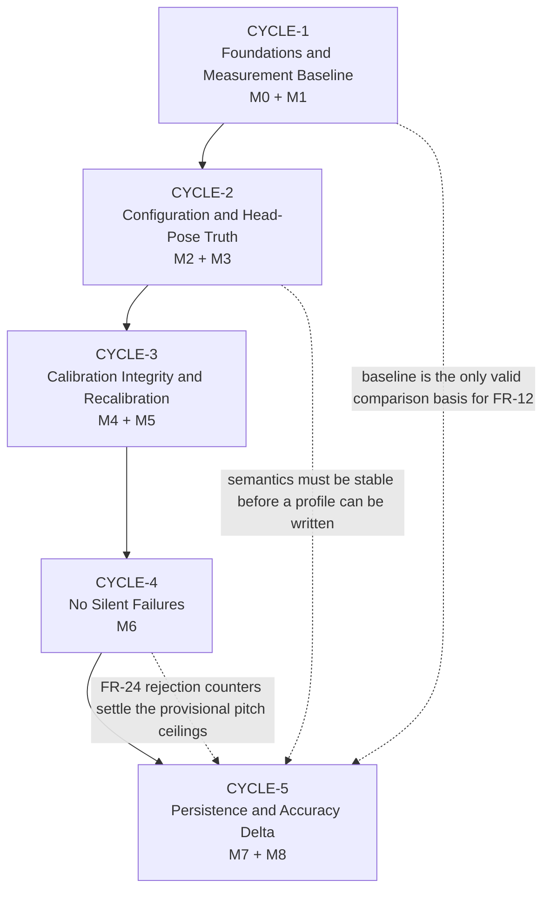

# Build Cycles Overview — EyeTracker

**Date**: 2026-08-07
**Author**: AIRE_BUILD_CYCLE_PLANNER
**Status**: Approved — 2026-08-07
**Sources**: [requirements.md](docs/requirements.md) · [02-target-architecture-brownfield.md](docs/architecture/design/02-target-architecture-brownfield.md) · [03-patterns-and-standards-brownfield.md](docs/architecture/design/03-patterns-and-standards-brownfield.md) · [ui-ux-spec.md](docs/ui-ux/ui-ux-spec.md)

---

## Summary

**Total Cycles**: 5
**Cycle Plans**: `docs/plans/builds/cycle-[N]/cycle-plan.md`
**Story Files**: `docs/plans/stories/` — created by `aire-brownfield-plan`, each carrying its cycle's BUILDID
**Coverage**: 33/33 functional requirements · 16/16 success criteria · 10/10 failure criteria · 7/7 defects

The cycles are a direct expression of the architecture's **M0 – M8 migration graph**. Two orderings in that graph come from evidence rather than preference, and the cycle boundaries are placed so that **neither can be violated by accident**:

- 🔴 **The accuracy baseline must be recorded before the head-pose fix** (FR-12). Cycle 1 ends with the baseline; Cycle 2 begins the fix. If the fix landed first, the pre-fix baseline would be unrecoverable without checking out an old commit and re-running a human protocol, and success criterion 7 — "accuracy must not regress" — would become unverifiable.
- 🔴 **Persistence must be last** (FR-18). Theme A changes what the head-pose features *mean*; Theme E makes calibrations outlive the process. A bundle written before the semantics settled would be refused by its own version gate the moment Cycle 2 shipped. **Failure criterion 3 names a silently-loaded stale profile as the highest-severity outcome available in this scope.**

---

## Cycle Map

| Cycle | BUILDID | Phases | Scope Summary | Expected Outcome |
|---|---|---|---|---|
| **Cycle 1** | `CYCLE-1` | M0 + M1 | Packaging, test scaffold, logging infrastructure, `.venv` rebuild, **FR-33 eye-pairing answered**, evaluation harness + protocol + **pre-fix baseline** | A green test suite runs against an importable package, **and a signed baseline accuracy report exists** with mean and 95th-percentile error in degrees and pixels against a named commit SHA |
| **Cycle 2** | `CYCLE-2` | M2 + M3 | Configuration layer, single gate definition, **head-pose axis correction and de-discontinuation**, gate re-pairing, semantics version → 2 | Each named head-pose feature responds to the rotation it names within ±0.01 rad, feature 10's ±π wrap is gone, **nodding is gated for the first time**, and ~40 literals resolve to one typed settings tree |
| **Cycle 3** | `CYCLE-3` | M4 + M5 | Owned application lifetime, cancellable calibration machine, idempotent completion, **recalibration without restart**, minimum-usable-calibration enforcement | Aborting calibration emits **exactly one** completion event; the user can **recalibrate without restarting**; too few usable targets produces a visible refusal instead of an unusable model |
| **Cycle 4** | `CYCLE-4` | M6 | `StatusWindow`, rejection accounting, `print()` → structured logging, dot hiding, capture robustness, `viable` enforced | **Every enumerated failure path produces a visible message within 3 s and offers a recovery action.** The dot hides within 500 ms of face loss. An unplugged camera offers Retry instead of spinning silently |
| **Cycle 5** | `CYCLE-5` | M7 + M8 | Calibration persistence with the version gate and refuse-before-unpickle, **post-fix accuracy delta**, ≥85% coverage close-out | Launch with a valid profile **skips the 79–141 s ritual**; a stale-semantics profile is **refused with a named reason**; and the **delta is reported with a 95% CI** — the programme sign-off artifact |

---

## Dependency Map

The cycles are **strictly sequential**. That is a consequence of the migration graph, not a scheduling choice — every cycle boundary sits on a hard dependency edge:

| Edge | Source | Why it cannot be reordered |
|---|---|---|
| C1 → C2 | M0 → M1 → M2, M1 → M3 | FR-12 requires the baseline **before** the Theme A fixes |
| C2 → C3 | M2 → M4, M3 → M5 | The lifetime work needs the config layer; the minimum-sample work needs stable semantics |
| C3 → C4 | M4 → M6 | Failure feedback wires into the session state machine that C3 creates |
| C4 → C5 | M6 → M7 | The F4 refusal banner needs somewhere to appear |
| C2 → C5 | M3 → M7 | 🔴 A profile written before the semantics settle is refused by its own gate |
| C1 → C5 | M1 ⇢ M8 | The delta has no valid comparison basis without the baseline |

**No cycle requires incomplete output from another** — each depends only on cycles that have fully signed off.

### Cross-cycle carry-forward

| Item | Originates | Resolved | Note |
|---|---|---|---|
| The two **provisional pitch ceilings** (0.35 / 0.45 rad) | Cycle 2 | Cycle 5 | The only invented numbers in the design. Cycle 4's FR-24 counters are the evidence that settles them — so Cycle 2 ships them provisional, marked as such in code |
| **Quit affordance** for `setQuitOnLastWindowClosed(False)` | Cycle 3 | Cycle 4 | Cycle 3 ships an explicit programmatic exit path; Cycle 4 attaches the user-facing control. Cycle 4 must not slip independently of Cycle 3 |
| **`print()` call-site migration** (10 sites, 3 modules) | Cycle 1 *(infrastructure)* | Cycle 4 *(call sites)* | The logger lands early; the migration waits for somewhere to surface |
| **Geometry-change invalidation of the active calibration** | UI/UX spec | Cycle 5 | ⚠️ Depends on unratified FR-19a |
| **Deep-dive documentation corrections** | Cycles 2 & 4 | Cycle 5 | Head-pose sections in `01-gaze` and `03-face-mesh`; the `viable` row in `00-system-overview` |

---

## Requirement → Cycle Traceability

| Cycle | Functional Requirements |
|---|---|
| **CYCLE-1** | FR-10, FR-11, FR-25 *(infrastructure)*, FR-26, FR-27 *(scaffold)*, FR-29 *(partial)*, **FR-33** |
| **CYCLE-2** | FR-1, FR-2, FR-3, FR-4, FR-13, FR-14, FR-15, FR-18 *(version constant)*, FR-28 *(#4, #5)* |
| **CYCLE-3** | FR-5, FR-6, FR-7, FR-8, FR-9, FR-22, FR-28 *(#3, #6)* |
| **CYCLE-4** | FR-20, FR-21, FR-23, FR-24, FR-25 *(call sites)*, FR-30, FR-31, FR-32, FR-28 *(#7, #8, #9)* |
| **CYCLE-5** | FR-12, FR-16, FR-17, FR-18, FR-19, FR-27 *(gate closed)*, FR-29 *(completed)* |

**FR-27, FR-28 and FR-29 span every cycle by design.** They are deliberately **not** a final "polish" tier — the Core Rule *Tests with Code — never postpone tests* forbids it, and the ≥85% gate is met progressively, then verified in Cycle 5.

### Defect → Cycle

| Defect | Title | Cycle |
|---|---|---|
| [#4](https://github.com/raminmardani/EyeTracker/issues/4) | Head-pose angle labels cyclically permuted | CYCLE-2 |
| [#5](https://github.com/raminmardani/EyeTracker/issues/5) | `FEATURE_ROLL` discontinuous at neutral | CYCLE-2 |
| [#3](https://github.com/raminmardani/EyeTracker/issues/3) | Esc abort emits `finished` twice | CYCLE-3 |
| [#6](https://github.com/raminmardani/EyeTracker/issues/6) | Abort at 5-target minimum → unusable model | CYCLE-3 |
| [#7](https://github.com/raminmardani/EyeTracker/issues/7) | Resolution/FPS skipped on fallback paths | CYCLE-4 |
| [#8](https://github.com/raminmardani/EyeTracker/issues/8) | MediaPipe graph leaked if probing raises | CYCLE-4 |
| [#9](https://github.com/raminmardani/EyeTracker/issues/9) | `viable` check computed but never read | CYCLE-4 |

---

## Risk Log

Scoping risks flagged during planning. Each names its cycle and what would mitigate it.

| # | Risk | Cycle | Severity | Mitigation |
|---|---|---|---|---|
| R-1 | 🔴 **`.venv/` has no interpreter and no `pyvenv.cfg`** — it cannot be activated. **This blocks every test in every cycle** | C1 Day 1 | **Blocking** | First task of the programme. Requirements open item 6 |
| R-2 | 🔴 **Cycle 1 Day 4 and Cycle 5 Day 4 are human-gated, not build steps.** Both need a person, a webcam, controlled lighting and a measured seating distance. Neither can be completed by an agent and neither can be compressed | C1, C5 | High | Schedule both explicitly. If the protocol (open item 3) is unsettled by C1 Day 3, the whole programme slips — C2 cannot start without the baseline |
| R-3 | 🔴 **Cycle 2 is the highest-risk cycle**: M3 changes every regressor input and both frame gates | C2 | High | Cycle 1's baseline exists to measure against; the synthetic-projection harness needs no hardware; the re-pairing table carries recorded provenance; Days 1–2 are behaviour-preserving with golden tests, isolating the semantic change to Day 3 |
| R-4 | 🔴 **Gate thresholds renamed without re-pairing** would silently retune the physical envelope in opposite directions. **Failure criterion 9 names exactly this** | C2 Day 4 | High | The re-pairing table with per-axis provenance, recorded in code |
| R-5 | ⚠️ **Two provisional pitch ceilings ship in Cycle 2 but the data that settles them arrives in Cycle 4** | C2 → C5 | Medium | Marked provisional in code with what would settle them; a Cycle 5 task revisits them. Still better than today's complete absence of pitch gating |
| R-6 | ⚠️ **FR-8's stated basis is arithmetically unsatisfiable** — "justified against the largest feature subset (25 inputs)" cannot be met when the grid yields at most 25 targets. A coverage rule is substituted | C3 Day 4 | Medium | Requires requirements-owner ratification, not silent substitution. The `rows`/`cols` terms also catch what a count-only check cannot: row-major collection clusters an early abort in the top rows |
| R-7 | ⚠️ **9 requirements-reconciliation items remain unratified**, chiefly proposed **FR-19a** (screen geometry in the profile key) | C1 → C5 | Medium | Ratify during Cycle 1. FR-19a blocks part of Cycle 5's scope |
| R-8 | ⚠️ **Between Cycle 3 and Cycle 4 the application has no user-facing exit.** C3 lands `setQuitOnLastWindowClosed(False)`; C4 lands the Quit control | C3 → C4 | Medium | C3 ships a tested programmatic exit path; C4 must not slip independently. The migration plan treats M4's items as one unit of work |
| R-9 | ⚠️ **`FR-33`'s answer can change downstream scope.** If the eye signals are crossed, per-eye quality weighting is invalid and must be corrected or removed | C1 Day 1 | Medium | Explicit decision gate at end of C1 Day 1, before any accuracy work is trusted |
| R-10 | ⚠️ **The 38-D contract is a single-owner file touched in both Cycle 2 and Cycle 5.** Renumbering indices in one cycle without updating all four consumers is **failure criterion 6** | C2, C5 | Medium | Index numbering is explicitly frozen — only *values* change. A `FEATURE_COUNT` assertion enforces it |
| R-11 | ⚠️ **Cycle 4 has the largest `shared_files` surface** — `app.py`, `errors.py`, `diagnostics.py`, `config.py` and `conftest.py` all touched by multiple concerns | C4 | Medium | `aire-brownfield-plan` must sequence rather than parallelise stories touching these. Patterns §18 is the authoritative list |
| R-12 | ⚠️ **A protocol drift between Cycle 1 and Cycle 5 invalidates the delta** and with it success criterion 7 | C5 Day 4 | Medium | The protocol is documented in Cycle 1 and re-used verbatim, not re-derived |
| R-13 | ⚠️ **A user who can operate neither mouse nor keyboard cannot self-recover in this programme.** The audience is defined as unable to use a mouse; dwell-click is out of scope | C4 | Recorded | Cannot be closed by UI design. The focus-on-fault rule is the in-scope mitigation. Cycle 5's delta report is the evidence the dwell-click decision was waiting for |
| R-14 | ⚠️ **The profile SHA-256 detects corruption, not tampering**, and the camera fingerprint is a change detector, not an identity | C5 | Recorded | Must be documented as such in code and docs. Never described as a signature. `skops` recorded as the long-term direction |

---

## Deviations from the Workflow's Defaults

Each recorded with its reason rather than applied silently.

| Workflow expectation | What was done | Why |
|---|---|---|
| **Vertical slices — never "all backend" or "all frontend"** | Held the *intent*: every cycle ends in something a stakeholder can observe | This is a single-process desktop application with **no frontend/backend axis to slice along**. Cycle 1's observable is a measurement rather than a feature — that is the honest description of it, not a horizontal slice by another name |
| **Tier 5 — Non-functional / Polish** | Left **deliberately empty**; FR-27/28/29 distributed across all five cycles | The Core Rule *Tests with Code — never postpone tests* forbids a testing tier. Coverage is met progressively and verified in Cycle 5 |
| **Tier 4 — Integrations** | **Empty** | Two integration points exist — webcam in, one-time model download out — and both already work. There is nothing to build |
| **Cycles carry start and end dates** | Sequenced by dependency; **no dates invented** | Target Completion is `TBD` (requirements open item 1). Each cycle is sized to the 4-half-day workshop structure and is ready to be dated once a target exists |
| **`aire-ui-ux-design` recommended per cycle** | Run **once, before** the cycles | The approved spec already covers all three surfaces. Cycle 4 consumes it rather than needing a new run |
| **Cycle 1 bootstraps the architecture scaffold** | ✅ Honoured | M0 is exactly this: packaging, test scaffold, logging infrastructure, dependency-rule enforcement |

---

## Quality Gates — Every Cycle

Applied at each cycle's Day 4 sign-off. From `docs/requirements.md` and patterns §Quality Checklist.

- [ ] All tests pass (100%) — **no `skip` or `xfail` used to reach a gate**
- [ ] Coverage on track for ≥85% (closed and verified in Cycle 5)
- [ ] Every defect fix has a regression test **observed failing** against pre-fix code, output pasted as evidence
- [ ] `ruff check` and `ruff format --check` clean — zero warnings
- [ ] No `print()` in `eye_tracker/` or `main.py` *(from Cycle 4)*
- [ ] Functions ≤30 lines, or covered by an allowlist entry **with its reason**
- [ ] No `TODO` / `FIXME`; no commented-out code
- [ ] Dependency direction respected — `tests/arch/` passes
- [ ] GUI-thread affinity asserted in any new signal receiver
- [ ] 🔴 **No frame, landmark array, blendshape map or full feature vector logged or persisted above DEBUG** — this is biometric data
- [ ] Provisional values marked provisional in code, with what would settle them
- [ ] Code review approved
- [ ] Accuracy re-measured against baseline before programme sign-off *(Cycle 5)*

---

## GitHub Release Plan — Tracking Integration

**Tracking**: GitHub Projects · **Repo**: [raminmardani/EyeTracker](https://github.com/raminmardani/EyeTracker) · **Project**: [users/raminmardani/projects/4](https://github.com/users/raminmardani/projects/4)
**Release Field ID**: `PVTSSF_lAHOA3gd_c4Bfno8zhZ5RZc`

A **Build Cycle = Release Plan**. Each cycle is one option on the project's **Release** single-select field, so every Story and Bug issue created downstream can be tagged with its cycle.

| Cycle | Release Option | Option ID | Colour | Draft Release |
|---|---|---|---|---|
| CYCLE-1 | `CYCLE-1 — Foundations & Measurement Baseline` | `cd228d8a` | BLUE | [draft](https://github.com/raminmardani/EyeTracker/releases/tag/untagged-871d034760e821d8adc4) → `v1.0.0-cycle-1` |
| CYCLE-2 | `CYCLE-2 — Configuration & Head-Pose Truth` | `e3cc008c` | PURPLE | [draft](https://github.com/raminmardani/EyeTracker/releases/tag/untagged-f7eaa10fefee9065b57e) → `v1.0.0-cycle-2` |
| CYCLE-3 | `CYCLE-3 — Calibration Integrity & Recalibration` | `7a2facd4` | GREEN | [draft](https://github.com/raminmardani/EyeTracker/releases/tag/untagged-2182e9844584801d7a3d) → `v1.0.0-cycle-3` |
| CYCLE-4 | `CYCLE-4 — No Silent Failures` | `6236563f` | ORANGE | [draft](https://github.com/raminmardani/EyeTracker/releases/tag/untagged-f0dbd571673e3b6ffdda) → `v1.0.0-cycle-4` |
| CYCLE-5 | `CYCLE-5 — Persistence & Accuracy Delta` | `3d6ce045` | PINK | [draft](https://github.com/raminmardani/EyeTracker/releases/tag/untagged-1f9f90321ce25b960d7f) → `v1.0.0-cycle-5` |

**Notes for downstream workflows**:

- The `TBD` placeholder option recorded at kickoff was **replaced**, not appended to — `singleSelectOptions` replaces the entire list. Verified beforehand that all 8 project items had `Release` unset, so nothing lost its assignment.
- 🔧 `UpdateProjectV2FieldInput` **no longer accepts `projectId`** — pass only `fieldId` and `singleSelectOptions`. The workflow's example mutation includes `projectId` and fails.
- ⚠️ Draft-release URLs contain `untagged-…` because a draft creates **no git tag** until published. Verified: **0 tags** exist on the repository. The URLs change to `/releases/tag/v1.0.0-cycle-N` on publish.
- Owner is a **user account**, not an org — `--owner raminmardani`, and project URLs are `/users/…`.
- The **Sprint** iteration field already holds Sprint 1 (2026-08-06), Sprint 2 (2026-08-20), Sprint 3 (2026-09-03), 14 days each. Sprints and Release options are **independent axes** — a cycle is a scope grouping, a sprint is a time box. With 5 cycles and 3 existing sprints, more sprints are needed once a target date exists.

---

## Next Steps

| # | Command | Purpose |
|---|---|---|
| 1 | `aire-brownfield-plan` | Implementation planning for **CYCLE-1**. FR-33 is the designated first story. Inputs ready: the File/Module Boundary Map (patterns §18) supplies `files_touched` and the 9-entry `shared_files` list for `docs/plans/dependency-graph.yml` |
| 2 | Requirements-owner ratification | 11 items: the 9 already flagged (chiefly **FR-19a**), plus the **FR-8 coverage-rule substitution** and the **`CalibrationResult` breaking change** |
| 3 | Rebuild `.venv/` | 🔴 Blocking. No test runner can execute until it has an interpreter and a `pyvenv.cfg` |
| 4 | Settle the evaluation protocol | Requirements open item 3. Needed by Cycle 1 Day 3, or Day 4's baseline is not reproducible |
| 5 | Supply a target completion date | Requirements open item 1. The cycles are ready to be dated |
