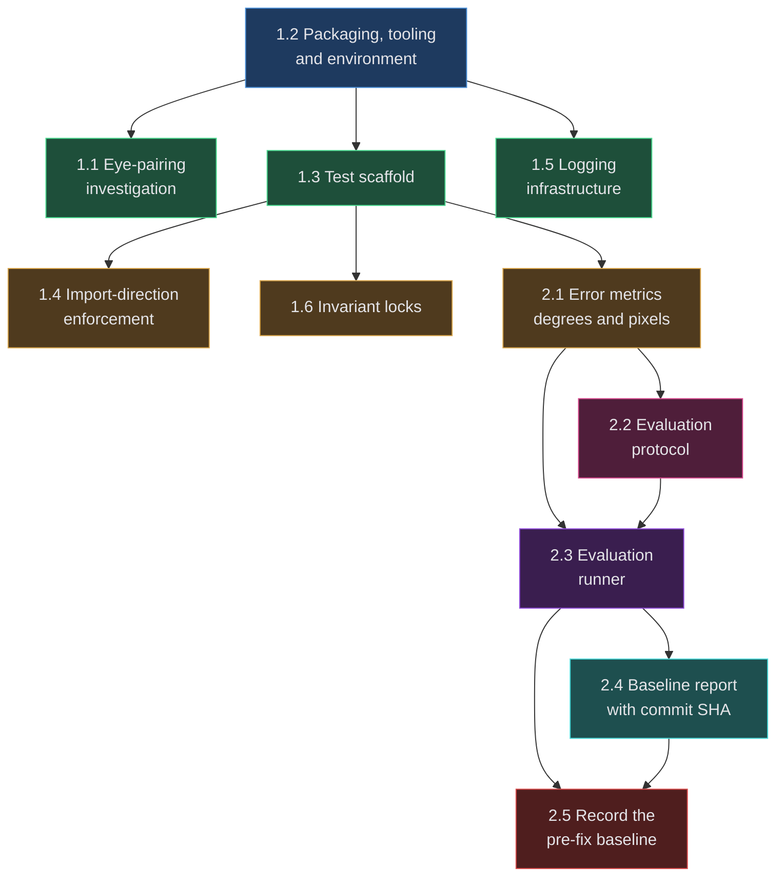

# EyeTracker — Implementation Plan

**Project**: EyeTracker | **Version**: 1.0 | **Created**: 2026-08-07
**Author**: AIRE_PRODUCT_OWNER | **Status**: AWAITING
**BUILDID**: CYCLE-1 — Foundations & Measurement Baseline (migration phases M0 + M1)
**Cycle plan**: [cycle-1/cycle-plan.md](docs/plans/builds/cycle-1/cycle-plan.md) · **Graph**: [dependency-graph.yml](docs/plans/dependency-graph.yml)

> **Scope**: CYCLE-1 only. The five cycles are strictly sequential and CYCLE-1's FR-33 outcome can change CYCLE-2's scope, so later cycles are planned when they start. Re-run `aire-brownfield-plan` per cycle.

> ✅ **Authoring complete as of 2026-08-07 19:03 — all 11 stories have story files**, each passing a blocking depth gate, in `docs/plans/stories/`.
> On GitHub: 1.2 → [#10](https://github.com/raminmardani/EyeTracker/issues/10), 1.1 → [#11](https://github.com/raminmardani/EyeTracker/issues/11), 1.3 → [#12](https://github.com/raminmardani/EyeTracker/issues/12), 1.5 → [#13](https://github.com/raminmardani/EyeTracker/issues/13). ⏸️ **1.4, 1.6 and 2.1 – 2.5 are not pushed**; the `epic:2` and `wave:3` – `wave:7` labels and the Epic 2 milestone do not exist yet.
> ⚠️ Issues **#10 and #12** have since been edited locally (1.2 gained an idempotent-repeat row; 1.3's fit-cost figure was corrected), so their GitHub bodies are stale and must be refreshed in the push pass.
> 🔧 **Story 2.5's `files_touched` was amended** during authoring — see its entry below.

---

## Dependency Graph

### Wave Summary

| Wave | Stories | Independent? | What it unlocks |
|---|---|---|---|
| **1** | 1.2 | Sole seed | Creates `pyproject.toml` — the shared root config. Nothing else can be tested until `eye_tracker` is importable |
| **2** | 1.1, 1.3, 1.5 | ✅ 3 independent | Test harness, logging, and the FR-33 answer — pick in any order |
| **3** | 1.4, 1.6, 2.1 | ✅ 3 independent | Dependency rule enforced, verified behaviours locked, error metrics available |
| **4** | 2.2 | Chain | Protocol definition — ⚠️ blocked on requirements open item 3 |
| **5** | 2.3 | Chain | The runner that produces a measurement set |
| **6** | 2.4 | Chain | Report generation |
| **7** | 2.5 | Chain | ⚠️ Human-gated — the recorded baseline, this cycle's headline deliverable |

**11 stories · 7 waves · one root (`1.2`) · longest dependency chain 7 deep.**

### Wave Workload Distribution (team_size: 1)

| Wave | Stories | Per Dev | Dev Assignments | Notes |
|---|---|---|---|---|
| 1 | 1 | 1 | Dev-1: [1.2] | ✅ seed story, nothing parallel by design |
| 2 | 3 | 3 | Dev-1: [1.1, 1.3, 1.5] | ✅ 3 independent — safe in any order |
| 3 | 3 | 3 | Dev-1: [1.4, 1.6, 2.1] | ✅ 3 independent |
| 4 | 1 | 1 | Dev-1: [2.2] | ✅ chain forced by architecture |
| 5 | 1 | 1 | Dev-1: [2.3] | ✅ chain forced by architecture |
| 6 | 1 | 1 | Dev-1: [2.4] | ✅ chain forced by architecture |
| 7 | 1 | 1 | Dev-1: [2.5] | ✅ human-gated measurement session |

Solo developer — assignments are single-slot, no `dev:N` labels are pushed to the tracker. Advisory: stories within a wave may be taken in any order.

### `shared_files`

| File | Status | Touched by |
|---|---|---|
| `pyproject.toml` | 🆕 created by 1.2 | 1.2 (later cycles add config) |
| `requirements.txt` | exists | 1.2 |
| `.gitignore` | exists | root-config baseline — declared, no story edits it |
| `tests/conftest.py` | 🆕 created by 1.3 | **1.3, 1.6, 2.3** — the real serialisation point |
| `docs/status.md` | exists | declared; deliberately excluded from per-story `files_touched` |

5 of the architecture's 9 entries (patterns §18). `config.py`, `errors.py`, `diagnostics.py`, `gaze.py` and `app.py` are first touched in CYCLE-2 onward.

> **Why `docs/status.md` is excluded from `files_touched`**: it carries `merge=union` in `.gitattributes` so concurrent appends cannot conflict, and it is written by the dev workflow rather than by a story's code change. Listing it per story put a permanent false positive into the same-wave overlap check, which would mask a genuine overlap later.

---

## 1. Overview

### Success Criteria (this cycle)

Measurable, from `docs/requirements.md`. Each maps to at least one story.

1. **Eye pairing resolved** — FR-33 answered with recorded evidence; per-eye quality weighting confirmed sound or scheduled for correction. *(Success criterion 16 → Story 1.1)*
2. **`eye_tracker` and `main` import from `tests/`** with no `sys.path` manipulation and no `PYTHONPATH`. *(FR-26 → Story 1.2)*
3. **`pytest` runs green from a rebuilt `.venv/`**, output pasted as evidence. *(FR-27 → Stories 1.2, 1.3)*
4. **Dependency direction enforced** — no core module imports outward; `tests/arch/` passes. *(DR-10, patterns §8 → Story 1.4)*
5. **Diagnostics are structured** — `logging` with levels, a controllable destination, and the `[module]` bracket convention preserved as logger names. *(FR-25 infrastructure → Story 1.5)*
6. **Three verified-correct behaviours locked**: eye-local roll invariance bit-identical across 40°; the out-of-distribution variance interlock clamping (σ 18–23 px in-distribution vs ~6000 px extrapolating); the smoother reaching 90% in 1 frame at scale 1.0 and 6 frames at 0.011. *(FR-29 → Story 1.6)*
7. **Gaze error measurable in both units** — mean and 95th-percentile in degrees of visual angle **and** screen pixels. *(FR-10 → Stories 2.1, 2.3)*
8. **Baseline recorded** — `docs/evaluation/baseline-pre-fix.md` states both unit sets, the full protocol (target count and layout, session count, seating distance, lighting, camera) and the **commit SHA** measured against. *(Success criterion 6, FR-10/FR-11 → Stories 2.2, 2.4, 2.5)*
9. **`ruff check` and `ruff format --check` clean** on all new code — zero warnings. *(Patterns §13, all stories)*
10. **Zero behavioural change to the running application.** M0's rollback is "revert; nothing behavioural changed" — that must be literally true. *(All stories)*

### Epic Breakdown

- **Epic 1: Test & Packaging Foundation** — make the codebase testable, importable and observable, and answer the blocking eye-pairing question. 6 stories.
- **Epic 2: Accuracy Measurement & Baseline** — make gaze error measurable and record a pre-fix baseline against a commit SHA. 5 stories.

### Format deviations, recorded with reasons

`IMPLEMENTATION_PLAN_FORMAT.md` is written for multi-role web applications. Four fields do not map to this codebase; each is substituted rather than left blank or filled with invented web semantics.

| Template field | Substitution | Reason |
|---|---|---|
| **RBAC Enforcement** table | The sentinel `No role-differentiated access — single actor.` in every story | The Roles & Permissions Matrix has exactly one role, `Local User`, and "no role variation — single actor" is verified across all 8 source files: no auth, no user model, no sessions. The template's own validation checklist marks listing personas on a single-actor story as a **FAIL** |
| **User Flow** — per-persona subsections | **Mode B** (one deep User Journey, ≥4 interaction states) for user-observable stories; **Mode C** (`Actor: system — no role variation.`) for infrastructure stories | Same reason — mandated by the template for single-actor RBAC |
| **Scope derivation / IDOR guard** | `N/A — no scoped permission, no token or session exists to derive scope from` | There is nothing to derive scope *from*. Stating a fake guard would be worse than stating its absence |
| **System responses + error cases** — HTTP status codes | Qt signals, raised exceptions and **F0–F4 fault categories** | No HTTP or RPC surface exists. The Trigger/Response/Side-effect shape is kept; only the vocabulary changes |
| **Quality: "ESLint 0 errors"** | **`ruff check` + `ruff format --check` clean** | Python project; ruff is what patterns §13 mandates |
| **QA groups: `[backend]` tag** | `[infra]` | No backend/frontend split exists. The tag's purpose — marking stories that are prerequisites rather than directly QA-testable — is preserved |

---

## EPIC 1: TEST & PACKAGING FOUNDATION

**Owner**: AIRE_DEV | **Goal**: `eye_tracker` is importable from a test directory, an automated suite runs green, diagnostics are structured, the layering rule is machine-enforced, and the blocking eye-pairing question is answered with evidence.

**Must Read References**: none — `SPEC/references/` contains 0 files.

**Prerequisites**: `docs/requirements.md`, `docs/architecture/design/02-target-architecture-brownfield.md` and `03-patterns-and-standards-brownfield.md` all approved. 🔴 A working Python 3.14.6 interpreter — currently **blocked**, which Story 1.2 resolves.

**Completion**: `pytest` green from a rebuilt `.venv/` with coverage reported · `ruff` clean · `tests/arch/` enforcing the dependency rule · three invariants locked · FR-33 answered and recorded · **zero behavioural change to the application**.

---

### Story 1.2: Packaging metadata, tool configuration and a rebuilt development environment

**File**: `docs/plans/stories/epic-1-story-1.2-Packaging-And-Environment.md`
**Wave**: 1 (sole seed) · **Requires**: `[]` · **Enables**: `[1.1, 1.3, 1.5]`
**Objective**: Create `pyproject.toml` so `eye_tracker` and `main` import from `tests/` with no `PYTHONPATH`, land the ruff/pytest/coverage configuration, and restore a `.venv/` that actually has an interpreter.

### Story 1.1: Eye-pairing investigation — do landmark and blendshape signals describe the same eye

**File**: `docs/plans/stories/epic-1-story-1.1-Eye-Pairing-Investigation.md`
**Wave**: 2 · **Requires**: `[1.2]` · **Enables**: `[]`
**Objective**: Determine whether landmark-derived eye geometry and blendshape-derived eye signals describe the **same physical eye**, and record the answer — if crossed, per-eye quality weighting is invalid and must be corrected before accuracy work is trusted.

### Story 1.3: Test scaffold — offscreen Qt harness, synthetic fixtures and the five suite directories

**File**: `docs/plans/stories/epic-1-story-1.3-Test-Scaffold.md`
**Wave**: 2 · **Requires**: `[1.2]` · **Enables**: `[1.4, 1.6, 2.1]`
**Objective**: Stand up `tests/conftest.py` with the offscreen Qt fixture, synthetic `pts2d` builder, stub tracker and fitted-calibrator fixture, plus the five suite directories, and prove the harness works with a smoke test.

### Story 1.5: Structured logging infrastructure with the bracket convention preserved as logger names

**File**: `docs/plans/stories/epic-1-story-1.5-Logging-Infrastructure.md`
**Wave**: 2 · **Requires**: `[1.2]` · **Enables**: `[]`
**Objective**: Provide `logging` setup with levels, a controllable destination and rate limiting, converting the existing `[module]` bracket prefixes into logger names — infrastructure only; the 10 `print()` call sites migrate in CYCLE-4.

### Story 1.4: Dependency-direction enforcement — an AST import test replacing a directory restructure

**File**: `docs/plans/stories/epic-1-story-1.4-Import-Direction-Enforcement.md`
**Wave**: 3 · **Requires**: `[1.3]` · **Enables**: `[]`
**Objective**: Enforce the clean-architecture dependency rule with an AST test that fails when a core module imports outward, so the rule holds without moving files and breaking the 38-D contract's four consumers.

### Story 1.6: Invariant locks for the three verified-correct behaviours reachable without hardware

**File**: `docs/plans/stories/epic-1-story-1.6-Invariant-Locks.md`
**Wave**: 3 · **Requires**: `[1.3]` · **Enables**: `[]`
**Objective**: Lock eye-local roll invariance, the out-of-distribution variance interlock and the smoother's step response with tests, so later remediation cannot silently regress behaviours the deep-dive proved correct.

---

## EPIC 2: ACCURACY MEASUREMENT & BASELINE

**Owner**: AIRE_DEV | **Goal**: Gaze error becomes measurable against known screen targets in both degrees of visual angle and screen pixels, under a documented reproducible protocol, with a pre-fix baseline recorded against a commit SHA.

**Must Read References**: none — `SPEC/references/` contains 0 files.

**Prerequisites**: Epic 1 Story 1.3 complete (test scaffold). 🔴 **Requirements open item 3** — the protocol specifics (seating distance, lighting, target count, session count) must be supplied by the requirements owner before Story 2.2 can complete. ⚠️ A person, a webcam and controlled lighting for Story 2.5.

**Completion**: `docs/evaluation/baseline-pre-fix.md` exists with mean and 95th-percentile error in **both** degrees and pixels, the full protocol, and the commit SHA measured against — the artifact that makes "accuracy must not regress" verifiable in CYCLE-5.

---

### Story 2.1: Gaze-error metrics reported in both degrees of visual angle and screen pixels

**File**: `docs/plans/stories/epic-2-story-2.1-Error-Metrics.md`
**Wave**: 3 · **Requires**: `[1.3]` · **Enables**: `[2.2, 2.3]`
**Objective**: Compute mean and 95th-percentile gaze error from predicted/target point pairs, in screen pixels and in degrees of visual angle, with the pixel→degree conversion taking viewing distance and physical screen size as explicit inputs.

### Story 2.2: Evaluation protocol — target layout, session parameters and the reproducibility record

**File**: `docs/plans/stories/epic-2-story-2.2-Evaluation-Protocol.md`
**Wave**: 4 · **Requires**: `[2.1]` · **Enables**: `[2.3]`
**Objective**: Define the protocol as typed, serialisable parameters and document it so a third party can reproduce the measurement. ⚠️ **Blocked on requirements open item 3** — the story ships the parameter surface; the values must come from the requirements owner.

### Story 2.3: Evaluation runner — present known targets, collect predictions, emit a measurement set

**File**: `docs/plans/stories/epic-2-story-2.3-Evaluation-Runner.md`
**Wave**: 5 · **Requires**: `[2.1, 2.2]` · **Enables**: `[2.4, 2.5]`
**Objective**: Drive a measurement session — present each protocol target, collect the smoothed prediction while the participant fixates, reject unusable samples with a counted reason, and emit a measurement set the metrics module can score.

### Story 2.4: Baseline report generation stamped with the commit SHA it was measured against

**File**: `docs/plans/stories/epic-2-story-2.4-Baseline-Report.md`
**Wave**: 6 · **Requires**: `[2.3]` · **Enables**: `[2.5]`
**Objective**: Render a measurement set plus its protocol into a Markdown report under `docs/evaluation/`, stamped with the resolved git commit SHA and a dirty-worktree warning, so the baseline is attributable to an exact code state.

### Story 2.5: Record the pre-fix accuracy baseline under the documented protocol

**File**: `docs/plans/stories/epic-2-story-2.5-Record-Baseline.md`
**Wave**: 7 · **Requires**: `[2.3, 2.4]` · **Enables**: `[]`
**Objective**: ⚠️ **Human-gated.** Build the session surface that presents targets on screen, run the measurement with a person and a webcam under the documented protocol, and commit `docs/evaluation/baseline-pre-fix.md` — the artifact that makes success criterion 7 ("accuracy must not regress") verifiable in CYCLE-5.
🔧 **`files_touched` amended 2026-08-07**: the original entry listed only the artifact, which is unbuildable — Story 2.3's runner is APPLICATION layer and owns no window, and no other story presents targets. `eye_tracker/tools/evaluate_session.py` (INFRASTRUCTURE, so it may import PyQt6) and `tests/integration/test_evaluate_session.py` were added.

---

## Quality Gates

**Per Story**: patterns followed (`docs/architecture/design/03-patterns-and-standards-brownfield.md`) · tests written **with** the code, never after · `ruff check` and `ruff format --check` clean · functions ≤30 lines or covered by an allowlist entry **with its reason** · all AC met · self-review recorded.

**Per Epic**: all stories done · full suite green · coverage reported and trending toward ≥85% · module docstrings carry their `Layer:` declaration · `tests/arch/` passes.

**Cycle exit**: FR-33 answered · `pytest` green from a rebuilt `.venv/` · three invariants locked · `docs/evaluation/baseline-pre-fix.md` recorded with a commit SHA · **zero behavioural change to the application** · no `TODO`/`FIXME` in delivered code.

🔴 **Privacy gate, every story**: no camera frame, `pts2d` landmark array, blendshape map or full feature vector may be logged or persisted above DEBUG. This is biometric data.

---

## Risks

| Risk | Impact | Mitigation |
|---|---|---|
| 🔴 **`.venv/` has no interpreter and no `pyvenv.cfg`** — blocks every test in every story | **H** | Story 1.2 is the sole wave-1 seed and resolves it first. Requirements open item 6 |
| 🔴 **Protocol specifics unspecified** (open item 3) — seating distance, lighting, target count, session count | **H** | Story 2.2 ships the parameter surface with values marked required-from-owner; no numbers are invented. Without them the baseline is not reproducible, FR-11 fails, and CYCLE-5's delta has no valid comparison basis |
| 🔴 **Stories 2.5 is human-gated** — needs a person, a webcam and controlled lighting | **H** | Scheduled explicitly, not treated as a build step. CYCLE-5's re-measure must use the **identical** protocol or success criterion 7 is unverifiable |
| ⚠️ **FR-33's outcome can change downstream scope** — if the eye signals are crossed, per-eye quality weighting is invalid | **M** | Story 1.1 is early (wave 2) with an explicit decision gate; its finding is recorded in `docs/analysis/` before any accuracy work is trusted |
| ⚠️ **`tests/conftest.py` is the serialisation point** — touched by 1.3, 1.6 and 2.3 | **M** | Those three sit in waves 2, 3 and 5, so they never run concurrently. Declared in `shared_files` |
| ⚠️ **Degree-based error needs physical measurements** the codebase cannot obtain — viewing distance and screen diagonal | **M** | Story 2.1 takes them as explicit required inputs and refuses to guess; they are part of the protocol record |
| ⚠️ **A measurement harness can be built that measures the wrong thing** — e.g. scoring raw predictions when the product ships smoothed output | **M** | Story 2.3 fixes which signal is scored (post-smoothing, as the user experiences it) and records that choice in the protocol so CYCLE-5 repeats it |

---

## QA Manual Testing Groups

Groups are ordered by first testable milestone, by epic. Every story appears in exactly one group. Stories that are prerequisites rather than directly testable are marked `[infra]` — this project has no backend/frontend split, so `[infra]` replaces the template's `[backend]` tag while serving the same purpose.

### Epic 1: Test & Packaging Foundation

**Group 1** — Stories: 1.2 `[infra]`, 1.3 `[infra]`, 1.4 `[infra]`, 1.5 `[infra]`, 1.6 `[infra]`

Once all five are done, QA can verify the development toolchain end-to-end without touching the application's behaviour. Clone the repository, follow `docs/development.md` to rebuild `.venv/`, and confirm the interpreter and `pyvenv.cfg` are present. Run `pytest` from the repository root and confirm it collects and passes with **no** `PYTHONPATH` set and no `sys.path` manipulation in any test — that is the observable proof of FR-26. Run `ruff check` and `ruff format --check` and confirm zero warnings. Confirm the coverage report is produced. Verify the dependency rule by temporarily adding an outward import to a core module and confirming `tests/arch/test_import_direction.py` **fails** with a message naming the offending module and import — a test that cannot fail is not enforcing anything. Verify logging by setting the level and destination and confirming records appear with the expected logger names derived from the old `[module]` prefixes, and that the rate limiter suppresses a repeated message rather than emitting it at frame rate. Finally, confirm the three invariant tests pass, then verify they are real guards by perturbing each measured quantity and observing a failure. **Edge case to check explicitly**: with `.venv/` deliberately broken again, the documented rebuild procedure must recover it — a runbook that only works on an already-working machine is not a runbook. **Nothing user-facing changes in this group**; the application must behave exactly as before, which is itself a check worth running.

**Group 2** — Stories: 1.1

Requires a webcam and a person. Run the eye-pairing diagnostic and follow the documented procedure: fixate the camera, then wink the left eye only, then the right eye only. Observe the logged `A_EAR`, `A_BLINK`, `B_EAR`, `B_BLINK` traces and confirm the tool's stated verdict matches what the traces show — when one eye closes, that same letter's EAR should fall while its BLINK rises. If they are crossed (letter A's EAR falls while letter B's BLINK rises), the verdict must say so. Verify the finding is written to `docs/analysis/eye-pairing-investigation.md` with the raw traces included, not just a conclusion. **Edge case**: a partial or slow blink should not produce a confident verdict — confirm the tool reports insufficient signal rather than guessing. **What does not change**: the diagnostic is a separate tool; it must not alter the running application or its feature extraction.

### Epic 2: Accuracy Measurement & Baseline

**Group 1** — Stories: 2.1 `[infra]`, 2.2 `[infra]`, 2.3, 2.4

Once all four are done, QA can run a complete measurement session and confirm a report is produced. First verify the metrics in isolation: feed known predicted/target pairs with a known viewing distance and screen size, and confirm the reported pixel error matches hand computation and that the degree conversion is consistent with the stated geometry — a 1° error at 60 cm must not silently become 1° at 40 cm. Confirm the metrics **refuse** to report degrees when viewing distance or physical screen size is absent, rather than substituting a default. Then run the runner with a webcam: confirm each protocol target is presented, that a fixation is collected per target, that unusable samples are rejected with a **counted, named reason** rather than silently dropped, and that aborting mid-session leaves no partial report claiming to be complete. Confirm the emitted measurement set records which signal was scored (post-smoothing, as the user experiences it) — scoring the wrong signal would make the CYCLE-5 comparison meaningless. Finally, confirm the report renders both unit sets, the full protocol, and the resolved commit SHA, and that a **dirty worktree produces a visible warning** in the report — a baseline attributed to a SHA that does not match the working tree is not attributable. **Edge cases**: zero usable targets must produce a refusal, not a report with empty statistics; and a repeat run must produce a new report rather than silently overwriting the previous one.

**Group 2** — Stories: 2.5

The measurement session itself, and the review of its artifact. Confirm `docs/evaluation/baseline-pre-fix.md` exists and records every protocol parameter actually used — seating distance, lighting, camera, target count and layout, session count — not the defaults. Confirm the commit SHA in the report resolves to a real commit and that the worktree was clean when measured. Confirm mean and 95th-percentile error appear in **both** degrees and pixels. The critical acceptance question for this group is a reproducibility question rather than a numeric one: hand the document to someone who was not present and confirm they could repeat the session from it alone. If they cannot, FR-11 is not met regardless of what the numbers say — and CYCLE-5's delta, which is the whole programme's sign-off, would have no valid comparison basis.
