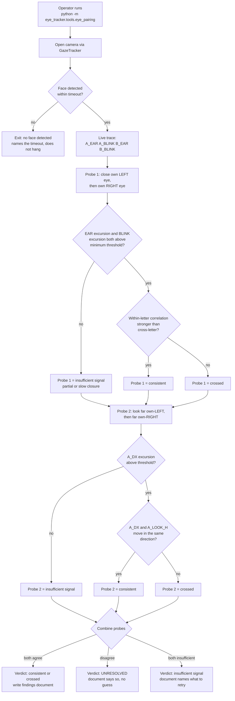

### Story 1.1: Eye-pairing investigation — do landmark and blendshape signals describe the same eye

**File**: `docs/plans/stories/epic-1-story-1.1-Eye-Pairing-Investigation.md`
**BUILDID**: CYCLE-1 | **Epic**: 1 - TEST & PACKAGING FOUNDATION | **ID**: 1.1 | **Date**: 2026-08-07 | **Jira**: LOCAL | **GitHub**: #11
**Wave**: 2
**Requires**: [1.2]
**Enables**: []
**Files Touched**:
  - eye_tracker/tools/__init__.py
  - eye_tracker/tools/eye_pairing.py
  - tests/unit/test_eye_pairing.py
  - docs/analysis/eye-pairing-investigation.md
**Roles Ref**: `docs/requirements.md#roles--permissions-matrix` — single-actor, no role variation
**QA Candidate**: Yes — **Observable:** a diagnostic tool prints live per-eye signal traces and emits a four-way verdict (`consistent` / `crossed` / `UNRESOLVED` / `insufficient signal`), and writes a findings document containing the raw traces. **Mechanism:** `python -m eye_tracker.tools.eye_pairing` opens the camera through the existing `GazeTracker` (`eye_tracker/tracker.py`) and consumes its `features_ready(object)` signal, reads `FEATURE_A_EAR`/`FEATURE_A_BLINK`/`FEATURE_B_EAR`/`FEATURE_B_BLINK` (indices 6, 30, 7, 31) plus `FEATURE_A_DX`/`FEATURE_A_LOOK_H` (0, 26) from the unmodified feature vector, correlates within-letter against cross-letter pairings over the session, and writes `docs/analysis/eye-pairing-investigation.md`. It is read-only with respect to application state — it writes one document and nothing else. **Authz & preconditions:** single actor, no permission gate; requires a working camera and the rebuilt environment from Story 1.2. **Edge/idempotency:** a partial or slow blink, or a session with too little signal excursion, must yield `insufficient signal` rather than a confident verdict; re-running produces the same verdict for the same input traces and overwrites nothing without a new timestamped section. **Regression:** this is the gate on FR-33 / success criterion 16 — its verdict decides whether `_quality_weight` in `calibration.py` is sound, so a wrong verdict silently invalidates every accuracy measurement taken afterwards. Release-blocking for the cycle.

---

#### 👤 User Reference

**Description**:

The application watches both of a person's eyes and, for each one, works out two separate things: how open the eyelid is (measured from the shape of the eye in the picture), and how much the person is blinking (reported directly by the face-tracking library as a score). It then combines those two numbers **for the same eye** to decide how much to trust what that eye is telling it. If one eye is closed or squinting, that eye's contribution is reduced and the other eye is trusted more.

That only works if the two numbers really do belong to the same eye. There is a specific reason to doubt it: the eyelid measurement for the eye the code calls "A" is taken from one side of the face, while the blink score it pairs with that measurement is the library's score for the **other** side. If they are indeed crossed, then closing one eye pulls down the trust score for *both* eyes instead of just the closed one — which destroys exactly the discrimination the feature exists to provide. The system would keep working, produce no error, and quietly be worse at the one thing this mechanism is for.

This story builds a small diagnostic tool that answers the question by observation rather than argument, and writes the answer down with the raw evidence attached. It runs two independent checks. The first asks the person to close one eye at a time and watches whether the eyelid measurement and the blink score for the same labelled eye move together. The second needs no blinking at all: the person looks far left, then far right, and the tool checks whether the two independent estimates of *where that eye is looking* agree or contradict each other.

Two checks rather than one, because either could mislead on its own — a slow or partial blink can look ambiguous, and a person who cannot wink cleanly would produce an unreadable first test. Running both means a clear answer survives one of them being inconclusive.

Nothing about the application changes. The tool is separate, and the eye-tracking application behaves exactly as before. What this story produces is a decision: either the trust mechanism is confirmed sound and accuracy work can proceed on it, or it is confirmed broken and must be fixed or removed before any accuracy number is believed.

**Acceptance Criteria** (plain-English):

- A person can run one command, follow on-screen instructions, and get a clear answer to the question "are these two signals describing the same eye?"
- The tool shows the four relevant live numbers while it runs, so the operator can see what it is basing its answer on rather than trusting a black box.
- The answer is one of **four** things: the signals agree; the signals are crossed; the two checks contradicted each other so the question is unresolved; or there was not enough clear signal to say anything. It never guesses when the evidence is weak, and it never settles a contradiction between the two checks by picking the more popular answer.
- A slow, partial or incomplete eye closure produces "not enough signal" rather than a confident wrong answer, and says which measurement fell short and by how much.
- A second, independent check is included that does not depend on blinking at all, so someone who cannot wink cleanly can still get an answer.
- The instructions name the physical eye unambiguously — the camera picture is mirrored, so "the eye on the left of the screen" would be the opposite of what the operator expects.
- The tool reads the very same numbers the application itself uses to make its decisions, rather than working them out again its own way — otherwise it would be testing a copy instead of the real thing.
- If the camera cannot be opened or no face appears, the tool gives up after a stated wait and says why. It never sits there indefinitely.
- If the operator abandons the run part-way, the camera is handed back and no half-finished findings are recorded.
- The findings are written to a document that contains the raw recorded numbers, not just the conclusion, so someone else can check the reasoning.
- Running the tool again adds a new dated entry rather than erasing the previous one — earlier evidence is never lost.
- Nothing that could identify a person is kept: no pictures, no face measurements, only the handful of individual numbers being investigated.
- If the answer is "crossed", the document states plainly which piece of the application is affected and what the consequence is, so the follow-up work is unambiguous.
- The answer-deciding logic can be tested automatically without a camera, by feeding it recorded number sequences.
- The eye-tracking application still behaves exactly as before — the tool is separate and changes nothing.

**User Flow**:

**User Journey** (single-actor — the developer or architect running the investigation; no role variation):

- **Entry**: the operator, having completed the environment rebuild, runs `python -m eye_tracker.tools.eye_pairing` from the repository root. The tool prints the procedure it is about to run and what it will ask for.
- **Load**: the tool opens the camera through the application's existing `GazeTracker` and waits for a first face detection, printing a waiting state. If no face is detected within a bounded time it exits with a clear message rather than hanging — the current application's habit of waiting indefinitely is precisely the behaviour the cycle exists to remove.
- **Render**: once a face is present, a live one-line-per-frame trace appears showing the four signals under test (`A_EAR`, `A_BLINK`, `B_EAR`, `B_BLINK`) plus a frame counter, so the operator can see the tool is reading real data and can spot a stuck or absent signal immediately.
- **Interact — probe 1 (wink)**: the tool prompts "close your **own left** eye and hold it closed", counts down, records, then repeats for the right eye. It names the physical eye rather than a screen side, because the captured frame is horizontally mirrored.
- **Interact — probe 2 (gaze direction)**: the tool prompts the operator to look far to their own left, hold, then far to their own right, hold. This probe needs no blink and cross-checks the same question through a different pair of signals.
- **Empty/error**: if either probe produces too small a signal excursion — a partial blink, an operator who cannot wink, a face that drifted out of frame — the tool reports `insufficient signal` for that probe and says which one failed and why, rather than folding weak evidence into a confident verdict.
- **Verdict**: the tool prints the verdict per probe and a combined verdict, with the correlation figures it used, then writes `docs/analysis/eye-pairing-investigation.md` containing the procedure, the raw traces, the figures and the conclusion. If the two probes disagree, that disagreement is itself the reported outcome and the document says the question is unresolved.
- **Responsive**: the trace output degrades gracefully in a narrow terminal — fixed-width columns, no reliance on colour, and no cursor addressing that would break when the output is redirected to a file.

**Flow Diagram**:



---

#### 🤖 AI Agent Reference

> Audience: the DEV agent. The implementation contract — everything needed to build this story in a fresh AI session.

**Must Read**:
- `docs/requirements.md` — **FR-33** (the requirement, including its stated procedure), success criterion 16, open item 4
- `docs/architecture/current/01-gaze-deep-dive.md` — the 38-D feature contract and the eye-pairing hypothesis as originally recorded
- `eye_tracker/gaze.py` — the feature indices and the blendshape keys, read directly; do not take them from any document
- `eye_tracker/calibration.py:197-252` — `_quality_weight` and the fusion, the sole consumer whose validity this story decides
- `eye_tracker/face_mesh.py:15-25` — the landmark constants
- `eye_tracker/tracker.py:136` — the `cv2.flip(frame, 1)` mirror
- `docs/architecture/design/03-patterns-and-standards-brownfield.md` §3 (logging), §11 (numerical guards), §12 (annotations), §16 (documentation)
- `SPEC/references/` — **0 files**, nothing to read

**Description**:

FR-33 asks whether the landmark-derived eye geometry and the blendshape-derived eye signals describe the same physical eye. The codebase gives a concrete reason to suspect they do not, and a concrete consumer whose correctness depends on the answer.

**What the code actually pairs**, read from source rather than inferred:

| Letter | Landmark group (`face_mesh.py`) | Blendshape keys (`gaze.py:152-171`) |
|---|---|---|
| **A** | outer **33**, inner **133**, top ring 159/160/161, bottom ring 144/145/153, iris ring **468**–472 | `eyeLookOutLeft`, `eyeLookInLeft`, `eyeLookUpLeft`, `eyeLookDownLeft`, `eyeBlinkLeft`, `eyeSquintLeft` |
| **B** | inner **362**, outer **263**, top ring 386/387/388, bottom ring 373/374/380, iris ring **473**–477 | `eyeLookInRight`, `eyeLookOutRight`, `eyeLookUpRight`, `eyeLookDownRight`, `eyeBlinkRight`, `eyeSquintRight` |

In MediaPipe's canonical face-mesh indexing, **33** is documented as the outer corner of the face's *right* eye and **263** as the outer corner of the *left* eye, while the blendshape name `eyeBlinkLeft` refers to the *left* eye. On that reading, letter A pairs right-eye landmarks with left-eye blendshapes — a crossing.

🔴 **Do not treat that as the answer.** It is the hypothesis, and this story exists to settle it empirically because two things could invalidate the reasoning:

1. **The frame is mirrored.** `tracker.py:136` returns `cv2.flip(frame, 1)`, so MediaPipe never sees the un-mirrored face. Both the landmark indices and the blendshape names are assigned by the detector relative to the face *as depicted in the image it was given*, so mirroring should shift both consistently and therefore **not** create a crossing on its own. That reasoning is plausible but unverified, and it is exactly the kind of plausible-but-unverified step that produces a confidently wrong conclusion.
2. **Naming convention is not guaranteed anatomical.** Whether MediaPipe's blendshape `*Left`/`*Right` suffixes are anatomical (the subject's own side) or viewer-relative is a documentation claim, not something this repository can assert.

Both are resolved by measurement, which is why FR-33 specifies a procedure rather than an argument.

**Why the answer matters, precisely** — the consumer is `calibration.py:197-203`:

```python
def _quality_weight(feat, ear_idx, blink_idx, squint_idx):
    ...
    ear_quality = np.clip((ear - 0.12) / 0.18, 0.15, 1.0)
    blink_quality = np.clip(1.0 - 1.3 * blink - 0.7 * squint, 0.15, 1.0)
    return float(ear_quality * blink_quality)
```

called at `calibration.py:235-236` as `_quality_weight(feat, FEATURE_A_EAR, FEATURE_A_BLINK, FEATURE_A_SQUINT)` and the `B` equivalent, feeding `weights = [quality_a * pose_quality, quality_b * pose_quality, sqrt(quality_a * quality_b) * pose_quality]` and then the inverse-variance fusion `w = quality / var` at line 251.

If the signals are crossed, `ear_quality * blink_quality` multiplies **two different eyes'** qualities. The consequence is specific and testable: when one eye closes, `quality_a` is depressed by the closed eye's EAR **and** `quality_b` is depressed by the same closed eye's blink score. Both eyes' weights fall together, so instead of down-weighting the closed eye and trusting the open one, the system down-weights both — losing exactly the discrimination per-eye weighting exists to provide. The `eye_a` geometric model, which reads that eye's landmark-derived `dx`/`dy`, receives a weight partly determined by the *other* eye's closure.

Note by contrast that `main.py:95-96` and `overlay.py:176` use the two EARs **symmetrically** (reject the frame if either is below 0.16), so those paths are unaffected by a crossing. The blast radius is `_quality_weight` alone — which is worth stating, because it bounds the fix.

**Two probes, not one.** FR-33 specifies the wink test. This story adds a second, independent probe because the wink test has a real failure mode: many people cannot wink one eye cleanly, and a slow or partial closure produces overlapping excursions that support no confident verdict. The second probe uses the horizontal-gaze signals instead, which are available continuously and need no blink:

- `FEATURE_A_DX` (index 0) is landmark-derived — the iris offset within eye A's own geometry.
- `FEATURE_A_LOOK_H` (index 26) is blendshape-derived — `eyeLookOutLeft − eyeLookInLeft`.

If both describe the same physical eye they must move together as the operator sweeps their gaze horizontally. If they describe different eyes they will still both move (both eyes track together in normal vision) — so this probe alone cannot detect the crossing by *presence* of correlation. What it detects is **sign disagreement**: the sign conventions in `gaze.py` are eye-specific by design (`a_look_h` is `Out − In` while `b_look_h` is `In − Out`, so that both increase for the same direction of gaze). A crossed pairing applies eye A's geometric axis against eye B's blendshape convention, inverting the expected relationship. Record the measured sign relationship; do not assume its magnitude.

⚠️ **State this limitation in the findings document**: probe 2 is a *corroborating* check whose discriminating power rests on the sign convention, not an independent proof. If the two probes disagree, the correct output is `UNRESOLVED`, not a majority vote between two checks of unequal strength.

**Acceptance Criteria** (technical):

1. `eye_tracker/tools/__init__.py` exists with a module docstring carrying its `Layer:` declaration per patterns §1/§12.
2. `eye_tracker/tools/eye_pairing.py` is runnable as `python -m eye_tracker.tools.eye_pairing` and requires **no** `PYTHONPATH` (it relies on Story 1.2's editable install and the `include = ["eye_tracker*"]` discovery glob).
3. The tool reads feature values **by named index constants imported from `eye_tracker.gaze`** — `FEATURE_A_EAR`, `FEATURE_A_BLINK`, `FEATURE_B_EAR`, `FEATURE_B_BLINK`, `FEATURE_A_DX`, `FEATURE_A_LOOK_H` — never by literal offset. Renumbering must break the import, not silently change meaning (failure criterion 6).
4. The tool consumes the **unmodified** feature vector produced by the existing pipeline. It must not reimplement `extract_gaze_features`, or it would be measuring its own copy rather than the shipped behaviour.
5. A bounded wait for the first face detection: if none arrives within a configurable timeout (default 15 s), exit non-zero with a message naming the timeout. It must not wait indefinitely.
6. A live per-frame trace prints the four wink-probe signals with a frame counter, in fixed-width columns, with **no colour dependence and no cursor addressing**, so redirecting output to a file yields a readable transcript.
7. Probe 1 prompts for each eye in turn, identifying the eye **by the operator's own physical side** ("your own left eye"), with an inline note that the preview is mirrored. Screen-relative wording is forbidden.
8. Probe 1 computes, over the recorded window, the correlation of `A_EAR` against `A_BLINK` and against `B_BLINK` (and symmetrically for `B_EAR`), and decides `consistent` when the within-letter pairing is the stronger association, `crossed` when the cross-letter pairing is.
9. 🔴 Probe 1 returns `insufficient signal` — never a verdict — when either the EAR excursion or the BLINK excursion within the recorded window falls below a stated minimum threshold. The threshold value and its units are recorded in the document.
10. Probe 2 prompts for a horizontal gaze sweep, records `FEATURE_A_DX` and `FEATURE_A_LOOK_H`, and reports the measured sign relationship, returning `insufficient signal` when the `A_DX` excursion is below its stated minimum.
11. A combined verdict is emitted with exactly four possible values: `consistent`, `crossed`, `UNRESOLVED` (the probes disagree), `insufficient signal` (neither probe produced usable data).
12. `docs/analysis/eye-pairing-investigation.md` is written containing: the procedure as executed, the environment (camera, resolution, commit SHA), the **raw recorded traces**, the correlation figures, the per-probe verdicts, the combined verdict, and the stated limitation of probe 2.
13. When the verdict is `crossed`, the document names `_quality_weight` at `eye_tracker/calibration.py:197-203` as the affected consumer, states the both-eyes-down-weighted consequence, and records that `main.py:95-96` and `overlay.py:176` are **unaffected** because they use the EARs symmetrically.
14. When the verdict is `consistent`, the document states that per-eye quality weighting is confirmed sound **for the tested configuration**, naming the camera and resolution — the fingerprint dependence is real and must not be over-claimed.
15. Re-running the tool appends a **new timestamped section** rather than overwriting a previous investigation; earlier evidence is never destroyed.
16. The verdict logic is a pure function taking recorded traces and returning a verdict, importable and testable with **no camera and no Qt**.
17. `tests/unit/test_eye_pairing.py` covers, with synthetic traces: a consistent pairing, a crossed pairing, a below-threshold excursion producing `insufficient signal`, probe disagreement producing `UNRESOLVED`, and an empty trace.
18. The test module is self-contained — it must **not** depend on `tests/conftest.py` fixtures, so this story stays parallel to Story 1.3 in wave 2 (see the dependency graph's disjoint-files contract).
19. 🔴 **No camera frame, `pts2d` array, blendshape map or full 38-element feature vector is printed, logged or persisted.** Only the six named scalar features under test appear in the trace. This is biometric data — patterns §3.
20. Logging goes through `logging`, not `print()` — `ruff`'s `T20` rule is active on new files from Story 1.2. ⚠️ Story 1.5 (`logging_setup.py`) is in the same wave and is **not** a dependency: use a module-level `logging.getLogger(__name__)` and let the operator's configuration decide the destination. The one exception is the interactive prompts and the trace itself, which are the tool's user interface and belong on `stdout` — write them with `sys.stdout.write`, and record why in a comment so the `T20` exemption is auditable.
21. All new functions carry type annotations; public functions carry a NumPy-style docstring (patterns §12).
22. `ruff check` and `ruff format --check` are clean on all files this story creates.
23. 🔴 **Zero modification to existing application source.** `git diff --stat -- main.py eye_tracker/gaze.py eye_tracker/calibration.py eye_tracker/face_mesh.py eye_tracker/tracker.py eye_tracker/overlay.py eye_tracker/one_euro.py` returns empty. The tool observes; it does not fix. Any correction is separate work, scheduled once the verdict is known.
24. The tool releases the camera and shuts down the MediaPipe graph on **every** exit path including `Ctrl-C`, so a failed run does not leave the device held — the leak class that defect #8 records.

**RBAC Enforcement**:

`No role-differentiated access — single actor.`

- **Enforcement point(s)**: none. The tool is a local command-line diagnostic with no request surface and no guarded route.
- **Denied-access contract**: N/A. Access is governed entirely by the operating-system user's ability to run the command and open the camera device; the application performs no authentication of its own.
- **Scope derivation**: **N/A — no scoped permission exists, and there is no token or session to derive scope from.** The one role, `Local User`, derives its authority from the OS account. There is no object-level authorization surface: the tool reads a camera and writes one document, both within the invoking user's own permissions. The relevant protection here is not authorization but **data minimisation** — see AC 19: the biometric payload must never leave the process.

**System responses + error cases**:

| Trigger | Response | Side-effect |
|---|---|---|
| `python -m eye_tracker.tools.eye_pairing`, camera present, operator winks cleanly both sides, sweeps gaze | Live trace, per-probe verdicts, combined verdict `consistent` or `crossed`; exit 0 | One new timestamped section appended to `docs/analysis/eye-pairing-investigation.md` |
| Re-run of the same command (idempotent repeat) | A new verdict for the new session; identical verdict if the traces are equivalent | A **second** timestamped section appended — the first is **not** overwritten (AC 15) |
| Same recorded traces replayed through the pure verdict function | Byte-identical verdict and figures | None — the verdict function is pure, which is what makes it unit-testable |
| Partial or slow eye closure — EAR excursion below threshold | Probe 1 = `insufficient signal`, naming which excursion fell short and its measured value | Document records the failed probe and the retry advice; **no verdict is guessed** |
| Operator cannot wink at all | Probe 1 = `insufficient signal`; probe 2 still runs and can carry the verdict alone | Document states the verdict rests on probe 2 only, with its stated limitation |
| Probes disagree | Combined verdict `UNRESOLVED`; exit non-zero | Document states the question is unresolved and what would settle it. **No majority vote** between checks of unequal strength |
| Both probes insufficient | Combined verdict `insufficient signal`; exit non-zero | Document records the session as inconclusive |
| No face detected within the timeout | Exit non-zero with a message naming the timeout and the likely causes (framing, lighting, camera in use) | None. **Does not hang** — the indefinite wait is the behaviour this cycle removes |
| No camera available / device busy | Exit non-zero with the device error surfaced, not swallowed | None; camera released |
| Blendshapes absent from the detection (`blendshapes` is `None`) | Exit non-zero stating the investigation is impossible without blendshapes | None. `_blendshape_score` returns `0.0` for a missing map, so proceeding would silently correlate against a **constant** and report a meaningless verdict — this check must exist |
| Face lost mid-probe | That probe's window is discarded and re-prompted, up to a bounded retry count | None; no partial window is scored |
| `Ctrl-C` at any point | Camera released, MediaPipe graph closed, partial results discarded; exit non-zero | No document written for an aborted session (AC 24) |
| Feature indices renumbered upstream | `ImportError` at module load | None — by design, the tool imports named constants (AC 3, failure criterion 6) |
| `python main.py` after the story | Application starts and behaves exactly as before | None — zero source modification is AC 23 |

**QA-observable behaviour**:

- The printed live trace contains **exactly** the six named scalar features and a frame counter — no landmark array, no blendshape map, no full feature vector. Asserted by inspecting the redirected transcript for any line longer than the fixed column layout allows.
- For a clean left-eye closure, the trace shows one letter's EAR falling **and** the tool's reported within-letter correlation for that letter exceeding its cross-letter correlation, if and only if the printed verdict is `consistent`. The verdict and the figures it cites are mutually consistent — a verdict that does not follow from its own printed numbers is a defect.
- A session with a deliberately half-closed eye yields `insufficient signal` with the measured excursion printed alongside the threshold it failed, so the operator can see *why*.
- `docs/analysis/eye-pairing-investigation.md` contains the raw traces, not only the conclusion; re-running adds a second timestamped section and the first remains byte-identical.
- The exit code distinguishes outcomes: 0 for a decided verdict, non-zero for `UNRESOLVED`, `insufficient signal`, and every error path.
- **What does NOT change**: no file under `eye_tracker/` other than the two new `tools/` files, and no behaviour of the running application. `git diff --stat` over the seven pre-existing source files is empty. The tool does not write a calibration profile, does not alter feature extraction, and does not "fix" the pairing even when it finds it crossed.

**Prerequisites**:

- **Story 1.2 complete** — the rebuilt environment and the editable install. `eye_tracker.tools` resolves only because 1.2 uses `include = ["eye_tracker*"]` discovery; verify with `python -c "import eye_tracker.tools"` once the package exists.
- A working camera, and an operator present. ⚠️ This story cannot be completed by an agent alone.
- Adequate, steady lighting — MediaPipe blendshape scores degrade in low light, and a degraded blink score is exactly the input this investigation depends on.
- **Not** a prerequisite: Story 1.3's `conftest.py` (AC 18 keeps this story's test self-contained) and Story 1.5's `logging_setup.py` (AC 20 uses a plain module logger). Both are in the same wave by design.

**Context** (read before writing):
- `eye_tracker/gaze.py` — indices 0, 6, 7, 26, 30, 31; the blendshape keys at lines 152–171; the per-eye sign conventions
- `eye_tracker/calibration.py:197-252` — `_quality_weight` and the fusion it feeds
- `eye_tracker/face_mesh.py:15-25` — landmark constants; lines 111–126 for the `mesh_result` contract keys
- `eye_tracker/tracker.py` — `GazeTracker` (class name is **GazeTracker**, not `GazeTracker`), its `features_ready = pyqtSignal(object)` contract which emits a feature vector **or `None`** when no face is visible, `start()`/`stop()`, and the `cv2.flip(frame, 1)` mirror at line 136
- `docs/architecture/current/01-gaze-deep-dive.md` — the original hypothesis and the 38-D contract

**Patterns**:
- **Internal Contract Format** `[Current — kept]` — patterns §5. Index the shared contract **by name**; a literal offset silently changes meaning across four modules.
- **Logging** `[New adoption]` — patterns §3. Module-level logger named after the module; never log frames, landmark arrays, blendshape maps or full feature vectors.
- **Numerical Guards** `[Current — kept]` — patterns §11. Correlation over a short window can divide by a near-zero standard deviation; floor it at the point of construction rather than conditionally at each use.
- **Documentation Standards** `[New adoption]` — patterns §16. A provisional threshold says it is provisional and says what would settle it — directly applicable to the excursion minimums in AC 9 and AC 10, which have no tuned prior value.
- **Actionable error messages with remediation** — patterns §2 / `03-face-mesh-deep-dive.md` Pattern 2. Every failure path names the likely cause and the next action.

**Steps**:

1. **Create the `tools` subpackage.** Confirm the packaging discovery from Story 1.2 covers it before writing anything else — if it does not, stop and fix 1.2 rather than adding a `sys.path` shim.

   ```python
   # eye_tracker/tools/__init__.py
   """Developer diagnostics that observe the pipeline without modifying it.

   Layer: infrastructure (entry points; may import core and infrastructure)
   """
   ```

   ```bash
   python -c "import eye_tracker.tools; print('discovery OK', eye_tracker.tools.__file__)"
   ```

2. **Write the pure verdict logic first, before any camera code.** It is the only part that can be tested without hardware, and writing it first stops the decision rule from being buried inside an I/O loop.

   ```python
   """Eye-pairing investigation (FR-33).

   Layer: infrastructure (entry point)

   Answers whether the landmark-derived eye geometry and the blendshape-derived
   eye signals in the 38-D contract describe the same physical eye. See
   docs/architecture/current/01-gaze-deep-dive.md for the hypothesis and
   eye_tracker/calibration.py:197 for the consumer whose validity depends on it.
   """
   from __future__ import annotations

   import logging
   from dataclasses import dataclass
   from enum import Enum

   import numpy as np

   logger = logging.getLogger("eye_pairing")

   # Provisional. No tuned prior exists — nothing has ever measured these
   # signals against each other. Settled by the excursions observed in the first
   # real sessions, recorded in docs/analysis/eye-pairing-investigation.md.
   MIN_EAR_EXCURSION = 0.05      # EAR is a dimensionless height/width ratio
   MIN_BLINK_EXCURSION = 0.25    # blendshape scores are 0..1
   MIN_DX_EXCURSION = 0.02       # iris offset normalised by eye width


   class Verdict(str, Enum):
       CONSISTENT = "consistent"
       CROSSED = "crossed"
       UNRESOLVED = "UNRESOLVED"
       INSUFFICIENT = "insufficient signal"


   @dataclass(frozen=True)
   class ProbeResult:
       verdict: Verdict
       detail: str
       figures: dict[str, float]


   def _safe_corr(x: np.ndarray, y: np.ndarray) -> float:
       """Pearson correlation with a floored denominator.

       Returns 0.0 when either series is effectively constant, rather than
       propagating a divide-by-zero NaN into the decision rule (patterns §11).
       """
       x = np.asarray(x, dtype=np.float64)
       y = np.asarray(y, dtype=np.float64)
       if x.size < 3 or y.size < 3:
           return 0.0
       xc, yc = x - x.mean(), y - y.mean()
       denom = float(np.linalg.norm(xc) * np.linalg.norm(yc)) + 1e-12
       return float(np.dot(xc, yc) / denom)


   def evaluate_wink_probe(
       a_ear: np.ndarray,
       a_blink: np.ndarray,
       b_ear: np.ndarray,
       b_blink: np.ndarray,
   ) -> ProbeResult:
       """Decide the pairing from a wink window.

       A closing eye lowers its EAR and raises its blink score, so within a
       correctly paired letter EAR and BLINK are ANTI-correlated. The pairing is
       `consistent` when the within-letter anti-correlation is stronger than the
       cross-letter one.

       Parameters
       ----------
       a_ear, a_blink, b_ear, b_blink : np.ndarray
           Per-frame traces of features 6, 30, 7 and 31 over one wink window.

       Returns
       -------
       ProbeResult
           `INSUFFICIENT` when either excursion is below its provisional
           threshold; otherwise `CONSISTENT` or `CROSSED`.
       """
       ear_exc = max(float(np.ptp(a_ear)), float(np.ptp(b_ear)))
       blink_exc = max(float(np.ptp(a_blink)), float(np.ptp(b_blink)))
       if ear_exc < MIN_EAR_EXCURSION or blink_exc < MIN_BLINK_EXCURSION:
           return ProbeResult(
               Verdict.INSUFFICIENT,
               f"EAR excursion {ear_exc:.4f} (min {MIN_EAR_EXCURSION}); "
               f"blink excursion {blink_exc:.4f} (min {MIN_BLINK_EXCURSION}). "
               "Hold the eye fully closed for the whole countdown and retry.",
               {"ear_excursion": ear_exc, "blink_excursion": blink_exc},
           )
       within = abs(_safe_corr(a_ear, a_blink)) + abs(_safe_corr(b_ear, b_blink))
       cross = abs(_safe_corr(a_ear, b_blink)) + abs(_safe_corr(b_ear, a_blink))
       figures = {"within_letter": within, "cross_letter": cross,
                  "ear_excursion": ear_exc, "blink_excursion": blink_exc}
       if within >= cross:
           return ProbeResult(Verdict.CONSISTENT, "within-letter association is stronger", figures)
       return ProbeResult(Verdict.CROSSED, "cross-letter association is stronger", figures)
   ```

3. **Write the gaze-sweep probe and the combiner.** The combiner must not vote — probe 2 is corroborating, not equal in strength.

   ```python
   def evaluate_gaze_probe(a_dx: np.ndarray, a_look_h: np.ndarray) -> ProbeResult:
       """Corroborate the pairing from a horizontal gaze sweep.

       Both signals move for either eye, so presence of correlation proves
       nothing. What discriminates is SIGN: gaze.py applies eye-specific
       conventions (`a_look_h` is Out-In, `b_look_h` is In-Out) so that both rise
       for the same gaze direction. A crossed pairing applies letter A's
       geometric axis against letter B's convention, inverting the relationship.
       """
       exc = float(np.ptp(a_dx))
       if exc < MIN_DX_EXCURSION:
           return ProbeResult(
               Verdict.INSUFFICIENT,
               f"A_DX excursion {exc:.4f} (min {MIN_DX_EXCURSION}). "
               "Sweep further to each side and retry.",
               {"dx_excursion": exc},
           )
       corr = _safe_corr(a_dx, a_look_h)
       figures = {"dx_look_h_corr": corr, "dx_excursion": exc}
       if corr >= 0.0:
           return ProbeResult(Verdict.CONSISTENT, f"same-sign relationship ({corr:+.3f})", figures)
       return ProbeResult(Verdict.CROSSED, f"opposite-sign relationship ({corr:+.3f})", figures)


   def combine(wink: ProbeResult, gaze: ProbeResult) -> Verdict:
       """Combine the two probes without voting.

       The wink probe is the requirement's specified test and the stronger
       evidence; the gaze probe corroborates. Disagreement is reported as
       UNRESOLVED rather than resolved by majority, because a majority between
       checks of unequal strength is not evidence.
       """
       decided = {Verdict.CONSISTENT, Verdict.CROSSED}
       if wink.verdict in decided and gaze.verdict in decided:
           return wink.verdict if wink.verdict == gaze.verdict else Verdict.UNRESOLVED
       if wink.verdict in decided:
           return wink.verdict
       if gaze.verdict in decided:
           return gaze.verdict
       return Verdict.INSUFFICIENT
   ```

4. **Add the acquisition loop.** Open the camera through the existing `GazeTracker` so the tool measures the shipped pipeline. Connect to `features_ready`, and note the contract emits **`None`** when no face is visible — treat `None` as "face lost", not as a zero-valued frame. Guard the blendshape precondition **before** recording anything — `_blendshape_score` returns `0.0` for a missing map, so without this check the tool would correlate against a constant and print a meaningless verdict.

   Requirements for the loop, each traceable to an AC: bounded first-face wait (AC 5); fixed-width `sys.stdout.write` trace of exactly the six named features (AC 6, AC 19); own-physical-side prompts with the mirror note (AC 7); per-probe windows discarded and re-prompted if the face is lost (response table); camera and graph released on every exit path including `KeyboardInterrupt` (AC 24).

5. **Write the findings document.** Append a timestamped section; never overwrite. Include the procedure as executed, the environment (camera, capture resolution, `git rev-parse HEAD`, dirty-worktree flag), the **raw traces**, the figures, both per-probe verdicts, the combined verdict, and — verbatim — the recorded limitation of probe 2. When the verdict is `crossed`, include the affected-consumer statement from AC 13; when `consistent`, the configuration-scoped wording from AC 14.

6. **Write the tests** (see below), then run the full gate:

   ```bash
   ruff check eye_tracker/tools tests/unit/test_eye_pairing.py
   ruff format --check eye_tracker/tools tests/unit/test_eye_pairing.py
   pytest tests/unit/test_eye_pairing.py -v
   git diff --stat -- main.py eye_tracker/gaze.py eye_tracker/calibration.py \
       eye_tracker/face_mesh.py eye_tracker/tracker.py eye_tracker/overlay.py \
       eye_tracker/one_euro.py    # MUST be empty
   ```

7. **Run the investigation with a person and a camera, and record the outcome.** Then raise the follow-up: if `crossed`, this is the input to requirements open item 4 and the requirements owner decides whether per-eye weighting is corrected or removed — that decision belongs to CYCLE-2's scope, not to this story.

**Tests**:

```python
# tests/unit/test_eye_pairing.py
"""Verdict-logic tests for the eye-pairing investigation.

Layer: test

Self-contained by design: uses no tests/conftest.py fixture, so this story
stays parallel to Story 1.3 within wave 2 (dependency graph, disjoint-files
contract). No camera and no Qt are involved.
"""
import numpy as np

from eye_tracker.tools.eye_pairing import (
    MIN_BLINK_EXCURSION,
    Verdict,
    combine,
    evaluate_gaze_probe,
    evaluate_wink_probe,
)


def _closing_eye(n: int = 60) -> tuple[np.ndarray, np.ndarray]:
    """EAR falling from open to shut while the blink score rises to 1."""
    ear = np.linspace(0.30, 0.05, n)
    blink = np.linspace(0.0, 1.0, n)
    return ear, blink


def _steady_open_eye(n: int = 60) -> tuple[np.ndarray, np.ndarray]:
    ear = np.full(n, 0.30) + np.random.default_rng(0).normal(0, 0.001, n)
    blink = np.full(n, 0.02)
    return ear, blink


def test_correctly_paired_signals_are_reported_consistent():
    """Letter A closing: A's own EAR and BLINK must be the stronger association."""
    a_ear, a_blink = _closing_eye()
    b_ear, b_blink = _steady_open_eye()
    result = evaluate_wink_probe(a_ear, a_blink, b_ear, b_blink)
    assert result.verdict is Verdict.CONSISTENT
    assert result.figures["within_letter"] >= result.figures["cross_letter"]


def test_crossed_signals_are_reported_crossed():
    """A's EAR falls while B's BLINK rises — the failure mode FR-33 exists to catch."""
    a_ear, _ = _closing_eye()
    _, b_blink = _closing_eye()
    b_ear, a_blink = _steady_open_eye()
    result = evaluate_wink_probe(a_ear, a_blink, b_ear, b_blink)
    assert result.verdict is Verdict.CROSSED


def test_partial_closure_yields_insufficient_signal_not_a_guess():
    """A half-blink must not produce a confident verdict."""
    a_ear = np.linspace(0.30, 0.28, 60)
    a_blink = np.linspace(0.0, 0.05, 60)
    b_ear, b_blink = _steady_open_eye()
    result = evaluate_wink_probe(a_ear, a_blink, b_ear, b_blink)
    assert result.verdict is Verdict.INSUFFICIENT
    assert str(MIN_BLINK_EXCURSION) in result.detail   # the threshold is reported


def test_empty_trace_yields_insufficient_signal():
    empty = np.array([], dtype=np.float64)
    result = evaluate_wink_probe(empty, empty, empty, empty)
    assert result.verdict is Verdict.INSUFFICIENT


def test_gaze_probe_reports_sign_relationship():
    dx = np.linspace(-0.05, 0.05, 60)
    assert evaluate_gaze_probe(dx, dx * 2.0).verdict is Verdict.CONSISTENT
    assert evaluate_gaze_probe(dx, -dx * 2.0).verdict is Verdict.CROSSED


def test_flat_gaze_sweep_yields_insufficient_signal():
    dx = np.full(60, 0.01)
    assert evaluate_gaze_probe(dx, dx).verdict is Verdict.INSUFFICIENT


def test_disagreeing_probes_are_unresolved_not_a_majority_vote():
    """Two checks of unequal strength must not be resolved by voting."""
    a_ear, a_blink = _closing_eye()
    b_ear, b_blink = _steady_open_eye()
    wink = evaluate_wink_probe(a_ear, a_blink, b_ear, b_blink)   # CONSISTENT
    dx = np.linspace(-0.05, 0.05, 60)
    gaze = evaluate_gaze_probe(dx, -dx)                          # CROSSED
    assert combine(wink, gaze) is Verdict.UNRESOLVED


def test_single_usable_probe_carries_the_verdict():
    a_ear, a_blink = _closing_eye()
    b_ear, b_blink = _steady_open_eye()
    wink = evaluate_wink_probe(a_ear, a_blink, b_ear, b_blink)
    flat = evaluate_gaze_probe(np.full(60, 0.01), np.full(60, 0.01))
    assert combine(wink, flat) is Verdict.CONSISTENT


def test_both_probes_insufficient_is_insufficient():
    empty = np.array([], dtype=np.float64)
    wink = evaluate_wink_probe(empty, empty, empty, empty)
    flat = evaluate_gaze_probe(np.full(60, 0.01), np.full(60, 0.01))
    assert combine(wink, flat) is Verdict.INSUFFICIENT


def test_feature_indices_are_imported_by_name_not_literal():
    """Failure criterion 6: renumbering must break the import, not change meaning."""
    import eye_tracker.tools.eye_pairing as mod
    source = __import__("inspect").getsource(mod)
    assert "FEATURE_A_EAR" in source
    assert "feat[6]" not in source and "feat[30]" not in source
```

Manual test cases (require a camera and an operator; each recorded in the findings document):

| # | Scenario | Expected |
|---|---|---|
| 1 | Clean closure of the operator's own left eye, held for the full countdown | A decided per-probe verdict; the printed figures support the printed verdict |
| 2 | Clean closure of the right eye | Same, and consistent with case 1 |
| 3 | Deliberate half-blink | `insufficient signal`, with the measured excursion **and** the threshold both printed |
| 4 | Operator does not blink at all during probe 1 | Probe 1 `insufficient signal`; probe 2 still runs and can carry the verdict |
| 5 | Full horizontal gaze sweep | A sign relationship reported with its correlation figure |
| 6 | Barely moving the eyes during probe 2 | `insufficient signal` |
| 7 | Camera covered before the first detection | Non-zero exit naming the timeout; **no hang** |
| 8 | `Ctrl-C` mid-probe | Camera released, no document written; verify with a second run that the device is free |
| 9 | Run twice | Two timestamped sections; the first byte-identical to before |
| 10 | Redirect stdout to a file | Readable fixed-width transcript, no escape sequences |
| 11 | `python main.py` afterwards | Application behaves exactly as before |
| 12 | Inspect the transcript | Only the six named scalars appear — no landmark arrays, no blendshape maps, no 38-element vectors |

**Quality**: `ruff check` and `ruff format --check` clean on new files · all new functions annotated, public ones with NumPy docstrings · functions ≤30 lines · no `TODO`/`FIXME` · provisional thresholds marked provisional with what would settle them · zero modification to existing application source.

**OUT**:
- ❌ **Fixing the pairing, even if it is found crossed.** This story observes and records. The correction — swap the blendshape keys, or remove per-eye weighting — is a behaviour change to `gaze.py` and/or `calibration.py`, both outside this story's `files_touched`, and `gaze.py` is a `shared_files` entry first modified in CYCLE-2. The requirements owner decides which (open item 4).
- ❌ Changing `_quality_weight` or the fusion weights.
- ❌ Removing the `cv2.flip(frame, 1)` mirror — it is deliberate selfie-view behaviour, not a defect, and removing it would change what the user sees.
- ❌ Evaluating MediaPipe's `facial_transformation_matrix` as a pose source — DR-1 defers that as a separate measured experiment.
- ❌ Any accuracy measurement — Epic 2.
- ❌ Depending on `tests/conftest.py` or `logging_setup.py` — both are same-wave siblings (AC 18, AC 20).
- ❌ Reimplementing `extract_gaze_features` (AC 4) — the tool must measure the shipped pipeline, not a copy.
- ❌ Deciding whether the redundant/collinear feature dimensions should be removed — explicitly OUT of the cycle's scope.

**Evidence**:
- `pytest tests/unit/test_eye_pairing.py -v` output showing all 10 tests passing.
- `ruff check` and `ruff format --check` output on the new files.
- The redirected stdout transcript of a full real session, showing the live trace, both probes, the figures and the combined verdict.
- `docs/analysis/eye-pairing-investigation.md` with the raw traces included.
- Output of the `git diff --stat` command over the seven pre-existing source files, showing empty.
- A transcript of manual cases 3, 7 and 8 specifically — the insufficient-signal path, the no-hang timeout, and the camera released after `Ctrl-C`. These are the three most likely to be skipped and the three that matter most for trusting the tool.
- 🔴 An explicit written statement of the verdict and, if `crossed`, the follow-up raised against requirements open item 4.
