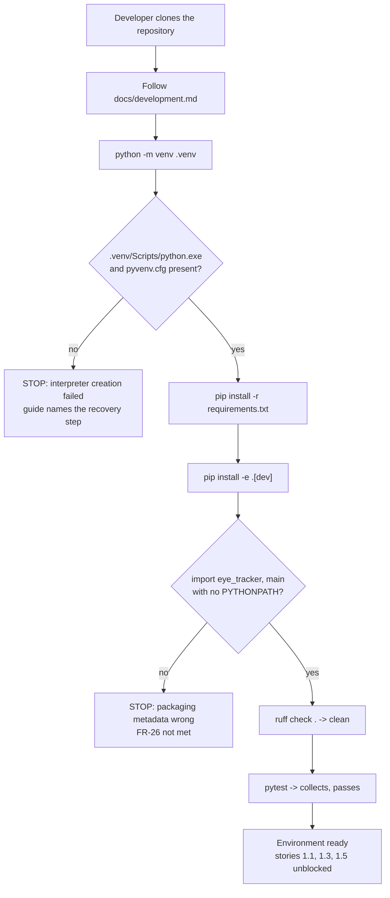

### Story 1.2: Packaging metadata, tool configuration and a rebuilt development environment

**File**: `docs/plans/stories/epic-1-story-1.2-Packaging-And-Environment.md`
**BUILDID**: CYCLE-1 | **Epic**: 1 - TEST & PACKAGING FOUNDATION | **ID**: 1.2 | **Date**: 2026-08-07 | **Jira**: LOCAL | **GitHub**: #10
**Wave**: 1
**Requires**: []
**Enables**: [1.1, 1.3, 1.5]
**Files Touched**:
  - pyproject.toml
  - requirements.txt
  - docs/development.md
**Roles Ref**: `docs/requirements.md#roles--permissions-matrix` — single-actor, no role variation
**QA Candidate**: No — pure tooling and environment configuration. No application behaviour changes and nothing is user-observable. The toolchain itself is verified by QA in Epic 1 Group 1.

---

#### 👤 User Reference

**Description**:

Right now nobody can run a test on this project, because the folder that is supposed to hold its private copy of Python is broken — it has no Python program inside it and none of the configuration that would let it start. On top of that, the project has never had the small metadata file that tells Python tooling "this is a package, here is where its code lives." Without that file, a test sitting in a `tests` folder cannot see the application's code at all unless every developer manually sets an environment variable first, which is fragile and silently different on each machine.

This story fixes both problems and, while it is there, writes down the settings for the three tools the project has agreed to use: the code checker, the test runner and the coverage measurer. It also writes a short setup guide so the next person — or the same person on a new laptop — can get from a fresh copy of the code to a working environment by following steps rather than guessing.

Nothing a user of the eye-tracking application would notice changes. The application behaves exactly as it did before. What changes is that from this point on, work on the project can actually be checked automatically instead of only by eye. Every other piece of work in this cycle waits on this one.

One notable judgement call is recorded here rather than hidden: the code checker currently finds 30 pre-existing complaints in code this story deliberately does not touch. Rather than either ignoring the checker or rewriting old code in a cycle that promises to change no behaviour, each of those 30 is switched off individually with a written note saying which future piece of work turns it back on. That keeps the checker useful — it will still catch anything *new* — instead of leaving it permanently red, which is how teams learn to ignore a warning light.

**Acceptance Criteria** (plain-English):

- A developer can copy the project to a clean machine, follow the written setup guide, and end up with a working environment — including a Python program that actually starts.
- Tests can find and use the application's code without anyone setting an environment variable first.
- The main start-up file is included in what gets measured, not just the folder of supporting code — the coverage target named in the requirements covers both, so both have to be reachable.
- The tools a developer needs (checker, test runner, coverage measurer) are listed as an optional add-on that a developer installs deliberately, with version limits in the same style the project already uses, so installing the application for normal use does not drag developer tooling along with it.
- The existing list of libraries the application needs at run time keeps its versions and its written explanations exactly as they are — this story does not quietly re-decide them, and there is only one place those versions are stated.
- The code checker runs and reports success, and it will complain if new code breaks the agreed style.
- The test runner and coverage measurer are configured and produce output.
- Coverage is measured and reported but **not yet enforced as a pass/fail threshold** — there is almost nothing to measure at this point, and a threshold that fails on the first day is one people learn to switch off. The written configuration says which later piece of work turns enforcement on.
- The setup guide is good enough that someone who has never seen the project can follow it; if it only works on a machine that was already working, it is not finished.
- The eye-tracking application still starts and behaves exactly as before — no feature changes, no visible difference.
- The private Python folder is not added to version control.
- Every switched-off checker complaint has a written reason and names the future work that turns it back on. None is switched off silently.

**User Flow**:

`Actor: system — no role variation.`

**Flow Diagram**:



---

#### 🤖 AI Agent Reference

> Audience: the DEV agent. The implementation contract — everything needed to build this story in a fresh AI session.

**Must Read**:
- `docs/architecture/design/03-patterns-and-standards-brownfield.md` §1 (project structure), §13 (lint & format tooling), §14 (function & file length), §15 (testing patterns) — the authoritative tool configuration
- `docs/architecture/design/02-target-architecture-brownfield.md` — DR-5 (`main.py` becomes a shim), DR-17 (pytest + pytest-cov + pytest-qt)
- `docs/requirements.md` — FR-26, FR-27, technical constraints, open item 6
- `SPEC/references/` — **0 files**, nothing to read

**Description**:

Two blockers and one gap are resolved together because they are one unit of "the project can be checked automatically".

**Blocker 1 — the virtual environment has no interpreter.** `.venv/Scripts/` exists and contains dependency console-scripts (`f2py.exe`, `pyuic6.exe`, `numpy-config.exe`, `pip3.14.exe`, …) but **no `python.exe`**, and `.venv/pyvenv.cfg` is absent. Without `pyvenv.cfg` the directory is not a virtual environment at all — Python's site machinery uses that file to locate the base installation and set `sys.prefix`. The libraries are present under `.venv/Lib/site-packages`, which is why the deep-dive verification could reach them via `PYTHONPATH` against the system interpreter, but no test runner can be invoked from the venv. This is requirements open item 6 and it blocks every story in every cycle.

**Blocker 2 — no packaging metadata.** There is no `pyproject.toml`. `eye_tracker/` is an implicit package that happens to be importable when the current working directory is the repository root. A test module under `tests/` therefore cannot import it without either a `sys.path` hack in `conftest.py` — the exact fragility FR-26 exists to remove — or a `PYTHONPATH` set per machine. FR-27 additionally requires coverage over **`main.py`**, which is a root-level module, not part of the package; it must be declared so it is importable and measurable.

**Gap — no tool configuration.** The patterns document mandates ruff for lint and format, pytest with pytest-cov and pytest-qt, and a ≥85% coverage gate. None of that exists on disk. This story lands the configuration; the coverage *threshold* is deliberately **not** enforced yet (see Step 4) because at this point only scaffolding exists and a failing gate on day one is a gate nobody trusts.

**A measured finding that changes the configuration** — see Step 3. Running the patterns document's exact `select` list against the existing 1,295 lines produces **30 findings across 10 rules**, and separately, **`PLR0915` produces 0 findings at ruff's default `max-statements = 50`**, which means the patterns document's two `PLR0915` per-file-ignores are inert as written. Both facts are handled explicitly rather than discovered by the next developer.

**Acceptance Criteria** (technical):

1. `pyproject.toml` exists at the repository root with a `[build-system]` table using `setuptools>=77` and `wheel`.
2. `[project]` declares `name = "eye-tracker"`, a version, `requires-python = ">=3.14"`, and `dependencies` mirroring `requirements.txt`'s bounded pins exactly (same floors, same ceilings).
3. `[project.optional-dependencies]` defines a `dev` extra containing `pytest`, `pytest-cov`, `pytest-qt`, `ruff` — each with a bounded pin in the style already used by `requirements.txt` (explicit floor, major ceiling).
4. `[tool.setuptools]` declares `py-modules = ["main"]` so `main.py` is importable and measurable per FR-27, and `[tool.setuptools.packages.find]` uses `include = ["eye_tracker*"]` — **discovery, not an explicit list**, so the `eye_tracker.tools` (Story 1.1) and `eye_tracker.evaluation` (Story 2.1) subpackages install without either story editing this file.
4a. `python -c "import eye_tracker.tools, eye_tracker.evaluation"` is **expected to fail** at the end of this story (those packages do not exist yet) but must succeed once Stories 1.1 and 2.1 land, **with no further change to `pyproject.toml`**. Record this as the check that proves discovery works rather than an explicit list.
5. `pip install -e ".[dev]"` completes successfully in a freshly created `.venv/`.
6. `python -c "import eye_tracker, main"` succeeds **from a directory other than the repository root**, with `PYTHONPATH` unset. This is the operative proof of FR-26 — running it from the root proves nothing, because the root is on `sys.path` implicitly.
7. **No test file and no `conftest.py` contains any `sys.path` manipulation.** Asserted by grep as part of the evidence.
8. `[tool.ruff]` sets `line-length = 100` and `target-version = "py314"` exactly as patterns §13 specifies.
9. `[tool.ruff.lint]` `select` is exactly `["E","F","W","I","B","UP","SIM","RET","PTH","NPY","T20","PLR0915","RUF"]` — the patterns §13 list, unmodified.
10. `[tool.ruff.lint.pylint]` sets `max-statements = 30` so `PLR0915` actually approximates the §14 length rule. At the default of 50 it fires on nothing and the rule is unenforced.
11. `[tool.ruff.lint.per-file-ignores]` contains one entry per pre-existing finding class, **each with an inline comment stating the reason and naming the story or cycle that removes it.** No finding is silenced without an owner.
12. `ruff check .` exits **0**.
13. `ruff format --check` exits **0** for the paths it is configured to cover (see Step 5 — legacy files are excluded, with the deferral recorded).
14. `[tool.pytest.ini_options]` sets `testpaths = ["tests"]`, `qt_api = "pyqt6"` (required by pytest-qt per DR-17), and `addopts` enabling coverage over `eye_tracker` and `main` with `term-missing`.
15. `--cov-fail-under` is **absent**, with an inline comment naming Story 2.x / CYCLE-5 as where the ≥85% threshold is switched on.
16. `[tool.coverage.run]` omits `tests/*`; `[tool.coverage.report]` shows missing lines.
17. `.venv/` contains `Scripts/python.exe` **and** `pyvenv.cfg`, and `python -c "import cv2, mediapipe, numpy, sklearn, PyQt6; print('ok')"` succeeds from within it.
18. `docs/development.md` documents the rebuild end-to-end: prerequisites, exact commands for Windows and POSIX, the verification commands, and what to do when the interpreter fails to create.
19. **The rebuild guide is verified by executing it**, not by reading it — delete or rename `.venv/`, follow the document verbatim, and confirm a working environment results. Paste the transcript as evidence.
20. 🔴 **Zero application source modification.** `main.py` and every file under `eye_tracker/` are byte-identical to their pre-story state, asserted with `git diff --stat -- main.py eye_tracker/` returning empty.
21. `.venv/` is not staged and remains covered by `.gitignore`.
22. `requirements.txt` keeps its runtime pins and explanatory comments unchanged; dev tooling goes in the `dev` extra, **not** into `requirements.txt`.

**RBAC Enforcement**:

`No role-differentiated access — single actor.`

- **Enforcement point(s)**: none — this story adds no runtime code path, no route and no guard.
- **Denied-access contract**: N/A. There is no request surface.
- **Scope derivation**: **N/A — no scoped permission exists, and there is no token or session to derive scope from.** The Roles & Permissions Matrix has one role (`Local User`) whose authority is the operating-system user account; the application performs no authentication of its own. Stating a scope-derivation rule here would describe a mechanism that does not exist.

**System responses + error cases**:

The triggers here are developer commands rather than requests. `Response` is the observable console outcome; `Side-effect` is what changes on disk.

| Trigger | Response | Side-effect |
|---|---|---|
| `python -m venv .venv` on a clean checkout | Creates `Scripts/python.exe` + `pyvenv.cfg`; exit 0 | New interpreter tree under `.venv/` |
| `python -m venv .venv` over the **current broken** `.venv/` | May exit 0 while leaving the tree inconsistent — the pre-existing `Scripts/` content is not cleaned | ⚠️ Unreliable. The guide must instruct **removing or renaming** `.venv/` first; the story's evidence must show a from-scratch creation |
| `pip install -r requirements.txt` | Resolves all 6 runtime pins; exit 0 | Populates `site-packages` |
| `pip install -e ".[dev]"` | Builds and links the project; exit 0 | `.pth`/`__editable__` entry making `eye_tracker` and `main` importable |
| `pip install -e ".[dev]"` a **second** time (idempotent-repeat) | Exit 0; already-satisfied requirements reported as such and the editable link rebuilt in place | None beyond a refreshed `__editable__` entry. ⚠️ The whole setup sequence must be **safely repeatable** — a developer who re-runs the guide after a partial failure must not need to reason about which steps already ran |
| `import eye_tracker, main` from a non-root cwd, `PYTHONPATH` unset | Both import; exit 0 | None — **this is the FR-26 acceptance probe** |
| Same import **before** the editable install | `ModuleNotFoundError: No module named 'eye_tracker'` | None. Confirms the metadata is what makes it work, not an accident of cwd |
| `ruff check .` | Exit **0** — the 30 legacy findings are each covered by an owned `per-file-ignores` entry | None |
| `ruff check .` after a developer adds a **new** `print()` | Exit 1, reporting `T201` at the new site | None. The gate's purpose in this cycle: block new violations, not retro-fix old ones |
| `pytest` with no tests yet present | Exit **5** (`NO_TESTS_COLLECTED`) — **not** 0 | None. Expected until Story 1.3 lands the smoke test; the guide must say so, or it reads as a failure |
| `pytest` after Story 1.3 | Exit 0, coverage summary printed | `.coverage` data file (gitignored) |
| `python -m venv` where the base interpreter is < 3.14 | `pip install` fails resolving `numpy>=2.3` (no 1.x wheel exists for 3.14; the floor exists for that reason) | None. `requires-python` makes the cause explicit rather than a wheel-resolution puzzle |
| `python main.py` after the story | Application starts and behaves exactly as before | None — **zero behavioural change is an acceptance criterion, not a hope** |

**Prerequisites**:

- A base CPython **3.14.x** installation on `PATH` (3.14.6 is the verified version; `python --version` before starting).
- Network access for `pip` — MediaPipe and PyQt6 wheels are large.
- Nothing else. This is the wave-1 seed story; it requires no other story.
- ⚠️ Note the ordering trap: `.venv/` must be **removed or renamed**, not created over. See the second row of the response table.

**Context** (read before writing):
- `requirements.txt` — the runtime pins and the comments explaining each ceiling; mirror them, do not re-derive them
- `.gitignore` — confirm `.venv/` is already covered (it is; the comment records the previously-tracked 752 MB macOS venv)
- `eye_tracker/__init__.py` — currently **0 bytes**; a module docstring with its `Layer:` declaration is added by patterns §1/§12 when the package is next touched, **not** here (this story must not modify application source)
- `docs/architecture/design/03-patterns-and-standards-brownfield.md` §13, §14

**Patterns**:
- **Lint & Format Tooling** `[New adoption]` — patterns §13. `line-length = 100` was chosen by measurement: 3 lines need touching at 100 versus 13 at 88, and the longest existing line is 108.
- **Function & File Length** `[New adoption]` — patterns §14. Enforced with an **auditable allowlist**: every exemption states its reason.
- **Documentation Standards** `[New adoption]` — patterns §16. A provisional or temporary value says so, and says what would settle or remove it. This is why every `per-file-ignores` entry names its removal owner.
- **Bounded dependency declarations** — the existing `requirements.txt` convention (explicit floor, major ceiling, reason in a comment). The `dev` extra follows it.

**Steps**:

1. **Verify the base interpreter, then rebuild the environment from scratch.** Do not create over the existing tree — it has stale console scripts and no `pyvenv.cfg`, and `venv` will not clean them.

   ```bash
   python --version                 # expect 3.14.x — record the exact value as evidence
   mv .venv .venv.broken            # rename, do not delete, until the new one is proven
   python -m venv .venv
   ls .venv/Scripts/python.exe .venv/pyvenv.cfg    # both MUST exist; if not, stop here
   ```

   On POSIX the paths are `.venv/bin/python` and `.venv/pyvenv.cfg`. Activate, then confirm the interpreter is the venv's own:

   ```bash
   source .venv/Scripts/activate    # POSIX: source .venv/bin/activate
   python -c "import sys; print(sys.prefix); print(sys.version)"
   ```

   `sys.prefix` must point inside `.venv`. If it points at the system installation, activation did not take effect and every later step would silently install to the wrong place.

2. **Write `pyproject.toml`.** Mirror `requirements.txt`'s pins exactly — same floors, same ceilings — so there is one dependency truth rather than two that can drift.

   ```toml
   [build-system]
   requires = ["setuptools>=77", "wheel"]
   build-backend = "setuptools.build_meta"

   [project]
   name = "eye-tracker"
   version = "0.1.0"
   description = "Webcam gaze estimation for hands-free input"
   readme = "README.md"
   # 3.14 is the only interpreter this codebase has been verified against
   # (deep-dive, 25 executed checks). numpy's >=2.3 floor exists because no
   # numpy 1.x wheel is published for CPython 3.14. Widening this floor is a
   # validation exercise, not an edit — it depends on requirements open item 2
   # (target deployment hardware).
   requires-python = ">=3.14"

   # Mirrors requirements.txt. Ceilings are deliberate: the codebase has not
   # been validated against opencv 5.x or mediapipe 1.x. opencv-contrib-python
   # is pinned to keep its major aligned with opencv-python — both ship the
   # same `cv2` package and mismatched majors collide.
   dependencies = [
     "opencv-python>=4.8,<5",
     "opencv-contrib-python>=4.8,<5",
     "mediapipe>=0.10.30,<1.0",
     "numpy>=2.3,<3",
     "scikit-learn>=1.3,<2",
     "PyQt6>=6.5,<7",
   ]

   [project.optional-dependencies]
   dev = [
     "pytest>=8.0,<9",
     "pytest-cov>=5.0,<8",
     "pytest-qt>=4.4,<5",
     "ruff>=0.14,<1",
   ]

   [tool.setuptools]
   # `main` is declared as a top-level module, not just a script: FR-27 requires
   # coverage over main.py, which is only measurable if it is importable.
   py-modules = ["main"]

   [tool.setuptools.packages.find]
   # Discovery, NOT an explicit list. `packages = ["eye_tracker"]` would exclude
   # subpackages, so eye_tracker.tools (Story 1.1) and eye_tracker.evaluation
   # (Story 2.1) would silently fail to install — and each of those stories would
   # have to edit this file, turning pyproject.toml into a cross-story merge point
   # the dependency graph is designed to avoid. The glob covers them in advance.
   include = ["eye_tracker*"]
   ```

3. **Add the ruff configuration, with the per-file-ignores derived from measurement rather than assumption.**

   Running the patterns §13 `select` list against the current source produces **30 findings across 10 rules**: `T201`×10, `F401`×5, `E501`×3, `E702`×3, `I001`×3, `SIM105`×2, `B905`×1, `RUF046`×1, `SIM108`×1, `SIM117`×1.

   🔴 **Two decisions are forced here, and both are recorded rather than left implicit.**

   **(a) `PLR0915` is inert at its default.** At ruff's default `max-statements = 50` it reports **0 findings** on the entire codebase — so the patterns document's `PLR0915` per-file-ignores for `gaze.py` and `overlay.py` currently exempt nothing. The cause is a category difference: `PLR0915` counts **statements**, while patterns §14 states a **line** limit. `extract_gaze_features` is 95 lines but mostly one 38-element array literal, so its statement count is low. Setting `max-statements = 30` makes the rule bite: exactly **1** function trips it — `CalibrationWindow.__init__` at `eye_tracker/overlay.py:86` (31 > 30), which is precisely the case patterns §14 already allowlists as "Qt widget `__init__`: flat window-flag setup". The `gaze.py` entry is therefore **dropped as inert**; keeping an ignore that exempts nothing is the silent exemption §14 forbids.

   **(b) Legacy findings are silenced with named owners, not fixed here.** Fixing them would mean editing `gaze.py`, `tracker.py`, `overlay.py`, `calibration.py`, `face_mesh.py` and `main.py` — none of which are in this story's `files_touched`, and `gaze.py` is a `shared_files` entry first modified in CYCLE-2. Editing it here is exactly the cross-story merge hazard the dependency graph exists to prevent. The alternative — leaving the gate red — trains everyone to ignore it. So each finding class is switched off with its reason and its removal owner.

   ```toml
   [tool.ruff]
   line-length = 100          # measured: 3 lines need touching at 100 vs 13 at 88 (longest is 108)
   target-version = "py314"

   [tool.ruff.lint]
   select = ["E", "F", "W", "I", "B", "UP", "SIM", "RET", "PTH", "NPY", "T20", "PLR0915", "RUF"]

   [tool.ruff.lint.pylint]
   # Default is 50, at which PLR0915 fires on nothing here and patterns §14 goes
   # unenforced. At 30 exactly one function trips it (overlay.py:86), which is
   # the case §14 already allowlists.
   max-statements = 30

   [tool.ruff.lint.per-file-ignores]
   # ---------------------------------------------------------------------------
   # Pre-existing findings in code this cycle deliberately does NOT modify (M0's
   # contract is "revert; nothing behavioural changed"). Every entry names the
   # work that removes it. The gate's job in CYCLE-1 is to block NEW violations.
   # ---------------------------------------------------------------------------
   "main.py" = [
     "T201",   # 2 print sites (56, 116). Removed: CYCLE-4 (FR-25 call-site migration)
     "E501",   # 2 long lines (76: 108 chars, 82: 102). Removed: CYCLE-3 when main.py becomes a shim (DR-5)
     "I001",   # unsorted imports. Removed: CYCLE-3 (DR-5)
   ]
   "eye_tracker/overlay.py" = [
     "T201",     # 3 print sites (206, 212, 217). Removed: CYCLE-4 (FR-25)
     "E702",     # 3 semicolon statements (133, 135, 140). Removed: CYCLE-3 (FR-5/FR-6 rewrite)
     "I001",     # unsorted imports. Removed: CYCLE-3
     "RUF046",   # redundant int() cast (30). Removed: CYCLE-3
     "SIM105",   # try/except/pass (228). Removed: CYCLE-3
     "PLR0915",  # CalibrationWindow.__init__ (86): 31 statements, flat Qt window-flag
                 # setup. Splitting would fragment one construction. Permanent, per §14.
   ]
   "eye_tracker/tracker.py" = [
     "T201",   # 5 print sites (123, 127, 142, 146, 160). Removed: CYCLE-4 (FR-25)
     "E501",   # 1 long line (67: 105 chars). Removed: CYCLE-4 (FR-30/FR-31)
     "F401",   # unused numpy import (7). Confirmed dead by deep-dive. Removed: CYCLE-4
   ]
   "eye_tracker/gaze.py" = [
     "F401",    # 4 unused landmark imports (EYE_A_TOP/BOTTOM, EYE_B_TOP/BOTTOM) whose
              # named constants go unused while indices are re-inlined — tech debt TD-2.
              # Removed: CYCLE-2 (FR-1/FR-2 touch this module)
     "SIM108",  # if/else instead of ternary (142). Removed: CYCLE-2
   ]
   "eye_tracker/face_mesh.py" = [
     "SIM117",  # nested with statements (58). Part of the atomic-download pattern that
              # FR-29 locks as verified-correct — not restructured casually. Removed: CYCLE-2
     "SIM105",  # try/except/pass (63). Removed: CYCLE-2
   ]
   "eye_tracker/calibration.py" = [
     "I001",   # unsorted imports. Removed: CYCLE-3 (FR-8/FR-9 touch this module)
     "B905",   # zip() without strict= (248). Removed: CYCLE-3
   ]
   "tests/*" = ["PLR0915"]   # long declarative test setups; per patterns §13
   ```

   Verify the gate is genuinely green **and** genuinely alive:

   ```bash
   ruff check .                      # expect: "All checks passed!" — exit 0
   # prove it still bites: add a print() to a NEW file and confirm T201 fires
   printf 'print("probe")\n' > _probe.py && ruff check _probe.py ; rm _probe.py
   ```

   A gate that cannot fail is not a gate. The second command is part of the evidence.

4. **Add the pytest and coverage configuration.** The threshold is deliberately absent.

   ```toml
   [tool.pytest.ini_options]
   testpaths = ["tests"]
   qt_api = "pyqt6"              # required by pytest-qt (DR-17)
   # Coverage over both targets FR-27 names. --cov-fail-under is deliberately
   # NOT set: at this point only scaffolding exists, and a gate that fails on
   # day one is a gate the team learns to bypass. The >=85% threshold is switched
   # on in CYCLE-5 (Story for FR-27 close-out), where the suite is complete.
   addopts = "--cov=eye_tracker --cov=main --cov-report=term-missing"

   [tool.coverage.run]
   source = ["eye_tracker", "main"]
   omit = ["tests/*"]

   [tool.coverage.report]
   show_missing = true
   skip_covered = false
   ```

5. **Scope the formatter, and record the deferral.**

   `ruff format --check` currently reports **7 of 8 files would be reformatted**. A full sweep is behaviour-neutral but rewrites nearly every application file in the cycle whose rollback contract is "revert; nothing behavioural changed", destroys `git blame` locality across the whole codebase, and would collide with every subsequent cycle's diffs.

   This story therefore formats **only files it creates**, and each later cycle formats the modules it touches — matching the patterns document's "new and touched code" philosophy (§12).

   ```toml
   [tool.ruff.format]
   # Legacy modules are excluded until the cycle that modifies them formats them
   # as part of that work. 7 of 8 files would currently be rewritten; a global
   # sweep in CYCLE-1 would collide with every later cycle's diff and destroy
   # blame locality for no behavioural gain. Each exclusion is removed by the
   # cycle named in the lint per-file-ignores above.
   exclude = [
     "main.py",
     "eye_tracker/calibration.py",
     "eye_tracker/face_mesh.py",
     "eye_tracker/gaze.py",
     "eye_tracker/one_euro.py",
     "eye_tracker/overlay.py",
     "eye_tracker/tracker.py",
   ]
   ```

   ⚠️ **Flag to the plan owner**: a one-time global format sweep is a defensible alternative and would remove this exclusion list entirely. It is deferred, not rejected. Raise it if you would rather absorb one large mechanical diff now than seven small ones later.

6. **Install and prove FR-26 from outside the repository root.**

   ```bash
   pip install --upgrade pip
   pip install -r requirements.txt
   pip install -e ".[dev]"

   # The operative FR-26 probe. Running this from the repo root proves NOTHING,
   # because the root is on sys.path implicitly. Run it from elsewhere with
   # PYTHONPATH unset.
   cd /tmp && PYTHONPATH= python -c "import eye_tracker, main; print('FR-26 OK', eye_tracker.__file__)"
   cd -
   ```

7. **Write `docs/development.md`.** Contents, at minimum: prerequisites with the exact verified interpreter version; the rename-then-recreate sequence with the reason it must not be created over; Windows and POSIX command variants; the `sys.prefix` verification; the runtime-import check for all six dependencies; the FR-26 probe from a non-root directory; the `ruff` and `pytest` commands; and a troubleshooting section covering at least (a) `pyvenv.cfg` missing after creation, (b) `pytest` exiting **5** rather than 0 before Story 1.3 lands a test, and (c) a `numpy` resolution failure indicating a base interpreter older than 3.14.

8. **Prove the guide by executing it.** A runbook validated only by reading is not validated.

   ```bash
   mv .venv .venv.proven          # set the working env aside
   # follow docs/development.md verbatim, from the top, copying commands as written
   # then re-run the verification block
   ```

   Paste the transcript. If any step required knowledge not in the document, fix the document and repeat.

9. **Assert zero application source modification, then clean up.**

   ```bash
   git diff --stat -- main.py eye_tracker/     # MUST be empty
   git status --porcelain | grep -c "^.. \.venv"   # MUST be 0
   rm -rf .venv.broken .venv.proven
   ```

**Tests**:

This story's deliverable is configuration, so its verification is executable commands rather than a test module — with one exception worth automating, because it is the criterion most likely to regress silently.

```python
# tests/arch/test_packaging.py  — written in this story, lives beside Story 1.4's
# import-direction test. Guards FR-26 against a future sys.path shortcut.
"""Packaging invariants.

Layer: test
"""
import pathlib
import re
import subprocess
import sys


def test_eye_tracker_and_main_import_without_path_manipulation(tmp_path):
    """FR-26: both targets import from a foreign cwd with PYTHONPATH cleared.

    Runs in a subprocess from tmp_path so the repository root cannot be on
    sys.path implicitly — the failure mode a same-process assert would miss.
    """
    result = subprocess.run(
        [sys.executable, "-c", "import eye_tracker, main; print('ok')"],
        cwd=tmp_path,
        env={**{k: v for k, v in __import__("os").environ.items() if k != "PYTHONPATH"}},
        capture_output=True,
        text=True,
    )
    assert result.returncode == 0, result.stderr
    assert "ok" in result.stdout


def test_no_test_file_manipulates_sys_path():
    """FR-26: the fragility this story removes must not creep back in."""
    offenders = []
    for path in pathlib.Path("tests").rglob("*.py"):
        text = path.read_text(encoding="utf-8")
        if re.search(r"sys\.path\.(append|insert)", text):
            offenders.append(str(path))
    assert offenders == [], f"sys.path manipulation found in: {offenders}"
```

Manual verification (each command's output pasted as evidence):

| # | Command | Expected |
|---|---|---|
| 1 | `python --version` | `3.14.x` |
| 2 | `ls .venv/Scripts/python.exe .venv/pyvenv.cfg` | both present |
| 3 | `python -c "import sys; print(sys.prefix)"` | a path inside `.venv` |
| 4 | `python -c "import cv2, mediapipe, numpy, sklearn, PyQt6; print('ok')"` | `ok` |
| 5 | `cd /tmp && PYTHONPATH= python -c "import eye_tracker, main"` | exit 0 |
| 6 | `ruff check .` | `All checks passed!`, exit 0 |
| 7 | `ruff check _probe.py` on a new file containing `print()` | **exit 1**, `T201` — proves the gate bites |
| 8 | `ruff format --check` | exit 0 |
| 9 | `pytest` | exit 5 (`NO_TESTS_COLLECTED`) before 1.3, or exit 0 with `tests/arch/test_packaging.py` collected |
| 10 | `git diff --stat -- main.py eye_tracker/` | empty |
| 11 | `python main.py` | application starts and behaves as before |
| 12 | Full `docs/development.md` walk-through from a renamed `.venv/` | working environment |

**Quality**: `ruff check` 0 errors · `ruff format --check` clean on files this story creates · every `per-file-ignores` entry carries a reason and a named removal owner · no `TODO`/`FIXME` · zero application source modification.

**OUT**:
- ❌ Fixing any of the 30 legacy lint findings — each is owned by a later cycle and named in the config. Editing those modules here would touch files outside this story's `files_touched`, including the `shared_files` entry `gaze.py`.
- ❌ A global `ruff format` sweep — deferred with reasoning in Step 5, flagged for the plan owner.
- ❌ Enforcing `--cov-fail-under=85` — switched on in CYCLE-5 when the suite is complete.
- ❌ Migrating the 10 `print()` call sites — CYCLE-4, FR-25. Only the ignore entries land here.
- ❌ Adding module docstrings or `Layer:` declarations to existing modules — patterns §12 applies to new and touched code; these modules are untouched this cycle.
- ❌ `tests/conftest.py` and the suite directories — Story 1.3.
- ❌ Declaring `joblib` — CYCLE-5, and it is already transitive via scikit-learn.
- ❌ Removing `.venv.broken` before the new environment is proven working.

**Evidence**:
- Pasted output of all 12 manual verification commands, including command 7 proving the lint gate can still fail.
- The full `docs/development.md` walk-through transcript from a renamed `.venv/`.
- `git diff --stat -- main.py eye_tracker/` showing empty output.
- `pytest` output showing `tests/arch/test_packaging.py` collected and passing.
- The final `pyproject.toml`, with every `per-file-ignores` comment naming its removal owner.
