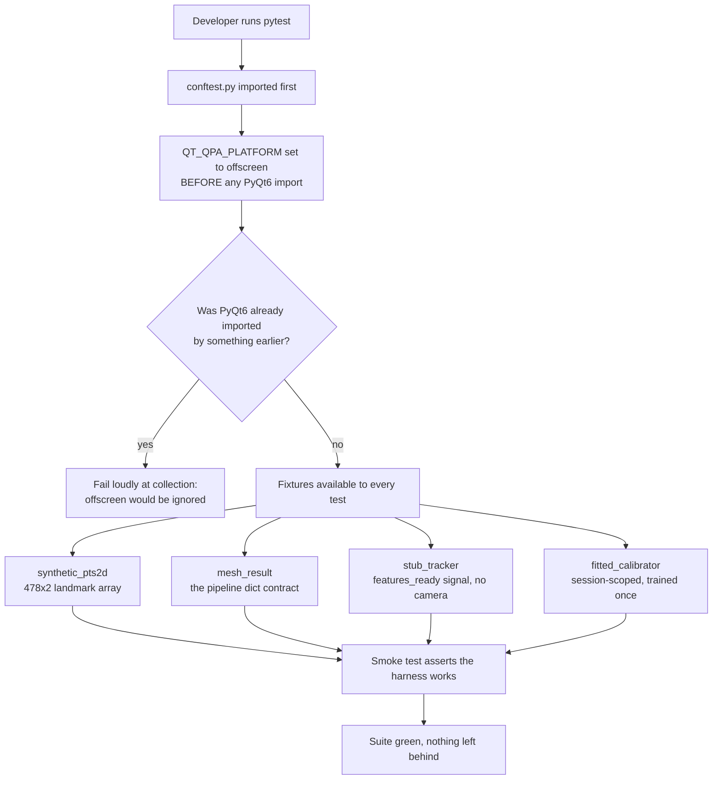

### Story 1.3: Test scaffold — offscreen Qt harness, synthetic fixtures and the five suite directories

**File**: `docs/plans/stories/epic-1-story-1.3-Test-Scaffold.md`
**BUILDID**: CYCLE-1 | **Epic**: 1 - TEST & PACKAGING FOUNDATION | **ID**: 1.3 | **Date**: 2026-08-07 | **Jira**: LOCAL | **GitHub**: #12
**Wave**: 2
**Requires**: [1.2]
**Enables**: [1.4, 1.6, 2.1]
**Files Touched**:
  - tests/conftest.py
  - tests/unit/test_harness_smoke.py
  - tests/integration/.gitkeep
  - tests/regression/.gitkeep
  - tests/invariants/.gitkeep
  - tests/arch/.gitkeep
**Roles Ref**: `docs/requirements.md#roles--permissions-matrix` — single-actor, no role variation
**QA Candidate**: No — test infrastructure with no user-observable behaviour and no application code path. Its correctness is demonstrated by the smoke test and consumed by every later story; QA verifies the toolchain as a whole in Epic 1 Group 1.

---

#### 👤 User Reference

**Description**:

This project has 1,295 lines of code and no automated tests at all. Every finding the earlier analysis produced — mislabelled head angles, a value that jumps at the neutral head position, a cancel button that fires twice — was reachable by a test that does not exist. This story builds the shared workbench those tests need.

Three things make testing this particular application awkward, and the workbench solves each. First, the application draws windows, and a test machine or build server has no screen; the harness starts the graphical toolkit in an invisible mode so window behaviour can be tested with nobody watching. Second, the real inputs come from a webcam and a face-detection library, neither of which belongs in an automated test; the harness can manufacture believable face measurements on demand, so a test can specify exactly the situation it wants — eyes half closed, head tilted, looking to one side — and get repeatable numbers. Third, the part of the application that learns where you are looking takes several seconds to train; the harness trains it once and lends the trained copy to every test that needs one, instead of paying that cost repeatedly.

It also lays out five folders that give every future test an obvious home: plain unit tests, tests that wire several pieces together, one folder per fixed defect so a bug can never quietly come back, a folder for behaviours already proven correct that must not regress, and a folder for rules about how the code is allowed to be structured.

Finally, it includes one small test whose only job is to prove the workbench itself works. Without it, the folders would be an empty promise and the next story would discover the problems instead.

Nothing a user of the application would notice changes.

**Acceptance Criteria** (plain-English):

- Tests can exercise the application's windows on a machine with no screen attached, and nothing appears on screen when they run.
- A test can ask for made-up but believable face measurements, describing the situation it cares about, and get the same numbers every time it asks for the same situation.
- A test can ask for a stand-in for the webcam component that plays back a prepared sequence of measurements, so no camera is needed and the sequence is under the test's control.
- A test can ask for an already-trained gaze predictor without paying the several-second training cost each time.
- Five clearly named folders exist for the different kinds of test, so nobody has to invent a location.
- At least one test exists that proves the workbench functions, and it passes.
- Running the tests leaves nothing behind — no stray windows, no held camera, no files in the project folder.
- The tests do not reach the internet and do not need a webcam.
- No made-up face data is written to disk or printed, so nothing resembling a person's biometric measurements is ever stored.
- The application itself is unchanged and behaves exactly as before.
- Nobody has to set an environment variable by hand before running the tests.

**User Flow**:

`Actor: system — no role variation.`

**Flow Diagram**:



---

#### 🤖 AI Agent Reference

> Audience: the DEV agent. The implementation contract — everything needed to build this story in a fresh AI session.

**Must Read**:
- `docs/architecture/design/02-target-architecture-brownfield.md` — **Test Architecture** section (the five-directory layout and the fixture list), DR-17 (pytest + pytest-cov + pytest-qt)
- `docs/architecture/design/03-patterns-and-standards-brownfield.md` §15 (testing patterns: layout, behavioural naming, AAA, mocking policy), §3 (what must never be logged), §10 (thread affinity)
- `eye_tracker/gaze.py` — the 38-D contract; `extract_gaze_features` consumes `pts2d`, `size`, `blendshapes`, `head_pose`
- `eye_tracker/face_mesh.py:111-126` — the exact `mesh_result` dict the synthetic builder must reproduce
- `eye_tracker/tracker.py:23-45` — `GazeTracker`'s public surface, which the stub must mirror
- `eye_tracker/calibration.py:206-257` — `GazeCalibrator.fit` / `predict_with_variance`, and `_make_gp`'s cost
- `docs/requirements.md` — FR-27, FR-29, technical constraints
- `SPEC/references/` — **0 files**

**Description**:

This story creates the shared test infrastructure every later story consumes. It is the `shared_files` entry `tests/conftest.py`, which Stories 1.6 and 2.3 also extend — they sit in waves 3 and 5, so they never modify it concurrently with this story.

**The four fixtures, and why each exists:**

**1. Offscreen Qt.** The deep-dive verification already proved `QT_QPA_PLATFORM=offscreen` drives the real `CalibrationWindow` headlessly. The subtlety is *ordering*: Qt reads that variable when the platform plugin loads, which happens on the first `QApplication` construction. Setting it after PyQt6 has been imported and a `QApplication` created is silently ineffective — the test would either open real windows or fail on a machine with no display, and the cause would be invisible. `conftest.py` must therefore set it at **module import time**, before any Qt import, and **assert that PyQt6 was not already imported** — a check that converts a silent misconfiguration into a loud collection error.

**2. Synthetic `pts2d`.** `extract_gaze_features` indexes landmarks up to **477**, so the array must be at least `(478, 2)` — see `_EYE_B_IRIS_RING = [473, 474, 475, 476, 477]`. Rather than a random array, the builder must be *parameterised by the physical situation* — iris offset, lid opening, roll angle, interocular distance — because that is what tests need to express. A test for roll invariance (Story 1.6) must be able to say "the same eye, rotated 40°", and a test for the gate thresholds (CYCLE-2) must be able to say "nodding 30°". A random array cannot express either.

🔴 **The builder must construct eye geometry that is internally consistent**, because `_eye_geometry` derives an eye-local axis from the outer→inner vector and projects the lid vector onto its perpendicular. If the synthetic points are not geometrically coherent, the derived `dx`/`dy`/`ear` values are meaningless and every test built on them measures nothing. This is the single highest-risk part of the story: a plausible-looking but incoherent builder produces tests that pass while asserting nothing.

**3. Stub tracker.** `GazeTracker` owns a daemon thread, a camera and a MediaPipe graph — none of which belongs in an automated test. The stub mirrors its **public surface exactly**: the `features_ready = pyqtSignal(object)` signal, `start()`, and `stop()`. Two contract details matter and are easy to get wrong: the signal emits **`None`** when no face is visible (`tracker.py:164`), so the stub must be able to emit `None`; and it must be a `QObject` constructed **on the GUI thread**, because patterns §10 records that constructing a signal receiver off the GUI thread converts Qt's queued connection into a direct one — failure criterion 10. The stub emits synchronously from the calling thread, which keeps tests deterministic and avoids reproducing the threading behaviour rather than testing against it.

**4. Fitted calibrator — session-scoped, with the cost measured rather than assumed.** `_make_gp()` sets `n_restarts_optimizer=4` and `GazeCalibrator` holds **six** GPs (three regressors × two axes), so a fit is not free. 🔧 **Measured on synthetic data: ~0.2 s per fit** for both a 3×3 (9-row) and a 5×5 (25-row) grid. That is *not* the multi-second freeze the analysis attributes to the live calibration path — do not repeat that figure here; a synthetic 25-row fit and a real calibration are different workloads, and the discrepancy is worth a note to the architecture owner rather than a guess.

0.2 s is still worth avoiding per test: at ~30 tests requesting a calibrator it is ~6 s of pure repetition, and it grows with the suite. So `scope="session"` is justified — but on measured grounds, and the implementer must record the figure they actually observe (AC 13).

⚠️ **Session scope has a hazard worth stating**: a session fixture shared across tests must not be mutated by any of them. `GazeCalibrator` exposes no setters, and `predict_with_variance` is read-only, so the fixture is safe today — but any test that calls `fit` again would silently corrupt every later test. The fixture's docstring must say so.

**Acceptance Criteria** (technical):

1. `tests/conftest.py` exists, with a module docstring carrying its `Layer:` declaration.
2. `os.environ.setdefault("QT_QPA_PLATFORM", "offscreen")` executes at `conftest.py` **module import time**, textually **before** any `PyQt6` import in the file.
3. 🔴 `conftest.py` asserts `"PyQt6.QtWidgets" not in sys.modules` at import time and fails collection with an explanatory message if it is — a silently-ignored offscreen setting must become a loud error.
4. `setdefault`, not assignment: an operator who exports `QT_QPA_PLATFORM=xcb` deliberately (to watch a test run) is not overridden.
5. A `synthetic_pts2d` fixture returns a **builder callable** — not a fixed array — accepting at minimum `iris_dx`, `iris_dy`, `lid_opening`, `roll_deg` and `interocular_px`, and returning a `(478, 2)` `float64` array.
6. 🔴 The builder produces **geometrically coherent** eyes: for `iris_dx=0, iris_dy=0`, the resulting `FEATURE_A_DX` and `FEATURE_A_DY` from `extract_gaze_features` are within `1e-9` of zero. Asserted by the smoke test — this is what proves the builder means anything.
7. The builder is deterministic: identical arguments produce a bit-identical array. No unseeded randomness anywhere in `conftest.py`.
8. `synthetic_pts2d` and `mesh_result` are **`scope="session"`** (stateless builders), because `fitted_calibrator` is session-scoped and pytest raises `ScopeMismatch` if a session fixture requests a function-scoped one. `stub_tracker` stays function-scoped — it is a stateful `QObject`.
8a. A `mesh_result` fixture returns a builder producing the exact dict contract from `face_mesh.py:120-126`: keys `pts2d`, `head_pose`, `size`, `blendshapes`, `facial_matrix` — with `head_pose` a 6-element vector and `blendshapes` a dict **or `None`**.
9. The `blendshapes` builder accepts the real MediaPipe key names used by `gaze.py:152-171` (`eyeBlinkLeft`, `eyeLookOutLeft`, …), and defaults absent keys to `0.0` exactly as `_blendshape_score` does.
10. A `stub_tracker` fixture returns a `QObject` exposing `features_ready = pyqtSignal(object)`, `start()`, `stop()`, and a method to emit a scripted sequence — including the ability to emit **`None`** for "no face visible".
11. The stub is constructed on the GUI thread and emits synchronously; it starts **no** thread, opens **no** camera and creates **no** MediaPipe graph.
12. A `fitted_calibrator` fixture with `scope="session"` returns a `GazeCalibrator` already fitted on synthetic X/Y, with a docstring stating it **must not be mutated** and that calling `fit` on it would corrupt every later test.
13. The fixture's fitting data is large enough to fit without error and small enough to keep the cost bounded; the measured fit time is recorded in a comment so a future slowdown is attributable.
14. `tests/unit/`, `tests/integration/`, `tests/regression/`, `tests/invariants/` and `tests/arch/` all exist and are tracked by git (`.gitkeep` where a directory has no test yet).
15. `tests/unit/test_harness_smoke.py` exists and asserts each of the four fixtures actually works — not merely that it imports.
16. The smoke test asserts `extract_gaze_features(mesh_result(...))` returns a vector of length **38** matching `FEATURE_COUNT`, imported by name.
17. The smoke test drives the real `CalibrationWindow` headlessly, proving the offscreen platform works against actual application code rather than a toy widget.
18. The smoke test asserts `fitted_calibrator.predict_with_variance(feat)` returns a 2-element prediction and a 2-element variance, both finite.
19. The smoke test asserts an unfitted `GazeCalibrator` raises `RuntimeError` — pinning the guard at `calibration.py:231-232` that later stories rely on.
20. `pytest` exits **0** with the smoke test collected and passing, and coverage reported.
21. 🔴 **No network access and no camera access** anywhere in the scaffold. The suite must pass with the camera physically disconnected — verified by running it that way.
22. 🔴 **No synthetic landmark array, blendshape map or full feature vector is printed or written to disk** by any fixture or the smoke test. Patterns §3 forbids persisting this shape of data, and a fixture that dumps it on failure would violate that at the worst moment.
23. Running the suite leaves no artefacts in the working tree: `git status --porcelain` after `pytest` shows nothing beyond gitignored coverage data.
24. No `sys.path` manipulation in `conftest.py` or any test — Story 1.2's packaging is what makes imports work (FR-26).
25. `ruff check` and `ruff format --check` clean on all files this story creates.
26. All fixtures and helpers are annotated; public builders carry NumPy-style docstrings (patterns §12).
27. 🔴 **Zero application source modification** — `git diff --stat -- main.py eye_tracker/` empty.

**RBAC Enforcement**:

`No role-differentiated access — single actor.`

- **Enforcement point(s)**: none. Test infrastructure has no runtime code path, no route and no guard.
- **Denied-access contract**: N/A — no request surface exists.
- **Scope derivation**: **N/A — no scoped permission exists, and there is no token or session to derive scope from.** The applicable protection here is not authorization but **data minimisation**: AC 22 forbids any fixture from printing or persisting synthetic landmark arrays or feature vectors, so the suite cannot become a channel through which biometric-shaped data leaves the process.

**System responses + error cases**:

Triggers are test-run and fixture-request events; `Response` is the observable pytest outcome.

| Trigger | Response | Side-effect |
|---|---|---|
| `pytest` on a machine with no display | Exit 0, smoke test passes, **no window appears** | Coverage data file (gitignored) |
| `pytest` with the camera physically disconnected | Exit 0 — the scaffold touches no device (AC 21) | None |
| Repeat `pytest` run (idempotent) | Identical results; the builder is deterministic so no test flips outcome between runs | None; no accumulating artefacts (AC 23) |
| `synthetic_pts2d(...)` called twice with identical arguments | Bit-identical arrays | None — determinism is AC 7 |
| Builder called with `iris_dx=0, iris_dy=0` | `FEATURE_A_DX`/`A_DY` within `1e-9` of zero | None — this is the coherence proof (AC 6) |
| `mesh_result(blendshapes=None)` | Dict with `blendshapes` set to `None`; `extract_gaze_features` yields `0.0` for all 12 blendshape features | None. Reproduces the real silent-fallback the architecture flags (DR-16), so later stories can test it |
| `fitted_calibrator` requested by the first test in a session | Fits six GPs once; multi-second | Fitted object cached for the whole session |
| `fitted_calibrator` requested by any later test | Returns the cached object immediately | None |
| A test calls `fit()` on the session fixture | **Not prevented** — Python has no cheap immutability here. Documented in the fixture docstring as forbidden | ⚠️ Would silently corrupt every later test. Recorded as a known hazard, not solved |
| `predict_with_variance` on an **unfitted** calibrator | `RuntimeError("Calibrator has not been trained")` | None — AC 19 pins this guard |
| Something imports `PyQt6.QtWidgets` before `conftest.py` | **Collection error** with an explanatory message | None — AC 3 turns a silent misconfiguration loud |
| Operator exports `QT_QPA_PLATFORM=xcb` to watch a run | Honoured — `setdefault` does not override (AC 4) | Windows appear, deliberately |
| `pytest` before Story 1.2's editable install | `ModuleNotFoundError: eye_tracker` | None. The correct failure: the scaffold must not paper over missing packaging with a `sys.path` hack (AC 24) |
| `python main.py` after this story | Application behaves exactly as before | None — AC 27 |

**Prerequisites**:

- **Story 1.2 complete** — `pyproject.toml` with the `dev` extra installed, so `pytest`, `pytest-cov` and `pytest-qt` are present and `eye_tracker` imports.
- No camera, no network, no display required — that is the point of the story.
- **Not** a prerequisite: Story 1.5's `logging_setup.py`. Both are wave-2 siblings; this story must not import it.

**Context** (read before writing):
- `eye_tracker/face_mesh.py:15-25` (landmark constants), `:111-126` (the `mesh_result` contract)
- `eye_tracker/gaze.py:19-64` (index constants and iris/lid rings), `:79-115` (`_eye_geometry` — the geometry the builder must satisfy)
- `eye_tracker/tracker.py:23-45` — the surface the stub mirrors, and `:164` where `None` is emitted
- `eye_tracker/calibration.py:153-164` (`_make_gp` cost), `:206-257` (fit/predict and the unfitted guard)
- `eye_tracker/overlay.py:86` — `CalibrationWindow.__init__` signature, for the headless drive in AC 17

**Patterns**:
- **Testing Patterns** `[New adoption]` — patterns §15: the five-directory layout, behavioural test names, AAA with one behaviour per test, and the mocking policy (stub at the boundary, never mock the thing under test).
- **Factory function for repeated construction** — `02-calibration-deep-dive.md` Pattern 1. The fixtures are builders, not constants, for exactly this reason.
- **Cross-thread publication by value** `[Current — kept]` — patterns §10. The stub must not become a place where the concurrency model is quietly broken.
- **Logging** `[New adoption]` — patterns §3. Never log or persist frames, landmark arrays, blendshape maps or full feature vectors — binding on fixtures too (AC 22).
- **Numerical Guards** `[Current — kept]` — patterns §11. The builder's own divisions (normalising by eye width) need the same epsilon discipline as the production code it feeds.

**Steps**:

1. **Set the platform before anything imports Qt, and make a wrong order loud.** This must be the first executable code in `conftest.py`.

   ```python
   """Shared test fixtures.

   Layer: test

   Qt runs offscreen so window behaviour is testable without a display. The
   platform is chosen when the Qt plugin loads on first QApplication
   construction, so the environment variable must be set BEFORE any PyQt6
   import — setting it afterwards is silently ignored.
   """
   import os
   import sys

   # setdefault, not assignment: an operator who exports QT_QPA_PLATFORM=xcb to
   # watch a run keeps that choice.
   os.environ.setdefault("QT_QPA_PLATFORM", "offscreen")

   assert "PyQt6.QtWidgets" not in sys.modules, (
       "PyQt6.QtWidgets was imported before conftest.py set QT_QPA_PLATFORM. "
       "The offscreen platform would be silently ignored and these tests would "
       "try to open real windows. Check for a module-level Qt import in a "
       "sitecustomize, a plugin, or an earlier conftest."
   )
   ```

2. **Write the synthetic landmark builder.** Construct the geometry so it satisfies `_eye_geometry`'s assumptions rather than hoping it does.

   ```python
   import numpy as np
   import pytest

   from eye_tracker.face_mesh import (
       EYE_A_INNER, EYE_A_IRIS, EYE_A_OUTER,
       EYE_B_INNER, EYE_B_IRIS, EYE_B_OUTER,
   )

   _LANDMARK_COUNT = 478   # gaze.py indexes up to 477 (_EYE_B_IRIS_RING)


   def _build_eye(pts, outer_idx, inner_idx, top_ring, bottom_ring, iris_ring,
                  centre, half_width, half_height, iris_dx, iris_dy, rot):
       """Place one anatomically coherent eye into `pts`.

       The eye is built in its own local frame — +u from outer to inner corner,
       +v perpendicular — then rotated by `rot` and translated to `centre`. This
       is what makes the result coherent: `_eye_geometry` derives the same local
       frame from the outer/inner corners, so a zero iris offset in the local
       frame must come back as dx == dy == 0 for ANY rotation.
       """
       def place(idx, local):
           pts[idx] = centre + rot @ np.asarray(local, dtype=np.float64)

       place(outer_idx, (-half_width, 0.0))
       place(inner_idx, (half_width, 0.0))
       for i, idx in enumerate(top_ring):
           place(idx, (half_width * (i - 1) * 0.4, -half_height))
       for i, idx in enumerate(bottom_ring):
           place(idx, (half_width * (i - 1) * 0.4, half_height))
       # Iris centre first, then its ring as a circle around it, so the derived
       # iris radius is a real measurement rather than an accident.
       iris_local = np.array([iris_dx * half_width * 2.0, iris_dy * half_height * 2.0])
       place(iris_ring[0], iris_local)
       radius = half_width * 0.25
       for k, idx in enumerate(iris_ring[1:]):
           angle = 2.0 * np.pi * k / max(len(iris_ring) - 1, 1)
           place(idx, iris_local + radius * np.array([np.cos(angle), np.sin(angle)]))
   ```

   ⚠️ The rotation is applied to the whole eye including the iris offset **in the local frame**. That is precisely why AC 6's zero-offset assertion holds at any `roll_deg`, and it is what makes Story 1.6's roll-invariance test meaningful rather than circular.

3. **Expose the builder as a fixture**, parameterised by physical situation.

   🔴 **Scope matters and pytest enforces it.** `synthetic_pts2d` and `mesh_result` must be `scope="session"`, **not** function-scoped. They return stateless builder callables, so session scope is safe — and it is *required*, because `fitted_calibrator` is session-scoped and pytest raises `ScopeMismatch` if a session fixture requests a function-scoped one. `stub_tracker` stays function-scoped: it is a stateful `QObject` and every test needs a fresh one.

   ```python
   @pytest.fixture(scope="session")
   def synthetic_pts2d():
       """Return a builder for a (478, 2) landmark array.

       Session-scoped deliberately: the returned callable is stateless, and
       `fitted_calibrator` (session-scoped) must be able to request it — pytest
       raises ScopeMismatch if a session fixture depends on a function-scoped one.

       Parameters accepted by the returned callable
       --------------------------------------------
       iris_dx, iris_dy : float
           Iris offset within the eye, normalised to the eye's own half-extent.
           0.0 means perfectly centred.
       lid_opening : float
           Eye-aperture height as a fraction of eye width. Drives EAR.
       roll_deg : float
           Head roll. Both eyes rotate about the face midpoint.
       interocular_px : float
           Distance between the two eye centres, in pixels.

       Returns
       -------
       Callable[..., np.ndarray]
           Deterministic: identical arguments give a bit-identical array.
       """
       from eye_tracker.gaze import (
           _EYE_A_BOTTOM_RING, _EYE_A_IRIS_RING, _EYE_A_TOP_RING,
           _EYE_B_BOTTOM_RING, _EYE_B_IRIS_RING, _EYE_B_TOP_RING,
       )

       def build(iris_dx=0.0, iris_dy=0.0, lid_opening=0.30,
                 roll_deg=0.0, interocular_px=120.0, frame_size=(1920, 1080)):
           w, h = frame_size
           pts = np.zeros((_LANDMARK_COUNT, 2), dtype=np.float64)
           theta = np.deg2rad(roll_deg)
           rot = np.array(
               [[np.cos(theta), -np.sin(theta)],
                [np.sin(theta), np.cos(theta)]],
               dtype=np.float64,
           )
           half_w = interocular_px * 0.25
           half_h = half_w * lid_opening
           mid = np.array([w * 0.5, h * 0.5])
           offset = rot @ np.array([interocular_px * 0.5, 0.0])
           _build_eye(pts, EYE_A_OUTER, EYE_A_INNER, _EYE_A_TOP_RING,
                      _EYE_A_BOTTOM_RING, _EYE_A_IRIS_RING, mid - offset,
                      half_w, half_h, iris_dx, iris_dy, rot)
           _build_eye(pts, EYE_B_INNER, EYE_B_OUTER, _EYE_B_TOP_RING,
                      _EYE_B_BOTTOM_RING, _EYE_B_IRIS_RING, mid + offset,
                      half_w, half_h, iris_dx, iris_dy, rot)
           return pts

       return build
   ```

   🔴 Note the **argument order difference between the two eyes**: eye A passes `EYE_A_OUTER` then `EYE_A_INNER`, while eye B passes `EYE_B_INNER` then `EYE_B_OUTER` — mirroring exactly how `extract_gaze_features` calls `_eye_geometry` at `gaze.py:124-139`. Getting this backwards produces an eye whose local axis is inverted, and every `dx` assertion built on it would be silently sign-flipped. Verify against the source; do not copy from memory.

4. **Add the `mesh_result` and `blendshapes` builders**, reproducing the dict contract exactly (`face_mesh.py:120-126`): `pts2d`, `head_pose` (6 elements), `size` as `(w, h)`, `blendshapes` as a dict or `None`, `facial_matrix`. Default `head_pose` to zeros and let callers set yaw/pitch/roll/TX/TY/TZ by name, remembering the index mapping `gaze.py:182-187` uses — `head[0]`→YAW, `head[1]`→PITCH, `head[2]`→ROLL, `head[3]`→TX, `head[4]`→TY, `head[5]`→TZ. ⚠️ That mapping is **not** in positional order; take it from the source.

5. **Add the stub tracker**, mirroring `GazeTracker`'s surface and its `None` contract.

   ```python
   @pytest.fixture
   def stub_tracker(qapp):
       """A GazeTracker stand-in: same signal, no thread, no camera, no graph.

       Emits synchronously from the calling thread so tests stay deterministic.
       Constructed on the GUI thread because a receiver built off it converts
       Qt's queued connection to a direct one (patterns §10, failure criterion 10).
       """
       from PyQt6.QtCore import QObject, pyqtSignal

       class _StubTracker(QObject):
           features_ready = pyqtSignal(object)

           def __init__(self):
               super().__init__()
               self.started = False

           def start(self):
               self.started = True

           def stop(self):
               self.started = False

           def emit_sequence(self, vectors):
               """Emit each item in order. `None` means 'no face visible'."""
               for vector in vectors:
                   self.features_ready.emit(vector)

       return _StubTracker()
   ```

6. **Add the session-scoped fitted calibrator**, with the immutability rule in its docstring and the measured fit cost in a comment.

   ```python
   @pytest.fixture(scope="session")
   def fitted_calibrator(synthetic_pts2d, mesh_result):
       """A GazeCalibrator fitted once for the whole session.

       🔴 MUST NOT BE MUTATED. Calling `fit()` on this object would silently
       corrupt every test that runs afterwards. `predict` and
       `predict_with_variance` are read-only and safe. A test needing a
       differently-trained calibrator constructs its own and pays the fit cost.

       Session-scoped because GazeCalibrator holds six GPs (three regressors x
       two axes) and _make_gp sets n_restarts_optimizer=4, so one fit takes
       multiple seconds. Measured cost at time of writing: <RECORD IT HERE>.

       Both requested fixtures are session-scoped too — pytest raises
       ScopeMismatch otherwise.
       """
       from eye_tracker.calibration import GazeCalibrator
       from eye_tracker.gaze import extract_gaze_features

       # A small grid of gaze directions mapped to screen points. Deterministic:
       # no randomness, so a failure is always reproducible.
       rows_x, rows_y = [], []
       for iris_dx in (-0.3, 0.0, 0.3):
           for iris_dy in (-0.3, 0.0, 0.3):
               feat = extract_gaze_features(mesh_result(pts2d=synthetic_pts2d(
                   iris_dx=iris_dx, iris_dy=iris_dy)))
               rows_x.append(feat)
               # Screen target implied by the gaze direction, in pixels.
               rows_y.append([960.0 + iris_dx * 900.0, 540.0 + iris_dy * 500.0])

       calibrator = GazeCalibrator()
       calibrator.fit(np.asarray(rows_x), np.asarray(rows_y))
       return calibrator
   ```

7. **Create the five suite directories** with `.gitkeep` where no test exists yet, so the layout is present in a fresh clone rather than being invented per developer.

8. **Write the smoke test** (below), then run the gate — including with the camera unplugged, which is the check most likely to be skipped:

   ```bash
   ruff check tests/ && ruff format --check tests/
   pytest -v
   git status --porcelain          # nothing beyond gitignored coverage data
   git diff --stat -- main.py eye_tracker/    # MUST be empty
   # then physically disconnect the camera and re-run:
   pytest -v
   ```

**Tests**:

```python
# tests/unit/test_harness_smoke.py
"""Proves the test harness itself works.

Layer: test

Without this, the five suite directories are an empty promise and the next
story discovers the harness's problems instead of using it.
"""
import numpy as np
import pytest

from eye_tracker.calibration import GazeCalibrator
from eye_tracker.gaze import (
    FEATURE_A_DX,
    FEATURE_A_DY,
    FEATURE_COUNT,
    extract_gaze_features,
)


def test_offscreen_platform_is_active(qapp):
    """A QApplication exists and the platform is offscreen, so no window shows."""
    import os
    assert qapp is not None
    assert os.environ["QT_QPA_PLATFORM"] == "offscreen"


def test_feature_vector_has_the_contracted_length(synthetic_pts2d, mesh_result):
    """The 38-D contract, asserted by name so renumbering breaks the test."""
    feat = extract_gaze_features(mesh_result(pts2d=synthetic_pts2d()))
    assert feat.shape == (FEATURE_COUNT,)
    assert np.all(np.isfinite(feat))


def test_centred_iris_yields_zero_offset(synthetic_pts2d, mesh_result):
    """The builder is geometrically coherent — the assertion that makes it useful.

    If this fails, every dx/dy-based test in the suite is measuring noise.
    """
    feat = extract_gaze_features(mesh_result(pts2d=synthetic_pts2d(iris_dx=0.0, iris_dy=0.0)))
    assert abs(feat[FEATURE_A_DX]) < 1e-9
    assert abs(feat[FEATURE_A_DY]) < 1e-9


def test_coherence_survives_roll(synthetic_pts2d, mesh_result):
    """A centred iris stays centred under head roll — pins the eye-local frame."""
    for roll in (-40.0, -15.0, 0.0, 15.0, 40.0):
        feat = extract_gaze_features(
            mesh_result(pts2d=synthetic_pts2d(iris_dx=0.0, iris_dy=0.0, roll_deg=roll))
        )
        assert abs(feat[FEATURE_A_DX]) < 1e-9, f"roll={roll}"
        assert abs(feat[FEATURE_A_DY]) < 1e-9, f"roll={roll}"


def test_builder_is_deterministic(synthetic_pts2d):
    """Identical arguments give a bit-identical array — no unseeded randomness."""
    a = synthetic_pts2d(iris_dx=0.2, roll_deg=12.0)
    b = synthetic_pts2d(iris_dx=0.2, roll_deg=12.0)
    assert np.array_equal(a, b)


def test_absent_blendshapes_are_tolerated(synthetic_pts2d, mesh_result):
    """`blendshapes=None` must reproduce the real silent fallback (DR-16)."""
    feat = extract_gaze_features(mesh_result(pts2d=synthetic_pts2d(), blendshapes=None))
    assert feat.shape == (FEATURE_COUNT,)
    assert np.all(np.isfinite(feat))


def test_stub_tracker_emits_vectors_and_none(stub_tracker, synthetic_pts2d, mesh_result):
    """The stub mirrors GazeTracker's contract, including `None` for no face."""
    received = []
    stub_tracker.features_ready.connect(received.append)
    feat = extract_gaze_features(mesh_result(pts2d=synthetic_pts2d()))
    stub_tracker.emit_sequence([feat, None, feat])
    assert len(received) == 3
    assert received[1] is None


def test_stub_tracker_opens_no_camera_and_starts_no_thread(stub_tracker):
    import threading
    before = threading.active_count()
    stub_tracker.start()
    assert stub_tracker.started is True
    assert threading.active_count() == before
    stub_tracker.stop()


def test_calibration_window_constructs_headlessly(qapp, stub_tracker):
    """Drives real application code, not a toy widget — AC 17."""
    from eye_tracker.overlay import CalibrationWindow
    window = CalibrationWindow(stub_tracker, n_points=9)
    try:
        assert window is not None
    finally:
        window.close()


def test_fitted_calibrator_predicts_with_finite_variance(fitted_calibrator, synthetic_pts2d, mesh_result):
    feat = extract_gaze_features(mesh_result(pts2d=synthetic_pts2d(iris_dx=0.1)))
    mean, var = fitted_calibrator.predict_with_variance(feat)
    assert mean.shape == (2,) and var.shape == (2,)
    assert np.all(np.isfinite(mean)) and np.all(np.isfinite(var))
    assert np.all(var > 0.0)


def test_unfitted_calibrator_refuses_to_predict():
    """Pins the guard at calibration.py:231-232 that later stories depend on."""
    with pytest.raises(RuntimeError, match="has not been trained"):
        GazeCalibrator().predict_with_variance(np.zeros(FEATURE_COUNT))
```

Manual test cases:

| # | Scenario | Expected |
|---|---|---|
| 1 | `pytest -v` on a machine with a display | All pass; **no window flashes on screen** |
| 2 | `pytest -v` with the camera physically unplugged | All pass — the scaffold touches no device |
| 3 | `pytest -v` with networking disabled | All pass |
| 4 | Time the run twice | The second is not markedly slower; the session calibrator fits once |
| 5 | `git status --porcelain` after a run | Nothing beyond gitignored coverage data |
| 6 | `QT_QPA_PLATFORM=xcb pytest` on a machine with a display | Honoured — windows appear, proving `setdefault` |
| 7 | Add a module-level `import PyQt6.QtWidgets` to a `sitecustomize` and run | Collection error with the explanatory message, not a mysterious display failure |
| 8 | `python main.py` afterwards | Application behaves exactly as before |
| 9 | Grep the run transcript | No landmark arrays, blendshape maps or 38-element vectors printed |

**Quality**: `ruff check` / `ruff format --check` clean on `tests/` · fixtures annotated with NumPy docstrings on public builders · no `TODO`/`FIXME` · no unseeded randomness · no `sys.path` manipulation · zero application source modification.

**OUT**:
- ❌ Writing tests for application behaviour — this story builds the workbench. Behavioural tests belong to the stories that own their subject (1.4, 1.6, 2.1, and every later cycle).
- ❌ Reaching ≥85% coverage — accumulated across all cycles, verified in CYCLE-5.
- ❌ Enabling `--cov-fail-under` — Story 1.2 deliberately left it off.
- ❌ Mocking `extract_gaze_features`, `GazeCalibrator` or any other unit under test. Patterns §15's mocking policy stubs at the **boundary** (camera, MediaPipe) only.
- ❌ Reproducing `GazeTracker`'s threading in the stub — tests would then depend on timing. The real thread is exercised by CYCLE-4's capture-robustness work with an injected fake capture.
- ❌ Importing `logging_setup.py` — Story 1.5 is a wave-2 sibling, not a dependency.
- ❌ A fixture that dumps landmark arrays or feature vectors on failure — AC 22 forbids it, and failure is exactly when it would be most tempting.
- ❌ Fixing any of the pre-existing lint findings in application code — Story 1.2 owns those ignores and names their removal cycles.

**Evidence**:
- `pytest -v` output showing all 11 smoke tests passing, with the coverage summary.
- A second `pytest -v` run **with the camera physically disconnected**, same result — this is the proof for AC 21 and the case most likely to be skipped.
- `ruff check tests/` and `ruff format --check tests/` output.
- `git status --porcelain` after a run, showing no stray artefacts.
- `git diff --stat -- main.py eye_tracker/` showing empty.
- The recorded `fitted_calibrator` fit time, pasted into the fixture comment so a future slowdown is attributable.
- Transcript of manual case 7 (the pre-imported-Qt collection error), proving AC 3's guard actually fires rather than being decorative.
