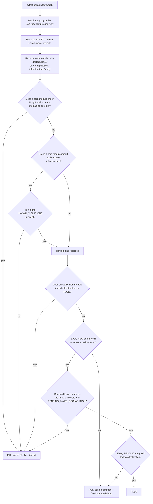

### Story 1.4: Dependency-direction enforcement — an AST import test replacing a directory restructure

**File**: `docs/plans/stories/epic-1-story-1.4-Import-Direction-Enforcement.md`
**BUILDID**: CYCLE-1 | **Epic**: 1 - TEST & PACKAGING FOUNDATION | **ID**: 1.4 | **Date**: 2026-08-07 | **Jira**: LOCAL | **GitHub**: LOCAL
**Wave**: 3
**Requires**: [1.3]
**Enables**: []
**Files Touched**:
  - tests/arch/test_import_direction.py
**Roles Ref**: `docs/requirements.md#roles--permissions-matrix` — single-actor, no role variation
**QA Candidate**: No — an architecture test with no user-observable behaviour and no application code path. QA verifies it as part of the toolchain in Epic 1 Group 1, specifically by confirming it *fails* when an outward import is introduced.

---

#### 👤 User Reference

**Description**:

The strongest structural property this codebase has is that its parts depend on each other in one direction only. The pure calculation code does not know about the webcam; the webcam code does not know about the windows. That property is why the calculation code can be tested at all without a camera attached, and it is worth a great deal. At the moment, nothing protects it. It holds because whoever wrote it was careful, and it would be lost the first time someone in a hurry added one convenient import.

The usual way to protect it is to physically reorganise the code into folders named after the layers. The architecture decided against that, because it would change the location of files referenced by four other parts of the code and by every one of eight analysis documents, and it would gain nothing the application actually does. Instead, the rule is written down and this story makes a test enforce it.

The test reads each source file and works out what it imports, without running it. If a file belonging to the pure inner layer imports something from an outer layer — or reaches for the graphical toolkit, the camera library, the machine-learning library or the face-detection library — the test fails and names the file, the line and the offending import.

One real violation exists today, and this story does not hide it: the pure calculation file borrows a list of numbered facial reference points from the camera-adapter file. Those numbers are plain data and arguably belong with the calculation code, but moving them means editing two files this cycle has promised not to touch, one of which the next cycle is already scheduled to rewrite. So the violation is recorded as a single named exception with the cycle that removes it — and the test is built so that a **stale** exception fails just as loudly as a new violation. Once the next cycle fixes it, whoever forgets to delete the exception will be told.

Nothing a user of the application would notice changes.

**Acceptance Criteria** (plain-English):

- A test exists that checks the one-directional dependency rule automatically, and it passes.
- The test is proven to actually work by watching it fail: adding a forbidden import makes it fail, naming the file, the line and the import.
- The test explains failures well enough to fix them without opening the test.
- The single existing violation is recorded openly as a named exception with the reason and the cycle that removes it — not silently ignored, and not fixed here by editing files this cycle must not touch.
- If a recorded exception is later fixed but its entry is left behind, the test fails. Exceptions cannot rot into permanent permission.
- Each file states which layer it belongs to in its own description text, and the test checks that the stated layer matches the agreed map. Files that do not state it yet are listed, and that list shrinks as each is worked on — leaving one in the list after it has been updated fails the test.
- The package's entry file contains no convenience re-exports, which would create hidden connections the test could not see.
- The test runs in well under a second and needs no camera, no screen and no network, because it reads the files rather than running them.
- The application itself is unchanged and behaves exactly as before.

**User Flow**:

`Actor: system — no role variation.`

**Flow Diagram**:



---

#### 🤖 AI Agent Reference

> Audience: the DEV agent. The implementation contract — everything needed to build this story in a fresh AI session.

**Must Read**:
- `docs/architecture/design/03-patterns-and-standards-brownfield.md` **§1** (the target layout with per-module layer assignments — this is the authoritative map) and **§8** (the decision and the test sketch)
- `docs/architecture/design/02-target-architecture-brownfield.md` — **DR-10** (layers enforced by an import test, not a directory restructure, with the alternatives considered)
- `eye_tracker/gaze.py:6-17` — the `from .face_mesh import (...)` block that is the one existing violation
- `docs/requirements.md` — failure criterion 6 (the 38-D contract's four consumers), technical constraints
- `SPEC/references/` — **0 files**

**Description**:

Patterns §1 declares the layers logically and §8 decides to enforce the dependency rule with a test rather than a directory restructure. DR-10 records why: moving files into `domain/`, `application/` and `infrastructure/` would break the import paths of the 38-D contract's four consumers and every file path cited across eight analysis documents, for no behavioural gain. This story is that test.

**The layer map**, taken verbatim from patterns §1's target layout:

| Layer | Modules | May import |
|---|---|---|
| **core** — pure | `gaze`, `pose`, `gates`, `config`, `errors`, `diagnostics`, `one_euro` | stdlib, `numpy`. **Never** `PyQt6`, `cv2`, `sklearn`, `mediapipe`, `joblib`, and never application or infrastructure |
| **application** — orchestration and model policy | `pipeline`, `calibration`, `profile`, `app`, `evaluation/*` | core, stdlib, third-party except `PyQt6`. **Never** infrastructure |
| **infrastructure** — frameworks, devices, filesystem | `tracker`, `face_mesh`, `overlay`, `status_window`, `logging_setup`, `tools/*` | anything |
| **entry** | `main` | anything — it is the composition shim |

Most of these modules do not exist yet; the test must handle that by resolving only what is present, so it does not need editing as each later cycle adds `pose.py`, `gates.py`, `config.py` and the rest. A test that must be updated whenever a file is added will be updated carelessly.

🔴 **A measured finding that contradicts the patterns document, and it changes this story.** §8 states: *"Current: clean acyclic dependencies, verified across all 8 files. Nothing imports upward."* Measured against the §1 layer map, that is **half right**. The graph is genuinely acyclic — but acyclic is not the same as layer-respecting, and there is exactly **one** layer violation:

```
eye_tracker/gaze.py  (core)  imports  .face_mesh  (infrastructure)
```

`gaze.py:6-17` imports ten landmark index constants — `EYE_A_OUTER`, `EYE_A_INNER`, `EYE_A_IRIS`, `EYE_B_*` — from `face_mesh.py`. The edge is acyclic and harmless at runtime, but it points core → infrastructure, which is exactly what the rule forbids. Written honestly against the map, the test **fails on the existing code**.

**How that is resolved, and why not by fixing it.** The right fix is to move the landmark constants into a core module of their own — they are plain integers naming anatomical reference points, pure data that belongs with the contract rather than with the MediaPipe adapter. But that means editing `gaze.py` and `face_mesh.py`, neither of which is in this story's `files_touched`, and `gaze.py` is a `shared_files` entry first modified in CYCLE-2. Editing it here is precisely the cross-story merge hazard the dependency graph exists to prevent.

So the violation is recorded as a **single named allowlist entry with its removal owner** — the same discipline Story 1.2 applied to the 30 legacy lint findings. CYCLE-2 is the natural moment: it already modifies both files for FR-1/FR-2 and creates `pose.py`, so extracting the constants is incremental work on files already open.

🔴 **The allowlist must not be able to rot.** An exemption that outlives its cause becomes permanent permission, silently. So the test asserts in **both directions**: it fails on any violation not in the allowlist, **and** it fails on any allowlist entry that no longer corresponds to a real violation. When CYCLE-2 moves the constants, whoever forgets to delete the entry is told immediately. This is the same principle patterns §14 states for length exemptions and that Story 1.2 applied when it dropped the inert `PLR0915` entry for `gaze.py`.

**A second, self-retiring check.** Patterns §1 rule states: *"Layer membership is declared in the module docstring. First line after the summary: `Layer: core` / `application` / `infrastructure`."* None of the seven existing modules carries that declaration. Rather than either skipping the rule or bulk-editing seven files this cycle must not touch, the test maintains a `PENDING_LAYER_DECLARATION` set with the same two-way assertion: a module in the set must **lack** a declaration, and a module outside it must **have** one that matches the map. Each later cycle that touches a module adds its declaration and deletes its entry — and the test fails if it adds the declaration without deleting the entry. The allowlist actively drives the migration instead of recording a wish.

**Acceptance Criteria** (technical):

1. `tests/arch/test_import_direction.py` exists with a module docstring carrying its `Layer: test` declaration.
2. The test parses source with `ast`; it **never imports** an application module. Importing `overlay.py` would construct Qt types and importing `tracker.py` would pull in `cv2` and `mediapipe`, making an architecture test depend on the very frameworks it is policing.
3. `CORE`, `APPLICATION` and `INFRASTRUCTURE` sets match patterns §1's target layout exactly, including modules that do not exist yet.
4. `FORBIDDEN_IN_CORE` is `{"PyQt6", "cv2", "sklearn", "mediapipe", "joblib"}` — patterns §8's set, unmodified.
5. `numpy` is **permitted** in core, with a comment stating why: patterns §1 lists the forbidden frameworks explicitly and `numpy` is not among them; the 38-D contract is a `numpy` array, so excluding it would make the contract itself unrepresentable in core.
6. The test resolves both `import x` and `from x import y`, and both **relative** (`from .gaze import ...`) and absolute (`from eye_tracker.gaze import ...`) intra-package forms. Missing the relative form would make the test blind to every intra-package import in this codebase, since all of them are relative.
7. 🔴 A module inside a subpackage is keyed to its **subpackage** for layer resolution — `tools/eye_pairing.py` → `tools`, `evaluation/metrics.py` → `evaluation` — because patterns §1 assigns layers to those directories as units. Keying by file stem leaves them unlayered, and `tools/eye_pairing.py` **already exists when this test first runs** (Story 1.1 creates it in wave 2; this story is wave 3), so a stem-keyed test fails immediately.
7a. Modules absent from disk are skipped silently, so the test needs no edit as later cycles add `pose.py`, `gates.py`, `config.py`, `errors.py`, `diagnostics.py`, `pipeline.py`, `profile.py`, `app.py`, `status_window.py` and `evaluation/*`.
8. Every failure message names the **file, the line number and the offending import**, and states which rule was broken.
9. `KNOWN_VIOLATIONS` contains exactly one entry: `("gaze", "face_mesh")`, with an inline comment giving the reason and naming **CYCLE-2** as its removal owner.
10. 🔴 The test fails if a violation is found that is **not** in `KNOWN_VIOLATIONS`.
11. 🔴 The test fails if a `KNOWN_VIOLATIONS` entry no longer corresponds to an actual violation — a stale exemption is a failure, not a harmless leftover.
12. `PENDING_LAYER_DECLARATION` lists the modules that currently lack a `Layer:` docstring declaration, each with no per-entry comment needed beyond the set's own explanation.
13. 🔴 A module **not** in `PENDING_LAYER_DECLARATION` must declare a `Layer:` matching the map; a module **in** it must lack a declaration. Both directions asserted, so the set retires itself.
14. `eye_tracker/__init__.py` is asserted to contain **no** `from .` re-export, because a re-export barrel creates coupling the module-level import test cannot see. Patterns §1 specifies `__version__` only.
15. `main.py` is treated as the `entry` layer and exempt from the direction rule — it is the composition shim and must import everything.
16. `tests/` is excluded from the scan entirely.
17. The whole test completes in well under one second and requires no camera, no display and no network.
18. `tests/arch/.gitkeep` from Story 1.3 may be removed once a real test file exists in the directory, or retained — either is acceptable, but the choice is stated.
19. `ruff check` and `ruff format --check` clean; all helpers annotated with NumPy docstrings on the public ones.
20. 🔴 **Zero application source modification** — `git diff --stat -- main.py eye_tracker/` empty.

**RBAC Enforcement**:

`No role-differentiated access — single actor.`

- **Enforcement point(s)**: none — this story adds no route, no guard and no runtime code path. It enforces an *architectural* rule at test time, which is a different kind of enforcement entirely and should not be confused with access control.
- **Denied-access contract**: N/A — no request surface exists.
- **Scope derivation**: **N/A — no scoped permission exists, and there is no token or session to derive scope from.**

**System responses + error cases**:

| Trigger | Response | Side-effect |
|---|---|---|
| `pytest tests/arch/` on the current codebase | **Passes** — the one violation is allowlisted and every allowlist entry still matches reality | None |
| Repeat run (idempotent) | Identical result; the test reads files and holds no state | None |
| A developer adds `from PyQt6.QtCore import QObject` to `eye_tracker/gates.py` | **FAIL**, naming `gates.py`, the line, and `PyQt6.QtCore`, and stating that core must not import a framework | None |
| A developer adds `from .tracker import GazeTracker` to `eye_tracker/gaze.py` | **FAIL** — `gaze` → `tracker` is not in `KNOWN_VIOLATIONS`; the existing exemption covers only `gaze` → `face_mesh` and must not act as a blanket pass | None |
| A developer adds `from .overlay import GazeOverlay` to `eye_tracker/calibration.py` | **FAIL** — application must not import infrastructure | None |
| CYCLE-2 moves the landmark constants out of `face_mesh.py` but leaves the allowlist entry | 🔴 **FAIL: stale exemption** — the entry no longer matches a real violation | None. This is AC 11, and it is what stops the exemption becoming permanent |
| CYCLE-2 adds `Layer: core` to `gaze.py` but leaves it in `PENDING_LAYER_DECLARATION` | 🔴 **FAIL: stale pending entry** | None — AC 13's second direction |
| A module declares `Layer: infrastructure` but the map says core | **FAIL**, naming the mismatch | None |
| A new module appears that is in no layer set | **FAIL**, naming it and asking which layer it belongs to | None. Silence here would let a module escape the rule entirely |
| A later cycle adds `eye_tracker/pose.py` | Passes with no edit to the test — absent modules are skipped, present ones are checked (AC 7) | None |
| Someone adds `from .gaze import FEATURE_COUNT` to `eye_tracker/__init__.py` | **FAIL** — re-export barrels hide coupling (AC 14) | None |
| A syntax error in a scanned file | The `SyntaxError` propagates with the filename, rather than being swallowed into a pass | None. A file that cannot be parsed has **not** been checked, and reporting a pass would be a lie |
| `python main.py` after this story | Application behaves exactly as before | None (AC 20) |

**Prerequisites**:

- **Story 1.3 complete** — `tests/` exists with the five suite directories, and `pytest` collects from `tests/`. This story does not use any `conftest.py` fixture, but it does need the directory layout and a working runner.
- Nothing else. No camera, no display, no network.

**Context** (read before writing):
- `docs/architecture/design/03-patterns-and-standards-brownfield.md` §1 target layout (the authoritative layer map) and §8 (the test sketch and decision)
- `eye_tracker/gaze.py:6-17` — the violating import block
- `eye_tracker/face_mesh.py:15-25` — the ten landmark constants it borrows
- `eye_tracker/__init__.py` — currently **0 bytes**; AC 14 asserts it stays free of re-exports
- All 8 source files' import blocks — the current graph is: `calibration → gaze`; `gaze → face_mesh`; `overlay → gaze`; `tracker → face_mesh, gaze`; `main → calibration, gaze, one_euro, overlay, tracker`

**Patterns**:
- **Code Organisation** `[Current — kept + enforced]` — patterns §8. The AST test is stricter than the rulebook's suggested `grep`, which is the stated reason for choosing it.
- **Project Structure** `[Current — kept + extended]` — patterns §1. The layer map and the `Layer:` docstring rule both come from here.
- **Function & File Length** `[New adoption]` — patterns §14, for the principle applied to the allowlists: every exemption states its reason, and a dead exemption is removed rather than left.
- **Documentation Standards** `[New adoption]` — patterns §16. Each allowlist entry says what would remove it.

**Steps**:

1. **Write the layer map and the two allowlists.** Both allowlists are the interesting part of this story; the traversal is routine.

   ```python
   """Enforces the dependency rule from patterns §1 / §8.

   Layer: test

   The architecture keeps a flat package and declares layers logically (DR-10),
   so nothing about the directory shape prevents an outward import. This test is
   the enforcement. It reads source with `ast` and never imports an application
   module — importing overlay.py would construct Qt types and importing
   tracker.py would pull in cv2 and mediapipe, making the test depend on the very
   frameworks it polices.
   """
   from __future__ import annotations

   import ast
   import pathlib

   REPO = pathlib.Path(__file__).resolve().parents[2]
   PKG = REPO / "eye_tracker"

   # Verbatim from patterns §1's target layout. Modules that do not exist yet are
   # listed deliberately, so no later cycle has to edit this test to add one.
   CORE = {"gaze", "pose", "gates", "config", "errors", "diagnostics", "one_euro"}
   APPLICATION = {"pipeline", "calibration", "profile", "app", "evaluation"}
   INFRASTRUCTURE = {"tracker", "face_mesh", "overlay", "status_window", "logging_setup", "tools"}
   ENTRY = {"main"}

   # patterns §8, unmodified. numpy is deliberately ABSENT: §1 lists the forbidden
   # frameworks explicitly and numpy is not among them, and the 38-D contract IS a
   # numpy array — excluding it would make the contract unrepresentable in core.
   FORBIDDEN_IN_CORE = {"PyQt6", "cv2", "sklearn", "mediapipe", "joblib"}
   FORBIDDEN_IN_APPLICATION = {"PyQt6"}

   # ---------------------------------------------------------------------------
   # The single layer violation present today. Measured, not assumed:
   # gaze.py (core) imports ten landmark index constants from face_mesh.py
   # (infrastructure) at gaze.py:6-17. The edge is acyclic and harmless at
   # runtime, but it points core -> infrastructure.
   #
   # NOT fixed here: the fix moves those constants into a core module, which means
   # editing gaze.py and face_mesh.py — outside this story's files_touched, and
   # gaze.py is a shared_files entry first modified in CYCLE-2.
   #
   # REMOVED BY: CYCLE-2, which already modifies both files for FR-1/FR-2 and
   # creates pose.py, making the extraction incremental work on open files.
   #
   # 🔴 A stale entry here FAILS the test (test_no_stale_exemptions). An exemption
   # that outlives its cause is permanent permission acquired silently.
   # ---------------------------------------------------------------------------
   KNOWN_VIOLATIONS: set[tuple[str, str]] = {("gaze", "face_mesh")}

   # Modules that do not yet carry the `Layer:` docstring declaration patterns §1
   # requires. Each later cycle that touches a module adds the declaration and
   # deletes its entry here. Leaving an entry after adding the declaration FAILS
   # (test_no_stale_pending_declarations), so this set retires itself.
   PENDING_LAYER_DECLARATION = {
       "gaze", "one_euro", "calibration", "tracker", "face_mesh", "overlay", "main",
   }
   ```

2. **Resolve imports from the AST, covering both relative and absolute intra-package forms.** Missing the relative form would make the test blind to every intra-package import in this codebase — all of them are relative.

   ```python
   def _module_imports(path: pathlib.Path) -> list[tuple[str, int]]:
       """Return (imported_module, lineno) pairs for one source file.

       Resolves `import x`, `from x import y`, relative `from .x import y` and
       absolute `from eye_tracker.x import y` to a comparable module name.

       A SyntaxError is deliberately allowed to propagate: a file that cannot be
       parsed has not been checked, and reporting a pass for it would be a lie.
       """
       tree = ast.parse(path.read_text(encoding="utf-8"), filename=str(path))
       found: list[tuple[str, int]] = []
       for node in ast.walk(tree):
           if isinstance(node, ast.Import):
               found += [(alias.name, node.lineno) for alias in node.names]
           elif isinstance(node, ast.ImportFrom):
               if node.level:                      # relative: from .gaze import X
                   found.append((node.module or "", node.lineno))
               elif node.module:                   # absolute, incl. eye_tracker.gaze
                   found.append((node.module, node.lineno))
       return found


   def _first_segment(module: str) -> str:
       """`eye_tracker.evaluation.metrics` -> `evaluation`; `PyQt6.QtCore` -> `PyQt6`."""
       parts = module.lstrip(".").split(".")
       if parts and parts[0] == "eye_tracker":
           parts = parts[1:]
       return parts[0] if parts else ""
   ```

3. **Write the direction test.** Every failure must name file, line and import, so a developer can fix it without opening the test.

   ```python
   def _layer_of(stem: str) -> str | None:
       if stem in CORE:
           return "core"
       if stem in APPLICATION:
           return "application"
       if stem in INFRASTRUCTURE:
           return "infrastructure"
       if stem in ENTRY:
           return "entry"
       return None


   def _scanned_files() -> list[pathlib.Path]:
       files = [p for p in PKG.rglob("*.py") if p.name != "__init__.py"]
       files.append(REPO / "main.py")
       return [p for p in files if p.exists()]


   def _layer_key(path: pathlib.Path) -> str:
       """Map a file to the name the layer sets are keyed by.

       A module inside a subpackage is keyed by the SUBPACKAGE, not its own stem:
       `eye_tracker/tools/eye_pairing.py` -> `tools`, `evaluation/metrics.py` ->
       `evaluation`. Patterns §1 assigns layers to `tools/` and `evaluation/` as
       units, so keying by the file stem would leave every module inside them
       unlayered — and `tools/eye_pairing.py` already exists by the time this test
       runs, because Story 1.1 creates it in wave 2 and this story is wave 3.
       """
       return path.parent.name if path.parent not in (PKG, REPO) else path.stem


   def test_core_and_application_never_import_outward():
       failures, seen_violations = [], set()
       for path in _scanned_files():
           stem = _layer_key(path)
           layer = _layer_of(stem)
           assert layer is not None, (
               f"{path.relative_to(REPO)} belongs to no declared layer. Add it to "
               "CORE, APPLICATION or INFRASTRUCTURE in patterns §1 and here."
           )
           forbidden_frameworks = (FORBIDDEN_IN_CORE if layer == "core"
                                   else FORBIDDEN_IN_APPLICATION if layer == "application"
                                   else set())
           outward = (APPLICATION | INFRASTRUCTURE if layer == "core"
                      else INFRASTRUCTURE if layer == "application"
                      else set())
           for module, lineno in _module_imports(path):
               head = _first_segment(module)
               if head in forbidden_frameworks:
                   failures.append(
                       f"{path.relative_to(REPO)}:{lineno} — {layer} imports framework "
                       f"'{module}'. patterns §1: {layer} must not depend on it."
                   )
               elif head in outward:
                   pair = (stem, head)
                   seen_violations.add(pair)
                   if pair not in KNOWN_VIOLATIONS:
                       failures.append(
                           f"{path.relative_to(REPO)}:{lineno} — {layer} imports "
                           f"'{module}' ({_layer_of(head)}). The dependency rule is "
                           "infrastructure -> application -> core, never the reverse."
                       )
       assert not failures, "Dependency-rule violations:\n  " + "\n  ".join(failures)
       # stash for the stale-exemption test without re-walking the tree
       test_core_and_application_never_import_outward.seen = seen_violations


   def test_no_stale_exemptions():
       """A fixed violation must have its allowlist entry deleted.

       Without this, KNOWN_VIOLATIONS silently becomes permanent permission the
       moment CYCLE-2 moves the landmark constants.
       """
       test_core_and_application_never_import_outward()
       seen = test_core_and_application_never_import_outward.seen
       stale = KNOWN_VIOLATIONS - seen
       assert not stale, (
           f"Stale exemption(s) in KNOWN_VIOLATIONS: {sorted(stale)}. "
           "The violation no longer exists — delete the entry."
       )
   ```

   ⚠️ Note the deliberate re-invocation in `test_no_stale_exemptions`: it calls the direction test rather than relying on test-ordering to have populated the attribute. Depending on pytest's collection order would make the pair fragile under `-k`, `-x` or `-p no:randomly`.

4. **Write the self-retiring `Layer:` declaration test**, asserting both directions.

   ```python
   def _declared_layer(path: pathlib.Path) -> str | None:
       """Extract `Layer: x` from the module docstring, or None."""
       tree = ast.parse(path.read_text(encoding="utf-8"), filename=str(path))
       doc = ast.get_docstring(tree) or ""
       for line in doc.splitlines():
           if line.strip().lower().startswith("layer:"):
               return line.split(":", 1)[1].strip().split()[0].lower()
       return None


   def test_layer_declarations_match_the_map_and_pending_set_retires_itself():
       failures = []
       for path in _scanned_files():
           stem = _layer_key(path)
           declared, expected = _declared_layer(path), _layer_of(stem)
           pending = stem in PENDING_LAYER_DECLARATION
           if pending and declared is not None:
               failures.append(
                   f"{path.relative_to(REPO)} now declares 'Layer: {declared}' but is "
                   "still listed in PENDING_LAYER_DECLARATION — delete the entry."
               )
           elif not pending and declared is None:
               failures.append(
                   f"{path.relative_to(REPO)} has no 'Layer:' declaration (patterns §1)."
               )
           elif not pending and declared != expected:
               failures.append(
                   f"{path.relative_to(REPO)} declares 'Layer: {declared}' but the map "
                   f"says '{expected}'."
               )
       assert not failures, "Layer declaration problems:\n  " + "\n  ".join(failures)


   def test_package_init_has_no_re_exports():
       """A re-export barrel hides coupling this test cannot see (patterns §1)."""
       init = PKG / "__init__.py"
       for module, lineno in _module_imports(init):
           assert False, (
               f"eye_tracker/__init__.py:{lineno} imports '{module}'. patterns §1 "
               "specifies __version__ only — a re-export barrel creates coupling "
               "the module-level import test cannot detect."
           )
   ```

5. **Prove the test can fail.** A gate never observed failing is not known to work; this is the single most important step in the story.

   ```bash
   pytest tests/arch/test_import_direction.py -v          # expect: pass

   # 1) new framework import in core
   printf '\nfrom PyQt6.QtCore import QObject\n' >> eye_tracker/one_euro.py
   pytest tests/arch/ -x        # expect FAIL naming one_euro.py, the line, PyQt6.QtCore
   git checkout -- eye_tracker/one_euro.py

   # 2) new outward import in core, NOT covered by the existing exemption
   printf '\nfrom .tracker import GazeTracker\n' >> eye_tracker/gaze.py
   pytest tests/arch/ -x        # expect FAIL — ('gaze','tracker') is not allowlisted
   git checkout -- eye_tracker/gaze.py

   # 3) stale exemption
   #    temporarily remove ('gaze','face_mesh') from KNOWN_VIOLATIONS -> direction test FAILS
   #    temporarily comment out gaze.py's face_mesh import -> stale-exemption test FAILS
   ```

   Paste all three transcripts, then confirm `git status --porcelain` is clean so no probe survived.

6. **Run the gate:**

   ```bash
   ruff check tests/arch/ && ruff format --check tests/arch/
   pytest tests/arch/ -v --durations=5     # confirm well under 1s
   git diff --stat -- main.py eye_tracker/  # MUST be empty
   ```

**Tests**:

The test module *is* the deliverable, specified in Steps 1–4. Its four tests:

| Test | Asserts |
|---|---|
| `test_core_and_application_never_import_outward` | No core module imports a forbidden framework or anything in application/infrastructure; no application module imports infrastructure or `PyQt6`; every module belongs to a declared layer |
| `test_no_stale_exemptions` | Every `KNOWN_VIOLATIONS` entry still corresponds to a real violation |
| `test_layer_declarations_match_the_map_and_pending_set_retires_itself` | Declared `Layer:` matches the map; `PENDING_LAYER_DECLARATION` entries lack a declaration and non-entries have one |
| `test_package_init_has_no_re_exports` | `eye_tracker/__init__.py` imports nothing |

Manual test cases — each is a **deliberate break, observe, revert** cycle, because a passing architecture test proves nothing on its own:

| # | Injected change | Expected failure |
|---|---|---|
| 1 | `from PyQt6.QtCore import QObject` into `one_euro.py` | Names `one_euro.py`, line, `PyQt6.QtCore`, "core must not depend on it" |
| 2 | `from .tracker import GazeTracker` into `gaze.py` | Names it as an un-allowlisted outward import — the existing exemption is **not** a blanket pass for `gaze` |
| 3 | `from .overlay import GazeOverlay` into `calibration.py` | Application must not import infrastructure |
| 4 | Comment out `gaze.py`'s `from .face_mesh import ...` | `test_no_stale_exemptions` fails — this is the CYCLE-2 rehearsal |
| 5 | Add `Layer: core` to `gaze.py` docstring, leave it in `PENDING_LAYER_DECLARATION` | Stale-pending failure |
| 6 | Add `Layer: infrastructure` to `one_euro.py`, remove from pending | Mismatch against the map |
| 7 | Create `eye_tracker/mystery.py` in no layer set | Fails, naming it and asking which layer |
| 8 | `from .gaze import FEATURE_COUNT` into `__init__.py` | Re-export failure |
| 9 | Introduce a syntax error in a scanned file | `SyntaxError` propagates with the filename — **not** swallowed into a pass |
| 10 | `git status --porcelain` after all reverts | Clean — no probe left behind |

**Quality**: `ruff check` / `ruff format --check` clean · annotated helpers with NumPy docstrings on public ones · functions ≤30 lines · no `TODO`/`FIXME` · every allowlist entry carries its reason and removal owner · test runs in under one second · zero application source modification.

**OUT**:
- ❌ **Fixing the `gaze.py` → `face_mesh.py` violation.** The fix edits two files outside this story's `files_touched`, one of them the `shared_files` entry `gaze.py`. Allowlisted with CYCLE-2 named as the owner.
- ❌ **Adding `Layer:` declarations to the seven existing modules** — same reason; the `PENDING_LAYER_DECLARATION` set drives it cycle by cycle.
- ❌ A physical `domain/` `application/` `infrastructure/` restructure — DR-10 rejected it, with reasons.
- ❌ Checking **runtime** dependency direction (e.g. by import hooks). Static analysis is what patterns §8 chose, and a runtime check would need to import the frameworks it polices.
- ❌ Detecting import **cycles**. The graph is verified acyclic and no requirement asks for it; adding an unrequested check to an architecture test dilutes what a failure means.
- ❌ Policing `tests/` — excluded by AC 16.
- ❌ Using `tests/conftest.py` fixtures — unnecessary here, and it keeps this test runnable in isolation.

**Evidence**:
- `pytest tests/arch/ -v` showing all four tests passing, with `--durations` confirming under one second.
- 🔴 Transcripts of manual cases **1, 2, 4 and 9** specifically — a new framework import, a new outward import not covered by the exemption, the stale-exemption path, and the unparseable-file path. Cases 2 and 4 are the ones that distinguish this test from a decorative one: 2 proves the exemption is not a blanket pass, 4 proves the exemption cannot rot.
- `git status --porcelain` after all reverts, showing clean.
- `ruff check tests/arch/` and `ruff format --check tests/arch/` output.
- `git diff --stat -- main.py eye_tracker/` showing empty.
- A one-line note recording the measured finding for the architecture owner: patterns §8's "nothing imports upward" is true of *cycles* but not of *layers* — `gaze.py` → `face_mesh.py` is the exception, now tracked.
