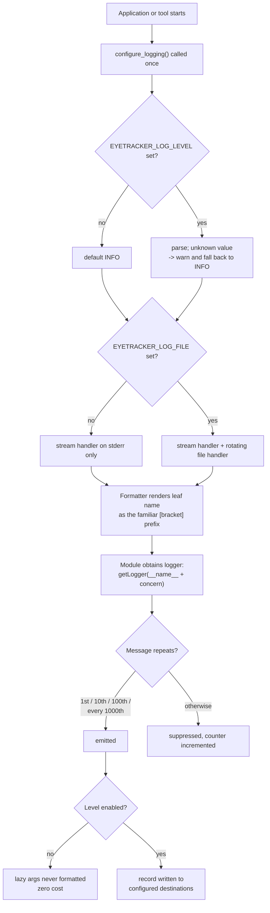

### Story 1.5: Structured logging infrastructure with the bracket convention preserved as logger names

**File**: `docs/plans/stories/epic-1-story-1.5-Logging-Infrastructure.md`
**BUILDID**: CYCLE-1 | **Epic**: 1 - TEST & PACKAGING FOUNDATION | **ID**: 1.5 | **Date**: 2026-08-07 | **Jira**: LOCAL | **GitHub**: #13
**Wave**: 2
**Requires**: [1.2]
**Enables**: []
**Files Touched**:
  - eye_tracker/logging_setup.py
  - tests/unit/test_logging_setup.py
**Roles Ref**: `docs/requirements.md#roles--permissions-matrix` — single-actor, no role variation
**QA Candidate**: No — infrastructure with no user-observable behaviour this cycle. Nothing in the application calls it until CYCLE-4 migrates the 10 `print()` sites, so there is no user-facing change for QA to exercise. Its correctness is covered by unit tests and verified as part of the toolchain in Epic 1 Group 1.

---

#### 👤 User Reference

**Description**:

The application currently reports its problems by printing them to a text stream. That works when you run it from a terminal, and it works not at all in the way people actually run it — a windowed application launched normally has nowhere for that text to go, so it is discarded. Ten such messages exist, and among them are the four places where the camera thread gives up entirely. When a user's camera fails, the application already knows and already says so; the message just goes nowhere.

There is a second problem: the messages have no severity. "Selected camera 0" and "failed to open webcam" are printed identically, so nothing can filter them, and one of them repeats endlessly in a loop while the other happens once.

This story builds the plumbing to fix that: a proper logging setup with severity levels, a destination the operator can choose (screen, a file, or both), and a mechanism that stops a message repeating thirty times a second when a fault persists — it reports the first occurrence, then the tenth, the hundredth, and thereafter only every thousandth, so a persistent problem is visible without drowning everything else.

It deliberately does **not** change any of the ten existing messages. That conversion happens later, in the cycle that also builds the on-screen place for a user to actually see them — moving them now would relocate text from one invisible destination to another while touching six files this cycle promises not to touch.

Two things about names are worth explaining, because they were not as simple as expected. The existing messages tag themselves with a word in square brackets — `[tracker]`, `[calibration]`, `[predict]` — and the plan was to keep those words as the logger names. On inspection, one of those words is used from two different files, and one file uses two different words, so a simple "one name per file" rule would have merged distinct concerns and split a single one. The naming scheme adopted keeps the bracket word while also recording which file it came from, so nothing is lost either way. And the messages will still *display* with their familiar bracket prefix, so nobody has to relearn how to read the output.

Nothing a user of the application would notice changes in this story.

**Acceptance Criteria** (plain-English):

- The application gains a single, shared way to record what it is doing, with severity levels so routine information can be separated from real problems.
- An operator can choose how much detail is recorded and where it goes — the screen, a file, or both — without editing any code.
- A problem that persists does not repeat its message at camera frame rate. It reports the first, tenth and hundredth occurrence, then every thousandth, so it stays visible without swamping everything else.
- Messages still display with the same familiar bracketed word they use today, so existing output remains readable to anyone used to it.
- Recording a message costs nothing measurable when that severity is switched off — the message text is not even assembled.
- Nothing that could identify a person is ever recorded: no images, no facial measurements, no expression data, and no full set of derived numbers except at the most detailed level a person has explicitly asked for.
- There is an automated check that fails if someone later adds a recording call that would leak that kind of data, so the rule is enforced rather than merely written down.
- Recording is safe to do from the background camera thread as well as the main one.
- The ten existing messages are **not** changed by this story, and a written mapping says exactly what each will become when they are converted later.
- Recording nothing anywhere by accident is impossible to miss: if no destination is configured, output still goes somewhere sensible rather than silently vanishing.
- The application itself is unchanged and behaves exactly as before.

**User Flow**:

`Actor: system — no role variation.`

**Flow Diagram**:



---

#### 🤖 AI Agent Reference

> Audience: the DEV agent. The implementation contract — everything needed to build this story in a fresh AI session.

**Must Read**:
- `docs/architecture/design/03-patterns-and-standards-brownfield.md` **§3 Logging Pattern** — the level table, the logger-name list, the DO/DON'T, the never-log table, the rate-limit shape, and the thread-safety rule. This section is the specification.
- `docs/requirements.md` — FR-25, FR-20 (the four silent capture-thread death paths this eventually serves), failure criterion 1
- `eye_tracker/tracker.py:123-163`, `eye_tracker/overlay.py:206-217`, `main.py:56,116` — the 10 existing `print()` sites and their bracket prefixes, read directly
- `docs/architecture/design/02-target-architecture-brownfield.md` — DR-5 (`main.py` becomes a shim; its logic moves to `eye_tracker/app.py` in CYCLE-3), DR-12 (`StatusWindow`, CYCLE-4)
- `SPEC/references/` — **0 files**

**Description**:

FR-25 requires diagnostics to move from `print()` to structured logging with levels and a controllable destination, preserving the existing `[module]` bracket convention as logger names. This story lands the **infrastructure**; patterns §3's Migration Note splits the work across phases M0 (setup, here) and M6 (call sites, CYCLE-4), and this story is the M0 half.

**Why the call sites are deliberately not migrated here.** The 10 `print()` sites live in `main.py`, `eye_tracker/overlay.py` and `eye_tracker/tracker.py` — none of which is in this story's `files_touched`, and all three are modified by CYCLE-3 and CYCLE-4 for other reasons. More importantly, migrating them now would move text from one invisible destination (a discarded stream) to another (a log file nobody is watching). The point of FR-20 is that a user *sees* the failure, and the surface for that is `StatusWindow`, which arrives in CYCLE-4. Landing the plumbing now means CYCLE-4's migration is mechanical.

🔴 **A finding that changes the naming scheme.** Measured directly from source, the 10 sites carry **three** distinct bracket prefixes, and they do not map one-to-one onto modules:

| Prefix | Count | Sites |
|---|---|---|
| `[tracker]` | 5 | `tracker.py:123, 127, 142, 146, 160` |
| `[calibration]` | 4 | **`main.py:56`** and **`overlay.py:206, 212, 217`** |
| `[predict]` | 1 | `main.py:116` |

Two problems fall out, and patterns §3's Migration Note claim that "each site converts one-for-one" does not hold for 4 of the 10:

1. **`[calibration]` spans two modules** — `main.py` and `overlay.py`. A plain `getLogger(__name__)` would split one concern into `eye_tracker.app` and `eye_tracker.overlay`.
2. **`main.py` carries two different prefixes** — `[calibration]` and `[predict]`. A plain `getLogger(__name__)` would merge two distinct concerns into one logger.

Note also that `eye_tracker/calibration.py` — the module whose name matches the `[calibration]` prefix — contains **zero** `print()` sites, so the patterns document's listed logger name `eye_tracker.calibration` would never be emitted by the sites that use that prefix.

**The resolution follows patterns §3's own precedent.** Its logger-name list already contains `eye_tracker.app.predict` — a module segment plus a concern segment. Generalising that: a logger is `f"{__name__}.{concern}"` when a module has more than one concern, and `__name__` alone otherwise. This preserves the bracket word as the leaf (satisfying FR-25 literally), keeps the package as the root so a single `getLogger("eye_tracker").setLevel(...)` controls everything, and lets each concern be filtered independently.

The **display** format then renders the leaf segment in brackets, so `eye_tracker.overlay.calibration` prints as `[calibration] …` — output stays byte-recognisable to anyone used to reading it today, which matters because the deep-dive's diagnostics were read from exactly these lines.

**What this story must NOT build.** Patterns §3 specifies a `QtSignalHandler` that bridges log records to the GUI thread by emitting a signal. It is deliberately **out of scope here**: it has no consumer until `StatusWindow` exists (CYCLE-4), its `__init__` asserts it is constructed on the GUI thread so testing it needs a `QApplication`, and this story must stay independent of Story 1.3's `conftest.py` because they are wave-2 siblings. Building a Qt bridge with nothing on the other end would be scope invented, not delivered.

**Acceptance Criteria** (technical):

1. `eye_tracker/logging_setup.py` exists with a module docstring carrying its `Layer:` declaration.
2. `configure_logging(level=None, log_file=None)` is idempotent: calling it twice does **not** attach duplicate handlers. Verified by asserting the handler count after two calls.
3. Level resolution order: explicit argument → `EYETRACKER_LOG_LEVEL` environment variable → default `INFO`.
4. An unrecognised `EYETRACKER_LOG_LEVEL` value emits a warning and falls back to `INFO`. It must **not** raise, and must **not** silently disable logging — a typo in a diagnostic setting must not make diagnostics vanish.
5. Destination resolution: explicit argument → `EYETRACKER_LOG_FILE` → stderr only. With no configuration at all, records still reach stderr; there is no configuration under which output silently disappears.
6. When a file destination is used, it is a `RotatingFileHandler` with a bounded size and backup count, so a persistent fault cannot fill the disk.
7. ⚠️ Environment variables are the **interim** mechanism, recorded as such in the module docstring: FR-13's configuration layer (`eye_tracker/config.py`, CYCLE-2) becomes the source of truth, and `configure_logging` keeps its explicit arguments precisely so that migration is a call-site change and nothing more. This must not become a permanent parallel configuration system.
8. `get_logger(module_name, concern=None)` returns `logging.getLogger(module_name)` when `concern` is `None`, and `logging.getLogger(f"{module_name}.{concern}")` otherwise.
9. The formatter renders the logger's **final dotted segment** in square brackets, so `eye_tracker.overlay.calibration` displays as `[calibration] …` and `eye_tracker.tracker` as `[tracker] …` — preserving today's readable output.
10. The formatter includes level and timestamp; the message body is unchanged from what the corresponding `print()` produced, so CYCLE-4's migration is verifiable by comparing output text.
11. `rate_limited(logger, code)` returns a logger-like object that emits on the **1st, 10th, 100th, and thereafter every 1000th** call for that `(logger name, code)` pair, exactly as patterns §3 specifies.
12. Rate-limit state is keyed per `(logger name, code)`, so two unrelated messages do not suppress each other.
13. `rate_limited` is **thread-safe** — its counters are mutated from the capture thread and read from the GUI thread. Guarded by a lock, and the lock is documented as the one place in the codebase where shared mutable state across threads is deliberate.
14. A `reset_rate_limits()` helper exists **for tests only**, so counters do not leak between tests; its docstring says it is test-only.
15. All logging call examples use **lazy `%`-style arguments**, never f-strings, so a disabled level costs nothing. Asserted by a test that logs at `DEBUG` while the level is `INFO` and confirms the argument was never formatted.
16. 🔴 **An automated check enforces the never-log table.** A test walks the AST of every module under `eye_tracker/` and `main.py`, finds calls to `.debug/.info/.warning/.error/.critical`, and fails if any argument is a bare name or attribute matching the biometric set — `pts2d`, `blendshapes`, `feat`, `features`, `frame`, `rgb`, `landmarks`, `facial_matrix`. Patterns §3 states the rule; this makes it enforceable rather than aspirational.
17. The check reports the offending file, line and argument name, so a failure is actionable without reading the test.
18. The check has a documented, narrowly-scoped allowance for `DEBUG`-level full-feature-vector logging, which patterns §3 permits — and the allowance must be explicit at the call site, not inferred.
19. 🔴 `logging_setup.py` itself never logs a frame, landmark array, blendshape map or feature vector, and adds no handler that could serialise one.
20. Absolute paths containing the OS username are not logged: the resolved log directory is recorded **once** at configuration time and thereafter only relative names appear. Patterns §3's last never-log row.
21. `tests/unit/test_logging_setup.py` covers: idempotent configuration, level resolution precedence, invalid-level fallback, default-to-stderr, file destination with rotation, the rate-limit sequence, per-key independence, thread-safety under concurrent increment, lazy formatting, and the AST biometric scan.
22. The test module is **self-contained** — it must not use `tests/conftest.py` fixtures, keeping this story parallel to Story 1.3 in wave 2.
23. Tests restore global logging state on teardown; a test must not leave the root logger reconfigured for whatever runs next.
24. 🔴 **The 10 `print()` sites are NOT modified.** `git diff --stat -- main.py eye_tracker/overlay.py eye_tracker/tracker.py` returns empty.
25. The module docstring carries the **migration mapping table** for CYCLE-4 — every one of the 10 sites, its current prefix, and its target logger name — so the later migration is mechanical and reviewable.
26. `ruff check` and `ruff format --check` clean on both new files; all functions annotated, public ones with NumPy docstrings.
27. 🔴 **Zero application source modification** — `git diff --stat -- main.py eye_tracker/` empty apart from the new `logging_setup.py`.

**RBAC Enforcement**:

`No role-differentiated access — single actor.`

- **Enforcement point(s)**: none — this story adds no route, no guard and no request surface.
- **Denied-access contract**: N/A.
- **Scope derivation**: **N/A — no scoped permission exists, and there is no token or session to derive scope from.** The relevant control in this story is **data minimisation, enforced in code**: AC 16's AST scan is the mechanism that stops biometric data reaching a log destination. It is the closest thing to an authorization boundary this story has, and unlike a review rule it fails a build.

**System responses + error cases**:

| Trigger | Response | Side-effect |
|---|---|---|
| `configure_logging()` with no arguments and no environment | Root `eye_tracker` logger at `INFO`, one stderr handler | Handler attached; **nothing silently disabled** (AC 5) |
| `configure_logging()` called a second time (idempotent repeat) | Same handler count as after the first call — no duplication, no doubled output | None (AC 2) |
| `EYETRACKER_LOG_LEVEL=DEBUG` | Level `DEBUG`; per-frame detail permitted | Handler attached at `DEBUG` |
| `EYETRACKER_LOG_LEVEL=VERBOSE` (invalid) | A warning naming the bad value and the fallback; level `INFO` | ⚠️ Does **not** raise and does **not** disable logging — a typo in a diagnostic switch must not remove diagnostics (AC 4) |
| `EYETRACKER_LOG_FILE=/path/app.log` | Stderr handler **plus** a rotating file handler | Log file created; directory logged once, then relative names only (AC 20) |
| `EYETRACKER_LOG_FILE` pointing at an unwritable path | Error reported on stderr; stderr logging continues | ⚠️ Degrades to stderr rather than failing startup — losing diagnostics is worse than losing the file |
| A fault logged through `rate_limited` 5,000 times | Emitted on calls 1, 10, 100, 1000, 2000, 3000, 4000, 5000 | Counter retained per `(logger, code)` |
| Two different `code` values through `rate_limited` | Independent sequences; neither suppresses the other | Two counters (AC 12) |
| `rate_limited` incremented concurrently from capture and GUI threads | No lost counts, no exception | Lock held briefly (AC 13) |
| `log.debug("v %s", feat)` while level is `INFO` | Nothing emitted, and `feat` is **never formatted** | None — lazy args are why this is free (AC 15) |
| A developer adds `log.info("f %s", pts2d)` anywhere in `eye_tracker/` | **Test failure** naming the file, line and argument | None — AC 16 makes the never-log table enforceable |
| Same, but at `DEBUG` with the explicit documented allowance | Permitted | Emitted only when the operator has enabled `DEBUG` (AC 18) |
| `reset_rate_limits()` in a test teardown | Counters cleared | Prevents leakage between tests (AC 14) |
| `python main.py` after this story | Application behaves exactly as before — nothing calls `configure_logging` yet | None (AC 24, AC 27) |

**Prerequisites**:

- **Story 1.2 complete** — `pyproject.toml` and the `dev` extra, so `pytest` runs and `eye_tracker` imports. Also required because ruff's `T20` rule is active from 1.2, which is what makes `print()` in new code a build failure rather than a review note.
- **Not** a prerequisite: Story 1.3's `conftest.py` (AC 22) — wave-2 sibling.
- Nothing else. No camera, no display, no network.

**Context** (read before writing):
- `docs/architecture/design/03-patterns-and-standards-brownfield.md` §3 — the whole section
- `eye_tracker/tracker.py:123-163` — 5 sites, all on the **capture thread**, which is why AC 13 exists
- `eye_tracker/overlay.py:206-217` — 3 sites, all `[calibration]`, all on the GUI thread
- `main.py:56,116` — 2 sites, two different prefixes in one file
- `eye_tracker/tracker.py:159` — `if self._no_face_streak % 90 == 0`, the existing ad-hoc rate limit that `rate_limited` replaces

**Patterns**:
- **Logging** `[New adoption]` — patterns §3. This story implements that section; the level table, logger names, never-log table, rate-limit sequence and thread-safety rule are all taken from it verbatim.
- **Concurrency & Thread Affinity** `[Current — kept]` — patterns §10. The rate limiter's counters are the one place this story introduces shared mutable state across the capture/GUI boundary; it is deliberate, guarded, and documented as such, because failure criterion 10 forbids doing it accidentally.
- **Documentation Standards** `[New adoption]` — patterns §16. The interim nature of the environment-variable mechanism is stated with what replaces it (AC 7), rather than left for a future reader to discover.
- **Factory function for repeated construction** — `get_logger` is that factory, so the naming convention lives in one place instead of being re-derived at 10 call sites.

**Steps**:

1. **Write the module with its migration mapping in the docstring.** The table is the deliverable CYCLE-4 executes against, so it belongs with the code rather than in a separate note.

   ```python
   """Logging configuration for the application and its tools.

   Layer: infrastructure (may import core; imported by entry points)

   Implements docs/architecture/design/03-patterns-and-standards-brownfield.md §3.

   Levels (§3): DEBUG per-frame detail · INFO lifecycle and one-off outcomes ·
   WARNING recovered or degraded (F0/F1) · ERROR the user is being told (F2/F3/F4) ·
   CRITICAL unused in a single-user desktop application.

   Logger names keep the existing bracket words as the LEAF segment, following
   §3's own `eye_tracker.app.predict` precedent. Measured from source, the 10
   print() sites carry three prefixes that do not map one-to-one onto modules:
   `[calibration]` appears in TWO modules, and main.py carries TWO prefixes. A
   plain getLogger(__name__) would therefore split one concern and merge two
   others, so a module with more than one concern appends it.

   CYCLE-4 (FR-25, phase M6) migration mapping — 10 sites:

       main.py:56        [calibration]  -> eye_tracker.app.calibration   WARNING
       main.py:116       [predict]      -> eye_tracker.app.predict       WARNING (rate-limited)
       overlay.py:206    [calibration]  -> eye_tracker.overlay.calibration  WARNING
       overlay.py:212    [calibration]  -> eye_tracker.overlay.calibration  WARNING
       overlay.py:217    [calibration]  -> eye_tracker.overlay.calibration  WARNING
       tracker.py:123    [tracker]      -> eye_tracker.tracker           INFO
       tracker.py:127    [tracker]      -> eye_tracker.tracker           INFO
       tracker.py:142    [tracker]      -> eye_tracker.tracker           ERROR
       tracker.py:146    [tracker]      -> eye_tracker.tracker           ERROR
       tracker.py:160    [tracker]      -> eye_tracker.tracker           WARNING (rate-limited,
                                          replacing the `% 90 == 0` ad-hoc limiter)

   main.py's two entries target `eye_tracker.app.*` because DR-5 moves that logic
   into eye_tracker/app.py in CYCLE-3; if CYCLE-4 runs before that move, they are
   `main.calibration` and `main.predict` instead.

   ⚠️ INTERIM MECHANISM: level and destination come from EYETRACKER_LOG_LEVEL and
   EYETRACKER_LOG_FILE. FR-13's config layer (eye_tracker/config.py, CYCLE-2)
   becomes the source of truth. configure_logging keeps explicit arguments so that
   migration is a call-site change and nothing else. Do not grow this into a
   parallel configuration system.
   """
   ```

2. **Add the bracket-preserving formatter.** The leaf segment is what the operator recognises.

   ```python
   import logging

   class BracketFormatter(logging.Formatter):
       """Renders the logger's final dotted segment as the familiar [prefix].

       `eye_tracker.overlay.calibration` -> `[calibration]`, matching the output
       the pre-migration print() sites produced, so existing operator habits and
       the deep-dive's diagnostic transcripts stay readable.
       """

       def format(self, record: logging.LogRecord) -> str:
           record.bracket = record.name.rsplit(".", 1)[-1]
           return super().format(record)


   _FORMAT = "%(asctime)s %(levelname)-7s [%(bracket)s] %(message)s"
   ```

3. **Add `configure_logging`, idempotent and never silently silent.**

   ```python
   import os
   from logging.handlers import RotatingFileHandler

   _CONFIGURED = False
   _ROOT_NAME = "eye_tracker"


   def configure_logging(level: str | int | None = None, log_file: str | None = None) -> logging.Logger:
       """Configure the application logger tree once.

       Parameters
       ----------
       level : str | int | None
           Explicit level. Falls back to EYETRACKER_LOG_LEVEL, then INFO. An
           unrecognised value warns and uses INFO rather than raising — a typo in
           a diagnostic switch must not remove diagnostics.
       log_file : str | None
           Rotating file destination. Falls back to EYETRACKER_LOG_FILE. When
           absent, records go to stderr only; there is no configuration under
           which output silently vanishes.

       Returns
       -------
       logging.Logger
           The configured `eye_tracker` root logger.
       """
       global _CONFIGURED
       root = logging.getLogger(_ROOT_NAME)
       if _CONFIGURED:
           return root      # idempotent: never attach a second handler set

       resolved = level if level is not None else os.environ.get("EYETRACKER_LOG_LEVEL", "INFO")
       numeric = logging.getLevelNamesMapping().get(str(resolved).upper()) if isinstance(resolved, str) else resolved
       bad_level = numeric is None
       if bad_level:
           numeric = logging.INFO

       root.setLevel(numeric)
       root.propagate = False        # the app owns its tree; don't double-emit via root

       stream = logging.StreamHandler()
       stream.setFormatter(BracketFormatter(_FORMAT))
       root.addHandler(stream)

       destination = log_file if log_file is not None else os.environ.get("EYETRACKER_LOG_FILE")
       if destination:
           try:
               handler = RotatingFileHandler(destination, maxBytes=2_000_000, backupCount=3, encoding="utf-8")
               handler.setFormatter(BracketFormatter(_FORMAT))
               root.addHandler(handler)
               # §3: log the resolved directory ONCE, then relative names only, so
               # no absolute path containing the OS username recurs in the log.
               root.info("logging to %s", os.path.basename(destination))
           except OSError as exc:
               # Degrade to stderr. Losing the file is bad; losing diagnostics is worse.
               root.error("cannot open log file %s: %s", os.path.basename(str(destination)), exc)

       if bad_level:
           root.warning("unrecognised log level %r; using INFO", resolved)

       _CONFIGURED = True
       return root
   ```

   ⚠️ Note the ordering: the bad-level warning is emitted **after** handlers are attached, or it would be swallowed by the very misconfiguration it reports.

4. **Add `get_logger` and the rate limiter.** The lock is the one deliberate piece of shared mutable state across threads in this story, and it is documented as such.

   ```python
   import threading
   from collections import defaultdict

   _counts: dict[tuple[str, str], int] = defaultdict(int)
   # Mutated from the capture thread, read from the GUI thread. This is the ONLY
   # deliberate shared mutable state this module introduces; patterns §10 and
   # failure criterion 10 forbid doing so accidentally, so it is guarded and named.
   _counts_lock = threading.Lock()


   def get_logger(module_name: str, concern: str | None = None) -> logging.Logger:
       """Return the logger for a module, optionally narrowed to one concern.

       A module with a single concern uses its own name; a module with more than
       one appends the concern so the bracket word survives as the leaf segment.
       """
       return logging.getLogger(module_name if concern is None else f"{module_name}.{concern}")


   def should_emit(logger_name: str, code: str) -> bool:
       """True on the 1st, 10th, 100th call, and every 1000th thereafter (§3)."""
       with _counts_lock:
           _counts[(logger_name, code)] += 1
           n = _counts[(logger_name, code)]
       return n in (1, 10, 100) or n % 1000 == 0


   def reset_rate_limits() -> None:
       """Clear all rate-limit counters.

       TEST-ONLY. Application code must never call this: resetting a counter
       mid-session would make a persistent fault re-announce itself at frame rate,
       which is the behaviour the limiter exists to prevent. Tests need it so
       counters do not leak between cases.
       """
       with _counts_lock:
           _counts.clear()
   ```

5. **Write the AST biometric scan.** Patterns §3 states the never-log table; this converts it into a failing test. It is the highest-value part of the story because it is the only part that keeps working after everyone has forgotten the rule.

6. **Run the gate**, including the check that the existing sites are untouched:

   ```bash
   ruff check eye_tracker/logging_setup.py tests/unit/test_logging_setup.py
   ruff format --check eye_tracker/logging_setup.py tests/unit/test_logging_setup.py
   pytest tests/unit/test_logging_setup.py -v
   git diff --stat -- main.py eye_tracker/overlay.py eye_tracker/tracker.py   # MUST be empty
   ```

**Tests**:

```python
# tests/unit/test_logging_setup.py
"""Tests for the logging infrastructure.

Layer: test

Self-contained: uses no tests/conftest.py fixture, keeping this story parallel to
Story 1.3 within wave 2. No Qt, no camera, no network.
"""
import ast
import logging
import pathlib
import threading

import pytest

import eye_tracker.logging_setup as ls

BIOMETRIC_NAMES = {"pts2d", "blendshapes", "feat", "features", "frame", "rgb",
                   "landmarks", "facial_matrix"}
LOG_METHODS = {"debug", "info", "warning", "error", "critical", "exception"}


@pytest.fixture(autouse=True)
def _restore_logging_state():
    """Never leave the root logger reconfigured for whatever runs next."""
    root = logging.getLogger("eye_tracker")
    saved_handlers, saved_level = list(root.handlers), root.level
    ls._CONFIGURED = False
    ls.reset_rate_limits()
    yield
    root.handlers[:] = saved_handlers
    root.setLevel(saved_level)
    ls._CONFIGURED = False
    ls.reset_rate_limits()


def test_configure_is_idempotent():
    first = len(ls.configure_logging().handlers)
    ls._CONFIGURED = True
    second = len(ls.configure_logging().handlers)
    assert first == second


def test_explicit_level_wins_over_environment(monkeypatch):
    monkeypatch.setenv("EYETRACKER_LOG_LEVEL", "ERROR")
    assert ls.configure_logging(level="DEBUG").level == logging.DEBUG


def test_environment_level_is_used_when_no_argument(monkeypatch):
    monkeypatch.setenv("EYETRACKER_LOG_LEVEL", "WARNING")
    assert ls.configure_logging().level == logging.WARNING


def test_invalid_level_falls_back_to_info_without_raising(monkeypatch, caplog):
    monkeypatch.setenv("EYETRACKER_LOG_LEVEL", "VERBOSE")
    root = ls.configure_logging()
    assert root.level == logging.INFO
    assert any("unrecognised log level" in r.message for r in caplog.records)


def test_default_destination_is_stderr_not_silence():
    root = ls.configure_logging()
    assert any(isinstance(h, logging.StreamHandler) for h in root.handlers)


def test_file_destination_rotates(tmp_path):
    target = tmp_path / "app.log"
    root = ls.configure_logging(log_file=str(target))
    from logging.handlers import RotatingFileHandler
    handlers = [h for h in root.handlers if isinstance(h, RotatingFileHandler)]
    assert len(handlers) == 1
    assert handlers[0].maxBytes > 0 and handlers[0].backupCount > 0


def test_unwritable_file_degrades_to_stderr(tmp_path):
    """Losing the file is bad; losing diagnostics is worse."""
    root = ls.configure_logging(log_file=str(tmp_path / "no_such_dir" / "app.log"))
    assert any(isinstance(h, logging.StreamHandler) for h in root.handlers)


def test_bracket_formatter_renders_leaf_segment():
    record = logging.LogRecord("eye_tracker.overlay.calibration", logging.WARNING,
                              __file__, 1, "msg", None, None)
    out = ls.BracketFormatter(ls._FORMAT).format(record)
    assert "[calibration]" in out


def test_get_logger_appends_concern_only_when_given():
    assert ls.get_logger("eye_tracker.tracker").name == "eye_tracker.tracker"
    assert ls.get_logger("eye_tracker.app", "predict").name == "eye_tracker.app.predict"


def test_rate_limit_sequence_matches_the_specified_pattern():
    emitted = [n for n in range(1, 5001) if ls.should_emit("L", "code")]
    assert emitted[:4] == [1, 10, 100, 1000]
    assert 2000 in emitted and 5000 in emitted
    assert 500 not in emitted


def test_rate_limit_keys_are_independent():
    assert ls.should_emit("L", "a") is True
    assert ls.should_emit("L", "b") is True      # not suppressed by 'a'


def test_rate_limit_is_thread_safe():
    """Counters are incremented from the capture thread and read from the GUI thread."""
    def hammer():
        for _ in range(1000):
            ls.should_emit("L", "concurrent")
    threads = [threading.Thread(target=hammer) for _ in range(4)]
    for t in threads:
        t.start()
    for t in threads:
        t.join()
    assert ls._counts[("L", "concurrent")] == 4000      # no lost increments


def test_disabled_level_never_formats_its_arguments():
    """Lazy %-args are why a disabled DEBUG call is free."""
    class Exploding:
        def __str__(self):
            raise AssertionError("argument was formatted despite the level being off")

    root = ls.configure_logging(level="INFO")
    root.debug("value %s", Exploding())      # must not raise


def test_no_biometric_argument_is_passed_to_any_logging_call():
    """Enforces the patterns §3 never-log table across the whole package.

    This is the part of the story that still works after everyone has forgotten
    the rule.
    """
    repo = pathlib.Path(__file__).resolve().parents[2]
    offenders = []
    targets = list((repo / "eye_tracker").rglob("*.py")) + [repo / "main.py"]
    for path in targets:
        tree = ast.parse(path.read_text(encoding="utf-8"), filename=str(path))
        for node in ast.walk(tree):
            if not (isinstance(node, ast.Call) and isinstance(node.func, ast.Attribute)):
                continue
            if node.func.attr not in LOG_METHODS:
                continue
            for arg in node.args:
                name = (arg.id if isinstance(arg, ast.Name)
                        else arg.attr if isinstance(arg, ast.Attribute) else None)
                if name in BIOMETRIC_NAMES:
                    offenders.append(f"{path.name}:{node.lineno} passes {name!r}")
    assert offenders == [], (
        "Biometric data must never reach a log destination (patterns §3). "
        f"Offenders: {offenders}"
    )
```

Manual test cases:

| # | Scenario | Expected |
|---|---|---|
| 1 | `EYETRACKER_LOG_LEVEL=DEBUG python -c "from eye_tracker.logging_setup import configure_logging as c; c().debug('hi')"` | `[logging_setup] hi` style line on stderr with level and timestamp |
| 2 | `EYETRACKER_LOG_LEVEL=NONSENSE` same command | Warning about the bad value, then output at `INFO` — **not** silence |
| 3 | `EYETRACKER_LOG_FILE=./x.log` | File created; the log records the **basename** only, never the absolute path |
| 4 | Point `EYETRACKER_LOG_FILE` at an unwritable directory | Error on stderr, stderr logging still works |
| 5 | Call `configure_logging()` twice | Output appears once per message, not twice |
| 6 | Add `log.info("f %s", pts2d)` to any module and run the suite | The AST test fails, naming file, line and argument |
| 7 | `git diff --stat -- main.py eye_tracker/overlay.py eye_tracker/tracker.py` | Empty — the 10 sites are untouched |
| 8 | `python main.py` | Application behaves exactly as before |

**Quality**: `ruff check` / `ruff format --check` clean · annotated, NumPy docstrings on public functions · functions ≤30 lines · no `print()` (T20 active) · no `TODO`/`FIXME` · interim mechanism marked interim with its replacement named · zero application source modification.

**OUT**:
- ❌ **Migrating any of the 10 `print()` sites** — CYCLE-4 (FR-25, phase M6). The mapping table lands here; the edits do not. Those three files are outside this story's `files_touched`.
- ❌ **The `QtSignalHandler` Qt bridge** from patterns §3 — deferred to CYCLE-4, where `StatusWindow` gives it a consumer. Building a bridge with nothing on the far end, and needing a `QApplication` to test it, would break this story's wave-2 independence for no delivered value.
- ❌ Reading configuration from `eye_tracker/config.py` — that module arrives in CYCLE-2 (FR-13). Environment variables are explicitly the interim mechanism.
- ❌ An in-memory ring buffer for `DEBUG` records — patterns §3 mentions one; it belongs with the `StatusWindow` counters in CYCLE-4.
- ❌ Removing `tracker.py:159`'s `% 90 == 0` ad-hoc rate limit — `rate_limited` replaces it during CYCLE-4's migration, not here.
- ❌ Structured/JSON log output — nothing consumes it; FR-25 asks for levels and a controllable destination.
- ❌ Using `tests/conftest.py` — wave-2 sibling (AC 22).

**Evidence**:
- `pytest tests/unit/test_logging_setup.py -v` output showing all 14 tests passing.
- `ruff check` and `ruff format --check` output on both new files.
- Transcript of manual case 2 (invalid level) showing the warning **and** that logging still works — the failure mode where a typo silently disables diagnostics is the one worth proving absent.
- Transcript of manual case 6: deliberately add `log.info("f %s", pts2d)` to a module, show the AST test failing with file/line/argument, then revert. A guard that has never been seen to fail is not known to work.
- `git diff --stat -- main.py eye_tracker/overlay.py eye_tracker/tracker.py` showing empty.
- The final module docstring, including the 10-site migration mapping table CYCLE-4 will execute against.
