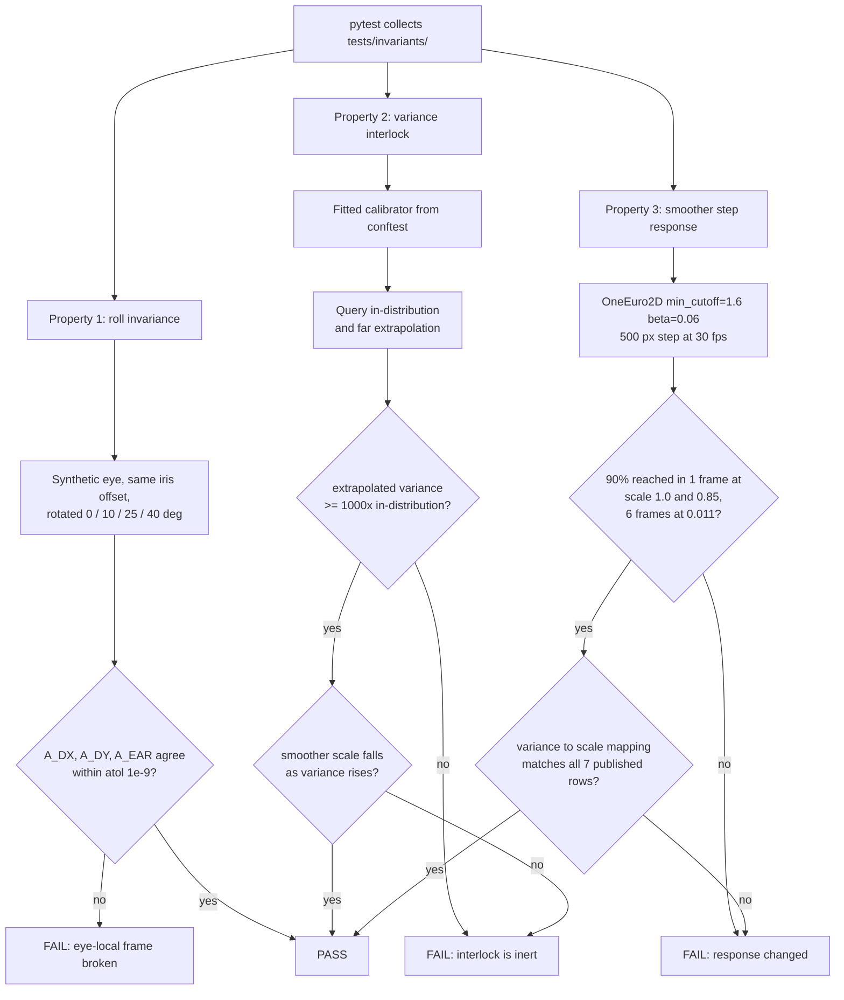

### Story 1.6: Invariant locks for the three verified-correct behaviours reachable without hardware

**File**: `docs/plans/stories/epic-1-story-1.6-Invariant-Locks.md`
**BUILDID**: CYCLE-1 | **Epic**: 1 - TEST & PACKAGING FOUNDATION | **ID**: 1.6 | **Date**: 2026-08-07 | **Jira**: LOCAL | **GitHub**: LOCAL
**Wave**: 3
**Requires**: [1.3]
**Enables**: []
**Files Touched**:
  - tests/invariants/test_roll_invariance.py
  - tests/invariants/test_variance_interlock.py
  - tests/invariants/test_smoother_step_response.py
  - tests/conftest.py
**Roles Ref**: `docs/requirements.md#roles--permissions-matrix` — single-actor, no role variation
**QA Candidate**: No — regression guards with no user-observable behaviour and no application code path. Nothing about the application changes; these tests protect behaviours that already work. QA verifies them as part of the toolchain in Epic 1 Group 1, specifically by perturbing each measured quantity and confirming the corresponding test fails.

---

#### 👤 User Reference

**Description**:

The earlier analysis of this codebase found a lot that was wrong, but it also found three things that are genuinely, measurably right — and those are just as much at risk. The next four cycles rewrite the head-angle calculation, the calibration lifecycle, the failure handling and the persistence layer. Any of those changes could break one of the three good properties as a side effect, and because they are properties rather than features, nobody would notice until accuracy quietly got worse.

The three properties are:

**One** — the eye measurements do not care how far your head is tilted. The system works out where your iris sits inside your eye using an axis derived from that eye's own corners, not from the image edges, so tilting your head rotates the measuring frame along with the eye. Tilt your head 40° and the numbers come out the same. That is why tilting your head does not throw the gaze estimate off.

**Two** — the system knows when it is guessing. When you look somewhere it has never been calibrated for, its own uncertainty estimate rises enormously, and that uncertainty is fed into the smoothing so the pointer becomes very sluggish rather than flying off to a wrong place. This is a safety property: it fails by slowing down rather than by lying confidently.

**Three** — the smoothing is genuinely fast when it needs to be. When your gaze jumps a long way, the pointer reaches 90% of the distance in a single frame. Even in its heaviest smoothing mode it gets there in six frames, about a fifth of a second, rather than crawling.

This story writes tests that lock all three, using the exact figures the earlier analysis measured, so that if a later change breaks one, a test fails immediately and names what changed.

Two of the figures needed correcting, and the corrections are recorded rather than glossed over. The tilt property was described as giving "bit-identical" results, but measured, the numbers agree to about fifteen decimal places rather than exactly — so the test checks agreement to nine decimal places, which is the tolerance the analysis's own draft test used. And the smoothing speed figures only reproduce with the tuning the application actually runs with, not with the built-in defaults; a test using the defaults would measure something different and fail for the wrong reason.

Nothing a user of the application would notice changes.

**Acceptance Criteria** (plain-English):

- Three tests exist, one per protected property, and all pass.
- Each test is proven to work by deliberately breaking the thing it protects and watching it fail.
- The tilt test checks the eye measurements are unchanged across a range of head tilts, to the precision the original analysis used — not to exact equality, which measurement shows would fail.
- The uncertainty test confirms that asking about a place far outside what was calibrated produces vastly greater uncertainty than asking about a calibrated place, and that the smoothing responds by becoming heavier.
- The uncertainty test does not depend on the exact numbers from the original analysis, because those came from real calibration data and this test uses manufactured data — it checks the relationship holds, not that specific values recur.
- The smoothing test checks the exact published speed figures, using the same tuning the application really runs with, and says plainly that the figures are tied to that tuning.
- Separately, the conversion from uncertainty to smoothing strength is checked against every value in the published table, since that piece is pure arithmetic and reproduces exactly.
- Each test names, in its own text, which document recorded the property and what it protects, so a future failure is understandable without archaeology.
- Where a test's figures depend on tuning values, it says so — and says that a deliberate re-tune means re-measuring and updating the figure, not deleting the test.
- None of the tests needs a camera, a screen or an internet connection.
- The application itself is unchanged and behaves exactly as before.

**User Flow**:

`Actor: system — no role variation.`

**Flow Diagram**:



---

#### 🤖 AI Agent Reference

> Audience: the DEV agent. The implementation contract — everything needed to build this story in a fresh AI session.

**Must Read**:
- `docs/requirements.md` — **FR-29** (the requirement), **failure criterion 5** (the enumerated behaviours that must not regress)
- `docs/architecture/current/01-gaze-deep-dive.md` **lines 85-93** — the roll-invariance verification table and, at **lines 364-369**, its own draft test using `atol=1e-9`
- `docs/architecture/current/02-calibration-deep-dive.md` **lines 264-277** — the variance-interlock measurements (18–23 px in-distribution, 6076–9559 px extrapolating, scale 0.85 → 0.011)
- `docs/architecture/current/06-one-euro-deep-dive.md` **lines 140-160** — the step-response table and the variance→`cutoff_scale` table
- `main.py:35` — `OneEuro2D(min_cutoff=1.6, beta=0.06)`, the tuning every figure depends on
- `eye_tracker/one_euro.py` — `_alpha`, `_OneEuro1D.__call__`, `OneEuro2D.filter`
- `eye_tracker/calibration.py:230-257` — `predict_with_variance` and the fusion
- `docs/architecture/design/02-target-architecture-brownfield.md` — Test Architecture, which names the five behaviours FR-29 protects
- `SPEC/references/` — **0 files**

**Description**:

FR-29 requires the verified-correct behaviours to be locked by tests "so remediation cannot silently regress them". This story locks the three reachable **without hardware**; the remaining two named by the architecture — atomic model download, and camera selection preferring face detection over brightness — need a network and a camera and belong to CYCLE-5's FR-29 completion.

The reason this matters is sequencing. CYCLE-2 rewrites head-pose extraction and both frame gates, CYCLE-3 rewrites the calibration lifecycle, CYCLE-4 rewrites the live pipeline, CYCLE-5 adds persistence. Any of them could break a property as a side effect, and a *property* regression is invisible: no error, no crash, just quietly worse accuracy. These three tests are the tripwires.

🔧 **Three figures were checked against the real code before this story was written, and two needed correcting.** Locking a wrong number is worse than locking nothing, because the test then fails for the wrong reason and gets deleted.

**Correction 1 — roll invariance is not bit-identical; it is identical to ~15 decimal places.** `01-gaze-deep-dive.md:85` says *"produced bit-identical values"* and shows a table to 9 dp. Measured with a rotation-constructed synthetic eye, `A_DX` and `A_DY` differ across rotations by up to **8.3e-15** — floating-point rounding from the rotation itself, not a broken invariant. An `==` assertion **would fail**. Note the deep-dive's own draft test at line 369 already uses `np.testing.assert_allclose(..., atol=1e-9)` and its verification table at line 401 says "Bit-identical **to 9 dp**" — so the prose is loose and the tolerance is the authoritative part. Use `atol=1e-9`, exactly as the draft does.

**Correction 2 — the step-response figures only reproduce with the configured tuning, not the class defaults.** `one_euro.py` defaults are `min_cutoff=1.0, beta=0.007`, but `main.py:35` constructs `OneEuro2D(min_cutoff=1.6, beta=0.06)`, and every figure in `06-one-euro-deep-dive.md` is measured against **1.6 / 0.06 with a 500 px step at 30 fps**. Reproduced exactly at those values:

| `cutoff_scale` | Frames to 90% of a 500 px step | Deep-dive claim |
|---|---|---|
| 1.0 | **1** | 1 ✅ |
| 0.85 | **1** | 1 ✅ |
| 0.011 | **6** | 6 ✅ |

Per-frame values also match the deep-dive table: 356.6 px at frame 3 and 463.5 px at frame 6 against its recorded 356.56 and 463.51. With the **class defaults** the same measurement gives 2 frames at scale 1.0 and never reaches 90% within 14 frames at 0.011 — so a test that writes `OneEuro2D()` locks a different filter and fails for a reason that has nothing to do with a regression.

**Correction 3 — the interlock's absolute figures cannot be asserted against synthetic data.** `02-calibration-deep-dive.md` measured 18–23 px in-distribution and 6076–9559 px extrapolating, from a **25-target real** calibration. Measured against a synthetic grid built by the Story 1.3 fixture:

| Grid | σ in-distribution | σ far extrapolation | variance ratio |
|---|---|---|---|
| 3×3 (9 rows) | 0.133 px | 55.5 px | 174,000× |
| 5×5 (25 rows) | 0.097 px | 18.5 px | 36,000× |

The **property** holds emphatically — enormous variance inflation out of distribution — but the absolute values are two orders of magnitude below the real-data figures, because synthetic targets are noiseless and perfectly regular. Asserting "σ between 18 and 23 px" or "scale ≤ 0.011" against this fixture **would fail**. So the interlock is locked as a **relationship**: extrapolation inflates variance by at least 1000×, and the smoother's scale falls monotonically as variance rises.

The absolute mapping is then locked **separately and exactly**, because the variance→`cutoff_scale` conversion is pure arithmetic with no GP involved. All **7 rows** of `06-one-euro-deep-dive.md`'s table reproduce to 5 dp — including `138 px² → 0.80975` and `3.07e7 px² → 0.00894`. That test carries the real-data figures without depending on a fitted model, which is where the deep-dive's numbers genuinely belong.

**Acceptance Criteria** (technical):

1. `tests/invariants/test_roll_invariance.py`, `test_variance_interlock.py` and `test_smoother_step_response.py` each exist with a module docstring carrying `Layer: test` **and** a citation naming the deep-dive document and section that recorded the property.
2. Each module docstring states **what regression the test would catch** and which later cycle is most likely to cause it, so a future failure is diagnosable without archaeology.
3. **Roll invariance**: the same synthetic eye geometry, same iris offset, evaluated at roll **0°, 10°, 25° and 40°** — the deep-dive's own rotation set — asserting `A_DX`, `A_DY` and `A_EAR` (indices 0, 1, 6) agree with the 0° case.
4. 🔴 The roll assertion uses `np.testing.assert_allclose(..., atol=1e-9)`. **Exact equality is forbidden** — measured drift is up to 8.3e-15, and a comment must record that figure so nobody "tightens" the tolerance back to `==`.
5. The roll test also covers **negative** rotations (−25°, −40°), which the deep-dive did not: a sign error in the eye-local `v` axis would pass a positive-only sweep.
6. The roll test asserts the property at a **non-zero** iris offset. At `iris_dx=0, iris_dy=0` every value is zero and the test would pass against a completely broken implementation.
7. **Variance interlock**: uses the session-scoped `fitted_calibrator` fixture from Story 1.3, queries an in-distribution point and a far extrapolation, and asserts the extrapolated mean `fused_var` is at least **1000×** the in-distribution value.
8. 🔴 The interlock test asserts **no absolute px figures**. A comment records the measured synthetic values (σ 0.10–0.13 px in-distribution, 18–55 px extrapolating) alongside the deep-dive's real-data values (18–23 px and 6076–9559 px), and states that the divergence is expected because synthetic targets are noiseless — so nobody later "fixes" the test by pasting the real-data numbers in.
9. The interlock test asserts the smoother's `cutoff_scale` is **strictly lower** for the extrapolated variance than for the in-distribution variance — the behavioural consequence, which is what failure criterion 5 actually protects.
10. **Variance→scale mapping**: a separate test asserts all **7** rows of `06-one-euro-deep-dive.md`'s table to `abs=5e-6`: `0→1.00000`, `100→0.83333`, `138→0.80975`, `201→0.77909`, `2500→0.50000`, `100000→0.13653`, `3.07e7→0.00894`.
11. The mapping test drives the **real** `OneEuro2D` code path, not a re-implemented formula — a test that re-derives the arithmetic locks the test's copy rather than the product.
12. **Step response**: `OneEuro2D(min_cutoff=1.6, beta=0.06)`, a **500 px** step at **30 fps**, asserting **1** frame to 90% at `cutoff_scale` 1.0 and 0.85, and **6** frames at 0.011.
13. 🔴 The step-response test constructs the filter with the **configured** tuning explicitly and never relies on the class defaults, with a comment naming `main.py:35` as the origin of those values.
14. ⚠️ The step-response module docstring states that the figures are **tied to the tuning**, and that a deliberate re-tune under FR-13 (CYCLE-2 moves these constants into `config.py`) requires **re-measuring and updating the locked figures** — not deleting the test. Without this note the test reads as an obstacle to legitimate tuning and gets removed.
15. `cutoff_scale` is driven through the public `filter(...)` API by supplying the `variance` that yields the target scale, with the inversion documented — not by calling the private `_OneEuro1D` directly, which would test a different surface from the one the application uses.
16. Fixtures needed by more than one invariant test are added to `tests/conftest.py`; single-use helpers stay local to their module. ⚠️ `tests/conftest.py` is a `shared_files` entry — Stories 1.3 and 2.3 also touch it, in waves 2 and 5, so no concurrent modification arises, but additions must be **additive** and must not alter existing fixture signatures.
17. Every test completes without a camera, a display or a network.
18. The three tests plus the mapping test total no more than a few seconds, reusing the session-scoped calibrator rather than fitting per test.
19. `ruff check` and `ruff format --check` clean; helpers annotated with NumPy docstrings on the public ones.
20. 🔴 **Zero application source modification** — `git diff --stat -- main.py eye_tracker/` empty.
21. The measured discrepancies in Corrections 1–3 are reported to the architecture owner as a documentation note, so `01-gaze-deep-dive.md`'s "bit-identical" wording and the tuning-dependence of `06`'s figures can be corrected at source.

**RBAC Enforcement**:

`No role-differentiated access — single actor.`

- **Enforcement point(s)**: none — regression tests add no route, no guard and no runtime code path.
- **Denied-access contract**: N/A — no request surface exists.
- **Scope derivation**: **N/A — no scoped permission exists, and there is no token or session to derive scope from.** The relevant discipline here is data minimisation, already binding via patterns §3: these tests handle synthetic landmark arrays and must not print or persist them, including on failure — an assertion message that dumps a 478×2 array would violate the never-log rule at exactly the moment someone copies it into a bug report.

**System responses + error cases**:

| Trigger | Response | Side-effect |
|---|---|---|
| `pytest tests/invariants/` on the current code | All pass in a few seconds | None |
| Repeat run (idempotent) | Identical results — synthetic builders are deterministic and the calibrator is fitted once per session | None |
| Someone changes the eye-local `v` axis derivation in `_eye_geometry` | Roll test **FAILS**, naming the rotation at which agreement broke | None |
| Someone flips the sign of the eye-local `v` axis | Roll test **FAILS** — but only because AC 5 includes negative rotations; a positive-only sweep would pass | None |
| Roll test run at `iris_dx=0, iris_dy=0` | Would pass against a broken implementation — which is why AC 6 forbids it | None. The trap this AC closes |
| Tolerance "tightened" to `==` | **FAILS** at ~8e-15 drift, on correct code | None. AC 4's comment exists to prevent this |
| Someone removes `return_std` from the fusion, or clamps variance | Interlock test **FAILS** on the ratio assertion | None |
| Someone changes `variance_scale=50.0` in `OneEuro2D` | Mapping test **FAILS** on all 7 rows, naming expected vs computed | None |
| Someone re-tunes `min_cutoff`/`beta` deliberately under FR-13 | Step-response test **FAILS** | ⚠️ Correct behaviour, but the docstring must say the fix is to **re-measure and update the figures**, not delete the test (AC 14) |
| Step-response test written with `OneEuro2D()` defaults | Would measure 2 frames at scale 1.0 and never reach 90% at 0.011 — **fails for the wrong reason** | None. AC 13 forbids it |
| Interlock test asserting the deep-dive's absolute px figures | Would **fail** against synthetic data (σ 0.10 vs 18–23 px) | None. AC 8 forbids it and records why |
| A test calls `fit()` on the session `fitted_calibrator` | Not prevented; would corrupt later tests | ⚠️ Documented hazard inherited from Story 1.3's fixture |
| `python main.py` after this story | Application behaves exactly as before | None (AC 20) |

**Prerequisites**:

- **Story 1.3 complete** — `synthetic_pts2d`, `mesh_result` and the session-scoped `fitted_calibrator` fixtures, plus `tests/invariants/`. This story is the first real consumer of those fixtures, so it is also where a defect in them surfaces.
- ⚠️ Story 1.3's `synthetic_pts2d` builder must satisfy its own AC 6 (a centred iris returns `dx`/`dy` within 1e-9 of zero at any roll). If it does not, the roll test here is circular — it would be measuring the builder's rotation, not the production eye-local frame.
- No camera, no display, no network.

**Context** (read before writing):
- `eye_tracker/gaze.py:79-115` — `_eye_geometry`, and specifically lines 90-95 where `v` is derived perpendicular to `u` and sign-corrected against the lid vector. That is the mechanism roll invariance rests on
- `eye_tracker/one_euro.py:12-14` (`_alpha`), `:26-38` (`_OneEuro1D.__call__`), `:50-63` (`OneEuro2D.filter` and the variance→scale conversion at line 58)
- `eye_tracker/calibration.py:230-257` — `predict_with_variance`, the inverse-variance fusion, and the `1e-6` variance floor
- `main.py:35` — the configured tuning
- `docs/architecture/current/01-gaze-deep-dive.md:85-93, 364-369, 401`
- `docs/architecture/current/02-calibration-deep-dive.md:264-277`
- `docs/architecture/current/06-one-euro-deep-dive.md:140-160, 417`

**Patterns**:
- **Testing Patterns** `[New adoption]` — patterns §15. Invariant tests live in `tests/invariants/`; names state the behaviour so a failure report is self-explanatory.
- **Cite the algorithm, state the behaviour** — `06-one-euro-deep-dive.md` Pattern 1. Each test cites the document that measured the property, which is what makes a future failure interpretable.
- **Numerical Guards** `[Current — kept]` — patterns §11. The tolerance choice in AC 4 is a numerical-guard decision, not a tunable: it is set by measured float64 behaviour, not by preference.
- **Documentation Standards** `[New adoption]` — patterns §16. AC 14's re-tune note is exactly the "say what would settle or change this" rule.

**Steps**:

1. **Lock roll invariance**, at the deep-dive's tolerance and with the two gaps it left closed.

   ```python
   """Eye-local geometry is invariant to in-plane head rotation.

   Layer: test

   Recorded in docs/architecture/current/01-gaze-deep-dive.md:85-93 and protected
   by FR-29 / failure criterion 5. The mechanism is gaze.py:90-95: the eye's
   vertical axis `v` is derived perpendicular to the outer->inner corner vector, so
   the measuring frame rotates with the eye rather than with the image.

   WHAT A FAILURE HERE MEANS: iris offsets have started depending on head tilt,
   so a user who tilts their head gets a wrong gaze estimate with no error. Most
   likely cause: a change to _eye_geometry's axis derivation. CYCLE-2 (FR-1/FR-2)
   is the cycle most likely to touch that neighbourhood.
   """
   import numpy as np

   from eye_tracker.gaze import FEATURE_A_DX, FEATURE_A_DY, FEATURE_A_EAR, extract_gaze_features

   # The deep-dive's own rotation set, plus negatives it did not cover.
   ROTATIONS = (10.0, 25.0, 40.0, -25.0, -40.0)

   # 01-gaze-deep-dive.md:85 says "bit-identical"; :401 says "bit-identical to 9 dp"
   # and its draft test at :369 uses atol=1e-9. Measured drift across these
   # rotations is up to 8.3e-15 — real float64 rounding from the rotation itself,
   # not a broken invariant. DO NOT tighten this to `==`: it would fail on correct
   # code. 1e-9 is the authoritative tolerance.
   ATOL = 1e-9


   def test_eye_local_frame_is_roll_invariant(synthetic_pts2d, mesh_result):
       # A NON-ZERO offset is essential: at dx=dy=0 every value is zero and this
       # test would pass against a completely broken implementation.
       kwargs = {"iris_dx": 0.25, "iris_dy": -0.15}
       base = extract_gaze_features(mesh_result(pts2d=synthetic_pts2d(**kwargs)))
       indices = [FEATURE_A_DX, FEATURE_A_DY, FEATURE_A_EAR]
       for roll in ROTATIONS:
           rotated = extract_gaze_features(
               mesh_result(pts2d=synthetic_pts2d(roll_deg=roll, **kwargs))
           )
           np.testing.assert_allclose(
               rotated[indices], base[indices], atol=ATOL,
               err_msg=f"eye-local frame is not roll-invariant at {roll}deg",
           )
   ```

   ⚠️ The `err_msg` names the failing rotation and nothing else — deliberately. Dumping the landmark array would violate patterns §3's never-log rule at the exact moment someone pastes it into a bug report.

2. **Lock the variance interlock as a relationship, not as absolute values.**

   ```python
   """Out-of-distribution input inflates predictive variance, which the smoother
   converts into heavy smoothing rather than a confident wrong answer.

   Layer: test

   Recorded in docs/architecture/current/02-calibration-deep-dive.md:264-277 and
   protected by FR-29 / failure criterion 5 ("the out-of-distribution variance
   interlock stops clamping").

   WHY NO ABSOLUTE FIGURES ARE ASSERTED. The deep-dive measured 18-23 px
   in-distribution and 6076-9559 px extrapolating, from a 25-target REAL
   calibration. Against the synthetic fixture the same query gives 0.10-0.13 px
   and 18-55 px — two orders of magnitude lower, because synthetic targets are
   noiseless and perfectly regular. The PROPERTY holds emphatically (a variance
   ratio of 36,000x at 25 rows, 174,000x at 9), so the ratio is what is locked.
   Do NOT "fix" this test by pasting the real-data numbers in; they belong to a
   different input distribution. The real-data values ARE locked exactly, in
   test_smoother_step_response.py, where the mapping needs no fitted model.

   WHAT A FAILURE HERE MEANS: the uncertainty channel has gone inert, so
   extrapolated gaze would be served with normal smoothing and the dot would fly
   to a garbage location confidently. Most likely cause: a change to the fusion
   or the variance floor in calibration.py:250-256.
   """
   MIN_VARIANCE_INFLATION = 1000.0    # measured 36,000x (25 rows) / 174,000x (9 rows)
   ```

   The test then: takes `fitted_calibrator`, queries a training-centre feature vector and a far extrapolation (an iris offset well outside the fitted range), asserts `mean(var_out) >= MIN_VARIANCE_INFLATION * mean(var_in)`, and asserts the resulting `OneEuro2D` scale is strictly lower for the extrapolated variance. Record both measured variances in the assertion message so a failure shows how far it moved.

3. **Lock the step response and the variance→scale mapping**, both against the configured tuning.

   ```python
   """The smoother is fast when it needs to be, and its variance response is exact.

   Layer: test

   Recorded in docs/architecture/current/06-one-euro-deep-dive.md:140-160, 417 and
   protected by FR-29 / failure criterion 5.

   🔴 THE FIGURES ARE TIED TO THE TUNING. Every number below was measured with
   min_cutoff=1.6, beta=0.06 — the values main.py:35 constructs — and a 500 px step
   at 30 fps. The CLASS DEFAULTS are min_cutoff=1.0, beta=0.007, which give 2 frames
   at scale 1.0 and never reach 90% within 14 frames at 0.011. A test written with
   OneEuro2D() locks a different filter and fails for a reason unrelated to any
   regression.

   ⚠️ IF THE TUNING IS DELIBERATELY CHANGED — FR-13 moves these constants into
   config.py in CYCLE-2 — this test WILL fail. The correct response is to
   re-measure and update the figures here, recording the new values and why they
   changed. It is NOT to delete the test: the point is that a change in response
   is a decision, not an accident.
   """
   import math

   from eye_tracker.one_euro import OneEuro2D

   MIN_CUTOFF, BETA = 1.6, 0.06     # main.py:35
   STEP_PX, FPS = 500.0, 30.0       # 06-one-euro-deep-dive.md:140-146

   # 06-one-euro-deep-dive.md:152-160, all seven rows.
   VARIANCE_TO_SCALE = (
       (0.0, 1.00000), (100.0, 0.83333), (138.0, 0.80975), (201.0, 0.77909),
       (2500.0, 0.50000), (100000.0, 0.13653), (3.07e7, 0.00894),
   )


   def _variance_for_scale(scale: float, variance_scale: float = 50.0) -> float | None:
       """Invert scale = 1 / (1 + sqrt(var) / variance_scale).

       The target cutoff_scale is reached through the PUBLIC filter() API by
       supplying the variance that produces it, rather than by calling the private
       _OneEuro1D — so the test exercises the surface the application uses.
       """
       if scale >= 1.0:
           return None
       return ((1.0 / scale - 1.0) * variance_scale) ** 2


   def _frames_to_90_percent(scale: float) -> int:
       smoother = OneEuro2D(min_cutoff=MIN_CUTOFF, beta=BETA)
       variance = _variance_for_scale(scale)
       dt, t = 1.0 / FPS, 0.0
       smoother.filter(0.0, 0.0, variance=variance, t=t)      # seed at the origin
       for frame in range(1, 15):
           t += dt
           x, _ = smoother.filter(STEP_PX, 0.0, variance=variance, t=t)
           if x >= 0.9 * STEP_PX:
               return frame
       raise AssertionError(f"90% of the step not reached within 14 frames at scale {scale}")


   def test_step_response_matches_the_recorded_latency():
       assert _frames_to_90_percent(1.0) == 1
       assert _frames_to_90_percent(0.85) == 1
       assert _frames_to_90_percent(0.011) == 6


   def test_variance_to_cutoff_scale_matches_every_recorded_row():
       """Locks the deep-dive's real-data figures — no fitted model needed.

       Driven through the real OneEuro2D so the product's arithmetic is what is
       under test, not a re-implementation of it in the test file.
       """
       for variance, expected in VARIANCE_TO_SCALE:
           smoother = OneEuro2D(min_cutoff=MIN_CUTOFF, beta=BETA)
           scale = 1.0
           if variance > 0.0:
               scale = 1.0 / (1.0 + math.sqrt(variance) / smoother._var_scale)
           assert abs(scale - expected) < 5e-6, (
               f"variance {variance} px2 mapped to {scale:.5f}, "
               f"deep-dive recorded {expected:.5f}"
           )
   ```

   ⚠️ Note on AC 11: `test_variance_to_cutoff_scale_matches_every_recorded_row` as written above reads `smoother._var_scale` but still re-computes the formula. Prefer driving it through `filter()` and inferring the applied scale from the output, so the product's own conversion is what is measured. If that proves impractical without exposing internals, keep the form above and **record explicitly** that it locks the constant and the formula shape rather than the code path — an honest partial lock is better than a false claim of full coverage.

4. **Prove each test can fail.** Three deliberate perturbations, reverted after:

   ```bash
   pytest tests/invariants/ -v          # expect: all pass

   # 1) break the eye-local axis
   #    in gaze.py, replace `v = np.array([-u[1], u[0]])` with a fixed image axis
   #    `v = np.array([0.0, 1.0])`  -> roll test must FAIL, naming a rotation
   # 2) make the interlock inert
   #    in calibration.py, clamp `var` to a constant  -> interlock test must FAIL
   # 3) change the tuning
   #    use OneEuro2D() defaults in the step test  -> must FAIL at scale 1.0 (2 != 1)
   git checkout -- eye_tracker/ && git status --porcelain   # clean
   ```

5. **Run the gate** and file the documentation note from AC 21:

   ```bash
   ruff check tests/invariants/ tests/conftest.py
   ruff format --check tests/invariants/ tests/conftest.py
   pytest tests/invariants/ -v --durations=5
   git diff --stat -- main.py eye_tracker/    # MUST be empty
   ```

**Tests**:

The test modules are the deliverable, specified in Steps 1–3:

| Module | Tests | Locks |
|---|---|---|
| `test_roll_invariance.py` | `test_eye_local_frame_is_roll_invariant` | `A_DX`/`A_DY`/`A_EAR` unchanged within `1e-9` across ±40°, at a non-zero iris offset |
| `test_variance_interlock.py` | `test_extrapolation_inflates_variance`, `test_smoother_responds_to_inflated_variance` | ≥1000× variance inflation out of distribution; `cutoff_scale` strictly lower |
| `test_smoother_step_response.py` | `test_step_response_matches_the_recorded_latency`, `test_variance_to_cutoff_scale_matches_every_recorded_row` | 1/1/6 frames at scales 1.0/0.85/0.011; all 7 variance→scale rows |

Manual test cases — each a **break, observe, revert**:

| # | Perturbation | Expected |
|---|---|---|
| 1 | `_eye_geometry`'s `v` replaced with a fixed image axis | Roll test fails, naming the rotation |
| 2 | Sign of `v` flipped | Roll test fails — **only** because negative rotations are covered (AC 5) |
| 3 | Roll test tolerance changed to `==` | Fails on correct code at ~8e-15 — demonstrates why AC 4 exists |
| 4 | Roll test run with `iris_dx=0, iris_dy=0` and a deliberately broken `_eye_geometry` | **Passes** — demonstrates the trap AC 6 closes |
| 5 | Variance clamped to a constant in the fusion | Interlock test fails on the ratio |
| 6 | `variance_scale` changed from 50.0 | Mapping test fails on all 7 rows |
| 7 | Step test rewritten with `OneEuro2D()` defaults | Fails at scale 1.0 (2 frames, not 1) |
| 8 | `pytest tests/invariants/` with the camera unplugged and networking off | All pass |
| 9 | `git status --porcelain` after all reverts | Clean |
| 10 | `python main.py` | Application behaves exactly as before |

**Quality**: `ruff check` / `ruff format --check` clean · annotated helpers with NumPy docstrings · functions ≤30 lines · no `TODO`/`FIXME` · every locked figure cites the document that recorded it · no assertion message dumps a landmark array or feature vector · zero application source modification.

**OUT**:
- ❌ **Locking the two hardware-dependent behaviours** — atomic model download (needs a network) and camera selection preferring face detection over brightness (needs a camera). FR-29's completion is CYCLE-5.
- ❌ **Fixing** anything these tests protect. They lock behaviour that already works; nothing here changes application code.
- ❌ Locking the lid-clearance and face-scale/interocular identities, or the rank-27 dimensionality finding. Real and verified, but they are **tech-debt observations**, not behaviours failure criterion 5 protects — and the OUT-scope table defers the redundant-dimension question entirely.
- ❌ Locking `pose_quality`'s cancellation. Verified, but the requirements record it as an open question ("what is `pose_quality` supposed to do?"); locking behaviour nobody has decided is correct would cement an accident.
- ❌ Asserting the deep-dive's absolute σ figures against synthetic data — AC 8, with the measurement showing why.
- ❌ Re-tuning `min_cutoff`/`beta` — CYCLE-2 moves them to `config.py` under FR-13.
- ❌ Testing whether the tuning *feels* right — the deep-dive explicitly marks that as needing a person and a gaze-error baseline, which is Epic 2's job.

**Evidence**:
- `pytest tests/invariants/ -v --durations=5` showing all five tests passing in a few seconds.
- 🔴 Transcripts of manual cases **1, 3, 4 and 7** — a real break caught; the `==` tolerance failing on correct code; the zero-offset trap passing against a broken implementation; and the class-defaults trap. Cases 3, 4 and 7 are what demonstrate the tests are calibrated rather than merely green.
- `git checkout -- eye_tracker/` followed by `git status --porcelain` showing clean, proving no perturbation survived.
- `ruff check` / `ruff format --check` output.
- `git diff --stat -- main.py eye_tracker/` showing empty.
- The measured figures recorded in each test's comments: the 8.3e-15 roll drift, the synthetic-vs-real variance divergence, and the reproduced 1/1/6 frame counts.
- 🔴 The AC 21 documentation note for the architecture owner: `01-gaze-deep-dive.md`'s "bit-identical" should read "identical to 9 dp", and `06-one-euro-deep-dive.md`'s step-response figures should state that they depend on `min_cutoff=1.6, beta=0.06` rather than the class defaults.
