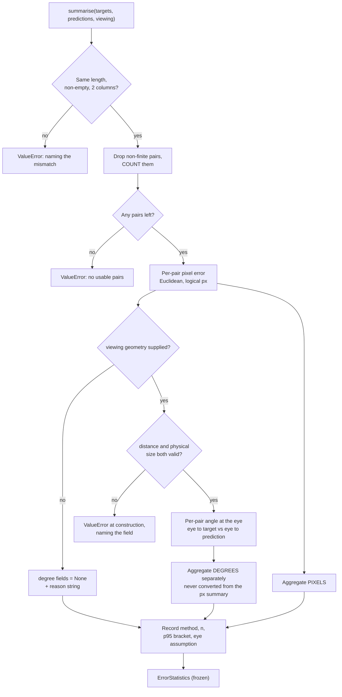

### Story 2.1: Gaze-error metrics reported in both degrees of visual angle and screen pixels

**File**: `docs/plans/stories/epic-2-story-2.1-Error-Metrics.md`
**BUILDID**: CYCLE-1 | **Epic**: 2 - ACCURACY MEASUREMENT & BASELINE | **ID**: 2.1 | **Date**: 2026-08-07 | **Jira**: LOCAL | **GitHub**: LOCAL
**Wave**: 3
**Requires**: [1.3]
**Enables**: [2.2, 2.3]
**Files Touched**:
  - eye_tracker/evaluation/__init__.py
  - eye_tracker/evaluation/metrics.py
  - tests/unit/test_metrics.py
**Roles Ref**: `docs/requirements.md#roles--permissions-matrix` — single-actor, no role variation
**QA Candidate**: No — a pure computation module with no user-facing surface, no window and no device access. It becomes QA-observable only through Story 2.3's session and Story 2.4's report, where it is verified as Epic 2 Group 1. The isolation check that group calls for ("confirm the reported pixel error matches hand computation") is served by AC 23: the module docstring carries a worked five-pair example with every figure hand-verified, so QA reproduces it without new tooling.

---

#### 👤 User Reference

**Description**:

Right now nobody can say how accurate this eye tracker is. There is no number. "Improve gaze accuracy" is the whole point of the project, and the first cycle exists to turn that into something measurable — because you cannot improve what you have not measured, and you certainly cannot prove afterwards that you did not make it worse.

This story builds the piece that turns raw measurements into an answer: given a list of places the person was asked to look and the places the tracker thought they were looking, it reports how far off it was. It reports that in two units, because the two answer different questions:

- **Screen pixels** — how far the dot was from where you were looking, on this screen. That is what a user actually experiences, and it is the number the before-and-after comparison will hinge on.
- **Degrees of visual angle** — how far off the tracker was as an angle at your eye. This is the unit the rest of the eye-tracking field uses, so it is the only one that lets this system be compared to anything else.

Converting between the two needs two physical facts the software cannot discover for itself: **how big the screen physically is**, and **how far away the person was sitting**. The module therefore asks for both and **refuses to report degrees if it does not have them**, rather than assuming a typical desk distance. That refusal is the point. A guessed distance produces a confident, precise-looking, wrong number — and measurement shows the error is close to proportional: sitting 5 cm closer than assumed moves the degree figure by about 9%.

Two things were discovered by measuring rather than assuming, and both changed the design:

**The obvious formula is wrong away from the middle of the screen.** The textbook shortcut treats the error as if it happened straight ahead of you. For a target in the corner of a 24-inch monitor at 60 cm, that shortcut overstates the angular error by **15.6%**. So the module computes the real angle between "where you were looking" and "where the tracker thought you were looking", as seen from your eye. That also means the conversion has to happen for each measurement individually and only then be averaged — averaging the pixel errors first and converting once is wrong by nearly **7%**.

**The largest pixel error is not the largest angular error.** In the worked example in this story, the worst pixel miss (56.6 px) is *not* the worst angular miss (which came from a 53.7 px miss nearer the screen edge). So the two sets of statistics have to be computed independently. You cannot take the pixel summary and convert it.

There is also an honesty problem this story surfaces rather than hides. The "95th-percentile error" everyone wants is barely defined when there are only nine to twenty-five targets to measure — the calibration grid cannot produce more. With 25 targets it is interpolated between the second- and third-largest errors; with 21 or fewer, between the largest two. On a nine-point sample the five standard ways of computing it differed by **20 pixels — 92% of that sample's own mean error**. So the module names the method it used, reports how many measurements there were, and flags when the figure rests on the top two or three values. The number stays; the false confidence goes.

Nothing a user of the application would notice changes. No window, no camera, no behaviour.

**Acceptance Criteria** (plain-English):

- Given a list of intended targets and the tracker's guesses, the module reports mean, median, 95th-percentile and worst error in screen pixels.
- It reports the same statistics in degrees of visual angle, **but only** when it has been given the screen's physical size and the viewing distance.
- Asked for degrees without those measurements, it **refuses and says which one is missing** — it never substitutes a typical value.
- Nonsensical physical inputs — a zero or negative distance, a zero or negative screen size — are rejected immediately, with the offending value named.
- The angular error is the true angle at the eye between the intended point and the guessed point, not the straight-ahead approximation, and the module states which definition it uses.
- Each measurement is converted to degrees individually and only then averaged, never the other way round.
- The pixel statistics and the degree statistics are computed independently, because the worst pixel miss and the worst angular miss can be different measurements.
- Whichever way the 95th percentile was computed is named in the output, alongside how many measurements it was computed from.
- When the 95th percentile rests on only the top two or three measurements, the output says so, so a reader is not misled by a precise-looking figure.
- Measurements that are missing or not a number are excluded and **counted**, with the count reported — never dropped silently.
- Empty input, or mismatched lists, produce a clear error rather than a meaningless zero.
- Which assumption was made about where the eye was relative to the screen is recorded in the output, because measurement shows it moves the corner figures by around 5%.
- Running the same measurements twice produces exactly the same numbers.
- The module needs no camera, no screen and no internet, and works the same whether or not a display is attached.
- The application itself is unchanged and behaves exactly as before.

**User Flow**:

`Actor: system — no role variation.`

**Flow Diagram**:



---

#### 🤖 AI Agent Reference

> Audience: the DEV agent. The implementation contract — everything needed to build this story in a fresh AI session.

**Must Read**:
- `docs/requirements.md` — **FR-10** (the requirement: mean and 95th-percentile error in **both** degrees and pixels), **FR-11** (the protocol record this feeds), **FR-12** (the delta this makes possible), **success criterion 6**, and **failure criterion 4** ("accuracy regresses relative to the recorded baseline")
- `docs/architecture/design/02-target-architecture-brownfield.md` — the `eye_tracker/evaluation/` component table (`metrics.py` = "pure error statistics"), the FR-10 traceability row, and the **Coverage strategy** paragraph naming `metrics.py` as hardware-free and therefore part of where the ≥85% gate is actually met
- `docs/architecture/design/03-patterns-and-standards-brownfield.md` — **§1** (target layout: `evaluation/` is **APPLICATION** layer — *no PyQt6*), **§11** (numerical guards), **§12** (annotations + NumPy docstrings on the public API), **§16** (documentation standards)
- `eye_tracker/overlay.py:56` and `:98` — `QApplication.primaryScreen().geometry()`, resolved **twice** (TD-3). This is the coordinate space every target and every prediction lives in, and it is **logical** pixels
- `docs/plans/builds/cycle-1/cycle-plan.md` — CYCLE-1 scope and acceptance criteria
- `SPEC/references/` — **0 files**

**Description**:

FR-10 requires a repeatable harness reporting mean and 95th-percentile gaze error in **both** degrees of visual angle and screen pixels. This story builds the scoring half — the pure function from measurement pairs to statistics. Story 2.2 supplies the protocol, 2.3 collects the pairs, 2.4 renders the report, 2.5 runs the session.

It is deliberately first in Epic 2 and deliberately pure. Everything downstream depends on the definition of "error" being settled and testable before a person is put in front of a webcam, because a human-gated session cannot be cheaply repeated if the metric turns out to be wrong.

🔧 **The conversion arithmetic was measured against real screens and real numbers before this story was written. Four findings changed the design.**

**Finding 1 — the on-axis shortcut overstates angular error by up to 15.6%, and the error grows toward the screen edges.** The common formula treats the gaze error as if it straddled the visual axis. Measured on the worked-example geometry (1920×1080 over 527×296 mm at 600 mm — the real `T24i-2L` figures read from this machine):

| Target | Pixel error | Exact angle at the eye | On-axis `atan(e/d)` | Shortcut error |
|---|---|---|---|---|
| Screen centre (960, 540) | 100 px | **2.619257°** | 2.619257° | **3.5e-14°** — identical |
| Corner (1728, 972) | 100 px | **2.265892°** | 2.619257° | **+15.59%** |

So the definition must be the **angle between the eye→target and eye→prediction vectors**, which is exact everywhere and degenerates to the shortcut on the axis. Note also that the two textbook shortcuts — `atan(e/d)` and `2·atan(e/2d)` — differ from each other by only **0.0523%** on-axis. The choice of shortcut is not what matters; **being off-axis** is.

**Finding 2 — therefore the conversion must be per-pair, and aggregation comes second.** A 5×5 grid with an *identical* 60 px error at every target:

| Quantity | Value |
|---|---|
| Per-target angular error | 1.367446° … 1.572255° — a **14.98% spread** for the same pixel error |
| `mean` of per-pair degrees | **1.471807°** |
| On-axis conversion of the mean pixel error | 1.572255° — **+6.82% too high** |

Convert first, then aggregate. The reverse is wrong by nearly 7% and would bias every reported figure in the same direction.

**Finding 3 — the pixel and degree distributions are not rank-equivalent, so neither summary can be derived from the other.** From the worked example:

| Pair | Target | Prediction | Pixel error | Angular error |
|---|---|---|---|---|
| 0 | (960, 540) | (990, 540) | 30.0000 px | 0.786276° |
| 1 | (192, 108) | (232, 148) | **56.5685 px ← worst px** | 1.293085° |
| 2 | (1728, 972) | (1708, 932) | 44.7214 px | 1.038586° |
| 3 | (960, 108) | (936, 156) | 53.6656 px | **1.362989° ← worst deg** |
| 4 | (192, 540) | (222, 585) | 54.0833 px | 1.318662° |

Pair 3 has a **smaller** pixel error than pair 1 but a **larger** angular error. The two 95th percentiles are therefore computed from different pairs. Any implementation that computes the pixel summary and converts it is wrong, and would be wrong in a way that looks entirely plausible.

**Finding 4 — the 95th percentile is fragile at achievable target counts, and must be reported with its own caveats.** The calibration grid yields at most 25 targets.

| n | numpy `linear` p95 interpolates order statistics | Rests on |
|---|---|---|
| 9 | #8 and #9 of 9 | top **2** |
| 21 | #20 and #21 of 21 | top **2** |
| 22 | #20 and #21 of 22 | top **3** |
| 25 | #23 and #24 of 25 | top **3** |
| 42 | #39 and #40 of 42 | top 4 |

The threshold is exact: **n ≤ 21 → the top two values; 22 ≤ n ≤ 41 → the top three.** And the method matters enormously at these sizes — on a 9-point sample the five numpy methods (`linear`, `lower`, `higher`, `nearest`, `midpoint`) spanned **20.14 px, which was 92% of that sample's own mean error**. The figure is not refused — refusing would block the baseline entirely, since the grid cannot produce more targets — but the method is named, `n` is reported, and the top-two/top-three dependence is flagged in the result object so Story 2.4 must print it.

🔴 **Two hazards about *which* pixels, both measured on this machine.**

**The pixel space is logical, not device.** Reading real Qt screen metrics here:

| Screen | `geometry()` | `devicePixelRatio` | `physicalSize()` | logical px/mm | device px/mm |
|---|---|---|---|---|---|
| `\\.\DISPLAY6` | 1536 × 960 | **1.25** | 345.0 × 215.0 mm | 4.4522 | 5.5652 |
| `T24i-2L` | 1920 × 1080 | 1.00 | 527.0 × 296.0 mm | 3.6433 | 3.6460 |
| `T24-40` | 1920 × 1080 | 1.00 | 527.0 × 296.0 mm | 3.6433 | 3.6460 |

`overlay.py` places targets in `geometry()` coordinates, i.e. **logical** pixels. On the laptop panel that is 1536 px wide while the panel is physically 1920 device px. Mixing the two spaces changes a 60 px error from **1.2869° to 1.0295° — a 20% error in the headline number**, silently. The module therefore documents that `width_px`/`height_px` mean *the same pixels the predictions are expressed in*, and the protocol records the ratio.

**Three attached screens differ by 22% in px/mm** (3.6433 vs 4.4522). Multi-monitor support is explicitly out of scope, but `primaryScreen()` picks whichever screen Windows currently calls primary — so *which screen the session ran on* is part of the measurement, not an irrelevance. That belongs in Story 2.2's protocol record; this module simply requires the caller to state the geometry rather than discovering it.

🔴 **No auto-detection — and the layering test enforces it.** `QScreen.physicalSize()` is untrustworthy in exactly the environment the tests run in: under `QT_QPA_PLATFORM=offscreen` this machine reports a **fabricated 203.2 × 203.2 mm square screen at exactly 100.0 DPI**. Beyond that, `evaluation/` is an **APPLICATION-layer** package (patterns §1), so importing PyQt6 here would fail Story 1.4's import-direction test — which is in **the same wave**. The "explicit inputs" design is not a preference; it is mechanically enforced.

⚠️ **What the degree figure inherits.** Measured sensitivity of the reported angle, centre target, 60 px error:

| Perturbation | Effect on the reported degrees |
|---|---|
| Viewing distance 600 → 550 mm (−8.3%) | **+9.1%** |
| Viewing distance 600 → 500 mm (−16.7%) | **+20.0%** |
| Eye assumed at the screen's top edge rather than its centre | −5.43% at a corner target, −2.92% at the centre |
| Per-axis px/mm anisotropy on the measured screens | 0.148% (`T24i-2L`) / 0.291% (`DISPLAY6`) — handled per-axis, not averaged |

So the **pixel** figure is the trustworthy basis for FR-12's before/after delta: it carries no dependency on a tape measure. The degree figure exists for comparability with the published literature, and it is only as good as the recorded distance. Both must be reported; the report must not present the degree delta as the more authoritative one. ⚠️ **This is a finding for the requirements owner**, because success criterion 7 ("accuracy must not regress") does not currently say which unit decides.

✅ **The code in Steps 1–5 was assembled and executed before this story shipped** — not merely written. All **25 test cases pass** (15 test functions, 10 of them parametrised expansions) against real `numpy` 2.5.1, and the four calibration perturbations in the manual table were run and produced the failures claimed. Most importantly, **manual case 1 was confirmed**: substituting the on-axis shortcut leaves `test_on_axis_error_equals_the_textbook_angle` **passing** while four other tests fail. The centre test alone would not catch the wrong formula, which is why the corner and grid tests exist.

**Acceptance Criteria** (technical):

1. `eye_tracker/evaluation/__init__.py` exists with a package docstring and **no re-exports** (patterns §1: `__init__.py` carries no API surface), so importing the package pulls in nothing heavier than it must.
2. `eye_tracker/evaluation/metrics.py` exists with a module docstring declaring `Layer: application` on the line after the summary, per patterns §1.
3. 🔴 `metrics.py` imports **nothing outward** — no PyQt6, no cv2, no sklearn, no mediapipe, no filesystem access. `numpy` and stdlib only. Story 1.4's `tests/arch/test_import_direction.py` is the enforcement and runs in the same wave.
4. A frozen dataclass `ScreenGeometry(width_px, height_px, width_mm, height_mm)` exposing `px_per_mm_x` and `px_per_mm_y` as **separate** properties. Averaging the two axes is forbidden — measured anisotropy is 0.148–0.291% and there is no reason to introduce that error.
5. `ScreenGeometry.__post_init__` rejects any non-positive dimension with a `ValueError` naming the field and its value. This is the patterns §11 rule — guard at construction, not at each use, so the division in the conversion needs no epsilon.
6. A frozen dataclass `ViewingGeometry(screen, distance_mm, eye_px=None)`. `distance_mm` must be `> 0`; `__post_init__` raises `ValueError` naming it otherwise.
7. `eye_px=None` means **the eye sits on the normal through the screen centre**. The resolved value is recorded on the result object (AC 18) — it is an assumption worth 5.4% at a corner and must never be invisible.
8. `error_px(targets, predictions) -> np.ndarray` returns the **per-pair Euclidean** distance in the caller's pixel space.
9. `error_deg(targets, predictions, viewing) -> np.ndarray` returns the **per-pair angle at the eye**, computed as the angle between the eye→target and eye→prediction vectors: `degrees(arccos(clip(dot(a,b)/(|a||b|), -1, 1)))`.
10. 🔴 The small-angle / on-axis shortcut is **forbidden**, and a comment records why with the measured figure: it is exact on-axis (3.5e-14° agreement) and overstates by **15.59%** at a corner of the reference geometry.
11. 🔴 `summarise` converts **per pair first**, then aggregates the degree array independently of the pixel array. Deriving the degree summary from the pixel summary is forbidden; a comment records the 6.82% bias and the rank inversion in Finding 3.
12. `summarise(targets, predictions, viewing=None) -> ErrorStatistics`, a frozen dataclass carrying at minimum: `n_pairs`, `n_excluded_non_finite`, `mean_px`, `median_px`, `p95_px`, `max_px`, `mean_deg`, `median_deg`, `p95_deg`, `max_deg`, `percentile_method`, `p95_order_statistics`, `p95_rests_on_top_k`, `viewing`, `degrees_unavailable_reason`.
12a. Every field of `ErrorStatistics` is either a number, a string, a tuple or `None` — **JSON-serialisable without a custom encoder**, because Story 2.4 emits a `.json` alongside the Markdown report.
13. 🔴 With `viewing=None`, the four degree fields are `None` and `degrees_unavailable_reason` is a non-empty string naming what is missing. The pixel statistics are still computed — a missing tape measure must not cost the pixel baseline.
14. 🔴 `error_deg` called with `viewing=None` raises `ValueError`. **No default viewing distance, no default screen size, and no auto-detection exists anywhere in the module** — grep for `primaryScreen`, `physicalSize`, `physicalDotsPerInch` must return nothing.
15. `percentile_method` is the literal method passed to `np.percentile` and defaults to the module constant `PERCENTILE_METHOD = "linear"` (numpy's default, named explicitly rather than inherited). The same method is used for pixels and degrees.
16. `p95_order_statistics` is the 1-based pair of order statistics numpy's `linear` method interpolates: `floor(0.95*(n-1)) + 1` and the next, clamped to `n`. Verified: `n=9 → (8, 9)`, `n=25 → (23, 24)`, `n=1 → (1, 1)`.
17. `p95_rests_on_top_k = n - p95_order_statistics[0] + 1`, and a docstring records the exact thresholds: **≤21 targets → top 2; 22–41 → top 3**.
18. `ErrorStatistics.viewing` holds the `ViewingGeometry` actually used, including the resolved eye position — so a report can never be produced without its geometry attached.
19. Non-finite entries (`NaN`, `±inf`) in either array cause that **pair** to be excluded, and `n_excluded_non_finite` records how many. ⚠️ Relevant because DR-16 makes head-pose failure produce `NaN` rather than zeros, so `NaN` predictions are an expected input, not a defect.
20. Empty input, mismatched lengths, or arrays that are not `(n, 2)` raise `ValueError` naming the actual shapes. All pairs excluded as non-finite also raises, rather than returning zeros.
21. `summarise` is pure and deterministic — no clock, no randomness, no I/O, no mutation of its inputs. Calling it twice on the same arrays returns equal results, and the input arrays are unchanged afterwards.
22. Exceptions raised are stdlib `ValueError`. ⚠️ `eye_tracker/errors.py` and the `EyeTrackerError` hierarchy do **not exist in CYCLE-1** — patterns §18 places `errors.py` at M4, which is **CYCLE-3**. A docstring note records that these raises migrate to the typed hierarchy then, so the change is a planned follow-up rather than a discovery.
23. The module docstring carries the **worked five-pair example from Finding 3** with its verified figures (`mean_px = 47.807761`, `p95_px = 56.071488`, `mean_deg = 1.159919`, `p95_deg = 1.354124`, and the note that the worst pixel pair is not the worst degree pair), so QA's isolation check in Epic 2 Group 1 is reproducible from the source file alone.
24. `tests/unit/test_metrics.py` covers every behaviour in Steps 1–3 — the tests listed in the **Tests** table below, including the two refusal paths, the rank-inversion property, and the per-pair-then-aggregate property.
25. Public functions and dataclasses carry NumPy-style docstrings (patterns §12); every function is ≤30 statements (patterns §14, `max-statements = 30` from Story 1.2).
26. No landmark array, feature vector or camera frame is accepted, logged or stored — this module sees only 2-D screen points. Patterns §3's privacy rule is satisfied by construction, and an assertion message must never dump a full coordinate array.
27. `ruff check` and `ruff format --check` clean.
28. 🔴 **Zero modification to existing application source** — `git diff --stat -- main.py eye_tracker/gaze.py eye_tracker/calibration.py eye_tracker/overlay.py eye_tracker/tracker.py eye_tracker/face_mesh.py eye_tracker/one_euro.py` empty. This story only adds a new subpackage.
29. The unit-decides question from the last paragraph of the Description is raised with the requirements owner as an open item against success criterion 7 — not resolved inside this story.

**RBAC Enforcement**:

`No role-differentiated access — single actor.`

- **Enforcement point(s)**: none — a pure computation module adds no route, no guard and no runtime authority check.
- **Denied-access contract**: N/A — no request surface exists. The refusals in AC 13 and AC 14 are *input-validity* refusals, not authorisation refusals, and must not be described as security controls.
- **Scope derivation**: **N/A — no scoped permission exists, and there is no token or session to derive scope from.** The binding discipline here is data minimisation (patterns §3): this module's inputs are 2-D screen coordinates and two physical measurements. It must never be extended to accept a feature vector or a landmark array "for convenience", because that would pull biometric data into a module whose output is committed to the repository.

**System responses + error cases**:

| Trigger | Response | Side-effect |
|---|---|---|
| `summarise(targets, predictions, viewing)` with valid input | `ErrorStatistics` with both unit sets populated, method and `n` recorded | None |
| Repeat call on the same arrays (idempotent) | Identical values; input arrays unmodified — no clock, no randomness, no I/O | None |
| `summarise(..., viewing=None)` | Pixel statistics populated; four degree fields `None`; `degrees_unavailable_reason` names what is missing | None. AC 13 — a missing tape measure must not cost the pixel baseline |
| `error_deg(..., viewing=None)` | `ValueError` | None. AC 14 — degrees are never estimated |
| `ViewingGeometry(distance_mm=0)` or negative | `ValueError` naming `distance_mm` and its value, at construction | None. AC 6 — the guard sits at construction so the conversion needs no epsilon |
| `ScreenGeometry(width_mm=0)` | `ValueError` naming `width_mm` | None. AC 5 |
| Prediction contains `NaN` (expected under DR-16 head-pose failure) | That pair excluded; `n_excluded_non_finite` incremented and reported | None. AC 19 — counted, never silently dropped |
| Every pair non-finite | `ValueError` — no usable pairs | None. AC 20 — never a report of zero error |
| Mismatched array lengths, or shape not `(n, 2)` | `ValueError` naming both actual shapes | None. AC 20 |
| `n = 9` measurements | p95 computed and returned, with `p95_order_statistics = (8, 9)` and `p95_rests_on_top_k = 2` | ⚠️ Correct and deliberate. Refusing would block the baseline the grid can actually produce; Story 2.4 must print the flag |
| Someone aggregates pixels then converts once | Overstates the mean by **6.82%** on the reference grid | None. AC 11 forbids it and records the figure |
| Someone uses the on-axis shortcut | Overstates by **15.59%** at a corner, exact at the centre — so a centre-only test would not catch it | None. AC 10 forbids it; the corner test in Step 3 is what catches it |
| Predictions expressed in device pixels while `width_px` is logical | Silently wrong by the `devicePixelRatio` — measured 1.25 on `DISPLAY6`, a 20% error in degrees | ⚠️ Not detectable by this module. Mitigated by AC 4's documented meaning of `width_px` and by Story 2.2 recording the ratio |
| `metrics.py` grows an `import PyQt6` to auto-detect the screen | Story 1.4's `tests/arch/test_import_direction.py` **FAILS** — application layer must not import Qt | None. Same wave, so the enforcement exists as soon as this code does |
| `python main.py` after this story | Application behaves exactly as before | None (AC 28) |

**Prerequisites**:

- **Story 1.2 complete** — `pyproject.toml`, a working interpreter, pytest, ruff and the coverage configuration.
- **Story 1.3 complete** — `tests/unit/` exists and `pytest` collects from the repository root with no `PYTHONPATH`. ⚠️ This story adds **no fixtures**: `tests/conftest.py` is deliberately absent from `files_touched`, so it does not touch a `shared_files` entry at all. Everything it needs is constructed inline, which also makes each test's geometry visible at the point of assertion.
- **Story 1.4 is in the same wave** and is the mechanism enforcing AC 3. Neither story depends on the other's files; if 1.4 lands later, AC 3 must be verified by inspection in the meantime.
- No camera, no display, no network. ⚠️ Specifically: **do not** run any check that reads live screen metrics — under offscreen Qt this machine fabricates a 203.2 × 203.2 mm screen at exactly 100.0 DPI.
- ⚠️ Requirements **open item 3** (the protocol) is *not* a prerequisite here. This story deliberately ships the parameter surface without values; Story 2.2 is where the blocker bites.

**Context** (read before writing):
- `eye_tracker/overlay.py:56-59` and `:96-100` — the two `primaryScreen().geometry()` calls (TD-3) that define the pixel space, and `_grid()` which lays out the calibration targets in it
- `eye_tracker/calibration.py:210-257` — `GazeCalibrator` and `predict_with_variance`; the source of the predictions this module scores. Note the output is a screen-coordinate pair, which is all this module needs
- `docs/architecture/design/03-patterns-and-standards-brownfield.md` §1 (layer map + `evaluation/` placement), §11 (numerical guards), §12, §14, §16
- `docs/architecture/design/02-target-architecture-brownfield.md` — `evaluation/` component table, DR-16 (`NaN` on head-pose failure, which is why AC 19 exists), Coverage strategy
- `docs/requirements.md` — FR-10, FR-11, FR-12, success criterion 6, failure criterion 4, and the Technical Constraint "**Single primary display.** Multi-monitor is explicitly OUT"

**Patterns**:
- **Project Structure** `[Current — kept + extended]` — patterns §1. A new concern gets a new module; `evaluation/` is an APPLICATION-layer subpackage and declares `Layer: application`.
- **Numerical Guards** `[Current — kept]` — patterns §11. Validate physical inputs at construction so the division in the conversion is guard-free. This is the existing "epsilon-guarded division at the point of construction" pattern applied one step earlier: reject the impossible value instead of tolerating it.
- **Named indices over magic numbers** — `01-gaze-deep-dive.md` Pattern 1. `PERCENTILE_METHOD` and the reference geometry are module constants, not literals at the use site.
- **Annotations & Docstrings** `[New adoption]` — patterns §12. NumPy docstrings on the public API; this is new code, so the rule applies in full.
- **Documentation Standards** `[New adoption]` — patterns §16. Every measured figure in this module's comments cites what produced it, and every refusal says what would satisfy it.

**Steps**:

1. **Create the package and the input contracts**, with validation at construction.

   ```python
   """Gaze-error statistics in screen pixels and degrees of visual angle.

   Layer: application

   FR-10 requires mean and 95th-percentile gaze error in BOTH units. Pure
   computation: no device, no filesystem, no Qt. See docs/requirements.md FR-10 /
   success criterion 6.

   PIXEL SPACE. `width_px`/`height_px` mean the same pixels the predictions are
   expressed in. The application places calibration targets with
   QApplication.primaryScreen().geometry() (overlay.py:56, :98), which is LOGICAL
   pixels. Measured on this machine, \\\\.\\DISPLAY6 reports geometry 1536x960 at
   devicePixelRatio 1.25 over a 345x215 mm panel: 4.4522 logical px/mm against
   5.5652 device px/mm. Mixing the two turns a 60 px error into 1.0295 deg instead
   of 1.2869 deg -- a silent 20% error.

   NO AUTO-DETECTION, deliberately. QScreen.physicalSize() is fabricated under
   QT_QPA_PLATFORM=offscreen (this machine reports a 203.2x203.2 mm square screen
   at exactly 100.0 DPI), and importing PyQt6 here would break the APPLICATION
   layer rule enforced by tests/arch/test_import_direction.py.

   WORKED EXAMPLE -- screen 1920x1080 px over 527x296 mm, eye on the normal
   through the screen centre at 600 mm. Every figure below is verified:

       target        prediction      px error    angular error
       (960, 540)    (990, 540)       30.0000      0.786276 deg
       (192, 108)    (232, 148)       56.5685 <-worst px   1.293085 deg
       (1728, 972)   (1708, 932)      44.7214      1.038586 deg
       (960, 108)    (936, 156)       53.6656      1.362989 deg <-worst deg
       (192, 540)    (222, 585)       54.0833      1.318662 deg

       mean_px  = 47.807761   p95_px  = 56.071488
       mean_deg =  1.159919   p95_deg =  1.354124

   Note the worst pixel pair is NOT the worst angular pair. The two summaries are
   therefore computed independently; neither can be derived from the other.

   MIGRATION NOTE: raises here are stdlib ValueError. eye_tracker/errors.py and the
   EyeTrackerError hierarchy arrive at M4 (CYCLE-3) per patterns section 18; these
   raises move to the typed hierarchy then.
   """
   from __future__ import annotations

   import dataclasses
   import math

   import numpy as np

   #: numpy's default, named explicitly so the report can state it. At the target
   #: counts this grid can produce (<=25) the choice is worth up to 92% of the
   #: sample mean -- see _p95_order_statistics.
   PERCENTILE_METHOD = "linear"


   @dataclasses.dataclass(frozen=True)
   class ScreenGeometry:
       """Physical and pixel dimensions of the screen a session was measured on.

       Parameters
       ----------
       width_px, height_px : int
           Resolution in the SAME pixel space the predictions use -- logical
           pixels, matching QApplication.primaryScreen().geometry().
       width_mm, height_mm : float
           Physical dimensions of the active display area, measured. Not read from
           EDID and not inferred.
       """

       width_px: int
       height_px: int
       width_mm: float
       height_mm: float

       def __post_init__(self) -> None:
           for field, value in (
               ("width_px", self.width_px), ("height_px", self.height_px),
               ("width_mm", self.width_mm), ("height_mm", self.height_mm),
           ):
               if not (value > 0):
                   raise ValueError(f"ScreenGeometry.{field} must be > 0, got {value!r}")

       @property
       def px_per_mm_x(self) -> float:
           """Horizontal pixel density. Kept separate from the vertical: measured
           anisotropy is 0.148% (T24i-2L) to 0.291% (DISPLAY6)."""
           return self.width_px / self.width_mm

       @property
       def px_per_mm_y(self) -> float:
           """Vertical pixel density."""
           return self.height_px / self.height_mm


   @dataclasses.dataclass(frozen=True)
   class ViewingGeometry:
       """Where the eye was, relative to the screen.

       Parameters
       ----------
       screen : ScreenGeometry
       distance_mm : float
           Measured eye-to-screen distance. The reported angle is close to
           inversely proportional to this: 600 -> 550 mm moves it +9.1%, 600 -> 500
           mm moves it +20.0%. There is deliberately no default.
       eye_px : tuple[float, float] or None
           Screen-plane position of the eye's projection, in the pixel space of
           `screen`. None means the screen centre. Worth -5.43% at a corner target
           versus assuming the top edge, so the resolved value is recorded on the
           result.
       """

       screen: ScreenGeometry
       distance_mm: float
       eye_px: tuple[float, float] | None = None

       def __post_init__(self) -> None:
           if not (self.distance_mm > 0):
               raise ValueError(
                   f"ViewingGeometry.distance_mm must be > 0, got {self.distance_mm!r}"
               )

       def resolved_eye_px(self) -> tuple[float, float]:
           """The eye position actually used, defaulting to the screen centre."""
           if self.eye_px is not None:
               return (float(self.eye_px[0]), float(self.eye_px[1]))
           return (self.screen.width_px / 2.0, self.screen.height_px / 2.0)
   ```

   ⚠️ `not (value > 0)` rather than `value <= 0` is deliberate: it also rejects `NaN`, which `<=` would let through.

2. **Per-pair errors — Euclidean in pixels, the true angle at the eye in degrees.**

   ```python
   def _as_points(array, name: str) -> np.ndarray:
       """Validate and coerce to an (n, 2) float array."""
       points = np.asarray(array, dtype=float)
       if points.ndim != 2 or points.shape[1] != 2:
           raise ValueError(f"{name} must have shape (n, 2), got {points.shape}")
       if points.shape[0] == 0:
           raise ValueError(f"{name} is empty — there is nothing to score")
       return points


   def error_px(targets, predictions) -> np.ndarray:
       """Per-pair Euclidean error, in the caller's pixel space."""
       t = _as_points(targets, "targets")
       p = _as_points(predictions, "predictions")
       if t.shape != p.shape:
           raise ValueError(f"targets {t.shape} and predictions {p.shape} differ in shape")
       return np.hypot(p[:, 0] - t[:, 0], p[:, 1] - t[:, 1])


   def _eye_rays(points: np.ndarray, viewing: ViewingGeometry) -> np.ndarray:
       """Vectors from the eye to each screen point, in millimetres."""
       eye_x, eye_y = viewing.resolved_eye_px()
       screen = viewing.screen
       return np.column_stack((
           (points[:, 0] - eye_x) / screen.px_per_mm_x,
           (points[:, 1] - eye_y) / screen.px_per_mm_y,
           np.full(points.shape[0], -float(viewing.distance_mm)),
       ))


   def error_deg(targets, predictions, viewing: ViewingGeometry | None) -> np.ndarray:
       """Per-pair gaze error as the angle subtended at the eye.

       The angle between the eye->target and eye->prediction vectors. This is
       exact everywhere on the screen. The on-axis shortcut atan(e/d) agrees to
       3.5e-14 deg at the screen centre but OVERSTATES by 15.59% at the corner of
       the reference geometry, so it is not used. (The 2*atan(e/2d) variant differs
       from atan(e/d) by only 0.0523% -- being off-axis is what matters, not which
       shortcut.)

       Raises
       ------
       ValueError
           If `viewing` is None. Degrees are never estimated from a default
           distance or screen size.
       """
       if viewing is None:
           raise ValueError(
               "degrees of visual angle require a ViewingGeometry — supply the "
               "measured viewing distance and physical screen size, or read the "
               "pixel statistics instead"
           )
       t = _as_points(targets, "targets")
       p = _as_points(predictions, "predictions")
       if t.shape != p.shape:
           raise ValueError(f"targets {t.shape} and predictions {p.shape} differ in shape")
       a, b = _eye_rays(t, viewing), _eye_rays(p, viewing)
       # |a| and |b| cannot be zero: the z component is -distance_mm, which
       # ViewingGeometry.__post_init__ has already proved is > 0. No epsilon needed.
       cosine = np.einsum("ij,ij->i", a, b) / (
           np.linalg.norm(a, axis=1) * np.linalg.norm(b, axis=1)
       )
       return np.degrees(np.arccos(np.clip(cosine, -1.0, 1.0)))
   ```

3. **Summarise — two independent distributions, with the percentile's own caveats attached.**

   ```python
   def _p95_order_statistics(n: int) -> tuple[int, int]:
       """1-based order statistics numpy's 'linear' method interpolates for p95.

       Exact thresholds, verified: n <= 21 -> the top TWO values; 22 <= n <= 41 ->
       the top three. n=9 -> (8, 9); n=25 -> (23, 24). The calibration grid yields
       at most 25 targets, so p95 always rests on the top two or three
       measurements. It is reported, not refused -- refusing would block the only
       baseline the grid can produce -- but p95_rests_on_top_k makes the fragility
       visible and Story 2.4 must print it.
       """
       lower = math.floor(0.95 * (n - 1))
       return (lower + 1, min(lower + 2, n))


   @dataclasses.dataclass(frozen=True)
   class ErrorStatistics:
       """Gaze-error summary in both units. Every field is JSON-serialisable."""

       n_pairs: int
       n_excluded_non_finite: int
       mean_px: float
       median_px: float
       p95_px: float
       max_px: float
       mean_deg: float | None
       median_deg: float | None
       p95_deg: float | None
       max_deg: float | None
       percentile_method: str
       p95_order_statistics: tuple[int, int]
       p95_rests_on_top_k: int
       viewing: ViewingGeometry | None
       degrees_unavailable_reason: str | None


   def summarise(targets, predictions, viewing: ViewingGeometry | None = None,
                 percentile_method: str = PERCENTILE_METHOD) -> ErrorStatistics:
       """Summarise gaze error in pixels and, if geometry is supplied, in degrees.

       The degree statistics are computed from the PER-PAIR angles, never converted
       from the pixel summary. Two measured reasons: converting the mean pixel
       error once overstates the mean angle by 6.82% on the reference grid, and the
       two distributions are not rank-equivalent -- in the worked example the worst
       pixel pair (56.5685 px) is not the worst angular pair (53.6656 px).
       """
       px = error_px(targets, predictions)
       t = np.asarray(targets, dtype=float)
       p = np.asarray(predictions, dtype=float)
       usable = np.isfinite(t).all(axis=1) & np.isfinite(p).all(axis=1)
       excluded = int((~usable).sum())
       if not usable.any():
           raise ValueError(
               f"all {usable.size} pairs contain non-finite coordinates — "
               "no usable measurements to score"
           )
       px = px[usable]
       degrees = None if viewing is None else error_deg(t[usable], p[usable], viewing)
       n = int(px.size)
       return ErrorStatistics(
           n_pairs=n,
           n_excluded_non_finite=excluded,
           mean_px=float(px.mean()),
           median_px=float(np.median(px)),
           p95_px=float(np.percentile(px, 95, method=percentile_method)),
           max_px=float(px.max()),
           mean_deg=None if degrees is None else float(degrees.mean()),
           median_deg=None if degrees is None else float(np.median(degrees)),
           p95_deg=None if degrees is None else float(
               np.percentile(degrees, 95, method=percentile_method)
           ),
           max_deg=None if degrees is None else float(degrees.max()),
           percentile_method=percentile_method,
           p95_order_statistics=_p95_order_statistics(n),
           p95_rests_on_top_k=n - _p95_order_statistics(n)[0] + 1,
           viewing=viewing,
           degrees_unavailable_reason=None if viewing is not None else (
               "no ViewingGeometry supplied — measured viewing distance and "
               "physical screen size are required for degrees of visual angle"
           ),
       )
   ```

   ⚠️ **Measured against the limit, not guessed**: `summarise` is **12 statements over 45 lines**; the largest function in the module is still `summarise` at 12, and `error_deg` is 10 over 33 lines. `max-statements = 30` (Story 1.2) counts **statements**, so both pass comfortably. Note the gap: patterns §14 is written as "≤30 **lines**" but ruff has no line-count rule, so what is actually enforced is statements. Do not "fix" these two functions to get under 30 lines — the multi-line `return ErrorStatistics(...)` is one statement and splitting it would add names without adding clarity.

4. **Write the tests**, including the two that exist only because measurement said so.

   ```python
   """Unit tests for evaluation.metrics.

   Layer: test

   The corner and grid tests are not redundant with the centre test: the on-axis
   shortcut is EXACT at the screen centre (3.5e-14 deg) and wrong by 15.59% at a
   corner, so a centre-only suite would pass against the wrong formula.
   """
   import numpy as np
   import pytest

   from eye_tracker.evaluation.metrics import (
       ErrorStatistics, ScreenGeometry, ViewingGeometry, error_deg, error_px, summarise,
   )

   # Real figures read from this machine's T24i-2L, so the geometry is not invented.
   SCREEN = ScreenGeometry(width_px=1920, height_px=1080, width_mm=527.0, height_mm=296.0)
   VIEWING = ViewingGeometry(screen=SCREEN, distance_mm=600.0)

   WORKED_TARGETS = [[960., 540.], [192., 108.], [1728., 972.], [960., 108.], [192., 540.]]
   WORKED_PREDICTIONS = [[990., 540.], [232., 148.], [1708., 932.], [936., 156.], [222., 585.]]


   def test_worked_example_matches_hand_computation():
       stats = summarise(WORKED_TARGETS, WORKED_PREDICTIONS, VIEWING)
       assert stats.mean_px == pytest.approx(47.807761, abs=1e-6)
       assert stats.p95_px == pytest.approx(56.071488, abs=1e-6)
       assert stats.mean_deg == pytest.approx(1.159919, abs=1e-6)
       assert stats.p95_deg == pytest.approx(1.354124, abs=1e-6)


   def test_worst_pixel_pair_is_not_the_worst_angular_pair():
       """The rank inversion that makes two independent summaries necessary."""
       px = error_px(WORKED_TARGETS, WORKED_PREDICTIONS)
       deg = error_deg(WORKED_TARGETS, WORKED_PREDICTIONS, VIEWING)
       assert int(np.argmax(px)) == 1
       assert int(np.argmax(deg)) == 3


   def test_on_axis_error_equals_the_textbook_angle():
       """At the screen centre the exact angle IS atan(e/d) — the sanity anchor."""
       centre = [[SCREEN.width_px / 2, SCREEN.height_px / 2]]
       offset = [[SCREEN.width_px / 2 + 100.0, SCREEN.height_px / 2]]
       expected = np.degrees(np.arctan((100.0 / SCREEN.px_per_mm_x) / 600.0))
       assert error_deg(centre, offset, VIEWING)[0] == pytest.approx(expected, abs=1e-12)


   def test_off_axis_error_is_smaller_than_the_on_axis_shortcut():
       """Measured 15.59% at this corner. A centre-only test cannot catch this."""
       corner = [[1728.0, 972.0]]
       offset = [[1828.0, 972.0]]
       exact = error_deg(corner, offset, VIEWING)[0]
       shortcut = np.degrees(np.arctan((100.0 / SCREEN.px_per_mm_x) / 600.0))
       assert shortcut > exact
       assert shortcut / exact == pytest.approx(1.1559, abs=5e-4)


   def test_degrees_are_aggregated_per_pair_not_converted_from_the_mean():
       """Identical pixel error across a 5x5 grid still spans 14.98% in degrees."""
       xs = np.linspace(SCREEN.width_px * 0.1, SCREEN.width_px * 0.9, 5)
       ys = np.linspace(SCREEN.height_px * 0.1, SCREEN.height_px * 0.9, 5)
       targets = np.array([[x, y] for y in ys for x in xs])
       predictions = targets + np.array([60.0, 0.0])
       deg = error_deg(targets, predictions, VIEWING)
       assert deg.max() / deg.min() == pytest.approx(1.1498, abs=5e-4)
       converted_mean = np.degrees(np.arctan((60.0 / SCREEN.px_per_mm_x) / 600.0))
       assert converted_mean / deg.mean() == pytest.approx(1.0682, abs=5e-4)
   ```

5. **Test the refusals and the guards** — the behaviours that only exist because a guessed number is worse than no number.

   ```python
   def test_degrees_are_refused_without_geometry_but_pixels_survive():
       stats = summarise(WORKED_TARGETS, WORKED_PREDICTIONS, viewing=None)
       assert stats.mean_px == pytest.approx(47.807761, abs=1e-6)
       assert (stats.mean_deg, stats.p95_deg, stats.max_deg) == (None, None, None)
       assert "viewing distance" in stats.degrees_unavailable_reason


   def test_error_deg_raises_without_geometry():
       with pytest.raises(ValueError, match="ViewingGeometry"):
           error_deg(WORKED_TARGETS, WORKED_PREDICTIONS, None)


   @pytest.mark.parametrize("distance", [0.0, -1.0, float("nan")])
   def test_non_positive_or_nan_distance_is_rejected(distance):
       with pytest.raises(ValueError, match="distance_mm"):
           ViewingGeometry(screen=SCREEN, distance_mm=distance)


   @pytest.mark.parametrize("field", ["width_px", "height_px", "width_mm", "height_mm"])
   def test_non_positive_screen_dimensions_are_rejected(field):
       kwargs = {"width_px": 1920, "height_px": 1080, "width_mm": 527.0, "height_mm": 296.0}
       kwargs[field] = 0
       with pytest.raises(ValueError, match=field):
           ScreenGeometry(**kwargs)


   def test_non_finite_pairs_are_excluded_and_counted():
       targets = [[100., 100.], [200., 200.], [300., 300.]]
       predictions = [[110., 100.], [float("nan"), 200.], [300., 310.]]
       stats = summarise(targets, predictions, VIEWING)
       assert (stats.n_pairs, stats.n_excluded_non_finite) == (2, 1)


   def test_all_non_finite_raises_rather_than_reporting_zero_error():
       with pytest.raises(ValueError, match="no usable measurements"):
           summarise([[1., 1.]], [[float("nan"), float("nan")]], VIEWING)


   @pytest.mark.parametrize("targets,predictions", [
       ([], []),
       ([[1., 1.], [2., 2.]], [[1., 1.]]),
       ([[1., 1., 1.]], [[1., 1., 1.]]),
   ])
   def test_malformed_input_raises_value_error(targets, predictions):
       with pytest.raises(ValueError):
           summarise(targets, predictions, VIEWING)


   @pytest.mark.parametrize("n,expected,top_k", [(9, (8, 9), 2), (21, (20, 21), 2),
                                                 (22, (20, 21), 3), (25, (23, 24), 3)])
   def test_p95_order_statistics_and_fragility_flag(n, expected, top_k):
       targets = np.zeros((n, 2))
       predictions = np.column_stack((np.arange(n, dtype=float), np.zeros(n)))
       stats = summarise(targets, predictions, VIEWING)
       assert stats.p95_order_statistics == expected
       assert stats.p95_rests_on_top_k == top_k
       assert stats.percentile_method == "linear"


   def test_eye_position_defaults_to_the_screen_centre_and_is_recorded():
       assert VIEWING.resolved_eye_px() == (960.0, 540.0)
       stats = summarise(WORKED_TARGETS, WORKED_PREDICTIONS, VIEWING)
       assert stats.viewing is VIEWING


   def test_summarise_is_deterministic_and_does_not_mutate_its_inputs():
       targets = np.array(WORKED_TARGETS)
       predictions = np.array(WORKED_PREDICTIONS)
       before_t, before_p = targets.copy(), predictions.copy()
       first = summarise(targets, predictions, VIEWING)
       second = summarise(targets, predictions, VIEWING)
       assert first == second
       assert isinstance(first, ErrorStatistics)
       np.testing.assert_array_equal(targets, before_t)
       np.testing.assert_array_equal(predictions, before_p)
   ```

6. **Run the gate.**

   ```bash
   pytest tests/unit/test_metrics.py -v
   pytest tests/arch/ -v                      # AC 3: no outward import from evaluation/
   ruff check eye_tracker/evaluation/ tests/unit/test_metrics.py
   ruff format --check eye_tracker/evaluation/ tests/unit/test_metrics.py
   grep -rn "primaryScreen\|physicalSize\|physicalDotsPerInch\|PyQt6" eye_tracker/evaluation/
   git diff --stat -- main.py eye_tracker/gaze.py eye_tracker/calibration.py \
       eye_tracker/overlay.py eye_tracker/tracker.py eye_tracker/face_mesh.py \
       eye_tracker/one_euro.py
   ```

   The `grep` must return **nothing** (AC 14) and the `git diff --stat` must be **empty** (AC 28).

**Tests**:

| Test | Locks |
|---|---|
| `test_worked_example_matches_hand_computation` | The four headline figures of the docstring example, to 1e-6 |
| `test_worst_pixel_pair_is_not_the_worst_angular_pair` | The rank inversion — the reason two independent summaries exist |
| `test_on_axis_error_equals_the_textbook_angle` | Sanity anchor: exact angle == `atan(e/d)` at the centre, to 1e-12 |
| `test_off_axis_error_is_smaller_than_the_on_axis_shortcut` | The 15.59% corner discrepancy — the test a centre-only suite would miss |
| `test_degrees_are_aggregated_per_pair_not_converted_from_the_mean` | 14.98% per-target spread and the 6.82% aggregation bias |
| `test_degrees_are_refused_without_geometry_but_pixels_survive` | AC 13 — refusal that costs nothing but the degrees |
| `test_error_deg_raises_without_geometry` | AC 14 — no default distance anywhere |
| `test_non_positive_or_nan_distance_is_rejected` | AC 6, including the `NaN` case `<= 0` would let through |
| `test_non_positive_screen_dimensions_are_rejected` | AC 5, all four fields |
| `test_non_finite_pairs_are_excluded_and_counted` | AC 19 — DR-16's `NaN` predictions counted, not dropped |
| `test_all_non_finite_raises_rather_than_reporting_zero_error` | AC 20 — never a plausible report of zero error |
| `test_malformed_input_raises_value_error` | AC 20 — empty, mismatched, and wrong-shape |
| `test_p95_order_statistics_and_fragility_flag` | AC 16, AC 17 — all four verified `n` thresholds |
| `test_eye_position_defaults_to_the_screen_centre_and_is_recorded` | AC 7, AC 18 — the assumption is never invisible |
| `test_summarise_is_deterministic_and_does_not_mutate_its_inputs` | AC 21 — purity and idempotency |

Manual test cases — each a **break, observe, revert**:

| # | Perturbation | Expected |
|---|---|---|
| 1 | Replace `error_deg` with the on-axis shortcut `atan(e/d)` | Corner and grid tests **fail**; the centre test still **passes** — demonstrates why the corner test exists |
| 2 | Convert the mean pixel error to degrees instead of averaging per-pair degrees | Grid test fails at 6.82%; on the worked example `mean_deg` becomes 1.252881 instead of 1.159919 — **+8.01%** |
| 3 | Give `distance_mm` a default of 600.0, or have `error_deg` substitute a geometry when passed `None` | **Both** refusal tests fail — demonstrates the guess AC 14 forbids |
| 4 | Average `px_per_mm_x` and `px_per_mm_y` into one figure | `mean_deg` shifts by **2.37e-04** and `p95_deg` by **5.35e-04**, so `test_worked_example_matches_hand_computation` fails at its `abs=1e-6` tolerance |
| 5 | Drop non-finite pairs without counting them | `test_non_finite_pairs_are_excluded_and_counted` fails on the count |
| 6 | Change `PERCENTILE_METHOD` to `"higher"` | `p95_px` moves 56.0715 → 56.5685 and `p95_deg` 1.354124 → 1.362989; the `percentile_method` assertion fails. Measured across all five methods on this 5-pair example: `p95_px` spans **54.0833 – 56.5685**, and `higher`/`nearest` both collapse to the maximum |
| 7 | Add `from PyQt6.QtGui import QGuiApplication` to `metrics.py` | `tests/arch/` **fails**: application layer must not import Qt (Story 1.4) |
| 8 | Return zeros instead of raising when every pair is non-finite | `test_all_non_finite_raises...` fails — the silent-zero path AC 20 forbids |
| 9 | `pytest tests/unit/test_metrics.py` with no display and networking off | All pass |
| 10 | `git status --porcelain` after all reverts | Clean |
| 11 | `python main.py` | Application behaves exactly as before |

**Quality**: `ruff check` / `ruff format --check` clean · NumPy docstrings on every public function and dataclass (patterns §12) · every function ≤30 statements · no `TODO`/`FIXME` · every measured figure in a comment cites what produced it · no assertion message dumps a coordinate array · no `print()` · zero modification to existing application source.

**OUT**:
- ❌ **The protocol** — target layout, session count, seating distance, lighting, camera. That is Story 2.2, and it is blocked on requirements open item 3. This story ships the parameter *surface* it will fill.
- ❌ **Collecting measurements.** No camera, no target presentation, no fixation detection — Story 2.3.
- ❌ **Rendering a report**, resolving the commit SHA, or writing anything to `docs/evaluation/` — Story 2.4.
- ❌ **Bootstrap confidence intervals and the pre/post delta** — FR-12, CYCLE-5 (M8). This story deliberately stops at single-session statistics; the CI needs two sessions to compare.
- ❌ **Auto-detecting screen size or viewing distance.** Refused with measurement: offscreen Qt fabricates a 203.2 × 203.2 mm screen, and an outward import would fail the layering test. Estimating distance from interocular pixel separation is a research problem, not a story.
- ❌ **Multi-monitor handling.** Explicitly out per the requirements' Technical Constraints. The 22% px/mm spread across this machine's three screens is why the *protocol* records which screen — not a reason to support several.
- ❌ **Deciding which unit governs "accuracy must not regress"** (success criterion 7). Raised as AC 29; the requirements owner decides. Pixels are recommended, because degrees inherit the tape-measure error.
- ❌ **Per-target or per-region error breakdowns**, heat maps, and any plotting. Useful for diagnosis, required by no FR, and Story 2.4 can add them from the per-pair arrays this module already exposes.
- ❌ **Migrating the raises to `EyeTrackerError`.** `errors.py` does not exist until M4 (CYCLE-3); AC 22 records the migration rather than inventing the hierarchy early.

**Evidence**:
- `pytest tests/unit/test_metrics.py -v` showing all tests passing, with the parametrised cases expanded.
- `pytest tests/arch/ -v` passing, proving AC 3 mechanically rather than by inspection.
- 🔴 Transcripts of manual cases **1, 2, 3 and 7** — the on-axis shortcut passing the centre test while failing the corner test; the aggregation-order bias; the defaulted distance defeating both refusals; and the layering test catching an outward import. Case 1 is the one that shows the suite is calibrated rather than merely green.
- `grep -rn "primaryScreen\|physicalSize\|physicalDotsPerInch\|PyQt6" eye_tracker/evaluation/` returning nothing.
- `ruff check` / `ruff format --check` output.
- `git diff --stat` over the seven existing source files showing empty, and `git status --porcelain` clean after all reverts.
- Coverage for `eye_tracker/evaluation/metrics.py` from `pytest --cov`, recorded toward the ≥85% gate — this module is pure and should be near 100%.
- 🔴 The AC 29 note to the requirements owner: success criterion 7 does not say whether the no-regression test is in pixels or degrees, and the measured distance sensitivity (−8.3% distance → +9.1% angle) means the answer changes what counts as a regression.
