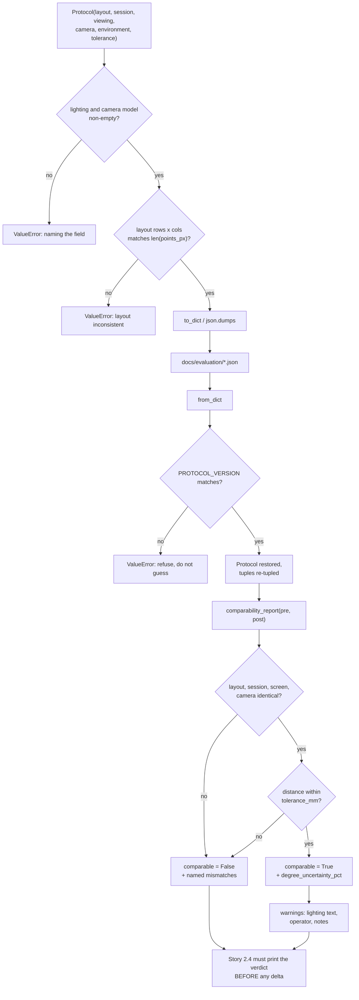

### Story 2.2: Evaluation protocol — target layout, session parameters and the reproducibility record

**File**: `docs/plans/stories/epic-2-story-2.2-Evaluation-Protocol.md`
**BUILDID**: CYCLE-1 | **Epic**: 2 - ACCURACY MEASUREMENT & BASELINE | **ID**: 2.2 | **Date**: 2026-08-07 | **Jira**: LOCAL | **GitHub**: LOCAL
**Wave**: 4
**Requires**: [2.1]
**Enables**: [2.3]
**Files Touched**:
  - eye_tracker/evaluation/protocol.py
  - tests/unit/test_protocol.py
  - docs/evaluation/protocol.md
**Roles Ref**: `docs/requirements.md#roles--permissions-matrix` — single-actor, no role variation
**QA Candidate**: No — a typed record plus a human-readable document; no window, no device, no behaviour. It becomes QA-observable in Epic 2 Group 1 (the runner consumes it) and decisively in Group 2, whose acceptance question is a reproducibility question: hand `docs/evaluation/protocol.md` to someone who was not present and confirm they could repeat the session from it alone.

---

#### 👤 User Reference

**Description**:

A measurement nobody can repeat is not a measurement. This project's whole objective — "improve gaze accuracy" — is settled at the end by comparing two numbers taken months apart: one before the head-pose fixes, one after. If the second session is run at a different distance, with a different number of dots, in different light, or on a different screen, then the comparison says nothing, and "accuracy must not regress" becomes unanswerable.

This story writes down the recipe, in two forms that cannot drift apart: a structured record the software reads, and a document a person follows.

It also does something the recipe alone cannot: it lets two sessions be **compared for compatibility**. Before the before-and-after difference is reported, the system checks that the two sessions were actually run the same way, and if they were not it says exactly which thing differed. That is the difference between a result and a rumour.

Four things were discovered by reading the existing code rather than assuming, and each changed what gets recorded:

**The "number of dots" setting does not mean the number of dots.** Asking for 5 gives you 9. Asking for 30 gives you 25. Asking for 100 still gives you 25. It selects a grid size rather than counting anything. So the protocol records the dots' **actual positions**, not the setting that produced them.

**The default nine-dot grid will become impossible to calibrate.** A rule arriving in a later cycle requires at least fifteen usable dots. Nine dots cannot ever produce fifteen. The program as shipped asks for twenty-five, so it is fine — but anyone constructing it with its own default values gets a system that always refuses. That is flagged for the owners rather than quietly patched here.

**The dot layout is lopsided, and it was worth checking whether that mattered.** The columns are perfectly even; the rows are not — three of the five rows sit in the top 42% of the screen. I expected this to skew the headline figure, and measured it: it moves the average by **0.02%**. It does not matter for the average. It still has to be recorded exactly, because comparing the *same dot* between two sessions does depend on it.

**Repeating the seating distance precisely enough is not humanly possible without a chin rest.** The angular figure moves about 1.7% for every centimetre of seating difference. Getting the angle figure stable to within 1% would need the person re-seated to within 6 mm, months later. That cannot be done here, and pretending otherwise would be dishonest. So the protocol records a distance tolerance, the report must state the resulting uncertainty band, and the **pixel** figure — which is completely unaffected by seating distance — is the recommended basis for the pass/fail judgement.

⚠️ **This story ships the form, not the contents.** The actual values — how far away the person sits, what the lighting is, how many sessions, which camera — are decisions for the requirements owner and are not yet supplied. Every one of them appears in the document as an explicit, machine-detectable blank rather than a plausible-looking guess. Filling them in is a five-minute job for the person who knows the answer, and an unfixable error for anyone who invents them.

Nothing a user of the application would notice changes.

**Acceptance Criteria** (plain-English):

- The protocol exists as a structured record covering everything the requirement lists: dot count and layout, session count, seating distance, lighting and camera.
- It records the dots' actual pixel positions, not the setting that generated them.
- It records the screen the session ran on — resolution, physical size and pixel scaling — because the same error means different things on different screens.
- It records which camera was actually used, by a readable name, along with the frame size and frame rate the camera really granted rather than the ones requested.
- Lighting and camera model are required to be filled in and cannot be left empty, because no software can determine them.
- The whole record saves to and loads from a plain text file, and a record written by an older version of the software is **refused** rather than misread.
- Two sessions can be checked for compatibility, and the check names every field that differs.
- Differences that make a comparison invalid are treated as failures; differences that are merely worth knowing are reported as warnings.
- Seating distance is compared against a stated tolerance rather than demanded exactly, and the report states how much uncertainty that tolerance implies for the angle figures.
- Differences in the **code** between the two sessions are deliberately not treated as incompatibility — the code changing is the entire point of the comparison.
- A human-readable document accompanies the record, and a test proves the document describes every field the record contains, so the two cannot drift apart.
- Every value that must come from the requirements owner appears as a clearly marked blank that software can detect — no invented numbers anywhere.
- Loading, saving and comparing the same records repeatedly always gives the same answers.
- Nothing needs a camera, a screen or an internet connection.
- The application itself is unchanged and behaves exactly as before.

**User Flow**:

`Actor: system — no role variation.`

**Flow Diagram**:



---

#### 🤖 AI Agent Reference

> Audience: the DEV agent. The implementation contract — everything needed to build this story in a fresh AI session.

**Must Read**:
- `docs/requirements.md` — **FR-11** verbatim ("target count and layout, session count, seating distance, lighting, and camera"), **FR-12** (the delta this enables), **FR-8** (the coverage rule that constrains the layout), **success criterion 6**, **success criterion 7**, **failure criterion 4**
- `docs/plans/stories/epic-2-story-2.1-Error-Metrics.md` — `ScreenGeometry` and `ViewingGeometry` are **defined there and reused here, not redefined**, and its four measured findings are the reason this story records what it records
- `eye_tracker/overlay.py:130-141` — `CalibrationWindow._grid`, the **actual** layout generator, including its ceiling behaviour and its asymmetric vertical set
- `eye_tracker/overlay.py:86-93` — the `CalibrationWindow` defaults (`n_points=9, samples_per_point=30, dwell_ms=900, collect_timeout_ms=4500`) and `min_samples_per_point = max(10, samples_per_point // 3)`
- `main.py:134` — `AppController(cam_index=0, n_cal_points=25, samples_per_point=60)`: the values **actually shipped**, which differ from every class default
- `eye_tracker/tracker.py` — `_preferred_backends()`, `_open_capture()`, and the branch that logs `camera index N looked unusable` while opening a **different** index
- `docs/architecture/design/02-target-architecture-brownfield.md` — the `evaluation/` component table (`protocol.py` = "protocol record"), the FR-11 traceability row, and **DR-3/DR-4** for the refuse-on-mismatch precedent this story's version gate follows
- `docs/architecture/design/03-patterns-and-standards-brownfield.md` — **§1** (`evaluation/` is APPLICATION layer — *no PyQt6*), **§4** (persistence & file I/O), **§11**, **§12**, **§16**
- `SPEC/references/` — **0 files**

**Description**:

FR-11 requires the protocol to be *documented and reproducible*, naming five things: target count and layout, session count, seating distance, lighting, camera. FR-12 then requires the post-fix session to be run under the **identical** protocol. This story delivers the record, the document, and — the part neither FR states but both depend on — the machine check that two sessions are actually comparable.

🔴 **This is the story blocker B-2 lands on.** Requirements open item 3 leaves the *values* undefined. The response is not to wait and not to guess: ship the parameter surface with every owner-supplied value as a **machine-detectable placeholder**, so `docs/evaluation/protocol.md` is provably incomplete rather than plausibly wrong, and Story 2.5's gate can refuse to record a baseline while any placeholder remains.

🔧 **Four findings from reading the shipped code. Each one changed what gets recorded, and one of them corrected my own hypothesis.**

**Finding 1 — `n_points` is a ceiling selector, not a count.** `_grid` branches on `n` and returns a fixed grid:

| `n_points` requested | Targets actually presented |
|---|---|
| 1, 5, 9 | **9** (3×3) |
| 10, 16 | **16** (4×4) |
| 17, 25, 26, 30, 100 | **25** (5×5) |

So FR-11's "target count" **cannot** be recorded as the argument: 30 and 100 are the same session, and 5 is a nine-target session. The protocol records the **resolved integer pixel coordinates**, which are the only unambiguous statement of the layout — and are also exactly what Story 2.1's metrics score against.

**Finding 2 — 🔴 FR-8's coverage rule makes the default nine-target grid impossible to calibrate.** The architecture substitutes *≥15 usable AND ≥3 rows AND ≥3 cols AND ≥60% of requested*:

| Requested | Presented | Binding minimum | Required success rate |
|---|---|---|---|
| 9 | 9 | 15 of 9 | **IMPOSSIBLE** |
| 16 | 16 | 15 of 16 | 93.8% |
| 25 | 25 | 15 of 25 | 60.0% |
| 30 | 25 | 15 of 25 | 60.0% |

`main.py:134` passes 25, so the shipped path is viable. But `AppController.__init__` **and** `CalibrationWindow.__init__` both default to `9` — so once FR-8 lands at M5 (CYCLE-3), constructing either with its own defaults yields a system that always refuses to calibrate. ⚠️ **Flagged for the architecture and requirements owners**, not patched here: this is CYCLE-3's scope and CYCLE-1 makes zero source changes. Two further points for them: "≥60% of *requested*" is **ambiguous above 25** (requested 30 presents 25 — is the floor 18 or 15?), and it must be defined against the **resolved** count, or an argument that changes nothing about the session changes whether it passes.

**Finding 3 — the 5×5 layout is vertically asymmetric, and I was wrong about why that matters.**

| Axis | Fractions | Gaps |
|---|---|---|
| x | 0.06, 0.28, 0.50, 0.72, 0.94 | 0.22, 0.22, 0.22, 0.22 — **uniform, symmetric** |
| y | 0.05, 0.22, 0.42, 0.66, 0.90 | 0.17, 0.20, 0.24, 0.24 — **not uniform, not symmetric** |

The centre row sits at 0.42, not 0.50; mean y is 0.450; **15 of 25 targets fall in the upper 42% of the screen**. Given Story 2.1's finding that angular error varies 15% across the screen for identical pixel error, I expected this to bias the reported mean. Measured, with an identical 60 px error at every target on the reference geometry:

| Layout | Mean angular error |
|---|---|
| Shipped 25-grid | **1.453641°** |
| Same grid with a symmetric y set | 1.453317° |
| Difference | **+0.022%** |

🔧 **So the asymmetry does not meaningfully bias the aggregate.** The reason to pin the layout exactly is *per-target* reproducibility — the per-target angular error still spans 1.332° to 1.571°, an 18% range, so comparing "the top-left dot" between two sessions requires the dot to be in the same place. Recording this correction matters: a future reader who sees the asymmetry will otherwise re-derive the wrong conclusion and "fix" the layout, which would itself break comparability with the baseline.

Also note `_grid` uses `int()` truncation, not rounding, losing up to 0.8 px (`0.28 × 1920 = 537.6 → 537`). Deterministic, so harmless — and another reason to record resolved integers rather than fractions.

**Finding 4 — the camera index is not an identity, and the backend integer is not portable.** `_open_capture` probes candidate indices and may open a **different** index than requested, logging `camera index N looked unusable`. So the protocol records the **resolved** index, not the requested one. And the backend must be recorded by name, verified against this build:

| Constant | Value | `cv2.videoio_registry.getBackendName()` |
|---|---|---|
| `cv2.CAP_DSHOW` | 700 | `DSHOW` |
| `cv2.CAP_MSMF` | 1400 | `MSMF` |
| `cv2.CAP_ANY` | 0 | `CAP_ANY` |
| `cv2.CAP_V4L2` | **200** | **`Video for Windows`** |

`CAP_V4L2`, `CAP_V4L` and `CAP_VFW` are all **200** — the same integer means different things on different platforms, so recording the number is actively misleading. Record the resolved name. Available camera backends on this build: `GSTREAMER, MSMF, DSHOW, FFMPEG, UEYE, OBSENSOR`. Also `tracker.py` *requests* 1920×1080@30 via `cap.set(...)`; cameras routinely grant something else, so the record stores what `cap.get(...)` reports **after** opening, not what was asked for.

⚠️ **The seating-distance tolerance, measured.** Reference: 60 px error at the screen centre, 600 mm, giving 1.572255°.

| Seating difference between sessions | Change in the reported angle |
|---|---|
| ±2 mm | 0.33% |
| ±5 mm | 0.84% |
| **±10 mm** | **1.69%** |
| ±25 mm | 4.35% |
| ±50 mm | 9.09% |
| ±100 mm | 19.99% |

Inverted: holding the angle figure to **≤1% needs the participant re-seated to within ±5.9 mm**; ≤2% needs ±11.8 mm. Re-seating a person to 6 mm months later is not achievable without a chin rest, which is out of scope. **The pixel figure is unaffected by seating distance by construction.** Therefore: the tolerance is a recorded protocol parameter (recommended **±10 mm**, marked provisional exactly as the architecture marks its two pitch ceilings), the comparability report returns the implied degree uncertainty, and the pixel figure is the recommended basis for success criterion 7. ⚠️ This reinforces Story 2.1's AC 29 flag with a second, independent measurement.

🔴 **A fifth item, found while writing Story 2.3 and folded back in: the protocol must record *which signal was scored*.** The plan's own risk log says this story "fixes which signal is scored (post-smoothing, as the user experiences it) and records that choice in the protocol" — and the first draft of this story had nowhere to put it. Two sessions, one scoring the raw calibrator output and one scoring the smoothed signal `main.py:120` feeds to the overlay, would have been reported **comparable**. Worse, the smoother *tuning* is part of the measurement: when the smoothed signal is scored, `min_cutoff` and `beta` change the recorded number, not merely how it feels — and Story 1.6 locks the step response against `main.py:35`'s `1.6 / 0.06` while recording that **FR-13 moves exactly those constants into `config.py` in CYCLE-2**. A retune between the two sessions is therefore a live hazard, not a hypothetical, and it would contaminate the FR-12 delta invisibly. `SignalRecord` closes this, with the tuning as a hard-mismatch field and the chain's *source location* as a warning only — because the chain itself must be free to move when M6 extracts `LivePipeline`.

🔴 **`protocol.py` cannot generate the layout itself, and that is a layering fact, not a preference.** `_grid` is a static method on `CalibrationWindow` in `overlay.py`, which is **INFRASTRUCTURE** (it imports PyQt6). `evaluation/protocol.py` is **APPLICATION**, so importing it would fail Story 1.4's import-direction test. The layout therefore arrives as **explicit data** from the runner (Story 2.3, which may import `overlay`) — the same mechanism, for the same reason, as Story 2.1 taking screen geometry as explicit data. ⚠️ Extracting `_grid` into a pure layer-appropriate helper is the natural follow-up and belongs with TD-3's `screen_geometry()` extraction at **M4 (CYCLE-3)**; it is out of scope here because CYCLE-1 makes zero source changes.

✅ **The code in Steps 1–7 was assembled and executed before this story shipped.** All **33 test cases pass** against the real `metrics.py` from Story 2.1, and all six calibration perturbations in the manual table were run and produced the failures claimed — including the drift guard firing on an undocumented field. `_degree_uncertainty_pct` reproduces the hand-measured sensitivity table **exactly**: 10 mm → 1.6949%, 25 mm → 4.3478%, 50 mm → 9.0909%. No function exceeds 20 statements.

🔴 **Execution found one real defect in the first draft, and it is now AC 18a.** A test asserting `from_dict(to_dict(p)) == p` **failed**, with `layout`, `session`, `camera` and `environment` all comparing equal and only `viewing` differing — because `to_dict` deliberately resolves an implicit `eye_px=None` into the explicit screen centre. That is the *correct* behaviour (a record must not say "the default"), but it makes the round trip **normalising rather than identity-preserving**, and a DEV who hit that failure without this note would most likely "fix" it by writing `None` into the record — losing the eye assumption Story 2.1 measured at 5.4% for a corner target.

**Acceptance Criteria** (technical):

1. `eye_tracker/evaluation/protocol.py` exists with a module docstring declaring `Layer: application` on the line after the summary.
2. 🔴 It imports **stdlib only, plus `ScreenGeometry` and `ViewingGeometry` from `.metrics`**. No PyQt6, no cv2, no numpy, no filesystem access at import time. `ScreenGeometry`/`ViewingGeometry` are **reused, never redefined** — two definitions of screen geometry would be a second source of truth for the conversion Story 2.1 owns.
3. `PROTOCOL_VERSION` is a module constant (start at `1`), and its docstring states that it is bumped when a field is added, removed or re-meant — following DR-4's refuse-on-mismatch precedent.
4. A frozen dataclass `TargetLayout(points_px, rows, cols, source)`. `points_px` is a `tuple[tuple[int, int], ...]` of **resolved integer pixel coordinates**; `source` is a human-readable provenance string, e.g. `"CalibrationWindow._grid(1920, 1080, n_points=25) at overlay.py:130"`.
5. `TargetLayout.__post_init__` raises `ValueError` if `len(points_px) != rows * cols`, if any point is not a 2-tuple of ints, or if `source` is empty. ⚠️ A layout that cannot state where it came from is not reproducible.
6. `TargetLayout.target_count` is a property returning `len(points_px)`. 🔴 There is **no** field storing a requested `n_points`: Finding 1 shows the argument does not identify the session. If provenance needs it, it belongs inside `source` as text.
7. A frozen dataclass `SessionParameters(samples_per_point, min_samples_per_point, dwell_ms, collect_timeout_ms, session_count)`, all required, all validated `> 0`.
8. `SessionParameters` carries a docstring recording the shipped values from `main.py:134` and `overlay.py:86` — `samples_per_point=60` giving `min_samples_per_point = max(10, 60 // 3) = 20`, `dwell_ms=900`, `collect_timeout_ms=4500` — **and** that the class defaults differ (`9`/`30`), so the record must capture what ran, not what the class would do. Same failure mode Story 1.6 documented for the One Euro tuning.
9. `SessionParameters.estimated_duration_s(target_count, fps)` returns the typical session length, with the derivation in the docstring: at 25 targets, 60 samples and 30 fps the typical cost is `0.9 + 60/30 = 2.9 s` per target → **72.5 s**, and the worst case is `0.9 + 4.5 = 5.4 s` → **135.0 s**. A participant must hold a posture for that long, so it is a protocol fact, not trivia.
10. A frozen dataclass `CameraRecord(resolved_index, backend_name, granted_width, granted_height, granted_fps, model)`.
11. 🔴 `backend_name` is a **string**, never the OpenCV integer, with a comment recording that `CAP_V4L2`, `CAP_V4L` and `CAP_VFW` are all `200` and that this build names `200` "Video for Windows". The caller resolves it via `cv2.videoio_registry.getBackendName()`; `protocol.py` does not import cv2.
12. 🔴 `resolved_index` is documented as **the index actually opened**, not the one requested, citing `tracker.py`'s `camera index N looked unusable` branch. The `granted_*` fields are documented as read back with `cap.get(...)` after opening, never the values passed to `cap.set(...)`.
13. `CameraRecord.model` must be a non-empty string; `__post_init__` raises `ValueError` naming it otherwise. No software can determine the camera model, so a blank one means the record is incomplete.
14. A frozen dataclass `EnvironmentRecord(lighting, operator, notes="")`. `lighting` and `operator` must be non-empty; `__post_init__` raises `ValueError` naming the empty field.
14a. 🔴 A frozen dataclass `SignalRecord(scored_signal, smoother_min_cutoff, smoother_beta, prediction_chain_source)` with `SCORED_SIGNALS = ("smoothed", "raw")`. `scored_signal` must be one of those; an unknown value raises `ValueError`. **Without this the protocol cannot state what was measured**, and a session scoring the raw calibrator output would be reported comparable to one scoring the smoothed signal the user actually sees.
14b. 🔴 When `scored_signal == "smoothed"`, `smoother_min_cutoff` and `smoother_beta` are **required and positive**; `__post_init__` raises naming the missing one. The smoothing changes the recorded value, so the tuning is part of the measurement, not a comfort setting. `main.py:35` ships `1.6 / 0.06`, and **Story 1.6 locks the step response against exactly those values while recording that FR-13 moves them into `config.py` in CYCLE-2** — so a retune between sessions is a live hazard, not a hypothetical.
14c. `prediction_chain_source` is required non-empty and is **provenance only**. It must never be a hard mismatch: the chain necessarily differs between the two sessions (M3 changes the features, M6 extracts `LivePipeline` out of `main.py`), so treating it as one would break FR-12 exactly as comparing code versions would.
15. A frozen dataclass `Protocol(layout, session, viewing, camera, environment, signal, distance_tolerance_mm, version=PROTOCOL_VERSION)`.
16. `distance_tolerance_mm` must be `> 0`, and its docstring carries the measured table from the Description: ±10 mm → 1.69%, ±25 mm → 4.35%, ±50 mm → 9.09%, and ≤1% requiring ±5.9 mm. ⚠️ The recommended **±10 mm is provisional** and must be marked as such — it is a judgement about achievable re-seating, and the owner may set it differently.
17. `Protocol.to_dict()` returns a nested plain-`dict` structure containing only `int`, `float`, `str`, `bool`, `None`, `list` and `dict`, such that `json.dumps` succeeds with no custom encoder.
18. `Protocol.from_dict(data)` reconstructs the protocol. 🔴 It must **re-tuple** `points_px` and `eye_px`: JSON turns tuples into lists, so without re-tupling the restored object compares unequal and the failure is silent.
18a. 🔴 **The round trip is normalising, not identity-preserving, and this must be stated rather than discovered.** `Protocol.normalised()` returns a copy with `viewing.eye_px` resolved; `to_dict()` always writes the resolved position and never `None`. The locked equality is therefore `from_dict(to_dict(p)) == p.normalised()`, with `normalised()` idempotent and a second round trip stable. ⚠️ Verified by execution: a test asserting `from_dict(to_dict(p)) == p` on a protocol built with `eye_px=None` **fails**, and every other field compares equal — so the failure looks like a mysterious `viewing` bug rather than the deliberate normalisation it is.
18b. `to_dict()["viewing"]["eye_px"]` is never `None`. A protocol record must not say "the default": the default can change, the record has to outlive the code, and Story 2.1 measured the eye assumption at 5.4% for a corner target.
19. 🔴 `from_dict` raises `ValueError` when `data["version"] != PROTOCOL_VERSION`, naming both versions. **Refuse, do not adapt** — DR-4's rule, and the same hazard failure criterion 3 names for calibration profiles: a silently-misread protocol produces a comparison that looks valid and is not.
20. `from_dict` raises `ValueError` on a missing required key, naming it, rather than substituting a default.
21. A frozen dataclass `ComparabilityReport(comparable, mismatches, warnings, distance_delta_mm, degree_uncertainty_pct)`, where `mismatches` and `warnings` are tuples of human-readable strings.
22. `Protocol.comparability_report(other)` treats these as **hard mismatches** (`comparable = False`): `layout.points_px`, every `SessionParameters` field, the full `ScreenGeometry`, `viewing.resolved_eye_px()`, `camera.backend_name` / `granted_width` / `granted_height` / `granted_fps` / `model`, and `signal.scored_signal` / `smoother_min_cutoff` / `smoother_beta`.
23. Seating distance is compared **against the tolerance**, not for equality: a hard mismatch only when `abs(delta) > max(self.distance_tolerance_mm, other.distance_tolerance_mm)`. `distance_delta_mm` is always reported, and `degree_uncertainty_pct` is derived from the actual delta so the report states the band rather than a stock figure.
24. These are **warnings, never hard mismatches**: `environment.lighting` text differing, `environment.operator`, `environment.notes`, `camera.resolved_index`, `layout.source`, and `signal.prediction_chain_source`. A lighting *description* reworded is not a different protocol; free-text equality would make every comparison fail.
25. 🔴 **Code version is deliberately absent from the comparison.** The pre- and post-fix sessions necessarily run different code — that is the entire point of FR-12 — so a version difference must never be reported as incompatibility. A comment states this explicitly, because it is the one difference a reader would expect to be flagged.
26. `comparability_report` is symmetric in its verdict: `a.comparability_report(b).comparable == b.comparability_report(a).comparable`, and `distance_delta_mm` is signed consistently with the receiver.
27. `docs/evaluation/protocol.md` exists, is written for a person, and covers all five FR-11 items plus screen and eye position. It states the step-by-step session procedure, what to record, and what invalidates a session.
28. 🔴 Every owner-supplied value in `protocol.md` appears as the literal placeholder token `⟨REQUIRED — requirements owner⟩`, and **no invented numbers appear anywhere in the document**. Requirements open item 3 is unresolved; a plausible default here would be indistinguishable from a decision.
29. `protocol.py` exposes `unresolved_placeholders(text) -> tuple[str, ...]` returning the section headings that still contain the placeholder token. Story 2.5's gate uses it to refuse to record a baseline while any remain. ⚠️ This is a helper for a document check, not a document parser — it looks for one token and the nearest preceding heading, nothing more.
30. 🔴 A test enumerates `dataclasses.fields()` **recursively** over `Protocol` and asserts every field name appears in `docs/evaluation/protocol.md`, so the schema and the document cannot drift. Adding a field without documenting it must fail the suite.
31. The document names the FR-8 consequence from Finding 2 in plain terms: a nine-target session cannot satisfy the minimum-usable rule, so the layout must be the 16- or 25-target grid, and 25 is what `main.py` ships.
32. The document states the ⚠️ from the distance table: the angle figures carry an irreducible uncertainty from seating, the pixel figures do not, and the recommended basis for the no-regression judgement is pixels.
33. `Protocol` and its parts are immutable (`frozen=True`) and hashable-by-value where their fields allow; `comparability_report`, `to_dict` and `from_dict` are pure — no clock, no randomness, no I/O, no mutation.
34. All public dataclasses and functions carry NumPy-style docstrings (patterns §12); every function ≤30 statements (patterns §14).
35. No landmark array, feature vector, frame or image is accepted or stored. The protocol holds screen coordinates, physical measurements and text — patterns §3's privacy rule is satisfied by construction. ⚠️ `environment.notes` is free text written by an operator and **must not** be used to smuggle participant-identifying detail; the document says so.
36. `ruff check` and `ruff format --check` clean.
37. 🔴 **Zero modification to existing application source** — `git diff --stat -- main.py eye_tracker/overlay.py eye_tracker/tracker.py eye_tracker/gaze.py eye_tracker/calibration.py eye_tracker/face_mesh.py eye_tracker/one_euro.py` empty. In particular `_grid` is **not** refactored, and `eye_tracker/evaluation/metrics.py` is **not** edited.
38. The two items from Finding 2 and the tolerance recommendation from AC 16 are raised with their owners as recorded open items, not resolved inside this story.

**RBAC Enforcement**:

`No role-differentiated access — single actor.`

- **Enforcement point(s)**: none — a typed record and a Markdown document add no route, no guard and no runtime authority check.
- **Denied-access contract**: N/A — no request surface exists. The refusals in AC 13, 14, 19 and 20 are *record-validity* refusals and must not be described as security controls. In particular the `PROTOCOL_VERSION` gate detects a **schema mismatch, not tampering**: the file is plain JSON with no signature, and calling it one would misstate what it protects — the same distinction the architecture draws for the calibration bundle's digest.
- **Scope derivation**: **N/A — no scoped permission exists, and there is no token or session to derive scope from.** The binding discipline is data minimisation (patterns §3), which is why AC 35 constrains `environment.notes`: it is the one free-text field an operator could use to write down something about a person, and the protocol record is committed to the repository.

**System responses + error cases**:

| Trigger | Response | Side-effect |
|---|---|---|
| `Protocol(...)` with every field supplied | Frozen record; `to_dict()` is JSON-serialisable with no custom encoder | None |
| `to_dict()` → `json.dumps` → `from_dict()` (round trip, idempotent) | `p.normalised()` — equal in every field, with `eye_px` now explicit; a **second** cycle changes nothing | None. AC 18/18a — `points_px` and `eye_px` re-tupled, and the normalisation is stated, not discovered |
| `to_dict()` on a protocol built with `eye_px=None` | Writes the **resolved** `[960.0, 540.0]`, never `None` | None. AC 18b — a record must not say "the default" |
| `from_dict` with `version` ≠ `PROTOCOL_VERSION` | `ValueError` naming both versions | None. AC 19 — refuse, never adapt |
| `from_dict` with a required key missing | `ValueError` naming the key | None. AC 20 — no substituted defaults |
| `EnvironmentRecord(lighting="")` or `CameraRecord(model="")` | `ValueError` naming the empty field | None. AC 13/14 — software cannot determine either |
| `TargetLayout` with `len(points_px) != rows * cols` | `ValueError` | None. AC 5 |
| `TargetLayout(source="")` | `ValueError` — a layout that cannot say where it came from is not reproducible | None. AC 5 |
| Two identical protocols compared | `comparable = True`, no mismatches, `distance_delta_mm = 0.0`, `degree_uncertainty_pct = 0.0` | None |
| Seating distance differs by 8 mm, tolerance 10 mm | `comparable = True`; `degree_uncertainty_pct = 1.3513%` reported | None. AC 23 — within tolerance, but the band is stated |
| Seating distance differs by 30 mm, tolerance 10 mm | `comparable = **False**`, mismatch names the distance and the tolerance; uncertainty **5.2631%** | None. Measured — 30 mm is worth over 5% on every angle figure |
| Lighting text reworded, everything else identical | `comparable = True`, with a **warning** | None. AC 24 — free-text equality would fail every comparison |
| Camera model changed | `comparable = **False**` | None. AC 22 — a different sensor is a different experiment |
| One session scored `"smoothed"`, the other `"raw"` | `comparable = **False**`, naming `signal.scored_signal` | None. AC 14a — the gap this record was added to close |
| `min_cutoff`/`beta` retuned between sessions under FR-13 | `comparable = **False**`, naming `signal.smoother_min_cutoff` | None. AC 14b — otherwise the delta measures the retune as well as the fix |
| `prediction_chain_source` moved from `main.py` to `pipeline.py` | `comparable = True`, with a **warning** | None. AC 14c — the chain MUST change between the two sessions |
| `SignalRecord(scored_signal="smoothed", smoother_min_cutoff=None, ...)` | `ValueError` naming the missing tuning | None. AC 14b |
| Code version differs between the two sessions | **Not reported at all** | None. AC 25 — the code changing is the point of FR-12 |
| A field added to `Protocol` without documenting it | The AC 30 schema↔document test **FAILS** | None — the drift guard doing its job |
| `unresolved_placeholders(protocol_md)` while values are unsupplied | Returns the section headings still blank | ⚠️ Expected today (B-2). Story 2.5's gate refuses to record a baseline while non-empty |
| A nine-target layout recorded and used | Accepted here — this module does not enforce FR-8 — but that session **cannot** satisfy the ≥15-usable rule once M5 lands | ⚠️ Finding 2. The document warns; the fix is CYCLE-3's |
| `python main.py` after this story | Application behaves exactly as before | None (AC 37) |

**Prerequisites**:

- **Story 2.1 complete** — `ScreenGeometry` and `ViewingGeometry` come from `evaluation/metrics.py` and are reused unchanged. ⚠️ This story does **not** edit `metrics.py`; if a field turns out to be missing there, raise it rather than widening 2.1's surface silently.
- **Story 1.2 and 1.3 complete** — packaging, pytest, `tests/unit/`.
- 🔴 **Requirements open item 3 (blocker B-2) is unresolved and this story does not wait for it.** It ships the surface; the values remain marked blanks. The story is *complete* with placeholders in place — Story 2.5 is what cannot complete without the answers.
- ⚠️ Story 1.4's import test is the enforcement for AC 2. It lands in wave 3, so it already exists by wave 4.
- No camera, no display, no network. The camera and screen facts are recorded **as data supplied by the caller**; nothing here opens a device.

**Context** (read before writing):
- `eye_tracker/overlay.py:130-141` — `_grid`, verbatim. Copy the resolved coordinates into test fixtures rather than re-implementing the branching
- `eye_tracker/overlay.py:86-93` — the defaults, and `min_samples_per_point = max(10, samples_per_point // 3)`
- `main.py:132-137` — `main()` and the values actually shipped
- `eye_tracker/tracker.py` — `_preferred_backends`, `_open_capture`, and the `cap.set` calls that only *request* 1920×1080@30
- `eye_tracker/evaluation/metrics.py` — `ScreenGeometry`, `ViewingGeometry`, `resolved_eye_px()`
- `docs/architecture/design/02-target-architecture-brownfield.md` — DR-3, DR-4 (the refuse-on-mismatch precedent), the `evaluation/` table
- `docs/requirements.md` — FR-8, FR-11, FR-12, success criteria 6 and 7, failure criterion 4

**Patterns**:
- **Persistence & File I/O** `[Current — kept + extended]` — patterns §4. The record is plain JSON with a version field checked **before** any field is read, which is the same refuse-first ordering the calibration bundle uses.
- **Internal Contract Format** `[Current — kept]` — patterns §5. Frozen dataclasses with explicit fields; no dict-shaped duck typing across module boundaries.
- **Numerical Guards** `[Current — kept]` — patterns §11. Every numeric field validated at construction with `not (value > 0)`, which also rejects `NaN`.
- **Named indices over magic numbers** — `01-gaze-deep-dive.md` Pattern 1. `PROTOCOL_VERSION`, `PLACEHOLDER_TOKEN` and `RECOMMENDED_DISTANCE_TOLERANCE_MM` are module constants with their provenance in comments.
- **Documentation Standards** `[New adoption]` — patterns §16. Every recommended value states what would change it; every measured figure cites what produced it.

**Steps**:

1. **Define the record parts**, each validating at construction.

   ```python
   """Evaluation protocol record — the reproducibility contract for FR-11.

   Layer: application

   FR-11 requires the protocol to be documented and reproducible, naming target
   count and layout, session count, seating distance, lighting and camera. FR-12
   then requires the post-fix session to run under the IDENTICAL protocol, which is
   why comparability_report() exists: success criterion 7 ("accuracy must not
   regress") is only answerable when the two sessions are demonstrably the same
   experiment.

   WHY THE LAYOUT IS STORED AS RESOLVED COORDINATES. overlay.py:130 `_grid` treats
   its `n` argument as a CEILING SELECTOR, not a count: n=1..9 gives 9 targets,
   10..16 gives 16, and 17 upward always gives 25 (n=100 -> 25). Recording the
   argument would make 30 and 100 indistinguishable from each other and from 25.

   WHY THIS MODULE CANNOT BUILD THE LAYOUT ITSELF. `_grid` is a static method on
   CalibrationWindow in overlay.py, which is INFRASTRUCTURE (it imports PyQt6).
   This module is APPLICATION, so importing it would fail
   tests/arch/test_import_direction.py. The layout arrives as data from the runner,
   for the same reason metrics.py takes screen geometry as data. Extracting `_grid`
   into a pure helper belongs with TD-3 at M4 (CYCLE-3).

   MEASURED: the shipped 5x5 y-fractions (0.05, 0.22, 0.42, 0.66, 0.90) are NOT
   symmetric -- the centre row is at 0.42 and 15 of 25 targets sit in the upper 42%
   of the screen. Effect on the mean angular error for an identical 60 px error:
   +0.022%. Negligible for the aggregate. The layout must still be pinned exactly,
   because per-target angular error spans 1.332 to 1.571 deg (18%), so comparing
   the same dot across sessions does depend on it. Do NOT "fix" the asymmetry: it
   would break comparability with an already-recorded baseline.
   """
   from __future__ import annotations

   import dataclasses
   import math
   import re

   from .metrics import ScreenGeometry, ViewingGeometry

   #: Bumped whenever a field is added, removed or re-meant. from_dict REFUSES on a
   #: mismatch rather than adapting -- DR-4's rule. A silently-misread protocol
   #: yields a comparison that looks valid and is not.
   PROTOCOL_VERSION = 1

   #: Marks a value only the requirements owner can supply (open item 3 / B-2).
   PLACEHOLDER_TOKEN = "⟨REQUIRED — requirements owner⟩"

   #: Provisional. Measured sensitivity of the reported angle to a seating
   #: difference at 600 mm: +/-10 mm -> 1.69%, +/-25 mm -> 4.35%, +/-50 mm -> 9.09%.
   #: Holding the angle to <=1% would need +/-5.9 mm, which is not achievable
   #: without a chin rest. The pixel figures are unaffected by distance entirely.
   RECOMMENDED_DISTANCE_TOLERANCE_MM = 10.0


   def _require_positive(name: str, value: float) -> None:
       """Reject non-positive and NaN. `not (v > 0)` also catches NaN; `v <= 0` does not."""
       if not (value > 0):
           raise ValueError(f"{name} must be > 0, got {value!r}")


   def _require_text(name: str, value: str) -> None:
       if not isinstance(value, str) or not value.strip():
           raise ValueError(f"{name} must be a non-empty string, got {value!r}")


   @dataclasses.dataclass(frozen=True)
   class TargetLayout:
       """Where the calibration/evaluation targets were actually drawn.

       Parameters
       ----------
       points_px : tuple of (int, int)
           Resolved integer screen coordinates, in the same pixel space as
           ScreenGeometry. `_grid` truncates with int() rather than rounding
           (0.28 * 1920 = 537.6 -> 537), so these are the authoritative positions.
       rows, cols : int
           Grid shape. Recorded because FR-8's coverage rule counts rows and columns.
       source : str
           Provenance, e.g. "CalibrationWindow._grid(1920, 1080, n_points=25) at
           overlay.py:130". A layout that cannot say where it came from is not
           reproducible.
       """

       points_px: tuple[tuple[int, int], ...]
       rows: int
       cols: int
       source: str

       def __post_init__(self) -> None:
           _require_text("TargetLayout.source", self.source)
           for name, value in (("rows", self.rows), ("cols", self.cols)):
               _require_positive(f"TargetLayout.{name}", value)
           if len(self.points_px) != self.rows * self.cols:
               raise ValueError(
                   f"TargetLayout has {len(self.points_px)} points but "
                   f"rows*cols = {self.rows * self.cols}"
               )
           for point in self.points_px:
               if len(point) != 2 or not all(isinstance(v, int) for v in point):
                   raise ValueError(f"TargetLayout point must be (int, int), got {point!r}")

       @property
       def target_count(self) -> int:
           """Targets actually presented. There is deliberately no `n_points` field."""
           return len(self.points_px)
   ```

2. **Session, camera and environment records.**

   ```python
   @dataclasses.dataclass(frozen=True)
   class SessionParameters:
       """Timing and sampling parameters the session actually ran with.

       The SHIPPED values come from main.py:134 and overlay.py:86 --
       samples_per_point=60, so min_samples_per_point = max(10, 60 // 3) = 20,
       dwell_ms=900, collect_timeout_ms=4500. The CLASS DEFAULTS differ (9 targets,
       30 samples), so this record must capture what ran, not what the class would
       do by default. Story 1.6 documented the same failure mode for the One Euro
       tuning: the defaults are not what the application uses.
       """

       samples_per_point: int
       min_samples_per_point: int
       dwell_ms: int
       collect_timeout_ms: int
       session_count: int

       def __post_init__(self) -> None:
           for name in ("samples_per_point", "min_samples_per_point", "dwell_ms",
                        "collect_timeout_ms", "session_count"):
               _require_positive(f"SessionParameters.{name}", getattr(self, name))

       def estimated_duration_s(self, target_count: int, fps: float = 30.0) -> float:
           """Typical session length in seconds.

           Per target: dwell + samples_per_point / fps. At 25 targets, 60 samples
           and 30 fps that is 0.9 + 2.0 = 2.9 s -> 72.5 s. The worst case is
           dwell + collect_timeout = 5.4 s -> 135.0 s, which is how long a
           participant may have to hold a posture.
           """
           per_target = self.dwell_ms / 1000.0 + self.samples_per_point / fps
           return target_count * per_target


   @dataclasses.dataclass(frozen=True)
   class CameraRecord:
       """The camera as actually opened, not as requested.

       tracker.py's _open_capture probes candidates and may open a DIFFERENT index
       than requested, logging "camera index N looked unusable" -- so
       resolved_index is the one that was opened. It also only REQUESTS
       1920x1080@30 via cap.set(...); the granted_* fields must be read back with
       cap.get(...) after opening.

       backend_name is a STRING, never the OpenCV integer: CAP_V4L2, CAP_V4L and
       CAP_VFW are all 200, and this build names 200 "Video for Windows". The
       caller resolves it with cv2.videoio_registry.getBackendName(); this module
       does not import cv2. Verified on cv2 4.14.0: 700 -> DSHOW, 1400 -> MSMF,
       0 -> CAP_ANY.
       """

       resolved_index: int
       backend_name: str
       granted_width: int
       granted_height: int
       granted_fps: float
       model: str

       def __post_init__(self) -> None:
           _require_text("CameraRecord.backend_name", self.backend_name)
           _require_text("CameraRecord.model", self.model)
           for name in ("granted_width", "granted_height", "granted_fps"):
               _require_positive(f"CameraRecord.{name}", getattr(self, name))
           if self.resolved_index < 0:
               raise ValueError(f"CameraRecord.resolved_index must be >= 0, got {self.resolved_index}")


   @dataclasses.dataclass(frozen=True)
   class EnvironmentRecord:
       """Conditions no software can determine, so a person must state them.

       `notes` is free text. Patterns section 3 applies: it must NOT carry anything
       identifying the participant -- this record is committed to the repository.
       """

       lighting: str
       operator: str
       notes: str = ""

       def __post_init__(self) -> None:
           _require_text("EnvironmentRecord.lighting", self.lighting)
           _require_text("EnvironmentRecord.operator", self.operator)


   #: Which point in the prediction chain was scored. "smoothed" is what a user
   #: actually experiences (main.py:120 feeds the OneEuro2D output to the overlay);
   #: "raw" is the calibrator output before smoothing. Scoring different points in
   #: the two sessions makes the FR-12 delta meaningless.
   SCORED_SIGNALS = ("smoothed", "raw")


   @dataclasses.dataclass(frozen=True)
   class SignalRecord:
       """Which signal was scored, and the smoothing that produced it.

       WHY THE SMOOTHER TUNING IS PART OF THE PROTOCOL. When scored_signal is
       "smoothed", the recorded error depends on min_cutoff and beta -- they change
       the value, not just its feel. main.py:35 ships OneEuro2D(min_cutoff=1.6,
       beta=0.06), and Story 1.6 locks the step response against exactly those
       values while noting that FR-13 moves them into config.py in CYCLE-2. If they
       are retuned between the pre- and post-fix sessions, the delta measures the
       retune as well as the head-pose fix, and nothing in the numbers says so.

       prediction_chain_source is provenance only and is a WARNING, never a hard
       mismatch: the chain necessarily changes between the two sessions (M3 changes
       the features, M6 extracts LivePipeline out of main.py). Treating it as a
       mismatch would break FR-12 for the same reason comparing code versions would.
       """

       scored_signal: str
       smoother_min_cutoff: float | None
       smoother_beta: float | None
       prediction_chain_source: str

       def __post_init__(self) -> None:
           if self.scored_signal not in SCORED_SIGNALS:
               raise ValueError(
                   f"SignalRecord.scored_signal must be one of {SCORED_SIGNALS}, "
                   f"got {self.scored_signal!r}"
               )
           _require_text("SignalRecord.prediction_chain_source",
                         self.prediction_chain_source)
           if self.scored_signal == "smoothed":
               for name in ("smoother_min_cutoff", "smoother_beta"):
                   value = getattr(self, name)
                   if value is None:
                       raise ValueError(
                           f"SignalRecord.{name} is required when scoring the "
                           "smoothed signal — it changes the recorded value"
                       )
                   _require_positive(f"SignalRecord.{name}", value)
   ```

3. **The protocol itself, its JSON round trip, and the version gate.**

   ```python
   @dataclasses.dataclass(frozen=True)
   class Protocol:
       """The complete FR-11 record for one measurement session."""

       layout: TargetLayout
       session: SessionParameters
       viewing: ViewingGeometry
       camera: CameraRecord
       environment: EnvironmentRecord
       signal: SignalRecord
       distance_tolerance_mm: float = RECOMMENDED_DISTANCE_TOLERANCE_MM
       version: int = PROTOCOL_VERSION

       def __post_init__(self) -> None:
           _require_positive("Protocol.distance_tolerance_mm", self.distance_tolerance_mm)

       def normalised(self) -> Protocol:
           """This protocol with every implicit value made explicit.

           Only `viewing.eye_px` is implicit: None means the screen centre. A
           RECORD must never say "the default", because the default can change and
           the record has to outlive the code -- and Story 2.1 measured that the eye
           assumption is worth 5.4% at a corner target. So to_dict() writes the
           RESOLVED position, which makes the JSON round trip NORMALISING rather
           than identity-preserving: from_dict(to_dict(p)) == p.normalised(), and
           normalised() is idempotent.
           """
           return dataclasses.replace(
               self,
               viewing=ViewingGeometry(
                   screen=self.viewing.screen,
                   distance_mm=self.viewing.distance_mm,
                   eye_px=self.viewing.resolved_eye_px(),
               ),
           )

       def to_dict(self) -> dict:
           """Plain nested dict — json.dumps works with no custom encoder.

           Normalising: `eye_px` is always written resolved, never None. See
           normalised() for why, and for the equality this implies.
           """
           screen = self.viewing.screen
           return {
               "version": self.version,
               "layout": {
                   "points_px": [list(p) for p in self.layout.points_px],
                   "rows": self.layout.rows, "cols": self.layout.cols,
                   "source": self.layout.source,
               },
               "session": dataclasses.asdict(self.session),
               "viewing": {
                   "screen": dataclasses.asdict(screen),
                   "distance_mm": self.viewing.distance_mm,
                   "eye_px": list(self.viewing.resolved_eye_px()),
               },
               "camera": dataclasses.asdict(self.camera),
               "environment": dataclasses.asdict(self.environment),
               "signal": dataclasses.asdict(self.signal),
               "distance_tolerance_mm": self.distance_tolerance_mm,
           }

       @classmethod
       def from_dict(cls, data: dict) -> Protocol:
           """Rebuild a Protocol, refusing a version mismatch.

           JSON turns tuples into lists, so points_px and eye_px are RE-TUPLED --
           without that, from_dict(to_dict(p)) != p and the failure is silent.
           """
           version = _required(data, "version")
           if version != PROTOCOL_VERSION:
               raise ValueError(
                   f"protocol record version {version} does not match "
                   f"PROTOCOL_VERSION {PROTOCOL_VERSION} — refusing to read it"
               )
           layout, viewing = _required(data, "layout"), _required(data, "viewing")
           return cls(
               layout=TargetLayout(
                   points_px=tuple((int(x), int(y)) for x, y in _required(layout, "points_px")),
                   rows=_required(layout, "rows"), cols=_required(layout, "cols"),
                   source=_required(layout, "source"),
               ),
               session=SessionParameters(**_required(data, "session")),
               viewing=ViewingGeometry(
                   screen=ScreenGeometry(**_required(viewing, "screen")),
                   distance_mm=_required(viewing, "distance_mm"),
                   eye_px=tuple(float(v) for v in _required(viewing, "eye_px")),
               ),
               camera=CameraRecord(**_required(data, "camera")),
               environment=EnvironmentRecord(**_required(data, "environment")),
               signal=SignalRecord(**_required(data, "signal")),
               distance_tolerance_mm=_required(data, "distance_tolerance_mm"),
               version=version,
           )

       def comparability_report(self, other: Protocol) -> ComparabilityReport:
           """Whether `self` and `other` are the same experiment, per FR-12.

           CODE VERSION IS DELIBERATELY NOT COMPARED. The pre- and post-fix
           sessions necessarily run different code -- that is the entire point of
           FR-12 -- so a version difference must never be reported as
           incompatibility. This is the one difference a reader would expect to see
           flagged, hence this note.
           """
           delta = float(self.viewing.distance_mm - other.viewing.distance_mm)
           tolerance = max(self.distance_tolerance_mm, other.distance_tolerance_mm)
           mismatches = _hard_mismatches(self, other, delta, tolerance)
           return ComparabilityReport(
               comparable=not mismatches,
               mismatches=mismatches,
               warnings=_soft_warnings(self, other),
               distance_delta_mm=delta,
               degree_uncertainty_pct=_degree_uncertainty_pct(
                   self.viewing.distance_mm, delta
               ),
           )


   def _required(data: dict, key: str):
       """Fetch a key or raise naming it — never substitute a default."""
       if key not in data:
           raise ValueError(f"protocol record is missing required key {key!r}")
       return data[key]
   ```

4. **Comparability — the check FR-12 depends on and neither FR states.**

   ```python
   @dataclasses.dataclass(frozen=True)
   class ComparabilityReport:
       """Whether two sessions are the same experiment.

       Story 2.4 must print this BEFORE any delta. A delta between incomparable
       sessions is failure criterion 4 evaluated against an invalid basis.
       """

       comparable: bool
       mismatches: tuple[str, ...]
       warnings: tuple[str, ...]
       distance_delta_mm: float
       degree_uncertainty_pct: float


   def _degree_uncertainty_pct(distance_mm: float, delta_mm: float) -> float:
       """Worst-case percentage change in a reported angle for a seating delta.

       Derived from the same geometry metrics.py uses: the angle scales as
       atan(e / d), so a change in d moves it. Measured at 600 mm: 10 mm -> 1.69%,
       25 mm -> 4.35%, 50 mm -> 9.09%. Computed rather than tabulated so the figure
       is right at any recorded distance.
       """
       if delta_mm == 0.0:
           return 0.0
       near = math.atan(1.0 / max(distance_mm - abs(delta_mm), 1.0))
       far = math.atan(1.0 / (distance_mm + abs(delta_mm)))
       base = math.atan(1.0 / distance_mm)
       return max(abs(near / base - 1.0), abs(far / base - 1.0)) * 100.0


   #: Camera fields that make two sessions a different experiment. resolved_index is
   #: deliberately absent — tracker.py may open a different index for the same
   #: physical device, so the index is not an identity (Finding 4).
   _CAMERA_IDENTITY_FIELDS = ("backend_name", "granted_width", "granted_height",
                              "granted_fps", "model")

   #: Signal fields that change the recorded numbers. prediction_chain_source is
   #: deliberately absent — the chain MUST differ between the pre- and post-fix
   #: sessions (M3 changes the features, M6 extracts LivePipeline), so treating it
   #: as a mismatch would break FR-12 exactly as comparing code versions would.
   _SIGNAL_IDENTITY_FIELDS = ("scored_signal", "smoother_min_cutoff", "smoother_beta")


   def _hard_mismatches(a: Protocol, b: Protocol, delta_mm: float,
                        tolerance_mm: float) -> tuple[str, ...]:
       """Differences that invalidate an FR-12 comparison."""
       found = []
       if a.layout.points_px != b.layout.points_px:
           found.append(
               f"target layout differs: {a.layout.target_count} targets vs "
               f"{b.layout.target_count}, or different positions"
           )
       for field in dataclasses.fields(a.session):
           x, y = getattr(a.session, field.name), getattr(b.session, field.name)
           if x != y:
               found.append(f"session.{field.name}: {x} vs {y}")
       if a.viewing.screen != b.viewing.screen:
           found.append(f"screen: {a.viewing.screen} vs {b.viewing.screen}")
       if a.viewing.resolved_eye_px() != b.viewing.resolved_eye_px():
           found.append(
               f"eye position: {a.viewing.resolved_eye_px()} vs {b.viewing.resolved_eye_px()}"
           )
       for name in _CAMERA_IDENTITY_FIELDS:
           x, y = getattr(a.camera, name), getattr(b.camera, name)
           if x != y:
               found.append(f"camera.{name}: {x!r} vs {y!r}")
       for name in _SIGNAL_IDENTITY_FIELDS:
           x, y = getattr(a.signal, name), getattr(b.signal, name)
           if x != y:
               found.append(f"signal.{name}: {x!r} vs {y!r}")
       if abs(delta_mm) > tolerance_mm:
           found.append(
               f"seating distance differs by {abs(delta_mm):.1f} mm, "
               f"outside the {tolerance_mm:.1f} mm tolerance"
           )
       return tuple(found)


   def _soft_warnings(a: Protocol, b: Protocol) -> tuple[str, ...]:
       """Differences worth reporting that do NOT invalidate a comparison.

       Free-text equality would make every real comparison fail: an operator
       rewording "overhead LED, blinds closed" is not a different protocol.
       """
       found = []
       for container, name in (("environment", "lighting"), ("environment", "operator"),
                               ("environment", "notes"), ("layout", "source"),
                               ("signal", "prediction_chain_source")):
           if getattr(getattr(a, container), name) != getattr(getattr(b, container), name):
               found.append(f"{container}.{name} differs (not fatal)")
       if a.camera.resolved_index != b.camera.resolved_index:
           found.append(
               f"camera.resolved_index {a.camera.resolved_index} vs "
               f"{b.camera.resolved_index} — the index is not an identity"
           )
       return tuple(found)
   ```

5. **The placeholder helper and the drift guard.**

   ```python
   def unresolved_placeholders(text: str) -> tuple[str, ...]:
       """Section headings in a protocol document that still contain a placeholder.

       Story 2.5's gate refuses to record a baseline while this is non-empty.
       Deliberately simple: it finds PLACEHOLDER_TOKEN and reports the nearest
       preceding Markdown heading. It is not a Markdown parser.
       """
       heading, pending = "(no heading)", []
       for line in text.splitlines():
           stripped = line.strip()
           if stripped.startswith("#"):
               heading = stripped.lstrip("#").strip()
           elif PLACEHOLDER_TOKEN in stripped and heading not in pending:
               pending.append(heading)
       return tuple(pending)


   #: Every dataclass making up a Protocol record. Listed EXPLICITLY rather than
   #: discovered by walking `field.type`: under `from __future__ import
   #: annotations` every annotation is a STRING, so a type-based recursion silently
   #: finds nothing and AC 30's drift guard would pass while checking zero nested
   #: fields. A new nested dataclass must be added here — and forgetting to is
   #: caught, because its fields then go undocumented and the guard fires.
   PROTOCOL_DATACLASSES = (
       Protocol, TargetLayout, SessionParameters, ScreenGeometry, ViewingGeometry,
       CameraRecord, EnvironmentRecord, SignalRecord,
   )


   def documented_field_names() -> tuple[str, ...]:
       """Every field name a protocol document must mention, deduplicated.

       Used by the schema-vs-document test so a field cannot be added without
       being described in docs/evaluation/protocol.md.
       """
       names: list[str] = []
       for cls in PROTOCOL_DATACLASSES:
           for field in dataclasses.fields(cls):
               if field.name not in names and field.name != "version":
                   names.append(field.name)
       return tuple(names)
   ```

   ⚠️ `version` is excluded deliberately: it is a schema-integrity field, not a protocol *parameter* a person following the document needs to set. Every other field is something a reader must be told about.

6. **Write the tests.** The four that matter most are the round trip, the version gate, the scope of the comparison, and the drift guard — those are where a subtly wrong implementation still looks right.

   ```python
   """Unit tests for evaluation.protocol.

   Layer: test

   The layout fixture is the VERBATIM output of overlay.py's _grid(1920, 1080, 25),
   including its int() truncation (0.28 * 1920 = 537.6 -> 537). Re-deriving it here
   would test this file's copy of the branching rather than the real layout.
   """
   import dataclasses
   import json
   import pathlib

   import pytest

   from eye_tracker.evaluation.metrics import ScreenGeometry, ViewingGeometry
   from eye_tracker.evaluation.protocol import (
       PLACEHOLDER_TOKEN, PROTOCOL_VERSION, CameraRecord, EnvironmentRecord, Protocol,
       SessionParameters, SignalRecord, TargetLayout, documented_field_names,
       unresolved_placeholders,
   )

   GRID_25 = tuple(
       (x, y)
       for y in (54, 237, 453, 712, 972)
       for x in (115, 537, 960, 1382, 1804)
   )
   PROTOCOL_MD = pathlib.Path("docs/evaluation/protocol.md")


   def _protocol(**overrides) -> Protocol:
       screen = ScreenGeometry(width_px=1920, height_px=1080, width_mm=527.0, height_mm=296.0)
       base = {
           "layout": TargetLayout(
               points_px=GRID_25, rows=5, cols=5,
               source="CalibrationWindow._grid(1920, 1080, n_points=25) at overlay.py:130",
           ),
           "session": SessionParameters(
               samples_per_point=60, min_samples_per_point=20, dwell_ms=900,
               collect_timeout_ms=4500, session_count=1,
           ),
           "viewing": ViewingGeometry(screen=screen, distance_mm=600.0),
           "camera": CameraRecord(
               resolved_index=0, backend_name="MSMF", granted_width=1280,
               granted_height=720, granted_fps=30.0, model="Integrated Webcam",
           ),
           "environment": EnvironmentRecord(
               lighting="overhead LED, blinds closed", operator="RM",
           ),
           "signal": SignalRecord(
               scored_signal="smoothed", smoother_min_cutoff=1.6, smoother_beta=0.06,
               prediction_chain_source="main.py:87-126 AppController._on_feat",
           ),
       }
       base.update(overrides)
       return Protocol(**base)


   def test_shipped_grid_coordinates_are_accepted_verbatim():
       layout = _protocol().layout
       assert layout.target_count == 25
       assert layout.points_px[0] == (115, 54)
       assert layout.points_px[6] == (537, 237)      # int() truncation, not rounding
       assert not any(f.name == "n_points" for f in dataclasses.fields(TargetLayout))


   def test_json_round_trip_returns_the_normalised_protocol():
       """The trip NORMALISES: eye_px becomes explicit. See Protocol.normalised()."""
       original = _protocol()
       restored = Protocol.from_dict(json.loads(json.dumps(original.to_dict())))
       assert restored == original.normalised()
       assert original.viewing.eye_px is None                # implicit before
       assert restored.viewing.eye_px == (960.0, 540.0)      # explicit after
       assert isinstance(restored.layout.points_px[0], tuple)
       assert isinstance(restored.viewing.eye_px, tuple)


   def test_normalised_is_idempotent_and_a_second_round_trip_is_stable():
       once = Protocol.from_dict(json.loads(json.dumps(_protocol().to_dict())))
       twice = Protocol.from_dict(json.loads(json.dumps(once.to_dict())))
       assert twice == once
       assert once.normalised() == once


   def test_recorded_eye_position_is_never_the_default():
       assert _protocol().to_dict()["viewing"]["eye_px"] == [960.0, 540.0]


   def test_version_mismatch_is_refused():
       data = _protocol().to_dict()
       data["version"] = PROTOCOL_VERSION + 1
       with pytest.raises(ValueError, match="does not match"):
           Protocol.from_dict(data)


   @pytest.mark.parametrize("key", ["version", "layout", "session", "viewing",
                                    "camera", "environment", "signal",
                                    "distance_tolerance_mm"])
   def test_missing_required_key_names_the_key(key):
       data = _protocol().to_dict()
       del data[key]
       with pytest.raises(ValueError, match=key):
           Protocol.from_dict(data)


   def test_empty_lighting_operator_and_camera_model_are_rejected():
       with pytest.raises(ValueError, match="lighting"):
           EnvironmentRecord(lighting="  ", operator="RM")
       with pytest.raises(ValueError, match="operator"):
           EnvironmentRecord(lighting="LED", operator="")
       with pytest.raises(ValueError, match="model"):
           CameraRecord(resolved_index=0, backend_name="MSMF", granted_width=1280,
                        granted_height=720, granted_fps=30.0, model="")


   def test_layout_point_count_must_match_rows_times_cols():
       with pytest.raises(ValueError, match="rows\\*cols"):
           TargetLayout(points_px=GRID_25, rows=5, cols=4, source="test")


   def test_layout_requires_a_source_string():
       with pytest.raises(ValueError, match="source"):
           TargetLayout(points_px=GRID_25, rows=5, cols=5, source="")
   ```

7. **Test the comparability semantics** — the part that decides whether FR-12's delta means anything.

   ```python
   def _with_distance(mm: float) -> Protocol:
       screen = ScreenGeometry(width_px=1920, height_px=1080, width_mm=527.0, height_mm=296.0)
       return _protocol(viewing=ViewingGeometry(screen=screen, distance_mm=mm))


   def test_identical_protocols_are_comparable():
       report = _protocol().comparability_report(_protocol())
       assert report.comparable
       assert report.mismatches == () and report.warnings == ()
       assert report.distance_delta_mm == 0.0
       assert report.degree_uncertainty_pct == 0.0


   def test_distance_within_tolerance_is_comparable_and_reports_uncertainty():
       report = _with_distance(600.0).comparability_report(_with_distance(592.0))
       assert report.comparable
       assert report.distance_delta_mm == pytest.approx(8.0)
       assert report.degree_uncertainty_pct == pytest.approx(1.35, abs=0.05)


   def test_distance_outside_tolerance_is_not_comparable():
       report = _with_distance(600.0).comparability_report(_with_distance(570.0))
       assert not report.comparable
       assert any("seating distance" in m for m in report.mismatches)
       assert report.degree_uncertainty_pct == pytest.approx(5.26, abs=0.1)


   def test_layout_change_makes_sessions_incomparable():
       nine = TargetLayout(points_px=GRID_25[:9], rows=3, cols=3, source="3x3 grid")
       report = _protocol().comparability_report(_protocol(layout=nine))
       assert not report.comparable
       assert any("target layout" in m for m in report.mismatches)


   def test_camera_model_change_makes_sessions_incomparable():
       other = CameraRecord(resolved_index=0, backend_name="MSMF", granted_width=1280,
                            granted_height=720, granted_fps=30.0, model="Logitech C920")
       report = _protocol().comparability_report(_protocol(camera=other))
       assert not report.comparable
       assert any("camera.model" in m for m in report.mismatches)


   def test_lighting_text_difference_is_a_warning_not_a_mismatch():
       reworded = EnvironmentRecord(lighting="blinds closed, overhead LED", operator="RM")
       report = _protocol().comparability_report(_protocol(environment=reworded))
       assert report.comparable
       assert any("environment.lighting" in w for w in report.warnings)


   def test_camera_index_difference_is_only_a_warning():
       other = CameraRecord(resolved_index=2, backend_name="MSMF", granted_width=1280,
                            granted_height=720, granted_fps=30.0, model="Integrated Webcam")
       report = _protocol().comparability_report(_protocol(camera=other))
       assert report.comparable
       assert any("resolved_index" in w for w in report.warnings)


   def test_scoring_a_different_signal_makes_sessions_incomparable():
       raw = SignalRecord(scored_signal="raw", smoother_min_cutoff=None,
                          smoother_beta=None, prediction_chain_source="test")
       report = _protocol().comparability_report(_protocol(signal=raw))
       assert not report.comparable
       assert any("signal.scored_signal" in m for m in report.mismatches)


   def test_retuning_the_smoother_makes_sessions_incomparable():
       """FR-13 moves min_cutoff/beta into config.py in CYCLE-2. If they change
       between the two sessions the delta measures the retune too."""
       retuned = SignalRecord(scored_signal="smoothed", smoother_min_cutoff=1.0,
                              smoother_beta=0.007, prediction_chain_source="test")
       report = _protocol().comparability_report(_protocol(signal=retuned))
       assert not report.comparable
       assert any("smoother_min_cutoff" in m for m in report.mismatches)


   def test_prediction_chain_source_difference_is_only_a_warning():
       """The chain MUST change between sessions — M3 changes features, M6 extracts
       LivePipeline out of main.py."""
       moved = SignalRecord(scored_signal="smoothed", smoother_min_cutoff=1.6,
                            smoother_beta=0.06,
                            prediction_chain_source="pipeline.py LivePipeline.step")
       report = _protocol().comparability_report(_protocol(signal=moved))
       assert report.comparable
       assert any("prediction_chain_source" in w for w in report.warnings)


   def test_smoothed_signal_requires_the_smoother_tuning():
       with pytest.raises(ValueError, match="smoother_min_cutoff"):
           SignalRecord(scored_signal="smoothed", smoother_min_cutoff=None,
                        smoother_beta=0.06, prediction_chain_source="test")


   def test_unknown_scored_signal_is_rejected():
       with pytest.raises(ValueError, match="scored_signal"):
           SignalRecord(scored_signal="postprocessed", smoother_min_cutoff=1.6,
                        smoother_beta=0.06, prediction_chain_source="test")


   def test_code_version_difference_is_not_reported():
       """The pre/post sessions MUST run different code — that is FR-12's point."""
       report = _protocol().comparability_report(_protocol())
       assert not any("version" in text for text in report.mismatches + report.warnings)


   def test_comparability_verdict_is_symmetric():
       a, b = _with_distance(600.0), _with_distance(570.0)
       assert a.comparability_report(b).comparable == b.comparability_report(a).comparable
       assert a.comparability_report(b).distance_delta_mm == pytest.approx(
           -b.comparability_report(a).distance_delta_mm
       )


   def test_estimated_duration_matches_the_shipped_parameters():
       session = _protocol().session
       assert session.estimated_duration_s(25, fps=30.0) == pytest.approx(72.5)


   def test_unresolved_placeholders_names_the_sections():
       text = f"# Protocol\n## Seating\n- distance: {PLACEHOLDER_TOKEN} mm\n## Layout\n- 25 targets\n"
       assert unresolved_placeholders(text) == ("Seating",)
       assert unresolved_placeholders("## Seating\n- distance: 600 mm\n") == ()


   def test_every_protocol_field_appears_in_the_document():
       """The drift guard — a field cannot be added without documenting it."""
       text = PROTOCOL_MD.read_text(encoding="utf-8")
       missing = [name for name in documented_field_names() if name not in text]
       assert missing == [], f"undocumented protocol fields: {missing}"
   ```

8. **Write `docs/evaluation/protocol.md`** — for a person, with every owner value blank.

   ```markdown
   ## Seating and screen
   - Eye-to-screen distance: ⟨REQUIRED — requirements owner⟩ mm
   - Permitted variation between sessions: 10 mm (provisional — see below)
   - Screen: ⟨REQUIRED — requirements owner⟩ (model, resolution, measured width and height in mm)
   ```

   The document must state, in prose a non-author can follow: the step-by-step session procedure; that the layout is the **25-target** grid because a nine-target session can never satisfy FR-8's ≥15-usable rule; that the y-spacing is deliberately asymmetric and must not be "fixed"; that the angle figures carry an irreducible seating uncertainty (±10 mm → 1.69%) while the pixel figures carry none, so **pixels are the recommended basis for the no-regression judgement**; and what invalidates a session outright.

9. **Run the gate.**

   ```bash
   pytest tests/unit/test_protocol.py -v
   pytest tests/arch/ -v                    # AC 2: no outward import
   ruff check eye_tracker/evaluation/ tests/unit/test_protocol.py
   ruff format --check eye_tracker/evaluation/ tests/unit/test_protocol.py
   grep -rn "PyQt6\|import cv2\|numpy" eye_tracker/evaluation/protocol.py   # expect nothing
   git diff --stat -- main.py eye_tracker/overlay.py eye_tracker/tracker.py \
       eye_tracker/gaze.py eye_tracker/calibration.py eye_tracker/face_mesh.py \
       eye_tracker/one_euro.py eye_tracker/evaluation/metrics.py
   ```

**Tests**:

| Test | Locks |
|---|---|
| `test_json_round_trip_returns_the_normalised_protocol` | AC 18, 18a — including the tuple/list trap that would fail silently |
| `test_normalised_is_idempotent_and_a_second_round_trip_is_stable` | AC 18a — the trip converges after one application |
| `test_recorded_eye_position_is_never_the_default` | AC 18b — the record states the assumption |
| `test_version_mismatch_is_refused` | AC 19 — refuse, never adapt |
| `test_missing_required_key_names_the_key` | AC 20 |
| `test_empty_lighting_operator_and_camera_model_are_rejected` | AC 13, AC 14 |
| `test_layout_point_count_must_match_rows_times_cols` | AC 5 |
| `test_layout_requires_a_source_string` | AC 5 — provenance is not optional |
| `test_target_count_is_the_resolved_length` | AC 6 — and that no `n_points` field exists |
| `test_identical_protocols_are_comparable` | AC 22 — no false mismatches |
| `test_distance_within_tolerance_is_comparable_and_reports_uncertainty` | AC 23 — 8 mm at 600 mm → **1.3513%** |
| `test_distance_outside_tolerance_is_not_comparable` | AC 23 — 30 mm → **5.2631%**, outside a 10 mm tolerance |
| `test_layout_change_makes_sessions_incomparable` | AC 22 |
| `test_camera_model_change_makes_sessions_incomparable` | AC 22 |
| `test_scoring_a_different_signal_makes_sessions_incomparable` | AC 14a — smoothed vs raw |
| `test_retuning_the_smoother_makes_sessions_incomparable` | AC 14b — the FR-13 retune hazard Story 1.6 flagged |
| `test_prediction_chain_source_difference_is_only_a_warning` | AC 14c — the chain must be allowed to move |
| `test_smoothed_signal_requires_the_smoother_tuning` | AC 14b |
| `test_unknown_scored_signal_is_rejected` | AC 14a |
| `test_lighting_text_difference_is_a_warning_not_a_mismatch` | AC 24 — free-text equality would fail every comparison |
| `test_code_version_difference_is_not_reported` | AC 25 — the one difference that must not be flagged |
| `test_comparability_verdict_is_symmetric` | AC 26 |
| `test_estimated_duration_matches_the_shipped_parameters` | AC 9 — 72.5 s typical at 25 targets |
| `test_unresolved_placeholders_names_the_sections` | AC 29 |
| `test_every_protocol_field_appears_in_the_document` | AC 30 — the drift guard |
| `test_shipped_grid_coordinates_are_accepted_verbatim` | The real `_grid(1920, 1080, 25)` output as a fixture, including the `int()` truncation |

Manual test cases — each a **break, observe, revert**:

| # | Perturbation | Expected |
|---|---|---|
| 1 | Have `from_dict` coerce an unknown version instead of raising | `test_version_mismatch_is_refused` fails — the silent-misread path AC 19 forbids |
| 2 | Drop the re-tupling of `points_px` in `from_dict` | Round-trip test fails on equality — demonstrates the trap is real, not theoretical |
| 2b | Assert `from_dict(to_dict(p)) == p` instead of `== p.normalised()` | **Fails**, with `layout`, `session`, `camera` and `environment` all comparing equal and only `viewing` differing — this is the trap AC 18a exists to name, and it was found by executing the story's own code |
| 2c | Have `to_dict` write `eye_px: None` when it was None | The round trip becomes identity-preserving and `test_recorded_eye_position_is_never_the_default` fails — a record that says "the default" cannot outlive the code that defined it |
| 3 | Compare seating distance for exact equality | The within-tolerance test fails; every real pair of sessions becomes incomparable |
| 4 | Treat `environment.lighting` as a hard mismatch | The warning test fails; a reworded description invalidates a valid comparison |
| 5 | Add a `code_version` hard-mismatch check | `test_code_version_difference_is_not_reported` fails — the pre/post comparison FR-12 requires becomes impossible |
| 6 | Add a field to `SessionParameters` without documenting it | AC 30's schema↔document test fails — the drift guard working |
| 7 | Put a plausible seating distance into `protocol.md` instead of the placeholder | `test_unresolved_placeholders_names_the_sections` stops reporting it; **a reviewer must catch that an invented number entered the record** |
| 8 | Store `n_points=30` rather than the resolved coordinates | 30 and 100 and 25 become indistinguishable — demonstrates Finding 1 |
| 9 | Record the backend as the integer 200 | Meaningless across platforms: this build names 200 "Video for Windows" while the constant is `CAP_V4L2` |
| 10 | `pytest tests/unit/test_protocol.py` with no camera, no display, networking off | All pass |
| 11 | `git status --porcelain` after all reverts | Clean |
| 12 | `python main.py` | Application behaves exactly as before |

**Quality**: `ruff check` / `ruff format --check` clean · NumPy docstrings on every public dataclass and function · every function ≤30 statements · no `TODO`/`FIXME` · every measured figure cites what produced it · every recommended value marked provisional with what would change it · no invented owner-supplied values anywhere in `protocol.md` · no `print()` · zero modification to existing application source.

**OUT**:
- ❌ **Supplying the protocol values.** Seating distance, lighting, session count, camera and target count are requirements open item 3 (**B-2**), owned by the requirements owner. This story ships blanks that software can detect.
- ❌ **Presenting targets or collecting samples** — Story 2.3.
- ❌ **Rendering the report or resolving the commit SHA** — Story 2.4. This story only guarantees the verdict 2.4 must print.
- ❌ **Running a session** — Story 2.5, human-gated.
- ❌ **Computing the delta or its confidence interval** — FR-12, CYCLE-5 (M8). This story makes the delta *legitimate*; it does not compute it.
- ❌ **Refactoring `_grid` out of `overlay.py`.** The correct fix, blocked by CYCLE-1's zero-source-change rule and belonging with TD-3 at M4 (CYCLE-3).
- ❌ **Fixing the nine-target default** found in Finding 2. It is real and it will break FR-8, but `AppController` and `CalibrationWindow` are CYCLE-3/CYCLE-4 files. Flagged, not patched.
- ❌ **Enforcing FR-8's coverage rule.** That is `calibration.py`'s job at M5 (CYCLE-3). This module records a layout; it does not judge it.
- ❌ **Opening a camera or reading live screen metrics** to populate the record. Both arrive as caller-supplied data, for the layering reason in AC 2 and the offscreen-fabrication reason Story 2.1 measured.
- ❌ **Deciding the tolerance value or which unit governs success criterion 7.** Recommended with measurements attached; the owner decides (AC 38).
- ❌ **A signature or tamper check on the record.** It is plain JSON in a trusted local repository; the version field detects **schema mismatch, not tampering**, and must never be described otherwise.

**Evidence**:
- `pytest tests/unit/test_protocol.py -v` with all tests passing.
- `pytest tests/arch/ -v` passing, proving AC 2 mechanically.
- 🔴 Transcripts of manual cases **1, 2, 5 and 6** — the version gate refusing; the tuple round-trip failing without re-tupling; a `code_version` check making the FR-12 comparison impossible; and the schema↔document drift guard firing. Case 5 is the one that shows the comparison is scoped correctly rather than merely strict.
- `unresolved_placeholders(open("docs/evaluation/protocol.md").read())` output, **expected non-empty**, listing every section still awaiting the requirements owner — this is the story's honest deliverable under B-2, and the artifact to hand them.
- `grep -rn "PyQt6\|import cv2\|numpy" eye_tracker/evaluation/protocol.py` returning nothing.
- `ruff check` / `ruff format --check` output.
- `git diff --stat` over the seven existing source files **and** `metrics.py` showing empty; `git status --porcelain` clean after reverts.
- 🔴 The AC 38 notes: (a) the nine-target default cannot satisfy FR-8's ≥15-usable rule, so `AppController`/`CalibrationWindow` defaults must change in CYCLE-3 or the rule must account for the grid ceiling; (b) "≥60% of requested" must be defined against the **resolved** count, since requested 30 presents 25; (c) the ±10 mm tolerance is provisional, with the measured sensitivity table attached.
