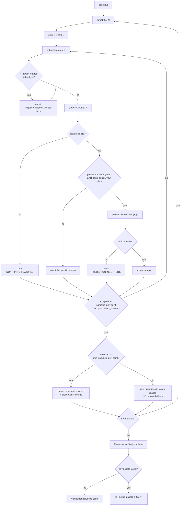

### Story 2.3: Evaluation runner — present known targets, collect predictions, emit a measurement set

**File**: `docs/plans/stories/epic-2-story-2.3-Evaluation-Runner.md`
**BUILDID**: CYCLE-1 | **Epic**: 2 - ACCURACY MEASUREMENT & BASELINE | **ID**: 2.3 | **Date**: 2026-08-07 | **Jira**: LOCAL | **GitHub**: LOCAL
**Wave**: 5
**Requires**: [2.1, 2.2]
**Enables**: [2.4, 2.5]
**Files Touched**:
  - eye_tracker/evaluation/runner.py
  - tests/integration/test_evaluation_runner.py
  - tests/conftest.py
**Roles Ref**: `docs/requirements.md#roles--permissions-matrix` — single-actor, no role variation
**QA Candidate**: No — a pure state machine with no window and no device. It owns the *sequencing* of a session; the on-screen surface that drives it is not built in CYCLE-1. QA exercises it inside Epic 2 Group 1 once Story 2.5 wires a session, and its rejection accounting is verified there by deliberately blinking and turning away and confirming the counts move.

---

#### 👤 User Reference

**Description**:

This is the part that actually runs a measurement session. It walks through the list of dots from the protocol, one at a time; for each dot it waits a moment for the person to look at it, then collects readings; then it decides whether that dot produced a usable measurement or not, and moves on. At the end it hands over a record of what happened: where each dot was, where the tracker thought the person was looking, and — for every reading it threw away — **why**.

That last part is the point of the story. A measurement harness that quietly discards awkward readings will always produce a flattering number. So nothing is discarded silently: every rejected reading is counted against a named reason (eyes closed, blinking, head turned too far, the predictor failed, and so on), and if a dot cannot produce enough good readings it is marked unusable with the dominant reason attached, rather than being padded out with the bad ones.

That padding is not hypothetical. The existing calibration code does exactly that — when it cannot gather enough clean readings for a dot, it falls back to using the rejected ones and prints a note. For calibration that is a reasonable way to avoid deadlocking on a fussy camera. For a *measurement*, it would silently corrupt the number the whole project is judged against, so this story forbids it explicitly.

Three decisions were settled by measurement rather than preference:

**Which signal gets scored.** The smoothed position — the one actually drawn on screen — not the raw prediction behind it. That is what a person experiences, so that is what "accuracy" has to mean. The protocol records this choice, so the later re-measurement cannot quietly score something else.

**How long to wait before believing a reading.** The smoothing carries over from the previous dot, so the first readings after a jump are contaminated. Measured: in normal conditions the position settles within about two frames, comfortably inside the existing 0.9-second pause. In the pathological case where the tracker is wildly unsure of itself, settling can take almost four seconds — so the record also carries how much each dot's readings varied, which is what would expose it.

**A surprising one:** small jumps between neighbouring dots settle *slower* than big jumps across the screen — 113 frames versus 12 in the worst case — because the smoothing deliberately reacts faster to fast movement. So the awkward case is adjacent dots, not the long jump at the end of a row, which is the opposite of what one would guess.

The runner also refuses two things outright: producing a scoreable result when **no** dot yielded a usable measurement, and letting an abandoned session look like a finished one.

Nothing a user of the application would notice changes — this story adds no window and touches no existing behaviour.

**Acceptance Criteria** (plain-English):

- The runner walks the protocol's dots in order and reports which dot is current.
- For each dot it waits the protocol's pause before it starts believing readings, and readings during that pause are **counted as skipped**, not silently ignored.
- Readings taken while the eyes are closed, mid-blink, squinting, or with the head turned or tilted too far are rejected, each against a named reason and counted.
- A reading whose prediction is missing or not a number is rejected and counted, never treated as a zero.
- If the predictor raises an error, that is counted too and the session continues.
- A dot that gathers enough good readings produces one measurement, along with how many readings it used and how much they varied.
- A dot that cannot gather enough good readings is marked **unusable** with the dominant reason — and is never padded out with the readings that were rejected.
- The final record can be handed straight to the error-statistics module without any further filtering.
- If no dot produced a usable measurement, the runner **refuses** to produce a scoreable result rather than reporting a perfect or empty one.
- An abandoned session is marked as abandoned and cannot be mistaken for a completed one.
- Running the same sequence of readings twice produces exactly the same record — no clock and no randomness inside.
- The record states which point in the prediction chain was scored and which acceptance thresholds were used, so a later session can match them.
- Nothing needs a camera, a screen or an internet connection: the readings and the timestamps are both supplied from outside.
- The application itself is unchanged and behaves exactly as before.

**User Flow**:

`Actor: system — no role variation.`

**Flow Diagram**:



---

#### 🤖 AI Agent Reference

> Audience: the DEV agent. The implementation contract — everything needed to build this story in a fresh AI session.

**Must Read**:
- `docs/requirements.md` — **FR-10** (the harness), **FR-11**, **FR-12**, **FR-24** (rejection accounting — this story is its first consumer, though the counters themselves land at M6), **success criterion 6**, **failure criterion 1** ("any silent failure survives")
- `docs/plans/stories/epic-2-story-2.2-Evaluation-Protocol.md` — `Protocol`, `SignalRecord`, `TargetLayout`, `SessionParameters` are **consumed unchanged**
- `docs/plans/stories/epic-2-story-2.1-Error-Metrics.md` — `summarise()` is the consumer of this story's output; the pair ordering must match what it expects
- 🔴 `main.py:87-126` — `AppController._on_feat`: the **live** chain, in order — gates, motion score, median over a 2–5 frame window, `predict_with_variance`, finite check, `OneEuro2D.filter`, `overlay.update_position`. This is the signal a user experiences and therefore the signal this story scores
- 🔴 `eye_tracker/overlay.py:159-215` — `CalibrationWindow._on_feat` and `_finish_collect`, including the **relaxed fallback** at lines 204-209 that this story forbids, and the different gate thresholds at lines 181-189
- `eye_tracker/one_euro.py` — `OneEuro2D.filter(x, y, variance=None, t=None, motion=0.0)`
- `eye_tracker/gaze.py` — `FEATURE_A_EAR`, `FEATURE_B_EAR`, `FEATURE_BLINK_AVG`, `FEATURE_SQUINT_AVG`, `FEATURE_YAW`, `FEATURE_PITCH`
- `docs/architecture/design/03-patterns-and-standards-brownfield.md` — **§1** (`evaluation/` is APPLICATION — *no PyQt6*), **§10** (concurrency and GUI-thread affinity), **§11**, **§12**
- `docs/architecture/design/02-target-architecture-brownfield.md` — DR-6 (`LivePipeline`, which does **not** exist yet), the `evaluation/` table
- `SPEC/references/` — **0 files**

**Description**:

FR-10 needs a *repeatable* harness. This story is the sequencer: walk the protocol's targets, gather predictions during each fixation, account for everything rejected, and emit a `MeasurementSet` that Story 2.1 can score and Story 2.4 can render.

🔴 **The runner is a pure state machine and owns no window — that is forced, not chosen.** `evaluation/runner.py` is **APPLICATION** layer (patterns §1), so it cannot import PyQt6; Story 1.4's import test enforces it. The presentation surface therefore *drives* the runner rather than living inside it: something infrastructure-side shows a dot and calls `submit(features, t)`. Two consequences, both good: the entire sequencing logic is testable with **no Qt at all**, and the surface that shows dots during CYCLE-1 can be Story 2.5's minimal script rather than a new production window.

🔴 **Time and prediction are both injected.** `submit(features, t)` takes a monotonic timestamp from the caller, and the predictor is a callable. No `time.monotonic()`, no `Date`, no randomness inside the runner — so a test replays an exact frame sequence and gets an exact record. This follows the existing style: `main.py:103` already passes `now` explicitly and `OneEuro2D.filter` already takes `t`.

🔧 **Five findings from the shipped code and from measurement. One contradicts the obvious guess.**

**Finding 1 — 🔴 the existing calibration code pads a short target with rejected frames, and a measurement must not.** `overlay.py:200-209`:

```
if len(self._buf) >= self.min_samples_per_point:   chosen = self._buf
elif len(self._fallback_buf) >= self.min_samples_per_point:
    chosen = self._fallback_buf
    print(f"[calibration] point {point_no}: using relaxed fallback ...")
```

`_fallback_buf` holds **every** finite frame including the ones the gates rejected. For calibration that is a defensible anti-deadlock measure. For an accuracy measurement it silently substitutes bad data for missing data and biases the headline number in the flattering direction. AC 12 forbids it: a target that cannot gather `min_samples_per_point` gated samples is **unusable**, with its dominant rejection reason recorded.

**Finding 2 — 🔴 the live and calibration gates diverge on 4 of 5 thresholds** (TD-1, verified by reading both):

| Gate | Calibration (`overlay.py:181-189`) | Live (`main.py:94-102`) | Diverged |
|---|---|---|---|
| `A_EAR` / `B_EAR` floor | `< 0.16` | `< 0.16` | no |
| `BLINK_AVG` ceiling | `> 0.55` | `> 0.58` | **yes** |
| `SQUINT_AVG` ceiling | `> 0.55` | `> 0.58` | **yes** |
| `|FEATURE_YAW|` ceiling | `> 0.60` | `> 0.70` | **yes** |
| `|FEATURE_PITCH|` ceiling | `> 0.45` | `> 0.55` | **yes** |

The runner uses the **live** values, because it measures the live experience. ⚠️ FR-14/FR-15 collapse these to one definition at M2 (CYCLE-2), which will change *which frames are accepted* between the pre- and post-fix sessions. That is part of the remediation being measured, not a defect — but it must be **stated in the report**, so the thresholds used are recorded in the `MeasurementSet` (AC 7) and Story 2.4 must print them. ⚠️ Raised for the owners rather than resolved here.

**Finding 3 — the smoother carries over between targets, and the existing dwell is enough in normal conditions.** Measured with `main.py:35`'s tuning at 30 fps:

| Inter-target jump | `cutoff_scale` | Frames to 90% | to 99% | to <5 px | to <1 px |
|---|---|---|---|---|---|
| 422 px (adjacent column) | 1.000 | 1 | 2 | 2 | 2 |
| 422 px | 0.850 | 1 | 2 | 2 | 2 |
| 422 px | **0.011** | 6 | 18 | 16 | **113** |
| 1689 px (row wrap) | 1.000 | 1 | 1 | 2 | 2 |
| 1689 px | 0.850 | 1 | 2 | 2 | 2 |
| 1689 px | **0.011** | 3 | 6 | 8 | **12** |

The protocol's `dwell_ms = 900` is **27 frames** at 30 fps. In distribution (`scale ≈ 0.85`, per Story 1.6's interlock figures) settling takes **2 frames** — the dwell is ample. At `scale = 0.011`, which only occurs when the model is extrapolating wildly and is itself a signal that the target is out of distribution, a 422 px jump needs **113 frames (3.8 s)** to settle within 1 px. The runner does **not** reset the smoother between targets — that is not what a user experiences, and `OneEuro2D.reset()` does not exist until M4 — so instead it records **per-target dispersion**, which is what exposes an unsettled target to a reader.

**Finding 4 — 🔧 small jumps settle *slower* than large ones, which is the opposite of the obvious guess.** At `scale = 0.011`, the 422 px jump takes **113** frames to reach 1 px while the 1689 px jump takes **12**. The cause is the One Euro adaptive term: cutoff is `min_cutoff + beta·|dx|`, so a larger derivative *raises* the cutoff and the filter tracks faster. Consequence for this story: the worst case for settling is **adjacent targets**, not the long row-wrap jump, so a "settling allowance" tuned by watching the biggest jump would be tuned against the easiest case.

**Finding 5 — no rejection-counter infrastructure exists yet, so the runner defines its own.** `eye_tracker/diagnostics.py` (the counter registry) is an M2 file per patterns §18, and `errors.py` is M4. So this story ships a local `RejectionReason` enum and plain integer counts, with an AC recording that they converge into `diagnostics.py`'s registry when FR-24's accounting lands at **M6 (CYCLE-4)** — deliberate, dated duplication rather than an invented dependency.

✅ **The code in Steps 1–5 was assembled and executed before this story shipped** — against the **real** `eye_tracker/gaze.py` feature indices and the `metrics.py`/`protocol.py` from Stories 2.1 and 2.2. All **20 test cases pass** (16 test functions, one parametrised five ways). No function exceeds 30 statements.

🔧 **Execution found one over-specified assertion, and it became AC 20a.** A test asserting an exact accepted-sample count at the dwell boundary **failed by exactly one frame**: accumulating `t += 1/30` twenty-seven times gives `0.8999999999999999` — below the 900 ms boundary — while the absolute `27/30` gives `0.9000000000000000`. The runner was correct both times; the *test helper* was drifting. The fix is absolute timestamps (which is also what a real caller's `time.monotonic()` gives), plus an explicit note forbidding an epsilon inside `submit`. Without that note the obvious "fix" is to loosen the runner, which would move a timing boundary the protocol defines.

**Acceptance Criteria** (technical):

1. `eye_tracker/evaluation/runner.py` exists with a module docstring declaring `Layer: application` on the line after the summary.
2. 🔴 It imports **stdlib, `numpy`, `.metrics`, `.protocol` and `eye_tracker.gaze` only**. No PyQt6, no cv2, no `overlay`, no `main`. `tests/arch/test_import_direction.py` (Story 1.4) is the enforcement.
3. A `RejectionReason` enum (str-valued, so it serialises) with at least: `DWELL`, `NON_FINITE_FEATURES`, `EYES_CLOSED`, `BLINK`, `SQUINT`, `HEAD_YAW`, `HEAD_PITCH`, `PREDICTION_FAILED`, `PREDICTION_NON_FINITE`. ⚠️ A docstring records that these merge into `diagnostics.py`'s registry at **M6 (CYCLE-4)** under FR-24, so the duplication is dated rather than discovered.
4. A frozen dataclass `GateThresholds(ear_floor, blink_ceiling, squint_ceiling, yaw_ceiling, pitch_ceiling)` with a `live()` classmethod returning **`main.py:94-102`'s** values: `0.16, 0.58, 0.58, 0.70, 0.55`.
5. 🔴 `GateThresholds`' docstring records the calibration/live divergence table from Finding 2, states that the **live** values are used because the live experience is what is measured, and notes that FR-14/FR-15 unify them at M2 — changing frame acceptance between the two sessions in a way the report must state.
6. `GateThresholds.reject(features)` returns the `RejectionReason` a feature vector fails on, or `None`. Order is fixed and documented (`EYES_CLOSED` before `BLINK`) so the dominant-reason attribution is deterministic.
7. A frozen dataclass `TargetMeasurement(target_px, prediction_px, accepted_samples, rejections, usable, dispersion_px, unusable_reason)`. `rejections` is a `tuple[tuple[str, int], ...]` sorted by reason name — **not a dict** — so the record is JSON-serialisable and stable across runs.
8. `prediction_px` is the **median** of the accepted per-sample predictions, per axis. ⚠️ The docstring states the alternative (mean) and why median was chosen: robustness to a saccade or blink at the edge of a fixation window, which would otherwise pull a single target's figure without being visible in the count.
9. `dispersion_px` is the median absolute deviation of the accepted samples from `prediction_px`. It exists to expose an unsettled or wandering fixation, which is the observable consequence of Finding 3's pathological case.
10. A frozen dataclass `MeasurementSet(protocol, measurements, gates, aborted, started_utc)` with properties `complete`, `usable_count`, and `usable_measurements`.
11. 🔴 `MeasurementSet.aborted` is `True` for any session that did not reach the last target, and `complete` is `False` in that case. **An abandoned session must never be mistakable for a finished one** — failure criterion 1's spirit applied to the measurement itself.
12. 🔴 **No relaxed fallback.** A target whose accepted-sample count is below `protocol.session.min_samples_per_point` is `usable=False`, with `unusable_reason` set to the highest-count rejection reason and `prediction_px=None`. A comment cites `overlay.py:204-209` as the pattern being deliberately **not** copied, and says why: it substitutes bad data for missing data and biases the number favourably.
13. `MeasurementSet.to_metric_pairs()` returns `(targets, predictions)` as two lists of `(x, y)` covering **only** usable targets, in target order, directly consumable by Story 2.1's `summarise`.
14. 🔴 `to_metric_pairs()` raises `ValueError` when `usable_count == 0`, naming the total target count and the dominant rejection reason. A measurement with nothing usable must never yield an empty-but-plausible statistics object.
15. `EvaluationRunner(protocol, predict, gates=GateThresholds.live())` where `predict` is `Callable[[np.ndarray], tuple[float, float]]` — the **smoothed** position, matching `protocol.signal.scored_signal`.
16. 🔴 The runner **validates** at construction that `protocol.signal.scored_signal == "smoothed"` matches what the caller says it is injecting, raising `ValueError` on `"raw"` unless explicitly constructed for it. The protocol's claim about the scored signal and the injected callable must not be able to disagree — that disagreement is exactly what Story 2.2's `SignalRecord` exists to prevent, and it would be invisible.
17. `begin(t)` starts the first target's dwell; `current_target()` returns the current `(x, y)` or `None` when finished.
18. `submit(features, t)` advances the machine and returns the `RejectionReason` applied, or `None` when the sample was accepted — so a caller can display live feedback without reaching inside.
19. Samples arriving before `dwell_ms` has elapsed for the current target are counted as `RejectionReason.DWELL` and discarded. 🔴 They are **counted**, not ignored: the record must show the settling period was honoured, and a target whose entire budget went to `DWELL` is a distinguishable failure.
20. A target ends when accepted samples reach `samples_per_point` **or** `t` exceeds the target's start plus `dwell_ms + collect_timeout_ms`. Both bounds come from the protocol; neither is a literal in the runner.
20a. ⚠️ **The dwell boundary is exact only with absolute timestamps, and the runner must not paper over that.** Measured: accumulating `t += 1/30` twenty-seven times yields `0.8999999999999999`, which is **below** the 900 ms boundary, so one extra frame is counted as `DWELL` and one fewer sample is accepted; the absolute `27/30` yields `0.9000000000000000`, which is not. A real caller reads `time.monotonic()`, which is absolute. The test helper therefore uses `t0 + index/fps`, and a comment forbids "fixing" this with an epsilon inside `submit` — the runner is correct, accumulation is what drifts.
21. `abort()` marks the set aborted and stops accepting samples; subsequent `submit` calls raise `RuntimeError` rather than silently doing nothing.
22. 🔴 The runner never resets the smoother between targets, and a comment records why with Finding 3's measured table: resetting is not what a user experiences, `OneEuro2D.reset()` does not exist until M4, and the 27-frame dwell covers the in-distribution 2-frame settling. `dispersion_px` is the compensating observable.
23. `result()` returns the `MeasurementSet`. It is pure and repeatable — calling it twice returns equal objects and does not mutate the runner.
24. 🔴 The whole runner is deterministic: no clock, no randomness, no I/O, no global state. Replaying an identical `(features, t)` sequence produces an **equal** `MeasurementSet`.
25. `started_utc` is a caller-supplied string, never read from a clock inside the runner — the same injection rule, and what keeps AC 24 true.
26. 🔴 **No feature vector, landmark array or frame is stored in the `MeasurementSet` or in any log line.** Only screen coordinates, counts and reasons. Patterns §3: the feature vector is biometric data and this record is committed to the repository. An assertion or error message must never include one.
27. `tests/integration/test_evaluation_runner.py` drives complete sessions with synthetic frames and **no Qt at all**, covering every test in the table below.
28. ⚠️ Fixtures shared with other suites go in `tests/conftest.py`; single-use builders stay local. `tests/conftest.py` is a `shared_files` entry touched by Stories 1.3 (wave 2), 1.6 (wave 3) and this one (wave 5) — never concurrently — and additions must be **additive**, not changes to existing fixture signatures.
29. Public classes and functions carry NumPy-style docstrings (patterns §12); every function ≤30 statements (patterns §14).
30. `ruff check` and `ruff format --check` clean.
31. 🔴 **Zero modification to existing application source** — `git diff --stat -- main.py eye_tracker/overlay.py eye_tracker/tracker.py eye_tracker/gaze.py eye_tracker/calibration.py eye_tracker/face_mesh.py eye_tracker/one_euro.py eye_tracker/evaluation/metrics.py eye_tracker/evaluation/protocol.py` empty.
32. The two items from Findings 2 and 5 are raised with their owners as recorded open items: the M2 gate unification changing frame acceptance between sessions, and the `RejectionReason` → `diagnostics.py` convergence at M6.

**RBAC Enforcement**:

`No role-differentiated access — single actor.`

- **Enforcement point(s)**: none — a state machine with no window, no route and no runtime authority check.
- **Denied-access contract**: N/A — no request surface exists. The refusals in AC 14, 16 and 21 are *state-validity* refusals and must not be described as security controls.
- **Scope derivation**: **N/A — no scoped permission exists, and there is no token or session to derive scope from.** The binding discipline is data minimisation (patterns §3), and it is load-bearing here: the runner *receives* 38-D biometric feature vectors and must store **none** of them. AC 26 keeps the committed `MeasurementSet` free of biometric data, which is the difference between a report that can live in the repository and one that cannot.

**System responses + error cases**:

| Trigger | Response | Side-effect |
|---|---|---|
| A full clean session of `N` targets | `MeasurementSet` with `complete=True`, `aborted=False`, one `TargetMeasurement` per target | None |
| Replaying the identical `(features, t)` sequence (idempotent) | An **equal** `MeasurementSet` — no clock, no randomness, no I/O | None. AC 24 |
| `submit` during the dwell window | Returns `RejectionReason.DWELL`, sample discarded and **counted** | None. AC 19 — counted so the settling period is auditable |
| Eyes closed (`A_EAR < 0.16`) | `RejectionReason.EYES_CLOSED`, counted | None |
| `BLINK_AVG > 0.58` / `SQUINT_AVG > 0.58` | `BLINK` / `SQUINT`, counted | None. Live thresholds, not calibration's 0.55 (Finding 2) |
| Head turned past `|yaw| > 0.70` or nodded past `|pitch| > 0.55` | `HEAD_YAW` / `HEAD_PITCH`, counted | None |
| `predict` raises | `RejectionReason.PREDICTION_FAILED`, counted, session continues | None. Mirrors `main.py:115`'s try/except, without its `print` |
| `predict` returns `NaN` | `PREDICTION_NON_FINITE`, counted | None. Mirrors `main.py:118`; DR-16 makes `NaN` an expected value |
| A target gathers fewer than `min_samples_per_point` accepted samples | `usable=False`, `prediction_px=None`, `unusable_reason` = dominant reason | None. AC 12 — **no** relaxed fallback, unlike `overlay.py:204-209` |
| `to_metric_pairs()` with **zero** usable targets | `ValueError` naming the target count and dominant reason | None. AC 14 — never an empty-but-plausible statistics object |
| `abort()` mid-session | `aborted=True`, `complete=False`; the partial set is still inspectable | None. AC 11 |
| `submit` after `abort()` | `RuntimeError` | None. AC 21 — silence here would produce a set nobody could explain |
| `EvaluationRunner` built with a protocol saying `scored_signal="raw"` while a smoothed predictor is injected | `ValueError` | None. AC 16 — the protocol's claim and the injected chain must not be able to disagree |
| A target at `cutoff_scale ≈ 0.011` with a 422 px jump from the previous target | Accepted, but `dispersion_px` will be large — the settling signature | ⚠️ Finding 3. The dwell covers the in-distribution case; dispersion is what exposes this one |
| An operator wants the biggest jump used to tune a settling allowance | Would tune against the **easiest** case — 12 frames vs 113 for an adjacent target | ⚠️ Finding 4, recorded so the mistake is not made |
| `python main.py` after this story | Application behaves exactly as before | None (AC 31) |

**Prerequisites**:

- **Story 2.1 complete** — `summarise` consumes `to_metric_pairs()`; the pair ordering must match.
- **Story 2.2 complete** — `Protocol`, `SignalRecord`, `SessionParameters` and `TargetLayout` are consumed **unchanged**. ⚠️ If a field is missing, raise it rather than widening 2.2's surface silently.
- **Story 1.3 complete** — `tests/integration/`, `tests/conftest.py`, and the synthetic feature-vector builders this story's frames are made from.
- ⚠️ **`tests/conftest.py` is a `shared_files` entry.** Waves 2, 3 and 5 touch it in sequence, so no concurrent write arises — but additions must not alter existing fixture signatures.
- 🔴 **There is no `LivePipeline` to reuse.** DR-6 extracts it at M6 (CYCLE-4); until then the live chain lives inline in `main.py:87-126`, which is ENTRY layer and cannot be imported here. The predictor is therefore **injected by the caller**, and Story 2.5's session script is what wires it. ⚠️ This is a recorded consequence, not a workaround to hide: the injected callable must be the chain a user experiences, and `protocol.signal.prediction_chain_source` is where that claim is written down.
- No camera, no display, no network — frames and timestamps are supplied.

**Context** (read before writing):
- `main.py:87-126` — the live chain in order. Note `_motion_score` and the 2/3/5-frame median window: the injected predictor is responsible for reproducing this, not the runner
- `eye_tracker/overlay.py:152-215` — `_begin_collect`, `_on_feat`, `_finish_collect`; the gates at 181-189 and the relaxed fallback at 200-209
- `eye_tracker/one_euro.py` — `filter(x, y, variance=None, t=None, motion=0.0)`
- `eye_tracker/gaze.py` — the six gate feature indices
- `docs/architecture/design/02-target-architecture-brownfield.md` — DR-6, DR-16, the `evaluation/` component table
- `docs/plans/stories/epic-1-story-1.6-Invariant-Locks.md` — the interlock figures that place in-distribution `cutoff_scale` near 0.85

**Patterns**:
- **Internal Contract Format** `[Current — kept]` — patterns §5. Frozen dataclasses across module boundaries; `rejections` is a sorted tuple of pairs rather than a dict so the record is stable and serialisable.
- **Named indices over magic numbers** — `01-gaze-deep-dive.md` Pattern 1. Gate feature indices come from `gaze.py`'s constants; thresholds live in `GateThresholds`, never inline.
- **Numerical Guards** `[Current — kept]` — patterns §11. Finite checks on both the features and the prediction, matching `overlay.py:163` and `main.py:118`.
- **Concurrency & Thread Affinity** `[Current — kept]` — patterns §10. The runner is passive and holds no timers, so it inherits the caller's thread and adds no cross-thread state. ⚠️ It must be driven from the GUI thread, exactly as `_on_feat` is today.
- **Documentation Standards** `[New adoption]` — patterns §16. Every decision that could have gone the other way (median vs mean, no reset, live gates) states its reason and what would change it.

**Steps**:

1. **Reasons and gates**, with the divergence recorded.

   ```python
   """Evaluation session sequencer — walks the protocol's targets and accounts for
   every rejected sample.

   Layer: application

   FR-10 needs a REPEATABLE harness, so this module is a pure state machine: time
   and prediction are both injected, there is no clock and no randomness, and
   replaying a frame sequence reproduces the record exactly.

   IT OWNS NO WINDOW, and that is forced rather than chosen. evaluation/ is
   APPLICATION layer (patterns section 1), so importing PyQt6 here would fail
   tests/arch/test_import_direction.py. The presentation surface DRIVES this class:
   it shows a dot and calls submit(features, t).

   WHAT IS SCORED: the SMOOTHED position -- what main.py:120-126 actually draws --
   not the raw calibrator output. The predictor is injected because there is no
   LivePipeline to reuse: DR-6 extracts it at M6 (CYCLE-4), and until then the chain
   lives inline in main.py:87-126, which is ENTRY layer.
   """
   from __future__ import annotations

   import dataclasses
   import enum
   import statistics
   from collections.abc import Callable, Sequence

   import numpy as np

   from eye_tracker.gaze import (
       FEATURE_A_EAR, FEATURE_B_EAR, FEATURE_BLINK_AVG, FEATURE_PITCH,
       FEATURE_SQUINT_AVG, FEATURE_YAW,
   )

   from .protocol import Protocol


   class RejectionReason(enum.StrEnum):
       """Why a submitted sample was not used.

       MIGRATION NOTE: eye_tracker/diagnostics.py is the counter registry FR-24
       introduces, and patterns section 18 places it at M2/M6 -- it does not exist in
       CYCLE-1. These names and the plain integer counts converge into that registry
       when FR-24's rejection accounting lands at M6 (CYCLE-4). The duplication is
       dated, not accidental.
       """

       DWELL = "dwell"
       NON_FINITE_FEATURES = "non_finite_features"
       EYES_CLOSED = "eyes_closed"
       BLINK = "blink"
       SQUINT = "squint"
       HEAD_YAW = "head_yaw"
       HEAD_PITCH = "head_pitch"
       PREDICTION_FAILED = "prediction_failed"
       PREDICTION_NON_FINITE = "prediction_non_finite"


   @dataclasses.dataclass(frozen=True)
   class GateThresholds:
       """Frame-acceptance thresholds.

       THE LIVE AND CALIBRATION GATES DIVERGE ON 4 OF 5 THRESHOLDS (TD-1), measured
       from source:

           gate                 calibration (overlay.py:181)  live (main.py:94)
           A_EAR / B_EAR floor  < 0.16                        < 0.16
           BLINK_AVG ceiling    > 0.55                        > 0.58
           SQUINT_AVG ceiling   > 0.55                        > 0.58
           |FEATURE_YAW|        > 0.60                        > 0.70
           |FEATURE_PITCH|      > 0.45                        > 0.55

       live() returns the LIVE values, because the live experience is what is being
       measured. FR-14/FR-15 collapse these to one definition at M2 (CYCLE-2), which
       WILL change which frames are accepted between the pre- and post-fix sessions.
       That is part of the remediation being measured, not a defect -- but the
       MeasurementSet records the thresholds used so Story 2.4 can state it.
       """

       ear_floor: float
       blink_ceiling: float
       squint_ceiling: float
       yaw_ceiling: float
       pitch_ceiling: float

       @classmethod
       def live(cls) -> GateThresholds:
           """The thresholds main.py:94-102 applies to the live path."""
           return cls(ear_floor=0.16, blink_ceiling=0.58, squint_ceiling=0.58,
                      yaw_ceiling=0.70, pitch_ceiling=0.55)

       def reject(self, features: np.ndarray) -> RejectionReason | None:
           """The reason this frame fails on, or None.

           The order is FIXED so dominant-reason attribution is deterministic:
           eyes-closed is tested before blink because a closed eye also reads as a
           blink, and the more specific reason is the more useful one.
           """
           if not np.all(np.isfinite(features)):
               return RejectionReason.NON_FINITE_FEATURES
           if (features[FEATURE_A_EAR] < self.ear_floor
                   or features[FEATURE_B_EAR] < self.ear_floor):
               return RejectionReason.EYES_CLOSED
           if features[FEATURE_BLINK_AVG] > self.blink_ceiling:
               return RejectionReason.BLINK
           if features[FEATURE_SQUINT_AVG] > self.squint_ceiling:
               return RejectionReason.SQUINT
           if abs(features[FEATURE_YAW]) > self.yaw_ceiling:
               return RejectionReason.HEAD_YAW
           if abs(features[FEATURE_PITCH]) > self.pitch_ceiling:
               return RejectionReason.HEAD_PITCH
           return None
   ```

2. **The per-target and whole-session records.**

   ```python
   @dataclasses.dataclass(frozen=True)
   class TargetMeasurement:
       """One target's outcome.

       prediction_px is the MEDIAN of the accepted samples per axis. The mean was
       the alternative; median was chosen because a saccade or blink at the edge of a
       fixation window pulls a mean without changing the accepted count, so the
       distortion would be invisible in the record. dispersion_px (median absolute
       deviation) is what exposes an unsettled or wandering fixation.
       """

       target_px: tuple[float, float]
       prediction_px: tuple[float, float] | None
       accepted_samples: int
       rejections: tuple[tuple[str, int], ...]
       usable: bool
       dispersion_px: float | None
       unusable_reason: str | None

       @property
       def dominant_rejection(self) -> str | None:
           """The reason with the highest count, or None if nothing was rejected."""
           if not self.rejections:
               return None
           return max(self.rejections, key=lambda pair: (pair[1], pair[0]))[0]


   @dataclasses.dataclass(frozen=True)
   class MeasurementSet:
       """Everything one session produced, ready for Story 2.1 to score."""

       protocol: Protocol
       measurements: tuple[TargetMeasurement, ...]
       gates: GateThresholds
       aborted: bool
       started_utc: str

       @property
       def complete(self) -> bool:
           """True only if every protocol target was reached and not aborted.

           An abandoned session must never be mistakable for a finished one.
           """
           return (not self.aborted
                   and len(self.measurements) == self.protocol.layout.target_count)

       @property
       def usable_measurements(self) -> tuple[TargetMeasurement, ...]:
           return tuple(m for m in self.measurements if m.usable)

       @property
       def usable_count(self) -> int:
           return len(self.usable_measurements)

       def to_metric_pairs(self) -> tuple[list[tuple[float, float]],
                                          list[tuple[float, float]]]:
           """(targets, predictions) for evaluation.metrics.summarise.

           Raises
           ------
           ValueError
               If no target was usable. A measurement with nothing usable must never
               yield an empty-but-plausible statistics object.
           """
           usable = self.usable_measurements
           if not usable:
               raise ValueError(
                   f"no usable targets out of {len(self.measurements)} — "
                   f"dominant rejection: {self.dominant_rejection()!r}. "
                   "Refusing to produce scoreable pairs"
               )
           return ([m.target_px for m in usable],
                   [m.prediction_px for m in usable])

       def dominant_rejection(self) -> str | None:
           """The most frequent rejection reason across the whole session."""
           totals: dict[str, int] = {}
           for measurement in self.measurements:
               for reason, count in measurement.rejections:
                   totals[reason] = totals.get(reason, 0) + count
           if not totals:
               return None
           return max(totals.items(), key=lambda pair: (pair[1], pair[0]))[0]


   def _dominant(rejections: Sequence[tuple[str, int]]) -> str | None:
       """Reason with the highest count; ties broken by name so it is deterministic."""
       if not rejections:
           return None
       return max(rejections, key=lambda pair: (pair[1], pair[0]))[0]


   def _median_absolute_deviation(samples: Sequence[tuple[float, float]],
                                  centre: tuple[float, float]) -> float:
       """Median distance of the accepted samples from their median position."""
       return float(statistics.median(
           float(np.hypot(x - centre[0], y - centre[1])) for x, y in samples
       ))
   ```

3. **The state machine.**

   ```python
   class EvaluationRunner:
       """Walks the protocol's targets, collecting one measurement per target.

       Parameters
       ----------
       protocol : Protocol
           Supplies the target layout and every timing bound. No timing literal
           appears in this class.
       predict : callable
           features -> (x, y). MUST be the chain the protocol claims in
           signal.scored_signal -- by default the SMOOTHED position, which is what
           main.py:120-126 draws.
       gates : GateThresholds, optional
           Defaults to the live thresholds.

       THE SMOOTHER IS NEVER RESET BETWEEN TARGETS. That is deliberate: resetting is
       not what a user experiences, and OneEuro2D.reset() does not exist until M4.
       Measured settling at main.py:35's tuning and 30 fps -- in distribution
       (cutoff_scale ~0.85) a target jump settles within 1 px in 2 frames, and the
       protocol's dwell_ms=900 is 27 frames, so the dwell covers it comfortably. At
       cutoff_scale 0.011 a 422 px jump needs 113 frames; dispersion_px is the
       compensating observable. Counter-intuitively the 1689 px row-wrap settles in
       12 frames, FASTER than the adjacent-column jump, because the adaptive term
       raises the cutoff with the derivative -- so the worst case is small jumps.
       """

       def __init__(self, protocol: Protocol,
                    predict: Callable[[np.ndarray], tuple[float, float]],
                    gates: GateThresholds | None = None,
                    expect_signal: str = "smoothed") -> None:
           if protocol.signal.scored_signal != expect_signal:
               raise ValueError(
                   f"protocol records scored_signal="
                   f"{protocol.signal.scored_signal!r} but this runner was given a "
                   f"{expect_signal!r} predictor — the record and the chain must agree"
               )
           self.protocol = protocol
           self._predict = predict
           self.gates = gates or GateThresholds.live()
           self._targets = protocol.layout.points_px
           self._index = 0
           self._target_started: float | None = None
           self._collecting = False
           self._accepted: list[tuple[float, float]] = []
           self._counts: dict[str, int] = {}
           self._done: list[TargetMeasurement] = []
           self._aborted = False

       def begin(self, t: float) -> None:
           """Start the first target's dwell at monotonic time `t`."""
           self._index = 0
           self._start_target(t)

       def current_target(self) -> tuple[float, float] | None:
           """The target now being presented, or None when the session is over."""
           if self._aborted or self._index >= len(self._targets):
               return None
           x, y = self._targets[self._index]
           return (float(x), float(y))

       def abort(self) -> None:
           """Abandon the session. The partial set stays inspectable."""
           self._aborted = True

       def _start_target(self, t: float) -> None:
           self._target_started = t
           self._collecting = False
           self._accepted = []
           self._counts = {}

       def _count(self, reason: RejectionReason) -> RejectionReason:
           self._counts[str(reason)] = self._counts.get(str(reason), 0) + 1
           return reason
   ```

4. **Sample handling and target completion.**

   ```python
       def submit(self, features: np.ndarray, t: float) -> RejectionReason | None:
           """Offer one frame. Returns the reason it was rejected, or None.

           Raises
           ------
           RuntimeError
               If the session was aborted or has already finished. Silently doing
               nothing would produce a record nobody could explain.
           """
           if self._aborted:
               raise RuntimeError("session was aborted — no further samples accepted")
           if self.current_target() is None:
               raise RuntimeError("session is complete — no further samples accepted")
           session = self.protocol.session
           elapsed_ms = (t - self._target_started) * 1000.0
           if elapsed_ms < session.dwell_ms:
               return self._count(RejectionReason.DWELL)
           self._collecting = True
           reason = self.gates.reject(np.asarray(features, dtype=float))
           if reason is None:
               reason = self._accept(features)
           else:
               self._count(reason)
           budget_ms = session.dwell_ms + session.collect_timeout_ms
           if (len(self._accepted) >= session.samples_per_point
                   or elapsed_ms >= budget_ms):
               self._finish_target(t)
           return reason

       def _accept(self, features: np.ndarray) -> RejectionReason | None:
           try:
               x, y = self._predict(features)
           except Exception:
               # Mirrors main.py:115's try/except, WITHOUT its print(): patterns
               # section 3 forbids emitting anything derived from a feature vector.
               return self._count(RejectionReason.PREDICTION_FAILED)
           if not (np.isfinite(x) and np.isfinite(y)):
               # DR-16 makes NaN an EXPECTED value on head-pose failure, not a bug.
               return self._count(RejectionReason.PREDICTION_NON_FINITE)
           self._accepted.append((float(x), float(y)))
           return None

       def _finish_target(self, t: float) -> None:
           session = self.protocol.session
           target = self.current_target()
           rejections = tuple(sorted(self._counts.items()))
           usable = len(self._accepted) >= session.min_samples_per_point
           prediction = dispersion = unusable_reason = None
           if usable:
               prediction = (statistics.median(p[0] for p in self._accepted),
                             statistics.median(p[1] for p in self._accepted))
               dispersion = _median_absolute_deviation(self._accepted, prediction)
           else:
               # NO RELAXED FALLBACK. overlay.py:204-209 substitutes the rejected
               # frames when a calibration point runs short; for a MEASUREMENT that
               # swaps bad data for missing data and biases the number favourably.
               unusable_reason = _dominant(rejections)
           self._done.append(TargetMeasurement(
               target_px=target, prediction_px=prediction,
               accepted_samples=len(self._accepted), rejections=rejections,
               usable=usable, dispersion_px=dispersion,
               unusable_reason=unusable_reason,
           ))
           self._index += 1
           if self._index < len(self._targets):
               self._start_target(t)

       def result(self, started_utc: str = "") -> MeasurementSet:
           """The record so far. Pure — calling twice returns equal objects."""
           return MeasurementSet(
               protocol=self.protocol, measurements=tuple(self._done),
               gates=self.gates,
               aborted=self._aborted or len(self._done) < len(self._targets),
               started_utc=started_utc,
           )
   ```

   ⚠️ Steps 3 and 4 are **one class** — Step 4 continues `EvaluationRunner`'s body. The two module-level helpers it calls (`_dominant`, `_median_absolute_deviation`) are at the end of Step 2.

5. **Drive whole sessions in tests, with no Qt.**

   ```python
   """Integration tests for the evaluation runner.

   Layer: test

   Drives complete sessions with synthetic frames and injected time. No Qt, no
   camera: the runner owns no window by design, so the whole sequencing contract is
   reachable without a display.
   """
   import numpy as np
   import pytest

   from eye_tracker.evaluation.runner import (
       EvaluationRunner, GateThresholds, RejectionReason,
   )

   FPS = 30.0


   def _feed(runner, frames, t0=0.0, fps=FPS):
       """Submit `frames` one per tick, returning the reason for each.

       🔴 ABSOLUTE timestamps, not `t += 1.0 / fps`. Measured: accumulating 1/30
       twenty-seven times gives 0.8999999999999999, which is BELOW the 900 ms dwell
       boundary, so the 28th frame is still counted as DWELL and one fewer sample is
       accepted. `27 / 30` gives 0.9000000000000000, which is not. A real caller
       reads time.monotonic(), which is absolute, so absolute is both the faithful
       model and the only one with an assertable boundary. Do NOT "fix" the runner
       with an epsilon — the runner is correct; accumulation is what drifts.
       """
       reasons = []
       for index, frame in enumerate(frames):
           if runner.current_target() is None:
               break
           reasons.append(runner.submit(frame, t0 + index / fps))
       return reasons


   def test_a_clean_session_produces_one_usable_measurement_per_target(
           evaluation_protocol, clean_frame, offset_predictor):
       runner = EvaluationRunner(evaluation_protocol, offset_predictor)
       runner.begin(0.0)
       target_count = evaluation_protocol.layout.target_count
       per_target = 27 + evaluation_protocol.session.samples_per_point
       _feed(runner, [clean_frame] * (target_count * per_target + 50))
       result = runner.result(started_utc="2026-08-07T18:00:00Z")
       assert result.complete and not result.aborted
       assert len(result.measurements) == target_count
       assert result.usable_count == target_count
       assert all(m.dispersion_px == pytest.approx(0.0) for m in result.usable_measurements)


   def test_dwell_samples_are_counted_not_silently_dropped(
           evaluation_protocol, clean_frame, offset_predictor):
       runner = EvaluationRunner(evaluation_protocol, offset_predictor)
       runner.begin(0.0)
       reasons = _feed(runner, [clean_frame] * 10)       # 10 frames < 27-frame dwell
       assert all(r is RejectionReason.DWELL for r in reasons)
       assert runner.result().measurements == ()


   def test_metric_pairs_are_ordered_and_consumable_by_the_metrics_module(
           evaluation_protocol, clean_frame, offset_predictor):
       from eye_tracker.evaluation.metrics import summarise
       runner = EvaluationRunner(evaluation_protocol, offset_predictor)
       runner.begin(0.0)
       per_target = 27 + evaluation_protocol.session.samples_per_point
       _feed(runner, [clean_frame] * (evaluation_protocol.layout.target_count * per_target + 50))
       targets, predictions = runner.result().to_metric_pairs()
       assert targets == [m.target_px for m in runner.result().usable_measurements]
       stats = summarise(targets, predictions, evaluation_protocol.viewing)
       assert stats.n_pairs == len(targets)
       assert stats.mean_px > 0.0


   def test_zero_usable_targets_refuses_to_produce_pairs(
           evaluation_protocol, blinking_frame, offset_predictor):
       runner = EvaluationRunner(evaluation_protocol, offset_predictor)
       runner.begin(0.0)
       per_target = 27 + evaluation_protocol.session.collect_timeout_ms / 1000.0 * FPS
       _feed(runner, [blinking_frame] * int(evaluation_protocol.layout.target_count * per_target + 50))
       result = runner.result()
       assert result.usable_count == 0
       with pytest.raises(ValueError, match="no usable targets"):
           result.to_metric_pairs()
       assert result.dominant_rejection() == str(RejectionReason.BLINK)


   def test_short_target_is_unusable_and_never_padded_with_rejected_frames(
           evaluation_protocol, clean_frame, blinking_frame, offset_predictor):
       """overlay.py:204-209's relaxed fallback is deliberately NOT copied."""
       runner = EvaluationRunner(evaluation_protocol, offset_predictor)
       runner.begin(0.0)
       frames = [clean_frame] * 30 + [blinking_frame] * 200
       _feed(runner, frames)
       first = runner.result().measurements[0]
       assert not first.usable
       assert first.prediction_px is None
       # 27 dwell frames at 30 fps, so 3 of the 30 clean frames are collected — and
       # 3 < min_samples_per_point. Holds only with absolute timestamps; see _feed.
       assert first.accepted_samples == 3
       assert first.accepted_samples < evaluation_protocol.session.min_samples_per_point
       assert first.unusable_reason == str(RejectionReason.BLINK)
       assert dict(first.rejections)[str(RejectionReason.DWELL)] == 27


   def test_abort_marks_the_set_and_stops_accepting_samples(
           evaluation_protocol, clean_frame, offset_predictor):
       runner = EvaluationRunner(evaluation_protocol, offset_predictor)
       runner.begin(0.0)
       _feed(runner, [clean_frame] * 40)
       runner.abort()
       result = runner.result()
       assert result.aborted and not result.complete
       with pytest.raises(RuntimeError, match="aborted"):
           runner.submit(clean_frame, 99.0)


   def test_predictor_failure_and_non_finite_output_are_counted_separately(
           evaluation_protocol, clean_frame):
       def failing(_features):
           raise RuntimeError("degenerate input")

       def nan_predictor(_features):
           return (float("nan"), 0.0)

       for predictor, reason in ((failing, RejectionReason.PREDICTION_FAILED),
                                 (nan_predictor, RejectionReason.PREDICTION_NON_FINITE)):
           runner = EvaluationRunner(evaluation_protocol, predictor)
           runner.begin(0.0)
           reasons = _feed(runner, [clean_frame] * 40)
           assert reason in reasons


   def test_replaying_the_same_sequence_is_deterministic(
           evaluation_protocol, clean_frame, offset_predictor):
       def run_once():
           runner = EvaluationRunner(evaluation_protocol, offset_predictor)
           runner.begin(0.0)
           _feed(runner, [clean_frame] * 400)
           return runner.result(started_utc="fixed")
       assert run_once() == run_once()


   def test_runner_refuses_a_protocol_that_claims_a_different_signal(
           evaluation_protocol_raw_signal, offset_predictor):
       with pytest.raises(ValueError, match="scored_signal"):
           EvaluationRunner(evaluation_protocol_raw_signal, offset_predictor)


   def test_live_gate_thresholds_match_main_py():
       gates = GateThresholds.live()
       assert (gates.ear_floor, gates.blink_ceiling, gates.squint_ceiling,
               gates.yaw_ceiling, gates.pitch_ceiling) == (0.16, 0.58, 0.58, 0.70, 0.55)


   @pytest.mark.parametrize("field,value,expected", [
       ("ear", 0.10, RejectionReason.EYES_CLOSED),
       ("blink", 0.90, RejectionReason.BLINK),
       ("squint", 0.90, RejectionReason.SQUINT),
       ("yaw", 1.20, RejectionReason.HEAD_YAW),
       ("pitch", 1.20, RejectionReason.HEAD_PITCH),
   ])
   def test_each_gate_reports_its_own_reason(clean_frame, field, value, expected,
                                            gate_field_index):
       frame = np.array(clean_frame, dtype=float)
       frame[gate_field_index[field]] = value
       assert GateThresholds.live().reject(frame) is expected


   def test_non_finite_features_are_rejected_before_any_gate(clean_frame):
       frame = np.array(clean_frame, dtype=float)
       frame[0] = float("nan")
       assert GateThresholds.live().reject(frame) is RejectionReason.NON_FINITE_FEATURES
   ```

   ⚠️ The fixtures `evaluation_protocol`, `evaluation_protocol_raw_signal`, `clean_frame`, `blinking_frame`, `offset_predictor` and `gate_field_index` go in `tests/conftest.py` — used by this suite and by Story 2.4's report tests. `clean_frame` must be a 38-D vector that passes every live gate; `offset_predictor` returns the current target displaced by a fixed vector so the resulting error is known exactly.

6. **Run the gate.**

   ```bash
   pytest tests/integration/test_evaluation_runner.py -v
   pytest tests/arch/ -v                          # AC 2
   ruff check eye_tracker/evaluation/ tests/
   ruff format --check eye_tracker/evaluation/ tests/
   grep -rn "PyQt6\|import cv2\|time\.\|random" eye_tracker/evaluation/runner.py
   git diff --stat -- main.py eye_tracker/overlay.py eye_tracker/tracker.py \
       eye_tracker/gaze.py eye_tracker/calibration.py eye_tracker/face_mesh.py \
       eye_tracker/one_euro.py eye_tracker/evaluation/metrics.py \
       eye_tracker/evaluation/protocol.py
   ```

   The `grep` must return **nothing** — no Qt, no cv2, no clock, no randomness (AC 24).

**Tests**:

| Test | Locks |
|---|---|
| `test_a_clean_session_produces_one_usable_measurement_per_target` | The happy path end to end, and zero dispersion for a perfectly steady predictor |
| `test_dwell_samples_are_counted_not_silently_dropped` | AC 19 — the settling period is auditable |
| `test_metric_pairs_are_ordered_and_consumable_by_the_metrics_module` | AC 13 — the seam with Story 2.1, exercised rather than assumed |
| `test_zero_usable_targets_refuses_to_produce_pairs` | AC 14 — never an empty-but-plausible statistics object |
| `test_short_target_is_unusable_and_never_padded_with_rejected_frames` | AC 12 — the `overlay.py:204-209` pattern deliberately not copied |
| `test_abort_marks_the_set_and_stops_accepting_samples` | AC 11, AC 21 |
| `test_predictor_failure_and_non_finite_output_are_counted_separately` | AC 18 — two different faults, two different counters |
| `test_replaying_the_same_sequence_is_deterministic` | AC 24 — no clock, no randomness |
| `test_runner_refuses_a_protocol_that_claims_a_different_signal` | AC 16 — the record and the chain cannot disagree |
| `test_live_gate_thresholds_match_main_py` | AC 4 — the live values, not calibration's |
| `test_each_gate_reports_its_own_reason` | AC 6 — all five gates, each distinguishable |
| `test_non_finite_features_are_rejected_before_any_gate` | AC 6 — ordering is deterministic |

Manual test cases — each a **break, observe, revert**:

| # | Perturbation | Expected |
|---|---|---|
| 1 | Copy `overlay.py`'s relaxed fallback into `_finish_target` | `test_short_target_is_unusable...` fails — the bias AC 12 forbids becomes visible |
| 2 | Discard dwell samples without counting them | `test_dwell_samples_are_counted...` fails — the settling period stops being auditable |
| 3 | Return zeros instead of raising from `to_metric_pairs()` on zero usable | `test_zero_usable_targets...` fails — a perfect-looking report from nothing |
| 4 | Use the calibration thresholds (`0.55 / 0.55 / 0.60 / 0.45`) | `test_live_gate_thresholds_match_main_py` fails — measures a different experience from the live one |
| 5 | Read `time.monotonic()` inside `submit` instead of taking `t` | `test_replaying_the_same_sequence_is_deterministic` becomes flaky — shows why time is injected |
| 6 | Use the **mean** of accepted samples instead of the median | The clean-session test still passes; add a frame with one wild outlier and the difference appears — which is the argument for the median |
| 7 | Let `submit` return silently after `abort()` | `test_abort_marks_the_set...` fails — a record nobody could explain |
| 8 | Reset the smoother between targets in the injected predictor | Dispersion drops but the measurement no longer matches the live experience — the change AC 22 forbids |
| 9 | Store the feature vector in `TargetMeasurement` | A biometric array reaches a committed artifact — patterns §3 violation, caught in review, not by a test |
| 10 | `pytest tests/integration/test_evaluation_runner.py` with no camera, no display, networking off | All pass |
| 11 | `git status --porcelain` after all reverts | Clean |
| 12 | `python main.py` | Application behaves exactly as before |

**Quality**: `ruff check` / `ruff format --check` clean · NumPy docstrings on every public class and function · every function ≤30 statements · no `TODO`/`FIXME` · no `print()` · no clock, no randomness, no I/O in `runner.py` · **no feature vector stored or emitted anywhere** · every decision that could have gone the other way states its reason · zero modification to existing application source.

**OUT**:
- ❌ **The on-screen surface that presents the targets.** The runner owns no window — APPLICATION layer cannot import Qt. Story 2.5's session script supplies presentation for CYCLE-1; a production evaluation window is not in scope for any cycle.
- ❌ **Building the prediction chain.** The predictor is injected. `LivePipeline` (DR-6) arrives at M6 (CYCLE-4); until then the chain lives in `main.py:87-126` and the caller wires it.
- ❌ **Reusing `CalibrationWindow`.** It emits `finished(X, Y)` for *fitting*, applies different gates, and pads short targets — three reasons it is the wrong tool for measuring.
- ❌ **Fitting a calibration.** The session assumes a fitted calibrator already exists; obtaining one is the operator's step in Story 2.5.
- ❌ **Rendering or writing anything.** Story 2.4 owns the report and the commit SHA.
- ❌ **Computing statistics.** Story 2.1 owns them; this story only produces pairs it can consume.
- ❌ **FR-24's rejection-counter infrastructure.** `diagnostics.py` is an M2 file and the surfaced counters are M6. This story ships local counts and records the convergence (AC 3, AC 32).
- ❌ **Unifying the live and calibration gates.** FR-14/FR-15 at M2 (CYCLE-2). Recorded as Finding 2 with the divergence table.
- ❌ **`OneEuro2D.reset()` or any smoother change.** FR-22 at M4. AC 22 records why not resetting is correct here anyway.
- ❌ **Per-target diagnostics beyond count and dispersion** — heat maps and per-region breakdowns are Story 2.4's option, from data this story already exposes.

**Evidence**:
- `pytest tests/integration/test_evaluation_runner.py -v` with all tests passing, parametrised cases expanded.
- `pytest tests/arch/ -v` passing, proving AC 2 mechanically.
- 🔴 Transcripts of manual cases **1, 2, 3 and 5** — the relaxed fallback re-introducing bias; uncounted dwell samples; a zero-usable session producing pairs; and a real clock making the suite flaky. Case 1 is the one that shows this story's central refusal is enforced rather than merely asserted.
- `grep -rn "PyQt6\|import cv2\|time\.\|random" eye_tracker/evaluation/runner.py` returning nothing.
- A printed `MeasurementSet` from a synthetic session, showing per-target counts by reason — the artifact that demonstrates FR-24's accounting is real, and that **no feature vector appears in it**.
- `ruff check` / `ruff format --check` output.
- `git diff --stat` over the nine existing files showing empty; `git status --porcelain` clean after reverts.
- 🔴 The AC 32 notes: (a) M2's gate unification will change frame acceptance between the pre- and post-fix sessions and the report must state the thresholds used; (b) `RejectionReason` converges into `diagnostics.py` at M6.
