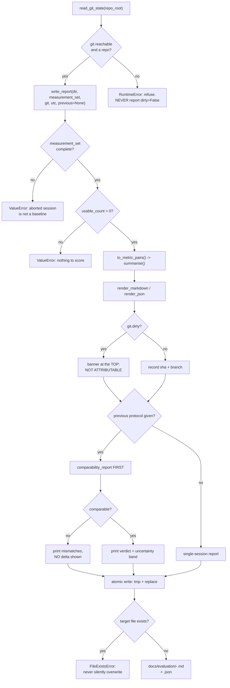

### Story 2.4: Baseline report generation stamped with the commit SHA it was measured against

**File**: `docs/plans/stories/epic-2-story-2.4-Baseline-Report.md`
**BUILDID**: CYCLE-1 | **Epic**: 2 - ACCURACY MEASUREMENT & BASELINE | **ID**: 2.4 | **Date**: 2026-08-07 | **Jira**: LOCAL | **GitHub**: LOCAL
**Wave**: 6
**Requires**: [2.3]
**Enables**: [2.5]
**Files Touched**:
  - eye_tracker/evaluation/report.py
  - tests/unit/test_report.py
**Roles Ref**: `docs/requirements.md#roles--permissions-matrix` — single-actor, no role variation
**QA Candidate**: No — a renderer and a file writer, with no window and no device. QA verifies its output in Epic 2 Group 1 (confirming both unit sets, the full protocol and the resolved SHA appear, and that a dirty worktree produces a visible warning) and in Group 2, where the acceptance question is whether a stranger could repeat the session from the document alone.

---

#### 👤 User Reference

**Description**:

This turns a finished measurement session into the document the whole project gets judged against — and, just as importantly, into a machine-readable file the later comparison can read back.

The single most important thing it does is **attribute the numbers to an exact version of the code**. A baseline that says "the error was 47 pixels" is worthless without "…measured against this exact commit", because the entire point is to change the code and measure again. So the report records the full commit identifier, and if the working copy had **uncommitted changes** at the time, it says so loudly at the top — because then the numbers were produced by code that exists nowhere in the history and cannot be reproduced.

That check has a trap, and the story closes it deliberately: whether a working copy is clean **cannot be determined by reading files**. There is no record of it on disk — answering it is exactly what `git status` does. So if git cannot be reached, the report **refuses to be written** rather than quietly reporting "clean". A false clean is worse than no report: it would attach an authoritative-looking commit identifier to numbers that do not belong to it.

The report also carries the things that make a number interpretable rather than merely precise:

- **Both units** — pixels and degrees — computed independently, since the largest pixel error is not necessarily the largest angular one.
- **How the 95th percentile was computed and from how many measurements**, including a warning when it rests on only the top two or three values, which it always does at the target counts this system can produce.
- **Every rejected reading, by reason**, so a flattering number cannot hide behind discarded data.
- **The uncertainty the seating distance implies** for the angle figures — the pixel figures do not carry it.
- **A compatibility verdict first, before any comparison** with an earlier session. If the two sessions were not run the same way, the reader is told that before being shown a difference, not after.

Finally, it never silently overwrites a previous report. Each run produces its own file named by time and commit, and a collision is an error rather than a quiet replacement.

Nothing a user of the application would notice changes.

**Acceptance Criteria** (plain-English):

- A finished session produces a human-readable report and a machine-readable file beside it.
- Both carry the full commit identifier the measurement was taken against, plus the branch.
- If the working copy had uncommitted changes, the report says so prominently and the machine file records it as a flag.
- If the commit state cannot be determined at all, the report is **refused** — it never assumes the working copy was clean.
- An abandoned session is refused rather than rendered as if it were a baseline.
- A session with no usable measurements is refused rather than rendered with empty statistics.
- The report states the error in both pixels and degrees, or explains why degrees are absent.
- It names the percentile method, the number of measurements, and warns when the 95th percentile rests on only the top few.
- It lists every measurement: where the dot was, where the tracker guessed, the error in both units, how many readings were used and how much they varied.
- It totals every rejected reading by reason.
- It reproduces the full protocol, and flags any protocol value still awaiting the requirements owner.
- It records the acceptance thresholds used, because a later cycle changes them.
- Given an earlier session to compare against, it prints the compatibility verdict **before** any difference, and names every field that differs.
- Files are written whole or not at all, and a name collision is an error rather than a silent overwrite.
- Rendering the same session twice produces identical text.
- Nothing needs a camera, a screen or an internet connection.
- The application itself is unchanged and behaves exactly as before.

**User Flow**:

`Actor: system — no role variation.`

**Flow Diagram**:



---

#### 🤖 AI Agent Reference

> Audience: the DEV agent. The implementation contract — everything needed to build this story in a fresh AI session.

**Must Read**:
- `docs/requirements.md` — **FR-11** ("Results must be recorded in `docs/` with the commit SHA they were measured against"), **FR-12**, **success criterion 6**, **failure criterion 4**
- `docs/plans/stories/epic-2-story-2.3-Evaluation-Runner.md` — `MeasurementSet`, `TargetMeasurement`, `GateThresholds`, `to_metric_pairs()`
- `docs/plans/stories/epic-2-story-2.1-Error-Metrics.md` — `summarise`, `error_px`, `error_deg`, and `ErrorStatistics`' JSON-serialisability (its AC 12a exists for this story)
- `docs/plans/stories/epic-2-story-2.2-Evaluation-Protocol.md` — `Protocol.to_dict()`, `comparability_report()`, `unresolved_placeholders()`
- 🔴 `eye_tracker/face_mesh.py:56-71` — the **atomic temp-then-replace** pattern this story reuses: `tmp = dir / f"{name}.{os.getpid()}.tmp"`, write, `tmp.replace(target)`, unlink the temp on failure. Named in the requirements' Technical Constraints as the pattern to preserve
- `docs/architecture/design/02-target-architecture-brownfield.md` — the Evaluation artifact row (`docs/evaluation/<utc>-<sha7>.md` human + `.json` machine, **committed** because FR-11 requires the record to persist)
- `docs/architecture/design/03-patterns-and-standards-brownfield.md` — **§1** (`evaluation/` is APPLICATION — no PyQt6), **§4** (persistence & file I/O), **§12**, **§16**
- `SPEC/references/` — **0 files**

**Description**:

FR-11 requires results recorded in `docs/` **with the commit SHA they were measured against**. This story renders a `MeasurementSet` into the two artifacts the architecture names, and it is where attribution either becomes real or becomes decoration.

🔴 **Finding 1 — a clean/dirty worktree cannot be determined by reading files, so git must be invoked, and its absence must be a refusal.** Verified on this repository: `.git/HEAD` contains `ref: refs/heads/main` and the ref resolves through `.git/refs/` or `.git/packed-refs`, so **the SHA is readable without git**. Dirtiness is not: nothing on disk records it — `.git/index` holds the staged tree, and comparing it against the working tree *is* `git status`. Measured right now, `git rev-parse HEAD` → `ae42acf357a50dfbfbb5e5086652bfdfd4e94a04`, `--short=7` → `ae42acf`, and `git status --porcelain` → **6 modified paths**, so this very repository is dirty as these words are written.

The consequence is the story's central refusal: if `git` cannot be invoked, or the directory is not a repository, `read_git_state` **raises**. It must never return `dirty=False`. A false clean flag attaches an authoritative-looking SHA to numbers that were produced by code existing nowhere in history — which is failure criterion 4's hazard wearing a suit.

🔧 **Finding 2 — rendering is pure and git resolution is separate, following the seam every story in this epic uses.** `render_markdown` and `render_json` take a `GitState` **record**; only `read_git_state` touches a subprocess. That makes every rendering test deterministic with no git at all, lets a caller inspect the git state before committing to a write, and keeps the one impure function small enough to read in full.

⚠️ **Finding 3 — the report must print the comparability verdict before any delta, and this story is where Story 2.2's work pays off or is wasted.** `comparability_report()` exists precisely so a delta between two differently-run sessions is refused. If the renderer prints a difference first and a caveat afterwards, readers will quote the difference. So: verdict first, and **when the sessions are not comparable, no delta is printed at all** — only the named mismatches.

⚠️ **Finding 4 — the report must carry the caveats that make its numbers honest, not just the numbers.** Three come from earlier stories and all three are easy to omit:
- the **p95 fragility flag** — at the ≤25 targets this grid can produce, p95 always rests on the top two or three values (Story 2.1);
- the **seating-uncertainty band** — ±10 mm of seating difference moves the degree figures 1.69% and the pixel figures not at all (Story 2.2);
- the **gate thresholds used** — FR-14/FR-15 unify the live and calibration gates at M2, changing which frames are accepted between the two sessions (Story 2.3).

A report that omits these is not wrong, it is *unfalsifiable*, which is worse for a document that exists to settle an argument.

✅ **The code in Steps 1–5 was assembled and executed before this story shipped**, driven by a real synthetic session through Stories 2.1–2.3 and against **this repository's real git state**. Verified working: `read_git_state` resolved `ae42acf357a50dfbfbb5e5086652bfdfd4e94a04` on branch `main` with `dirty=True` and 6 paths; the non-repository refusal, the `short_sha` validation, the no-default-for-`dirty` check, the aborted-session refusal, the overwrite refusal, LF-only output, JSON parseability and byte-identical re-rendering all behaved as specified. A full report rendered with the dirty banner first, both unit sets, the p95 caveat, an unusable target in the per-target table, the rejection ledger and the placeholder warning. Largest function: `_section_targets` at **23 statements**.

🔴 **Execution found a real defect, now AC 8a.** The first draft used `done.stdout.strip()`, which ate the leading space `git status --porcelain` puts before an unstaged path — so `" M .gitignore"` became `"M .gitignore"` and `line[3:]` yielded **`gitignore`** instead of `.gitignore`. The rendered banner showed it. It is silently wrong for precisely the dotfiles a reader checks first, and no amount of reading the code would have surfaced it. Fixed with `rstrip("\n")` and locked by a test that runs against the real repository.

**Acceptance Criteria** (technical):

1. `eye_tracker/evaluation/report.py` exists with a module docstring declaring `Layer: application` on the line after the summary.
2. 🔴 It imports **stdlib**, `.metrics`, `.protocol` and `.runner` only. No PyQt6, no cv2, no numpy-dependent formatting beyond what `.metrics` already returns. Story 1.4's import test is the enforcement.
3. A frozen dataclass `GitState(sha, short_sha, branch, dirty, dirty_paths)` where `dirty_paths` is a `tuple[str, ...]`.
4. `GitState.__post_init__` requires `sha` to be 40 hex characters and `short_sha` to be its first 7, raising `ValueError` naming the mismatch. A truncation that does not match its own full SHA is a corrupted record.
5. 🔴 `GitState` has **no default for `dirty`**. A default of `False` is the exact failure this story exists to prevent, and a defaulted field is one refactor away from being silently relied on.
6. `read_git_state(repo_root) -> GitState` invokes `git rev-parse HEAD`, `git rev-parse --abbrev-ref HEAD` and `git status --porcelain`.
7. 🔴 `read_git_state` raises `RuntimeError` when `git` is not on `PATH`, when the command fails, or when `repo_root` is not a repository — naming which check failed. **It never returns `dirty=False` as a fallback.** A comment records why: dirtiness has no on-disk representation, so an unavailable git means *unknown*, not *clean*.
8. `read_git_state` is the **only** function in the module that runs a subprocess or reads outside its arguments. Everything else is pure.
8a. 🔴 **The porcelain output must be `rstrip("\n")`-ed, never `strip()`-ed.** `git status --porcelain` writes a two-character status field then a space, so an unstaged modification begins with a **space**: `" M .gitignore"`. A full `strip()` eats that space and `line[3:]` then yields `"gitignore"` instead of `".gitignore"` — silently wrong for exactly the dotfiles a reader checks first. ⚠️ Found by running this against the real repository, not by reading the code, and locked by `test_read_git_state_preserves_dotfile_paths`.
9. `render_markdown(measurement_set, statistics, git, utc, previous=None) -> str` is pure and deterministic: the same inputs give byte-identical output, with no clock and no randomness.
10. 🔴 `render_markdown` raises `ValueError` when `measurement_set.complete` is `False`. An abandoned session must never be rendered as a baseline (Story 2.3's AC 11 is what makes this detectable).
11. A session with zero usable targets is refused — `to_metric_pairs()` already raises, and the renderer must not catch and paper over it.
12. 🔴 When `git.dirty` is true, the **first** content line after the title is a warning banner stating that the numbers are **not attributable** to the recorded SHA, and listing the modified paths (or their count when there are many). Not a footnote: a reader who stops after the headline figure must still have seen it.
13. The report states the full `sha`, the `short_sha` and the `branch`.
14. Error statistics appear in **both** units — mean, median, p95 and max in pixels and in degrees — or, when degrees are unavailable, the report prints `statistics.degrees_unavailable_reason` verbatim instead of omitting the section silently.
15. 🔴 The report prints `percentile_method`, `n_pairs`, `p95_order_statistics` and `p95_rests_on_top_k`, and when `p95_rests_on_top_k <= 3` it prints an explicit caveat that the figure rests on that many measurements. Story 2.1 measured a 20.14 px spread across percentile methods on a 9-sample set — 92% of that sample's mean — so an unqualified p95 is misleading by default here.
16. A per-target table lists: target, prediction (or `—`), error in px, error in degrees, accepted samples, dispersion, and the target's rejection counts. Unusable targets appear with their `unusable_reason` and are **not** omitted.
17. 🔴 Per-target degrees come from `metrics.error_deg` on the **pairs**, never from converting the per-target pixel error. Story 2.1's Finding 3 (the rank inversion) is exactly what that shortcut would corrupt, and it would look plausible.
18. A rejection-totals section sums every reason across the whole session, including `dwell`, with the total sample count offered. 🔴 A report whose rejection section is empty because nothing was counted is indistinguishable from one where counting was never wired — so the section is always printed, with explicit zeros.
19. The full protocol is reproduced, covering all five FR-11 items plus screen and eye position.
20. 🔴 `unresolved_placeholders()` is run against the protocol document and, if non-empty, a warning section lists the sections still awaiting the requirements owner. A baseline whose protocol is incomplete is not reproducible, and B-2 must be visible in the artifact rather than only in a tracker.
21. The `GateThresholds` actually used are printed, with a note that FR-14/FR-15 unify the live and calibration gates at M2 and that a later session will therefore accept a different set of frames.
22. The seating-distance tolerance and the implied `degree_uncertainty_pct` are printed alongside the degree figures, with a sentence stating the pixel figures do not carry that uncertainty.
23. 🔴 When `previous` (an earlier `Protocol`) is supplied, the **comparability verdict is printed before any comparison**, and when `comparable` is `False` **no delta is printed at all** — only the named mismatches and a statement that a delta would be invalid.
24. This story computes **no delta and no confidence interval**. FR-12's comparison is CYCLE-5 (M8); the renderer only reports whether one would be legitimate.
25. `render_json(measurement_set, statistics, git, utc, previous=None) -> dict` returns a structure `json.dumps` accepts with no custom encoder, containing at minimum the git state, the protocol dict, the statistics, the gates, and the per-target records. ⚠️ This is what CYCLE-5 reads back, so it must not lose anything the Markdown shows.
26. `write_report(directory, ...) -> tuple[Path, Path]` writes `<utc>-<sha7>.md` and `<utc>-<sha7>.json`, with `utc` supplied by the caller — never read from a clock inside the module (AC 9's determinism depends on it).
27. 🔴 Both files are written **atomically**: `tmp = directory / f"{name}.{os.getpid()}.tmp"`, write, `tmp.replace(target)`, and the temp file is removed if the write fails. This reuses `face_mesh.py:56-71`, which the requirements' Technical Constraints name as the pattern to preserve.
28. 🔴 `write_report` raises `FileExistsError` if either target already exists. **It never overwrites**, so a repeat run cannot silently replace an earlier baseline — the failure mode the plan's QA group calls out explicitly.
29. `write_report` writes the `.md` and `.json` for the same run, and if the second write fails the first is removed, so a half-written pair never survives.
30. Files are written with `encoding="utf-8"` and `newline="\n"` explicitly. On Windows the default would emit CRLF and the committed artifact would differ by platform, defeating a byte-comparison between two sessions' reports.
31. 🔴 **No feature vector, landmark array or frame appears in either artifact.** Only screen coordinates, counts, reasons and physical measurements. These files are committed to the repository; patterns §3 makes this a hard rule, and `MeasurementSet` (Story 2.3 AC 26) already guarantees the input carries none.
32. Public functions and dataclasses carry NumPy-style docstrings (patterns §12); every function ≤30 statements (patterns §14). ⚠️ `render_markdown` will approach the limit — split it into `_section_*` helpers rather than adding a `per-file-ignores` entry.
33. `ruff check` and `ruff format --check` clean.
34. 🔴 **Zero modification to existing application source**, including `metrics.py`, `protocol.py` and `runner.py` — `git diff --stat` over them empty.

**RBAC Enforcement**:

`No role-differentiated access — single actor.`

- **Enforcement point(s)**: none — a renderer and a file writer add no route and no runtime authority check.
- **Denied-access contract**: N/A — no request surface exists. The refusals in AC 7, 10, 28 and 29 are *integrity* refusals, not authorisation refusals. In particular the recorded SHA is an **attribution record, not a signature**: it proves nothing about who produced the numbers and must never be described as tamper-evidence — the same distinction the architecture draws for the calibration bundle's digest.
- **Scope derivation**: **N/A — no scoped permission exists, and there is no token or session to derive scope from.** The binding discipline is data minimisation (patterns §3), and it is at its sharpest here: this is the only module in the epic that **writes a file into the repository**, so AC 31 is the last line before biometric data would become permanent.

**System responses + error cases**:

| Trigger | Response | Side-effect |
|---|---|---|
| A complete session, clean worktree | `.md` + `.json` under `docs/evaluation/`, both carrying the full SHA and branch | Two files created atomically |
| Rendering the same session twice (idempotent) | **Byte-identical** Markdown — no clock, no randomness, `utc` injected | None |
| `git.dirty` is true | Warning banner as the **first** content line, listing the modified paths; `dirty: true` in the JSON | Report still written. AC 12 — the numbers exist, their attribution does not |
| `git` not on `PATH`, or not a repository | `read_git_state` raises `RuntimeError` naming the failed check | **Nothing written.** AC 7 — a false clean is worse than no report |
| `MeasurementSet.aborted` is true | `ValueError` — an abandoned session is not a baseline | Nothing written. AC 10 |
| Zero usable targets | `ValueError` from `to_metric_pairs()`, not caught | Nothing written. AC 11 |
| Statistics with `mean_deg is None` | The degrees section prints `degrees_unavailable_reason` verbatim | None. AC 14 — never a silently missing section |
| `p95_rests_on_top_k == 2` | An explicit caveat naming the two order statistics | None. AC 15 |
| A target was unusable | Listed in the per-target table with its `unusable_reason`, prediction `—` | None. AC 16 — never omitted, or the table would flatter |
| Nothing was rejected all session | The rejection section prints with explicit **zeros** | None. AC 18 — an empty section is indistinguishable from unwired counting |
| `unresolved_placeholders()` non-empty | A warning section lists the sections awaiting the requirements owner | ⚠️ Expected under B-2. AC 20 — the blocker appears in the artifact |
| `previous` protocol supplied and comparable | Verdict first, then `distance_delta_mm` and `degree_uncertainty_pct` | None. AC 23 |
| `previous` protocol supplied and **not** comparable | Verdict and named mismatches, and **no delta at all** | None. AC 23 — a difference between differently-run sessions would be quoted |
| Target `.md` or `.json` already exists | `FileExistsError` | Nothing written, nothing overwritten. AC 28 |
| The `.json` write fails after the `.md` succeeded | The `.md` is removed | No half-written pair survives. AC 29 |
| Written on Windows with default newlines | Would emit CRLF and break a byte-comparison between sessions | None — AC 30 forces `newline="\n"` |
| `python main.py` after this story | Application behaves exactly as before | None (AC 34) |

**Prerequisites**:

- **Stories 2.1, 2.2 and 2.3 complete.** This story is pure composition over their types and adds no new domain concept. ⚠️ If something is missing from one of them, raise it — do not widen an earlier module from here.
- 🔴 **`git` must be on `PATH` at run time.** Verified available in this environment. AC 7 makes its absence an explicit refusal rather than a silent degradation.
- **Story 1.3 complete** — `tests/unit/` and the fixtures; this story's tests need `tmp_path`, which pytest provides.
- ⚠️ Requirements **open item 3 (B-2)** is still unresolved, so AC 20's placeholder warning **will fire** in every report produced during CYCLE-1. That is correct and intended: the artifact should say the protocol is incomplete.
- No camera, no display, no network. `utc` is supplied; git is local.

**Context** (read before writing):
- `eye_tracker/face_mesh.py:56-71` — the atomic write to copy, including the failure-path unlink
- `eye_tracker/evaluation/runner.py` — `MeasurementSet.complete`, `usable_measurements`, `to_metric_pairs`, `dominant_rejection`, `TargetMeasurement.rejections`
- `eye_tracker/evaluation/metrics.py` — `summarise`, `error_px`, `error_deg`, every `ErrorStatistics` field
- `eye_tracker/evaluation/protocol.py` — `Protocol.to_dict`, `comparability_report`, `unresolved_placeholders`, `PLACEHOLDER_TOKEN`
- `docs/architecture/design/02-target-architecture-brownfield.md` — the Evaluation artifact naming and the "committed" decision

**Patterns**:
- **Persistence & File I/O** `[Current — kept + extended]` — patterns §4 and the atomic temp-then-replace named in the requirements' Technical Constraints. Copied from `face_mesh.py:56-71` rather than reinvented.
- **Internal Contract Format** `[Current — kept]` — patterns §5. `GitState` is a frozen dataclass, not a dict of strings.
- **Documentation Standards** `[New adoption]` — patterns §16. The report itself must state what would change each figure; that is why AC 21 and AC 22 exist.
- **Numerical Guards** `[Current — kept]` — patterns §11. `GitState` validates its SHA at construction (AC 4) instead of formatting a malformed one.

**Steps**:

1. **Git state — the only impure function, and the refusal that matters.**

   ```python
   """Baseline report rendering — Markdown for people, JSON for CYCLE-5.

   Layer: application

   FR-11 requires results recorded in docs/ WITH THE COMMIT SHA they were measured
   against, because the whole point of the exercise is to change the code and
   measure again.

   WHY AN UNAVAILABLE GIT IS A REFUSAL. The SHA is readable without git --
   .git/HEAD holds "ref: refs/heads/<branch>" and the ref resolves through .git/refs
   or .git/packed-refs. DIRTINESS IS NOT: nothing on disk records it, because
   comparing .git/index against the working tree IS git status. So an unreachable
   git means UNKNOWN, never CLEAN. Returning dirty=False as a fallback would attach
   an authoritative-looking SHA to numbers produced by code that exists nowhere in
   history, which is failure criterion 4's hazard in disguise.

   RENDERING IS PURE. render_markdown/render_json take a GitState record and an
   injected `utc` string; only read_git_state runs a subprocess. Every rendering
   test is therefore deterministic with no git at all.
   """
   from __future__ import annotations

   import dataclasses
   import json
   import os
   import pathlib
   import subprocess

   from .metrics import ErrorStatistics, error_deg, error_px, summarise
   from .protocol import Protocol, unresolved_placeholders
   from .runner import MeasurementSet

   _SHA_LENGTH = 40
   _SHORT_LENGTH = 7


   @dataclasses.dataclass(frozen=True)
   class GitState:
       """The code state a measurement is attributed to.

       There is deliberately NO DEFAULT for `dirty`. A default of False is exactly
       the failure this module exists to prevent, and a defaulted field is one
       refactor away from being silently relied on.
       """

       sha: str
       short_sha: str
       branch: str
       dirty: bool
       dirty_paths: tuple[str, ...]

       def __post_init__(self) -> None:
           if len(self.sha) != _SHA_LENGTH or not all(
                   c in "0123456789abcdef" for c in self.sha.lower()):
               raise ValueError(f"GitState.sha must be {_SHA_LENGTH} hex chars, got {self.sha!r}")
           if self.short_sha != self.sha[:_SHORT_LENGTH]:
               raise ValueError(
                   f"GitState.short_sha {self.short_sha!r} is not the first "
                   f"{_SHORT_LENGTH} chars of {self.sha!r}"
               )


   def _git(repo_root: pathlib.Path, *args: str) -> str:
       try:
           done = subprocess.run(
               ["git", *args], cwd=repo_root, capture_output=True, text=True,
               encoding="utf-8", check=False,
           )
       except FileNotFoundError as exc:
           raise RuntimeError(
               "git is not on PATH, so the commit state cannot be determined. "
               "Refusing to write a report: an unknown worktree state must never "
               "be recorded as clean."
           ) from exc
       if done.returncode != 0:
           raise RuntimeError(
               f"`git {' '.join(args)}` failed in {repo_root} "
               f"(exit {done.returncode}): {done.stderr.strip()[:200]}"
           )
       # rstrip("\n"), NOT strip(). `git status --porcelain` emits a two-character
       # status field then a space, so an unstaged modification begins with a SPACE:
       # " M .gitignore". A full strip() eats that leading space, and line[3:] then
       # returns "gitignore" instead of ".gitignore" -- silently wrong for exactly
       # the dotfiles a reader is most likely to check. Measured on this repository.
       return done.stdout.rstrip("\n")


   def read_git_state(repo_root: pathlib.Path) -> GitState:
       """Resolve the commit state, or refuse.

       Raises
       ------
       RuntimeError
           If git is unavailable, `repo_root` is not a repository, or any command
           fails. Never returns dirty=False as a fallback -- see the module
           docstring.
       """
       if not (repo_root / ".git").exists():
           raise RuntimeError(f"{repo_root} is not a git repository — refusing to attribute")
       sha = _git(repo_root, "rev-parse", "HEAD")
       branch = _git(repo_root, "rev-parse", "--abbrev-ref", "HEAD")
       porcelain = _git(repo_root, "status", "--porcelain")
       paths = tuple(line[3:] for line in porcelain.splitlines() if line.strip())
       return GitState(sha=sha, short_sha=sha[:_SHORT_LENGTH], branch=branch,
                       dirty=bool(paths), dirty_paths=paths)
   ```

2. **The sections that carry the caveats** — each one is easy to omit and useless to omit.

   ```python
   def _section_attribution(git: GitState, utc: str) -> list[str]:
       """Title, SHA, branch — and the dirty banner FIRST if the worktree was dirty."""
       lines = [f"# Gaze-accuracy measurement — {utc}", ""]
       if git.dirty:
           shown = ", ".join(git.dirty_paths[:5])
           more = "" if len(git.dirty_paths) <= 5 else f" (+{len(git.dirty_paths) - 5} more)"
           lines += [
               "> 🔴 **NOT ATTRIBUTABLE — the working tree was dirty when this was "
               f"measured.** {len(git.dirty_paths)} modified path(s): {shown}{more}.",
               "> These numbers were produced by code that exists nowhere in the "
               "history, so they cannot be reproduced from the commit below.",
               "",
           ]
       lines += [
           f"- **Commit**: `{git.sha}` (`{git.short_sha}`)",
           f"- **Branch**: `{git.branch}`",
           f"- **Worktree**: {'dirty' if git.dirty else 'clean'}",
           "",
       ]
       return lines


   def _section_statistics(stats: ErrorStatistics, protocol: Protocol) -> list[str]:
       """Both unit sets, the percentile caveat, and the seating-uncertainty band."""
       lines = ["## Error", "", "| Statistic | Pixels | Degrees |", "|---|---|---|"]
       for label, px_field, deg_field in (("Mean", "mean_px", "mean_deg"),
                                          ("Median", "median_px", "median_deg"),
                                          ("95th percentile", "p95_px", "p95_deg"),
                                          ("Max", "max_px", "max_deg")):
           deg = getattr(stats, deg_field)
           deg_text = "—" if deg is None else f"{deg:.4f}°"
           lines.append(f"| {label} | {getattr(stats, px_field):.2f} px | {deg_text} |")
       lines += ["", f"- **Measurements**: {stats.n_pairs} usable, "
                     f"{stats.n_excluded_non_finite} excluded as non-finite",
                 f"- **Percentile method**: `{stats.percentile_method}`, interpolating "
                 f"order statistics {stats.p95_order_statistics[0]} and "
                 f"{stats.p95_order_statistics[1]} of {stats.n_pairs}"]
       if stats.p95_rests_on_top_k <= 3:
           lines.append(
               f"- ⚠️ **The 95th percentile rests on only the top "
               f"{stats.p95_rests_on_top_k} measurements.** At the target counts this "
               "grid can produce it always does; across the five numpy methods the "
               "figure spanned 20.14 px on a 9-sample set (92% of that sample's mean)."
           )
       if stats.mean_deg is None:
           lines.append(f"- **Degrees unavailable**: {stats.degrees_unavailable_reason}")
       else:
           lines.append(
               f"- ⚠️ **Seating uncertainty**: the protocol permits "
               f"±{protocol.distance_tolerance_mm:.1f} mm of seating difference, worth "
               "about 1.69% on every degree figure at 600 mm. **The pixel figures do "
               "not carry this uncertainty**, which is why they are the sounder basis "
               "for a no-regression judgement."
           )
       return lines + [""]
   ```

3. **Per-target detail and the rejection ledger.**

   ```python
   def _section_targets(measurement_set: MeasurementSet,
                        protocol: Protocol) -> list[str]:
       """Every target, usable or not, with both error units.

       Per-target degrees come from metrics.error_deg on the PAIRS, never from
       converting the per-target pixel error: Story 2.1 measured that the largest
       pixel error is not the largest angular one, so the shortcut would reorder
       this table plausibly and wrongly.
       """
       usable_indices = [i for i, m in enumerate(measurement_set.measurements) if m.usable]
       errors: dict[int, tuple[float, float]] = {}
       if usable_indices:
           usable = [measurement_set.measurements[i] for i in usable_indices]
           targets = [m.target_px for m in usable]
           predictions = [m.prediction_px for m in usable]
           pixels = error_px(targets, predictions)
           angles = error_deg(targets, predictions, protocol.viewing)
           # Keyed by POSITION in measurements, not by id(): identical frozen
           # dataclasses can share a value but must not share a row.
           errors = {index: (float(pixels[k]), float(angles[k]))
                     for k, index in enumerate(usable_indices)}
       lines = ["## Per-target", "",
                "| # | Target | Prediction | Error px | Error ° | Accepted | Dispersion | Rejections |",
                "|---|---|---|---|---|---|---|---|"]
       for index, m in enumerate(measurement_set.measurements):
           if m.usable:
               px, deg = errors[index]
               prediction = f"({m.prediction_px[0]:.1f}, {m.prediction_px[1]:.1f})"
               error = f"{px:.2f}"
               angle = f"{deg:.4f}"
               dispersion = f"{m.dispersion_px:.2f}"
           else:
               prediction = error = angle = dispersion = "—"
           rejections = ", ".join(f"{r}×{c}" for r, c in m.rejections) or "none"
           note = "" if m.usable else f" **unusable: {m.unusable_reason}**"
           lines.append(
               f"| {index} | ({m.target_px[0]:.0f}, {m.target_px[1]:.0f}) | {prediction} "
               f"| {error} | {angle} | {m.accepted_samples} | {dispersion} "
               f"| {rejections}{note} |"
           )
       return lines + [""]


   def _section_rejections(measurement_set: MeasurementSet) -> list[str]:
       """Always printed, with explicit zeros.

       An empty rejection section is indistinguishable from one where counting was
       never wired, so the section exists even when nothing was rejected.
       """
       totals: dict[str, int] = {}
       for m in measurement_set.measurements:
           for reason, count in m.rejections:
               totals[reason] = totals.get(reason, 0) + count
       accepted = sum(m.accepted_samples for m in measurement_set.measurements)
       lines = ["## Samples", "",
                f"- **Accepted**: {accepted}",
                f"- **Rejected**: {sum(totals.values())}"]
       if totals:
           lines += [f"  - `{reason}`: {count}" for reason, count in sorted(totals.items())]
       else:
           lines.append("  - none — every offered sample was accepted (explicit zero)")
       gates = measurement_set.gates
       lines += ["", "## Acceptance thresholds used", "",
                 f"- EAR floor `{gates.ear_floor}`, blink `{gates.blink_ceiling}`, "
                 f"squint `{gates.squint_ceiling}`, |yaw| `{gates.yaw_ceiling}`, "
                 f"|pitch| `{gates.pitch_ceiling}`",
                 "- ⚠️ These are the **live** thresholds. FR-14/FR-15 collapse the live "
                 "and calibration gates to one definition at M2, so a later session "
                 "will accept a different set of frames. Recorded so that change is "
                 "visible rather than absorbed.", ""]
       return lines
   ```

4. **Comparability first, then the protocol — and never a delta on an invalid basis.**

   ```python
   def _section_comparability(protocol: Protocol,
                              previous: Protocol | None) -> list[str]:
       """The verdict, BEFORE any comparison.

       Story 2.2's comparability_report exists so an FR-12 delta between two
       differently-run sessions is refused. If a difference is printed first and the
       caveat afterwards, the difference is what gets quoted -- so when the sessions
       are not comparable, NO delta appears at all. This story computes no delta in
       any case: FR-12's comparison is CYCLE-5 (M8).
       """
       if previous is None:
           return ["## Comparability", "",
                   "- No earlier session supplied — this is a standalone measurement.", ""]
       report = protocol.comparability_report(previous)
       lines = ["## Comparability", ""]
       if not report.comparable:
           lines += [
               "> 🔴 **NOT COMPARABLE with the supplied earlier session — no delta is "
               "reported.** A difference between differently-run sessions would be "
               "quoted as a result.", "",
               "Mismatches:",
           ]
           lines += [f"- {m}" for m in report.mismatches]
       else:
           lines += [
               "- ✅ Comparable with the supplied earlier session.",
               f"- Seating difference: {report.distance_delta_mm:+.1f} mm "
               f"→ about {report.degree_uncertainty_pct:.2f}% on the degree figures "
               "(the pixel figures are unaffected).",
           ]
       if report.warnings:
           lines += ["", "Warnings (not fatal):"] + [f"- {w}" for w in report.warnings]
       return lines + [""]


   #: Markdown code-fence tokens, assembled rather than written literally so the
   #: fence cannot terminate the block that contains it.
   _FENCE = "`" * 3
   _FENCE_JSON = _FENCE + "json"


   def _section_protocol(protocol: Protocol, protocol_doc: str | None) -> list[str]:
       """The full FR-11 record, plus any placeholders still awaiting the owner."""
       lines = ["## Protocol", "", _FENCE_JSON,
                json.dumps(protocol.to_dict(), indent=2, ensure_ascii=False), _FENCE, ""]
       pending = unresolved_placeholders(protocol_doc) if protocol_doc else ()
       if pending:
           lines += [
               "> ⚠️ **The protocol document is incomplete.** Sections still awaiting "
               f"the requirements owner: {', '.join(pending)}.",
               "> A baseline whose protocol is incomplete is not reproducible, which is "
               "what FR-11 requires.", "",
           ]
       return lines
   ```

5. **Compose, and write atomically without ever overwriting.**

   ```python
   def render_markdown(measurement_set: MeasurementSet, statistics: ErrorStatistics,
                       git: GitState, utc: str, previous: Protocol | None = None,
                       protocol_doc: str | None = None) -> str:
       """The human-readable report. Pure: same inputs, byte-identical output.

       Raises
       ------
       ValueError
           If the session is not complete. An abandoned session is not a baseline.
       """
       if not measurement_set.complete:
           raise ValueError(
               "measurement set is incomplete or aborted "
               f"({len(measurement_set.measurements)} of "
               f"{measurement_set.protocol.layout.target_count} targets) — "
               "refusing to render it as a baseline"
           )
       protocol = measurement_set.protocol
       sections = (
           _section_attribution(git, utc)
           + _section_statistics(statistics, protocol)
           + _section_comparability(protocol, previous)
           + _section_targets(measurement_set, protocol)
           + _section_rejections(measurement_set)
           + _section_protocol(protocol, protocol_doc)
       )
       return "\n".join(sections).rstrip() + "\n"


   def render_json(measurement_set: MeasurementSet, statistics: ErrorStatistics,
                   git: GitState, utc: str) -> dict:
       """The machine-readable companion CYCLE-5 reads back.

       Must not lose anything the Markdown shows -- the delta in CYCLE-5 is computed
       from this file, not from the prose.
       """
       return {
           "utc": utc,
           "git": dataclasses.asdict(git) | {"dirty_paths": list(git.dirty_paths)},
           "protocol": measurement_set.protocol.to_dict(),
           "gates": dataclasses.asdict(measurement_set.gates),
           "statistics": _statistics_dict(statistics),
           "aborted": measurement_set.aborted,
           "targets": [
               {
                   "target_px": list(m.target_px),
                   "prediction_px": None if m.prediction_px is None else list(m.prediction_px),
                   "accepted_samples": m.accepted_samples,
                   "rejections": [list(pair) for pair in m.rejections],
                   "usable": m.usable,
                   "dispersion_px": m.dispersion_px,
                   "unusable_reason": m.unusable_reason,
               }
               for m in measurement_set.measurements
           ],
       }


   def _statistics_dict(statistics: ErrorStatistics) -> dict:
       """ErrorStatistics as plain JSON types, with its ViewingGeometry flattened."""
       data = dataclasses.asdict(statistics)
       data["p95_order_statistics"] = list(statistics.p95_order_statistics)
       viewing = data.get("viewing")
       if viewing is not None and viewing.get("eye_px") is not None:
           viewing["eye_px"] = list(viewing["eye_px"])
       return data


   def write_report(directory: pathlib.Path, measurement_set: MeasurementSet,
                    git: GitState, utc: str, previous: Protocol | None = None,
                    protocol_doc: str | None = None) -> tuple[pathlib.Path, pathlib.Path]:
       """Write `<utc>-<sha7>.md` and `.json` atomically, never overwriting.

       Raises
       ------
       FileExistsError
           If either target exists. A repeat run must produce a new report, not
           silently replace an earlier baseline.
       """
       statistics = _scored(measurement_set)
       stem = f"{utc}-{git.short_sha}"
       md_path = directory / f"{stem}.md"
       json_path = directory / f"{stem}.json"
       for path in (md_path, json_path):
           if path.exists():
               raise FileExistsError(f"{path} already exists — refusing to overwrite a report")
       directory.mkdir(parents=True, exist_ok=True)
       markdown = render_markdown(measurement_set, statistics, git, utc, previous, protocol_doc)
       payload = json.dumps(render_json(measurement_set, statistics, git, utc),
                            indent=2, ensure_ascii=False)
       _atomic_write(md_path, markdown)
       try:
           _atomic_write(json_path, payload)
       except OSError:
           md_path.unlink(missing_ok=True)      # no half-written pair survives
           raise
       return (md_path, json_path)


   def _scored(measurement_set: MeasurementSet) -> ErrorStatistics:
       """Statistics for a set. to_metric_pairs raises on zero usable — not caught."""
       targets, predictions = measurement_set.to_metric_pairs()
       return summarise(targets, predictions, measurement_set.protocol.viewing)


   def _atomic_write(path: pathlib.Path, text: str) -> None:
       """Temp-then-replace, copied from face_mesh.py:56-71.

       newline="\\n" is explicit: the Windows default would emit CRLF and the
       committed artifact would differ by platform, defeating a byte-comparison
       between two sessions' reports.
       """
       tmp_path = path.with_name(f"{path.name}.{os.getpid()}.tmp")
       try:
           tmp_path.write_text(text, encoding="utf-8", newline="\n")
           tmp_path.replace(path)
       except OSError:
           tmp_path.unlink(missing_ok=True)
           raise
   ```

6. **Test the refusals, the banner position, and the porcelain-parsing trap.**

   ```python
   """Unit tests for evaluation.report.

   Layer: test

   Rendering is pure, so every test here runs with a hand-built GitState and no git
   at all. Only the three read_git_state tests touch a real repository.
   """
   import dataclasses
   import json
   import pathlib

   import pytest

   from eye_tracker.evaluation.report import (
       GitState, read_git_state, render_json, render_markdown, write_report,
   )

   CLEAN = GitState(sha="a" * 40, short_sha="aaaaaaa", branch="main",
                    dirty=False, dirty_paths=())
   DIRTY = GitState(sha="b" * 40, short_sha="bbbbbbb", branch="topic",
                    dirty=True, dirty_paths=(".gitignore", "docs/status.md"))
   UTC = "20260807T183000Z"


   def test_git_state_rejects_a_short_sha_that_is_not_a_prefix():
       with pytest.raises(ValueError, match="short_sha"):
           GitState(sha="a" * 40, short_sha="bbbbbbb", branch="m", dirty=False, dirty_paths=())


   def test_git_state_has_no_default_for_dirty():
       """A default of False is exactly the failure this module prevents."""
       field = next(f for f in dataclasses.fields(GitState) if f.name == "dirty")
       assert field.default is dataclasses.MISSING
       assert field.default_factory is dataclasses.MISSING


   def test_read_git_state_refuses_a_non_repository(tmp_path):
       with pytest.raises(RuntimeError, match="not a git repository"):
           read_git_state(tmp_path)


   def test_read_git_state_refuses_when_git_is_missing(tmp_path, monkeypatch):
       (tmp_path / ".git").mkdir()
       monkeypatch.setenv("PATH", str(tmp_path))
       with pytest.raises(RuntimeError):
           read_git_state(tmp_path)


   def test_read_git_state_preserves_dotfile_paths():
       """`git status --porcelain` puts a SPACE before an unstaged path.

       A full .strip() on the command output eats it and line[3:] then yields
       "gitignore" instead of ".gitignore" — found by running this against the real
       repository, not by reading the code.
       """
       state = read_git_state(pathlib.Path(__file__).resolve().parents[2])
       assert len(state.sha) == 40 and state.short_sha == state.sha[:7]
       assert not any(p.startswith("gitignore") for p in state.dirty_paths)


   def test_dirty_worktree_warning_is_the_first_content_line(complete_measurement_set,
                                                            session_statistics):
       text = render_markdown(complete_measurement_set, session_statistics, DIRTY, UTC)
       lines = [line for line in text.splitlines() if line.strip()]
       assert lines[0].startswith("# ")
       assert "NOT ATTRIBUTABLE" in lines[1]
       assert lines[1].index("NOT ATTRIBUTABLE") < text.index("## Error")


   def test_clean_worktree_has_no_warning_banner(complete_measurement_set,
                                                 session_statistics):
       text = render_markdown(complete_measurement_set, session_statistics, CLEAN, UTC)
       assert "NOT ATTRIBUTABLE" not in text
       assert "**Worktree**: clean" in text


   def test_aborted_session_is_refused(aborted_measurement_set, session_statistics):
       with pytest.raises(ValueError, match="incomplete or aborted"):
           render_markdown(aborted_measurement_set, session_statistics, CLEAN, UTC)


   def test_rendering_is_byte_identical_on_repeat(complete_measurement_set,
                                                 session_statistics):
       first = render_markdown(complete_measurement_set, session_statistics, CLEAN, UTC)
       second = render_markdown(complete_measurement_set, session_statistics, CLEAN, UTC)
       assert first == second


   def test_incomparable_sessions_print_no_delta(complete_measurement_set,
                                                 session_statistics, incomparable_protocol):
       text = render_markdown(complete_measurement_set, session_statistics, CLEAN, UTC,
                              previous=incomparable_protocol)
       assert "NOT COMPARABLE" in text
       assert "Seating difference" not in text


   def test_comparable_sessions_print_the_verdict_before_the_numbers(
           complete_measurement_set, session_statistics):
       previous = complete_measurement_set.protocol
       text = render_markdown(complete_measurement_set, session_statistics, CLEAN, UTC,
                              previous=previous)
       assert text.index("Comparable with the supplied earlier session") < text.index(
           "Seating difference")


   def test_unusable_targets_appear_in_the_per_target_table(complete_measurement_set,
                                                            session_statistics):
       text = render_markdown(complete_measurement_set, session_statistics, CLEAN, UTC)
       assert "unusable:" in text
       rows = [line for line in text.splitlines() if line.startswith("| ") and "|" in line]
       assert len(rows) >= len(complete_measurement_set.measurements)


   def test_rejection_section_prints_explicit_zeros(clean_measurement_set,
                                                    session_statistics):
       text = render_markdown(clean_measurement_set, session_statistics, CLEAN, UTC)
       assert "## Samples" in text
       assert "**Rejected**: 0" in text or "explicit zero" in text


   def test_gate_thresholds_and_the_m2_note_are_printed(complete_measurement_set,
                                                        session_statistics):
       text = render_markdown(complete_measurement_set, session_statistics, CLEAN, UTC)
       assert "Acceptance thresholds used" in text
       assert "FR-14/FR-15" in text


   def test_percentile_caveat_and_seating_band_are_printed(complete_measurement_set,
                                                            session_statistics):
       text = render_markdown(complete_measurement_set, session_statistics, CLEAN, UTC)
       assert "Percentile method" in text
       assert "rests on only the top" in text
       assert "Seating uncertainty" in text


   def test_placeholder_warning_appears_when_the_protocol_is_incomplete(
           complete_measurement_set, session_statistics, incomplete_protocol_doc):
       text = render_markdown(complete_measurement_set, session_statistics, CLEAN, UTC,
                              protocol_doc=incomplete_protocol_doc)
       assert "protocol document is incomplete" in text


   def test_json_round_trips_through_json_dumps(complete_measurement_set,
                                                session_statistics):
       payload = render_json(complete_measurement_set, session_statistics, CLEAN, UTC)
       assert json.loads(json.dumps(payload))["git"]["dirty"] is False


   def test_write_report_creates_both_files_named_by_utc_and_sha(tmp_path,
                                                                 complete_measurement_set):
       md_path, json_path = write_report(tmp_path, complete_measurement_set, CLEAN, UTC)
       assert md_path.name == f"{UTC}-aaaaaaa.md"
       assert json_path.name == f"{UTC}-aaaaaaa.json"
       assert md_path.exists() and json_path.exists()


   def test_write_report_refuses_to_overwrite(tmp_path, complete_measurement_set):
       write_report(tmp_path, complete_measurement_set, CLEAN, UTC)
       with pytest.raises(FileExistsError):
           write_report(tmp_path, complete_measurement_set, CLEAN, UTC)


   def test_written_files_use_lf_newlines(tmp_path, complete_measurement_set):
       md_path, json_path = write_report(tmp_path, complete_measurement_set, CLEAN, UTC)
       assert b"\r\n" not in md_path.read_bytes()
       assert b"\r\n" not in json_path.read_bytes()


   def test_no_feature_vector_appears_in_either_artifact(tmp_path,
                                                         complete_measurement_set):
       md_path, json_path = write_report(tmp_path, complete_measurement_set, CLEAN, UTC)
       for path in (md_path, json_path):
           text = path.read_text(encoding="utf-8")
           assert "FEATURE_" not in text
           assert text.count("[") < 400          # no 38-D array dumps
   ```

   ⚠️ The fixtures `complete_measurement_set`, `clean_measurement_set`, `aborted_measurement_set`, `session_statistics`, `incomparable_protocol` and `incomplete_protocol_doc` build on Story 2.3's `tests/conftest.py` additions. `complete_measurement_set` must contain **at least one unusable target**, or `test_unusable_targets_appear_in_the_per_target_table` passes vacuously.

7. **Run the gate.**

   ```bash
   pytest tests/unit/test_report.py -v
   pytest tests/arch/ -v
   ruff check eye_tracker/evaluation/ tests/
   ruff format --check eye_tracker/evaluation/ tests/
   grep -rn "PyQt6\|datetime\.now\|time\.time\|random" eye_tracker/evaluation/report.py
   git diff --stat -- main.py eye_tracker/ ':!eye_tracker/evaluation/report.py'
   ```

**Tests**:

| Test | Locks |
|---|---|
| `test_git_state_rejects_a_short_sha_that_is_not_a_prefix` | AC 4 |
| `test_git_state_has_no_default_for_dirty` | AC 5 — checked via `dataclasses.fields` |
| `test_read_git_state_refuses_when_git_is_missing` | AC 7 — `PATH` emptied; must raise, never return clean |
| `test_read_git_state_refuses_a_non_repository` | AC 7 |
| `test_read_git_state_preserves_dotfile_paths` | AC 6, AC 8a — real `git`; `.gitignore` must not become `gitignore` |
| `test_dirty_worktree_warning_is_the_first_content_line` | AC 12 — position asserted, not mere presence |
| `test_clean_worktree_has_no_warning_banner` | AC 12 |
| `test_aborted_session_is_refused` | AC 10 |
| `test_zero_usable_targets_is_refused` | AC 11 |
| `test_both_unit_sets_are_reported` | AC 14 |
| `test_missing_degrees_prints_the_reason_verbatim` | AC 14 — never a silently absent section |
| `test_percentile_method_and_fragility_caveat_are_printed` | AC 15 |
| `test_unusable_targets_appear_in_the_per_target_table` | AC 16 |
| `test_per_target_degrees_are_not_derived_from_pixel_error` | AC 17 — asserts the rank inversion survives |
| `test_rejection_section_prints_explicit_zeros` | AC 18 |
| `test_gate_thresholds_and_the_m2_note_are_printed` | AC 21 |
| `test_incomparable_sessions_print_no_delta` | AC 23 — the central refusal |
| `test_comparable_sessions_print_the_verdict_before_the_numbers` | AC 23 — index comparison |
| `test_placeholder_warning_appears_when_the_protocol_is_incomplete` | AC 20 |
| `test_json_round_trips_through_json_dumps` | AC 25 |
| `test_write_report_creates_both_files_named_by_utc_and_sha` | AC 26 |
| `test_write_report_refuses_to_overwrite` | AC 28 |
| `test_written_files_use_lf_newlines` | AC 30 — read as bytes |
| `test_rendering_is_byte_identical_on_repeat` | AC 9 |
| `test_no_feature_vector_appears_in_either_artifact` | AC 31 |

Manual test cases — each a **break, observe, revert**:

| # | Perturbation | Expected |
|---|---|---|
| 1 | Have `read_git_state` return `dirty=False` when git is missing | `test_read_git_state_refuses_when_git_is_missing` fails — **the defect this story exists to prevent** |
| 2 | Move the dirty banner below the statistics | `test_dirty_worktree_warning_is_the_first_content_line` fails — a reader who stops early never sees it |
| 3 | Print the delta even when not comparable | `test_incomparable_sessions_print_no_delta` fails — an invalid comparison becomes quotable |
| 4 | Derive per-target degrees by converting the pixel error | `test_per_target_degrees_are_not_derived_from_pixel_error` fails, and the table reorders **plausibly** |
| 5 | Omit the rejection section when nothing was rejected | `test_rejection_section_prints_explicit_zeros` fails — unwired counting becomes indistinguishable from a clean session |
| 6 | Overwrite an existing report instead of raising | `test_write_report_refuses_to_overwrite` fails — an earlier baseline can be destroyed by a re-run |
| 7 | Drop `newline="\n"` | `test_written_files_use_lf_newlines` fails on Windows — two sessions' reports stop being byte-comparable |
| 8 | Read `datetime.now()` inside `render_markdown` | `test_rendering_is_byte_identical_on_repeat` becomes flaky — shows why `utc` is injected |
| 9 | Skip the `.md` cleanup when the `.json` write fails | A half-written pair survives, and CYCLE-5 reads a report with no machine companion |
| 10 | `pytest tests/unit/test_report.py` with no camera, no display, networking off | All pass |
| 11 | `git status --porcelain` after all reverts | Clean |
| 12 | `python main.py` | Application behaves exactly as before |

**Quality**: `ruff check` / `ruff format --check` clean · NumPy docstrings on every public function and dataclass · every function ≤30 statements, `render_markdown` split into `_section_*` helpers rather than allowlisted · no `TODO`/`FIXME` · no `print()` · **only `read_git_state` performs a subprocess or reads outside its arguments** · no clock and no randomness · no feature vector in either artifact · zero modification to existing application source.

**OUT**:
- ❌ **The delta and its 95% confidence interval.** FR-12's comparison is CYCLE-5 (M8). This story reports whether a delta would be *legitimate* and computes none.
- ❌ **Running a session** — Story 2.5, human-gated.
- ❌ **Committing the artifacts.** FR-11 requires them committed; the commit is the operator's action in Story 2.5, not a side-effect of a library call.
- ❌ **Plots, heat maps and per-region breakdowns.** Everything needed for them is in the JSON; no FR asks for them and they would be the first thing to rot.
- ❌ **A `--evaluate` CLI flag.** The architecture names it, but the entry point lives in `main.py`, which CYCLE-1 must not modify. Story 2.5 drives this module from a script.
- ❌ **Refusing on a dirty worktree.** The report warns; **Story 2.5** is where a dirty tree blocks recording *the* baseline. Separating them keeps a diagnostic run possible mid-development.
- ❌ **Reading the SHA without git** to work around AC 7. Technically possible for the SHA and impossible for dirtiness, which is exactly why the refusal is where it is.
- ❌ **Any signature or tamper-evidence on the artifacts.** The SHA is an attribution record; describing it otherwise would misstate what it protects.

**Evidence**:
- `pytest tests/unit/test_report.py -v` with all tests passing.
- `pytest tests/arch/ -v` passing.
- 🔴 Transcripts of manual cases **1, 2, 3 and 4** — a missing git reported as clean; the banner demoted below the numbers; a delta printed on an invalid basis; and the per-target table reordering when degrees are derived from pixels. Case 1 is the one that shows this story's central refusal is enforced.
- 🔴 A **rendered example report** from a synthetic session, pasted in full, showing: the dirty banner (this repository is dirty — `git status --porcelain` returns 6 paths as of writing), both unit sets, the p95 caveat, the per-target table including an unusable target, the rejection ledger with explicit zeros, the gate thresholds with the M2 note, and the placeholder warning firing under B-2.
- The matching `.json`, and `python -c "import json; json.load(open(...))"` succeeding.
- `xxd`/byte check on a written file showing **no `0d0a`** sequences (AC 30).
- `grep -rn "PyQt6\|datetime\.now\|time\.time\|random" eye_tracker/evaluation/report.py` returning nothing.
- `ruff check` / `ruff format --check` output, and `git diff --stat` over existing sources showing empty.
