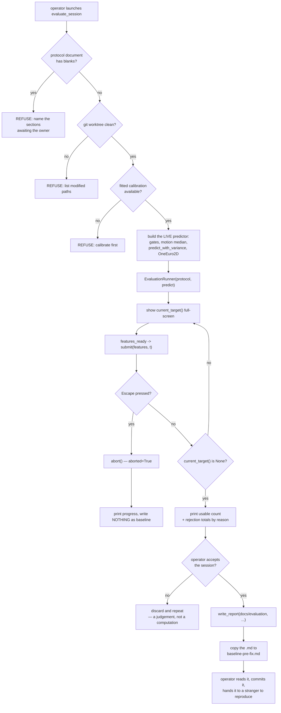

### Story 2.5: Record the pre-fix accuracy baseline under the documented protocol

**File**: `docs/plans/stories/epic-2-story-2.5-Record-Baseline.md`
**BUILDID**: CYCLE-1 | **Epic**: 2 - ACCURACY MEASUREMENT & BASELINE | **ID**: 2.5 | **Date**: 2026-08-07 | **Jira**: LOCAL | **GitHub**: LOCAL
**Wave**: 7
**Requires**: [2.3, 2.4]
**Enables**: []
**Files Touched**:
  - eye_tracker/tools/evaluate_session.py
  - tests/integration/test_evaluate_session.py
  - docs/evaluation/baseline-pre-fix.md
**Roles Ref**: `docs/requirements.md#roles--permissions-matrix` — single-actor, no role variation
**QA Candidate**: Yes — this is the one story in CYCLE-1 a person performs end to end, on a real screen with a real webcam, and its deliverable is a document whose acceptance test is human. It is Epic 2 Group 2 in the plan's QA grouping.

**Observable:** a full-screen dot appears at each protocol position in turn and advances on its own; the console then prints the usable-target count and every rejection reason with its total; on acceptance `docs/evaluation/baseline-pre-fix.md` appears beside a timestamped `.md`/`.json` pair. With a blank protocol value or uncommitted changes, **no window opens at all** and the reason is printed.
**Mechanism:** `EvaluationRunner` sequences the targets; the tool draws `current_target()` and forwards `features_ready` to `submit(features, t)`; `report.write_report` renders and writes; the `.md` is copied to the stable baseline name.
**Authz & preconditions:** single actor, no authorisation anywhere. Preconditions are the four refusals — complete protocol, clean worktree, fitted calibration, complete session — plus a person, a webcam, controlled lighting and a measured seating distance.
**Edge/idempotency:** Escape mid-session leaves an abandoned run that cannot be read as a baseline; re-running produces a **new** timestamped pair and **refuses** to replace an existing `baseline-pre-fix.md`; a session where every target is unusable is refused rather than reported. Blinking and turning away deliberately must move the matching counters — that is how QA confirms the accounting is real.
**Regression:** `python main.py` behaves exactly as before — same calibration, same overlay, same tuning, same gates. The tool is launched separately and shares no state with it.

---

#### 👤 User Reference

**Description**:

This is the story where a person sits in front of the camera and the project finally learns how accurate it is.

Everything before this built the parts: a way to score error in two units, a written-down recipe, a sequencer that walks through dots and accounts for every discarded reading, and a report generator that stamps the result with the exact version of the code. This story adds the last missing piece — **something that actually shows the dots on screen** — then runs the session and commits the result.

That missing piece is worth being blunt about. It was not in the plan. The sequencer deliberately owns no window, for a good architectural reason, and no other story built one, so the session would have had nowhere to draw. Rather than quietly widening an earlier story, the gap was recorded and this story's scope was amended to include a small on-screen session tool.

The result — the baseline — is the single most consequential document this cycle produces, because every later claim about accuracy is a comparison against it. So the story is mostly about the conditions under which it is allowed to be recorded at all:

- **The recipe must actually be filled in.** Several protocol values — how far away the person sits, the lighting, how many sessions — are still blank, awaiting the person who gets to decide them. The tool refuses to record a baseline while any blank remains, because a baseline nobody can reproduce is not a baseline.
- **The code must be committed.** If the working copy has uncommitted changes, the numbers belong to a version of the code that exists nowhere, and the comparison months later would be against nothing. The tool refuses.
- **The session must be honest about what it discarded.** If most readings were rejected, or most dots produced nothing usable, that shows in the record — and a session that produced too little is thrown away and repeated rather than reported.

And one thing that is deliberately *not* a refusal: the accuracy number itself. There is no target to hit. Whatever it turns out to be is the baseline. The only wrong outcome here is an unreproducible one.

⚠️ **This story cannot be completed by an agent.** It needs a person, a webcam, controlled lighting, a measured seating distance, and the protocol values that have not yet been supplied. Everything else in the cycle can be built and tested without hardware; this cannot, and pretending otherwise would produce a fabricated baseline — the worst possible artifact for this project to hold.

**Acceptance Criteria** (plain-English):

- A small tool exists that shows each dot from the protocol full-screen, one at a time, and feeds the tracker's readings to the sequencer.
- It wires up exactly the same prediction path the running application uses, so what is measured is what a user experiences.
- It refuses to record a baseline while any protocol value is still blank.
- It refuses to record a baseline when the working copy has uncommitted changes.
- It refuses when the session did not finish, or produced too few usable dots.
- It saves the report and its machine-readable companion, and copies the report to the agreed baseline filename.
- Pressing Escape abandons the session cleanly, and what it leaves behind cannot be mistaken for a finished measurement.
- The finished baseline document states the error in both units, the full recipe actually used, and the exact commit measured against.
- A person who was not present can read the baseline and repeat the session from it alone — this, not the number, is the acceptance test.
- The tool is launched separately and changes nothing about how the application itself behaves.
- Every reading the session discarded is visible in the record, by reason.
- Nothing in the tool invents a protocol value, a seating distance, or a number of any kind.

**User Flow**:

**User Journey** — one actor, `Local User`, acting as the session operator and the participant.

- **Prepare** — The operator confirms the protocol document has no blanks left, commits any outstanding work so the tree is clean, measures the seating distance with a tape, sets the lighting to what the protocol states, and notes the camera model. Nothing starts until these are true.
- **Calibrate** — The operator launches the application normally and completes a calibration, because the measurement scores a *fitted* model. A failed or abandoned calibration means starting over; nothing is measured against an unfitted model.
- **Launch the session** — With the calibration in place, the operator starts the evaluation tool. It re-checks the two refusals (blank protocol values, dirty worktree) **before** the first dot appears, so a doomed session is never performed.
- **Fixate** — A dot appears full-screen. The participant looks at it and holds still. After the protocol's pause the tool begins collecting; the dot advances on its own once enough readings are gathered, or after the timeout. The participant does not press anything.
- **Abandon (optional)** — Escape ends the session immediately. The tool reports how far it got, writes nothing as a baseline, and says plainly that the run was abandoned.
- **Review** — At the end the tool prints how many dots were usable and the totals of every discarded reading, by reason. The operator decides whether the session was good enough. A session with too few usable dots is discarded and repeated — that is a judgement, not a computation.
- **Record** — On acceptance the tool writes the timestamped report pair and copies the report to `docs/evaluation/baseline-pre-fix.md`. The operator reads it and commits it.
- **Hand over** — The operator gives the baseline to someone who was not present and asks them to describe how they would repeat it. If they cannot, the document is incomplete regardless of what the numbers say, and the gap is fixed in the protocol before the baseline is trusted.

**Flow Diagram**:



---

#### 🤖 AI Agent Reference

> Audience: the DEV agent. The implementation contract — everything needed to build this story in a fresh AI session. ⚠️ The *measurement* itself cannot be performed by an agent; only the tool and its tests can be built.

**Must Read**:
- `docs/requirements.md` — **FR-10, FR-11, FR-12**, **success criterion 6** ("A gaze-error baseline exists in `docs/`, stating mean and 95th-percentile error in degrees and pixels, the full protocol, and the commit SHA measured against"), **success criterion 7**, **failure criterion 4**
- `docs/plans/stories/epic-2-story-2.3-Evaluation-Runner.md` — `EvaluationRunner`, and its recorded consequence that the predictor is **injected** because no `LivePipeline` exists
- `docs/plans/stories/epic-2-story-2.4-Baseline-Report.md` — `read_git_state`, `write_report`, and every refusal it already owns
- `docs/plans/stories/epic-2-story-2.2-Evaluation-Protocol.md` — `unresolved_placeholders`, `Protocol.from_dict`, `SignalRecord`
- 🔴 `main.py:87-126` — the live chain to reproduce **exactly**: gates → `_motion_score` → median over a 2/3/5-frame window → `predict_with_variance` → finite check → `OneEuro2D.filter(..., variance=var, motion=motion)`
- `main.py:35` — `OneEuro2D(min_cutoff=1.6, beta=0.06)`, the tuning `SignalRecord` must record
- `eye_tracker/overlay.py:82-150` — `CalibrationWindow`: the frameless full-screen pattern, `showFullScreen()` vs the macOS `show()` workaround, and the `_grid` layout to reuse for the protocol's coordinates
- `eye_tracker/tracker.py` — `GazeTracker`, `features_ready`, `_open_capture`, and the resolved index/backend to record
- `docs/architecture/design/03-patterns-and-standards-brownfield.md` — **§1** (`tools/` is **INFRASTRUCTURE**, so PyQt6 and `overlay` are permitted here), **§10** (GUI-thread affinity), **§16**
- `docs/ui-ux/ui-ux-spec.md` — design tokens; the session surface should not invent its own colours
- `SPEC/references/` — **0 files**

**Description**:

Success criterion 6 requires a baseline to *exist in `docs/`* with both unit sets, the full protocol and the commit SHA. This story produces it, and produces the one thing CYCLE-1 was missing to be able to.

🔴 **Finding 1 — a scope gap in the approved graph, corrected rather than absorbed.** Story 2.3's `EvaluationRunner` is APPLICATION layer and therefore **cannot own a window**; that is enforced by Story 1.4's import test, not a preference. No other story builds a presentation surface. The original `files_touched` for this story listed **only** `docs/evaluation/baseline-pre-fix.md`, which is unbuildable: there was nothing to draw the dots. `dependency-graph.yml` and the plan index were amended to add `eye_tracker/tools/evaluate_session.py` and its test. `tools/` is **INFRASTRUCTURE** per patterns §1, so it may import PyQt6 and `overlay`, and `tools/__init__.py` already exists from Story 1.1 — so the correction adds a file, not a layer violation. ⚠️ Recorded here and in the graph rather than quietly widening Story 2.3.

🔴 **Finding 2 — the tool must reproduce `main.py:87-126` exactly, and that duplication is the price of CYCLE-1's zero-source-change rule.** The live chain is: the five gates, `_motion_score`, a median over the last 2/3/5 feature vectors depending on motion, `predict_with_variance`, a finite check, then `OneEuro2D.filter(x, y, variance=var, motion=motion)`. It lives in `AppController`, which is in `main.py` — **ENTRY** layer — and CYCLE-1 must not modify it. So the tool duplicates it. ⚠️ That duplication is a **defect with a scheduled fix**: DR-6 extracts `LivePipeline` at M6 (CYCLE-4), at which point the tool must switch to it. Two ACs make the duplication auditable rather than invisible: the tool records `prediction_chain_source` naming both files, and a test asserts the duplicated constants match `main.py`'s so they cannot drift silently.

🔴 **Finding 3 — the two refusals must fire before the first dot, not after the session.** A doomed session performed on a person is not recoverable: they have already sat still for 72 seconds. Measured from the shipped parameters, a 25-target session at 60 samples and 30 fps costs **72.5 s typically and up to 135 s**, and it cannot be resumed. So `unresolved_placeholders()` and the dirty-worktree check run **before** the window opens.

⚠️ **Finding 4 — the accuracy number is not an acceptance criterion, and must not become one.** There is no target. Requirements set the bar as *measurement*, not a value: success criteria 6 and 7 require a documented protocol, a baseline against a SHA, and a later delta with a CI. The only failure available to this story is an **unreproducible** baseline. An AC therefore forbids any threshold on the measured error — a tool that refuses a "bad" number would silently select flattering sessions, which is the same bias Story 2.3 refused in the relaxed fallback, moved up a level.

⚠️ **Finding 5 — this story is blocked by B-2 and will stay blocked until the requirements owner answers.** Requirements open item 3 (seating distance, lighting, target count, session count) has no values. Stories 2.2 and 2.4 were built so that the block is *visible*: the protocol document carries machine-detectable blanks and every report prints them. This story is where the block becomes fatal, by design — AC 6 refuses to record a baseline while any blank remains. **The tool and its tests can be delivered now; the artifact cannot.**

**Acceptance Criteria** (technical):

1. `eye_tracker/tools/evaluate_session.py` exists with a module docstring declaring `Layer: infrastructure` on the line after the summary.
2. It is launched separately (`python -m eye_tracker.tools.evaluate_session`) and is **not** wired into `main.py`. 🔴 CYCLE-1 makes zero application source changes; the architecture's `--evaluate` flag belongs to a later cycle.
3. A full-screen frameless window presents `runner.current_target()` one target at a time, reusing `CalibrationWindow`'s established pattern from `overlay.py:94-128` — including the **macOS `show()` + `raise_()` + `activateWindow()`** path instead of `showFullScreen()`, with the observed symptom cited as `overlay.py:119-121` documents it.
4. Colours, sizes and the target ring come from the design tokens in `docs/ui-ux/ui-ux-spec.md`. 🔴 The session surface does not invent its own palette; the spec's measured contrast work exists precisely so it need not.
5. 🔴 The predictor passed to `EvaluationRunner` reproduces `main.py:87-126` **exactly**: the five gates, `_motion_score`, the 2/3/5-frame median window keyed on the same motion thresholds (`22.0`, `10.0`), `predict_with_variance`, the finite check, and `OneEuro2D(min_cutoff=1.6, beta=0.06).filter(x, y, variance=var, motion=motion)`.
6. 🔴 A test asserts the duplicated constants — the gate thresholds, the motion thresholds, the window sizes and the smoother tuning — are **equal to the values read from `main.py`**, so the copy cannot drift from the original silently. ⚠️ Tests may import `main`; `eye_tracker/` may not.
7. ⚠️ The module docstring records that this duplication is a **defect with a scheduled fix**: DR-6 extracts `LivePipeline` at M6 (CYCLE-4), and this tool must then delete its copy and call it. Without that note the copy reads as a design choice.
8. 🔴 **Refusal 1 — incomplete protocol.** Before the window opens, `unresolved_placeholders(protocol_doc)` must be empty. If not, the tool exits non-zero naming every section still awaiting the requirements owner, and records nothing.
9. 🔴 **Refusal 2 — dirty worktree.** Before the window opens, `read_git_state(repo_root)` must report `dirty=False`. If not, the tool exits non-zero listing the modified paths. ⚠️ Story 2.4's *report* only warns; recording **the** baseline is where a dirty tree becomes fatal, so a diagnostic run stays possible mid-development.
10. Both refusals run **before** any dot is shown. A 25-target session costs **72.5 s typically and up to 135 s** of a person's stillness and cannot be resumed — so a doomed session must never be performed.
11. **Refusal 3 — no fitted calibration.** The tool exits non-zero with instructions to calibrate first. It never fits a model itself: scoring a model this tool fitted would measure a different thing from what the application produces.
12. **Refusal 4 — incomplete session.** If `MeasurementSet.complete` is `False`, no baseline is written. `write_report` already raises; the tool must surface that as a clear message, not a traceback.
13. Escape aborts: `runner.abort()`, the window closes, the tool prints how many targets were reached, and writes **nothing** as a baseline. 🔴 What it leaves behind must be unmistakably an abandoned run (Story 2.3's `aborted` flag is what makes that true).
14. 🔴 **No threshold on the measured error, anywhere.** The tool must not refuse, warn about, or grade the accuracy figure. There is no target; the requirements set the bar as measurement, not a value. A tool that rejected "bad" numbers would silently select flattering sessions.
15. After a complete session the tool prints the usable-target count and the rejection totals **by reason** before writing anything, so the operator judges the session on evidence.
16. Whether a session is good enough is the **operator's** decision, not a computed one, and the tool asks rather than deciding. ⚠️ The one exception is AC 12's hard refusal on an incomplete session, which is a fact rather than a judgement.
17. On acceptance the tool calls `write_report(docs/evaluation, ...)` and then **copies** the `.md` to `docs/evaluation/baseline-pre-fix.md`. Both the timestamped pair and the stable name persist: the timestamped pair is the immutable record, the stable name is what FR-12 and CYCLE-5 look for.
18. The copy uses the same atomic temp-then-replace as `report.py` (`face_mesh.py:56-71`'s pattern) and **refuses** if `baseline-pre-fix.md` already exists, so an existing baseline can never be silently replaced.
19. The `Protocol` is loaded from a committed JSON record, not constructed inline in the tool — so the values the session ran with are the ones under review, and no protocol value is expressible in code.
20. 🔴 **The tool invents nothing.** No seating distance, no screen dimensions, no lighting description, no camera model, no target count. Every one is read from the protocol record or a required command-line argument; a missing value is a refusal, never a default.
21. The camera record is populated from the **resolved** capture: `GazeTracker`'s actually-opened index, the backend name via `cv2.videoio_registry.getBackendName()`, and the frame size and rate read back with `cap.get(...)` after opening — never the requested values.
22. `SignalRecord` is populated with `scored_signal="smoothed"`, the smoother tuning from AC 5, and a `prediction_chain_source` naming **both** `main.py:87-126` and this tool, so the duplication is on the record.
23. 🔴 The tool is driven from the **GUI thread**, connecting to `features_ready` exactly as `AppController` does (patterns §10). It introduces no shared mutable state across the capture boundary and constructs no receiver off the GUI thread — failure criterion 10.
24. 🔴 **No camera frame, landmark array or feature vector is written, logged or printed** at any level above DEBUG. Patterns §3; and the tool's output is committed.
25. `tests/integration/test_evaluate_session.py` runs offscreen (`QT_QPA_PLATFORM=offscreen`) with Story 1.3's stub tracker and synthetic feature vectors, and covers: all four refusals, the Escape path, the constant-drift check from AC 6, and that no threshold is applied to the error figure.
26. ⚠️ The tests exercise the **wiring**, not the measurement. A real session needs a camera and a person; the test asserts the tool refuses correctly, wires the live chain identically, and writes the right files — not that any particular accuracy is achieved.
27. `docs/evaluation/baseline-pre-fix.md` is committed, and contains: mean and 95th-percentile error in **both** degrees and pixels, the full protocol as actually run, the resolved commit SHA, the gate thresholds, the per-target table, and the rejection ledger. This is success criterion 6, verbatim.
28. 🔴 The baseline records the protocol values **actually used**, not the document's intent — the seating distance measured on the day, the real camera, the real lighting. If they differ from the protocol, the protocol is corrected and the session is repeated; the mismatch is never absorbed into the record.
29. `ruff check` and `ruff format --check` clean; functions ≤30 statements; NumPy docstrings on the public surface.
30. 🔴 **Zero modification to existing application source** — `git diff --stat -- main.py eye_tracker/overlay.py eye_tracker/tracker.py eye_tracker/gaze.py eye_tracker/calibration.py eye_tracker/face_mesh.py eye_tracker/one_euro.py eye_tracker/evaluation/` empty.
31. The hand-over check from the User Journey is performed and its outcome recorded: a person who was not present reads the baseline and states how they would repeat it. 🔴 If they cannot, FR-11 is **not met** regardless of the numbers, and the protocol is fixed before the baseline is trusted.
32. The duplication from Finding 2 and the graph amendment from Finding 1 are recorded as open items for the architecture owner.

**RBAC Enforcement**:

`No role-differentiated access — single actor.`

- **Enforcement point(s)**: none. The operator and the participant are the same single actor, `Local User`; the tool adds no route and no authority check.
- **Denied-access contract**: N/A — no request surface exists. The four refusals are *precondition* refusals, not authorisation refusals. In particular the recorded SHA is an **attribution record, not a signature**, and the clean-worktree requirement is a reproducibility control rather than a tamper control.
- **Scope derivation**: **N/A — no scoped permission exists, and there is no token or session to derive scope from.** The binding discipline is data minimisation (patterns §3), at its highest stakes in this story: it is the only one that puts a live camera and a committed document in the same process. AC 24 is what keeps a biometric array out of the artifact, and AC 28 keeps the record truthful about a real person's session without describing the person.

**System responses + error cases**:

| Trigger | Response | Side-effect |
|---|---|---|
| `python -m eye_tracker.tools.evaluate_session` with every precondition met | Full-screen session runs; console reports usable count and rejection totals; operator is asked whether to record | Timestamped `.md` + `.json` and `baseline-pre-fix.md` on acceptance |
| Re-run after a baseline exists (idempotent-repeat) | A **new** timestamped pair is written; the tool **refuses** to replace `baseline-pre-fix.md` | Nothing overwritten. AC 18 — an existing baseline is never silently replaced |
| A protocol value is still a blank | Exits non-zero naming every section awaiting the requirements owner; **no window created** | Nothing written. AC 8, AC 10 |
| Working tree is dirty | Exits non-zero listing the modified paths; **no window created** | Nothing written. AC 9 — Story 2.4's report only *warns*; recording the baseline is where it is fatal |
| No fitted calibration available | Exits non-zero telling the operator to calibrate first | Nothing written. AC 11 — never fits a model itself |
| Escape pressed mid-session | `runner.abort()`, window closes, console reports targets reached | **No baseline written**; the run is unmistakably abandoned. AC 13 |
| Session ends incomplete for any other reason | Clear message, not a traceback; no baseline | Nothing written. AC 12 |
| Every target unusable | Refused — `to_metric_pairs()` raises and the tool surfaces it | Nothing written |
| The measured error is very large | **Recorded unchanged.** No threshold, no warning, no grade | ⚠️ AC 14 — a tool that rejected "bad" numbers would silently select flattering sessions |
| Participant blinks through a target | `blink` count rises; if the target falls short it is **unusable**, never padded | None. Story 2.3's AC 12 |
| Participant turns away through a target | `head_yaw` count rises; the target is unusable with that reason | None |
| The protocol values used on the day differ from the document | The protocol is **corrected and the session repeated** | ⚠️ AC 28 — the mismatch is never absorbed into the record |
| `python main.py` after this story | Application behaves exactly as before | None (AC 30) |

**QA-observable behaviour**:

- **Observable:** A full-screen dot appears at each protocol position in turn and advances on its own; at the end the console prints the usable count and every rejection reason with its total; on acceptance `docs/evaluation/baseline-pre-fix.md` appears alongside a timestamped `.md`/`.json` pair. With a blank protocol value, or with uncommitted changes, **no window opens at all** and the reason is printed.
- **Mechanism:** `EvaluationRunner` sequences the targets; the tool draws `current_target()` and forwards `features_ready` to `submit(features, t)`; `report.write_report` renders and writes; the `.md` is copied to the stable baseline name.
- **Authz & preconditions:** single actor, no authorisation. Preconditions are the four refusals — complete protocol, clean worktree, fitted calibration, complete session — plus a person, a webcam, controlled lighting and a measured seating distance.
- **Edge/idempotency:** Escape mid-session leaves an abandoned run that cannot be read as a baseline. Re-running produces a **new** timestamped pair and **refuses** to replace an existing `baseline-pre-fix.md`. A session where every target is unusable is refused rather than reported. Blinking and turning away deliberately must move the corresponding rejection counters — that is how QA verifies the accounting is real.
- **Regression:** `python main.py` behaves exactly as before — same calibration, same overlay, same tuning. The tool is launched separately and shares no state with it. **What does NOT change**: the application's windows, its gates, its smoother tuning, and its calibration flow are all untouched; nothing about the running product looks different after this story.

**Prerequisites**:

- **Stories 2.1 – 2.4 complete.**
- 🔴 **Requirements open item 3 (B-2) resolved.** Seating distance, lighting, target count and session count must be supplied and the protocol document's blanks filled. **The tool can be built and tested without this; the baseline cannot be recorded.** AC 8 is the enforcement.
- 🔴 **A clean worktree** at measurement time (AC 9).
- 🔴 **A person, a webcam, controlled lighting, a tape measure**, and a completed calibration. ⚠️ **No agent can satisfy these.** This is one of the two human-gated days in the programme; the other is CYCLE-5's re-measure, which must use the **identical** protocol or success criterion 7 is unverifiable.
- ⚠️ The FR-33 eye-pairing answer (Story 1.1) should be known first. If the eye signals are crossed, per-eye quality weighting is invalid, which changes the fused prediction this story measures — so a baseline recorded before FR-33 is answered may be measuring a model nobody intends to keep.

**Context** (read before writing):
- `main.py:87-126` — the chain to reproduce, constant by constant
- `main.py:30-51` — how `AppController` constructs the tracker, calibrator and smoother, and connects `features_ready`
- `eye_tracker/overlay.py:82-150` — the full-screen frameless pattern, the macOS workaround, `_grid`
- `eye_tracker/tracker.py` — `GazeTracker`, the resolved index and backend to record
- `eye_tracker/evaluation/runner.py`, `report.py`, `protocol.py`, `metrics.py` — everything this story composes
- `docs/ui-ux/ui-ux-spec.md` — tokens for the target ring and background
- `docs/requirements.md` — success criteria 6 and 7, failure criteria 4 and 10

**Patterns**:
- **Project Structure** `[Current — kept + extended]` — patterns §1. A diagnostic tool belongs in `eye_tracker/tools/`, which is INFRASTRUCTURE and may import Qt. This is the same placement Story 1.1 established for the eye-pairing tool.
- **Concurrency & Thread Affinity** `[Current — kept]` — patterns §10. Connect to `features_ready` from the GUI thread exactly as `AppController` does; add no shared mutable state across the capture boundary (failure criterion 10).
- **Platform workarounds documented with their observed symptom** — `05-overlay-deep-dive.md`. The macOS `showFullScreen()` behaviour is copied **with** its comment, not just its code.
- **Persistence & File I/O** `[Current — kept + extended]` — patterns §4. The baseline copy is atomic temp-then-replace, as `face_mesh.py:56-71`.
- **Documentation Standards** `[New adoption]` — patterns §16. The duplication note (AC 7) and the "no threshold" rule (AC 14) both state what would change them.

**Steps**:

1. **Check the preconditions before opening any window.** Load the committed protocol JSON, read the protocol document, run `unresolved_placeholders`, run `read_git_state`, confirm a fitted calibration is available. Any failure exits non-zero with the specific reason and shows nothing. ⚠️ Order matters: the cheapest, most likely refusals first, so the operator learns in a second rather than after a minute of setup.

2. **Build the live predictor as a faithful copy of `main.py:87-126`**, with every duplicated constant named as a module-level constant so AC 6's drift test can read it, and the `LivePipeline` migration note (AC 7) in the docstring.

3. **Present the targets.** A frameless, always-on-top, full-screen window using `overlay.py:94-128`'s pattern including the macOS branch and its comment; draw `runner.current_target()` with the spec's tokens; connect `features_ready` to a slot that calls `runner.submit(features, time.monotonic())` and repaints when the target advances; bind Escape to `abort()`.

4. **Report the session to the operator** — usable count and rejection totals by reason — then ask whether to record it. Print no grade and apply no threshold to the error (AC 14).

5. **Write the artifacts** — `write_report(...)` for the timestamped pair, then the atomic copy to `docs/evaluation/baseline-pre-fix.md`, refusing if it exists.

6. **Run the session** (human). Follow the User Journey. Record the protocol values *as actually used*.

7. **Hand the baseline to someone who was not present** and ask them to describe repeating it. Record the outcome. Fix the protocol if they cannot.

8. **Run the gate.**

   ```bash
   QT_QPA_PLATFORM=offscreen pytest tests/integration/test_evaluate_session.py -v
   pytest tests/arch/ -v
   ruff check eye_tracker/tools/ tests/
   ruff format --check eye_tracker/tools/ tests/
   git diff --stat -- main.py eye_tracker/overlay.py eye_tracker/tracker.py \
       eye_tracker/gaze.py eye_tracker/calibration.py eye_tracker/face_mesh.py \
       eye_tracker/one_euro.py eye_tracker/evaluation/
   git status --porcelain      # MUST be empty before the session (AC 9)
   ```

**Tests**:

| Test | Locks |
|---|---|
| `test_refuses_while_the_protocol_document_has_blanks` | AC 8 — and that no window is constructed |
| `test_refuses_on_a_dirty_worktree` | AC 9 |
| `test_refuses_without_a_fitted_calibration` | AC 11 |
| `test_refusals_run_before_any_window_is_created` | AC 10 — a doomed session is never performed on a person |
| `test_escape_aborts_and_writes_no_baseline` | AC 13 |
| `test_incomplete_session_is_refused` | AC 12 |
| `test_live_chain_constants_match_main_py` | AC 6 — imports `main` and compares gate, motion, window and smoother constants |
| `test_no_threshold_is_applied_to_the_error_figure` | AC 14 — a deliberately terrible predictor still records |
| `test_signal_record_names_both_chain_sources` | AC 22 |
| `test_camera_record_uses_resolved_not_requested_values` | AC 21 |
| `test_existing_baseline_is_never_overwritten` | AC 18 |
| `test_timestamped_pair_and_stable_name_both_exist` | AC 17 |
| `test_no_feature_vector_reaches_any_artifact_or_log` | AC 24 |

Manual test cases — 🔴 several require hardware and a person:

| # | Case | Expected |
|---|---|---|
| 1 | Run with one protocol blank remaining | Exits non-zero naming the section; **no window appears** |
| 2 | Run with an uncommitted change | Exits non-zero listing the modified paths; no window |
| 3 | Run without calibrating first | Exits non-zero telling the operator to calibrate |
| 4 | 🔴 Full session with a person, then Escape at target 5 | Session ends immediately; console reports 5 of N; no baseline written |
| 5 | 🔴 Full session, blink deliberately through two targets | Those targets show a raised `blink` count; if they fall short they are marked unusable, never padded |
| 6 | 🔴 Full session, turn the head away through one target | `head_yaw` count rises; the target is unusable with that reason |
| 7 | 🔴 Complete session accepted | Timestamped `.md` + `.json` written **and** `baseline-pre-fix.md` created |
| 8 | Re-run after a baseline exists | Refuses to replace it; the timestamped pair is still written |
| 9 | 🔴 Hand the baseline to someone absent and ask them to repeat it | They can, from the document alone — **the real acceptance test** |
| 10 | `python main.py` after this story | Application behaves exactly as before |
| 11 | `git diff --stat` over the existing sources | Empty |

**Quality**: `ruff check` / `ruff format --check` clean · NumPy docstrings on the public surface · functions ≤30 statements · no `TODO`/`FIXME` · no `print()` of anything derived from a feature vector · every duplicated constant named and drift-tested · no invented protocol value, seating distance or threshold · zero modification to existing application source.

**OUT**:
- ❌ **The post-fix re-measurement and the delta with its 95% CI.** FR-12, CYCLE-5 (M8). This story records the *before*.
- ❌ **Any accuracy target.** No number is a pass or a fail here (AC 14).
- ❌ **A production evaluation window or a `--evaluate` flag on the app.** The architecture names the flag, but `main.py` must not change in CYCLE-1.
- ❌ **Extracting `LivePipeline`.** DR-6 at M6 (CYCLE-4). The duplication is recorded with its removal phase instead.
- ❌ **Fitting a calibration inside the tool.** It would measure a model the application never produced.
- ❌ **Fixing anything the baseline reveals.** If the numbers are poor, that is the finding — CYCLE-2 onward is where the fixes live.
- ❌ **Supplying the protocol values.** Requirements open item 3, owned by the requirements owner. This story refuses without them.
- ❌ **Automating the hand-over check.** AC 31 is a human judgement about whether a document is reproducible, and no test can stand in for it.
- ❌ **Multi-session averaging.** `session_count` is in the protocol, but aggregating across sessions is CYCLE-5's comparison work.

**Evidence**:
- 🔴 `docs/evaluation/baseline-pre-fix.md`, committed, containing **both** unit sets, the full protocol as actually run, and the resolved commit SHA — success criterion 6.
- 🔴 The timestamped `.md` + `.json` pair beside it, and `git status --porcelain` from **immediately before** the session showing empty, proving the SHA is a real attribution.
- Transcripts of refusals **1, 2 and 3** showing no window was created.
- 🔴 Transcripts of manual cases **4, 5 and 6** — the Escape path, and the blink and head-turn counters moving. These are what show the rejection accounting is real rather than declared.
- `QT_QPA_PLATFORM=offscreen pytest tests/integration/test_evaluate_session.py -v` passing, and `pytest tests/arch/ -v` passing.
- The AC 6 drift-test output showing the duplicated constants equal to `main.py`'s.
- 🔴 The AC 31 hand-over record: who read the baseline, what they said they would do, and whether the protocol needed correcting afterwards.
- `git diff --stat` over the existing sources showing empty, and `ruff` output.
- 🔴 The AC 32 notes for the architecture owner: the `main.py:87-126` duplication with its M6 removal, and the graph amendment that added the session surface to this story.
